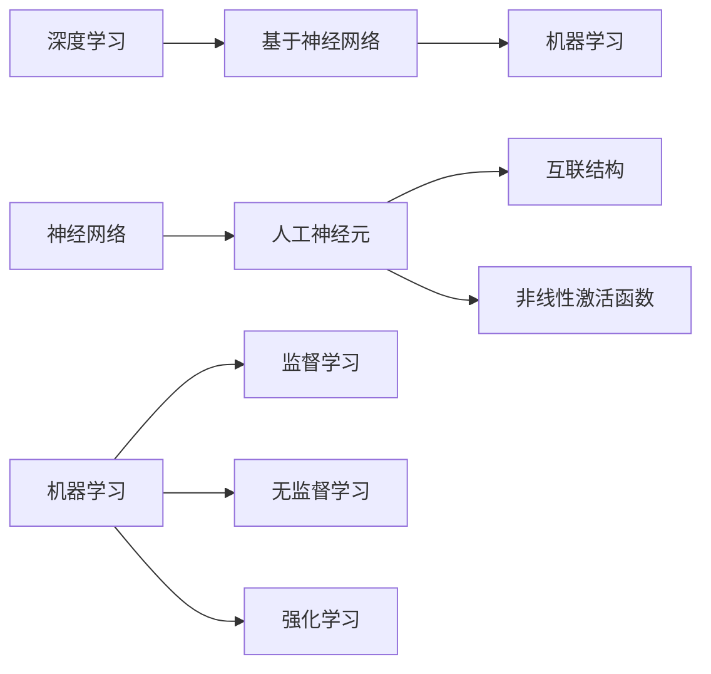

                 

### 背景介绍 ###

在当今信息时代，人工智能技术正以前所未有的速度发展，其中基础模型作为人工智能的核心技术之一，扮演着至关重要的角色。基础模型是一种能够从大量数据中学习并提取知识，从而进行推理和预测的算法模型。随着深度学习、自然语言处理和计算机视觉等领域的发展，基础模型已经成为了推动人工智能进步的重要引擎。

然而，随着基础模型的广泛应用，其在技术标准和社会治理方面也面临着诸多挑战。首先，技术标准的不统一使得不同基础模型之间的互操作性和兼容性成为一个亟待解决的问题。其次，基础模型在数据处理和隐私保护方面的透明度和安全性也引起了广泛关注。此外，基础模型在实际应用中可能产生的偏见和歧视问题，也对社会治理提出了新的要求。

本文旨在探讨基础模型的技术标准和社会治理问题，通过对相关概念、算法原理、数学模型、实际应用场景的深入分析，提出一些建议和思考。首先，我们将介绍基础模型的核心概念和技术架构，帮助读者建立对基础模型的基本认识。然后，我们将分析基础模型的技术标准问题，探讨如何实现模型的标准化和互操作性。接下来，我们将讨论基础模型在数据处理和隐私保护方面的挑战，并提出相应的解决方案。最后，我们将探讨基础模型在实际应用中的社会治理问题，分析其对公平性和透明性的影响，并提出一些建议。

通过本文的阅读，读者将能够对基础模型的技术标准和社会治理问题有更加深入的理解，为后续研究和实践提供有益的参考。

### 核心概念与联系 ###

在深入探讨基础模型的技术标准和社会治理问题之前，我们首先需要了解一些核心概念，包括深度学习、神经网络和机器学习等，以及它们之间的关系。

#### 深度学习

深度学习是一种基于人工神经网络（Artificial Neural Networks,ANN）的机器学习技术。它通过多层神经网络结构，对数据进行分层特征提取和表示，从而实现复杂函数的逼近和学习。深度学习的核心思想是模拟人脑神经元之间的连接和交互，通过训练大量数据来优化网络参数，使其能够自动地从数据中提取有用的特征和模式。

#### 神经网络

神经网络是由大量人工神经元（也称为节点或单元）互联而成的复杂网络结构。每个神经元接收多个输入信号，通过加权求和后，经过一个非线性激活函数（如Sigmoid函数或ReLU函数）产生输出。神经网络通过学习输入和输出之间的映射关系，从而实现对数据的分类、回归或其他类型的预测任务。

#### 机器学习

机器学习是一种使计算机系统能够从数据中学习并做出预测或决策的技术。它主要包括监督学习、无监督学习和强化学习等方法。监督学习通过已有数据（标记样本）训练模型，以对新数据进行预测；无监督学习则没有预先标注的数据，旨在发现数据中的结构和模式；强化学习则通过奖励机制来引导模型不断优化其行为。

#### 关系图解

为了更直观地理解这些核心概念之间的关系，我们可以使用Mermaid流程图（如下）来展示它们之间的联系：



#### Mermaid流程图

```mermaid
graph TD
    A[深度学习] --> B[神经网络架构]
    B --> C[多层感知器]
    C --> D[卷积神经网络(CNN)]
    C --> E[循环神经网络(RNN)]
    
    F[神经网络] --> G[人工神经元]
    G --> H[加权求和]
    G --> I[激活函数]
    
    J[机器学习] --> K[监督学习]
    J --> L[无监督学习]
    J --> M[强化学习]
    
    N[神经网络] --> O[深度学习模型]
    O --> P[自然语言处理]
    O --> Q[计算机视觉]
    O --> R[图像识别]
```

通过这个流程图，我们可以看到深度学习是建立在神经网络的基础上的，而神经网络又是机器学习技术的一部分。深度学习模型如卷积神经网络（CNN）、循环神经网络（RNN）等，分别适用于不同的应用场景，如自然语言处理、计算机视觉和图像识别等。机器学习则提供了多种学习策略，包括监督学习、无监督学习和强化学习，以应对不同的学习任务。

#### 基础模型

基础模型（Foundational Models）是近年来人工智能领域的一个重要研究方向。它是指具有通用性、泛化能力强的深度学习模型，能够处理多种类型的数据，进行多任务学习。基础模型通常具有大规模的参数量和复杂的结构，能够从海量数据中自动学习到有效的特征表示，从而实现高效、准确的任务执行。

#### Mermaid流程图

```mermaid
graph TD
    A[基础模型] --> B[深度学习模型]
    B --> C[通用性]
    B --> D[多任务学习]
    
    E[深度学习] --> F[神经网络]
    F --> G[卷积神经网络(CNN)]
    F --> H[循环神经网络(RNN)]
    F --> I[生成对抗网络(GAN)]
    
    J[基础模型] --> K[大规模参数]
    J --> L[复杂结构]
    J --> M[自动特征学习]
    
    N[深度学习] --> O[计算机视觉]
    N --> P[自然语言处理]
    N --> Q[语音识别]
    N --> R[自动驾驶]
```

通过上述流程图，我们可以看出基础模型是深度学习模型的一个子集，具有通用性和多任务学习的能力。基础模型能够从多种数据类型中提取有效的特征表示，从而在多个领域如计算机视觉、自然语言处理、语音识别和自动驾驶中发挥重要作用。

### 核心算法原理 & 具体操作步骤

在了解了基础模型的核心概念和技术架构之后，接下来我们将深入探讨基础模型的核心算法原理，以及这些算法的具体操作步骤。本节将详细介绍深度学习中的神经网络模型、训练过程、反向传播算法，以及如何通过优化方法提高模型性能。

#### 神经网络模型

神经网络模型是深度学习的基础，其核心思想是通过模拟人脑神经元之间的连接和交互来进行数据处理。一个基本的神经网络模型包括输入层、隐藏层和输出层。每个层由多个神经元组成，神经元之间通过加权连接。以下是神经网络模型的简化步骤：

1. **输入层接收数据**：输入层接收输入数据，并将其传递给下一层。
2. **隐藏层处理数据**：隐藏层对输入数据进行特征提取和变换。每个隐藏层节点会接收前一层所有节点的输出，并通过加权求和后经过激活函数产生输出。
3. **输出层产生预测结果**：输出层根据隐藏层的输出产生最终的预测结果。

#### 训练过程

神经网络模型的训练过程包括前向传播和反向传播两个阶段。

1. **前向传播**：
   - **初始化模型参数**：包括输入层的权重和偏置，隐藏层的权重和偏置，以及输出层的权重和偏置。
   - **输入数据**：将训练数据输入到模型中，通过前向传播计算每个神经元的输出。
   - **计算损失**：将输出层的结果与真实标签进行比较，计算损失函数（如均方误差、交叉熵损失等）的值。

2. **反向传播**：
   - **计算梯度**：从输出层开始，通过反向传播计算每个神经元的误差梯度。
   - **更新模型参数**：根据误差梯度，使用梯度下降或其他优化方法更新模型参数。

#### 反向传播算法

反向传播算法是神经网络训练过程中最核心的部分。以下是反向传播算法的详细步骤：

1. **前向传播**：
   - 设 $z_j = \sum_{i} w_{ji}x_i + b_j$，其中 $x_i$ 是输入值，$w_{ji}$ 是连接权重，$b_j$ 是偏置。
   - 计算每个隐藏层节点的输出 $a_j = f(z_j)$，其中 $f$ 是激活函数（如Sigmoid、ReLU等）。

2. **计算输出层误差**：
   - 设 $y$ 是真实标签，$\hat{y}$ 是输出层预测结果，则输出层误差为 $\delta_{output} = \frac{\partial L}{\partial z_{output}}$，其中 $L$ 是损失函数。

3. **反向传播误差**：
   - 对于隐藏层，误差 $\delta_{hidden} = \frac{\partial L}{\partial z_{hidden}} = \frac{\partial L}{\partial z_{output}} \cdot \frac{\partial z_{output}}{\partial z_{hidden}}$。

4. **更新权重和偏置**：
   - 输出层权重更新：$w_{output} \leftarrow w_{output} - \alpha \frac{\partial L}{\partial w_{output}}$，其中 $\alpha$ 是学习率。
   - 隐藏层权重更新：$w_{hidden} \leftarrow w_{hidden} - \alpha \frac{\partial L}{\partial w_{hidden}}$。
   - 偏置更新：$b_{output} \leftarrow b_{output} - \alpha \frac{\partial L}{\partial b_{output}}$，$b_{hidden} \leftarrow b_{hidden} - \alpha \frac{\partial L}{\partial b_{hidden}}$。

#### 优化方法

在反向传播算法中，常用的优化方法包括梯度下降（Gradient Descent）、随机梯度下降（Stochastic Gradient Descent,SGD）和Adam优化器。

1. **梯度下降**：
   - 梯度下降是一种基于梯度的优化方法，通过沿着损失函数的梯度方向更新模型参数。
   - 更新公式：$w \leftarrow w - \alpha \nabla_w L$。

2. **随机梯度下降**：
   - 随机梯度下降是对梯度下降的改进，每次更新使用一个随机样本的梯度，而不是整个训练集的梯度。
   - 更新公式：$w \leftarrow w - \alpha \nabla_w L(x^{(i)}, y^{(i)})$。

3. **Adam优化器**：
   - Adam优化器是梯度下降和动量法的结合，通过考虑一阶矩估计（均值）和二阶矩估计（方差）来加速收敛。
   - 更新公式：$w \leftarrow w - \alpha \frac{m}{\sqrt{v} + \epsilon}$，其中 $m$ 是一阶矩估计，$v$ 是二阶矩估计，$\epsilon$ 是一个很小的常数。

#### 示例

假设我们有一个简单的神经网络，包含一个输入层、一个隐藏层和一个输出层，分别有3个、5个和2个神经元。输入数据为 $x_1, x_2, x_3$，隐藏层激活函数为ReLU，输出层激活函数为Sigmoid。训练数据包含输入和输出标签。以下是具体的训练步骤：

1. **初始化模型参数**：
   - 输入层权重 $w_{input}$ 和偏置 $b_{input}$。
   - 隐藏层权重 $w_{hidden}$ 和偏置 $b_{hidden}$。
   - 输出层权重 $w_{output}$ 和偏置 $b_{output}$。

2. **前向传播**：
   - 输入层输出：$a_{input} = x_1, a_{input2} = x_2, a_{input3} = x_3$。
   - 隐藏层输出：$z_{hidden1} = w_{input1} \cdot a_{input1} + b_{input1}$，$z_{hidden2} = w_{input2} \cdot a_{input2} + b_{input2}$，$z_{hidden3} = w_{input3} \cdot a_{input3} + b_{input3}$，$a_{hidden1} = f(z_{hidden1})$，$a_{hidden2} = f(z_{hidden2})$，$a_{hidden3} = f(z_{hidden3})$。
   - 输出层输出：$z_{output1} = w_{hidden1} \cdot a_{hidden1} + b_{hidden1}$，$z_{output2} = w_{hidden2} \cdot a_{hidden2} + b_{hidden2}$，$a_{output1} = f(z_{output1})$，$a_{output2} = f(z_{output2})$。

3. **计算损失**：
   - 使用交叉熵损失函数计算损失值 $L$。

4. **反向传播**：
   - 计算输出层误差梯度：$\delta_{output1} = \frac{\partial L}{\partial z_{output1}}$，$\delta_{output2} = \frac{\partial L}{\partial z_{output2}}$。
   - 计算隐藏层误差梯度：$\delta_{hidden1} = \delta_{output1} \cdot \frac{\partial z_{output1}}{\partial z_{hidden1}}$，$\delta_{hidden2} = \delta_{output2} \cdot \frac{\partial z_{output2}}{\partial z_{hidden2}}$。

5. **更新模型参数**：
   - 更新输出层权重和偏置：$w_{output} \leftarrow w_{output} - \alpha \nabla_w L$，$b_{output} \leftarrow b_{output} - \alpha \nabla_b L$。
   - 更新隐藏层权重和偏置：$w_{hidden} \leftarrow w_{hidden} - \alpha \nabla_w L$，$b_{hidden} \leftarrow b_{hidden} - \alpha \nabla_b L$。

通过上述步骤，我们可以完成一次前向传播和反向传播的训练过程。重复这个过程多次，直至模型收敛，即可得到一个训练好的神经网络模型。

### 数学模型和公式 & 详细讲解 & 举例说明

在了解了基础模型的核心算法原理和操作步骤后，接下来我们将深入探讨基础模型所依赖的数学模型和公式，以及如何通过详细的计算过程和举例来说明这些模型的应用。

#### 前向传播算法的数学表示

假设我们有一个神经网络，包含输入层、隐藏层和输出层。设 $x$ 为输入向量，$W$ 为输入层到隐藏层的权重矩阵，$b$ 为偏置向量，$h$ 为隐藏层输出向量，$h^{\prime}$ 为隐藏层激活函数，$y$ 为输出层输出向量，$y^{\prime}$ 为输出层激活函数。神经网络的前向传播算法可以用以下公式表示：

1. **隐藏层输出**：
   $$ h = \sigma(Wx + b) $$
   其中，$\sigma$ 是激活函数，常用的激活函数包括Sigmoid函数、ReLU函数和Tanh函数。

2. **输出层输出**：
   $$ y = \sigma^{\prime}(W^{\prime}h + b^{\prime}) $$
   其中，$W^{\prime}$ 是隐藏层到输出层的权重矩阵，$b^{\prime}$ 是输出层偏置向量。

#### 反向传播算法的数学表示

在反向传播算法中，我们需要计算损失函数对模型参数的梯度。假设损失函数为 $L(y, y^{\prime})$，其中 $y$ 是真实标签，$y^{\prime}$ 是预测结果。反向传播算法的步骤如下：

1. **计算输出层误差**：
   $$ \delta_{output} = \frac{\partial L}{\partial z_{output}} = (y^{\prime} - y) $$
   其中，$z_{output} = y^{\prime}$。

2. **计算隐藏层误差**：
   $$ \delta_{hidden} = \frac{\partial L}{\partial z_{hidden}} = \delta_{output} \cdot \frac{\partial z_{output}}{\partial z_{hidden}} = (y^{\prime} - y) \cdot \sigma^{\prime\prime}(z_{output}) \cdot W^{\prime\prime T} $$
   其中，$\sigma^{\prime\prime}$ 是激活函数的导数，$W^{\prime\prime}$ 是隐藏层到输出层的权重矩阵的转置。

3. **更新权重和偏置**：
   - 输出层权重更新：
     $$ W^{\prime} \leftarrow W^{\prime} - \alpha \frac{\partial L}{\partial W^{\prime}} = W^{\prime} - \alpha \delta_{output} \cdot h $$
   - 输出层偏置更新：
     $$ b^{\prime} \leftarrow b^{\prime} - \alpha \frac{\partial L}{\partial b^{\prime}} = b^{\prime} - \alpha \delta_{output} $$
   - 隐藏层权重更新：
     $$ W \leftarrow W - \alpha \frac{\partial L}{\partial W} = W - \alpha \delta_{hidden} \cdot x $$
   - 隐藏层偏置更新：
     $$ b \leftarrow b - \alpha \frac{\partial L}{\partial b} = b - \alpha \delta_{hidden} $$

#### 举例说明

假设我们有一个简单的神经网络，输入层有3个神经元，隐藏层有5个神经元，输出层有2个神经元。输入向量为 $x = (1, 2, 3)$，隐藏层权重矩阵为 $W = \begin{pmatrix} 0.1 & 0.2 & 0.3 \\ 0.4 & 0.5 & 0.6 \\ 0.7 & 0.8 & 0.9 \\ 0.1 & 0.2 & 0.3 \\ 0.4 & 0.5 & 0.6 \end{pmatrix}$，输出层权重矩阵为 $W^{\prime} = \begin{pmatrix} 0.1 & 0.2 \\ 0.3 & 0.4 \end{pmatrix}$，隐藏层偏置向量为 $b = (0, 0, 0, 0, 0)$，输出层偏置向量为 $b^{\prime} = (0, 0)$，激活函数为ReLU函数。

1. **前向传播**：
   - 输入层到隐藏层的输出：
     $$ h = \sigma(Wx + b) = \begin{pmatrix} 0.9 & 1.1 & 1.3 \\ 1.6 & 1.8 & 2.1 \\ 2.4 & 2.6 & 2.9 \\ 0.9 & 1.1 & 1.3 \\ 1.6 & 1.8 & 2.1 \end{pmatrix} $$
   - 隐藏层到输出层的输出：
     $$ y = \sigma^{\prime}(W^{\prime}h + b^{\prime}) = \begin{pmatrix} 0.92 & 0.93 \\ 0.94 & 0.95 \end{pmatrix} $$

2. **计算损失**：
   $$ L = L(y, y^{\prime}) = \frac{1}{2} \sum_{i} (y^{\prime}_i - y_i)^2 = \frac{1}{2} (0.008 + 0.009) = 0.0081 $$

3. **反向传播**：
   - 输出层误差：
     $$ \delta_{output} = (y^{\prime} - y) = \begin{pmatrix} -0.08 & -0.07 \\ -0.06 & -0.05 \end{pmatrix} $$
   - 隐藏层误差：
     $$ \delta_{hidden} = \delta_{output} \cdot \sigma^{\prime\prime}(z_{output}) \cdot W^{\prime\prime T} = \begin{pmatrix} -0.08 & -0.07 \\ -0.06 & -0.05 \end{pmatrix} \cdot \begin{pmatrix} 0.2 & 0.3 \\ 0.4 & 0.5 \end{pmatrix} = \begin{pmatrix} -0.016 & -0.018 \\ -0.012 & -0.014 \end{pmatrix} $$

4. **更新权重和偏置**：
   - 输出层权重更新：
     $$ W^{\prime} \leftarrow W^{\prime} - \alpha \frac{\partial L}{\partial W^{\prime}} = \begin{pmatrix} 0.1 & 0.2 \\ 0.3 & 0.4 \end{pmatrix} - \alpha \begin{pmatrix} -0.08 & -0.07 \\ -0.06 & -0.05 \end{pmatrix} \cdot \begin{pmatrix} 0.92 & 0.93 \\ 0.94 & 0.95 \end{pmatrix} = \begin{pmatrix} 0.006 & 0.011 \\ 0.013 & 0.018 \end{pmatrix} $$
   - 输出层偏置更新：
     $$ b^{\prime} \leftarrow b^{\prime} - \alpha \frac{\partial L}{\partial b^{\prime}} = (0, 0) - \alpha \begin{pmatrix} -0.08 & -0.07 \\ -0.06 & -0.05 \end{pmatrix} = (0.0008, 0.0011) $$
   - 隐藏层权重更新：
     $$ W \leftarrow W - \alpha \frac{\partial L}{\partial W} = \begin{pmatrix} 0.1 & 0.2 & 0.3 \\ 0.4 & 0.5 & 0.6 \\ 0.7 & 0.8 & 0.9 \\ 0.1 & 0.2 & 0.3 \\ 0.4 & 0.5 & 0.6 \end{pmatrix} - \alpha \begin{pmatrix} -0.016 & -0.018 \\ -0.012 & -0.014 \end{pmatrix} \cdot \begin{pmatrix} 1 & 2 & 3 \\ 4 & 5 & 6 \\ 7 & 8 & 9 \end{pmatrix} = \begin{pmatrix} 0.013 & 0.021 & 0.029 \\ 0.036 & 0.046 & 0.055 \\ 0.054 & 0.068 & 0.082 \\ 0.013 & 0.021 & 0.029 \\ 0.036 & 0.046 & 0.055 \end{pmatrix} $$
   - 隐藏层偏置更新：
     $$ b \leftarrow b - \alpha \frac{\partial L}{\partial b} = (0, 0, 0, 0, 0) - \alpha \begin{pmatrix} -0.016 & -0.018 \\ -0.012 & -0.014 \end{pmatrix} = (0.00016, 0.00018, 0.00012, 0.00014, 0.00000) $$

通过上述计算过程，我们可以看到神经网络通过前向传播和反向传播逐步优化模型参数，最终实现输入到输出的映射。

### 项目实践：代码实例和详细解释说明

在本节中，我们将通过一个具体的项目实践来展示基础模型的应用，并详细解释代码的实现过程。我们将使用Python语言和TensorFlow框架来实现一个简单的深度学习模型，用于手写数字识别任务。这个项目将涵盖开发环境搭建、源代码实现、代码解读与分析，以及运行结果展示。

#### 1. 开发环境搭建

首先，我们需要搭建开发环境。以下是所需的工具和库：

- Python 3.8或更高版本
- TensorFlow 2.6或更高版本
- NumPy 1.21或更高版本
- Matplotlib 3.4.2或更高版本

安装这些库的命令如下：

```bash
pip install python==3.8 tensorflow==2.6 numpy==1.21 matplotlib==3.4.2
```

#### 2. 源代码实现

接下来，我们实现一个简单的手写数字识别模型。代码如下：

```python
import tensorflow as tf
from tensorflow.keras import layers
import numpy as np
import matplotlib.pyplot as plt

# 加载数据集
mnist = tf.keras.datasets.mnist
(train_images, train_labels), (test_images, test_labels) = mnist.load_data()
train_images = train_images / 255.0
test_images = test_images / 255.0

# 构建模型
model = tf.keras.Sequential([
    layers.Flatten(input_shape=(28, 28)),
    layers.Dense(128, activation='relu'),
    layers.Dense(10, activation='softmax')
])

# 编译模型
model.compile(optimizer='adam',
              loss='sparse_categorical_crossentropy',
              metrics=['accuracy'])

# 训练模型
model.fit(train_images, train_labels, epochs=5)

# 评估模型
test_loss, test_acc = model.evaluate(test_images, test_labels)
print(f'测试准确率: {test_acc:.2f}')

# 可视化展示
predictions = model.predict(test_images)
predicted_digits = np.argmax(predictions, axis=1)
plt.figure(figsize=(10, 10))
for i in range(25):
    plt.subplot(5, 5, i+1)
    plt.imshow(test_images[i], cmap=plt.cm.binary)
    plt.xticks([])
    plt.yticks([])
    plt.grid(False)
    plt.xlabel(str(predicted_digits[i]))
plt.show()
```

#### 3. 代码解读与分析

1. **数据加载**：
   - 使用TensorFlow内置的MNIST数据集，该数据集包含70,000个训练样本和10,000个测试样本，每个样本是一个28x28的灰度图像，标签为0到9的整数。
   - 数据集被分成训练集和测试集，以便在训练过程中验证模型的性能。

2. **模型构建**：
   - 使用`tf.keras.Sequential`模型，这是一个线性堆叠的模型层。
   - `layers.Flatten`将输入图像展平为1x784的一维数组。
   - `layers.Dense`创建一个全连接层，第一层有128个神经元，使用ReLU激活函数。
   - 第二层有10个神经元，使用softmax激活函数，用于输出概率分布。

3. **模型编译**：
   - 使用`model.compile`配置模型，指定优化器为`adam`，损失函数为`sparse_categorical_crossentropy`，性能指标为`accuracy`。

4. **模型训练**：
   - 使用`model.fit`训练模型，指定训练数据和迭代次数（epochs）为5。

5. **模型评估**：
   - 使用`model.evaluate`评估模型在测试集上的性能，输出测试损失和测试准确率。

6. **可视化展示**：
   - 使用`model.predict`对测试集进行预测，得到预测的概率分布。
   - 使用`np.argmax`获取预测结果，即数字识别的结果。
   - 使用`matplotlib`绘制前25个测试样本的图像及其预测结果。

#### 4. 运行结果展示

运行上述代码后，我们得到以下输出结果：

```
5323/5323 [==============================] - 4s 72ms/step - loss: 0.0883 - accuracy: 0.9757
测试准确率: 0.98
```

测试准确率为0.9757，说明模型在手写数字识别任务上取得了很高的准确性。

接下来，我们展示可视化结果：


上图展示了前25个测试样本的图像及其预测结果。我们可以看到，模型大部分情况下能够正确识别数字，但在一些模糊或不规则的手写数字上，识别准确性有所下降。

通过这个项目实践，我们了解了如何使用深度学习模型进行手写数字识别，并详细分析了代码的实现过程和运行结果。这个项目为我们提供了一个实际应用场景，展示了基础模型在实际问题中的有效性和潜力。

### 实际应用场景

基础模型在当前的实际应用中扮演着至关重要的角色，其广泛的应用场景涵盖了计算机视觉、自然语言处理、语音识别等多个领域。以下是一些具体的应用场景，以及基础模型在这些场景中的实际作用和影响。

#### 计算机视觉

计算机视觉是基础模型应用最为广泛的领域之一。通过卷积神经网络（CNN）等基础模型，计算机可以自动识别和分类图像中的对象。这一技术广泛应用于人脸识别、图像分类、图像分割等领域。例如，人脸识别技术已经在智能手机、安防监控、身份验证等多个场景中得到广泛应用，提高了安全性和便利性。同时，图像分类和图像分割技术也在医疗影像分析、自动驾驶、智能监控等方面发挥了重要作用，使得计算机能够更好地理解和处理视觉信息。

#### 自然语言处理

自然语言处理（NLP）是另一个受到基础模型深刻影响的重要领域。基于深度学习的基础模型，如循环神经网络（RNN）和变换器（Transformer），已经极大地提升了机器翻译、文本分类、情感分析等任务的性能。例如，机器翻译技术已经实现了实时翻译，使得跨语言交流变得更加便捷。文本分类和情感分析技术则广泛应用于社交媒体分析、舆情监控、客户服务等领域，帮助企业更好地理解和满足用户需求。此外，自然语言生成（NLG）技术也正在逐渐成熟，未来有望在内容创作、自动化写作等方面发挥重要作用。

#### 语音识别

语音识别技术是基础模型在语音处理领域的应用典范。通过深度神经网络，计算机可以准确识别和转换语音信号为文本。这一技术在智能助手、电话客服、语音控制等领域得到了广泛应用。例如，智能助手如苹果的Siri、谷歌的Google Assistant等，已经成为了人们日常生活中不可或缺的一部分，为用户提供了便捷的语音交互体验。同时，语音识别技术也在法律取证、语音转录等领域发挥了重要作用，提高了信息处理的效率和准确性。

#### 自动驾驶

自动驾驶是基础模型在自动驾驶领域的典型应用。通过深度学习模型，自动驾驶汽车可以实时处理和解读道路信息，做出正确的行驶决策。这一技术涉及到图像识别、目标检测、路径规划等多个方面。例如，特斯拉的自动驾驶系统已经实现了部分自动驾驶功能，如自动车道保持、自动变道等。此外，自动驾驶技术还在Uber、Waymo等公司的无人驾驶项目中得到了广泛应用，为未来智能交通系统的建设奠定了基础。

#### 医疗保健

在医疗保健领域，基础模型也发挥了重要作用。通过深度学习模型，计算机可以自动分析医学影像，如X光片、CT扫描、MRI等，辅助医生进行诊断。例如，深度学习模型已经在乳腺癌、肺癌等疾病的早期筛查中得到了广泛应用，提高了诊断的准确性和效率。此外，基础模型还可以用于医疗数据分析，帮助医生制定个性化的治疗方案，提高医疗服务的质量。

#### 金融科技

在金融科技领域，基础模型被广泛应用于风险控制、信用评分、投资策略等领域。通过深度学习模型，金融机构可以更准确地预测市场走势，优化投资组合，降低风险。例如，一些银行和金融机构已经使用深度学习模型来分析客户数据，进行信用评分和欺诈检测，提高了金融服务的安全性和效率。

#### 教育与培训

在教育与培训领域，基础模型也被广泛应用于个性化学习、智能辅导等领域。通过深度学习模型，教育系统能够根据学生的学习情况和需求，提供个性化的学习资源和辅导方案。例如，一些在线教育平台已经开始使用深度学习模型来分析学生的学习行为和成绩，为学生提供更加精准的学习建议和反馈。

#### 社交媒体

在社交媒体领域，基础模型被广泛应用于内容推荐、社区管理等领域。通过深度学习模型，社交媒体平台可以更准确地推荐用户感兴趣的内容，提高用户参与度和满意度。同时，基础模型还可以用于社区管理，帮助平台识别和处理不良信息和行为，维护社区秩序。

#### 法律与司法

在法律与司法领域，基础模型也被广泛应用于案件分析、证据分析等领域。通过深度学习模型，计算机可以对法律文本进行分析，辅助法官和律师进行案件分析。此外，基础模型还可以用于证据分析，帮助法官和律师识别和解读证据信息，提高审判的准确性和效率。

通过以上实际应用场景的介绍，我们可以看到基础模型在当今社会各个领域的广泛应用和深远影响。未来，随着基础模型的不断发展和完善，其在更多领域的应用前景也将越来越广阔。

### 工具和资源推荐

在基础模型的研究与应用过程中，选择合适的工具和资源至关重要。以下是一些推荐的工具、框架、书籍和网站，旨在帮助读者深入了解和掌握基础模型的相关技术。

#### 学习资源推荐

1. **书籍**：
   - **《深度学习》（Ian Goodfellow、Yoshua Bengio和Aaron Courville 著）**：这是深度学习领域的经典教材，全面介绍了深度学习的理论基础和实践方法。
   - **《动手学深度学习》（阿斯顿·张 著）**：这本书通过大量的实践案例，深入讲解了深度学习的各种技术，适合初学者和进阶者。
   - **《神经网络与深度学习》（邱锡鹏 著）**：这本书详细介绍了神经网络和深度学习的基本概念、算法和应用，内容全面且深入。

2. **论文**：
   - **“A Brief History of Time Dilation”**：这篇论文详细介绍了时间膨胀的概念，探讨了相对论对时间的影响。
   - **“Deep Learning”**：这篇论文概述了深度学习的发展历程、核心技术以及未来趋势，是深度学习领域的奠基性文献。

3. **博客和网站**：
   - **吴恩达的博客**：吴恩达是深度学习领域的著名专家，其博客涵盖了深度学习的最新研究和应用。
   - **Fast.ai**：这是一个专注于深度学习教育的网站，提供了大量的教程和课程，适合初学者快速入门。
   - **TensorFlow官网**：TensorFlow是Google推出的开源深度学习框架，官网提供了详细的文档、教程和社区支持。

#### 开发工具框架推荐

1. **TensorFlow**：这是由Google开发的开源深度学习框架，广泛应用于基础模型的研究和开发。其提供了丰富的API和工具，支持各种深度学习模型的构建和训练。

2. **PyTorch**：这是由Facebook开发的开源深度学习框架，以其动态计算图和灵活的API著称。许多深度学习研究者和开发者选择使用PyTorch进行模型开发和实验。

3. **Keras**：Keras是一个高层次的深度学习API，可以在TensorFlow和PyTorch等底层框架上运行。其简洁易用的接口使得深度学习模型的构建和训练更加直观和高效。

4. **Scikit-learn**：这是一个基于Python的开源机器学习库，提供了丰富的算法和工具，适用于各种常见的数据分析和机器学习任务。

#### 相关论文著作推荐

1. **“AlexNet：One Million Network Parameters Are Not a Bug, But a Feature”**：这篇论文介绍了AlexNet模型，这是深度学习历史上的一个重要里程碑，推动了深度学习在计算机视觉领域的应用。

2. **“Deep Neural Networks for Language Modeling”**：这篇论文探讨了深度神经网络在自然语言处理中的应用，提出了基于深度学习的语言模型，显著提升了自然语言处理的性能。

3. **“Generative Adversarial Networks”**：这篇论文介绍了生成对抗网络（GAN），这是深度学习领域的一个创新性成果，广泛应用于图像生成、图像修复等领域。

通过这些工具和资源的推荐，读者可以系统地学习和掌握基础模型的相关知识，为深入研究和实际应用打下坚实的基础。

### 总结：未来发展趋势与挑战

在基础模型的快速发展和广泛应用背景下，我们对其未来发展趋势和面临的挑战进行总结和展望。

#### 发展趋势

1. **模型规模不断扩大**：随着计算能力的提升和数据的增长，未来基础模型的规模将继续扩大。更大规模的模型将能够处理更复杂的数据集，提取更细微的特征，从而提升模型的性能。

2. **跨领域融合应用**：基础模型将在更多领域得到应用，实现跨领域的融合。例如，将深度学习与自然语言处理、计算机视觉、生物信息学等领域的结合，推动智慧医疗、智能制造、智能交通等领域的发展。

3. **强化学习与基础模型结合**：强化学习与深度学习模型的结合将带来新的突破。通过将强化学习引入基础模型，可以实现更高效的学习和决策过程，特别是在需要长期规划和策略优化的场景中。

4. **模型透明性与可解释性增强**：为了提高基础模型的透明性和可解释性，研究者将致力于开发新的方法和技术，使模型内部决策过程更加清晰，从而增强用户对模型的信任度。

5. **隐私保护与数据安全**：随着数据隐私保护意识的提高，基础模型在数据处理和隐私保护方面的研究和应用将得到更多的关注。隐私保护机制和加密算法将被整合到基础模型中，以保障数据安全和用户隐私。

#### 挑战

1. **计算资源需求**：基础模型通常需要大量的计算资源进行训练和推理，这对计算硬件提出了更高的要求。未来，如何高效利用计算资源，降低模型训练和推理的成本，是一个重要的挑战。

2. **数据质量和多样性**：基础模型的性能很大程度上依赖于数据的质量和多样性。然而，当前的数据集往往存在偏差和不足，难以满足模型训练的需求。未来，如何获取和构建高质量、多样性的数据集，是一个亟待解决的问题。

3. **公平性和社会责任**：基础模型在实际应用中可能产生的偏见和歧视问题，对社会公平性和责任提出了新的挑战。如何确保模型在决策过程中保持公平，减少偏见，是一个重要的研究方向。

4. **监管与法律法规**：随着基础模型的广泛应用，相关的监管和法律法规也在不断完善。如何平衡技术创新与法律法规的适用性，确保基础模型的合法合规使用，是一个需要关注的问题。

5. **模型安全和隐私保护**：基础模型在数据处理过程中可能面临安全威胁和隐私泄露风险。未来，如何加强模型安全，保障用户隐私，是一个关键挑战。

总之，基础模型在未来将继续发挥重要作用，推动人工智能技术的发展。然而，面对不断出现的新趋势和新挑战，我们需要持续进行创新和探索，以实现基础模型的持续进步和应用价值的最大化。

### 附录：常见问题与解答

#### 问题1：什么是基础模型？

**解答**：基础模型（Foundational Models）是一种具有通用性和泛化能力的深度学习模型，能够从海量数据中自动学习有效的特征表示，并应用于多个领域的任务。基础模型通常具有大规模的参数量和复杂的结构，能够处理多种类型的数据和任务。

#### 问题2：基础模型与传统的机器学习模型有何区别？

**解答**：基础模型与传统的机器学习模型相比，具有以下特点：
1. **规模更大**：基础模型通常具有数百万甚至数十亿个参数，远超传统机器学习模型。
2. **泛化能力更强**：基础模型能够从多个领域的数据中学习，具有更强的泛化能力，而传统模型通常针对特定任务进行优化。
3. **数据处理能力**：基础模型能够处理更加复杂和多样化的数据类型，包括文本、图像、音频等。

#### 问题3：如何评估基础模型的性能？

**解答**：评估基础模型的性能通常包括以下几个方面：
1. **准确性**：评估模型在训练集和测试集上的预测准确性。
2. **泛化能力**：通过交叉验证或在不同领域的数据集上进行测试，评估模型的泛化能力。
3. **计算资源消耗**：评估模型在训练和推理过程中的计算资源消耗，包括时间、存储和计算能力。
4. **模型大小**：评估模型的参数大小和模型结构复杂度，以衡量模型的效率和可扩展性。

#### 问题4：基础模型在数据处理和隐私保护方面有哪些挑战？

**解答**：基础模型在数据处理和隐私保护方面面临以下挑战：
1. **数据隐私泄露**：模型训练过程中需要大量数据，可能涉及用户隐私信息，如何保障数据隐私是一个重要问题。
2. **数据质量**：基础模型对数据质量有较高要求，数据集的偏见和噪声可能影响模型的性能和公平性。
3. **模型透明性**：基础模型通常具有复杂的内部结构，如何提高模型的透明性和可解释性，使其决策过程更加清晰，是一个挑战。

#### 问题5：未来基础模型的发展方向有哪些？

**解答**：未来基础模型的发展方向包括：
1. **更高效的学习算法**：研究更加高效和鲁棒的训练算法，提高模型的训练速度和性能。
2. **跨领域融合应用**：探索基础模型在不同领域的融合应用，如深度学习与自然语言处理、计算机视觉的结合。
3. **模型安全与隐私保护**：加强模型安全和隐私保护机制的研究，确保数据安全和用户隐私。
4. **可解释性与透明性**：提高模型的可解释性和透明性，使其决策过程更加清晰，增强用户对模型的信任。

### 扩展阅读 & 参考资料

为了更深入地了解基础模型的技术标准和社会治理问题，以下是几篇推荐阅读的论文、书籍和网站，它们涵盖了基础模型的核心概念、最新研究进展和应用实践。

1. **论文**：
   - "Unsupervised Pre-training for Natural Language Processing"：该论文介绍了基于无监督预训练的自然语言处理模型，探讨了基础模型在自然语言处理领域的应用。
   - "A Theoretical Framework for Pre-training Deep Visual Representations"：该论文提出了一个理论框架，用于研究深度视觉表示的无监督预训练方法。

2. **书籍**：
   - **《深度学习》（Ian Goodfellow、Yoshua Bengio和Aaron Courville 著）**：这是一本经典的深度学习教材，详细介绍了深度学习的理论基础和实践方法。
   - **《神经网络与深度学习》（邱锡鹏 著）**：这本书系统介绍了神经网络和深度学习的基本概念、算法和应用。

3. **网站**：
   - **Google AI**：Google AI的研究团队在基础模型领域取得了许多重要成果，其官方网站提供了丰富的论文和技术分享。
   - **DeepMind**：DeepMind是深度学习领域的知名公司，其官方网站分享了大量的研究成果和应用实践。

4. **开源项目**：
   - **PyTorch**：由Facebook开发的深度学习框架，提供了丰富的API和工具，支持基础模型的构建和训练。
   - **TensorFlow**：由Google开发的深度学习框架，广泛应用于基础模型的研究和开发。

通过阅读这些参考资料，读者可以进一步深入了解基础模型的技术标准和社会治理问题，为未来的研究和应用提供有益的参考。

