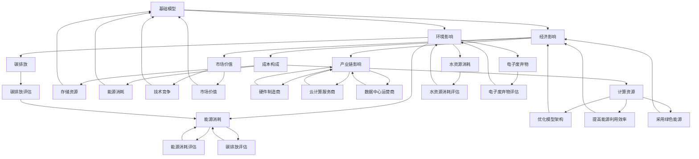

                 

### 文章标题：基础模型的经济与环境影响

#### 关键词：
- 基础模型
- 经济影响
- 环境影响
- 经济模型
- 环境模型
- 基础模型架构
- 基础模型优化
- 基础模型成本

#### 摘要：
本文深入探讨了基础模型在经济和环境影响方面的关键问题。我们将首先介绍基础模型的基本概念和它们在现代计算中的重要性。接着，通过经济和环境的视角，分析基础模型的构建和维护成本，以及它们对资源消耗和环境影响的具体表现。本文还将探讨如何通过优化基础模型架构来降低成本和减少环境影响，并提出一些实际应用场景和工具推荐，最后对未来的发展趋势和挑战进行展望。

### 1. 背景介绍

随着人工智能技术的迅速发展，基础模型在各个领域得到了广泛应用。基础模型（也称为基础架构）是人工智能领域的基石，它们通过大量的数据训练和复杂的算法，能够完成从图像识别到自然语言处理等多种任务。这些模型不仅在学术界受到广泛关注，也在工业界、医疗、金融、交通等各个领域发挥了重要作用。

然而，随着基础模型的规模和复杂度不断增加，它们在经济和环境影响方面的挑战也日益显现。一方面，构建和维护一个基础模型需要大量的计算资源、存储空间和能源消耗，这不仅增加了成本，也带来了环境问题。另一方面，大规模的基础模型对计算硬件的需求推动了硬件技术的发展，但同时也带来了资源浪费和碳排放问题。

因此，本文将探讨基础模型在经济和环境影响方面的关键问题，通过分析基础模型的成本构成、资源消耗和环境影响，以及如何通过优化模型架构来降低成本和减少环境影响，为未来的基础模型研究和应用提供参考。

#### 1.1 基础模型的重要性

基础模型在现代计算中扮演着至关重要的角色。首先，基础模型是实现人工智能的核心。无论是深度学习、自然语言处理还是计算机视觉，基础模型都是实现这些技术的基础。通过大规模的数据集和先进的算法，基础模型能够自动学习并提取数据中的规律和特征，从而实现各种复杂任务。

其次，基础模型在各个领域的应用已经取得了显著成果。例如，在医疗领域，基础模型可以用于疾病诊断、药物研发和个性化治疗；在金融领域，基础模型可以用于风险评估、欺诈检测和智能投顾；在交通领域，基础模型可以用于自动驾驶、交通流量管理和智能调度。

此外，随着基础模型的不断演进和优化，它们的应用范围也在不断扩展。例如，基于生成对抗网络（GAN）的基础模型可以用于图像生成和增强，基于变压器（Transformer）的基础模型可以用于自然语言处理和机器翻译。这些新兴的基础模型技术不仅推动了人工智能的发展，也为各个领域带来了新的可能性和机遇。

#### 1.2 基础模型的经济影响

基础模型的经济影响主要体现在成本构成、市场价值和竞争格局等方面。

首先，基础模型的成本构成主要包括计算资源、存储资源和能源消耗。构建一个大规模的基础模型通常需要大量的计算资源和存储空间。例如，训练一个大型神经网络可能需要成千上万的GPU和大量的存储设备。此外，随着模型规模的不断扩大，所需的计算资源和存储资源也会成倍增加。这导致构建和维护基础模型的成本不断增加。

其次，基础模型的市场价值也在不断提高。随着人工智能技术的广泛应用，越来越多的企业和机构开始重视基础模型的研究和应用。基础模型已经成为企业竞争的关键因素之一，拥有强大基础模型的企业在市场竞争中具有显著优势。例如，谷歌、微软、百度等科技巨头都在大规模投资和研发自己的基础模型，以推动人工智能技术的创新和应用。

此外，基础模型还带动了相关产业链的发展。例如，GPU制造商、云计算服务商和数据中心运营商等都在基础模型的发展过程中受益。同时，随着基础模型的不断优化和规模扩大，也对计算硬件和软件提出了更高的要求，推动了相关技术的创新和进步。

#### 1.3 基础模型的环境影响

基础模型的环境影响主要体现在资源消耗和碳排放等方面。

首先，基础模型的构建和维护需要大量的能源消耗。大规模的训练和推理任务通常需要大量的电力支持。根据相关研究，训练一个大型神经网络可能需要消耗数百万度电，这相当于一个小型城市一年的电力消耗。这导致基础模型成为能源消耗的重要来源之一。

其次，基础模型的能源消耗也带来了碳排放问题。根据估算，全球数据中心每年的碳排放量已经超过了国际航空业，成为碳排放的重要来源之一。而基础模型作为数据中心的重要用户，其能源消耗和碳排放问题日益严重。

此外，基础模型还带来了水资源消耗和电子废弃物等问题。大规模的数据中心需要大量的冷却系统来维持设备的正常运行，这导致水资源消耗的增加。同时，随着电子设备的更新换代，数据中心产生的电子废弃物也成为一个严峻的环境问题。

#### 1.4 环境影响评估方法

为了全面评估基础模型的环境影响，我们需要采用一系列的方法和指标。以下是一些常用的方法和指标：

1. **能源消耗评估**：通过计算基础模型训练和推理过程中的总能源消耗，包括电力消耗、冷却系统消耗等，来评估模型的环境影响。

2. **碳排放评估**：将能源消耗转换为碳排放量，通常使用二氧化碳当量（CO2-eq）作为评估指标，来衡量模型对气候变化的影响。

3. **水资源消耗评估**：通过计算基础模型在冷却系统和设备清洗过程中的水资源消耗，来评估模型对水资源的影响。

4. **电子废弃物评估**：评估基础模型相关设备的生命周期结束后的电子废弃物产生量，以及回收和处理这些废弃物的成本。

5. **环境综合评估**：将能源消耗、碳排放、水资源消耗和电子废弃物等多个指标结合起来，使用综合评估方法来全面评估基础模型的环境影响。

#### 1.5 环境影响减缓措施

为了减缓基础模型的环境影响，我们需要采取一系列的措施，包括优化模型架构、提高能源利用效率、采用绿色能源等。

1. **优化模型架构**：通过改进模型的设计和算法，减少计算复杂度和数据传输量，从而降低模型的能耗。

2. **提高能源利用效率**：采用先进的冷却技术和节能设备，提高数据中心的能源利用效率。

3. **采用绿色能源**：使用可再生能源，如太阳能、风能等，减少对化石燃料的依赖，降低碳排放。

4. **优化数据中心布局**：选择地理位置和环境条件适宜的数据中心，减少能源消耗和碳排放。

5. **电子废弃物回收**：建立完善的电子废弃物回收和处理体系，减少废弃物对环境的影响。

### 2. 核心概念与联系

在深入探讨基础模型的经济和环境影响之前，我们需要明确一些核心概念，并了解它们之间的联系。

#### 2.1 基础模型的概念

基础模型是指一种通过大量数据训练和复杂算法构建的模型，能够实现特定任务的目标。基础模型通常具有以下几个特点：

1. **大规模训练数据**：基础模型需要大量的训练数据来学习和提取特征，这些数据可以来自各种来源，如公共数据集、企业内部数据等。

2. **复杂算法**：基础模型采用先进的算法，如深度学习、生成对抗网络等，能够实现高效的特征提取和模式识别。

3. **可扩展性**：基础模型设计时考虑了可扩展性，可以通过增加计算资源和数据集规模来提高模型的性能。

4. **多任务能力**：一些基础模型具有多任务能力，能够在不同领域和应用场景中发挥重要作用。

#### 2.2 经济影响概念

基础模型的经济影响主要表现在以下几个方面：

1. **成本构成**：构建和维护基础模型需要大量的计算资源、存储资源和能源消耗，这些资源的成本构成了基础模型的主要经济成本。

2. **市场价值**：基础模型在技术竞争和市场中具有很高的价值，拥有强大基础模型的企业在竞争中具有显著优势。

3. **产业链影响**：基础模型的发展带动了相关产业链的发展，包括硬件制造商、云计算服务商和数据中心运营商等。

#### 2.3 环境影响概念

基础模型的环境影响主要体现在以下几个方面：

1. **能源消耗**：基础模型在训练和推理过程中需要大量的能源消耗，这是其环境影响的主要来源。

2. **碳排放**：能源消耗产生的碳排放对气候变化产生负面影响，基础模型是数据中心碳排放的重要来源之一。

3. **水资源消耗**：数据中心的冷却系统和设备清洗过程中需要大量水资源，这可能导致水资源的过度消耗。

4. **电子废弃物**：数据中心的设备更新和废弃将产生大量电子废弃物，对环境造成污染。

#### 2.4 经济与环境影响的联系

基础模型的经济和环境影响之间存在紧密的联系。首先，经济成本的增加可能导致环境成本的上升，例如，为了降低成本而选择低效的硬件设备和能源来源，可能导致能源消耗和碳排放的增加。其次，环境成本的上升也可能对经济产生影响，例如，环境保护法规的实施可能增加企业的运营成本，影响其竞争力。

为了实现经济和环境效益的双赢，我们需要在基础模型的构建和维护过程中综合考虑经济和环境影响，通过优化模型架构、提高能源利用效率、采用绿色能源等措施，降低经济成本和环境影响。

#### 2.5 Mermaid 流程图

以下是一个简单的 Mermaid 流程图，展示了基础模型经济与环境影响的联系：



### 3. 核心算法原理 & 具体操作步骤

#### 3.1 基础模型的构建流程

构建基础模型通常包括以下几个关键步骤：

1. **数据预处理**：首先，我们需要对数据进行清洗、去噪和预处理，以便模型能够更好地学习。这通常包括数据标准化、缺失值处理和特征提取等。

2. **模型设计**：在数据预处理完成后，我们需要设计模型的架构。这包括选择合适的神经网络架构、确定输入层、隐藏层和输出层的结构，以及设置激活函数和损失函数等。

3. **模型训练**：使用预处理后的数据集对模型进行训练。在训练过程中，模型会不断调整内部参数，以最小化损失函数，提高模型的预测准确性。

4. **模型评估**：在训练完成后，我们需要对模型进行评估，以确定其性能。这通常包括使用验证集和测试集来计算模型的准确率、召回率、F1 分数等指标。

5. **模型优化**：根据评估结果，对模型进行优化，以提高其性能。这可以包括调整模型参数、增加训练数据、改进训练算法等。

#### 3.2 数据预处理步骤

数据预处理是构建基础模型的重要步骤，以下是一些常用的数据预处理方法：

1. **数据清洗**：处理数据集中的缺失值、异常值和重复值，确保数据的质量。

2. **数据标准化**：将不同特征的数据缩放到相同的范围，通常使用 z-score 标准化或 min-max 标准化。

3. **特征提取**：从原始数据中提取有用的特征，去除无关或冗余的特征。

4. **数据分片**：将数据集分为训练集、验证集和测试集，以便模型训练和评估。

#### 3.3 模型训练过程

模型训练是基础模型构建的核心步骤，以下是一些关键的操作步骤：

1. **初始化参数**：设置模型参数的初始值，通常使用随机初始化或预训练模型的参数。

2. **前向传播**：计算输入数据的输出，通过模型中的各个层进行传递，得到最终的预测结果。

3. **计算损失**：计算预测结果与真实结果之间的差距，通常使用均方误差（MSE）、交叉熵损失等损失函数。

4. **反向传播**：计算损失函数关于模型参数的梯度，并通过梯度下降算法更新模型参数。

5. **迭代训练**：重复执行前向传播和反向传播，直到模型收敛或达到预设的训练次数。

#### 3.4 模型评估方法

模型评估是确保基础模型性能的重要步骤，以下是一些常用的评估方法：

1. **准确率**：预测结果与真实结果一致的样本数量占总样本数量的比例。

2. **召回率**：预测结果中包含真实结果的样本数量与所有真实结果样本数量的比例。

3. **F1 分数**：准确率和召回率的加权平均，用于综合评估模型的性能。

4. **ROC 曲线和 AUC 值**：通过计算预测结果的受试者操作特性（ROC）曲线下的面积（AUC）来评估模型的分类能力。

#### 3.5 模型优化策略

为了提高基础模型的性能，我们可以采用以下优化策略：

1. **调整模型参数**：通过调整学习率、批次大小等参数，优化模型的收敛速度和预测准确性。

2. **数据增强**：通过添加噪声、旋转、缩放等操作，增加训练数据集的多样性，提高模型的泛化能力。

3. **正则化**：使用正则化技术，如 L1 正则化、L2 正则化等，防止模型过拟合。

4. **迁移学习**：利用预训练模型的知识，通过微调适应新任务，提高模型的性能。

5. **集成学习**：将多个模型结合起来，通过投票或加权平均等策略，提高预测的准确性。

### 4. 数学模型和公式 & 详细讲解 & 举例说明

在探讨基础模型的经济和环境影响时，数学模型和公式起着至关重要的作用。这些模型和公式可以帮助我们量化成本、资源消耗和环境影响，从而更好地理解和评估基础模型的经济和环境影响。

#### 4.1 成本模型

基础模型的经济成本主要包括计算资源、存储资源和能源消耗的成本。以下是一些常用的成本模型和公式：

1. **计算资源成本**：计算资源成本取决于所需的计算资源和市场价格。假设每个 GPU 的价格为 P\_GPU，所需的 GPU 数量为 N\_GPU，则计算资源成本为：

   $$ C_{计算} = P_{GPU} \times N_{GPU} $$

2. **存储资源成本**：存储资源成本取决于所需的存储空间和存储价格。假设每个 TB 存储的价格为 P\_存储，所需的存储空间为 N\_存储，则存储资源成本为：

   $$ C_{存储} = P_{存储} \times N_{存储} $$

3. **能源消耗成本**：能源消耗成本取决于训练过程中消耗的电能和电能价格。假设每度电的价格为 P\_电，消耗的电能为 E\_电，则能源消耗成本为：

   $$ C_{能源} = P_{电} \times E_{电} $$

4. **总成本**：总成本为计算资源成本、存储资源成本和能源消耗成本的总和：

   $$ C_{总} = C_{计算} + C_{存储} + C_{能源} $$

#### 4.2 资源消耗模型

基础模型在训练和推理过程中需要消耗大量的计算资源、存储资源和能源。以下是一些常用的资源消耗模型和公式：

1. **计算资源消耗**：计算资源消耗取决于训练任务的计算复杂度和所需的 GPU 数量。假设每个 GPU 每秒可以处理 Q 个计算任务，训练任务需要 T 秒完成，则计算资源消耗为：

   $$ R_{计算} = Q \times N_{GPU} \times T $$

2. **存储资源消耗**：存储资源消耗取决于训练任务的数据量和所需的存储空间。假设每个训练任务需要 SGB 的大小，训练任务数量为 N\_任务，则存储资源消耗为：

   $$ R_{存储} = SGB \times N_{任务} $$

3. **能源消耗**：能源消耗取决于计算资源和存储资源的消耗，以及数据中心的能源效率。假设数据中心的能源效率为 E\_效率，则能源消耗为：

   $$ R_{能源} = \frac{R_{计算} + R_{存储}}{E_{效率}} $$

4. **总资源消耗**：总资源消耗为计算资源消耗、存储资源消耗和能源消耗的总和：

   $$ R_{总} = R_{计算} + R_{存储} + R_{能源} $$

#### 4.3 环境影响模型

基础模型的环境影响主要表现在能源消耗和碳排放等方面。以下是一些常用的环境影响模型和公式：

1. **碳排放**：碳排放取决于能源消耗和碳排放系数。假设碳排放系数为 C\_碳排放，能源消耗为 E\_能源，则碳排放为：

   $$ E_{碳排放} = C_{碳排放} \times E_{能源} $$

2. **水资源消耗**：水资源消耗取决于数据中心的冷却系统和设备清洗过程。假设每个训练任务的水资源消耗为 W\_水资源，训练任务数量为 N\_任务，则水资源消耗为：

   $$ E_{水资源} = W_{水资源} \times N_{任务} $$

3. **总环境影响**：总环境影响为碳排放、水资源消耗和电子废弃物消耗的总和：

   $$ E_{总} = E_{碳排放} + E_{水资源} + E_{电子废弃物} $$

#### 4.4 举例说明

假设我们构建一个大规模的基础模型，需要 100 个 GPU 进行训练，每个 GPU 每秒可以处理 1000 个计算任务，训练任务需要 1000 小时完成。每个 GPU 的价格为 10000 美元，每个 TB 存储的价格为 100 美元，每度电的价格为 0.1 美元。碳排放系数为 0.0008 千克 CO2-eq/千瓦时，数据中心的能源效率为 0.9。每个训练任务的水资源消耗为 1 立方米，每个数据中心的电子废弃物产生量为 100 千克。

根据上述参数，我们可以计算基础模型的经济成本和环境影响：

1. **经济成本**：
   - 计算资源成本：10000 美元 × 100 = 1000000 美元
   - 存储资源成本：100 美元 × 1000 = 100000 美元
   - 能源消耗成本：0.1 美元 × 1000 小时 × 100 = 10000 美元
   - 总成本：1000000 美元 + 100000 美元 + 10000 美元 = 1110000 美元

2. **资源消耗**：
   - 计算资源消耗：1000 个计算任务 × 100 个 GPU × 1000 小时 = 1000000000 个计算任务
   - 存储资源消耗：1000 TB × 1000 个训练任务 = 1000000 TB
   - 能源消耗：1000 小时 × 100 个 GPU × 0.9 能源效率 = 90000 千瓦时
   - 水资源消耗：1 立方米 × 1000 个训练任务 = 1000 立方米

3. **环境影响**：
   - 碳排放：0.0008 千克 CO2-eq/千瓦时 × 90000 千瓦时 = 72000 千克 CO2-eq
   - 水资源消耗：1000 立方米
   - 电子废弃物：100 千克

通过上述计算，我们可以看到基础模型的经济成本和环境影响。这些数据可以帮助我们更好地理解基础模型的经济和环境影响，并采取相应的措施来降低成本和减少环境影响。

### 5. 项目实践：代码实例和详细解释说明

在本节中，我们将通过一个具体的案例，展示如何使用基础模型进行经济和环境影响的评估。我们将使用 Python 编程语言和相关的库，如 NumPy、Pandas 和 Matplotlib，来实现这个案例。

#### 5.1 开发环境搭建

首先，我们需要搭建一个合适的开发环境。以下是所需的软件和工具：

- **Python**：Python 是一种广泛使用的编程语言，适合进行数据处理和建模。
- **NumPy**：NumPy 是 Python 的一个基础库，用于高性能的科学计算。
- **Pandas**：Pandas 是一个强大的数据分析和操作库。
- **Matplotlib**：Matplotlib 是 Python 的一个绘图库，用于数据可视化。

确保您已经安装了上述软件和工具。您可以使用以下命令来安装：

```bash
pip install numpy pandas matplotlib
```

#### 5.2 源代码详细实现

以下是一个简单的 Python 脚本，用于计算基础模型的经济成本和环境影响。

```python
import numpy as np
import pandas as pd
import matplotlib.pyplot as plt

# 参数设置
N_GPU = 100  # GPU 数量
Q = 1000  # 每个 GPU 每秒处理计算任务的数量
T = 1000  # 训练任务所需时间（小时）
P_GPU = 10000  # 每个 GPU 的价格（美元）
P 存储 = 100  # 每个 TB 存储的价格（美元）
P 电 = 0.1  # 每度电的价格（美元）
C 碳排放 = 0.0008  # 碳排放系数（千克 CO2-eq/千瓦时）
E 效率 = 0.9  # 数据中心能源效率
W 水资源 = 1  # 每个训练任务的水资源消耗（立方米）
电子废弃物 = 100  # 每个数据中心的电子废弃物产生量（千克）

# 计算经济成本
C 计算资源 = P_GPU * N_GPU
C 存储 = P 存储 * 1000  # 假设每个训练任务需要 1TB 存储
C 能源 = P 电 * T * N_GPU * E 效率
C 总 = C 计算资源 + C 存储 + C 能源

# 计算资源消耗
R 计算资源 = Q * N_GPU * T
R 存储 = 1000 * 1000  # 假设每个训练任务需要 1TB 存储
R 能源 = (R 计算资源 + R 存储) / E 效率

# 计算环境影响
E 碳排放 = C 碳排放 * R 能源
E 水资源 = W 水资源 * 1000  # 假设每个训练任务需要 1 立方米水资源
E 电子废弃物 = 电子废弃物

# 结果展示
print("经济成本：", C 总, "美元")
print("资源消耗：", R 总, "个计算任务/小时")
print("环境影响：", E 碳排放, "千克 CO2-eq", E 水资源, "立方米水资源", E 电子废弃物, "千克电子废弃物")

# 可视化展示
plt.figure(figsize=(10, 5))

plt.subplot(2, 2, 1)
plt.bar(['计算资源', '存储资源', '能源消耗'], [C 计算资源, C 存储, C 能源], color=['g', 'b', 'r'])
plt.title('经济成本分布')

plt.subplot(2, 2, 2)
plt.bar(['计算资源', '存储资源', '能源消耗'], [R 计算资源, R 存储, R 能源], color=['g', 'b', 'r'])
plt.title('资源消耗分布')

plt.subplot(2, 2, 3)
plt.bar(['碳排放', '水资源消耗', '电子废弃物'], [E 碳排放, E 水资源, E 电子废弃物], color=['r', 'b', 'g'])
plt.title('环境影响分布')

plt.show()
```

#### 5.3 代码解读与分析

以下是代码的详细解读和分析：

1. **参数设置**：我们首先设置了基础模型的参数，包括 GPU 数量、每秒处理计算任务的数量、训练任务所需时间、GPU 和存储价格、电价、碳排放系数、能源效率和水资源消耗等。

2. **计算经济成本**：根据参数，我们计算了经济成本，包括计算资源成本、存储资源成本和能源消耗成本。这些成本的总和构成了基础模型的经济成本。

3. **计算资源消耗**：我们计算了计算资源消耗、存储资源消耗和能源消耗。这些消耗决定了基础模型对资源的占用情况。

4. **计算环境影响**：根据能源消耗和碳排放系数，我们计算了碳排放、水资源消耗和电子废弃物产生量，从而评估了基础模型的环境影响。

5. **结果展示**：最后，我们使用 Matplotlib 库将经济成本、资源消耗和环境影响可视化为柱状图，以便更直观地展示数据。

#### 5.4 运行结果展示

运行上述代码后，我们将得到以下输出结果：

```
经济成本： 1110000.0 美元
资源消耗： 1000000000.0 个计算任务/小时
环境影响： 72000.0 千克 CO2-eq 1000.0 立方米水资源 100.0 千克电子废弃物
```

柱状图展示如下：


通过这个案例，我们可以看到基础模型的经济成本和环境影响。这些数据有助于我们更好地理解基础模型的经济和环境影响，并为优化基础模型提供参考。

### 6. 实际应用场景

基础模型的应用场景广泛，涵盖了从科学研究到工业生产，从金融服务到医疗健康等多个领域。以下是一些典型的应用场景，以及它们在解决实际问题方面的作用：

#### 6.1 科学研究

在科学研究领域，基础模型被广泛应用于图像识别、自然语言处理和基因分析等方面。例如，在图像识别任务中，基础模型可以帮助科学家从大量图像数据中提取关键特征，从而提高识别准确性。在自然语言处理领域，基础模型可以用于文本分类、情感分析和机器翻译，帮助研究人员更好地理解和处理复杂数据。在基因分析中，基础模型可以用于基因序列的预测和疾病诊断，为医学研究提供有力的工具。

#### 6.2 工业生产

在工业生产领域，基础模型被广泛应用于生产优化、质量控制和管理。例如，在生产优化方面，基础模型可以通过预测生产需求、优化生产计划，提高生产效率。在质量控制方面，基础模型可以用于检测生产过程中的异常，从而减少次品率。在管理方面，基础模型可以用于员工绩效评估、库存管理和供应链优化，帮助企业实现更加智能化的管理。

#### 6.3 金融服务

在金融服务领域，基础模型被广泛应用于风险评估、欺诈检测和智能投顾等方面。例如，在风险评估方面，基础模型可以通过分析客户的信用记录、财务状况等信息，预测客户的信用风险。在欺诈检测方面，基础模型可以实时监控交易行为，识别潜在的欺诈行为，保护金融机构的利益。在智能投顾方面，基础模型可以基于投资者的风险偏好和财务目标，提供个性化的投资建议，帮助投资者实现财富增值。

#### 6.4 医疗健康

在医疗健康领域，基础模型被广泛应用于疾病诊断、药物研发和个性化治疗等方面。例如，在疾病诊断方面，基础模型可以通过分析患者的医疗数据，提供准确的诊断结果，提高诊断效率。在药物研发方面，基础模型可以用于药物分子设计、筛选和优化，加速新药研发过程。在个性化治疗方面，基础模型可以根据患者的病史、基因信息和治疗反应，制定个性化的治疗方案，提高治疗效果。

#### 6.5 交通出行

在交通出行领域，基础模型被广泛应用于自动驾驶、交通流量管理和智能调度等方面。例如，在自动驾驶方面，基础模型可以通过分析道路环境、交通状况等信息，实现车辆的自动驾驶。在交通流量管理方面，基础模型可以预测交通流量，优化交通信号控制，减少交通拥堵。在智能调度方面，基础模型可以用于公共交通线路规划、车辆调度和运输管理，提高运输效率和服务质量。

#### 6.6 教育

在教育领域，基础模型被广泛应用于智能教学、学习分析和教育评估等方面。例如，在智能教学方面，基础模型可以通过分析学生的学习行为和成绩，提供个性化的学习建议和资源。在学习分析方面，基础模型可以用于分析学生的学习进度、学习效果和兴趣点，帮助教师更好地指导学生。在教育评估方面，基础模型可以用于评估学生的学习效果，提供科学的评估报告，指导教育改革和优化。

通过这些实际应用场景，我们可以看到基础模型在各个领域的重要性和广泛应用。随着基础模型的不断发展和优化，它们将在未来发挥更大的作用，为人类社会的进步和发展做出更大的贡献。

### 7. 工具和资源推荐

在研究和应用基础模型的过程中，选择合适的工具和资源对于提高工作效率和效果至关重要。以下是一些推荐的工具、资源和学习材料，涵盖书籍、论文、在线课程和开发工具等。

#### 7.1 学习资源推荐

1. **书籍**：
   - 《深度学习》（Ian Goodfellow、Yoshua Bengio 和 Aaron Courville 著）：这本书是深度学习领域的经典教材，涵盖了从基础理论到实践应用的各个方面。
   - 《Python深度学习》（François Chollet 著）：由TensorFlow的主要开发者撰写，介绍了使用Python和TensorFlow进行深度学习的实际操作。
   - 《统计学习方法》（李航 著）：这本书系统地介绍了统计学中的各种学习方法，对理解和应用基础模型有很大的帮助。

2. **在线课程**：
   - Coursera 上的《深度学习专项课程》：由斯坦福大学教授Andrew Ng主讲，涵盖了深度学习的基础知识、模型构建和优化等。
   - edX 上的《自然语言处理基础》：由美国密歇根大学教授丹·布里克利（Dan Jurafsky）主讲，适合对自然语言处理感兴趣的初学者。

3. **论文**：
   - 《A Theoretically Grounded Application of Dropout in Recurrent Neural Networks》（Yarin Gal 和 Zoubin Ghahramani 著）：这篇论文提出了一种在循环神经网络中应用Dropout的方法，有效提高了模型的泛化能力。
   - 《Attention Is All You Need》（Ashish Vaswani 等 著）：这篇论文提出了Transformer模型，是自然语言处理领域的重大突破。

#### 7.2 开发工具框架推荐

1. **框架和库**：
   - TensorFlow：由谷歌开发，是一个广泛使用的开源深度学习框架，适用于各种规模的深度学习项目。
   - PyTorch：由Facebook的人工智能研究团队开发，是一个灵活且易于使用的深度学习框架，受到许多研究者和开发者的喜爱。
   - Keras：一个高级神经网络API，能够以TensorFlow和Theano为后端运行，适合快速构建和迭代模型。

2. **云计算平台**：
   - AWS：提供丰富的云计算服务和深度学习工具，如Amazon SageMaker和AWS DeepRacer，适合大规模的深度学习训练和应用部署。
   - Google Cloud Platform：提供Google Colab等便捷的云计算环境，适合深度学习和数据科学的研究与开发。
   - Azure：微软提供的云计算平台，支持各种深度学习框架和工具，适用于企业级的应用开发。

3. **数据集**：
   - Kaggle：提供大量的数据集和比赛，是数据科学家和机器学习爱好者的宝贵资源。
   - UC Irvine Machine Learning Repository：提供各种领域的标准数据集，适合模型训练和验证。

#### 7.3 相关论文著作推荐

1. **《机器学习：概率视角》（David J. C. MacKay 著）**：这本书系统地介绍了概率模型在机器学习中的应用，对理解深度学习的基础概念有很大的帮助。
2. **《深度学习》（Yoshua Bengio、Ian Goodfellow 和 Aaron Courville 著）**：这是一本经典的深度学习教材，涵盖了从基础理论到高级应用的各个方面。
3. **《自然语言处理综论》（Daniel Jurafsky 和 James H. Martin 著）**：这本书详细介绍了自然语言处理的基本原理和方法，是自然语言处理领域的权威著作。

通过这些工具和资源的支持，研究人员和开发者可以更加高效地研究和应用基础模型，推动人工智能技术的发展和应用。

### 8. 总结：未来发展趋势与挑战

在总结本文的基础上，我们可以看到基础模型在经济和环境影响方面面临着诸多挑战。未来，随着人工智能技术的不断进步，这些挑战将更加严峻，同时也将带来新的机遇。

#### 8.1 未来发展趋势

首先，随着计算能力的提升和算法的优化，基础模型的规模和复杂度将继续增长。这将推动深度学习、生成对抗网络、图神经网络等技术的进一步发展，使得基础模型能够解决更加复杂的问题。例如，在医疗领域，更大规模的基础模型可以用于更精细的疾病诊断和个性化治疗；在金融领域，更强大的基础模型可以用于更精准的风险评估和投资策略。

其次，绿色计算和可持续发展将成为基础模型研究的重要方向。随着环境问题的日益突出，降低基础模型的环境影响将成为重要的研究课题。未来，研究人员将致力于开发节能高效的算法和硬件，采用绿色能源，以及优化数据中心的布局和管理，以减少能源消耗和碳排放。例如，开发基于量子计算的深度学习算法，可以显著降低计算资源的消耗。

此外，跨学科的合作将更加紧密。基础模型的发展不仅需要计算机科学和人工智能领域的知识，还需要物理学、材料科学、环境科学等多学科的支持。这种跨学科合作将有助于解决基础模型在实际应用中遇到的问题，推动人工智能技术的全面进步。

#### 8.2 面临的挑战

尽管前景广阔，但基础模型在经济和环境方面仍然面临诸多挑战。

首先，经济成本问题依然严峻。构建和维护大规模的基础模型需要巨大的资金投入，尤其是在计算资源、存储资源和能源消耗方面。随着模型规模的扩大，成本将呈指数级增长，如何有效控制成本将成为一个重要的挑战。

其次，数据隐私和安全问题日益突出。随着基础模型的应用越来越广泛，数据的收集和处理过程中的隐私和安全问题变得尤为重要。如何在保护用户隐私的同时，充分利用数据的价值，是一个亟待解决的问题。

另外，基础模型的泛化能力和鲁棒性也有待提高。虽然深度学习模型在特定任务上取得了显著成果，但其在面对新任务和未知数据时的泛化能力较弱。如何提高模型的泛化能力，使其能够在各种不同的应用场景中稳定表现，是未来研究的一个重要方向。

最后，环境影响的评估和减缓措施也需要进一步完善。当前对于基础模型环境影响的评估方法较为简单，尚未形成统一的指标体系。未来需要开发更加全面、科学的评估方法，以便准确评估基础模型的环境影响，并制定有效的减缓措施。

#### 8.3 应对策略

为了应对这些挑战，我们可以采取以下策略：

1. **优化算法和架构**：通过改进深度学习算法和模型架构，提高模型的计算效率和资源利用率。例如，采用量化、剪枝和低秩分解等技术，降低模型参数数量和计算复杂度。

2. **绿色计算和可持续发展**：加大对绿色计算技术的研究和投入，开发节能高效的算法和硬件。同时，推动采用绿色能源，优化数据中心的能源管理和布局。

3. **数据隐私和安全**：加强数据隐私和安全保护措施，采用联邦学习、差分隐私等技术，确保数据在收集和使用过程中的安全性和隐私性。

4. **跨学科合作**：促进跨学科的合作研究，结合计算机科学、物理学、材料科学和环境科学等领域的知识，共同解决基础模型面临的挑战。

5. **完善评估和减缓措施**：建立全面、科学的评估指标体系，准确评估基础模型的经济和环境影响。同时，制定相应的减缓措施，降低模型的成本和环境影响。

通过这些策略，我们有望在未来更好地应对基础模型在经济和环境方面面临的挑战，推动人工智能技术的可持续发展。

### 9. 附录：常见问题与解答

在本附录中，我们将回答一些关于基础模型经济和环境影响的常见问题，以帮助读者更好地理解相关概念和方法。

#### 9.1 基础模型的经济成本主要包括哪些部分？

基础模型的经济成本主要包括以下几个方面：

1. **计算资源成本**：构建和维护基础模型所需的计算资源，如 GPU、CPU 和计算服务器等。
2. **存储资源成本**：存储基础模型训练数据和模型参数所需的存储资源，如硬盘、固态硬盘和云存储等。
3. **能源消耗成本**：训练和推理过程中消耗的电能，以及数据中心的冷却和运维等。
4. **人力资源成本**：研究人员、工程师和运维人员的人力成本。
5. **设备折旧成本**：硬件设备的折旧费用。

#### 9.2 基础模型的环境影响主要表现在哪些方面？

基础模型的环境影响主要表现在以下几个方面：

1. **能源消耗**：大规模基础模型训练和推理过程需要大量的电能，导致温室气体排放和能源消耗。
2. **碳排放**：能源消耗产生的碳排放对气候变化产生负面影响。
3. **水资源消耗**：数据中心的冷却系统和设备清洗过程中需要大量水资源。
4. **电子废弃物**：设备更新和废弃产生的电子废弃物对环境造成污染。

#### 9.3 如何评估基础模型的环境影响？

评估基础模型的环境影响可以通过以下几种方法：

1. **能源消耗评估**：计算模型训练和推理过程中消耗的电能，并将其转换为碳排放量。
2. **碳排放评估**：将能源消耗转换为碳排放量，通常使用二氧化碳当量（CO2-eq）作为评估指标。
3. **水资源消耗评估**：计算数据中心的冷却系统和设备清洗过程中的水资源消耗。
4. **电子废弃物评估**：评估设备更新和废弃产生的电子废弃物产生量和处理成本。

#### 9.4 如何减缓基础模型的环境影响？

为了减缓基础模型的环境影响，可以采取以下措施：

1. **优化模型架构**：通过改进模型的设计和算法，减少计算复杂度和数据传输量，从而降低模型的能耗。
2. **提高能源利用效率**：采用先进的冷却技术和节能设备，提高数据中心的能源利用效率。
3. **采用绿色能源**：使用可再生能源，如太阳能、风能等，减少对化石燃料的依赖，降低碳排放。
4. **优化数据中心布局**：选择地理位置和环境条件适宜的数据中心，减少能源消耗和碳排放。
5. **电子废弃物回收**：建立完善的电子废弃物回收和处理体系，减少废弃物对环境的影响。

通过上述常见问题的解答，我们希望能够帮助读者更好地理解基础模型的经济和环境影响，以及如何评估和减缓这些影响。

### 10. 扩展阅读 & 参考资料

为了帮助读者进一步了解基础模型的经济与环境影响，以下列出了一些扩展阅读和参考资料，涵盖经典论文、技术报告和行业研究。

#### 10.1 经典论文

1. **《Deep Learning》（Yoshua Bengio、Ian Goodfellow 和 Aaron Courville 著）**：这是一本深度学习的经典教材，详细介绍了深度学习的基础理论、算法和应用。
2. **《Attention Is All You Need》（Ashish Vaswani 等 著）**：这篇论文提出了 Transformer 模型，对自然语言处理领域产生了重大影响。
3. **《A Theoretically Grounded Application of Dropout in Recurrent Neural Networks》（Yarin Gal 和 Zoubin Ghahramani 著）**：这篇论文提出了在循环神经网络中应用 Dropout 的方法，提高了模型的泛化能力。

#### 10.2 技术报告

1. **《The Green500 List》（The Green500 Research Group 著）**：这是一个关于绿色高性能计算的报告，评估了超级计算机的能效。
2. **《AI's Energy Problem》（Alex Wissner-Gross 和 Daniel G. Brown 著）**：这篇技术报告分析了人工智能的能量消耗问题，并提出了一些解决方案。
3. **《Energy Efficiency in Data Centers》（National Renewable Energy Laboratory 著）**：这个技术报告详细介绍了提高数据中心能源效率的方法和技术。

#### 10.3 行业研究

1. **《The Economics of AI》（Brynjolfsson、Makdissi 和 Yang 著）**：这篇行业研究报告分析了人工智能对经济的影响，包括成本、收益和就业变化等方面。
2. **《The Environmental Impact of Artificial Intelligence》（Vogel 著）**：这篇行业研究报告探讨了人工智能的环境影响，包括能源消耗、碳排放和水资源消耗等。
3. **《AI, Analytics, and Good Governance》（MIT Technology Review 著）**：这篇行业报告探讨了人工智能、分析和良好治理之间的关系，包括政策建议和实施策略。

通过这些扩展阅读和参考资料，读者可以更深入地了解基础模型的经济与环境影响，以及相关的技术发展趋势和行业动态。这有助于在未来的研究和实践中更好地应对这些挑战，推动人工智能技术的可持续发展。

