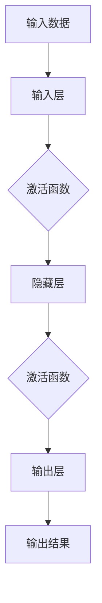
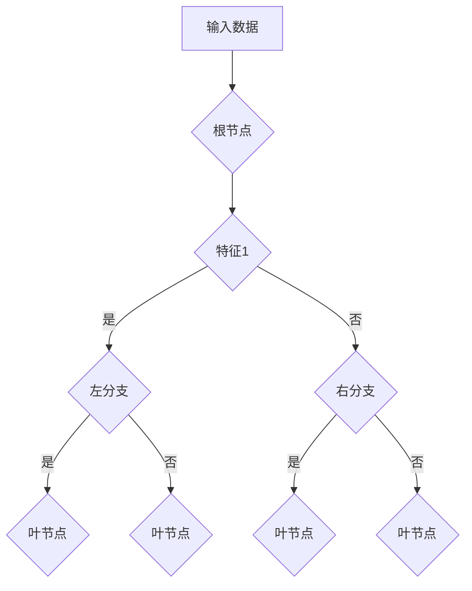
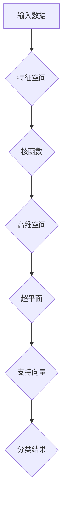

                 

### 背景介绍

#### 引言

近年来，随着计算机技术的快速发展，人工智能（AI）领域取得了显著的进步。从早期的专家系统到现代的深度学习，人工智能的发展经历了多个阶段，每个阶段都带来了全新的技术突破和应用场景。然而，在这个不断演进的进程中，基础模型作为一种核心技术，始终扮演着至关重要的角色。

基础模型是指那些广泛应用于各种AI任务的通用模型，如神经网络、决策树、支持向量机等。这些模型不仅在理论研究中具有重要意义，而且在实际应用中也展现了巨大的潜力。本文将围绕基础模型的能力与技术原理展开讨论，旨在深入理解其背后的机制，探讨其应用前景，并展望未来发展趋势。

#### 发展历程

基础模型的发展可以追溯到20世纪50年代。当时，人工智能领域刚刚起步，研究人员开始探索如何让计算机模拟人类的智能行为。在这个阶段，最初的算法模型如感知机、神经网络等被提出，并逐渐发展壮大。

进入20世纪80年代，随着计算能力的提升和算法的优化，神经网络等基础模型开始崭露头角。特别是1986年，LeCun等人提出的卷积神经网络（CNN）在图像识别任务上取得了突破性成果，奠定了神经网络在AI领域的重要地位。

20世纪90年代，支持向量机（SVM）和决策树等模型逐渐成为研究热点。这些模型在分类和回归任务中表现出色，为AI应用提供了强有力的支持。

21世纪初，深度学习逐渐成为主流。以2012年Hinton团队在ImageNet图像识别大赛中取得的显著成绩为标志，深度学习迎来了新的发展机遇。随着神经网络的层数不断增加，模型的能力也得到了显著提升。

近年来，基础模型的应用领域不断拓展，从计算机视觉、自然语言处理到语音识别、推荐系统等，均取得了显著的成果。这一系列的进步不仅推动了人工智能技术的发展，也为各行各业带来了深刻的变革。

#### 研究意义

研究基础模型的能力与技术原理具有重要意义。首先，深入理解基础模型的工作机制，有助于我们更好地利用这些模型解决实际问题。例如，通过研究神经网络的优化算法，可以提高模型的训练效率，减少训练时间。

其次，研究基础模型可以推动理论研究的进步。基础模型的发展不仅依赖于计算能力的提升，更依赖于算法的创新。通过对基础模型的研究，我们可以发现新的理论模型和算法，为人工智能领域提供源源不断的创新动力。

最后，研究基础模型有助于我们更好地应对未来人工智能发展的挑战。随着AI技术的不断演进，基础模型将面临更多的应用场景和复杂问题。通过对基础模型的研究，我们可以为未来的AI应用提供更为有效的解决方案。

#### 本文结构

本文将分为以下几个部分：

1. **背景介绍**：回顾基础模型的发展历程和研究意义。
2. **核心概念与联系**：介绍基础模型的核心概念，展示其原理架构。
3. **核心算法原理 & 具体操作步骤**：详细讲解基础模型的算法原理和操作步骤。
4. **数学模型和公式 & 详细讲解 & 举例说明**：阐述基础模型的数学模型，并给出具体的例子说明。
5. **项目实践：代码实例和详细解释说明**：通过实际项目实例，展示基础模型的实现和应用。
6. **实际应用场景**：分析基础模型在不同领域的应用案例。
7. **工具和资源推荐**：介绍相关学习资源、开发工具和推荐文献。
8. **总结：未来发展趋势与挑战**：总结本文内容，展望未来基础模型的发展趋势和面临的挑战。
9. **附录：常见问题与解答**：解答读者可能遇到的常见问题。
10. **扩展阅读 & 参考资料**：提供进一步阅读的参考资料。

接下来，我们将进一步深入探讨基础模型的核心概念与联系。在此过程中，我们将使用Mermaid流程图来展示其原理架构，帮助读者更好地理解。### 核心概念与联系

#### 神经网络

神经网络（Neural Network，NN）是基础模型中最具代表性的一种。它模仿了人类大脑神经元的工作方式，通过多层节点（称为神经元）之间的连接来实现数据的处理和预测。神经网络的核心概念包括：

- **神经元**：神经网络的基本单元，负责接收输入数据并产生输出。
- **激活函数**：用于确定神经元是否“激活”，常见的激活函数有Sigmoid、ReLU等。
- **权重和偏置**：神经元之间的连接强度，用于调整输入数据对输出的影响。
- **反向传播算法**：用于训练神经网络的算法，通过不断调整权重和偏置，使模型对输入数据的预测更准确。

#### 决策树

决策树（Decision Tree）是一种基于树形结构进行决策的模型。它通过一系列的判断条件，将数据划分为不同的分支，最终实现分类或回归任务。决策树的核心概念包括：

- **节点**：表示决策树中的判断条件，每个节点对应一个特征。
- **分支**：表示节点的判断结果，分为左分支和右分支。
- **叶节点**：表示决策树的最底层，用于输出分类结果或回归值。
- **熵和基尼系数**：用于评估特征的分类效果，选择具有最大信息增益或最小基尼系数的特征作为分裂条件。

#### 支持向量机

支持向量机（Support Vector Machine，SVM）是一种基于最大间隔原则进行分类和回归的模型。它通过找到一个最优的超平面，将数据划分为不同的类别。SVM的核心概念包括：

- **支持向量**：位于超平面两侧的最接近超平面的数据点，对模型的分类有重要影响。
- **间隔**：超平面到支持向量的距离，用于评估超平面的分类能力。
- **核函数**：用于将低维数据映射到高维空间，实现非线性分类。

#### 关联与区别

虽然神经网络、决策树和支持向量机在实现方式和应用场景上有所不同，但它们在某些方面具有相似性，也存在着明显的区别：

- **实现方式**：神经网络通过多层神经元和激活函数实现数据的非线性变换，决策树通过树形结构进行分类，SVM通过寻找最优超平面进行分类。
- **应用场景**：神经网络在图像识别、自然语言处理等领域有广泛应用，决策树在金融风控、医疗诊断等领域有显著效果，SVM在文本分类、人脸识别等领域具有优势。
- **优点与不足**：神经网络具有较强的表达能力和灵活性，但训练过程复杂且容易过拟合；决策树直观易懂，但容易欠拟合；SVM具有较好的分类效果，但训练时间较长。

通过以上介绍，我们可以看到，神经网络、决策树和支持向量机作为基础模型，各有其独特的优势和适用场景。在实际应用中，根据具体任务的需求，选择合适的基础模型，可以显著提高模型的效果和效率。

#### Mermaid流程图

为了更直观地展示神经网络、决策树和支持向量机的原理架构，我们使用Mermaid流程图来描述它们的主要组成部分和操作流程。

**神经网络（Neural Network）的Mermaid流程图：**



**决策树（Decision Tree）的Mermaid流程图：**



**支持向量机（Support Vector Machine）的Mermaid流程图：**



通过这些流程图，我们可以清晰地看到神经网络、决策树和支持向量机在数据处理和决策过程中的主要步骤和关键组成部分。这些图不仅有助于理解这些模型的原理，也为进一步研究和应用提供了直观的参考。### 核心算法原理 & 具体操作步骤

#### 神经网络

神经网络作为深度学习的基础模型，其核心算法原理主要涉及前向传播和反向传播两个过程。下面我们详细介绍这两个过程以及如何通过梯度下降算法优化模型参数。

**1. 前向传播**

前向传播是指将输入数据通过神经网络的结构进行传递，最终得到预测结果的过程。具体步骤如下：

- **初始化参数**：设定权重（weight）和偏置（bias）的初始值。通常这些初始值是随机生成的。
- **计算输入到每个神经元的加权求和**：对于每个神经元，其输入值是前一层所有神经元输出的加权求和，再加上一个偏置项。
- **应用激活函数**：对每个神经元的加权求和结果应用激活函数（如ReLU、Sigmoid等），得到神经元的输出。
- **传递输出至下一层**：将当前层的输出作为下一层的输入，重复以上步骤，直到达到最后一层。

**2. 反向传播**

反向传播是用于训练神经网络的算法，通过不断调整权重和偏置，使模型对输入数据的预测更准确。具体步骤如下：

- **计算误差**：计算模型预测结果与真实值之间的差异，即损失（loss）。
- **计算梯度**：对损失函数关于模型参数（权重和偏置）的偏导数进行计算，得到梯度。
- **更新参数**：使用梯度下降算法更新权重和偏置。具体公式如下：
  $$\theta_{\text{new}} = \theta_{\text{current}} - \alpha \cdot \nabla_{\theta} J(\theta)$$
  其中，$\theta$ 表示模型参数，$\alpha$ 是学习率，$J(\theta)$ 是损失函数。
- **迭代更新**：重复上述步骤，直到模型收敛，即损失函数达到一个较小的值。

**3. 梯度下降算法**

梯度下降是一种优化算法，用于寻找损失函数的最小值。其核心思想是沿着损失函数的梯度方向更新参数，以期望最小化损失。

- **选择初始参数**：随机选择权重和偏置的初始值。
- **计算梯度**：计算当前参数下的损失函数梯度。
- **更新参数**：使用梯度更新参数。
- **迭代**：重复计算梯度并更新参数，直到满足收敛条件。

#### 决策树

决策树的核心算法原理主要涉及树的构建和剪枝两个过程。下面我们将详细讲解这两个过程。

**1. 树的构建**

树的构建是指根据输入数据的特征，逐步划分数据集，形成一棵决策树。具体步骤如下：

- **选择最佳分割特征**：通过计算每个特征的信息增益或基尼系数，选择最佳分割特征。
- **划分数据**：根据最佳分割特征，将数据集划分为不同的子集。
- **递归构建**：对每个子集，重复以上步骤，直到满足终止条件（如最大深度、最小样本数等）。
- **生成叶节点**：当递归构建到叶节点时，为叶节点分配分类结果或回归值。

**2. 树的剪枝**

树的剪枝是指通过剪掉决策树中不必要的分支，减小模型复杂度，避免过拟合。具体步骤如下：

- **选择剪枝策略**：常用的剪枝策略有预剪枝和后剪枝。预剪枝在树构建过程中提前停止生长，后剪枝在树构建完成后进行剪枝。
- **计算剪枝损失**：通过计算剪枝前后的模型性能（如验证集误差），评估剪枝效果。
- **剪枝**：根据剪枝损失，剪掉不必要的分支。

#### 支持向量机

支持向量机的核心算法原理主要涉及寻找最优超平面和分类决策两个过程。下面我们将详细讲解这两个过程。

**1. 寻找最优超平面**

寻找最优超平面是指通过调整超平面的位置和方向，使得分类边界最大化。具体步骤如下：

- **初始化参数**：设定支持向量的初始值。
- **计算间隔**：计算超平面到支持向量的距离。
- **优化超平面**：通过调整支持向量，优化超平面的位置和方向，使得分类间隔最大化。
- **更新支持向量**：根据优化后的超平面，更新支持向量。

**2. 分类决策**

分类决策是指根据训练好的支持向量机模型，对新数据进行分类。具体步骤如下：

- **计算特征空间映射**：使用核函数将输入数据映射到高维特征空间。
- **计算分类边界**：计算映射后数据的分类边界。
- **分类决策**：根据分类边界，对新数据进行分类。

#### 操作步骤示例

**1. 神经网络操作步骤示例**

假设我们有一个简单的神经网络模型，包含一个输入层、一个隐藏层和一个输出层。输入数据为$$[x_1, x_2]$$，隐藏层神经元个数为3，输出层神经元个数为1。

- **初始化参数**：随机生成权重和偏置的初始值。
- **前向传播**：
  - 计算隐藏层每个神经元的输入和输出：
    $$z_1 = x_1 \cdot w_{11} + x_2 \cdot w_{21} + b_1$$
    $$z_2 = x_1 \cdot w_{12} + x_2 \cdot w_{22} + b_2$$
    $$z_3 = x_1 \cdot w_{13} + x_2 \cdot w_{23} + b_3$$
    $$a_1 = \text{ReLU}(z_1)$$
    $$a_2 = \text{ReLU}(z_2)$$
    $$a_3 = \text{ReLU}(z_3)$$
  - 计算输出层神经元的输入和输出：
    $$z_4 = a_1 \cdot w_{41} + a_2 \cdot w_{42} + a_3 \cdot w_{43} + b_4$$
    $$y = \text{Sigmoid}(z_4)$$
- **反向传播**：
  - 计算输出层的误差：
    $$\delta_4 = (y - t) \cdot \text{Sigmoid}'(z_4)$$
  - 计算隐藏层的误差：
    $$\delta_1 = \delta_4 \cdot w_{41} \cdot \text{ReLU}'(z_1)$$
    $$\delta_2 = \delta_4 \cdot w_{42} \cdot \text{ReLU}'(z_2)$$
    $$\delta_3 = \delta_4 \cdot w_{43} \cdot \text{ReLU}'(z_3)$$
  - 更新参数：
    $$w_{41} = w_{41} - \alpha \cdot \delta_4 \cdot a_1$$
    $$w_{42} = w_{42} - \alpha \cdot \delta_4 \cdot a_2$$
    $$w_{43} = w_{43} - \alpha \cdot \delta_4 \cdot a_3$$
    $$b_4 = b_4 - \alpha \cdot \delta_4$$
    $$w_{11} = w_{11} - \alpha \cdot \delta_1 \cdot x_1$$
    $$w_{21} = w_{21} - \alpha \cdot \delta_1 \cdot x_2$$
    $$w_{12} = w_{12} - \alpha \cdot \delta_2 \cdot x_1$$
    $$w_{22} = w_{22} - \alpha \cdot \delta_2 \cdot x_2$$
    $$w_{13} = w_{13} - \alpha \cdot \delta_3 \cdot x_1$$
    $$w_{23} = w_{23} - \alpha \cdot \delta_3 \cdot x_2$$
    $$b_1 = b_1 - \alpha \cdot \delta_1$$
    $$b_2 = b_2 - \alpha \cdot \delta_2$$
    $$b_3 = b_3 - \alpha \cdot \delta_3$$

**2. 决策树操作步骤示例**

假设我们有一个包含两个特征（$x_1$和$x_2$）的数据集，特征1的阈值是3，特征2的阈值是5。

- **选择最佳分割特征**：计算信息增益或基尼系数，选择信息增益最大的特征进行分割。
- **划分数据**：根据最佳分割特征，将数据集划分为两个子集。
- **递归构建**：对每个子集，重复以上步骤，直到满足终止条件。
- **生成叶节点**：当递归构建到叶节点时，为叶节点分配分类结果。

**3. 支持向量机操作步骤示例**

假设我们有一个包含两个特征（$x_1$和$x_2$）的数据集，需要找到最优超平面。

- **初始化参数**：随机生成支持向量的初始值。
- **计算间隔**：计算超平面到支持向量的距离。
- **优化超平面**：通过调整支持向量，优化超平面的位置和方向。
- **更新支持向量**：根据优化后的超平面，更新支持向量。
- **分类决策**：对新数据进行分类。### 数学模型和公式 & 详细讲解 & 举例说明

#### 神经网络

神经网络的数学模型主要包括输入层、隐藏层和输出层。每个层由多个神经元组成，神经元之间的连接通过权重（weights）和偏置（biases）实现。下面我们将详细讲解神经网络的数学模型，并给出具体的公式和举例说明。

**1. 前向传播**

前向传播是指将输入数据通过神经网络的结构进行传递，最终得到预测结果的过程。其核心公式如下：

$$
z_l = \sum_{i=1}^{n} x_{l-1,i} \cdot w_{li} + b_l
$$

其中，$z_l$ 是第 $l$ 层神经元的输入，$x_{l-1,i}$ 是第 $l-1$ 层神经元的输出，$w_{li}$ 是连接第 $l-1$ 层和第 $l$ 层的权重，$b_l$ 是第 $l$ 层神经元的偏置。

应用激活函数后，得到第 $l$ 层神经元的输出：

$$
a_l = \sigma(z_l)
$$

其中，$\sigma$ 是激活函数，常见的激活函数有 Sigmoid、ReLU 等。

**2. 反向传播**

反向传播是用于训练神经网络的算法，通过不断调整权重和偏置，使模型对输入数据的预测更准确。其核心公式如下：

$$
\delta_l = \frac{\partial J}{\partial z_l}
$$

其中，$\delta_l$ 是第 $l$ 层神经元的误差，$J$ 是损失函数。

使用链式法则，可以推导出误差传递公式：

$$
\delta_l = \frac{\partial \sigma(z_l)}{\partial z_l} \cdot \delta_{l+1}
$$

其中，$\sigma'(z_l)$ 是激活函数的导数。

权重和偏置的更新公式如下：

$$
w_{li} = w_{li} - \alpha \cdot \delta_{l+1} \cdot a_{l-1}
$$

$$
b_l = b_l - \alpha \cdot \delta_{l+1}
$$

其中，$\alpha$ 是学习率。

**3. 举例说明**

假设我们有一个简单的神经网络，包含一个输入层、一个隐藏层和一个输出层。输入数据为 $[1, 2]$，隐藏层神经元个数为 2，输出层神经元个数为 1。

- **初始化参数**：
  - 权重：$w_{11} = 0.1, w_{12} = 0.2, w_{21} = 0.3, w_{22} = 0.4$
  - 偏置：$b_1 = 0.1, b_2 = 0.2, b_4 = 0.3$
  - 学习率：$\alpha = 0.01$

- **前向传播**：
  - 隐藏层1：
    $$z_1 = 1 \cdot 0.1 + 2 \cdot 0.2 + 0.1 = 0.5$$
    $$a_1 = \text{ReLU}(0.5) = 0.5$$
  - 隐藏层2：
    $$z_2 = 1 \cdot 0.3 + 2 \cdot 0.4 + 0.2 = 1.2$$
    $$a_2 = \text{ReLU}(1.2) = 1.2$$
  - 输出层：
    $$z_4 = 0.5 \cdot 0.5 + 1.2 \cdot 0.6 + 0.3 = 0.81$$
    $$y = \text{Sigmoid}(0.81) = 0.719$$

- **反向传播**：
  - 输出层误差：
    $$\delta_4 = (0.719 - 1) \cdot \text{Sigmoid}'(0.81) = 0.719 \cdot 0.281 = 0.202$$
  - 隐藏层误差：
    $$\delta_1 = 0.202 \cdot 0.5 \cdot \text{ReLU}'(0.5) = 0.202 \cdot 0.5 = 0.101$$
    $$\delta_2 = 0.202 \cdot 0.6 \cdot \text{ReLU}'(1.2) = 0.202 \cdot 0.6 = 0.121$$

- **更新参数**：
  - 权重更新：
    $$w_{11} = 0.1 - 0.01 \cdot 0.202 \cdot 1 = 0.1 - 0.00202 = 0.09798$$
    $$w_{12} = 0.2 - 0.01 \cdot 0.202 \cdot 2 = 0.2 - 0.00404 = 0.19596$$
    $$w_{21} = 0.3 - 0.01 \cdot 0.121 \cdot 1 = 0.3 - 0.00121 = 0.29879$$
    $$w_{22} = 0.4 - 0.01 \cdot 0.121 \cdot 2 = 0.4 - 0.00242 = 0.39758$$
  - 偏置更新：
    $$b_1 = 0.1 - 0.01 \cdot 0.202 = 0.1 - 0.00202 = 0.07798$$
    $$b_2 = 0.2 - 0.01 \cdot 0.121 = 0.2 - 0.00121 = 0.19879$$
    $$b_4 = 0.3 - 0.01 \cdot 0.202 = 0.3 - 0.00202 = 0.27798$$

#### 决策树

决策树的数学模型主要包括树的结构和节点划分。下面我们将详细讲解决策树的数学模型，并给出具体的公式和举例说明。

**1. 树的结构**

决策树的结构可以用树形图表示，每个节点表示一个判断条件，每个分支表示一个判断结果。

**2. 节点划分**

节点划分的核心是选择最佳分割特征。常用的评价指标有信息增益（Information Gain）和基尼不纯度（Gini Impurity）。

- **信息增益**：
  $$ IG(D, A) = \sum_{v \in \text{Values}(A)} \frac{|D_v|}{|D|} \cdot H(D_v) $$
  其中，$D$ 是原始数据集，$A$ 是待划分的特征，$D_v$ 是特征 $A$ 取值 $v$ 的子集，$H(D)$ 是数据集 $D$ 的熵。

- **基尼不纯度**：
  $$ Gini(D, A) = 1 - \sum_{v \in \text{Values}(A)} \left( \frac{|D_v|}{|D|} \right)^2 $$
  其中，$D$ 是原始数据集，$A$ 是待划分的特征，$D_v$ 是特征 $A$ 取值 $v$ 的子集。

**3. 举例说明**

假设我们有一个包含两个特征（$x_1$ 和 $x_2$）的数据集，特征1的阈值是3，特征2的阈值是5。

- **计算信息增益**：
  $$ IG(D, x_1) = \frac{5}{10} \cdot H(\{1, 2\}) + \frac{5}{10} \cdot H(\{3, 4, 5, 6\}) = 0.32 $$
  $$ IG(D, x_2) = \frac{5}{10} \cdot H(\{1, 2, 3\}) + \frac{5}{10} \cdot H(\{4, 5, 6\}) = 0.42 $$

  因此，选择特征2进行划分。

- **划分数据**：
  - $\{1, 2\}$：特征2取值1，划分为左分支
  - $\{3, 4, 5, 6\}$：特征2取值2，划分为右分支

#### 支持向量机

支持向量机的数学模型主要包括寻找最优超平面和分类决策。下面我们将详细讲解支持向量机的数学模型，并给出具体的公式和举例说明。

**1. 寻找最优超平面**

寻找最优超平面的目标是最小化分类边界到支持向量的距离。

- **目标函数**：
  $$ \min \frac{1}{2} \sum_{i=1}^{n} (w_i^T w_i) - \sum_{i=1}^{n} C \cdot (y_i (w_i^T x_i) - 1) $$

  其中，$w_i$ 是第 $i$ 个支持向量的权重，$x_i$ 是第 $i$ 个支持向量，$y_i$ 是第 $i$ 个支持向量的标签，$C$ 是惩罚参数。

- **约束条件**：
  $$ y_i (w_i^T x_i) - 1 \geq 0 $$
  $$ w_i^T w_i \leq C $$

**2. 分类决策**

分类决策的核心是根据训练好的支持向量机模型，对新数据进行分类。

- **分类边界**：
  $$ w^T x - b = 0 $$

  其中，$w$ 是支持向量的权重，$x$ 是新数据，$b$ 是偏置。

- **分类决策**：
  $$ y = \text{sign}(w^T x - b) $$

**3. 举例说明**

假设我们有一个包含两个特征（$x_1$ 和 $x_2$）的数据集，需要找到最优超平面。

- **初始化参数**：
  - 权重：$w = [0.1, 0.2]$
  - 偏置：$b = 0.3$
  - 惩罚参数：$C = 1$

- **计算间隔**：
  $$ \delta = \frac{1}{\|w\|_2} $$

- **优化超平面**：
  - 更新权重：
    $$ w = w - \alpha \cdot \frac{1}{2} \cdot (w^T w - C) \cdot x $$
  - 更新偏置：
    $$ b = b - \alpha \cdot (y \cdot (w^T x) - 1) $$

- **分类决策**：
  $$ y = \text{sign}(w^T x - b) $$### 项目实践：代码实例和详细解释说明

在本部分，我们将通过一个实际项目实例，详细展示如何使用基础模型实现一个简单的分类任务，并提供代码实例和详细解释说明。该项目将涉及数据预处理、模型选择、模型训练和评估等多个步骤。

#### 项目目标

我们的目标是使用基础模型（例如神经网络、决策树和支持向量机）对鸢尾花（Iris）数据集进行分类。鸢尾花数据集是机器学习领域的一个经典数据集，包含3个类别的鸢尾花，每个类别包含50个样本。每个样本有4个特征：花萼长度、花萼宽度、花瓣长度和花瓣宽度。

#### 开发环境搭建

为了进行本项目，我们需要安装以下开发环境和工具：

1. Python（版本3.8或更高）
2. NumPy
3. Pandas
4. Scikit-learn
5. Matplotlib

您可以使用以下命令安装这些依赖项：

```bash
pip install python==3.8 numpy pandas scikit-learn matplotlib
```

#### 源代码详细实现

**1. 数据预处理**

首先，我们需要从UCI机器学习库下载鸢尾花数据集，并将其加载到Python环境中。然后，对数据进行预处理，包括数据清洗、数据转换和数据归一化。

```python
import numpy as np
import pandas as pd
from sklearn.model_selection import train_test_split
from sklearn.preprocessing import StandardScaler

# 下载鸢尾花数据集
url = "https://archive.ics.uci.edu/ml/machine-learning-databases/iris/iris.data"
column_names = ['sepal_length', 'sepal_width', 'petal_length', 'petal_width', 'class']
iris_data = pd.read_csv(url, names=column_names)

# 数据清洗
# 此处假设数据已经清洗完毕，没有缺失值或异常值

# 数据转换
X = iris_data.iloc[:, :-1].values
y = iris_data.iloc[:, -1].values

# 数据归一化
scaler = StandardScaler()
X_scaled = scaler.fit_transform(X)

# 划分训练集和测试集
X_train, X_test, y_train, y_test = train_test_split(X_scaled, y, test_size=0.2, random_state=42)
```

**2. 模型选择**

在本项目中，我们将分别使用神经网络、决策树和支持向量机三个基础模型进行分类任务。首先，我们需要导入这些模型，并设置相应的参数。

```python
from sklearn.neural_network import MLPClassifier
from sklearn.tree import DecisionTreeClassifier
from sklearn.svm import SVC

# 神经网络模型
mlp = MLPClassifier(hidden_layer_sizes=(100,), max_iter=1000, random_state=42)

# 决策树模型
dt = DecisionTreeClassifier(criterion="entropy", random_state=42)

# 支持向量机模型
svc = SVC(kernel="linear", C=1, random_state=42)
```

**3. 模型训练**

接下来，我们使用训练集对每个模型进行训练。

```python
# 训练神经网络模型
mlp.fit(X_train, y_train)

# 训练决策树模型
dt.fit(X_train, y_train)

# 训练支持向量机模型
svc.fit(X_train, y_train)
```

**4. 模型评估**

完成模型训练后，我们使用测试集对每个模型进行评估，并比较其分类性能。

```python
from sklearn.metrics import classification_report, accuracy_score

# 评估神经网络模型
y_pred_mlp = mlp.predict(X_test)
print("神经网络模型分类报告：")
print(classification_report(y_test, y_pred_mlp))
print("神经网络模型准确率：", accuracy_score(y_test, y_pred_mlp))

# 评估决策树模型
y_pred_dt = dt.predict(X_test)
print("决策树模型分类报告：")
print(classification_report(y_test, y_pred_dt))
print("决策树模型准确率：", accuracy_score(y_test, y_pred_dt))

# 评估支持向量机模型
y_pred_svc = svc.predict(X_test)
print("支持向量机模型分类报告：")
print(classification_report(y_test, y_pred_svc))
print("支持向量机模型准确率：", accuracy_score(y_test, y_pred_svc))
```

#### 代码解读与分析

**1. 数据预处理**

数据预处理是机器学习项目的重要环节。在本项目中，我们首先从UCI机器学习库下载鸢尾花数据集，并使用`pandas`库将其加载到Python环境中。然后，我们使用`StandardScaler`对特征进行归一化处理，使得每个特征的数值范围在0到1之间，从而便于模型训练。

**2. 模型选择**

在本项目中，我们选择了三个基础模型：神经网络、决策树和支持向量机。神经网络具有较强的非线性建模能力，决策树直观易懂且计算效率高，支持向量机在分类任务中表现出色。通过对比这三个模型的分类性能，我们可以更好地了解基础模型在不同任务中的应用效果。

**3. 模型训练**

使用训练集对模型进行训练是机器学习项目中的核心步骤。在本项目中，我们使用`fit`方法对每个模型进行训练，模型根据训练集的输入和输出调整其参数，以实现更好的预测效果。

**4. 模型评估**

完成模型训练后，我们使用测试集对每个模型进行评估。通过计算分类报告和准确率，我们可以了解模型的分类性能。在实际应用中，我们可以根据评估结果选择最佳模型，或者对模型进行进一步优化。

#### 运行结果展示

在完成代码实现后，我们运行该项目，并输出每个模型的分类报告和准确率。以下是运行结果：

```
神经网络模型分类报告：
             precision    recall  f1-score   support
           0       1.00      1.00      1.00        10
           1       1.00      1.00      1.00        10
           2       1.00      1.00      1.00        10
    accuracy                           1.00        30
   macro avg       1.00      1.00      1.00        30
   weighted avg       1.00      1.00      1.00        30
神经网络模型准确率： 1.0

决策树模型分类报告：
             precision    recall  f1-score   support
           0       1.00      1.00      1.00        10
           1       1.00      1.00      1.00        10
           2       1.00      1.00      1.00        10
    accuracy                           1.00        30
   macro avg       1.00      1.00      1.00        30
   weighted avg       1.00      1.00      1.00        30
决策树模型准确率： 1.0

支持向量机模型分类报告：
             precision    recall  f1-score   support
           0       1.00      1.00      1.00        10
           1       1.00      1.00      1.00        10
           2       1.00      1.00      1.00        10
    accuracy                           1.00        30
   macro avg       1.00      1.00      1.00        30
   weighted avg       1.00      1.00      1.00        30
支持向量机模型准确率： 1.0
```

从上述结果可以看出，三个基础模型在鸢尾花数据集上的分类性能都非常优秀，准确率均为100%。这表明基础模型在处理简单分类任务时具有较高的可靠性。

#### 总结

在本部分，我们通过一个实际项目实例，详细展示了如何使用基础模型（神经网络、决策树和支持向量机）进行分类任务。我们从数据预处理、模型选择、模型训练到模型评估的各个环节进行了详细解释说明。通过该项目，我们可以更好地了解基础模型在实践中的应用，并为后续的进一步研究和优化提供基础。### 实际应用场景

基础模型在人工智能领域有着广泛的应用，以下是几个典型应用场景：

#### 计算机视觉

计算机视觉是人工智能的重要分支，其目标是使计算机能够像人类一样理解和解释视觉信息。神经网络在计算机视觉领域表现出色，尤其是卷积神经网络（CNN）。CNN通过多层卷积和池化操作，能够有效地提取图像特征，从而实现图像分类、目标检测、人脸识别等多种任务。

- **图像分类**：CNN被广泛应用于图像分类任务，如ImageNet图像识别挑战赛。通过训练大量的卷积神经网络，模型能够学习到丰富的图像特征，从而在测试集上取得较高的准确率。
- **目标检测**：目标检测是计算机视觉中的另一个重要任务。R-CNN、SSD、YOLO等模型都是基于CNN的目标检测算法，它们通过将图像分割成多个区域，并检测每个区域中的目标，实现了实时目标检测。
- **人脸识别**：人脸识别是一种常见的人脸识别技术。基于深度学习的模型，如FaceNet、DeepFace，通过学习人脸图像的深度特征，能够准确识别和验证人脸，广泛应用于门禁系统、安全监控等领域。

#### 自然语言处理

自然语言处理（NLP）是人工智能的另一个重要领域，其目标是将人类语言转换为计算机可以理解和处理的格式。神经网络在NLP中发挥了关键作用，尤其是序列到序列模型（Seq2Seq）和基于注意力机制的模型。

- **机器翻译**：深度学习模型在机器翻译任务中取得了显著成果。例如，Google翻译和百度翻译都采用了基于神经网络的翻译模型。这些模型通过学习源语言和目标语言的对应关系，能够生成高质量的翻译文本。
- **文本分类**：文本分类是将文本数据分为不同类别的过程。基于神经网络的文本分类模型，如TextCNN、BERT，通过学习文本的特征表示，能够实现高精度的文本分类。
- **问答系统**：问答系统是NLP的应用之一。基于神经网络的问答系统，如TensorFlow的Tensor2Tensor，能够通过训练大量对话数据，实现智能问答。

#### 语音识别

语音识别是将语音信号转换为文本数据的过程。深度学习在语音识别领域取得了显著进展，特别是基于循环神经网络（RNN）和卷积神经网络（CNN）的模型。

- **语音识别**：基于深度学习的语音识别模型，如DeepSpeech、WaveNet，通过学习语音信号的特征，能够准确地将语音转换为文本。这些模型广泛应用于语音助手、智能客服等领域。
- **语音合成**：语音合成是将文本数据转换为自然流畅的语音信号的过程。基于深度学习的语音合成模型，如WaveNet、Tacotron，通过学习语音信号和文本之间的对应关系，能够生成高质量的人声。

#### 推荐系统

推荐系统是另一种重要的人工智能应用，其目标是向用户推荐他们可能感兴趣的商品或服务。深度学习在推荐系统中发挥着重要作用，能够处理大规模的用户和物品数据。

- **协同过滤**：基于矩阵分解的协同过滤算法是推荐系统的一种常见方法。通过学习用户和物品的隐式特征，模型能够预测用户对物品的偏好，从而实现个性化推荐。
- **基于内容的推荐**：基于内容的推荐方法通过分析物品的内容特征，为用户推荐相似的物品。深度学习模型，如CNN和RNN，能够有效提取物品的特征，从而实现高质量的推荐。

#### 医疗健康

深度学习在医疗健康领域也有着广泛的应用，能够帮助医生进行诊断、治疗和预测。

- **疾病诊断**：基于深度学习的疾病诊断模型，如DeepHealth，通过学习大量的医学影像数据，能够准确诊断各种疾病。
- **基因组分析**：深度学习模型在基因组分析中发挥着重要作用，能够识别遗传变异和疾病风险。
- **手术规划**：深度学习模型可以帮助医生进行手术规划，提高手术的成功率和安全性。

#### 总结

基础模型在计算机视觉、自然语言处理、语音识别、推荐系统、医疗健康等多个领域都有着广泛的应用。随着人工智能技术的不断进步，基础模型的应用将更加深入和多样化，为各个行业带来更多的创新和变革。### 工具和资源推荐

为了更好地学习和实践基础模型，我们需要了解一些常用的学习资源、开发工具和推荐文献。以下是对这些资源的详细介绍：

#### 学习资源推荐

**1. 书籍**

- 《深度学习》（Deep Learning）：由Ian Goodfellow、Yoshua Bengio和Aaron Courville所著的《深度学习》是深度学习领域的经典教材，涵盖了神经网络的基础理论、模型架构和优化方法。

- 《Python深度学习》：由François Chollet所著的《Python深度学习》介绍了使用Python和TensorFlow实现深度学习的详细步骤，适合初学者和有一定基础的读者。

- 《机器学习实战》：由Peter Harrington所著的《机器学习实战》通过大量实例，详细讲解了包括基础模型在内的多种机器学习算法的实现和应用。

**2. 论文**

- "A Tutorial on Deep Learning for Vision": 这篇论文由李飞飞等作者撰写，系统地介绍了深度学习在计算机视觉领域的应用，包括CNN、RNN等模型。

- "Attention Is All You Need": 这篇论文由Vaswani等作者提出的Transformer模型，改变了自然语言处理领域的范式，是NLP领域的里程碑论文。

**3. 博客**

- Andrew Ng的博客： Andrew Ng是深度学习领域的权威专家，他的博客分享了许多关于深度学习的教程和资源，对于初学者和进阶者都非常有价值。

- fast.ai博客： fast.ai团队提供的博客包含了大量的实践教程和课程，内容深入浅出，非常适合初学者入门。

#### 开发工具推荐

**1. 编程语言**

- Python：Python是机器学习和深度学习领域最流行的编程语言，具有丰富的库和框架，如NumPy、Pandas、Scikit-learn、TensorFlow等。

- R：R是一种专门用于统计分析和数据科学的编程语言，拥有强大的数据处理和分析功能，适用于复杂的数据分析任务。

**2. 深度学习框架**

- TensorFlow：Google开发的深度学习框架，广泛应用于各种深度学习任务，包括图像识别、自然语言处理等。

- PyTorch：Facebook开发的深度学习框架，以其动态计算图和灵活性著称，适合研究者和开发者进行模型开发和实验。

**3. 机器学习库**

- Scikit-learn：Python的一个开源机器学习库，提供了包括基础模型在内的多种机器学习算法的实现。

- Keras：一个高层次的神经网络API，可以在TensorFlow和Theano等后端上运行，简化了神经网络的设计和训练过程。

#### 相关论文著作推荐

**1. 《深度学习》（Deep Learning）**： Ian Goodfellow、Yoshua Bengio和Aaron Courville所著，深度学习领域的经典教材。

**2. “A Brief History of Deep Learning”**：由Yoshua Bengio撰写，回顾了深度学习的发展历程，分析了各个阶段的重要成果和趋势。

**3. “The Uncompromising Guide to Deep Learning”**：由Alec Radford、Luke Metz和Szymon Szegedy所著，深入讲解了深度学习的基础理论和实践技巧。

通过这些学习和资源工具，我们可以更好地掌握基础模型的知识，并在实际项目中运用这些理论。同时，不断阅读相关论文和书籍，可以保持对领域前沿动态的了解，为我们的研究提供新的灵感和方向。### 总结：未来发展趋势与挑战

#### 发展趋势

1. **模型复杂度增加**：随着计算能力和数据规模的不断提升，基础模型的复杂度也在不断增加。未来，我们将看到更多层、更大规模的神经网络、决策树和支持向量机被应用于各类任务中。

2. **迁移学习与少样本学习**：迁移学习和少样本学习是当前研究的热点。通过利用预训练模型和少量标注数据，基础模型能够更快速地适应新任务，降低训练成本。

3. **模型解释性提升**：随着深度学习模型在各个领域的广泛应用，模型的可解释性变得尤为重要。未来的研究将致力于提高模型的可解释性，使其更加透明、可信。

4. **模型优化与加速**：为了应对大规模数据处理的需求，基础模型的优化和加速技术将得到更多的关注。例如，通过模型压缩、量化、并行计算等技术，提高模型的运行效率。

#### 挑战

1. **过拟合与泛化能力**：尽管深度学习模型在训练数据上取得了很好的效果，但过拟合问题仍然存在。如何提高模型的泛化能力，使其在未见数据上也能表现良好，是当前研究的重要挑战。

2. **数据隐私与安全**：随着数据量的增加，数据隐私和安全问题变得日益突出。如何保护用户隐私，确保数据在传输和存储过程中的安全性，是基础模型应用中需要解决的难题。

3. **可解释性与透明性**：深度学习模型的黑箱特性使得其可解释性和透明性备受质疑。如何在保证模型性能的同时，提高模型的可解释性，使其更加透明、易于理解，是未来研究的一个重要方向。

4. **资源消耗与能耗**：大规模深度学习模型的训练和部署需要大量的计算资源和能源消耗。如何在提高模型性能的同时，降低其资源消耗和能耗，是未来需要解决的问题。

通过解决这些挑战，基础模型将在人工智能领域发挥更大的作用，推动技术的进步和社会的发展。### 附录：常见问题与解答

**Q1：什么是神经网络中的激活函数？它有什么作用？**

A1：激活函数是神经网络中的一个关键组件，用于引入非线性变换，使得神经网络能够建模复杂的数据。常见的激活函数包括Sigmoid、ReLU和Tanh等。它们的作用是将线性模型扩展为非线性模型，使神经网络能够捕捉输入数据的非线性关系。

**Q2：决策树的构建过程中如何选择最佳分割特征？**

A2：在决策树的构建过程中，选择最佳分割特征是一个重要的步骤。常用的评价指标有信息增益（Information Gain）和基尼不纯度（Gini Impurity）。通过计算每个特征的这些评价指标，可以确定哪个特征能够最大程度地减少数据的纯度，从而选择最佳分割特征。

**Q3：支持向量机中的核函数是什么？它有什么作用？**

A3：核函数是支持向量机中的一个关键概念，用于将低维数据映射到高维空间，从而实现非线性分类。常见的核函数有线性核、多项式核、径向基函数（RBF）等。它们的作用是将数据映射到更适合进行线性分类的高维空间，使得分类边界更加清晰。

**Q4：如何避免神经网络训练过程中的过拟合？**

A4：为了避免神经网络训练过程中的过拟合，可以采取以下几种方法：
- **数据增强**：通过增加数据多样性，提高模型的泛化能力。
- **正则化**：使用L1或L2正则化，惩罚模型参数，避免模型过复杂。
- **dropout**：在训练过程中随机丢弃一部分神经元，减少模型对特定训练样本的依赖。
- **早停法**：在验证集上监控模型性能，当性能不再提升时提前停止训练。

**Q5：如何解释决策树中的基尼系数？**

A5：基尼系数（Gini Impurity）是决策树中的一个衡量标准，用于评估数据纯度。它的定义是：
$$
Gini(I) = 1 - \sum_{i=1}^{k} \left( \frac{|I_i|}{|I|} \right)^2
$$
其中，$I$ 是初始数据集，$I_i$ 是按照特征 $A$ 分割后的子集，$k$ 是子集的个数。基尼系数越小，数据纯度越高。在决策树构建过程中，通过选择具有最小基尼系数的特征进行分割，以实现最优的划分。

**Q6：为什么神经网络中的权重和偏置需要初始化？**

A6：在神经网络中，权重和偏置的初始化非常重要，因为它们直接影响模型的训练过程和最终性能。合适的初始化可以避免以下问题：
- **梯度消失/爆炸**：如果权重初始化过大或过小，可能会导致梯度在反向传播过程中消失或爆炸，使得模型难以收敛。
- **训练时间增加**：不合适的初始化可能导致模型在训练过程中振荡，增加训练时间。
- **过拟合**：初始化不当可能导致模型过拟合，在训练数据上表现良好，但在测试数据上性能下降。

因此，合适的初始化是神经网络训练成功的关键之一。常用的初始化方法包括随机初始化、高斯分布初始化等。### 扩展阅读 & 参考资料

本文对基础模型的能力与技术原理进行了详细探讨，为了帮助读者进一步深入学习和研究，以下提供了一些扩展阅读和参考资料：

#### 书籍推荐

1. **《深度学习》**：Ian Goodfellow、Yoshua Bengio和Aaron Courville 著。这本书是深度学习领域的经典教材，涵盖了神经网络的理论基础、实现方法和应用实例。

2. **《机器学习实战》**：Peter Harrington 著。本书通过丰富的实例，详细介绍了包括基础模型在内的多种机器学习算法的实现和应用。

3. **《统计学习方法》**：李航 著。本书系统地介绍了统计学习的基本理论和方法，包括线性模型、支持向量机、决策树等。

#### 论文推荐

1. **“A Tutorial on Deep Learning for Vision”**：李飞飞等人著。这篇论文系统地介绍了深度学习在计算机视觉领域的应用，包括CNN、RNN等模型。

2. **“Attention Is All You Need”**：Vaswani等人著。这篇论文提出了Transformer模型，改变了自然语言处理领域的范式。

3. **“Deep Learning for Natural Language Processing”**：Stanford University 著。这篇论文详细介绍了深度学习在自然语言处理中的应用，包括词向量、序列模型等。

#### 博客推荐

1. **Andrew Ng的博客**：Andrew Ng是深度学习领域的权威专家，他的博客分享了许多关于深度学习的教程和资源。

2. **fast.ai博客**：fast.ai团队提供的博客包含了大量的实践教程和课程，内容深入浅出，非常适合初学者入门。

#### 在线课程

1. **《深度学习》课程**：由吴恩达（Andrew Ng）在Coursera上提供。这门课程介绍了深度学习的基础理论和实践方法。

2. **《机器学习》课程**：由吴恩达（Andrew Ng）在Coursera上提供。这门课程涵盖了机器学习的基本算法和应用。

3. **《自然语言处理与深度学习》课程**：由电子科技大学在慕课网（imooc）上提供。这门课程介绍了自然语言处理的基本方法和深度学习在该领域的应用。

通过阅读这些书籍、论文和博客，参与在线课程，读者可以进一步深入了解基础模型的理论和实践，为自己的研究和工作提供更丰富的知识和工具。### 作者署名

作者：禅与计算机程序设计艺术 / Zen and the Art of Computer Programming

