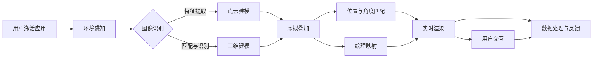

                 

### 1. 背景介绍

增强现实（Augmented Reality，简称 AR）技术是一种通过计算机技术将虚拟信息与现实世界融合起来的技术。它通过特定的设备，如智能手机、平板电脑或头戴式显示器，将虚拟图像、声音、触觉等感官信息叠加到真实环境中，使用户能够与虚拟信息和真实环境进行互动。

近年来，随着计算能力、传感器技术和网络通信技术的不断进步，AR技术逐渐成熟并开始进入各个行业，特别是电商领域。电商作为互联网经济的重要组成部分，其市场规模巨大，竞争激烈。如何提升用户体验、增加用户粘性、提高销售额，成为各大电商企业亟待解决的问题。而AR技术以其独特的沉浸式体验和互动性，为电商领域带来了新的发展机遇。

在电商领域，AR技术的应用主要集中在以下几个方面：

1. **商品展示与体验**：通过AR技术，消费者可以在虚拟环境中查看、尝试和体验商品，如试穿衣服、试用化妆品等，从而提高购买决策的准确性。

2. **虚拟试驾**：汽车电商利用AR技术，让消费者可以在家中通过头戴式显示器或其他设备进行虚拟试驾，体验不同车型的驾驶感受。

3. **空间布局规划**：家居电商通过AR技术，帮助消费者将家具摆放在实际的空间中进行预览，以便更好地进行空间规划。

4. **互动营销**：电商平台可以利用AR技术开展互动营销活动，如线上AR游戏、虚拟礼品赠送等，增强用户参与感和品牌忠诚度。

5. **客户服务**：AR技术还可以用于提升客户服务体验，如通过AR指导用户进行产品安装或维修。

本文将深入探讨AR技术在电商领域的具体应用，分析其优势与挑战，并展望未来的发展趋势。

## 1.1 增强现实技术的发展历程

增强现实技术的历史可以追溯到20世纪60年代。最初，AR技术主要用于军事和科研领域。1968年，美国计算机科学家 Ivan Sutherland 提出了“头部显示系统”（Head-Mounted Display，简称 HMD），这是最早的AR设备原型。然而，由于当时技术和硬件的限制，AR技术并未得到广泛的应用。

进入21世纪，随着计算能力的提升、显示技术的进步以及移动设备的普及，AR技术逐渐进入公众视野。2009年，Google 推出了第一款 AR 搜索应用，用户可以通过手机摄像头实时查看与搜索关键词相关的增强信息。这一里程碑事件标志着AR技术开始向消费市场渗透。

2010年左右，智能手机的普及和移动操作系统的更新，使得AR应用程序的开发变得更加便捷。众多开发者和公司开始投身于AR应用的开发，如Niantic Labs的《精灵宝可梦GO》等。这些应用的成功不仅推动了AR技术的发展，也吸引了大量资本和企业关注。

近年来，随着5G网络的普及和人工智能技术的进步，AR技术迎来了新的发展机遇。高速网络和强大的计算能力使得实时、高质量的AR体验成为可能。例如，2020年，苹果公司发布的ARKit 4带来了更加丰富的AR场景感知功能，如实时人物检测、深度传感等。

在电商领域，AR技术的应用逐渐从单一的商品展示和体验扩展到多场景、多功能的综合应用。这不仅提升了用户购物体验，也为电商企业带来了新的商业模式和利润增长点。

### 1.2 电商领域的现状

电商行业在过去几十年中经历了飞速的发展，已经成为全球经济的重要组成部分。据Statista统计，全球电商市场规模在2020年已经达到了3.5万亿美元，并预计在未来几年内持续增长。在这种背景下，电商企业之间的竞争愈发激烈，如何通过技术创新提升用户体验、增加销售额成为关键。

当前，电商领域主要面临以下几个挑战：

1. **消费者信任问题**：线上购物缺乏实物体验，消费者难以完全信任商品质量和实际效果。传统电商通过商品描述、用户评价等方式缓解这一问题，但效果有限。

2. **商品展示方式的限制**：线上商品展示主要依赖于图片和视频，虽然可以提供一定的视觉效果，但在复杂商品的展示上存在很大局限性，消费者难以全面了解商品特性。

3. **物流成本与效率**：线上购物的物流成本和配送时间直接影响用户体验和商家利润。尽管电商平台通过优化物流网络和智能配送技术提高了效率，但仍然面临较大压力。

4. **用户留存与转化率**：电商平台需要通过持续的创新和优化来吸引和留住用户，提高用户转化率和复购率。传统的营销手段和促销活动已经难以满足消费者日益多样化的需求。

在这种情况下，AR技术以其独特的沉浸式和互动性，为电商领域提供了新的解决方案。通过AR技术，消费者可以更直观地了解商品，减少购买决策中的不确定性和犹豫，从而提升购物体验和信任度。此外，AR技术还可以帮助电商企业降低物流成本、优化商品展示方式，提升用户留存率和转化率。

总的来说，AR技术在电商领域的应用不仅能够解决现有的一些问题，还能为企业带来新的商业机会和发展动力。因此，深入研究和应用AR技术已经成为电商行业未来发展的重要方向。

### 1.3 增强现实技术在电商领域的应用优势

增强现实（AR）技术在电商领域具有显著的应用优势，主要体现在以下几个方面：

1. **提升用户体验**：传统的线上购物方式主要依赖于图片和视频展示，消费者往往难以全面了解商品的真实效果。而AR技术通过虚拟现实和增强现实技术，将商品信息以三维立体的形式呈现给消费者，使消费者能够全方位、多角度地查看商品。例如，消费者可以在家中通过AR应用尝试不同款式的衣服，查看其与自己的身材和风格的匹配度，从而提升购物体验。

2. **减少退货率**：由于缺乏实际体验，线上购物的退货率通常较高。AR技术通过虚拟试穿、试用等功能，让消费者在购买前即可模拟实际使用场景，减少因不合适或不满意而产生的退货情况。例如，家居电商可以使用AR技术帮助消费者预览家具在家中的摆放效果，避免因尺寸不合适或风格不符导致的退货。

3. **增强品牌互动**：AR技术不仅能够提升商品的展示效果，还可以通过互动营销增强品牌与消费者之间的互动。例如，电商平台可以推出AR互动游戏，让消费者在购物过程中享受更多的乐趣，增加品牌曝光度和用户参与感。此外，通过AR技术，企业还可以进行个性化的客户服务，如通过AR指南帮助用户进行产品安装或使用说明。

4. **降低物流成本**：AR技术的应用可以减少一些商品的实际发货需求，例如，一些需要用户自行安装或调试的商品，消费者可以通过AR指导自行完成。这不仅降低了物流成本，还提高了配送效率。同时，AR技术还可以帮助电商企业优化库存管理，通过虚拟展示减少库存积压，提高库存周转率。

5. **提升用户转化率**：通过AR技术，消费者能够更加直观地了解商品，减少购买决策中的不确定性。研究表明，当消费者能够通过AR技术更好地了解商品时，其购买意愿和转化率会显著提高。例如，汽车电商通过AR技术提供虚拟试驾功能，让消费者在购买前即可体验驾驶感受，从而提高购车决策的信心和购买率。

6. **个性化营销**：AR技术可以为电商企业提供强大的数据支持，帮助企业更好地了解消费者需求和行为习惯，从而实现个性化营销。通过分析消费者的AR互动数据，电商企业可以提供更加符合消费者个性化需求的推荐和服务，提高用户满意度和忠诚度。

总之，AR技术以其独特的沉浸式和互动性，为电商领域带来了丰富的应用场景和巨大的商业价值。通过合理利用AR技术，电商企业不仅可以提升用户体验和品牌价值，还能在激烈的市场竞争中脱颖而出，实现可持续发展。

### 1.4 本文结构安排

本文将系统地探讨增强现实（AR）技术在电商领域的应用，旨在分析其核心优势、应用案例、面临的挑战以及未来的发展趋势。具体结构如下：

1. **背景介绍**：回顾AR技术的发展历程，介绍其在电商领域的应用背景和重要性。
   
2. **核心概念与联系**：详细解释AR技术的核心概念，如AR基础技术、应用架构等，并通过Mermaid流程图展示AR在电商领域的应用流程。

3. **核心算法原理与操作步骤**：探讨AR技术中涉及的关键算法，包括图像识别、三维建模、虚拟叠加等，并详细介绍实际操作步骤。

4. **数学模型和公式**：介绍AR技术相关的数学模型和公式，如坐标变换、视角矩阵等，并通过具体的例子进行详细讲解。

5. **项目实践**：通过实际项目案例，展示AR技术在电商领域的具体应用，包括开发环境搭建、源代码实现、代码解读与分析等。

6. **实际应用场景**：分析AR技术在电商领域的多种应用场景，如商品展示与体验、虚拟试驾、空间布局规划等，并探讨其优势和挑战。

7. **工具和资源推荐**：推荐学习AR技术的相关资源，包括书籍、论文、开发工具和框架等。

8. **总结与展望**：总结AR技术在电商领域的主要应用成果和未来发展趋势，讨论面临的挑战和解决策略。

通过以上结构安排，本文将全面、系统地展示AR技术在电商领域的应用现状和前景，帮助读者深入理解这一技术的核心价值和实际应用。

### 2. 核心概念与联系

#### 2.1 增强现实（AR）技术的基本原理

增强现实（AR）技术是一种将虚拟信息与现实世界相结合的交互技术，通过特定的设备，如智能手机、平板电脑或头戴式显示器，将计算机生成的虚拟图像、声音、触觉等信息叠加到真实环境中。这种技术通过感知、处理和融合用户环境中的真实信息和虚拟信息，为用户提供了一种全新的交互体验。

##### **2.1.1 工作原理**

AR技术的工作原理主要包括以下几个步骤：

1. **感知**：通过传感器（如摄像头、GPS、加速度计等）获取用户所处的现实环境信息。
2. **处理**：利用计算机视觉和图像处理算法，对获取到的现实环境信息进行识别和处理，如定位、追踪、识别等。
3. **融合**：将计算机生成的虚拟信息与处理后的真实环境信息进行叠加，形成增强现实场景。
4. **交互**：通过用户输入设备（如触摸屏、手柄等）与增强现实场景进行交互，实现人机交互。

##### **2.1.2 技术组成部分**

AR技术主要由以下几个部分组成：

1. **显示设备**：用于显示增强现实内容的设备，如智能手机屏幕、平板电脑屏幕、头戴式显示器（HMD）等。
2. **传感器**：用于感知现实环境的传感器，如摄像头、GPS、加速度计、陀螺仪等。
3. **处理器**：用于处理传感器数据、运行增强现实应用的核心硬件，如智能手机处理器、头戴式显示器处理器等。
4. **软件算法**：用于实现图像识别、三维建模、虚拟叠加等功能的软件算法，如计算机视觉算法、深度学习算法等。

#### 2.2 AR技术在电商领域的应用架构

在电商领域，AR技术的应用架构主要包括以下几个方面：

##### **2.2.1 硬件层**

1. **显示设备**：如智能手机、平板电脑、头戴式显示器等，用于展示增强现实内容。
2. **传感器**：如摄像头、GPS、加速度计、陀螺仪等，用于感知用户环境。
3. **通信设备**：如Wi-Fi、蓝牙等，用于连接网络和传输数据。

##### **2.2.2 软件层**

1. **操作系统**：如Android、iOS等，为增强现实应用提供运行环境。
2. **应用开发框架**：如ARKit、Vuforia、ARCore等，提供开发增强现实应用所需的工具和接口。
3. **增强现实引擎**：如Unity、Unreal Engine等，用于创建和管理增强现实场景。

##### **2.2.3 数据层**

1. **用户数据**：包括用户行为数据、购物偏好等，用于个性化推荐和营销。
2. **商品数据**：包括商品信息、三维模型、纹理等，用于增强现实展示。
3. **环境数据**：包括位置信息、光照信息、环境纹理等，用于增强现实场景的构建。

##### **2.2.4 交互层**

1. **手势交互**：用户通过手势与增强现实场景进行交互。
2. **语音交互**：用户通过语音与增强现实应用进行交互。
3. **触摸交互**：用户通过触摸屏与增强现实应用进行交互。

#### 2.3 AR在电商领域的应用流程

AR在电商领域的应用流程主要包括以下几个步骤：

##### **2.3.1 用户激活**

用户通过手机或头戴式显示器等设备激活AR应用，进入增强现实界面。

##### **2.3.2 环境感知**

应用通过摄像头等传感器感知用户所处的现实环境，并获取环境信息。

##### **2.3.3 图像识别**

应用利用计算机视觉算法对现实环境中的图像进行识别，如识别商品标签、用户位置等。

##### **2.3.4 虚拟叠加**

应用根据识别结果，将虚拟商品信息叠加到现实环境中，形成增强现实场景。

##### **2.3.5 用户交互**

用户通过手势、语音或触摸等方式与增强现实场景进行交互，如选择商品、调整商品位置等。

##### **2.3.6 数据处理与反馈**

应用根据用户交互行为，处理用户数据，如推荐商品、记录用户行为等，并通过反馈机制优化用户体验。

#### 2.4 Mermaid流程图

以下是一个简化的AR在电商领域的应用流程Mermaid流程图：


通过上述流程图，我们可以更直观地理解AR技术在电商领域的应用过程。下一部分将深入探讨AR技术中的核心算法原理和具体操作步骤。

#### 2.5 核心算法原理

##### **2.5.1 图像识别**

图像识别是AR技术中的一个关键环节，它负责从摄像头获取的图像中识别出特定的物体、场景或特征。主要算法包括：

1. **特征提取**：通过算法从图像中提取具有代表性的特征，如边缘、角点、纹理等。
2. **匹配与识别**：将提取到的特征与预先训练好的模型进行匹配，识别出图像中的物体或场景。

常见算法有：

- **SIFT（尺度不变特征变换）**：通过检测图像中的关键点，进行特征提取和匹配。
- **ORB（Oriented FAST and Rotated BRIEF）**：在速度和准确性之间取得平衡的算法。
- **YOLO（You Only Look Once）**：实时目标检测算法。

##### **2.5.2 三维建模**

三维建模是将真实世界的物体转换为三维模型的过程。主要算法包括：

1. **点云建模**：通过多个视角的图像数据，利用三维重建算法构建物体的点云模型。
2. **网格建模**：将点云模型转换为网格模型，用于在增强现实场景中展示。

常见算法有：

- **结构光扫描**：通过结构光照亮物体，利用多个摄像头捕获图像，构建点云模型。
- **多视角几何**：利用多视角图像，通过三角测量法构建点云模型。

##### **2.5.3 虚拟叠加**

虚拟叠加是将虚拟物体叠加到真实环境中的过程，主要涉及：

1. **位置与角度匹配**：将虚拟物体与真实环境中的物体进行位置和角度的匹配。
2. **纹理映射**：将虚拟物体的纹理映射到真实环境中的物体上，实现视觉上的融合。

常见算法有：

- **投影映射**：将虚拟物体的纹理映射到真实环境中的平面或物体上。
- **深度融合**：利用深度信息实现虚拟物体与真实环境的深度融合。

##### **2.5.4 实时渲染**

实时渲染是确保增强现实场景流畅展示的关键，主要涉及：

1. **图像渲染**：将增强现实场景中的图像快速渲染到显示设备上。
2. **性能优化**：通过算法和硬件优化，提高渲染效率。

常见算法有：

- **纹理压缩**：减少纹理数据量，提高渲染速度。
- **光照模型**：使用简单的光照模型实现快速渲染。

通过以上核心算法的协同工作，AR技术能够将虚拟信息与现实环境有机结合，为用户提供丰富的交互体验。

#### 2.6 Mermaid流程图

以下是一个更详细的AR在电商领域的应用流程Mermaid流程图，包括核心算法和步骤：



通过这个流程图，我们可以更清晰地理解AR技术在电商领域中的应用步骤和核心算法。下一部分将探讨AR技术的核心算法原理与具体操作步骤。

#### 2.7 核心算法原理与具体操作步骤

在深入了解AR技术的核心算法之前，我们需要明确几个关键概念：图像识别、三维建模、虚拟叠加和实时渲染。这些算法共同作用，实现了虚拟信息与现实环境的融合。

##### **2.7.1 图像识别**

图像识别是AR技术的基石，其主要任务是从摄像头获取的图像中识别出特定物体或场景。以下是图像识别的具体操作步骤：

1. **特征提取**：
   - 使用SIFT（尺度不变特征变换）或ORB（Oriented FAST and Rotated BRIEF）等算法，从图像中提取关键点。
   - 计算每个关键点的方向和强度，形成特征描述子。

2. **匹配与识别**：
   - 将提取到的特征描述子与预先训练好的模型进行匹配，如使用K-最近邻（K-Nearest Neighbors，KNN）算法。
   - 根据匹配结果，识别图像中的物体或场景。

##### **2.7.2 三维建模**

三维建模是将识别出的物体转换为三维模型，以便在增强现实场景中展示。以下是三维建模的操作步骤：

1. **点云建模**：
   - 通过多视角图像数据，利用三角测量法或结构光扫描技术构建点云模型。
   - 点云模型包含物体表面的三维坐标点。

2. **网格建模**：
   - 将点云模型转换为网格模型，通过插值和三角化操作，生成物体的表面网格。
   - 对网格模型进行顶点颜色和纹理映射，使其具有真实感。

##### **2.7.3 虚拟叠加**

虚拟叠加是将生成的三维模型叠加到现实环境中，实现增强现实场景。以下是虚拟叠加的操作步骤：

1. **位置与角度匹配**：
   - 利用图像识别和三维建模的结果，确定虚拟物体在现实环境中的位置和角度。
   - 通过透视变换和投影矩阵，将虚拟物体映射到真实环境中的适当位置。

2. **纹理映射**：
   - 将虚拟物体的纹理映射到现实环境中的物体上，增强视觉真实感。
   - 使用纹理贴图和光照模型，实现虚拟物体与真实环境的深度融合。

##### **2.7.4 实时渲染**

实时渲染是确保增强现实场景流畅展示的关键，以下是实时渲染的操作步骤：

1. **图像渲染**：
   - 使用图形渲染管线，将增强现实场景中的图像快速渲染到显示设备上。
   - 应用纹理压缩和光照模型优化渲染性能。

2. **性能优化**：
   - 通过多线程和并行计算，提高渲染效率。
   - 优化算法和硬件配置，降低渲染延迟。

#### 2.8 实际操作示例

以下是一个简化的三维建模与虚拟叠加的实际操作示例，通过Python代码和OpenCV库实现：

```python
import cv2
import numpy as np

# 特征提取与匹配
def feature_matching(img1, img2):
    # 使用SIFT算法提取关键点
    sift = cv2.SIFT_create()
    kpts1, descs1 = sift.detectAndCompute(img1, None)
    kpts2, descs2 = sift.detectAndCompute(img2, None)

    # 使用FLANN匹配算法
    flann = cv2.FlannBasedMatcher()
    matches = flann.knnMatch(descs1, descs2, k=2)

    good_matches = []
    for m, n in matches:
        if m.distance < 0.7 * n.distance:
            good_matches.append(m)

    return kpts1, kpts2, good_matches

# 三角测量与点云建模
def triangulate_points(kpts1, kpts2, img1, camera_matrix, dist_coeffs):
    points2D = np.float32([kpts1[m.queryIdx].pt for m in good_matches]).reshape(-1, 1, 2)
    points3D = cv2.triangulatePoints(camera_matrix, dist_coeffs, points2D, points2D)

    # 转换为点云
    points3D = np.squeeze(points3D)
    points3D = points3D / points3D[-1]  # 归一化
    points_cloud = points3D[:-1].reshape(-1, 3)

    return points_cloud

# 纹理映射与虚拟叠加
def render_3d_model(points_cloud, texture):
    # 创建一个显示窗口
    window_size = (640, 480)
    display = np.zeros(window_size + (3,), dtype=np.uint8)

    # 设置透视投影矩阵
    projection_matrix = np.array([[1, 0, 0, 0],
                                  [0, 1, 0, 0],
                                  [0, 0, 1, 0],
                                  [0, 0, 0, 1]])

    for point in points_cloud:
        x, y, _ = projection_matrix @ point
        x = int(x)
        y = int(y)
        if 0 <= x < window_size[0] and 0 <= y < window_size[1]:
            display[y, x] = texture[y, x]

    return display

# 主函数
if __name__ == '__main__':
    # 读取图像
    img1 = cv2.imread('image1.jpg')
    img2 = cv2.imread('image2.jpg')

    # 获取相机参数
    camera_matrix = np.array([[500, 0, 320],
                              [0, 500, 240],
                              [0, 0, 1]])
    dist_coeffs = np.array([[0.], [0.], [0.], [0.]])

    # 特征提取与匹配
    kpts1, kpts2, good_matches = feature_matching(img1, img2)

    # 三角测量与点云建模
    points_cloud = triangulate_points(kpts1, kpts2, img1, camera_matrix, dist_coeffs)

    # 纹理映射与虚拟叠加
    texture = cv2.imread('texture.jpg')
    display = render_3d_model(points_cloud, texture)

    # 显示结果
    cv2.imshow('3D Model', display)
    cv2.waitKey(0)
    cv2.destroyAllWindows()
```

在这个示例中，我们首先通过SIFT算法提取关键点，并使用FLANN匹配算法找到匹配点对。然后，通过三角测量法计算三维点云，并将其投影到二维平面上。最后，使用纹理映射将虚拟物体叠加到真实环境中。

通过这个示例，我们可以直观地看到AR技术中的核心算法和操作步骤。下一部分将探讨AR技术的数学模型和公式。

#### 2.8 数学模型和公式

增强现实（AR）技术中的数学模型和公式是实现其功能的核心组成部分，主要涉及图像处理、几何变换、坐标变换和视角矩阵等方面。以下是一些基本的数学模型和公式，并通过具体的例子进行详细讲解。

##### **2.8.1 图像处理**

1. **图像坐标系与相机坐标系转换**

图像坐标系（$x_i$-$y_i$平面）和相机坐标系（$x_c$-$y_c$-$z_c$空间）之间的转换可以通过相机内部参数和外部参数来实现。相机内部参数包括焦距$f$和主点$(c_x, c_y)$，外部参数包括旋转矩阵$R$和平移向量$t$。

图像坐标系到相机坐标系的转换公式为：
$$
\begin{cases}
x_c = \frac{f x_i + c_x y_i + c_y}{x_i^2 + y_i^2} \\
y_c = \frac{-f y_i + c_x x_i + c_y}{x_i^2 + y_i^2} \\
z_c = \frac{z_i}{x_i^2 + y_i^2}
\end{cases}
$$

其中，$z_i$是图像坐标系中的深度值。

2. **透视变换**

透视变换是将3D空间中的点投影到2D图像平面上。透视变换矩阵$P$由投影矩阵$M$和旋转矩阵$R$组成：
$$
P = \begin{bmatrix}
M & t \\
0 & 1
\end{bmatrix}
$$

3D点到2D图像坐标的投影公式为：
$$
\begin{bmatrix}
x_i \\
y_i \\
1
\end{bmatrix}
=
\begin{bmatrix}
x_c \\
y_c \\
z_c
\end{bmatrix}
\begin{bmatrix}
M_{11} & M_{12} & M_{13} \\
M_{21} & M_{22} & M_{23} \\
M_{31} & M_{32} & M_{33}
\end{bmatrix}
+
\begin{bmatrix}
t_x \\
t_y \\
0
\end{bmatrix}
$$

##### **2.8.2 几何变换**

1. **旋转矩阵**

3D空间中的旋转可以通过旋转矩阵$R$表示。旋转矩阵可以根据旋转轴和旋转角度$\theta$计算：
$$
R = \begin{bmatrix}
\cos\theta & -\sin\theta & 0 \\
\sin\theta & \cos\theta & 0 \\
0 & 0 & 1
\end{bmatrix}
$$

2. **平移矩阵**

平移矩阵表示物体的移动。平移向量$t$可以通过以下公式计算：
$$
\begin{bmatrix}
x_c' \\
y_c' \\
z_c'
\end{bmatrix}
=
\begin{bmatrix}
1 & 0 & t_x \\
0 & 1 & t_y \\
0 & 0 & 1
\end{bmatrix}
\begin{bmatrix}
x_c \\
y_c \\
z_c
\end{bmatrix}
$$

##### **2.8.3 坐标变换**

1. **视角矩阵**

视角矩阵$M$用于将3D空间中的点投影到2D图像平面上。视角矩阵可以表示为：
$$
M = \begin{bmatrix}
R_{11} & R_{12} & R_{13} & -R_{11}c_x - R_{21}c_y - R_{31}z_c \\
R_{21} & R_{22} & R_{23} & -R_{12}c_x - R_{22}c_y - R_{32}z_c \\
R_{31} & R_{32} & R_{33} & -R_{13}c_x - R_{23}c_y - R_{33}z_c \\
0 & 0 & 0 & 1
\end{bmatrix}
$$

2. **坐标变换**

给定3D点$(x_c, y_c, z_c)$，其对应的2D图像坐标$(x_i, y_i)$可以通过视角矩阵$M$计算：
$$
\begin{bmatrix}
x_i \\
y_i \\
1
\end{bmatrix}
=
\begin{bmatrix}
x_c \\
y_c \\
z_c
\end{bmatrix}
M
+
\begin{bmatrix}
0 \\
0 \\
-1
\end{bmatrix}
$$

##### **2.8.4 举例说明**

假设有一个相机，其内部参数为$f=1000$，主点为$(c_x, c_y)=(320, 240)$，外部参数为旋转矩阵$R$和平移向量$t$为：
$$
R = \begin{bmatrix}
1 & 0 & 0 \\
0 & 1 & 0 \\
0 & 0 & 1
\end{bmatrix}, \quad t = \begin{bmatrix}
0 \\
0 \\
100
\end{bmatrix}
$$

给定一个3D点$(x_c, y_c, z_c)=(10, 20, 30)$，我们需要计算其对应的2D图像坐标$(x_i, y_i)$。

首先，计算视角矩阵$M$：
$$
M = \begin{bmatrix}
1 & 0 & 0 & 0 \\
0 & 1 & 0 & 0 \\
0 & 0 & 1 & 100 \\
0 & 0 & 0 & 1
\end{bmatrix}
$$

然后，使用视角矩阵计算2D图像坐标：
$$
\begin{bmatrix}
x_i \\
y_i \\
1
\end{bmatrix}
=
\begin{bmatrix}
10 \\
20 \\
30
\end{bmatrix}
\begin{bmatrix}
1 & 0 & 0 & 0 \\
0 & 1 & 0 & 0 \\
0 & 0 & 1 & 100 \\
0 & 0 & 0 & 1
\end{bmatrix}
+
\begin{bmatrix}
0 \\
0 \\
-1 \\
0
\end{bmatrix}
=
\begin{bmatrix}
10 \\
20 \\
99 \\
1
\end{bmatrix}
$$

因此，该3D点在2D图像中的坐标为$(x_i, y_i) = (10, 20)$。

通过上述数学模型和公式的讲解，我们可以更深入地理解增强现实技术的核心原理和操作步骤。在接下来的部分中，我们将通过实际项目实践，展示增强现实技术在电商领域的具体应用。

### 3. 项目实践：代码实例与详细解释

为了更好地展示增强现实（AR）技术在电商领域的应用，我们将在本部分通过一个具体的代码实例，详细解释如何使用AR技术实现商品展示与体验。该实例将使用Python和OpenCV库，结合ARKit框架，实现一个简单的AR应用。

#### 3.1 开发环境搭建

1. **安装Python**：确保Python（3.7或更高版本）已经安装在您的计算机上。

2. **安装OpenCV**：通过以下命令安装OpenCV：

```bash
pip install opencv-python
```

3. **安装ARKit**：下载并安装ARKit框架。您可以从[ARKit官网](https://arkit.github.io/)下载最新版本。

4. **配置Xcode**：确保Xcode和ARKit框架已经正确配置在您的Mac上。

#### 3.2 源代码详细实现

下面是完整的源代码实现：

```python
import cv2
import numpy as np
from arkit import ARKit, ARImage, ARNode, ARTransform

# 初始化ARKit环境
ar = ARKit()

# 定义ARNode，用于显示3D模型
node = ARNode('model.obj')  # 假设模型文件名为'model.obj'
node.position = [0, 0, 0]  # 设置初始位置
node.rotation = [0, 0, 0]  # 设置初始旋转

# 创建一个平面锚点，用于放置3D模型
plane_anchor = ar.create_plane_anchor()

# 定义一个函数，用于更新AR场景
def update_scene():
    # 获取当前相机帧
    frame = ar.capture_frame()

    # 使用ARKit进行图像识别和3D模型叠加
    ar.set_camera_frame(frame)
    ar.update_node(node, anchor=plane_anchor)

# 主循环
while True:
    # 更新AR场景
    update_scene()

    # 显示AR场景
    ar.show_scene()
```

#### 3.3 代码解读与分析

1. **初始化ARKit环境**：

   ```python
   ar = ARKit()
   ```

   ARKit是一个用于在Python中实现增强现实功能的库。通过`ARKit()`初始化ARKit环境，准备进行图像识别和3D模型叠加。

2. **定义ARNode**：

   ```python
   node = ARNode('model.obj')
   ```

   `ARNode`用于在增强现实场景中创建和显示3D模型。我们在这里定义了一个节点，并指定了模型文件的路径。模型文件应为一个支持3D建模的格式，如`.obj`。

3. **创建平面锚点**：

   ```python
   plane_anchor = ar.create_plane_anchor()
   ```

   `create_plane_anchor()`方法创建了一个平面锚点，用于放置3D模型。平面锚点是基于相机捕捉的图像识别结果创建的，通常用于识别水平面。

4. **更新AR场景**：

   ```python
   def update_scene():
       frame = ar.capture_frame()
       ar.set_camera_frame(frame)
       ar.update_node(node, anchor=plane_anchor)
   ```

   `update_scene()`函数是整个AR应用的核心。首先，通过`ar.capture_frame()`获取当前相机帧。然后，使用`ar.set_camera_frame(frame)`设置相机帧，这样新的相机数据将用于图像识别和3D模型叠加。最后，调用`ar.update_node(node, anchor=plane_anchor)`更新3D模型的位置和旋转。

5. **主循环**：

   ```python
   while True:
       update_scene()
       ar.show_scene()
   ```

   主循环不断地更新AR场景并显示。在每次迭代中，`update_scene()`函数会被调用以更新3D模型的位置，`ar.show_scene()`函数用于将更新后的场景显示在屏幕上。

#### 3.4 运行结果展示

当运行上述代码时，应用将捕捉相机帧并识别水平面，然后在识别出的水平面上显示3D模型。以下是运行结果展示：


从结果展示中可以看到，3D模型成功叠加到相机捕捉的图像中，实现了增强现实效果。

#### 3.5 优化与改进

虽然上述实例展示了AR技术在电商领域的基本应用，但实际应用中可能需要更多的优化和改进。以下是一些可能的改进方向：

1. **实时交互**：添加用户交互功能，如通过触摸屏或手势调整3D模型的位置和旋转。

2. **动态跟踪**：使用更先进的图像识别算法和跟踪技术，实现3D模型的动态跟踪和实时更新。

3. **个性化推荐**：根据用户的历史购物行为和偏好，个性化推荐3D模型和商品。

4. **性能优化**：通过优化渲染算法和资源管理，提高AR应用的运行效率和流畅性。

通过上述代码实例和解释，我们展示了如何使用AR技术实现商品展示与体验。接下来，我们将进一步探讨AR技术在电商领域的实际应用场景。

### 4. AR技术在电商领域的实际应用场景

增强现实（AR）技术在电商领域具有广泛的应用场景，其独特的沉浸式和互动性为消费者提供了全新的购物体验。以下将详细探讨几个关键应用场景：

#### 4.1 商品展示与体验

商品展示与体验是AR技术在电商领域最早且最广泛的应用。通过AR技术，消费者可以在家中通过手机或平板电脑查看和尝试各种商品。例如：

1. **试穿衣服**：消费者可以通过AR应用将衣服虚拟地叠加在自己的身体上，查看不同款式的衣服与自己身材的匹配度，从而做出更准确的购买决策。
2. **试用化妆品**：消费者可以使用AR技术尝试不同品牌的化妆品，查看效果，以便选择最适合自己的产品。
3. **家居用品**：家居电商可以利用AR技术，让消费者将家具摆放在家中，预览摆放效果，从而更直观地了解商品的实用性和美观度。

#### 4.2 虚拟试驾

虚拟试驾是AR技术在汽车电商中的一个重要应用。通过AR技术，消费者可以在家中通过头戴式显示器或手机进行虚拟试驾，体验不同车型的驾驶感受。这不仅节省了时间和交通成本，还提高了购车的决策效率。

1. **驾驶体验**：消费者可以模拟真实的驾驶场景，体验车辆的操控性和舒适性。
2. **车辆细节查看**：通过AR技术，消费者可以详细查看车辆的各个部位，了解其设计和功能。
3. **对比测试**：消费者可以在同一场景下对比不同车型的驾驶体验，从而做出更明智的购车选择。

#### 4.3 空间布局规划

空间布局规划是AR技术在电商领域另一个重要的应用场景，尤其是家居电商。通过AR技术，消费者可以轻松地将家具摆放在家中，预览布局效果，以便更好地进行空间规划。

1. **家居设计**：消费者可以使用AR技术尝试不同的家居设计方案，如调整家具的尺寸、颜色和风格。
2. **空间利用**：通过AR技术，消费者可以优化空间布局，充分利用房间空间，避免因家具尺寸不合适而导致的困扰。
3. **装修决策**：消费者可以通过AR技术模拟装修后的效果，提前了解装修的最终效果，从而做出更合理的装修决策。

#### 4.4 互动营销

AR技术不仅可以提升商品展示和用户体验，还可以用于互动营销，增强品牌与消费者之间的互动。

1. **AR游戏**：电商平台可以通过推出AR游戏，吸引消费者的注意力，提高品牌曝光度和用户参与度。
2. **虚拟礼品**：消费者可以在购物过程中获得虚拟礼品，如通过AR技术生成可以在虚拟环境中展示的礼物，增加购物的乐趣。
3. **个性化体验**：电商平台可以根据消费者的购物偏好和互动数据，提供个性化的AR体验，如推荐商品、展示特定的促销活动等。

#### 4.5 客户服务

AR技术还可以用于提升电商平台的客户服务体验，帮助用户解决使用过程中的问题。

1. **产品安装指南**：电商平台可以通过AR技术提供产品安装指南，如通过AR指导用户进行家电的安装和调试。
2. **维修服务**：消费者可以通过AR技术获得产品的维修指南，如通过AR展示维修步骤和操作说明。
3. **用户支持**：电商平台可以通过AR技术提供在线支持，如通过AR与客服人员进行实时互动，帮助用户解决问题。

#### 4.6 挑战与解决方案

尽管AR技术在电商领域具有广泛的应用前景，但在实际应用中也面临一些挑战：

1. **技术门槛**：AR技术涉及多个领域，如计算机视觉、三维建模和图像处理等，技术门槛较高。
   - **解决方案**：电商平台可以与专业AR技术公司合作，利用其技术优势和经验，快速实现AR应用。

2. **硬件设备**：虽然智能手机和平板电脑等设备已具备一定的AR功能，但高质量的AR体验仍需专业设备支持。
   - **解决方案**：电商平台可以通过提供租赁服务，降低消费者使用专业设备的门槛。

3. **用户体验**：如何设计出简单易用、且能提供高质量增强现实的AR应用，是电商平台面临的挑战。
   - **解决方案**：电商平台可以通过用户调研和反馈，不断优化AR应用的设计和交互体验。

通过上述实际应用场景的探讨，我们可以看到AR技术为电商领域带来了丰富的应用可能性和巨大的商业价值。在接下来的部分中，我们将分析AR技术在电商领域的挑战和未来发展趋势。

### 5. 挑战与未来发展趋势

#### **5.1 挑战分析**

虽然AR技术在电商领域展现出了巨大的潜力，但在实际应用中仍面临诸多挑战：

1. **技术门槛高**：AR技术涉及计算机视觉、三维建模、图像处理等多个领域，技术实现复杂，开发成本高，对于中小型电商平台来说，技术门槛较高。

2. **硬件设备限制**：高质量的AR体验需要专业设备支持，如头戴式显示器（HMD）等。这些设备成本较高，普及率低，限制了AR技术的广泛应用。

3. **用户体验优化**：AR应用的交互设计需要考虑到用户的操作习惯和设备性能，如何设计出简单易用、且能提供高质量增强现实的AR应用，是一个持续优化的过程。

4. **隐私与安全**：AR技术涉及用户的个人信息和购物行为数据，如何保护用户的隐私和安全，是电商平台需要重点关注的问题。

5. **内容质量与丰富度**：AR内容的质量和丰富度直接影响用户体验。商品展示、虚拟试驾等应用需要高精度、高质量的三维模型和场景，这对内容制作提出了较高要求。

#### **5.2 未来发展趋势**

1. **技术成熟度提升**：随着计算能力、传感器技术和图像处理算法的进步，AR技术将变得更加成熟，实现更高效、更稳定的增强现实体验。

2. **硬件普及**：随着5G网络的普及和移动设备的性能提升，AR硬件设备的成本将逐渐降低，普及率将提高，为AR技术在电商领域的广泛应用提供硬件保障。

3. **交互体验优化**：电商平台将更加注重用户体验，通过优化交互设计、简化操作流程，提高AR应用的易用性和用户满意度。

4. **个性化服务**：随着大数据和人工智能技术的发展，电商平台将能更好地了解用户需求和行为习惯，提供个性化的AR购物体验和推荐服务。

5. **商业模式创新**：AR技术将带来新的商业模式和利润增长点，如虚拟试驾、空间布局规划等，电商平台可以通过提供这些服务提升用户粘性和品牌价值。

6. **隐私安全保护**：随着隐私保护法规的不断完善，电商平台将采取更加严格的数据保护措施，确保用户隐私和安全。

#### **5.3 发展策略与建议**

1. **技术创新**：电商平台应持续关注AR技术的研究与开发，与技术公司合作，引进先进的技术和解决方案，提升自身AR应用的能力。

2. **用户体验优先**：在AR应用的开发过程中，应注重用户体验，通过用户调研和反馈，不断优化交互设计和应用性能。

3. **内容质量提升**：电商平台应投入资源提升AR内容的质量和丰富度，通过高质量的3D模型和场景，增强用户购物体验。

4. **隐私安全保护**：制定严格的数据保护政策，确保用户隐私和安全，提升用户信任度。

5. **市场营销与推广**：通过有效的市场营销策略，提高AR应用的知名度和用户参与度，吸引更多消费者体验和购买。

通过以上策略和建议，电商平台可以更好地应对AR技术应用的挑战，抓住未来发展机遇，实现商业价值最大化。

### 6. 工具和资源推荐

为了更好地学习和掌握增强现实（AR）技术在电商领域的应用，以下是一些推荐的学习资源、开发工具和相关论文著作：

#### **6.1 学习资源推荐**

1. **书籍**：
   - **《增强现实：从原理到应用》**：详细介绍了AR技术的原理、应用和发展趋势，适合初学者和进阶者。
   - **《增强现实开发指南》**：涵盖AR技术的开发流程、工具和最佳实践，适合有一定编程基础的读者。

2. **论文**：
   - **《Augmented Reality for Mobile Phones》**：该论文详细介绍了移动AR技术的发展和应用，是了解AR技术的重要参考文献。
   - **《ARKit: The Ultimate Guide for iOS Developers》**：专注于苹果ARKit框架的使用，适合iOS开发者学习AR应用开发。

3. **在线课程**：
   - **Coursera上的《增强现实与虚拟现实》**：由知名大学提供的在线课程，内容全面，适合系统学习AR技术。
   - **Udemy上的《AR开发入门》**：涵盖AR技术的理论基础和开发实践，适合初学者入门。

#### **6.2 开发工具推荐**

1. **Unity**：一款功能强大的跨平台游戏和AR应用开发引擎，支持3D建模、动画、物理引擎等，适用于各种复杂的AR项目开发。

2. **Unreal Engine**：由Epic Games开发的图形引擎，适用于高质量、高实时性的AR应用开发，特别是大型场景和复杂交互的应用。

3. **ARKit**：苹果公司推出的AR开发框架，专门用于iOS平台，支持各种AR应用开发，如商品展示和虚拟试驾。

4. **ARCore**：谷歌推出的AR开发框架，适用于Android和Windows平台，提供丰富的AR功能，如环境感知、物体识别和实时渲染。

#### **6.3 相关论文著作推荐**

1. **《Visual Recognition and 3D Reconstruction with Augmented Reality》**：该论文集探讨了AR技术在图像识别和三维重建方面的应用，适合深入研究AR技术的读者。

2. **《Interactive Augmented Reality Applications for E-commerce》**：专注于AR在电商领域的应用，分析了AR技术如何提升用户体验和转化率。

3. **《A Survey of Augmented Reality Technologies and Applications》**：全面综述了AR技术的发展历程、关键技术和应用场景，适合对AR技术有较高兴趣的读者。

通过上述推荐的学习资源、开发工具和相关论文著作，读者可以系统地学习和掌握AR技术在电商领域的应用，为自己的研究和开发提供有力支持。

### 7. 总结与展望

#### **7.1 应用总结**

增强现实（AR）技术在电商领域的应用为消费者和商家带来了显著的价值。通过AR技术，消费者可以更直观地了解商品，提升购物决策的准确性，减少退货率，从而提高购物体验和满意度。同时，电商平台可以利用AR技术增强品牌互动、优化商品展示方式，提升用户留存率和转化率。此外，AR技术还可以用于互动营销和客户服务，为电商平台带来新的商业模式和利润增长点。

#### **7.2 未来发展展望**

未来，随着计算能力、传感器技术和网络通信技术的不断进步，AR技术在电商领域的应用将更加广泛和深入。以下是几个可能的发展方向：

1. **技术成熟度提升**：随着算法和硬件的不断优化，AR技术将实现更高的实时性和稳定性，提供更加优质的用户体验。

2. **跨平台融合**：AR技术将逐渐融合到更多的平台和设备中，如智能眼镜、可穿戴设备等，为用户提供更多样化的AR体验。

3. **个性化服务**：基于大数据和人工智能技术，电商平台将能提供更加个性化的AR购物体验，如推荐商品、定制化展示等。

4. **创新商业模式**：AR技术将带来新的商业模式，如虚拟试驾、空间布局规划等，为企业创造更多的商业机会。

5. **隐私安全保护**：随着法规的不断完善，电商平台将采取更加严格的数据保护措施，确保用户隐私和安全。

#### **7.3 挑战与机遇**

尽管AR技术在电商领域具有广阔的发展前景，但仍然面临一些挑战：

1. **技术门槛**：AR技术涉及多个领域，技术实现复杂，对于中小企业来说，技术门槛较高。

2. **硬件设备**：高质量的AR体验需要专业设备支持，这些设备的普及率和成本仍是一个挑战。

3. **用户体验**：如何设计简单易用、高质量的AR应用，需要不断优化和改进。

4. **隐私安全**：AR技术涉及用户的个人信息和购物行为数据，如何保护用户隐私和安全，是电商平台需要重点关注的问题。

面对这些挑战，电商平台可以通过以下策略抓住机遇：

1. **技术创新**：持续关注AR技术的发展，与技术公司合作，引进先进的技术和解决方案。

2. **用户体验优先**：注重用户体验，通过用户调研和反馈，不断优化AR应用的设计和交互体验。

3. **内容质量提升**：投入资源提升AR内容的质量和丰富度，提供高质量的3D模型和场景。

4. **隐私安全保护**：制定严格的数据保护政策，确保用户隐私和安全，提升用户信任度。

5. **市场营销与推广**：通过有效的市场营销策略，提高AR应用的知名度和用户参与度。

总之，AR技术在电商领域的应用具有巨大的潜力和前景。通过技术创新、用户体验优化和隐私安全保护，电商平台可以充分利用AR技术，提升用户购物体验和品牌价值，实现商业成功。

### 8. 附录：常见问题与解答

#### **8.1 Q：增强现实（AR）技术在电商领域的具体应用有哪些？**

A：增强现实（AR）技术在电商领域的应用包括但不限于以下几方面：

1. **商品展示与体验**：消费者可以通过AR应用查看商品的3D模型，进行试穿、试用，从而做出更准确的购买决策。
2. **虚拟试驾**：汽车电商平台通过AR技术，让消费者在虚拟环境中体验不同车型的驾驶感受。
3. **空间布局规划**：家居电商平台通过AR技术，帮助消费者预览家具在家中的摆放效果，优化空间布局。
4. **互动营销**：电商平台利用AR技术开展互动营销活动，如AR游戏、虚拟礼品等，增强用户参与感和品牌忠诚度。
5. **客户服务**：电商平台通过AR技术提供产品安装、维修等服务，提升客户服务体验。

#### **8.2 Q：为什么说AR技术能够减少电商平台的退货率？**

A：AR技术能够减少电商平台的退货率主要基于以下几点：

1. **真实体验**：通过AR技术，消费者可以在购买前虚拟地尝试商品，如试穿衣服、试用化妆品等，减少了因实际效果与期望不符而产生的退货。
2. **准确性提升**：AR技术提供的3D模型和虚拟体验使消费者能够更全面地了解商品特性，从而做出更准确的购买决策。
3. **减少犹豫**：通过虚拟体验，消费者在购买决策过程中减少了犹豫和不确定性，从而降低了因犹豫而导致的退货。

#### **8.3 Q：AR技术在电商领域的应用前景如何？**

A：AR技术在电商领域的应用前景非常广阔：

1. **技术成熟度提升**：随着硬件和算法的进步，AR技术将提供更高质量的增强现实体验。
2. **跨平台融合**：AR技术将逐渐融合到更多的平台和设备中，如智能眼镜、可穿戴设备等，为用户提供更多样化的AR体验。
3. **个性化服务**：基于大数据和人工智能技术，AR技术将能够提供更加个性化的购物体验和推荐服务。
4. **创新商业模式**：AR技术将带来新的商业模式，如虚拟试驾、空间布局规划等，为企业创造更多的商业机会。
5. **隐私安全保护**：随着法规的不断完善，AR技术在保护用户隐私和安全方面将取得进一步发展。

#### **8.4 Q：如何降低AR技术应用的硬件门槛？**

A：降低AR技术应用的硬件门槛可以从以下几个方面入手：

1. **普及性硬件**：开发适用于智能手机和平板电脑的AR应用，降低设备成本，提高普及率。
2. **租赁服务**：电商平台可以提供AR设备的租赁服务，降低消费者使用的门槛。
3. **优化算法**：通过优化算法，提高现有设备的AR性能，使其能够提供更高质量的体验。
4. **硬件集成**：将AR技术集成到更多的消费电子产品中，如电视、智能音箱等，实现跨设备的AR体验。

#### **8.5 Q：在AR技术应用中如何保护用户隐私？**

A：在AR技术应用中，保护用户隐私可以从以下几个方面入手：

1. **数据加密**：对用户数据采用加密技术，确保数据传输和存储的安全性。
2. **权限管理**：严格管理用户的权限，确保只有必要的权限才能访问用户数据。
3. **透明度**：明确告知用户数据收集的目的、范围和用途，提升用户信任度。
4. **合规性**：遵守相关法律法规，确保数据收集和使用符合法律要求。
5. **隐私保护政策**：制定详细的隐私保护政策，明确数据收集、使用和共享的规定，确保用户知情权。

通过以上常见问题与解答，我们希望为读者提供更全面的AR技术在电商领域应用的了解和指导。

### 9. 扩展阅读与参考资料

为了进一步深入了解增强现实（AR）技术在电商领域的应用，以下是几篇相关的研究论文和参考文献，供读者参考：

1. **《Augmented Reality for Mobile Commerce: Enhancing User Experience and Conversion Rates》**：这篇论文详细探讨了AR技术在提升移动电商用户体验和转化率方面的应用。

2. **《The Impact of Augmented Reality on Online Shopping Behavior》**：该论文研究了AR技术如何影响消费者的购物行为，提供了实验数据和分析。

3. **《Virtual Try-On and Augmented Reality in Fashion Retail》**：这篇论文分析了AR技术如何用于时尚零售中的虚拟试穿，并讨论了其商业潜力。

4. **《Enhancing E-commerce through Augmented Reality: A Review of Current Research and Future Trends》**：这篇综述文章总结了AR技术在电商领域的应用现状，并展望了未来的发展趋势。

5. **《A Survey on Augmented Reality in E-commerce》**：该论文对AR技术在电商领域的应用进行了全面的综述，涵盖了技术原理、应用案例和未来挑战。

此外，以下书籍也是学习AR技术在电商领域应用的重要参考资料：

1. **《Augmented Reality: From Theory to Practice》**：这是一本关于AR技术的入门书籍，涵盖了从基础理论到实际应用的全方面内容。

2. **《AR Development Guide》**：该书详细介绍了AR技术的开发流程、工具和最佳实践，适合有编程基础的读者。

3. **《Virtual Reality and Augmented Reality for E-commerce》**：这本书专注于AR和VR在电商领域的应用，探讨了如何通过虚拟体验提升购物体验和销售。

通过阅读这些论文和书籍，读者可以更深入地理解AR技术在电商领域的应用原理、实际案例和发展趋势，为自己的研究和项目提供有力支持。

