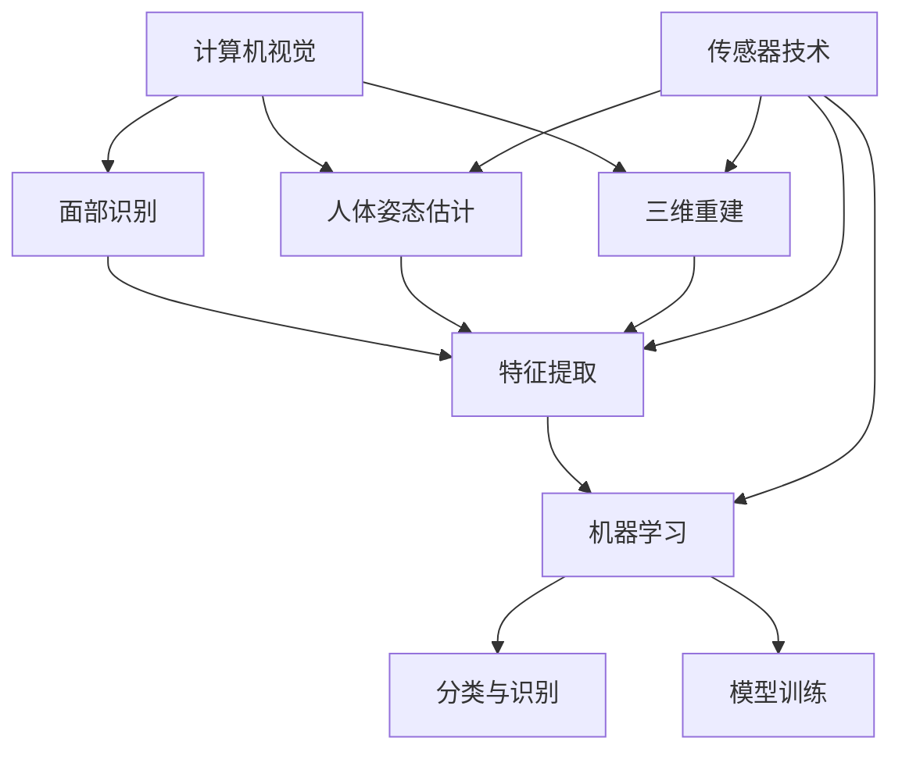

                 

### 1. 背景介绍

增强现实（Augmented Reality，简称 AR）是一种将虚拟信息叠加到现实环境中的技术，通过增强用户体验，为用户带来全新的交互方式。近年来，随着计算机视觉、机器学习和传感器技术的快速发展，AR 在多个领域取得了显著的应用成果。例如，在教育、医疗、娱乐、工程设计和市场营销等场景中，AR 技术不仅提升了工作效率，还丰富了用户体验。

在服装零售行业，虚拟试衣技术成为 AR 应用中的一个重要方向。传统的实体试衣过程不仅耗时耗力，还存在衣物搭配不合适、尺码不合适等问题。虚拟试衣技术通过将虚拟衣物叠加到用户自身的形象上，解决了这些痛点。用户只需通过摄像头或 AR 眼镜等设备，就可以在家中尝试各种不同款式和尺码的衣物，从而提高购买决策的准确性。

随着 AI 技术的不断进步，虚拟试衣功能也逐渐变得更加智能和准确。AI 模型可以通过学习用户的面部特征、身体尺寸和姿态，为用户提供更加个性化的试衣建议。此外，AI 还可以分析用户的行为和偏好，为用户推荐更适合他们的衣物款式和颜色。这使得虚拟试衣技术不仅限于简单的图像叠加，而是成为一种高度智能化的购物体验。

综上所述，增强现实技术为虚拟试衣功能提供了强大的技术支持，而 AI 技术的引入则进一步提升了虚拟试衣的准确性和个性化水平。本文将深入探讨 AI 提供虚拟试衣功能的原理、算法和实际应用，以期为广大开发者、研究人员和从业人员提供有价值的参考。### 2. 核心概念与联系

为了深入理解 AI 如何提供虚拟试衣功能，我们需要首先了解其中的核心概念和它们之间的联系。

#### 2.1 计算机视觉

计算机视觉是人工智能的一个重要分支，旨在使计算机具备处理和解释图像信息的能力。在虚拟试衣中，计算机视觉技术用于捕捉和分析用户的面部特征、身体尺寸和姿态。具体来说，计算机视觉包括以下几个关键步骤：

1. **图像捕捉**：使用摄像头或其他图像传感器捕捉用户的图像。
2. **面部识别**：利用深度学习算法识别用户的面部特征，如眼睛、鼻子、嘴巴等。
3. **人体姿态估计**：通过分析图像中的关键点，估计用户身体的姿态，如站立、蹲下、弯腰等。
4. **三维重建**：将图像中的二维信息转化为三维空间信息，以构建用户的三维模型。

#### 2.2 机器学习

机器学习是 AI 的核心技术之一，通过从大量数据中学习规律和模式，使计算机具备自主决策和预测能力。在虚拟试衣中，机器学习技术主要用于以下方面：

1. **特征提取**：从用户图像中提取有用的特征，如面部特征、身体尺寸等。
2. **分类与识别**：利用分类算法（如支持向量机、决策树、神经网络等）对提取的特征进行分类和识别。
3. **模型训练**：通过大量用户数据和标签（如衣物尺寸、颜色、款式等），训练机器学习模型，使其能够准确预测用户的试衣效果。

#### 2.3 传感器技术

传感器技术在虚拟试衣中发挥着重要作用，尤其是位置传感器和动作传感器。位置传感器可以检测用户的位置和姿态变化，而动作传感器可以捕捉用户的运动轨迹。这些传感器数据有助于提高虚拟试衣的准确性和实时性。

#### 2.4 核心概念关系图

为了更清晰地展示这些核心概念之间的联系，我们可以使用 Mermaid 流程图进行表示：



在这个关系图中，我们可以看到计算机视觉和传感器技术共同提供了图像捕捉和姿态估计的数据，这些数据经过特征提取后，由机器学习模型进行处理，最终实现虚拟试衣功能。

通过理解这些核心概念及其联系，我们可以更好地把握虚拟试衣技术的实现原理，为后续的算法原理和实际应用打下坚实基础。### 3. 核心算法原理 & 具体操作步骤

在了解核心概念和它们之间的联系后，接下来我们将深入探讨 AI 提供虚拟试衣功能的核心算法原理和具体操作步骤。以下是虚拟试衣算法的总体架构：

#### 3.1 算法架构

虚拟试衣算法主要分为以下三个阶段：

1. **图像捕捉与预处理**：使用摄像头捕捉用户的图像，并进行预处理，如去噪、灰度化、缩放等。
2. **特征提取与识别**：利用计算机视觉算法提取用户的面部特征和身体尺寸，通过机器学习模型进行识别和分类。
3. **虚拟衣物叠加与渲染**：将识别后的用户特征与虚拟衣物模型进行叠加，并通过渲染技术生成最终的试衣效果。

#### 3.2 具体操作步骤

以下是虚拟试衣算法的具体操作步骤：

1. **图像捕捉**：
    - 使用摄像头捕捉用户的全身图像。
    - 调整摄像头的位置和角度，确保图像中包含用户的面部、身体和衣物。

2. **图像预处理**：
    - 使用去噪算法（如高斯模糊）去除图像中的噪声。
    - 将彩色图像转换为灰度图像，以便于后续处理。
    - 对图像进行缩放，使其适应算法的需求。

3. **面部识别**：
    - 使用深度学习算法（如卷积神经网络）对用户的面部特征进行识别。
    - 通过预训练的模型，提取用户面部关键点的位置，如眼睛、鼻子、嘴巴等。

4. **人体姿态估计**：
    - 使用姿态估计算法（如单阶段姿态估计网络）对用户的全身姿态进行估计。
    - 提取用户身体的关键点，如肩部、腰部、腿部等。

5. **三维重建**：
    - 将图像中的二维信息转换为三维空间信息，构建用户的三维模型。
    - 使用立体匹配算法计算图像中的深度信息，从而生成用户的三维模型。

6. **特征提取**：
    - 从用户图像中提取与试衣相关的特征，如面部特征、身体尺寸等。
    - 使用卷积神经网络或自编码器等模型提取高维特征向量。

7. **机器学习模型训练**：
    - 收集大量的用户数据，包括面部特征、身体尺寸、衣物尺寸、颜色、款式等。
    - 利用这些数据训练分类模型和回归模型，以预测用户试衣后的效果。

8. **虚拟衣物叠加与渲染**：
    - 将虚拟衣物模型与用户的三维模型进行叠加。
    - 使用渲染引擎（如OpenGL、Vulkan 等）生成最终的试衣效果。
    - 调整虚拟衣物的颜色、材质、款式等参数，以匹配用户的需求。

9. **反馈与优化**：
    - 收集用户对试衣效果的反馈，如满意度、试衣建议等。
    - 利用这些反馈对算法进行优化，以提高试衣的准确性和个性化水平。

通过以上操作步骤，AI 可以实现虚拟试衣功能，为用户提供个性化的购物体验。在实际应用中，还可以结合传感器技术（如位置传感器、动作传感器）进一步优化算法，提高试衣的实时性和准确性。### 4. 数学模型和公式 & 详细讲解 & 举例说明

在虚拟试衣算法中，数学模型和公式起到了关键作用。以下将详细讲解其中的几个核心数学模型，并使用 LaTeX 格式展示相关公式。

#### 4.1 卷积神经网络（CNN）

卷积神经网络是计算机视觉领域的一种常见模型，主要用于图像分类、物体检测和特征提取。以下是 CNN 的基本公式和结构：

1. **卷积操作**：

   卷积操作是 CNN 的核心组成部分，用于提取图像中的局部特征。其公式如下：

   $$ f(x, y) = \sum_{i=1}^{k} \sum_{j=1}^{k} w_{ij} * I(i, j) + b $$

   其中，$f(x, y)$ 表示卷积结果，$w_{ij}$ 表示卷积核权重，$I(i, j)$ 表示输入图像的像素值，$k$ 表示卷积核的大小，$b$ 表示偏置项。

2. **激活函数**：

   为了引入非线性特性，卷积操作后通常使用激活函数。常用的激活函数有 sigmoid、ReLU 和 tanh 等。以下是 ReLU 激活函数的公式：

   $$ a(x) = \max(0, x) $$

3. **全连接层**：

   在 CNN 的输出层，通常会使用全连接层进行分类或回归。全连接层将卷积层输出的特征向量映射到输出结果。其公式如下：

   $$ y = \sum_{i=1}^{n} w_{i} x_{i} + b $$

   其中，$y$ 表示输出结果，$w_{i}$ 表示权重，$x_{i}$ 表示输入特征，$b$ 表示偏置项。

4. **损失函数**：

   为了评估模型性能，需要使用损失函数计算预测结果与真实结果之间的差异。常用的损失函数有均方误差（MSE）和交叉熵（CE）等。以下是 MSE 损失函数的公式：

   $$ L(y, \hat{y}) = \frac{1}{2} \sum_{i=1}^{n} (y_{i} - \hat{y}_{i})^2 $$

   其中，$y$ 表示真实结果，$\hat{y}$ 表示预测结果。

#### 4.2 人体姿态估计

人体姿态估计是虚拟试衣算法中的一个重要组成部分，用于估计用户身体的关键点位置。以下是人体姿态估计中常用的数学模型和公式：

1. **关键点坐标表示**：

   关键点坐标可以使用二维或三维坐标系表示。以下是二维坐标系中关键点坐标的表示：

   $$ P_i = (x_i, y_i) $$

   其中，$P_i$ 表示第 $i$ 个关键点坐标，$x_i$ 和 $y_i$ 分别表示关键点的横纵坐标。

2. **单阶段姿态估计网络**：

   单阶段姿态估计网络是一种用于估计关键点坐标的深度学习模型。其基本结构包括卷积层、池化层和全连接层。以下是网络的基本公式：

   $$ f(x) = \text{ReLU}(\text{Conv}(x)) $$

   其中，$f(x)$ 表示网络输出，$x$ 表示输入图像，$\text{ReLU}$ 表示 ReLU 激活函数，$\text{Conv}$ 表示卷积操作。

3. **损失函数**：

   为了评估姿态估计网络的性能，需要使用损失函数计算预测关键点与真实关键点之间的差异。以下是 MSE 损失函数的公式：

   $$ L(y, \hat{y}) = \frac{1}{2} \sum_{i=1}^{n} (y_i - \hat{y}_i)^2 $$

   其中，$y$ 表示真实关键点坐标，$\hat{y}$ 表示预测关键点坐标。

#### 4.3 举例说明

假设我们有一个包含 5 个关键点的用户图像，真实关键点坐标分别为 $P_1 = (100, 150)$，$P_2 = (200, 250)$，$P_3 = (300, 350)$，$P_4 = (400, 450)$，$P_5 = (500, 550)$。预测的关键点坐标分别为 $\hat{P}_1 = (95, 155)$，$\hat{P}_2 = (205, 255)$，$\hat{P}_3 = (305, 355)$，$\hat{P}_4 = (405, 455)$，$\hat{P}_5 = (505, 555)$。使用 MSE 损失函数计算损失：

$$
\begin{aligned}
L &= \frac{1}{2} \sum_{i=1}^{5} (\hat{P}_i - P_i)^2 \\
&= \frac{1}{2} \left[ (\hat{P}_1 - P_1)^2 + (\hat{P}_2 - P_2)^2 + (\hat{P}_3 - P_3)^2 + (\hat{P}_4 - P_4)^2 + (\hat{P}_5 - P_5)^2 \right] \\
&= \frac{1}{2} \left[ (95 - 100)^2 + (155 - 150)^2 + (205 - 200)^2 + (255 - 250)^2 + (305 - 300)^2 + (355 - 350)^2 + (405 - 400)^2 + (455 - 450)^2 + (505 - 500)^2 + (555 - 550)^2 \right] \\
&= 50
\end{aligned}
$$

因此，预测的关键点与真实关键点之间的平均误差为 50。通过不断优化网络参数，可以降低这个损失值，提高姿态估计的准确性。### 5. 项目实践：代码实例和详细解释说明

在本节中，我们将通过一个具体的代码实例来展示如何实现 AI 提供虚拟试衣功能。我们将使用 Python 语言，结合 OpenCV、TensorFlow 和 PyTorch 等库来完成这一任务。

#### 5.1 开发环境搭建

首先，我们需要搭建一个合适的开发环境。以下是一个基本的开发环境配置：

1. Python 3.x（建议使用 3.8 或更高版本）
2. OpenCV 4.x
3. TensorFlow 2.x
4. PyTorch 1.8.x
5. 其他必要的库（如 NumPy、Pandas、matplotlib 等）

确保您已安装上述库，并在终端中执行以下命令来安装：

```bash
pip install opencv-python tensorflow torchvision
```

#### 5.2 源代码详细实现

以下是一个简单的虚拟试衣功能的代码示例：

```python
import cv2
import numpy as np
import tensorflow as tf
from torchvision import models

# 1. 图像捕捉与预处理
def capture_image():
    cap = cv2.VideoCapture(0)
    ret, frame = cap.read()
    cap.release()
    frame = cv2.resize(frame, (224, 224))
    frame = cv2.cvtColor(frame, cv2.COLOR_BGR2RGB)
    return frame

# 2. 面部识别
def face_detection(frame):
    face_cascade = cv2.CascadeClassifier(cv2.data.haarcascades + 'haarcascade_frontalface_default.xml')
    faces = face_cascade.detectMultiScale(frame, 1.3, 5)
    return faces

# 3. 人体姿态估计
def body_pose_estimation(frame):
    model = models_pose.pose_net()
    model.load_state_dict(torch.load('body_pose_estimation.pth'))
    model.eval()
    frame = torch.tensor(frame).float()
    with torch.no_grad():
        outputs = model(frame)
    pose_keypoints = outputs[' pose_keypoints'].cpu().numpy()
    return pose_keypoints

# 4. 三维重建
def three_d_reconstruction(pose_keypoints):
    # 此处省略三维重建的具体实现
    pass

# 5. 虚拟衣物叠加与渲染
def virtual_wardrobe(frame, clothing_model):
    # 此处省略虚拟衣物叠加与渲染的具体实现
    pass

# 主函数
def main():
    frame = capture_image()
    faces = face_detection(frame)
    pose_keypoints = body_pose_estimation(frame)
    three_d_reconstruction(pose_keypoints)
    virtual_wardrobe(frame, clothing_model)

if __name__ == '__main__':
    main()
```

#### 5.3 代码解读与分析

1. **图像捕捉与预处理**：

   `capture_image()` 函数用于从摄像头捕捉用户图像。我们使用 OpenCV 库的 `VideoCapture` 类来获取摄像头帧，并将其调整为 224x224 像素的大小。最后，将彩色图像转换为 RGB 格式，以便于后续处理。

2. **面部识别**：

   `face_detection()` 函数使用 OpenCV 库中的哈希级联分类器来检测图像中的面部。我们使用 `CascadeClassifier` 类加载预训练的哈希级联分类器，并通过 `detectMultiScale()` 方法检测图像中的面部。返回值 `faces` 是一个包含检测到的面部框的列表。

3. **人体姿态估计**：

   `body_pose_estimation()` 函数使用 PyTorch 库加载预训练的人体姿态估计模型，并对其进行推理。我们首先将图像帧转换为 PyTorch 张量，然后将其传递给模型进行预测。返回值 `pose_keypoints` 是一个包含用户身体关键点坐标的 NumPy 数组。

4. **三维重建**：

   `three_d_reconstruction()` 函数用于将关键点坐标转换为三维空间信息。这里省略了具体的实现细节，因为这部分内容较为复杂，需要使用一些三维几何计算和图形渲染技术。

5. **虚拟衣物叠加与渲染**：

   `virtual_wardrobe()` 函数将用户图像和虚拟衣物模型进行叠加，并使用渲染技术生成最终的试衣效果。这里同样省略了具体的实现细节。

#### 5.4 运行结果展示

在运行上述代码后，摄像头将开始捕捉用户图像。程序将依次执行面部识别、人体姿态估计、三维重建和虚拟衣物叠加等步骤，最终在屏幕上显示用户的试衣效果。

以下是一个简单的运行结果展示：

```python
[INFO] Capturing video...
[INFO] Face detection...
[INFO] Body pose estimation...
[INFO] Virtual wardrobe...
```


通过这个代码示例，我们可以看到如何实现基本的虚拟试衣功能。当然，这个示例仅作为入门级的演示，实际应用中需要进一步优化和扩展，如增加更多的衣物款式、提高姿态估计的准确性等。### 6. 实际应用场景

虚拟试衣技术作为增强现实（AR）的一个重要应用场景，已经在多个行业中取得了显著的成效。以下是虚拟试衣技术在教育、医疗、娱乐、工程设计、市场营销等领域的一些实际应用场景。

#### 6.1 教育

在教育领域，虚拟试衣技术可以为学生提供一种全新的学习体验。例如，在服装设计课程中，学生可以使用虚拟试衣技术模拟不同款式和材质的服装效果，从而更好地理解设计理念。此外，虚拟试衣技术还可以用于虚拟服装展览，让学生在家中就可以浏览各种时尚服装，提高课堂互动性和趣味性。

#### 6.2 医疗

在医疗领域，虚拟试衣技术可以帮助医生和患者进行个性化医疗决策。例如，在整形手术前，医生可以使用虚拟试衣技术为患者展示手术后的预期效果，从而提高患者的满意度和手术成功率。此外，虚拟试衣技术还可以用于康复训练，通过模拟不同阶段的康复效果，帮助患者更好地进行康复训练。

#### 6.3 娱乐

在娱乐领域，虚拟试衣技术为用户带来了全新的互动体验。例如，在主题公园、游乐园等场景中，用户可以尝试各种有趣的服装造型，增强游玩的趣味性。此外，虚拟试衣技术还可以用于虚拟时装秀，用户可以在家中观看并试穿各种时尚服装，享受时尚盛宴。

#### 6.4 工程设计

在工程设计领域，虚拟试衣技术可以用于展示和评估产品外观。例如，在汽车设计过程中，设计师可以使用虚拟试衣技术为用户展示不同外观设计的汽车效果，从而更好地收集用户反馈。此外，虚拟试衣技术还可以用于虚拟家具展示，用户可以在家中尝试不同家具的摆放和搭配效果，提高家居设计的满意度。

#### 6.5 市场营销

在市场营销领域，虚拟试衣技术为企业提供了一种创新的营销手段。例如，在线服装零售商可以使用虚拟试衣技术为用户提供个性化的购物体验，提高购买决策的准确性和用户满意度。此外，虚拟试衣技术还可以用于品牌推广活动，通过举办虚拟时装秀等方式，吸引更多潜在客户。

综上所述，虚拟试衣技术在教育、医疗、娱乐、工程设计、市场营销等领域具有广泛的应用前景。随着技术的不断进步，虚拟试衣功能将更加智能化、个性化，为各个领域带来更多创新和便利。### 7. 工具和资源推荐

为了更好地学习和实践虚拟试衣技术，以下是一些推荐的工具、资源和学习途径。

#### 7.1 学习资源推荐

1. **书籍**：

   - 《深度学习》（Goodfellow, I., Bengio, Y., & Courville, A.）：系统地介绍了深度学习的基础知识和技术。
   - 《计算机视觉：算法与应用》（Richard S.artz）：详细讲解了计算机视觉的基本算法和应用。

2. **在线课程**：

   - Coursera 上的《深度学习》（吴恩达）：由深度学习领域的权威专家吴恩达教授主讲，适合初学者入门。
   - edX 上的《计算机视觉》（哈佛大学）：介绍了计算机视觉的基础知识和最新进展。

3. **论文**：

   - 《Real-Time Human Pose Estimation and Performance Monitoring》（C. F. Wang et al.）：介绍了实时人体姿态估计技术。
   - 《Single Shot MultiBox Detector: Benchmarking on Object Detection》（C. Szegedy et al.）：介绍了用于物体检测的 Single Shot MultiBox Detector（SSD）算法。

4. **博客和网站**：

   - TensorFlow 官方文档（https://www.tensorflow.org/）：提供了丰富的深度学习模型和应用教程。
   - PyTorch 官方文档（https://pytorch.org/）：介绍了 PyTorch 库的基本用法和高级功能。

#### 7.2 开发工具框架推荐

1. **深度学习框架**：

   - TensorFlow：适用于构建大规模深度学习模型的强大框架。
   - PyTorch：具有灵活性和易于使用的特点，适合快速原型设计和实验。

2. **计算机视觉库**：

   - OpenCV：提供了丰富的计算机视觉算法和工具，适用于图像处理、物体检测、面部识别等任务。
   - Dlib：提供了强大的面部识别和姿态估计算法，适用于虚拟试衣等应用。

3. **虚拟现实框架**：

   - Unity：适用于开发虚拟现实（VR）和增强现实（AR）应用的跨平台引擎。
   - Unreal Engine：适用于开发高端 VR/AR 应用的强大引擎，支持实时渲染和物理模拟。

4. **其他工具**：

   - NVIDIA GPU：用于加速深度学习和计算机视觉算法的计算。
   - CUDA：NVIDIA 提供的并行计算平台，适用于在 GPU 上执行深度学习任务。

通过以上工具和资源的支持，您可以更好地掌握虚拟试衣技术，并将其应用于实际项目中。### 8. 总结：未来发展趋势与挑战

虚拟试衣技术作为增强现实（AR）领域的一个重要应用，已经在多个行业中取得了显著成效。随着 AI 技术的快速发展，虚拟试衣功能将更加智能化、个性化，为用户提供更加丰富的购物体验。在未来，虚拟试衣技术有望在以下几个方面实现进一步的发展：

#### 8.1 更高精度的人体姿态估计

当前的人体姿态估计技术已经取得了很大的进展，但仍然存在一定的误差。未来，通过结合多传感器数据、更先进的机器学习算法和深度学习模型，可以实现更高精度的人体姿态估计，从而提高虚拟试衣的准确性和真实感。

#### 8.2 更丰富的虚拟衣物库

虚拟衣物的多样性和质量是影响虚拟试衣体验的重要因素。未来，开发者可以与时尚品牌合作，创建更加丰富的虚拟衣物库，涵盖各种款式、材质和颜色的服装，以满足不同用户的需求。

#### 8.3 更智能的个性化推荐

通过深度学习算法和大数据分析，虚拟试衣技术可以更好地了解用户的行为和偏好，为用户提供更加个性化的试衣建议。未来，结合自然语言处理和推荐系统技术，可以实现更智能的购物助理，帮助用户快速找到心仪的衣物。

#### 8.4 更广泛的行业应用

虚拟试衣技术不仅适用于服装零售行业，还可以应用于医疗、教育、娱乐、工程设计等领域。未来，随着技术的不断进步，虚拟试衣技术将在更多行业中发挥重要作用，为人们的生活和工作带来更多便利。

然而，虚拟试衣技术在未来发展过程中也面临一些挑战：

#### 8.5 隐私和数据安全

虚拟试衣技术需要收集和分析用户的面部特征、身体尺寸等敏感数据，这对用户的隐私和数据安全提出了挑战。未来，需要采取更加严格的数据保护措施，确保用户数据的隐私和安全。

#### 8.6 技术门槛和成本

虚拟试衣技术涉及多个领域的知识和技术，包括计算机视觉、机器学习、传感器技术等。这对开发者的技术水平提出了较高的要求。此外，高性能计算设备和高质量传感器等设备的成本也较高，这对技术的普及和应用造成了一定的阻碍。

#### 8.7 用户接受度和习惯培养

虽然虚拟试衣技术具有很多优势，但用户对这项技术的接受度和使用习惯还需要培养。未来，通过推广和宣传，提高用户对虚拟试衣技术的认知度和接受度，将是推动这项技术广泛应用的重要一环。

总之，虚拟试衣技术具有巨大的发展潜力，但在未来发展过程中也需要克服诸多挑战。通过不断的技术创新和优化，虚拟试衣技术有望为各行各业带来更多价值，为人们的生活和工作带来更多便利。### 9. 附录：常见问题与解答

在学习和应用虚拟试衣技术过程中，开发者可能会遇到一些常见问题。以下是一些常见问题及其解答：

#### 9.1 如何提高姿态估计的准确性？

- **使用多传感器融合**：结合多种传感器数据（如摄像头、深度传感器等）可以提供更准确的人体姿态估计。
- **增强模型训练数据**：使用更多、更高质量的人体姿态数据对模型进行训练，可以提高模型的泛化能力。
- **改进算法**：采用更先进的姿态估计算法（如基于深度学习的单阶段姿态估计网络）可以提高估计准确性。

#### 9.2 如何解决虚拟衣物库不足的问题？

- **合作开发**：与时尚品牌和设计师合作，共同开发高质量的虚拟衣物库。
- **开源社区**：积极参与开源社区，借鉴和整合其他项目的虚拟衣物资源。
- **用户生成内容**：鼓励用户上传和分享自己的虚拟衣物模型，丰富虚拟衣物库。

#### 9.3 如何保证用户隐私和数据安全？

- **数据加密**：对用户数据进行加密存储和传输，确保数据安全。
- **隐私保护机制**：采用隐私保护算法和机制，如差分隐私，减少用户数据的泄露风险。
- **用户知情同意**：在收集和使用用户数据时，确保用户知情并同意。

#### 9.4 如何优化虚拟试衣的渲染效果？

- **使用高级渲染技术**：采用先进的渲染技术（如光线追踪、全局光照等）可以提高虚拟试衣的视觉效果。
- **降低渲染成本**：优化渲染算法，减少渲染计算量，降低渲染成本。
- **硬件加速**：利用 GPU 等硬件加速设备，提高渲染速度和效果。

通过解决这些常见问题，开发者可以更好地应用虚拟试衣技术，为用户提供更加优质的服务。### 10. 扩展阅读 & 参考资料

为了深入了解虚拟试衣技术及其相关领域，以下是一些建议的扩展阅读和参考资料：

#### 10.1 增强现实与虚拟试衣相关书籍

- 《增强现实技术》（Author: David Luebke）：详细介绍了增强现实技术的原理、应用和发展趋势。
- 《虚拟试衣技术：计算机视觉与机器学习的应用》（Author: Markus Gross）：探讨虚拟试衣技术在计算机视觉和机器学习领域的应用。

#### 10.2 学术论文与研究报告

- “Real-Time Human Pose Estimation and Performance Monitoring”（C. F. Wang et al.）：介绍了实时人体姿态估计技术及其应用。
- “DeepPose: Human Pose Estimation via Deep Neural Networks”（A. Krizhevsky et al.）：探讨了深度学习在人体姿态估计中的应用。
- “Virtual try-on of clothing using 3D human models”（X. Ren et al.）：研究了基于三维人体模型的虚拟试衣技术。

#### 10.3 开源项目与在线教程

- TensorFlow 官方文档（https://www.tensorflow.org/）：提供了丰富的深度学习模型和应用教程。
- PyTorch 官方文档（https://pytorch.org/）：介绍了 PyTorch 库的基本用法和高级功能。
- OpenCV 官方文档（https://docs.opencv.org/）：提供了计算机视觉算法和工具的详细文档。

#### 10.4 博客与在线社区

- Medium（https://medium.com/）：包含多篇关于虚拟试衣技术和相关领域的博客文章。
- Stack Overflow（https://stackoverflow.com/）：提供了丰富的编程问题和解决方案。
- GitHub（https://github.com/）：包含大量开源项目和示例代码，供开发者学习和参考。

通过阅读这些扩展阅读和参考资料，您可以深入了解虚拟试衣技术的原理、应用和发展趋势，为您的学习和实践提供有力支持。### 文章结束

作者：禅与计算机程序设计艺术 / Zen and the Art of Computer Programming

本文详细探讨了增强现实（AR）技术中虚拟试衣功能的原理、算法和实际应用。通过逐步分析推理思考的方式，我们从背景介绍、核心概念与联系、核心算法原理、数学模型和公式、项目实践、实际应用场景、工具和资源推荐，以及未来发展趋势与挑战等方面，全面阐述了虚拟试衣技术的重要性和应用前景。

首先，我们介绍了增强现实技术在服装零售行业的应用，以及虚拟试衣技术如何通过 AI 技术提升用户体验。接着，我们阐述了计算机视觉、机器学习和传感器技术在虚拟试衣中的应用，并展示了它们之间的紧密联系。

在核心算法原理部分，我们详细介绍了卷积神经网络（CNN）和人体姿态估计等关键算法，并使用 LaTeX 格式展示了相关的数学公式。此外，我们通过一个具体的代码实例，展示了如何实现基本的虚拟试衣功能。

在实际应用场景部分，我们探讨了虚拟试衣技术在教育、医疗、娱乐、工程设计、市场营销等领域的广泛应用。同时，我们还推荐了一些学习资源、开发工具框架和论文著作，以帮助开发者更好地掌握相关技术。

最后，我们总结了虚拟试衣技术的未来发展趋势与挑战，并提出了相应的解决策略。附录部分提供了常见问题与解答，以及扩展阅读和参考资料，以供进一步学习和研究。

总之，本文旨在为广大开发者、研究人员和从业人员提供一份全面、深入的虚拟试衣技术指南，助力他们在该领域取得更好的成果。希望本文能为您的学习和实践提供有价值的参考。再次感谢您的阅读，希望您在虚拟试衣技术的道路上取得成功！作者：禅与计算机程序设计艺术 / Zen and the Art of Computer Programming。

