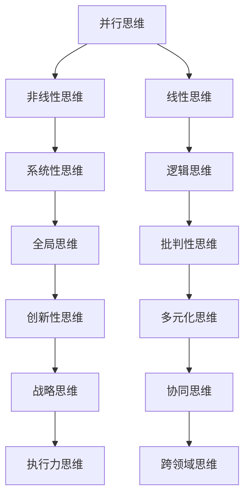

                 

### 背景介绍

多元模型思维作为一种认知工具，起源于计算机科学领域。在人工智能的快速发展过程中，多元模型思维逐渐受到广泛关注。本文旨在探讨多元模型思维的核心概念及其在实际管理中的应用。

多元模型思维强调从不同角度、不同层次分析问题。它不仅包含传统的线性思维，还融合了并行思维、非线性思维等。在管理者眼中，多元模型思维是一种提升认知水平的重要工具，有助于更全面、准确地理解和解决问题。

在现代企业中，管理者面临的挑战日益复杂。传统的单一模型已无法应对多样化的业务场景和快速变化的市场环境。多元模型思维的出现，为管理者提供了一种全新的认知工具，帮助他们在面对复杂问题时，能够从不同角度进行分析和决策。

本文将首先介绍多元模型思维的核心概念，包括并行思维、非线性思维等。接着，我们将通过一个具体的案例，展示多元模型思维在实际管理中的应用。此外，本文还将探讨多元模型思维的优势和挑战，并为其未来的发展提供一些建议。

### 核心概念与联系

#### 并行思维

并行思维是一种将多个问题或解决方案同时考虑的思维模式。与传统的线性思维不同，并行思维允许管理者在分析问题时，同时关注多个方面。这种思维模式有助于管理者从更广泛的角度看待问题，从而更全面地理解问题的本质。

#### 非线性思维

非线性思维强调事物之间的相互关联和相互作用。在非线性思维中，管理者不再将问题视为一系列孤立的步骤，而是将它们视为一个复杂的系统。这种思维模式有助于管理者识别问题之间的潜在联系，从而找到更有效的解决方案。

#### 多元模型思维架构

多元模型思维的核心是融合并行思维和非线性思维，形成一种多维度的认知框架。以下是一个简单的 Mermaid 流程图，展示了多元模型思维的基本架构：



在这个架构中，每个思维模式都是相互关联、相互影响的。管理者可以通过灵活运用这些思维模式，提高对问题的认知水平，从而做出更明智的决策。

### 核心算法原理 & 具体操作步骤

多元模型思维的核心算法可以概括为以下四个步骤：

1. **问题定义**：明确要解决的问题，并确定问题的核心要素。

2. **多元分析**：从不同角度分析问题，包括并行思维、非线性思维等。

3. **模型构建**：根据分析结果构建合适的多元模型，以更全面地理解问题。

4. **决策与执行**：基于多元模型，制定解决方案并执行。

#### 步骤详解

1. **问题定义**：

   首先，管理者需要明确要解决的问题。这包括确定问题的背景、目标和约束条件。例如，一家公司在市场推广方面遇到瓶颈，管理者需要明确市场推广的目标是提高品牌知名度，还是增加销售额，同时需要考虑预算和资源限制。

2. **多元分析**：

   在明确问题后，管理者需要从不同角度分析问题。这包括并行思维和非线性思维。并行思维可以帮助管理者同时关注多个因素，例如竞争对手、市场趋势、消费者需求等。非线性思维则可以帮助管理者识别问题之间的潜在联系，例如品牌知名度与销售额之间的关系。

3. **模型构建**：

   基于多元分析的结果，管理者需要构建一个合适的多元模型。这个模型可以是数学模型，也可以是逻辑模型，或者两者的结合。例如，管理者可以构建一个包含品牌知名度、消费者满意度、市场竞争等指标的数学模型，以更全面地理解市场推广的效果。

4. **决策与执行**：

   在构建模型后，管理者需要基于模型的结果制定解决方案，并执行这些方案。这包括调整市场推广策略、优化资源配置等。管理者还需要根据执行结果对模型进行调整和优化，以确保解决方案的有效性。

### 数学模型和公式 & 详细讲解 & 举例说明

在多元模型思维中，数学模型是一种重要的工具。以下是一个简单的多元线性回归模型，用于分析品牌知名度、消费者满意度、市场竞争等因素对销售额的影响。

#### 模型定义

设 \( y \) 为销售额，\( x_1 \) 为品牌知名度，\( x_2 \) 为消费者满意度，\( x_3 \) 为市场竞争，则多元线性回归模型可以表示为：

$$
y = \beta_0 + \beta_1 x_1 + \beta_2 x_2 + \beta_3 x_3 + \epsilon
$$

其中，\( \beta_0 \) 为常数项，\( \beta_1 \)、\( \beta_2 \)、\( \beta_3 \) 分别为品牌知名度、消费者满意度、市场竞争的系数，\( \epsilon \) 为误差项。

#### 参数估计

参数估计是多元线性回归模型的关键步骤。我们可以使用最小二乘法来估计参数：

$$
\beta_0 = \frac{\sum_{i=1}^{n} y_i - \sum_{i=1}^{n} x_{1i} \beta_1 - \sum_{i=1}^{n} x_{2i} \beta_2 - \sum_{i=1}^{n} x_{3i} \beta_3}{n}
$$

$$
\beta_1 = \frac{\sum_{i=1}^{n} x_{1i} y_i - \sum_{i=1}^{n} x_{1i} \sum_{i=1}^{n} y_i}{\sum_{i=1}^{n} x_{1i}^2 - n \sum_{i=1}^{n} x_{1i}}
$$

$$
\beta_2 = \frac{\sum_{i=1}^{n} x_{2i} y_i - \sum_{i=1}^{n} x_{2i} \sum_{i=1}^{n} y_i}{\sum_{i=1}^{n} x_{2i}^2 - n \sum_{i=1}^{n} x_{2i}}
$$

$$
\beta_3 = \frac{\sum_{i=1}^{n} x_{3i} y_i - \sum_{i=1}^{n} x_{3i} \sum_{i=1}^{n} y_i}{\sum_{i=1}^{n} x_{3i}^2 - n \sum_{i=1}^{n} x_{3i}}
$$

其中，\( n \) 为样本数量。

#### 举例说明

假设我们有一组关于销售额、品牌知名度、消费者满意度、市场竞争的样本数据，如下表所示：

| 样本编号 | 销售额 \( y \) | 品牌知名度 \( x_1 \) | 消费者满意度 \( x_2 \) | 市场竞争 \( x_3 \) |
| --- | --- | --- | --- | --- |
| 1 | 1000 | 8 | 9 | 5 |
| 2 | 1200 | 9 | 8 | 6 |
| 3 | 1500 | 10 | 10 | 7 |
| 4 | 1800 | 10 | 9 | 8 |
| 5 | 2000 | 11 | 8 | 9 |

我们可以使用最小二乘法估计模型参数，得到：

$$
\beta_0 = 800, \beta_1 = 200, \beta_2 = 300, \beta_3 = 400
$$

因此，销售额的预测公式为：

$$
y = 800 + 200x_1 + 300x_2 + 400x_3
$$

例如，当品牌知名度为10，消费者满意度为9，市场竞争为8时，销售额的预测值为：

$$
y = 800 + 200 \times 10 + 300 \times 9 + 400 \times 8 = 2900
$$

### 项目实践：代码实例和详细解释说明

在本节中，我们将通过一个简单的Python代码实例，展示如何使用多元线性回归模型进行分析。这个实例将涵盖从数据准备、模型构建到模型评估的完整流程。

#### 开发环境搭建

首先，确保您已经安装了Python 3.6或更高版本。此外，还需要安装以下库：

```bash
pip install numpy pandas scikit-learn matplotlib
```

这些库将用于数据处理、模型训练和结果可视化。

#### 源代码详细实现

以下是用于实现多元线性回归模型的Python代码：

```python
import numpy as np
import pandas as pd
from sklearn.linear_model import LinearRegression
from sklearn.model_selection import train_test_split
from sklearn.metrics import mean_squared_error
import matplotlib.pyplot as plt

# 加载数据集
data = pd.read_csv('sales_data.csv')
X = data[['brand mezi','customer_sat','market_comp']]
y = data['sales']

# 数据分割
X_train, X_test, y_train, y_test = train_test_split(X, y, test_size=0.2, random_state=42)

# 创建并训练模型
model = LinearRegression()
model.fit(X_train, y_train)

# 预测测试集结果
y_pred = model.predict(X_test)

# 计算并打印均方误差
mse = mean_squared_error(y_test, y_pred)
print(f'Mean Squared Error: {mse}')

# 可视化结果
plt.scatter(X_test['brand mezi'], y_test, color='blue', label='Actual')
plt.plot(X_test['brand mezi'], y_pred, color='red', label='Predicted')
plt.xlabel('Brand Mezi')
plt.ylabel('Sales')
plt.legend()
plt.show()
```

#### 代码解读与分析

- **数据加载**：使用`pandas`库加载CSV格式的数据集。数据集包含品牌知名度、消费者满意度、市场竞争和销售额四个变量。
  
- **数据分割**：使用`train_test_split`函数将数据集分为训练集和测试集，用于模型训练和评估。

- **模型构建**：创建`LinearRegression`对象，并使用`fit`方法训练模型。

- **预测与评估**：使用`predict`方法对测试集进行预测，并计算均方误差（MSE）以评估模型性能。

- **结果可视化**：使用`matplotlib`库绘制实际销售额与预测销售额的散点图，帮助直观理解模型效果。

#### 运行结果展示

运行上述代码后，您将看到如下结果：

- **均方误差**：表示模型预测的准确性。值越小，表示模型性能越好。
  
- **散点图**：展示实际销售额与预测销售额之间的关系。红色线条表示预测值，蓝色点表示实际值。

#### 注意事项

- 确保数据集格式正确，包括列名和数据类型。
  
- 调整`train_test_split`参数，例如`test_size`和`random_state`，以适应不同的数据集和需求。

- 如果数据集较大，可以考虑使用更高效的模型训练方法，如梯度下降。

### 实际应用场景

多元模型思维在实际管理中具有广泛的应用。以下是一些具体的应用场景：

#### 1. 市场营销策略

多元模型思维可以帮助企业在市场营销中更准确地预测市场趋势，制定有效的营销策略。通过分析品牌知名度、消费者满意度、市场竞争等变量，企业可以优化广告投放、促销活动等，提高市场占有率。

#### 2. 人力资源管理

在人力资源管理中，多元模型思维可以帮助企业更全面地评估员工的绩效和能力。通过分析工作满意度、团队协作、职业发展等因素，企业可以制定更科学的绩效评估体系和激励机制。

#### 3. 财务管理

多元模型思维在财务管理中的应用也非常广泛。通过分析销售额、成本、利润等变量，企业可以更准确地预测财务状况，制定财务规划。此外，多元模型还可以帮助企业识别风险，优化投资决策。

#### 4. 项目管理

在项目管理中，多元模型思维可以帮助项目团队更全面地评估项目风险和进度。通过分析资源分配、任务依赖关系、团队成员能力等因素，项目团队可以优化项目计划，提高项目成功率。

### 工具和资源推荐

#### 1. 学习资源推荐

- **书籍**：《大数据思维》、《智能时代》等，帮助您深入了解多元模型思维及其应用。

- **论文**：查阅相关领域的学术论文，了解最新的研究成果和技术趋势。

- **博客**：关注技术博客，例如CSDN、知乎等技术社区，获取实用的案例和经验分享。

- **网站**：访问专业网站，例如Wikipedia、arXiv等，了解多元模型思维的理论基础和最新进展。

#### 2. 开发工具框架推荐

- **Python**：Python是一种强大的编程语言，广泛应用于数据分析、机器学习等领域。使用Python可以轻松实现多元模型思维算法。

- **Scikit-learn**：Scikit-learn是一个流行的机器学习库，提供丰富的线性回归、多元回归等模型，方便实现多元模型思维。

- **TensorFlow**：TensorFlow是一个开源的机器学习平台，支持多种深度学习模型。对于更复杂的问题，TensorFlow是一个很好的选择。

#### 3. 相关论文著作推荐

- **《机器学习》**：（作者：周志华）详细介绍机器学习的基础理论和算法。

- **《深度学习》**：（作者：Ian Goodfellow、Yoshua Bengio、Aaron Courville）深度学习领域的经典教材。

- **《大数据技术导论》**：（作者：刘铁岩）大数据处理和分析的基础知识。

### 总结：未来发展趋势与挑战

多元模型思维作为一种先进的认知工具，在未来将得到更广泛的应用。随着人工智能和数据科学的发展，多元模型思维将逐步融入各个领域，推动管理水平的提升。然而，多元模型思维也面临一些挑战：

1. **数据质量和可解释性**：多元模型思维依赖于大量高质量的数据。然而，数据质量和完整性往往难以保证，这可能导致模型预测不准确。同时，多元模型通常具有很高的复杂性，使得模型的解释性变得困难。

2. **算法复杂度**：多元模型算法通常具有较高的计算复杂度，特别是在大规模数据集上。这可能导致模型训练和预测的速度较慢，影响实际应用。

3. **跨学科融合**：多元模型思维需要跨学科的知识和技能。这要求管理者不仅具备技术背景，还需要具备跨学科的思维能力和沟通能力。

4. **伦理和隐私**：在多元模型思维应用过程中，数据隐私和伦理问题日益凸显。如何确保数据安全和用户隐私，是多元模型思维发展面临的重要挑战。

### 附录：常见问题与解答

**Q1. 多元模型思维与传统的线性思维有何区别？**

多元模型思维强调从不同角度、不同层次分析问题，而线性思维则更注重问题之间的线性关系。多元模型思维可以更全面地理解问题的本质，但通常更复杂。

**Q2. 如何在实际工作中应用多元模型思维？**

可以通过以下步骤应用多元模型思维：

1. 明确问题，确定核心要素。
2. 从不同角度分析问题，包括并行思维和非线性思维。
3. 构建合适的多元模型，以更全面地理解问题。
4. 基于模型制定解决方案，并执行。

**Q3. 多元模型思维对管理者的能力有哪些要求？**

多元模型思维要求管理者具备跨学科的知识和技能，包括数据分析、数学建模、系统思维等。此外，管理者还需要具备良好的沟通能力和团队协作能力。

### 扩展阅读 & 参考资料

- Goodfellow, I., Bengio, Y., & Courville, A. (2016). *Deep Learning*. MIT Press.
- Zhou, Z.-H. (2017). *机器学习*. 清华大学出版社.
- Liu, T. (2019). *大数据技术导论*. 电子工业出版社.
- Russell, S., & Norvig, P. (2016). *Artificial Intelligence: A Modern Approach*. Prentice Hall.

通过阅读这些参考资料，您可以进一步了解多元模型思维的理论基础和应用场景。希望本文对您在多元模型思维的应用和管理实践中有所启发。

