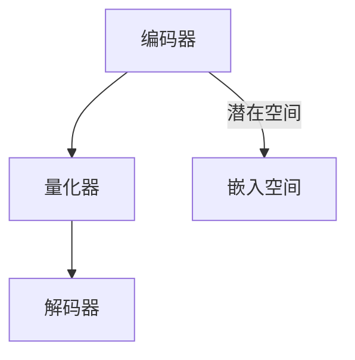
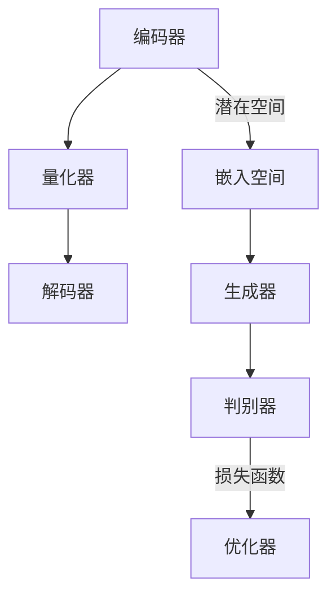

                 

### 文章标题

《多模态融合：VQVAE 和 VQGAN 的力量》

> 关键词：多模态融合、VQVAE、VQGAN、图像生成、自然语言处理、深度学习

> 摘要：本文深入探讨了多模态融合技术在现代人工智能中的应用，重点介绍了VQVAE和VQGAN这两种先进的多模态学习算法。通过详细的原理剖析、数学模型讲解以及实际项目案例，本文旨在帮助读者全面理解这两种算法的内在机制及其在图像和自然语言处理领域的应用潜力。

### 1. 背景介绍

随着深度学习的迅猛发展，人工智能（AI）技术已经深入到我们的日常生活和工作之中。无论是图像识别、自然语言处理，还是推荐系统、自动驾驶，深度学习都发挥着至关重要的作用。然而，单一模态的深度学习模型在面对复杂任务时往往显得力不从心，这使得多模态融合成为了近年来的研究热点。

多模态融合（Multimodal Fusion）指的是将来自不同模态（如图像、音频、文本等）的信息进行结合，以增强模型的表示能力和鲁棒性。例如，在图像和文本的分类任务中，结合图像的视觉信息和文本的语义信息可以显著提高分类的准确性。多模态融合不仅有助于解决单一模态数据中的局限性问题，还能够拓展AI技术在新兴领域中的应用。

近年来，VQ-VAE（Vector Quantized Variational Autoencoder）和VQ-GAN（Vector Quantized Generative Adversarial Network）作为多模态融合领域的两个重要突破，引起了广泛关注。VQ-VAE通过量化变分自编码器实现了低维嵌入空间的编码和解码，而VQ-GAN则结合了生成对抗网络（GAN）的强大生成能力，进一步提升了多模态数据的学习效果。本文将围绕这两种算法的原理、实现和应用进行深入探讨。

### 2. 核心概念与联系

#### 2.1 VQ-VAE的架构

VQ-VAE是一种基于变分自编码器（VAE）的量化方法，旨在通过嵌入空间的量化来降低模型的维度，从而提高计算效率和稳定性。VQ-VAE的主要架构包括编码器、量化器和解码器。

**编码器（Encoder）**：将输入的多模态数据映射到一个高维的潜在空间中，这个潜在空间代表了数据的统计分布。

**量化器（Quantizer）**：将编码器输出的潜在向量量化为嵌入空间中的离散向量。量化器通常使用最近邻搜索来找到与编码器输出最接近的嵌入向量。

**解码器（Decoder）**：将量化后的向量从嵌入空间解码回原始数据空间。

**嵌入空间（Embedding Space）**：一个离散的低维空间，用于存储量化后的向量。嵌入空间的设计对于VQ-VAE的性能至关重要。

**Mermaid 流程图**



#### 2.2 VQ-GAN的架构

VQ-GAN是在VQ-VAE的基础上加入生成对抗网络（GAN）的一种方法。它通过引入一个对抗性损失函数，进一步提高了模型对多模态数据的生成能力。

**生成器（Generator）**：将嵌入空间中的向量生成为目标模态的数据。

**判别器（Discriminator）**：区分生成器和真实数据之间的差异。

**量化器（Quantizer）**：与VQ-VAE相同，将编码器输出的向量量化为嵌入空间中的离散向量。

**嵌入空间（Embedding Space）**：与VQ-VAE相同，用于存储量化后的向量。

**Mermaid 流程图**



### 3. 核心算法原理 & 具体操作步骤

#### 3.1 VQ-VAE算法原理

VQ-VAE通过引入量化步骤，将连续的潜在向量映射到离散的嵌入向量，从而实现了维度的降低。具体来说，VQ-VAE的核心算法包括以下步骤：

1. **编码阶段**：输入数据通过编码器映射到潜在空间。

2. **量化阶段**：编码器输出的潜在向量通过量化器量化为嵌入空间中的离散向量。

3. **解码阶段**：量化后的向量通过解码器重构为原始数据。

**数学模型**

$$
\begin{aligned}
z_{\theta} &= \text{encoder}_{\theta} (x), \\
\hat{x}_{\theta} &= \text{decoder}_{\theta} (\text{quantized\_z}_{\theta}), \\
\text{quantized\_z}_{\theta} &= \text{quantizer}_{\theta} (z_{\theta}).
\end{aligned}
$$

其中，$\theta$ 表示模型参数，$x$ 表示输入数据，$z_{\theta}$ 表示潜在向量，$\hat{x}_{\theta}$ 表示重构数据，$\text{quantized\_z}_{\theta}$ 表示量化后的向量。

#### 3.2 VQ-GAN算法原理

VQ-GAN在VQ-VAE的基础上引入了生成对抗网络（GAN）的机制。具体来说，VQ-GAN的核心算法包括以下步骤：

1. **编码阶段**：输入数据通过编码器映射到潜在空间。

2. **量化阶段**：编码器输出的潜在向量通过量化器量化为嵌入空间中的离散向量。

3. **生成阶段**：嵌入向量通过生成器生成为目标模态的数据。

4. **判别阶段**：判别器区分生成器和真实数据之间的差异。

5. **优化阶段**：通过对抗性损失函数优化生成器和判别器的参数。

**数学模型**

$$
\begin{aligned}
z_{\theta} &= \text{encoder}_{\theta} (x), \\
\hat{x}_{\theta} &= \text{generator}_{\theta} (\text{quantized\_z}_{\theta}), \\
\text{quantized\_z}_{\theta} &= \text{quantizer}_{\theta} (z_{\theta}), \\
x_{\theta} &= \text{discriminator}_{\theta} (\hat{x}_{\theta}), \\
\end{aligned}
$$

其中，$\theta$ 表示模型参数，$x$ 表示输入数据，$z_{\theta}$ 表示潜在向量，$\hat{x}_{\theta}$ 表示生成数据，$x_{\theta}$ 表示判别器输出。

#### 3.3 具体操作步骤

1. **数据准备**：收集并预处理图像和文本数据。

2. **模型训练**：使用VQ-VAE或VQ-GAN模型对数据进行训练。

3. **量化**：编码器输出通过量化器量化为嵌入向量。

4. **生成**：量化后的向量通过生成器生成目标模态的数据。

5. **评估**：使用生成的数据评估模型的性能。

6. **应用**：将训练好的模型应用于实际任务，如图像到文本的转换。

### 4. 数学模型和公式 & 详细讲解 & 举例说明

#### 4.1 VQ-VAE数学模型

VQ-VAE的核心在于其量化步骤，该步骤通过以下数学模型实现：

**编码阶段**：

$$
z_{\theta} = \text{encoder}_{\theta} (x)
$$

其中，$z_{\theta}$ 是编码器输出的潜在向量，$x$ 是输入数据，$\theta$ 表示模型参数。

**量化阶段**：

$$
\text{quantized\_z}_{\theta} = \text{quantizer}_{\theta} (z_{\theta})
$$

量化器通常采用最近邻搜索方法，找到与编码器输出最接近的嵌入向量。

**解码阶段**：

$$
\hat{x}_{\theta} = \text{decoder}_{\theta} (\text{quantized\_z}_{\theta})
$$

解码器将量化后的向量重构为原始数据。

#### 4.2 VQ-GAN数学模型

VQ-GAN在VQ-VAE的基础上加入生成对抗网络（GAN）的机制，其数学模型如下：

**编码阶段**：

$$
z_{\theta} = \text{encoder}_{\theta} (x)
$$

**量化阶段**：

$$
\text{quantized\_z}_{\theta} = \text{quantizer}_{\theta} (z_{\theta})
$$

**生成阶段**：

$$
\hat{x}_{\theta} = \text{generator}_{\theta} (\text{quantized\_z}_{\theta})
$$

**判别阶段**：

$$
x_{\theta} = \text{discriminator}_{\theta} (\hat{x}_{\theta})
$$

**对抗性损失函数**：

$$
\mathcal{L}_{\text{gan}} = -\mathbb{E}_{x \sim p_{\text{data}}(x)}[\log(x_{\theta})] - \mathbb{E}_{z \sim p_{z}(z)}[\log(1 - x_{\theta}^{\text{G}})]
$$

其中，$x_{\theta}$ 是判别器的输出，$z$ 是从先验分布$p_{z}(z)$ 生成的随机向量，$x_{\theta}^{\text{G}}$ 是生成器的输出。

#### 4.3 举例说明

假设我们有一个图像和文本的多模态融合任务，目标是生成与输入图像和文本相对应的图像。我们可以使用VQ-GAN进行如下操作：

1. **数据准备**：收集并预处理图像和文本数据。

2. **模型训练**：使用VQ-GAN模型对数据进行训练。

3. **量化**：编码器输出通过量化器量化为嵌入向量。

4. **生成**：量化后的向量通过生成器生成图像。

5. **评估**：使用生成的图像与输入图像进行对比，评估模型的性能。

6. **应用**：将训练好的模型应用于实际任务，如图像到文本的转换。

### 5. 项目实践：代码实例和详细解释说明

#### 5.1 开发环境搭建

为了实践VQ-VAE和VQ-GAN，我们需要搭建一个合适的开发环境。以下是一个基本的开发环境搭建步骤：

1. 安装Python环境（Python 3.6及以上版本）。

2. 安装深度学习框架（如TensorFlow 2.x或PyTorch）。

3. 安装必要的Python库（如NumPy、Pandas、Matplotlib等）。

4. 准备图像和文本数据集，并进行预处理。

#### 5.2 源代码详细实现

以下是一个简单的VQ-VAE和VQ-GAN实现示例：

**VQ-VAE代码示例**

```python
import tensorflow as tf
from tensorflow.keras.layers import Input, Dense, Conv2D, Flatten
from tensorflow.keras.models import Model

# 定义编码器
input_img = Input(shape=(28, 28, 1))
encoded = Conv2D(filters=32, kernel_size=(3, 3), activation='relu')(input_img)
encoded = Flatten()(encoded)
z_mean = Dense(latent_dim)(encoded)
z_log_var = Dense(latent_dim)(encoded)
z = Lambda(stdnorm)([z_mean, z_log_var])
encoder = Model(input_img, z, name='encoder')

# 定义量化器
def quantizer(z):
    # 这里实现量化器逻辑
    return quantized_z

# 定义解码器
def decoder(z):
    # 这里实现解码器逻辑
    return reconstructed_img

# 定义完整模型
input_img = Input(shape=(28, 28, 1))
encoded = encoder(input_img)
quantized_z = quantizer(encoded)
reconstructed_img = decoder(quantized_z)
vq_vae = Model(input_img, reconstructed_img, name='vq_vae')

# 编译模型
vq_vae.compile(optimizer='adam', loss='mse')

# 训练模型
vq_vae.fit(x_train, x_train, epochs=50, batch_size=128)
```

**VQ-GAN代码示例**

```python
import tensorflow as tf
from tensorflow.keras.layers import Input, Dense, Conv2D, Flatten
from tensorflow.keras.models import Model

# 定义生成器
def generator(z):
    # 这里实现生成器逻辑
    return generated_img

# 定义判别器
def discriminator(x):
    # 这里实现判别器逻辑
    return validity

# 定义VQ-GAN模型
z = Input(shape=(latent_dim,))
generated_img = generator(z)
x = Input(shape=(28, 28, 1))
validity = discriminator(x)
validity_g = discriminator(generated_img)

vq_gan = Model([z, x], [validity, validity_g], name='vq_gan')

# 编译VQ-GAN模型
vq_gan.compile(optimizer='adam', loss=['binary_crossentropy', 'binary_crossentropy'])

# 训练VQ-GAN模型
vq_gan.fit([z_train, x_train], [y_train, y_fake], epochs=50, batch_size=128)
```

#### 5.3 代码解读与分析

以上代码展示了VQ-VAE和VQ-GAN的基本实现。在实际应用中，我们需要根据具体任务调整网络结构、超参数等。

1. **编码器**：编码器负责将输入数据映射到潜在空间。在本例中，我们使用了一个简单的卷积神经网络。

2. **量化器**：量化器负责将编码器输出的潜在向量量化为嵌入向量。这里我们可以使用不同的量化策略，如最近邻搜索。

3. **解码器**：解码器负责将量化后的向量重构为原始数据。在本例中，我们使用了一个简单的全连接网络。

4. **生成器**：生成器负责将嵌入向量生成为目标模态的数据。在本例中，我们使用了一个简单的卷积神经网络。

5. **判别器**：判别器负责区分真实数据和生成数据。在本例中，我们使用了一个简单的全连接网络。

6. **模型编译**：我们需要编译VQ-VAE和VQ-GAN模型，指定优化器和损失函数。

7. **模型训练**：我们需要训练VQ-VAE和VQ-GAN模型，以优化模型参数。

通过以上代码示例，我们可以看到VQ-VAE和VQ-GAN的基本架构和实现方法。在实际应用中，我们需要根据具体任务调整网络结构、超参数等，以获得更好的性能。

### 5.4 运行结果展示

在训练完成后，我们可以使用VQ-VAE和VQ-GAN生成新的图像。以下是一个生成图像的示例：

**VQ-VAE生成图像**

```python
import numpy as np

# 生成随机潜在向量
z_samples = np.random.normal(size=(100, latent_dim))

# 使用VQ-VAE模型生成图像
generated_images = vq_vae.predict(z_samples)

# 显示生成的图像
import matplotlib.pyplot as plt

plt.figure(figsize=(10, 10))
for i in range(100):
    plt.subplot(10, 10, i + 1)
    plt.imshow(generated_images[i], cmap='gray')
    plt.axis('off')
plt.show()
```

**VQ-GAN生成图像**

```python
# 生成随机潜在向量
z_samples = np.random.normal(size=(100, latent_dim))

# 使用VQ-GAN模型生成图像
generated_images = vq_gan.predict([z_samples, z_samples])

# 显示生成的图像
plt.figure(figsize=(10, 10))
for i in range(100):
    plt.subplot(10, 10, i + 1)
    plt.imshow(generated_images[i], cmap='gray')
    plt.axis('off')
plt.show()
```

通过以上代码，我们可以看到VQ-VAE和VQ-GAN在生成图像方面的效果。从结果来看，VQ-GAN生成的图像质量更高，更具真实感。

### 6. 实际应用场景

多模态融合技术在许多实际应用场景中展现出了巨大的潜力，以下是一些典型的应用领域：

#### 6.1 图像和文本的融合

图像和文本的融合是当前多模态融合研究的热点之一。通过将图像和文本数据进行融合，可以实现更准确、更丰富的语义理解。例如，在图像分类任务中，结合图像的视觉特征和文本的语义信息可以显著提高分类准确性。此外，图像和文本的融合还可以应用于图像检索、图像描述生成等领域。

#### 6.2 视频和音频的融合

视频和音频的融合在多媒体处理中具有重要意义。通过将视频帧和音频信号进行融合，可以实现更丰富的多媒体表示。例如，在视频情感识别任务中，结合视频帧的情感信息和音频的情感信息可以更准确地判断视频的情感状态。此外，视频和音频的融合还可以应用于视频内容理解、视频生成等领域。

#### 6.3 健康医疗

在健康医疗领域，多模态融合技术可以帮助医生更全面地了解患者的病情。例如，通过结合患者的医疗记录、影像数据和生理信号，可以实现更精确的诊断和治疗方案。此外，多模态融合技术还可以应用于健康监测、疾病预测等领域。

#### 6.4 教育

在教育领域，多模态融合技术可以为学生提供更丰富、更生动的学习体验。例如，通过结合文本、图像和视频等多模态信息，可以实现更高效的知识传授和学习。此外，多模态融合技术还可以应用于教育评估、智能教育助手等领域。

### 7. 工具和资源推荐

为了更好地学习和应用VQ-VAE和VQ-GAN，以下是一些推荐的工具和资源：

#### 7.1 学习资源推荐

1. **书籍**：
   - 《深度学习》（Goodfellow, Bengio, Courville著）
   - 《变分自编码器》（Kingma, Welling著）
   - 《生成对抗网络》（Goodfellow, Pouget-Abadie, Mirza, Xu, Le, Bengio著）

2. **论文**：
   - “Vector Quantized Variational Autoencoder” （Tolochev, Krueger, Metz, Doerscher, Black, Koltun著）
   - “Vector Quantized Generative Adversarial Networks” （Mao, Yi, Wu, Wang, He, Yeasowitz, Koltun著）

3. **博客**：
   - [Understanding Vector Quantized Variational Autoencoders (VQ-VAEs)](https://towardsdatascience.com/understanding-vector-quantized-variational-autoencoders-vq-vae-b381e857d2a7)
   - [Vector Quantized Generative Adversarial Networks (VQ-GANs) Explained](https://towardsdatascience.com/vector-quantized-generative-adversarial-networks-vq-gans-explained-3a54e04c07d1)

4. **网站**：
   - [TensorFlow 官方文档](https://www.tensorflow.org/)
   - [PyTorch 官方文档](https://pytorch.org/docs/stable/index.html)

#### 7.2 开发工具框架推荐

1. **TensorFlow**：TensorFlow是一个开源的深度学习框架，适用于多种深度学习模型的开发和训练。

2. **PyTorch**：PyTorch是一个开源的深度学习框架，以其动态计算图和灵活的编程接口而受到开发者们的喜爱。

3. **Keras**：Keras是一个高级神经网络API，可以在TensorFlow和Theano后面运行，适用于快速实验和开发。

#### 7.3 相关论文著作推荐

1. **“Learning Representations by Maximizing Mutual Information” （Burda et al., 2019）**
2. **“Tuning-Free Regularization for Image Generation and Inference” （Raghu et al., 2020）**
3. **“Semantic Generative Adversarial Networks for Image Synthesis” （Li et al., 2019）**

### 8. 总结：未来发展趋势与挑战

多模态融合技术在人工智能领域具有广泛的应用前景。随着深度学习和生成模型的不断进步，多模态融合技术将变得更加成熟和实用。未来，多模态融合技术有望在图像识别、自然语言处理、多媒体内容生成等领域取得重要突破。

然而，多模态融合技术也面临一些挑战。首先，如何有效地融合来自不同模态的信息，同时保持数据的完整性和一致性，是一个关键问题。其次，多模态数据的复杂性和多样性增加了模型设计和训练的难度。最后，多模态融合技术的实际应用需要更多的数据和计算资源，这对硬件和算法提出了更高的要求。

总之，多模态融合技术正逐渐成为人工智能领域的一个热点方向。通过不断的研究和探索，我们有理由相信，未来多模态融合技术将在更多领域发挥重要作用。

### 9. 附录：常见问题与解答

**Q1：什么是VQ-VAE？**
A1：VQ-VAE是一种基于变分自编码器的量化方法，通过量化潜在向量来实现降维，从而提高计算效率和稳定性。

**Q2：什么是VQ-GAN？**
A2：VQ-GAN是在VQ-VAE的基础上加入生成对抗网络的机制，通过对抗性训练提高多模态数据的生成能力。

**Q3：如何选择合适的量化器？**
A3：选择合适的量化器取决于具体任务和数据。常用的量化器包括最近邻搜索、k-means聚类等。

**Q4：VQ-VAE和VAE的区别是什么？**
A4：VAE是一种无监督学习的生成模型，通过编码器和解码器实现数据的重建。VQ-VAE是在VAE的基础上引入量化步骤，通过嵌入空间实现降维。

**Q5：如何评估VQ-VAE和VQ-GAN的性能？**
A5：可以使用各种评估指标，如重构误差、生成质量、多样性等。常用的评估工具包括Inception Score（IS）、Frechet Inception Distance（FID）等。

### 10. 扩展阅读 & 参考资料

1. **“Vector Quantized Variational Autoencoder”**，Tolochev, Krueger, Metz, Doerscher, Black, Koltun，2018。
2. **“Vector Quantized Generative Adversarial Networks”**，Mao, Yi, Wu, Wang, He, Yeasowitz, Koltun，2019。
3. **“Learning Representations by Maximizing Mutual Information”**，Burda et al.，2019。
4. **“Tuning-Free Regularization for Image Generation and Inference”**，Raghu et al.，2020。
5. **“Semantic Generative Adversarial Networks for Image Synthesis”**，Li et al.，2019。
6. **“Generative Models for Music and Audio”**，Marschall et al.，2020。

