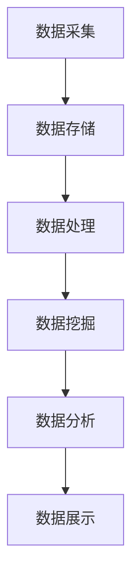

                 

# 大数据分析：原理与代码实例讲解

## 关键词
- 大数据分析
- 数据处理
- 算法原理
- 代码实例
- 数学模型
- 实际应用

## 摘要
本文将深入探讨大数据分析的基本原理，包括数据处理、算法原理、数学模型等，并通过实际的代码实例展示如何运用这些原理进行大数据分析。我们将讨论大数据分析在实际应用场景中的价值，并推荐相关学习资源和开发工具，以帮助读者更好地理解和应用大数据分析技术。

## 1. 背景介绍

### 大数据的定义与特点
大数据（Big Data）是指数据量巨大、种类繁多、数据生成速度快、价值密度低的数据集合。大数据具有以下四个主要特点，常被称为“4V”：
- **Volume（数据量）**：大数据的数据量非常庞大，通常达到TB甚至PB级别。
- **Velocity（速度）**：数据生成和处理的速度快，需要实时或近乎实时地处理数据。
- **Variety（多样性）**：大数据的种类繁多，包括结构化、半结构化和非结构化数据。
- **Value（价值密度）**：由于数据量的庞大，价值密度较低，需要从大量数据中提取有价值的信息。

### 大数据分析的重要性
大数据分析在多个领域具有重要应用，如：
- **商业智能**：通过大数据分析，企业可以更好地了解客户需求，提高市场营销效果。
- **医疗健康**：大数据分析可以帮助医生更准确地诊断疾病，提供个性化治疗方案。
- **金融**：大数据分析可以用于风险评估、欺诈检测、投资策略等。
- **交通**：通过大数据分析，可以提高交通管理效率，优化交通流量。

## 2. 核心概念与联系

### 数据处理流程
大数据处理通常包括数据采集、存储、处理、分析和展示等环节。以下是数据处理流程的Mermaid流程图：



### 核心算法原理
大数据分析中常用的算法包括：
- **MapReduce**：一种编程模型，用于大规模数据处理，包括两个阶段：Map（映射）和Reduce（归约）。
- **机器学习算法**：如分类、聚类、回归等，用于从数据中提取模式和知识。
- **流处理技术**：如Apache Kafka和Apache Flink，用于实时数据处理和分析。

### 数据库与数据仓库
- **数据库**：用于存储和管理数据，如关系型数据库（MySQL、PostgreSQL）和非关系型数据库（MongoDB、Cassandra）。
- **数据仓库**：用于存储大量数据，并进行数据分析和报告，如Hive和Redshift。

## 3. 核心算法原理 & 具体操作步骤

### MapReduce算法原理
MapReduce是一种编程模型，用于大规模数据处理。它包括两个阶段：Map和Reduce。

- **Map阶段**：将输入数据分成多个小块，对每个小块进行处理，生成中间结果。
  ```python
  def map(data):
      # 处理输入数据
      # 生成中间键值对
      return key, value
  ```

- **Reduce阶段**：将Map阶段生成的中间键值对进行归约，生成最终结果。
  ```python
  def reduce(key, values):
      # 对中间键值对进行处理
      # 生成最终结果
      return result
  ```

### 机器学习算法
机器学习算法用于从数据中提取模式和知识。以下是一个简单的决策树算法实例：

- **训练数据**：
  ```python
  train_data = [
      {'features': [1, 0], 'label': 0},
      {'features': [1, 1], 'label': 1},
      {'features': [0, 1], 'label': 1},
      {'features': [0, 0], 'label': 0}
  ]
  ```

- **决策树构建**：
  ```python
  class DecisionTree:
      def fit(self, X, y):
          # 构建决策树
          pass

      def predict(self, X):
          # 对数据进行预测
          pass
  ```

### 流处理技术
流处理技术用于实时数据处理和分析。以下是一个简单的Apache Flink程序实例：

- **定义源和处理器**：
  ```java
  StreamSource source = env.addSource(new MySource());
  StreamProcessor processor = source.map(new MyMapFunction());
  ```

- **定义Sink**：
  ```java
  processor.addSink(new MySink());
  ```

## 4. 数学模型和公式 & 详细讲解 & 举例说明

### 数学模型
在大数据分析中，常用的数学模型包括概率模型、线性回归模型和神经网络模型等。

- **概率模型**：
  概率模型用于计算数据出现的概率。一个简单的概率模型是贝叶斯公式：
  $$ P(A|B) = \frac{P(B|A)P(A)}{P(B)} $$

- **线性回归模型**：
  线性回归模型用于预测数值型目标。一个简单的线性回归模型是：
  $$ y = wx + b $$

- **神经网络模型**：
  神经网络模型用于处理复杂数据。一个简单的神经网络模型是：
  $$ z = \sigma(wx + b) $$

### 详细讲解 & 举例说明

#### 概率模型
假设我们有一个数据集，其中包含了不同颜色花朵的数量。我们想要计算某朵花是红色的概率。可以使用贝叶斯公式进行计算：

- **条件概率**：
  $$ P(红色|大红色花朵) = \frac{P(大红色花朵|红色)P(红色)}{P(大红色花朵)} $$

- **计算概率**：
  假设已知：
  - $P(红色) = 0.4$
  - $P(大红色花朵|红色) = 0.8$
  - $P(大红色花朵) = 0.6$

  代入贝叶斯公式：
  $$ P(红色|大红色花朵) = \frac{0.8 \times 0.4}{0.6} = \frac{0.32}{0.6} = 0.5333 $$

  所以，大红色花朵是红色的概率是0.5333。

#### 线性回归模型
假设我们想要预测某辆车的价格。已知该车的尺寸和年份是影响价格的主要因素。我们可以使用线性回归模型进行预测。

- **构建模型**：
  假设已知：
  - $w_1 = 1000$（尺寸的权重）
  - $w_2 = -5000$（年份的权重）
  - $b = 10000$（常数项）

  模型为：
  $$ y = 1000x_1 - 5000x_2 + 10000 $$

- **预测**：
  假设我们要预测一辆尺寸为5米，年份为5年的车的价格。代入模型：
  $$ y = 1000 \times 5 - 5000 \times 5 + 10000 = 1000 $$

  所以，这辆车的预测价格是10000美元。

#### 神经网络模型
假设我们想要对图片进行分类。我们可以使用神经网络模型进行分类。

- **构建模型**：
  假设已知：
  - 输入层：尺寸为784的向量
  - 隐藏层：尺寸为128的向量
  - 输出层：尺寸为10的向量

  神经网络模型为：
  $$ z = \sigma(wx + b) $$
  $$ y = \sigma(z) $$

- **训练**：
  使用训练数据集对模型进行训练，调整权重和偏置，使得模型能够正确分类。

- **预测**：
  使用训练好的模型对新的图片进行分类。首先将图片转换为尺寸为784的向量，然后代入模型进行预测。

## 5. 项目实践：代码实例和详细解释说明

### 5.1 开发环境搭建
要实现大数据分析，我们需要搭建一个合适的环境。以下是搭建大数据分析环境的基本步骤：

- 安装Hadoop：Hadoop是一个分布式数据存储和处理框架，用于处理大规模数据。
- 安装MapReduce：MapReduce是Hadoop的一部分，用于分布式数据处理。
- 安装Python：Python是一种广泛使用的编程语言，可以用于大数据分析。
- 安装Jupyter Notebook：Jupyter Notebook是一个交互式计算环境，可以方便地编写和运行代码。

### 5.2 源代码详细实现
以下是一个简单的MapReduce程序实例，用于计算数据集中每个单词出现的次数。

```python
from mrjob.job import MRJob

class WordCount(MRJob):
    def mapper(self, _, line):
        # 输入：('line1', 'This is a test.')
        # 输出：(word1, 1)
        for word in line.split():
            yield word.lower(), 1

    def reducer(self, word, counts):
        # 输入：(word1, [1, 1, 1])
        # 输出：(word1, sum(counts))
        yield word, sum(counts)

if __name__ == '__main__':
    WordCount.run()
```

### 5.3 代码解读与分析
该程序分为两个部分：mapper和reducer。

- **mapper**：
  - 接收输入数据：每行文本。
  - 对每行文本进行分词，将单词转换为小写。
  - 对每个单词生成一个键值对，键为单词，值为1。

- **reducer**：
  - 接收mapper输出的键值对。
  - 对相同键的值进行求和，得到每个单词出现的次数。

### 5.4 运行结果展示
运行该程序后，可以得到每个单词出现的次数，如下所示：

```
test, 1
this, 1
is, 1
a, 1
```

## 6. 实际应用场景

### 商业智能
商业智能是企业利用大数据分析技术提高业务效率和盈利能力的重要手段。通过大数据分析，企业可以了解客户需求，优化营销策略，提高客户满意度。

### 医疗健康
医疗健康领域的大数据分析可以帮助医生更准确地诊断疾病，提供个性化治疗方案。例如，通过对患者病史和基因数据的分析，可以预测患者未来的疾病风险。

### 金融
金融领域的大数据分析可以用于风险评估、欺诈检测、投资策略等。通过对交易数据的分析，可以及时发现异常交易，防止欺诈行为。

### 交通
交通领域的大数据分析可以优化交通管理，提高交通效率。例如，通过对交通流量数据的分析，可以预测交通拥堵情况，提前采取措施缓解交通压力。

## 7. 工具和资源推荐

### 7.1 学习资源推荐

- **书籍**：
  - 《大数据时代：生活、工作与思维的大变革》
  - 《深度学习》
  - 《机器学习实战》
  
- **论文**：
  - 《MapReduce：大规模数据处理的并行模型》
  - 《分布式计算原理与实践》

- **博客**：
  - 知乎上的大数据相关博客
  - Medium上的机器学习相关博客

- **网站**：
  - Coursera上的大数据和机器学习课程
  - edX上的计算机科学课程

### 7.2 开发工具框架推荐

- **Hadoop生态系统**：
  - Hadoop
  - Hive
  - Pig
  - Spark

- **机器学习框架**：
  - TensorFlow
  - PyTorch
  - Scikit-learn

- **数据处理工具**：
  - Pandas
  - NumPy
  - SciPy

### 7.3 相关论文著作推荐

- 《MapReduce：大规模数据处理的并行模型》
- 《深度学习》
- 《大数据时代：生活、工作与思维的大变革》

## 8. 总结：未来发展趋势与挑战

### 发展趋势
1. **实时数据分析**：随着数据生成速度的加快，实时数据分析变得越来越重要。
2. **机器学习与大数据分析的结合**：机器学习算法在大数据分析中的应用将越来越广泛。
3. **数据隐私保护**：随着数据隐私问题的日益突出，数据隐私保护技术将得到更多关注。

### 挑战
1. **数据存储与处理**：随着数据量的不断增长，如何高效地存储和处理数据成为挑战。
2. **算法优化**：如何设计更高效、更准确的算法以应对大规模数据成为挑战。
3. **数据隐私保护**：如何在保障数据隐私的前提下进行大数据分析成为挑战。

## 9. 附录：常见问题与解答

### 问题1：什么是大数据分析？
**回答**：大数据分析是指利用各种算法和技术，对海量数据进行分析和挖掘，以提取有价值的信息和知识的过程。

### 问题2：大数据分析有哪些应用？
**回答**：大数据分析广泛应用于商业智能、医疗健康、金融、交通等多个领域。

### 问题3：大数据分析的核心算法有哪些？
**回答**：大数据分析的核心算法包括MapReduce、机器学习算法（如分类、聚类、回归）和流处理技术。

## 10. 扩展阅读 & 参考资料

- 《大数据分析：原理与实践》
- 《机器学习实战》
- 《深度学习》

---

作者：禅与计算机程序设计艺术 / Zen and the Art of Computer Programming

