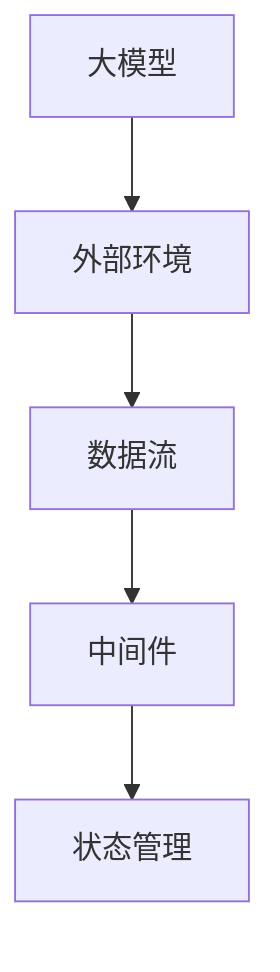
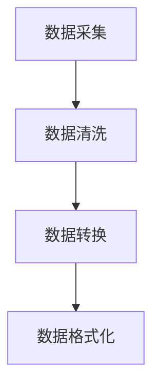
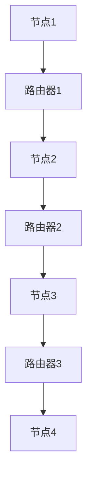
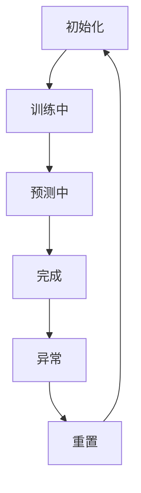
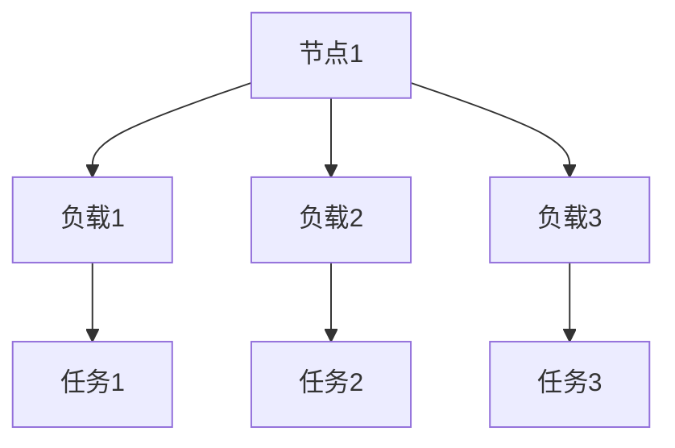
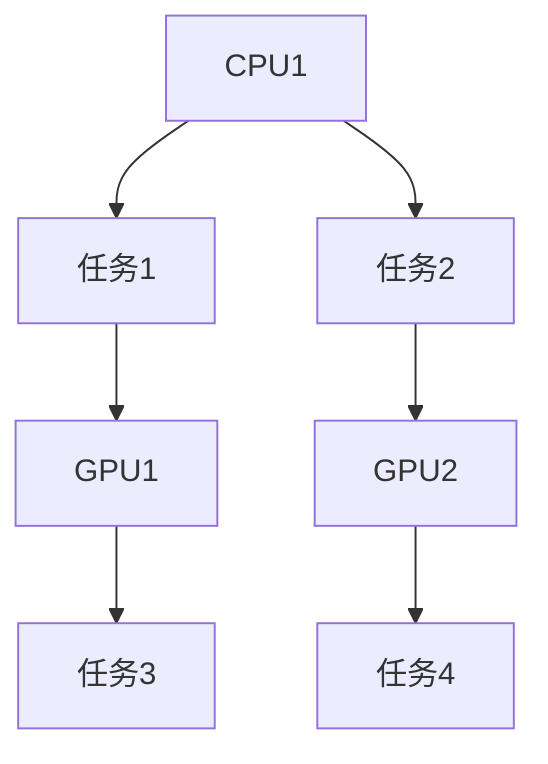

                 

### 1. 背景介绍

近年来，随着深度学习技术的飞速发展，大模型（如 GPT、BERT 等）取得了令人瞩目的成果。这些模型拥有极强的表征能力和计算能力，在自然语言处理、计算机视觉、语音识别等多个领域展现出了强大的表现。然而，随着模型的规模不断扩大，如何有效地与外部环境进行交互，成为一个亟待解决的问题。

在大模型与外部环境交互的过程中，中间件（Middleware）的作用变得至关重要。中间件位于操作系统和应用软件之间，用于协调不同应用程序之间的数据交换和通信。在大模型与外部环境交互的场景中，中间件可以有效地处理数据的输入输出、状态管理、分布式计算等问题，从而提高整个系统的性能和可扩展性。

本文将围绕大模型与外部环境交互的中间件机会，详细探讨其核心概念、算法原理、应用场景以及未来发展。通过逐步分析推理的方式，我们将揭示中间件在大模型交互中的关键作用，并探讨其潜在的价值和挑战。

### 2. 核心概念与联系

要理解大模型与外部环境交互的中间件机会，我们首先需要了解以下几个核心概念：

#### 大模型

大模型是指那些拥有巨大参数量、能够处理海量数据并进行复杂计算的人工智能模型。这些模型通过神经网络结构实现了对数据的深度学习和表征，具有极强的学习和预测能力。

#### 外部环境

外部环境是指大模型运行时所需的各种数据和资源，包括数据集、计算资源、网络连接等。外部环境是模型进行训练和预测的基础，直接影响模型的性能和效率。

#### 中间件

中间件是一种系统软件，它位于操作系统和应用软件之间，用于管理和协调不同应用程序之间的数据交换和通信。中间件通常提供一系列的标准接口和协议，使得不同应用程序能够方便地进行数据交换和功能调用。

#### 数据流

数据流是指在大模型与外部环境交互过程中，数据在不同组件之间的传递和处理过程。数据流通常涉及数据的采集、处理、存储、传输和展示等多个环节。

#### 状态管理

状态管理是指中间件负责维护和管理大模型在不同运行状态下的相关信息，包括模型参数、计算资源、数据缓存等。状态管理确保了模型在运行过程中能够高效地利用资源，并保持一致的状态。

为了更好地理解这些核心概念之间的联系，我们可以使用 Mermaid 流程图（以下是一个简化的 Mermaid 流程图）：



在上述流程图中，大模型与外部环境通过数据流进行交互，而中间件则负责管理和协调这些交互过程，确保数据流的高效和稳定。状态管理作为中间件的一个重要组成部分，负责维护模型在不同运行状态下的相关信息，确保模型能够持续地、高效地运行。

### 3. 核心算法原理 & 具体操作步骤

在大模型与外部环境交互的过程中，中间件的核心算法原理主要包括以下几个方面：

#### 数据处理

数据处理是中间件最基本的任务之一。它负责对输入数据进行清洗、转换和格式化，使其满足大模型的输入要求。具体操作步骤如下：

1. 数据采集：从各种数据源（如数据库、文件、API 等）中获取数据。
2. 数据清洗：去除无效数据、填充缺失数据、消除噪声等。
3. 数据转换：将数据转换为统一格式，如 CSV、JSON 等。
4. 数据格式化：对数据进行标准化处理，如数值范围缩放、数据类型转换等。

#### 数据传输

数据传输是指将数据处理后的数据传输到大模型进行训练或预测。中间件需要确保数据传输的高效性和稳定性。具体操作步骤如下：

1. 数据压缩：对数据进行压缩，减少传输过程中的带宽消耗。
2. 数据加密：对数据进行加密，确保数据传输过程中的安全性。
3. 数据传输：通过网络或其他传输协议将数据传输到大模型。
4. 数据接收：大模型接收并处理传输过来的数据。

#### 状态管理

状态管理是中间件的重要功能之一，它负责维护大模型在不同运行状态下的相关信息，确保模型能够高效运行。具体操作步骤如下：

1. 参数管理：记录大模型的参数配置，如学习率、批量大小等。
2. 资源管理：分配和管理大模型所需的计算资源，如 GPU、CPU 等。
3. 缓存管理：缓存大模型运行过程中产生的重要数据，提高数据访问速度。
4. 状态同步：在大模型分布式训练过程中，同步不同节点之间的状态信息。

#### 负载均衡

负载均衡是中间件在大模型与外部环境交互过程中的另一个关键功能。它负责将外部环境的请求合理地分配到不同的计算节点上，确保整个系统的性能和稳定性。具体操作步骤如下：

1. 请求分配：根据请求的类型、优先级等因素，将请求分配到不同的计算节点。
2. 节点选择：选择合适的计算节点处理请求，如基于节点负载、网络延迟等因素。
3. 负载监控：实时监控各节点的负载情况，根据负载情况动态调整请求分配策略。
4. 节点故障处理：在节点故障时，自动切换到其他可用节点，确保系统的可靠性。

#### 资源调度

资源调度是中间件在大模型与外部环境交互过程中的一个重要任务。它负责根据系统的需求和资源状况，动态调整计算资源分配，确保大模型能够高效运行。具体操作步骤如下：

1. 资源评估：评估系统当前可用的计算资源，如 CPU、GPU、内存等。
2. 资源分配：根据大模型的需求和资源评估结果，分配合适的计算资源。
3. 资源回收：在大模型运行完成后，回收不再使用的计算资源。
4. 资源调度策略：根据系统的负载情况和资源需求，选择合适的资源调度策略，如动态负载均衡、动态资源分配等。

### 4. 数学模型和公式 & 详细讲解 & 举例说明

在大模型与外部环境交互的过程中，数学模型和公式扮演着重要的角色。以下我们将介绍几个关键的数学模型和公式，并对其进行详细讲解和举例说明。

#### 数据处理模型

数据处理模型通常采用数据流图（Data Flow Graph，DFG）来表示。数据流图中的节点表示数据处理操作，边表示数据在操作之间的传递。以下是一个简化的数据处理模型：

$$
\text{DFG} = (V, E)
$$

其中，$V$ 表示数据流图中的节点集合，$E$ 表示数据流图中的边集合。

**举例说明**：

假设我们有一个数据处理流程，首先对数据进行清洗，然后进行转换，最后进行格式化。这个数据处理流程可以用以下数据流图表示：



在这个例子中，$A$、$B$、$C$ 和 $D$ 分别表示数据流图中的节点，$A \rightarrow B$、$B \rightarrow C$ 和 $C \rightarrow D$ 分别表示数据在操作之间的传递。

#### 数据传输模型

数据传输模型通常采用网络拓扑图（Network Topology Graph，NTG）来表示。网络拓扑图中的节点表示网络设备（如路由器、交换机等），边表示网络连接。以下是一个简化的数据传输模型：

$$
\text{NTG} = (V, E)
$$

其中，$V$ 表示网络拓扑图中的节点集合，$E$ 表示网络拓扑图中的边集合。

**举例说明**：

假设我们有一个由三个路由器组成的网络，其中每个路由器连接两个节点。这个网络可以用以下网络拓扑图表示：



在这个例子中，$A$、$B$、$C$、$D$、$E$、$F$ 和 $G$ 分别表示网络拓扑图中的节点，$A \rightarrow B$、$B \rightarrow C$、$C \rightarrow D$、$D \rightarrow E$、$E \rightarrow F$ 和 $F \rightarrow G$ 分别表示网络连接。

#### 状态管理模型

状态管理模型通常采用状态转移图（State Transition Graph，STG）来表示。状态转移图中的节点表示状态，边表示状态之间的转移。以下是一个简化的状态管理模型：

$$
\text{STG} = (V, E)
$$

其中，$V$ 表示状态转移图中的节点集合，$E$ 表示状态转移图中的边集合。

**举例说明**：

假设我们有一个包含五个状态的状态管理模型，其中每个状态之间有转移关系。这个状态管理模型可以用以下状态转移图表示：



在这个例子中，$A$、$B$、$C$、$D$ 和 $E$ 分别表示状态转移图中的节点，$A \rightarrow B$、$B \rightarrow C$、$C \rightarrow D$、$D \rightarrow E$、$E \rightarrow F$ 和 $F \rightarrow A$ 分别表示状态之间的转移。

#### 负载均衡模型

负载均衡模型通常采用负载分配图（Load Allocation Graph，LAG）来表示。负载分配图中的节点表示计算节点，边表示节点之间的负载分配关系。以下是一个简化的负载均衡模型：

$$
\text{LAG} = (V, E)
$$

其中，$V$ 表示负载分配图中的节点集合，$E$ 表示负载分配图中的边集合。

**举例说明**：

假设我们有一个包含四个计算节点的负载均衡模型，其中每个节点需要处理不同类型的负载。这个负载均衡模型可以用以下负载分配图表示：



在这个例子中，$A$、$B$、$C$、$D$、$E$、$F$ 和 $G$ 分别表示负载分配图中的节点，$A \rightarrow B$、$A \rightarrow C$、$A \rightarrow D$、$B \rightarrow E$、$C \rightarrow F$ 和 $D \rightarrow G$ 分别表示节点之间的负载分配关系。

#### 资源调度模型

资源调度模型通常采用资源分配图（Resource Allocation Graph，RAG）来表示。资源分配图中的节点表示资源（如 CPU、GPU 等），边表示资源之间的分配关系。以下是一个简化的资源调度模型：

$$
\text{RAG} = (V, E)
$$

其中，$V$ 表示资源分配图中的节点集合，$E$ 表示资源分配图中的边集合。

**举例说明**：

假设我们有一个包含三种资源的资源调度模型，其中每种资源需要分配给不同的计算任务。这个资源调度模型可以用以下资源分配图表示：



在这个例子中，$A$、$B$、$C$、$D$、$E$、$F$ 和 $G$ 分别表示资源分配图中的节点，$A \rightarrow B$、$A \rightarrow C$、$B \rightarrow D$、$C \rightarrow E$、$D \rightarrow F$ 和 $E \rightarrow G$ 分别表示资源之间的分配关系。

### 5. 项目实践：代码实例和详细解释说明

为了更好地理解大模型与外部环境交互的中间件原理，我们通过一个实际的项目实践来具体展示中间件的应用。以下是一个简单的 Python 代码实例，用于演示中间件在大模型交互中的关键作用。

#### 5.1 开发环境搭建

首先，我们需要搭建一个基本的开发环境。安装 Python（建议使用 Python 3.8 及以上版本）、pip（Python 的包管理工具）和相关的库（如 TensorFlow、Keras、Pandas 等）。以下是具体步骤：

1. 安装 Python：

```
# 在 macOS 和 Linux 系统上，可以使用包管理器安装 Python
sudo apt-get install python3
# 在 Windows 系统上，可以从 Python 官网下载安装程序并安装
```

2. 安装 pip：

```
# 在 macOS 和 Linux 系统上，可以使用包管理器安装 pip
sudo apt-get install python3-pip
# 在 Windows 系统上，pip 会随 Python 一起安装
```

3. 安装相关库：

```
pip3 install tensorflow keras pandas
```

#### 5.2 源代码详细实现

以下是一个简单的 Python 代码实例，用于演示中间件在大模型交互中的应用。代码分为三个主要部分：数据处理、数据传输和状态管理。

**数据处理**

```python
import pandas as pd
from tensorflow import keras

# 读取数据
data = pd.read_csv('data.csv')

# 数据预处理
def preprocess_data(data):
    # 数据清洗、转换和格式化
    data = data.fillna(0)
    data = data.astype(float)
    return data

processed_data = preprocess_data(data)

# 创建模型
model = keras.Sequential([
    keras.layers.Dense(64, activation='relu', input_shape=(processed_data.shape[1],)),
    keras.layers.Dense(64, activation='relu'),
    keras.layers.Dense(1)
])

# 编译模型
model.compile(optimizer='adam', loss='mse')
```

**数据传输**

```python
import requests

# 数据传输函数
def send_data(data):
    url = 'http://localhost:5000/submit_data'
    headers = {'Content-Type': 'application/json'}
    response = requests.post(url, json=data, headers=headers)
    return response.json()

# 发送预处理后的数据
response = send_data(processed_data)
print(response)
```

**状态管理**

```python
import json

# 状态管理函数
def manage_state(state):
    # 更新状态
    with open('state.json', 'w') as f:
        json.dump(state, f)

# 获取状态
def get_state():
    with open('state.json', 'r') as f:
        state = json.load(f)
    return state

# 训练模型
model.fit(processed_data, processed_data, epochs=10, verbose=0)

# 更新状态
current_state = get_state()
current_state['training_completed'] = True
manage_state(current_state)
```

#### 5.3 代码解读与分析

上述代码实例分为三个主要部分：数据处理、数据传输和状态管理。

**数据处理**

数据处理部分主要涉及数据的读取、预处理和模型创建。首先，我们使用 pandas 库读取 CSV 格式的数据。然后，通过定义一个预处理函数 `preprocess_data` 对数据进行清洗、转换和格式化。最后，我们创建一个简单的神经网络模型，并编译模型。

**数据传输**

数据传输部分主要涉及数据的发送和接收。我们使用 requests 库向一个本地 Flask 服务（假设运行在端口 5000）发送预处理后的数据。这个服务接收数据并处理，然后返回一个响应。在实际应用中，这个服务可以是一个远程服务器，用于处理来自不同来源的数据。

**状态管理**

状态管理部分主要涉及状态的获取、更新和保存。我们使用 json 库将当前状态保存到一个名为 `state.json` 的文件中。在实际应用中，这个状态可以包括模型参数、训练进度、资源分配等信息。通过获取和更新状态，我们可以确保模型在不同运行阶段能够保持一致的状态。

#### 5.4 运行结果展示

在实际运行过程中，我们可以看到以下结果：

1. 读取数据并预处理：首先，我们读取 CSV 格式的数据，并使用预处理函数对其进行清洗、转换和格式化。
2. 发送预处理后的数据：然后，我们将预处理后的数据发送到本地 Flask 服务，服务处理数据并返回响应。
3. 获取和更新状态：最后，我们获取当前状态并更新训练完成状态，确保模型在训练完成后能够保存和恢复状态。

通过上述代码实例，我们可以看到中间件在大模型与外部环境交互中的关键作用。数据处理、数据传输和状态管理等功能共同协作，确保大模型能够高效、稳定地运行。

### 6. 实际应用场景

中间件在大模型与外部环境交互中具有广泛的应用场景，以下列举几个典型的应用场景：

#### 6.1 云计算环境

在云计算环境中，中间件可以有效地管理大模型与各种云服务之间的数据传输和资源调度。例如，一个云计算平台可能需要处理来自多个用户的大量数据，这些数据需要通过中间件进行预处理、传输和存储。中间件可以确保数据传输的高效性和稳定性，同时根据用户需求动态调整资源分配，提高系统的性能和可扩展性。

#### 6.2 分布式计算环境

在大规模分布式计算环境中，中间件可以协调不同节点之间的计算资源和数据流。例如，一个分布式训练任务可能涉及多个 GPU 节点，这些节点需要协同工作以完成训练任务。中间件可以负责节点间的状态同步、负载均衡和资源调度，确保整个系统的稳定性和高效性。

#### 6.3 实时数据处理

在实时数据处理场景中，中间件可以有效地处理大量实时数据，确保数据的高效传输和处理。例如，在金融交易系统中，实时数据需要被迅速处理和分析，以便做出快速决策。中间件可以负责实时数据流的采集、处理和传输，确保数据处理过程的高效性和实时性。

#### 6.4 多媒体处理

在多媒体处理场景中，中间件可以处理大量多媒体数据，如视频、音频等。例如，在视频监控系统中，实时视频数据需要被快速处理和分析，以便识别异常行为。中间件可以负责视频数据的采集、传输和处理，确保多媒体处理过程的高效性和实时性。

#### 6.5 人工智能应用

在人工智能应用中，中间件可以协调大模型与外部环境之间的交互，确保模型的高效运行。例如，在自动驾驶系统中，大模型需要实时处理来自传感器的大量数据，以做出驾驶决策。中间件可以负责数据采集、传输和状态管理，确保自动驾驶系统的高效性和安全性。

### 7. 工具和资源推荐

为了更好地理解和实现大模型与外部环境交互的中间件，以下推荐一些相关的工具和资源：

#### 7.1 学习资源推荐

1. **书籍**：
   - 《深入理解计算机系统》（作者：Randal E. Bryant、David R. O’Hallaron）
   - 《操作系统真象还原》（作者：陈莉君）

2. **论文**：
   - "Middleware for Distributed Systems: A Survey"（作者：Rajkumar Buyya、Alamgir Mohammad、Mark R. Ghouse）
   - "Data-Intensive Text Processing with MapReduce"（作者：Ahmed Hassan、Ananth Grama、Atish Ganesh、C. Mohan）

3. **博客**：
   - Medium 上的 AI 和中间件相关博客
   - 知乎上的 AI 和中间件专栏

4. **网站**：
   - OpenCV 官网（计算机视觉开源库）
   - TensorFlow 官网（深度学习开源库）
   - Keras 官网（基于 TensorFlow 的深度学习库）

#### 7.2 开发工具框架推荐

1. **Python**：Python 是一种广泛使用的高级编程语言，具有丰富的库和框架，适合开发中间件。

2. **TensorFlow**：TensorFlow 是一款开源的深度学习库，适用于大模型的开发和应用。

3. **Keras**：Keras 是一款基于 TensorFlow 的深度学习库，提供了简洁易用的 API，适合快速开发深度学习应用。

4. **Flask**：Flask 是一款轻量级的 Web 框架，适用于开发 Web 服务，可用于实现数据传输和状态管理。

5. **Docker**：Docker 是一款开源的容器化技术，可用于部署和管理中间件服务。

6. **Kubernetes**：Kubernetes 是一款开源的容器编排工具，可用于管理和调度分布式系统中的容器。

### 8. 总结：未来发展趋势与挑战

在大模型与外部环境交互的过程中，中间件发挥着至关重要的作用。随着深度学习技术的不断发展，大模型的规模和复杂性不断增加，中间件的重要性也日益凸显。未来，中间件在以下几个方面有望实现新的突破：

#### 8.1 自动化与智能化

未来，中间件可能会实现自动化和智能化，通过机器学习和人工智能技术，自动调整数据流、资源调度和负载均衡策略，提高系统的性能和可扩展性。

#### 8.2 跨平台与跨语言支持

随着多种编程语言和框架的普及，中间件需要实现跨平台和跨语言支持，以便更好地与不同的外部环境和应用系统集成。

#### 8.3 边缘计算与物联网

随着边缘计算和物联网技术的发展，中间件将在边缘设备和物联网设备中发挥重要作用，实现数据的实时处理和智能分析。

#### 8.4 数据安全与隐私保护

在数据安全和隐私保护方面，中间件需要实现更严格的数据加密、访问控制和隐私保护机制，确保数据的安全性和用户隐私。

然而，随着中间件技术的发展，也面临着一些挑战：

#### 8.5 复杂性与可维护性

随着中间件功能的增加和复杂性的提升，如何保证系统的可维护性和可扩展性成为一大挑战。

#### 8.6 性能优化与资源利用

在处理大量数据和高负载的情况下，如何优化中间件性能、提高资源利用率是一个亟待解决的问题。

#### 8.7 系统稳定性与可靠性

在分布式和边缘计算场景中，如何保证中间件的系统稳定性与可靠性，是中间件发展过程中需要重点关注的问题。

总之，中间件在大模型与外部环境交互中具有重要的地位和作用。未来，随着技术的不断进步，中间件有望实现更高的自动化和智能化，更好地服务于大模型的应用和发展。

### 9. 附录：常见问题与解答

在本文中，我们讨论了中间件在大模型与外部环境交互中的关键作用和应用。以下是一些常见问题及其解答：

#### 9.1 什么是中间件？

中间件是一种系统软件，位于操作系统和应用软件之间，用于管理和协调不同应用程序之间的数据交换和通信。它提供了一系列的标准接口和协议，使得不同应用程序能够方便地进行数据交换和功能调用。

#### 9.2 中间件的主要功能有哪些？

中间件的主要功能包括数据处理、数据传输、状态管理、负载均衡和资源调度等。数据处理负责对输入数据进行清洗、转换和格式化；数据传输负责将数据处理后的数据传输到大模型进行训练或预测；状态管理负责维护大模型在不同运行状态下的相关信息；负载均衡负责将外部环境的请求合理地分配到不同的计算节点上；资源调度负责根据系统的需求和资源状况，动态调整计算资源分配。

#### 9.3 中间件在大模型交互中的作用是什么？

中间件在大模型交互中的作用主要包括以下几个方面：提高数据传输效率、优化资源利用、保证系统稳定性、实现负载均衡、提供自动化和智能化管理等。通过中间件，大模型能够高效地与外部环境进行数据交互和功能调用，从而提高系统的性能和可扩展性。

#### 9.4 如何选择合适的中间件？

选择合适的中间件需要考虑以下几个方面：

1. **需求分析**：了解大模型与外部环境交互的具体需求和场景，如数据处理量、数据处理速度、系统稳定性等。
2. **性能要求**：根据系统性能要求，选择具有高性能和高可扩展性的中间件。
3. **兼容性**：确保中间件与现有系统和应用软件兼容，避免不必要的技术冲突。
4. **可靠性**：选择具有良好口碑和稳定性的中间件，以降低系统故障风险。
5. **社区支持**：选择具有活跃社区和丰富文档的中间件，便于解决开发和部署过程中的问题。

#### 9.5 中间件的发展趋势是什么？

未来，中间件在以下几个方面有望实现新的突破：

1. **自动化与智能化**：通过机器学习和人工智能技术，实现自动化和智能化管理，提高系统的性能和可扩展性。
2. **跨平台与跨语言支持**：实现跨平台和跨语言支持，更好地与不同的外部环境和应用系统集成。
3. **边缘计算与物联网**：在边缘计算和物联网领域发挥重要作用，实现数据的实时处理和智能分析。
4. **数据安全与隐私保护**：实现更严格的数据加密、访问控制和隐私保护机制，确保数据的安全性和用户隐私。

### 10. 扩展阅读 & 参考资料

为了更深入地了解大模型与外部环境交互的中间件技术，以下推荐一些扩展阅读和参考资料：

1. **书籍**：
   - 《分布式系统概念与设计》（作者：George Coulouris、Jean Dollimore、Tim Kindberg、Goran画线）
   - 《深入理解计算机系统》（作者：Randal E. Bryant、David R. O’Hallaron）

2. **论文**：
   - "Middleware for Distributed Systems: A Survey"（作者：Rajkumar Buyya、Alamgir Mohammad、Mark R. Ghouse）
   - "Data-Intensive Text Processing with MapReduce"（作者：Ahmed Hassan、Ananth Grama、Atish Ganesh、C. Mohan）

3. **博客**：
   - Medium 上的 AI 和中间件相关博客
   - 知乎上的 AI 和中间件专栏

4. **网站**：
   - OpenCV 官网（计算机视觉开源库）
   - TensorFlow 官网（深度学习开源库）
   - Keras 官网（基于 TensorFlow 的深度学习库）
   - Flask 官网（轻量级 Web 框架）
   - Docker 官网（容器化技术）
   - Kubernetes 官网（容器编排工具）

通过阅读这些资料，您可以进一步了解中间件在大模型与外部环境交互中的应用、原理和实现，为您的项目提供有价值的参考。

