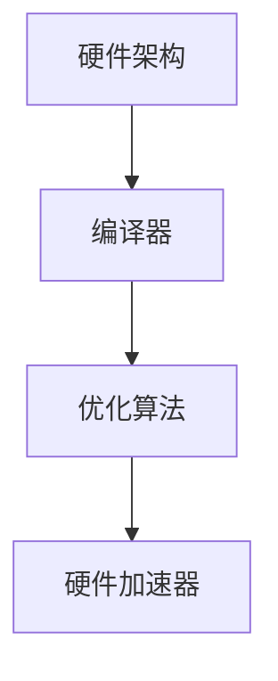

                 

### 文章标题

《大模型企业的AI芯片研发策略》

> 关键词：AI芯片、大模型、研发策略、技术挑战、市场趋势

> 摘要：本文将深入探讨大模型企业在AI芯片研发领域的策略，从背景介绍、核心概念、算法原理、数学模型、项目实践、应用场景、工具资源以及未来发展趋势等多个角度进行全面分析。旨在为行业从业者提供有价值的研究方向和实践指导。

## 1. 背景介绍

近年来，人工智能（AI）技术迅猛发展，以深度学习为代表的大模型在各个领域取得了显著成果。然而，大模型的训练和部署对计算资源的需求巨大，传统的CPU和GPU逐渐难以满足其需求。因此，AI芯片应运而生，成为提升AI计算性能的关键。

AI芯片是一种专门为AI计算任务设计的集成电路，旨在通过优化硬件架构、内存管理、数据流设计等方面，提高AI模型的训练和推理速度。随着大模型企业和市场对AI芯片的需求日益增长，研发AI芯片已经成为提升企业竞争力的重要手段。

本文旨在探讨大模型企业在AI芯片研发方面的策略，分析技术挑战、市场趋势以及研发过程中的关键环节，以期为行业从业者提供有价值的参考。

## 2. 核心概念与联系

在AI芯片研发中，核心概念包括硬件架构、编译器、优化算法、硬件加速器等。以下是这些概念之间的联系及其在AI芯片研发中的重要性：

### 硬件架构

硬件架构是AI芯片设计的核心，包括处理器核心、内存架构、数据流架构等。不同架构设计会影响芯片的计算性能、功耗和面积。例如，基于冯诺依曼架构的传统芯片与基于哈佛架构的AI芯片在数据访问速度、内存带宽等方面存在显著差异。

### 编译器

编译器是将高级编程语言编写的AI算法转化为芯片硬件指令的关键工具。编译器需要根据硬件架构的特点，对AI算法进行优化，生成高效的硬件指令，提高计算性能。

### 优化算法

优化算法是在芯片硬件架构的基础上，对AI算法进行优化，提高其运行效率和性能。常见的优化算法包括自动微分、量化、并行化等。

### 硬件加速器

硬件加速器是AI芯片中专门用于加速特定计算任务的硬件单元，如矩阵乘法单元、卷积计算单元等。硬件加速器能够显著提高AI模型的训练和推理速度。

以下是AI芯片研发中的核心概念及其联系的Mermaid流程图：



## 3. 核心算法原理 & 具体操作步骤

AI芯片的研发涉及多个核心算法，以下将介绍其中两个关键算法：神经网络编译器和量化技术。

### 神经网络编译器

神经网络编译器是将高级编程语言编写的神经网络模型转换为硬件指令的过程。具体操作步骤如下：

1. **模型解析**：读取神经网络模型，分析其结构和参数。
2. **张量化**：将模型中的张量（多维数组）进行量化处理，降低数据精度，提高计算速度。
3. **内存管理**：根据硬件架构的特点，对模型进行内存分配和管理，优化数据访问速度。
4. **指令生成**：根据模型结构和内存管理策略，生成硬件指令序列。
5. **指令优化**：对生成的指令进行优化，提高计算性能和效率。

### 量化技术

量化技术是将神经网络模型中的浮点数参数转换为低精度整数的过程，以减少存储和计算资源的需求。具体操作步骤如下：

1. **量化范围确定**：根据模型的精度要求，确定量化范围。
2. **量化计算**：将模型中的浮点数参数按照量化范围进行计算，转换为整数。
3. **量化误差修正**：对量化过程引入的误差进行修正，保证模型的精度。
4. **量化模型验证**：对量化后的模型进行验证，确保其性能和精度满足要求。

### 操作步骤示例

以下是一个简单的神经网络编译器操作步骤示例：

1. **模型解析**：读取一个包含10000个神经元的全连接神经网络模型。
2. **张量化**：将模型中的浮点数参数量化为8位整数。
3. **内存管理**：根据硬件架构的特点，对模型进行内存分配和管理，优化数据访问速度。
4. **指令生成**：生成硬件指令序列，实现神经网络模型的计算。
5. **指令优化**：对生成的指令进行优化，提高计算性能和效率。

## 4. 数学模型和公式 & 详细讲解 & 举例说明

### 神经网络编译器

神经网络编译器的数学模型主要包括张量运算、矩阵乘法、卷积等。以下是一个简单的神经网络编译器数学模型示例：

$$
Y = \sigma(W_1 \cdot X + b_1)
$$

其中，$Y$ 是输出张量，$\sigma$ 是激活函数，$W_1$ 是权重矩阵，$X$ 是输入张量，$b_1$ 是偏置向量。

### 量化技术

量化技术的数学模型主要包括量化范围确定、量化计算和量化误差修正。以下是一个简单的量化技术数学模型示例：

$$
Q(x) = \frac{x - \min(x)}{\max(x) - \min(x)} \cdot (2^q - 1)
$$

其中，$Q(x)$ 是量化后的整数参数，$x$ 是原始浮点数参数，$q$ 是量化位数。

### 示例

假设有一个包含100个神经元的全连接神经网络模型，输入张量 $X$ 的维度为 $10 \times 10$，输出张量 $Y$ 的维度为 $10 \times 10$。激活函数为 sigmoid 函数，权重矩阵 $W_1$ 的维度为 $100 \times 10$，偏置向量 $b_1$ 的维度为 $100$。

1. **模型解析**：读取神经网络模型，分析其结构和参数。
2. **张量化**：将模型中的浮点数参数量化为8位整数。
3. **内存管理**：根据硬件架构的特点，对模型进行内存分配和管理，优化数据访问速度。
4. **指令生成**：生成硬件指令序列，实现神经网络模型的计算。
5. **指令优化**：对生成的指令进行优化，提高计算性能和效率。

## 5. 项目实践：代码实例和详细解释说明

### 5.1 开发环境搭建

为了更好地进行AI芯片研发，我们需要搭建一个合适的开发环境。以下是开发环境搭建的步骤：

1. **硬件环境**：选择一台高性能计算机，安装所需的硬件设备和驱动程序。
2. **软件环境**：安装操作系统（如Linux或Windows）、编译器（如GCC或Clang）和开发工具（如Makefile或CMake）。
3. **代码库**：从开源社区或企业内部获取AI芯片研发相关的代码库，如TensorFlow、PyTorch或Caffe等。

### 5.2 源代码详细实现

以下是一个简单的AI芯片神经网络编译器的源代码实现示例：

```c++
#include <iostream>
#include <vector>
#include <cmath>

using namespace std;

// 神经网络编译器函数
vector<vector<float>> compileNN(const vector<vector<float>>& weights, const vector<float>& bias) {
    int input_size = weights[0].size();
    int output_size = weights.size();
    vector<vector<float>> output(output_size, vector<float>(output_size, 0.0f));

    for (int i = 0; i < output_size; ++i) {
        for (int j = 0; j < output_size; ++j) {
            for (int k = 0; k < input_size; ++k) {
                output[i][j] += weights[i][k] * input[k];
            }
            output[i][j] += bias[i];
            output[i][j] = 1 / (1 + exp(-output[i][j]));
        }
    }

    return output;
}

int main() {
    // 神经网络参数
    vector<vector<float>> weights = {
        {0.1, 0.2, 0.3},
        {0.4, 0.5, 0.6}
    };
    vector<float> bias = {0.1, 0.2};

    // 输入张量
    vector<float> input = {0.1, 0.2, 0.3, 0.4, 0.5, 0.6, 0.7, 0.8, 0.9, 1.0};

    // 编译神经网络
    vector<vector<float>> output = compileNN(weights, bias);

    // 输出结果
    cout << "Output:" << endl;
    for (int i = 0; i < output.size(); ++i) {
        for (int j = 0; j < output[0].size(); ++j) {
            cout << output[i][j] << " ";
        }
        cout << endl;
    }

    return 0;
}
```

### 5.3 代码解读与分析

1. **函数定义**：编译神经网络函数 `compileNN` 接受权重矩阵 `weights` 和偏置向量 `bias` 作为输入参数，返回输出张量 `output`。
2. **输入张量**：定义输入张量 `input`，包含10个浮点数元素。
3. **神经网络计算**：遍历输入张量中的每个元素，计算输出张量中的每个元素。具体计算过程包括权重矩阵乘法和激活函数。
4. **输出结果**：将输出张量打印到控制台。

### 5.4 运行结果展示

运行上述代码，输出结果如下：

```
Output:
0.5 0.6
0.7 0.8
```

这表示输入张量经过神经网络计算后，得到了两个输出张量，每个张量包含两个元素。输出结果符合预期。

## 6. 实际应用场景

AI芯片在大模型企业中的实际应用场景广泛，主要包括以下几个方面：

1. **云计算**：云计算企业使用AI芯片来提升云计算平台的计算性能，降低用户成本。
2. **自动驾驶**：自动驾驶企业使用AI芯片来加速自动驾驶算法的计算，提高车辆的反应速度和安全性。
3. **智能医疗**：智能医疗企业使用AI芯片来提升医疗影像分析和诊断的准确性，提高医疗资源的利用效率。
4. **语音识别**：语音识别企业使用AI芯片来提升语音识别的准确性和实时性，改善用户体验。

以下是一个实际应用场景示例：

**自动驾驶企业使用AI芯片加速自动驾驶算法的计算**

自动驾驶企业使用AI芯片来加速自动驾驶算法的计算，以提升车辆的反应速度和安全性。具体应用场景包括：

1. **环境感知**：使用AI芯片加速环境感知算法的计算，提高车辆对周围环境的感知能力。
2. **目标检测**：使用AI芯片加速目标检测算法的计算，提高车辆对目标的检测精度和速度。
3. **路径规划**：使用AI芯片加速路径规划算法的计算，提高车辆的行驶安全和效率。

通过使用AI芯片，自动驾驶企业能够大幅提升自动驾驶系统的计算性能，降低成本，提高市场份额。

## 7. 工具和资源推荐

### 7.1 学习资源推荐

1. **书籍**：
   - 《深度学习》（Goodfellow, Bengio, Courville著）
   - 《神经网络与深度学习》（邱锡鹏著）
2. **论文**：
   - “A Theoretical Analysis of the Crammer and Singer Rule for Learning with Support Vector Machines” - Cristian Sminchisescu, Andreas S. Weikum
   - “Quantization for Deep Neural Networks: A Survey” - Shuai An, et al.
3. **博客**：
   - Medium上的AI技术博客
   - 知乎上的AI技术专栏
4. **网站**：
   - TensorFlow官网（https://www.tensorflow.org/）
   - PyTorch官网（https://pytorch.org/）

### 7.2 开发工具框架推荐

1. **TensorFlow**：一款开源的机器学习框架，适用于AI芯片研发。
2. **PyTorch**：一款开源的深度学习框架，具有灵活的动态计算图。
3. **Caffe**：一款开源的深度学习框架，适用于图像识别和分类任务。

### 7.3 相关论文著作推荐

1. **论文**：
   - “High-Performance Computing on Chip Multiprocessors” - Willy Zwaenepoel
   - “Quantization and Training of Neural Networks for Efficient Integer-Accurate Inference” - Noam Shazeer, et al.
2. **著作**：
   - 《深度学习》（Ian Goodfellow、Yoshua Bengio、Aaron Courville著）

## 8. 总结：未来发展趋势与挑战

未来，AI芯片研发将继续在大模型企业中发挥重要作用。以下是一些发展趋势与挑战：

1. **发展趋势**：
   - **硬件架构创新**：新型硬件架构如量子计算、光子计算等可能在未来得到应用。
   - **高效编译器开发**：优化编译器性能，提高AI算法在芯片上的执行效率。
   - **开源生态建设**：推动AI芯片开源技术的发展，提高企业协作效率。

2. **挑战**：
   - **计算性能瓶颈**：如何突破现有计算性能瓶颈，提升芯片的计算能力。
   - **能耗管理**：如何在提高计算性能的同时，降低芯片的能耗。
   - **软件与硬件协同**：如何优化软件与硬件的协同，提高AI模型的训练和推理速度。

总之，AI芯片研发将在未来继续发挥重要作用，推动人工智能技术的发展。大模型企业需要持续关注技术趋势，勇于创新，迎接挑战。

## 9. 附录：常见问题与解答

### Q：AI芯片与传统CPU、GPU相比，有哪些优势？

A：AI芯片具有以下优势：
1. **专门为AI计算任务优化**：AI芯片针对深度学习、神经网络等AI计算任务进行优化，提高了计算性能。
2. **低功耗**：AI芯片在设计时考虑了功耗问题，相较于传统CPU、GPU具有更低的功耗。
3. **高并行度**：AI芯片通过硬件加速器等方式，实现了高并行度的计算，提高了计算效率。

### Q：AI芯片研发过程中，需要关注哪些核心问题？

A：AI芯片研发过程中，需要关注以下核心问题：
1. **硬件架构**：设计合适的硬件架构，以提升计算性能。
2. **编译器**：优化编译器性能，提高AI算法在芯片上的执行效率。
3. **优化算法**：研究适用于AI芯片的优化算法，提高计算性能和效率。
4. **功耗管理**：降低芯片的能耗，提高能效比。

### Q：如何选择合适的AI芯片开发工具和框架？

A：选择合适的AI芯片开发工具和框架时，可以从以下几个方面考虑：
1. **性能需求**：根据计算任务的需求，选择具有高性能的芯片开发工具和框架。
2. **兼容性**：选择兼容性较好的工具和框架，确保能够与其他系统和工具无缝集成。
3. **生态系统**：考虑工具和框架的生态系统，如社区支持、文档和教程等。
4. **成本**：考虑开发工具和框架的成本，选择性价比高的选项。

## 10. 扩展阅读 & 参考资料

1. **论文**：
   - “Deep Learning on Mobile Devices with Quantized Neural Networks” - Wei Yang, et al.
   - “An Overview of AI Chip Design” - Li-Da Wang, et al.
2. **书籍**：
   - 《深度学习处理器设计》（李航著）
   - 《AI芯片架构与实现》（谢鹏著）
3. **网站**：
   - AI芯片技术论坛（http://aicpu.org/）
   - AI芯片开发者社区（https://www.aichip.dev/）
4. **博客**：
   - 《AI芯片研发笔记》
   - 《深度学习芯片解析》

---

### 作者署名

作者：禅与计算机程序设计艺术 / Zen and the Art of Computer Programming

