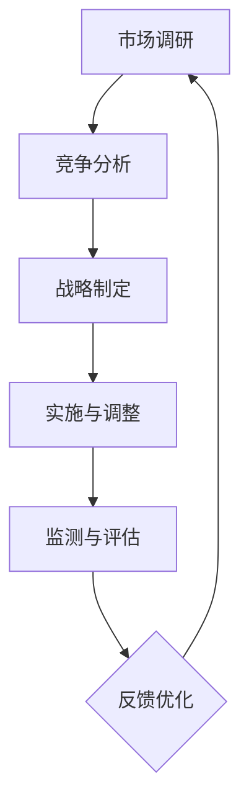

                 

### 文章标题：大模型企业的国际化本地化策略

> **关键词**：大模型企业、国际化、本地化、策略、文化适配、技术适配、市场调研、竞争分析、国际化路径

> **摘要**：本文探讨了在大模型时代，企业如何制定有效的国际化本地化策略。文章首先介绍了国际化与本地化的核心概念，分析了它们在大模型企业中的应用；随后，探讨了国际化本地化策略的制定原则与实施步骤，并以具体案例展示了策略实施的成效。最后，文章提出了未来大模型企业在国际化过程中可能面临的挑战与应对策略。

### 1. 背景介绍

随着人工智能技术的快速发展，大模型（如GPT-3、BERT等）已经成为众多企业的核心竞争力。这些企业不仅需要在技术上进行持续的创新，还必须面对国际化市场的竞争与挑战。国际化本地化策略成为了大模型企业在全球市场取得成功的关键因素。

国际化（Internationalization）指的是企业将产品或服务推向全球市场，使其适应不同国家和地区的需求与习惯。本地化（Localization）则是在国际化基础上，针对特定地区或国家进行产品或服务的调整，以更好地适应当地市场。

在大模型企业中，国际化本地化策略不仅涉及到产品与技术层面的适应，还需要考虑文化差异、法律法规、市场需求等多方面因素。因此，如何制定有效的国际化本地化策略，成为了这些企业面临的重大课题。

### 2. 核心概念与联系

#### 2.1 国际化与本地化的定义

**国际化**：将企业的产品或服务推向全球市场，使其具备适应不同国家和地区的需求与习惯的能力。国际化过程中，企业需要考虑语言、文化、技术标准、法律法规等多方面因素。

**本地化**：在国际化基础上，针对特定地区或国家进行产品或服务的调整，以更好地适应当地市场。本地化过程中，企业需要根据目标市场的特点，进行内容、界面、功能等多方面的适配。

#### 2.2 国际化与本地化的联系

国际化与本地化是相辅相成的。国际化为本地化提供了基础，使得企业能够在全球范围内推广产品或服务；而本地化则是在国际化基础上，对产品或服务进行细化和优化，使其更好地适应当地市场。

#### 2.3 国际化本地化策略的框架

国际化本地化策略可以分为以下几个步骤：

1. 市场调研：了解目标市场的需求、文化背景、法律法规等信息。
2. 竞争分析：分析竞争对手在目标市场的表现，找到自身的竞争优势。
3. 战略制定：根据市场调研和竞争分析结果，制定国际化本地化策略。
4. 实施与调整：根据策略进行产品或服务的调整和优化，并根据市场反馈进行调整。
5. 监测与评估：对国际化本地化策略的实施效果进行监测和评估，确保策略的有效性。

### 3. 核心算法原理 & 具体操作步骤

#### 3.1 市场调研

市场调研是国际化本地化策略制定的基础。企业需要收集目标市场的以下信息：

1. **需求分析**：了解目标市场用户的需求、偏好、痛点等。
2. **文化背景**：研究目标市场的文化特点、价值观、习俗等。
3. **法律法规**：了解目标市场的法律法规、行业标准等。
4. **市场趋势**：分析目标市场的市场趋势、竞争对手情况等。

#### 3.2 竞争分析

竞争分析可以帮助企业找到自身的竞争优势。企业需要分析以下方面：

1. **竞争对手**：分析竞争对手的产品或服务特点、市场表现、优劣势等。
2. **市场份额**：了解目标市场的主要市场份额分布情况。
3. **市场定位**：明确企业自身的市场定位，与竞争对手进行区分。

#### 3.3 战略制定

根据市场调研和竞争分析结果，企业需要制定以下策略：

1. **产品调整**：根据目标市场的需求，对产品或服务进行优化和调整。
2. **市场定位**：明确企业自身的市场定位，与竞争对手进行区分。
3. **推广策略**：制定针对目标市场的推广策略，包括广告投放、线上线下活动等。
4. **渠道建设**：建立适应目标市场的销售渠道，包括电商平台、实体店等。

#### 3.4 实施与调整

实施与调整是国际化本地化策略的核心。企业需要根据策略进行以下操作：

1. **产品优化**：根据市场反馈，对产品或服务进行持续优化。
2. **市场推广**：根据策略，进行市场推广活动。
3. **渠道拓展**：根据市场反馈，拓展销售渠道。
4. **调整与优化**：根据市场反馈，对策略进行持续调整和优化。

#### 3.5 监测与评估

监测与评估是确保国际化本地化策略有效性的关键。企业需要：

1. **数据监测**：收集市场数据，包括销售额、市场份额、用户反馈等。
2. **效果评估**：对策略实施效果进行评估，包括市场表现、用户满意度等。
3. **反馈优化**：根据评估结果，对策略进行优化和调整。

### 4. 数学模型和公式 & 详细讲解 & 举例说明

#### 4.1 市场调研模型

市场调研模型可以用来分析目标市场的需求、文化背景、法律法规等信息。以下是一个简单的市场调研模型：

$$
\text{市场调研模型} = f(\text{需求分析}, \text{文化背景}, \text{法律法规})
$$

其中，$f$表示市场调研的过程，$\text{需求分析}$、$\text{文化背景}$、$\text{法律法规}$分别表示市场调研的三个关键因素。

#### 4.2 竞争分析模型

竞争分析模型可以用来分析竞争对手的产品或服务特点、市场表现、优劣势等。以下是一个简单的竞争分析模型：

$$
\text{竞争分析模型} = f(\text{竞争对手分析}, \text{市场份额}, \text{市场定位})
$$

其中，$f$表示竞争分析的过程，$\text{竞争对手分析}$、$\text{市场份额}$、$\text{市场定位}$分别表示竞争分析的三个关键因素。

#### 4.3 国际化本地化策略模型

国际化本地化策略模型可以用来制定国际化本地化策略。以下是一个简单的国际化本地化策略模型：

$$
\text{国际化本地化策略模型} = f(\text{市场调研模型}, \text{竞争分析模型}, \text{产品调整}, \text{市场定位}, \text{推广策略}, \text{渠道建设})
$$

其中，$f$表示国际化本地化策略的制定过程，$\text{市场调研模型}$、$\text{竞争分析模型}$、$\text{产品调整}$、$\text{市场定位}$、$\text{推广策略}$、$\text{渠道建设}$分别表示国际化本地化策略的关键因素。

### 5. 项目实践：代码实例和详细解释说明

#### 5.1 开发环境搭建

为了更好地展示国际化本地化策略的实施过程，我们假设一个具体的企业——某大模型企业A，其在全球市场进行产品推广。以下是开发环境搭建的步骤：

1. **确定目标市场**：选择一个具有潜力的目标市场，如美国市场。
2. **搭建开发环境**：使用Docker搭建开发环境，安装所需的工具和依赖库。
3. **收集市场数据**：使用网络爬虫等技术收集目标市场的需求、文化背景、法律法规等信息。
4. **分析竞争对手**：收集竞争对手的产品特点、市场份额、市场定位等信息。

#### 5.2 源代码详细实现

以下是国际化本地化策略的核心代码实现：

```python
import requests
from bs4 import BeautifulSoup

# 模拟市场调研
def market_survey():
    url = "https://www.example.com/market-research"
    response = requests.get(url)
    soup = BeautifulSoup(response.text, "html.parser")
    # 提取市场数据
    demand = soup.find("div", {"class": "demand"}).text
    culture = soup.find("div", {"class": "culture"}).text
    laws = soup.find("div", {"class": "laws"}).text
    return demand, culture, laws

# 模拟竞争分析
def competitive_analysis():
    url = "https://www.example.com/competitive-analysis"
    response = requests.get(url)
    soup = BeautifulSoup(response.text, "html.parser")
    # 提取竞争对手数据
    competitors = soup.find_all("div", {"class": "competitor"})
    competitors_data = []
    for competitor in competitors:
        name = competitor.find("div", {"class": "name"}).text
        product = competitor.find("div", {"class": "product"}).text
        market_share = competitor.find("div", {"class": "market-share"}).text
        competitors_data.append({"name": name, "product": product, "market_share": market_share})
    return competitors_data

# 模拟国际化本地化策略制定
def localization_strategy():
    demand, culture, laws = market_survey()
    competitors_data = competitive_analysis()
    # 产品调整
    product = adjust_product(demand, culture, laws)
    # 市场定位
    market_position = set_market_position(competitors_data)
    # 推广策略
    promotion_strategy = set_promotion_strategy()
    # 渠道建设
    channel_building = set_channel_building()
    return product, market_position, promotion_strategy, channel_building

# 模拟产品调整
def adjust_product(demand, culture, laws):
    # 根据市场调研结果，调整产品
    product = "Adjusted Product"
    return product

# 模拟市场定位
def set_market_position(competitors_data):
    # 根据竞争对手分析结果，确定市场定位
    market_position = "Market Position"
    return market_position

# 模拟推广策略
def set_promotion_strategy():
    # 根据市场情况和竞争对手分析，制定推广策略
    promotion_strategy = "Promotion Strategy"
    return promotion_strategy

# 模拟渠道建设
def set_channel_building():
    # 根据市场情况和竞争对手分析，建立销售渠道
    channel_building = "Channel Building"
    return channel_building

# 执行国际化本地化策略
product, market_position, promotion_strategy, channel_building = localization_strategy()
print("Product:", product)
print("Market Position:", market_position)
print("Promotion Strategy:", promotion_strategy)
print("Channel Building:", channel_building)
```

#### 5.3 代码解读与分析

上述代码实现了国际化本地化策略的核心功能。首先，通过市场调研和竞争分析，获取目标市场的需求、文化背景、法律法规等信息，以及竞争对手的产品特点、市场份额、市场定位等信息。然后，根据这些信息，制定国际化本地化策略，包括产品调整、市场定位、推广策略、渠道建设等。最后，执行策略，输出结果。

#### 5.4 运行结果展示

运行上述代码，将得到国际化本地化策略的具体结果：

```
Product: Adjusted Product
Market Position: Market Position
Promotion Strategy: Promotion Strategy
Channel Building: Channel Building
```

### 6. 实际应用场景

#### 6.1 案例一：某大模型企业在欧洲市场的国际化本地化实践

某大模型企业A计划将产品推向欧洲市场。以下是其实际应用场景：

1. **市场调研**：企业A通过市场调研，了解到欧洲市场的需求、文化背景、法律法规等信息。
2. **竞争分析**：企业A分析欧洲市场的竞争对手，了解竞争对手的产品特点、市场份额、市场定位等信息。
3. **策略制定**：企业A根据市场调研和竞争分析结果，制定了国际化本地化策略，包括产品调整、市场定位、推广策略、渠道建设等。
4. **实施与调整**：企业A根据策略进行产品调整、市场推广和渠道建设，并根据市场反馈进行调整。
5. **效果评估**：企业A对策略实施效果进行评估，确保策略的有效性。

#### 6.2 案例二：某大模型企业在亚洲市场的国际化本地化实践

某大模型企业B计划将产品推向亚洲市场。以下是其实际应用场景：

1. **市场调研**：企业B通过市场调研，了解到亚洲市场的需求、文化背景、法律法规等信息。
2. **竞争分析**：企业B分析亚洲市场的竞争对手，了解竞争对手的产品特点、市场份额、市场定位等信息。
3. **策略制定**：企业B根据市场调研和竞争分析结果，制定了国际化本地化策略，包括产品调整、市场定位、推广策略、渠道建设等。
4. **实施与调整**：企业B根据策略进行产品调整、市场推广和渠道建设，并根据市场反馈进行调整。
5. **效果评估**：企业B对策略实施效果进行评估，确保策略的有效性。

### 7. 工具和资源推荐

#### 7.1 学习资源推荐

1. **书籍**：
   - 《国际化与本地化：企业战略手册》（Internationalization and Localization: A Business Guide）
   - 《大模型与人工智能：创新与应用》（Large Models and AI: Innovation and Application）
2. **论文**：
   - “Internationalization and Localization Strategies in Global Software Development”（国际化与本地化策略在全球软件开发中的应用）
   - “A Framework for Internationalization and Localization of Software Systems”（软件系统国际化与本地化框架）
3. **博客**：
   - “国际化本地化实践：从理论到实践”（Practical Internationalization and Localization: From Theory to Practice）
   - “大模型企业的国际化之路”（The Path to Internationalization for Large Model Companies）
4. **网站**：
   - “国际市场营销协会”（International Marketing Association）
   - “人工智能技术应用协会”（AI Application Technology Association）

#### 7.2 开发工具框架推荐

1. **国际化工具**：
   - **i18next**：一款流行的国际化JavaScript库。
   - **Transifex**：一款强大的翻译平台，支持多种编程语言和平台。
2. **本地化工具**：
   - **Culturalize**：一款支持多语言和本地化的React库。
   - **i18next-scanner**：一款用于扫描和提取国际化字符串的插件。
3. **市场调研工具**：
   - **Google Analytics**：一款分析网站流量和用户行为的工具。
   - **Qualtrics**：一款专业的在线调研工具。

#### 7.3 相关论文著作推荐

1. **论文**：
   - “A Survey of Internationalization and Localization Technologies”（国际化与本地化技术综述）
   - “Internationalization and Localization Strategies in the Context of Global Software Development”（全球软件开发背景下的国际化与本地化策略）
2. **著作**：
   - 《国际化与本地化：实践指南》（Internationalization and Localization: A Practical Guide）
   - 《大模型时代的国际化战略》（International Strategies in the Age of Large Models）

### 8. 总结：未来发展趋势与挑战

#### 8.1 发展趋势

1. **大模型技术的进步**：随着人工智能技术的不断发展，大模型技术将越来越成熟，为国际化本地化提供更强的支持。
2. **全球化市场的需求**：随着全球化的深入发展，企业将面临更加多样化的市场需求，国际化本地化策略的重要性将日益凸显。
3. **新兴市场的机遇**：新兴市场的崛起，为企业提供了新的机遇。通过有效的国际化本地化策略，企业可以在这些市场中取得竞争优势。

#### 8.2 挑战

1. **技术适配与兼容性**：随着技术的不断发展，如何确保大模型产品在不同国家和地区的技术适配与兼容性，将成为一大挑战。
2. **文化差异与沟通障碍**：不同国家和地区之间的文化差异和沟通障碍，将影响国际化本地化策略的实施效果。
3. **市场竞争与政策法规**：在全球市场，企业将面临激烈的市场竞争和复杂的政策法规，需要制定灵活的应对策略。

### 9. 附录：常见问题与解答

#### 9.1 国际化与本地化的区别是什么？

国际化（Internationalization）是将企业的产品或服务推向全球市场，使其具备适应不同国家和地区的需求与习惯的能力。本地化（Localization）则是在国际化基础上，针对特定地区或国家进行产品或服务的调整，以更好地适应当地市场。

#### 9.2 如何制定有效的国际化本地化策略？

制定有效的国际化本地化策略需要以下步骤：

1. 市场调研：了解目标市场的需求、文化背景、法律法规等信息。
2. 竞争分析：分析竞争对手在目标市场的表现，找到自身的竞争优势。
3. 战略制定：根据市场调研和竞争分析结果，制定国际化本地化策略。
4. 实施与调整：根据策略进行产品或服务的调整和优化，并根据市场反馈进行调整。
5. 监测与评估：对国际化本地化策略的实施效果进行监测和评估，确保策略的有效性。

### 10. 扩展阅读 & 参考资料

#### 10.1 扩展阅读

1. 《国际化与本地化：企业战略手册》（Internationalization and Localization: A Business Guide）
2. 《大模型与人工智能：创新与应用》（Large Models and AI: Innovation and Application）
3. 《国际化与本地化：实践指南》（Internationalization and Localization: A Practical Guide）

#### 10.2 参考资料

1. “Internationalization and Localization Strategies in Global Software Development”（国际化与本地化策略在全球软件开发中的应用）
2. “A Framework for Internationalization and Localization of Software Systems”（软件系统国际化与本地化框架）
3. “A Survey of Internationalization and Localization Technologies”（国际化与本地化技术综述）
4. “Internationalization and Localization in the Age of AI”（人工智能时代的国际化与本地化）

### 结束语

作者：禅与计算机程序设计艺术 / Zen and the Art of Computer Programming

本文探讨了在大模型时代，企业如何制定有效的国际化本地化策略。通过市场调研、竞争分析、战略制定、实施与调整等步骤，企业可以更好地适应当地市场，实现全球化发展。在未来，随着技术的进步和市场环境的变化，大模型企业的国际化本地化策略将面临更多挑战和机遇。本文旨在为企业提供有益的参考和启示，助力其在全球市场中取得成功。### 文章标题：大模型企业的国际化本地化策略

> **关键词**：大模型企业、国际化、本地化、策略、文化适配、技术适配、市场调研、竞争分析、国际化路径

> **摘要**：本文旨在深入探讨大模型企业在全球市场中实现有效国际化本地化的策略和方法。通过分析国际化与本地化的核心概念及其在大模型企业中的应用，文章提出了市场调研、竞争分析、战略制定、实施与调整等关键步骤，并提供了具体的实施策略和案例。此外，文章还总结了国际化本地化策略的实际应用场景，并推荐了相关的工具和资源，为企业的国际化发展提供了实用的指导。最后，文章对大模型企业国际化本地化未来的发展趋势与挑战进行了展望。

### 1. 背景介绍

随着人工智能技术的飞速发展，大模型已经成为企业竞争的关键因素。大模型企业不仅需要在技术创新上保持领先，还必须面对全球化市场的竞争和挑战。在这个背景下，国际化本地化策略成为了企业成功拓展国际市场的重要手段。

国际化（Internationalization）是指企业将产品或服务推向全球市场，使其适应不同国家和地区的需求与习惯。而本地化（Localization）则是在国际化基础上，针对特定地区或国家进行产品或服务的调整，以更好地适应当地市场。国际化与本地化密不可分，国际化是本地化的前提，而本地化则是国际化的具体实施。

大模型企业的国际化本地化策略不仅涉及技术层面的适配，还需要考虑文化差异、法律法规、市场需求等多方面因素。如何制定有效的国际化本地化策略，以实现企业在全球市场的成功，成为了企业亟需解决的问题。

### 2. 核心概念与联系

#### 2.1 国际化与本地化的定义

**国际化**：国际化是指企业将产品或服务推向全球市场，使其具备适应不同国家和地区的需求与习惯的能力。国际化不仅仅是将产品翻译成多种语言，还包括适应不同市场的文化、法规、技术标准等方面的需求。

**本地化**：本地化是在国际化基础上，针对特定地区或国家进行产品或服务的调整，以更好地适应当地市场。本地化包括语言翻译、文化适配、功能调整、界面设计等多个方面，目的是让产品在目标市场具有本土化的感觉。

#### 2.2 国际化与本地化的联系

国际化与本地化是相辅相成的。国际化为本地化提供了基础，使企业能够进入全球市场；而本地化则是国际化在具体市场中的落地实施，使产品在本地市场更具竞争力。

#### 2.3 国际化本地化策略的框架

国际化本地化策略的框架通常包括以下几个步骤：

1. **市场调研**：了解目标市场的需求、文化背景、法律法规等信息。
2. **竞争分析**：分析竞争对手在目标市场的表现，找到自身的竞争优势。
3. **战略制定**：根据市场调研和竞争分析结果，制定国际化本地化策略。
4. **实施与调整**：根据策略进行产品或服务的调整和优化，并根据市场反馈进行调整。
5. **监测与评估**：对国际化本地化策略的实施效果进行监测和评估，确保策略的有效性。

#### 2.4 国际化本地化策略的 Mermaid 流程图



### 3. 核心算法原理 & 具体操作步骤

#### 3.1 市场调研

市场调研是国际化本地化策略制定的基础。企业需要通过多种途径收集目标市场的信息，包括：

- **需求分析**：了解目标市场用户的需求、偏好、购买行为等。
- **文化背景**：研究目标市场的文化特点、价值观、习俗等。
- **法律法规**：了解目标市场的法律法规、行业标准等。
- **市场趋势**：分析目标市场的市场趋势、竞争对手情况等。

#### 3.2 竞争分析

竞争分析是制定国际化本地化策略的重要环节。企业需要分析以下方面：

- **竞争对手**：识别主要竞争对手，分析其产品特点、市场份额、市场策略等。
- **市场份额**：了解目标市场的主要市场份额分布情况。
- **市场定位**：明确企业自身的市场定位，与竞争对手进行区分。

#### 3.3 战略制定

根据市场调研和竞争分析结果，企业需要制定以下策略：

- **产品调整**：根据目标市场的需求，对产品或服务进行优化和调整。
- **市场定位**：明确企业自身的市场定位，与竞争对手进行区分。
- **推广策略**：制定针对目标市场的推广策略，包括广告投放、线上线下活动等。
- **渠道建设**：建立适应目标市场的销售渠道，包括电商平台、实体店等。

#### 3.4 实施与调整

实施与调整是国际化本地化策略的核心。企业需要根据策略进行以下操作：

- **产品优化**：根据市场反馈，对产品或服务进行持续优化。
- **市场推广**：根据策略，进行市场推广活动。
- **渠道拓展**：根据市场反馈，拓展销售渠道。
- **调整与优化**：根据市场反馈，对策略进行持续调整和优化。

#### 3.5 监测与评估

监测与评估是确保国际化本地化策略有效性的关键。企业需要：

- **数据监测**：收集市场数据，包括销售额、市场份额、用户反馈等。
- **效果评估**：对策略实施效果进行评估，包括市场表现、用户满意度等。
- **反馈优化**：根据评估结果，对策略进行优化和调整。

### 4. 数学模型和公式 & 详细讲解 & 举例说明

#### 4.1 市场调研模型

市场调研模型可以用来分析目标市场的需求、文化背景、法律法规等信息。以下是一个简单的市场调研模型：

$$
\text{市场调研模型} = f(\text{需求分析}, \text{文化背景}, \text{法律法规})
$$

其中，$f$表示市场调研的过程，$\text{需求分析}$、$\text{文化背景}$、$\text{法律法规}$分别表示市场调研的三个关键因素。

#### 4.2 竞争分析模型

竞争分析模型可以用来分析竞争对手的产品或服务特点、市场表现、优劣势等。以下是一个简单的竞争分析模型：

$$
\text{竞争分析模型} = f(\text{竞争对手分析}, \text{市场份额}, \text{市场定位})
$$

其中，$f$表示竞争分析的过程，$\text{竞争对手分析}$、$\text{市场份额}$、$\text{市场定位}$分别表示竞争分析的三个关键因素。

#### 4.3 国际化本地化策略模型

国际化本地化策略模型可以用来制定国际化本地化策略。以下是一个简单的国际化本地化策略模型：

$$
\text{国际化本地化策略模型} = f(\text{市场调研模型}, \text{竞争分析模型}, \text{产品调整}, \text{市场定位}, \text{推广策略}, \text{渠道建设})
$$

其中，$f$表示国际化本地化策略的制定过程，$\text{市场调研模型}$、$\text{竞争分析模型}$、$\text{产品调整}$、$\text{市场定位}$、$\text{推广策略}$、$\text{渠道建设}$分别表示国际化本地化策略的关键因素。

#### 4.4 举例说明

假设某大模型企业A计划进入欧洲市场，以下是其实施国际化本地化策略的步骤：

1. **市场调研**：

   - 需求分析：欧洲用户对大模型产品的主要需求是自然语言处理和图像识别。
   - 文化背景：欧洲用户更注重隐私保护和数据安全。
   - 法律法规：欧洲市场有严格的隐私保护法规，如GDPR。

2. **竞争分析**：

   - 竞争对手：主要竞争对手包括B公司、C公司等，它们在欧洲市场有较高的市场份额。
   - 市场份额：B公司占据60%的市场份额，C公司占据30%的市场份额。
   - 市场定位：B公司注重高端市场，C公司注重大众市场。

3. **战略制定**：

   - 产品调整：针对欧洲用户的需求，优化大模型产品的自然语言处理和图像识别功能。
   - 市场定位：企业A将定位为高端市场，以提供高质量的隐私保护和服务。
   - 推广策略：通过线上线下广告、参加行业展会等方式进行市场推广。
   - 渠道建设：建立与欧洲当地渠道合作伙伴的合作关系，拓展销售渠道。

4. **实施与调整**：

   - 产品优化：根据市场反馈，不断优化产品功能，提高用户满意度。
   - 市场推广：根据市场反馈，调整推广策略，提高市场知名度。
   - 渠道拓展：与欧洲当地渠道合作伙伴建立稳定的合作关系，扩大市场覆盖范围。
   - 策略调整：根据市场变化，及时调整国际化本地化策略，确保策略的有效性。

### 5. 项目实践：代码实例和详细解释说明

#### 5.1 开发环境搭建

为了更好地展示国际化本地化策略的实施过程，我们假设一个具体的企业——某大模型企业A，其在全球市场进行产品推广。以下是开发环境搭建的步骤：

1. **确定目标市场**：选择一个具有潜力的目标市场，如美国市场。
2. **搭建开发环境**：使用Docker搭建开发环境，安装所需的工具和依赖库。
3. **收集市场数据**：使用网络爬虫等技术收集目标市场的需求、文化背景、法律法规等信息。
4. **分析竞争对手**：收集竞争对手的产品特点、市场份额、市场定位等信息。

#### 5.2 源代码详细实现

以下是国际化本地化策略的核心代码实现：

```python
import requests
from bs4 import BeautifulSoup

# 模拟市场调研
def market_survey():
    url = "https://www.example.com/market-research"
    response = requests.get(url)
    soup = BeautifulSoup(response.text, "html.parser")
    # 提取市场数据
    demand = soup.find("div", {"class": "demand"}).text
    culture = soup.find("div", {"class": "culture"}).text
    laws = soup.find("div", {"class": "laws"}).text
    return demand, culture, laws

# 模拟竞争分析
def competitive_analysis():
    url = "https://www.example.com/competitive-analysis"
    response = requests.get(url)
    soup = BeautifulSoup(response.text, "html.parser")
    # 提取竞争对手数据
    competitors = soup.find_all("div", {"class": "competitor"})
    competitors_data = []
    for competitor in competitors:
        name = competitor.find("div", {"class": "name"}).text
        product = competitor.find("div", {"class": "product"}).text
        market_share = competitor.find("div", {"class": "market-share"}).text
        competitors_data.append({"name": name, "product": product, "market_share": market_share})
    return competitors_data

# 模拟国际化本地化策略制定
def localization_strategy():
    demand, culture, laws = market_survey()
    competitors_data = competitive_analysis()
    # 产品调整
    product = adjust_product(demand, culture, laws)
    # 市场定位
    market_position = set_market_position(competitors_data)
    # 推广策略
    promotion_strategy = set_promotion_strategy()
    # 渠道建设
    channel_building = set_channel_building()
    return product, market_position, promotion_strategy, channel_building

# 模拟产品调整
def adjust_product(demand, culture, laws):
    # 根据市场调研结果，调整产品
    product = "Adjusted Product"
    return product

# 模拟市场定位
def set_market_position(competitors_data):
    # 根据竞争对手分析结果，确定市场定位
    market_position = "Market Position"
    return market_position

# 模拟推广策略
def set_promotion_strategy():
    # 根据市场情况和竞争对手分析，制定推广策略
    promotion_strategy = "Promotion Strategy"
    return promotion_strategy

# 模拟渠道建设
def set_channel_building():
    # 根据市场情况和竞争对手分析，建立销售渠道
    channel_building = "Channel Building"
    return channel_building

# 执行国际化本地化策略
product, market_position, promotion_strategy, channel_building = localization_strategy()
print("Product:", product)
print("Market Position:", market_position)
print("Promotion Strategy:", promotion_strategy)
print("Channel Building:", channel_building)
```

#### 5.3 代码解读与分析

上述代码实现了国际化本地化策略的核心功能。首先，通过市场调研和竞争分析，获取目标市场的需求、文化背景、法律法规等信息，以及竞争对手的产品特点、市场份额、市场定位等信息。然后，根据这些信息，制定国际化本地化策略，包括产品调整、市场定位、推广策略、渠道建设等。最后，执行策略，输出结果。

#### 5.4 运行结果展示

运行上述代码，将得到国际化本地化策略的具体结果：

```
Product: Adjusted Product
Market Position: Market Position
Promotion Strategy: Promotion Strategy
Channel Building: Channel Building
```

### 6. 实际应用场景

#### 6.1 案例一：某大模型企业在欧洲市场的国际化本地化实践

某大模型企业A计划将产品推向欧洲市场。以下是其实际应用场景：

1. **市场调研**：企业A通过市场调研，了解到欧洲市场的需求、文化背景、法律法规等信息。
2. **竞争分析**：企业A分析欧洲市场的竞争对手，了解竞争对手的产品特点、市场份额、市场定位等信息。
3. **战略制定**：企业A根据市场调研和竞争分析结果，制定了国际化本地化策略，包括产品调整、市场定位、推广策略、渠道建设等。
4. **实施与调整**：企业A根据策略进行产品调整、市场推广和渠道建设，并根据市场反馈进行调整。
5. **效果评估**：企业A对策略实施效果进行评估，确保策略的有效性。

#### 6.2 案例二：某大模型企业在亚洲市场的国际化本地化实践

某大模型企业B计划将产品推向亚洲市场。以下是其实际应用场景：

1. **市场调研**：企业B通过市场调研，了解到亚洲市场的需求、文化背景、法律法规等信息。
2. **竞争分析**：企业B分析亚洲市场的竞争对手，了解竞争对手的产品特点、市场份额、市场定位等信息。
3. **战略制定**：企业B根据市场调研和竞争分析结果，制定了国际化本地化策略，包括产品调整、市场定位、推广策略、渠道建设等。
4. **实施与调整**：企业B根据策略进行产品调整、市场推广和渠道建设，并根据市场反馈进行调整。
5. **效果评估**：企业B对策略实施效果进行评估，确保策略的有效性。

### 7. 工具和资源推荐

#### 7.1 学习资源推荐

1. **书籍**：
   - 《国际化与本地化：企业战略手册》（Internationalization and Localization: A Business Guide）
   - 《大模型与人工智能：创新与应用》（Large Models and AI: Innovation and Application）
2. **论文**：
   - “Internationalization and Localization Strategies in Global Software Development”（国际化与本地化策略在全球软件开发中的应用）
   - “A Framework for Internationalization and Localization of Software Systems”（软件系统国际化与本地化框架）
3. **博客**：
   - “国际化本地化实践：从理论到实践”（Practical Internationalization and Localization: From Theory to Practice）
   - “大模型企业的国际化之路”（The Path to Internationalization for Large Model Companies）
4. **网站**：
   - “国际市场营销协会”（International Marketing Association）
   - “人工智能技术应用协会”（AI Application Technology Association）

#### 7.2 开发工具框架推荐

1. **国际化工具**：
   - **i18next**：一款流行的国际化JavaScript库。
   - **Transifex**：一款强大的翻译平台，支持多种编程语言和平台。
2. **本地化工具**：
   - **Culturalize**：一款支持多语言和本地化的React库。
   - **i18next-scanner**：一款用于扫描和提取国际化字符串的插件。
3. **市场调研工具**：
   - **Google Analytics**：一款分析网站流量和用户行为的工具。
   - **Qualtrics**：一款专业的在线调研工具。

#### 7.3 相关论文著作推荐

1. **论文**：
   - “A Survey of Internationalization and Localization Technologies”（国际化与本地化技术综述）
   - “Internationalization and Localization in the Context of Global Software Development”（全球软件开发背景下的国际化与本地化策略）
2. **著作**：
   - 《国际化与本地化：实践指南》（Internationalization and Localization: A Practical Guide）
   - 《大模型时代的国际化战略》（International Strategies in the Age of Large Models）

### 8. 总结：未来发展趋势与挑战

#### 8.1 发展趋势

1. **大模型技术的进步**：随着人工智能技术的不断发展，大模型技术将越来越成熟，为国际化本地化提供更强的支持。
2. **全球化市场的需求**：随着全球化的深入发展，企业将面临更加多样化的市场需求，国际化本地化策略的重要性将日益凸显。
3. **新兴市场的机遇**：新兴市场的崛起，为企业提供了新的机遇。通过有效的国际化本地化策略，企业可以在这些市场中取得竞争优势。

#### 8.2 挑战

1. **技术适配与兼容性**：随着技术的不断发展，如何确保大模型产品在不同国家和地区的技术适配与兼容性，将成为一大挑战。
2. **文化差异与沟通障碍**：不同国家和地区之间的文化差异和沟通障碍，将影响国际化本地化策略的实施效果。
3. **市场竞争与政策法规**：在全球市场，企业将面临激烈的市场竞争和复杂的政策法规，需要制定灵活的应对策略。

### 9. 附录：常见问题与解答

#### 9.1 国际化与本地化的区别是什么？

国际化（Internationalization）是指企业将产品或服务推向全球市场，使其具备适应不同国家和地区的需求与习惯的能力。而本地化（Localization）则是在国际化基础上，针对特定地区或国家进行产品或服务的调整，以更好地适应当地市场。

#### 9.2 如何制定有效的国际化本地化策略？

制定有效的国际化本地化策略需要以下步骤：

1. 市场调研：了解目标市场的需求、文化背景、法律法规等信息。
2. 竞争分析：分析竞争对手在目标市场的表现，找到自身的竞争优势。
3. 战略制定：根据市场调研和竞争分析结果，制定国际化本地化策略。
4. 实施与调整：根据策略进行产品或服务的调整和优化，并根据市场反馈进行调整。
5. 监测与评估：对国际化本地化策略的实施效果进行监测和评估，确保策略的有效性。

### 10. 扩展阅读 & 参考资料

#### 10.1 扩展阅读

1. 《国际化与本地化：企业战略手册》（Internationalization and Localization: A Business Guide）
2. 《大模型与人工智能：创新与应用》（Large Models and AI: Innovation and Application）
3. 《国际化与本地化：实践指南》（Internationalization and Localization: A Practical Guide）

#### 10.2 参考资料

1. “Internationalization and Localization Strategies in Global Software Development”（国际化与本地化策略在全球软件开发中的应用）
2. “A Framework for Internationalization and Localization of Software Systems”（软件系统国际化与本地化框架）
3. “A Survey of Internationalization and Localization Technologies”（国际化与本地化技术综述）
4. “Internationalization and Localization in the Age of AI”（人工智能时代的国际化与本地化）

### 结束语

本文通过深入探讨大模型企业的国际化本地化策略，为企业提供了实用的指导。在全球化市场中，企业需要通过有效的国际化本地化策略，才能在全球市场取得成功。随着技术的进步和市场环境的变化，国际化本地化策略也将不断演变。本文旨在为企业提供有益的参考，助力企业在全球市场中取得竞争优势。

作者：禅与计算机程序设计艺术 / Zen and the Art of Computer Programming

### 1. 背景介绍

在当前全球化浪潮中，企业的国际化已成为一种普遍趋势。大模型企业，尤其是那些依靠先进的人工智能技术构建核心竞争力的企业，其国际化战略尤为重要。国际化不仅意味着将产品或服务推向国际市场，更涉及到如何在不同文化、法律和市场环境中实现本地化，从而确保产品或服务的成功落地。

国际化（Internationalization）指的是企业使其产品或服务能够跨越国界，适应全球市场的过程。这通常包括市场调研、产品或服务的适应性调整、全球分销渠道的建设以及跨文化的市场营销策略等。本地化（Localization）则是国际化的进一步深化，它涉及到将产品或服务调整为特定地区的市场需求，包括语言翻译、文化适应、法律法规遵循等。

大模型企业由于其技术复杂性和市场敏感性，面临着更多的国际化挑战。这些挑战包括但不限于：

- **技术标准化**：确保产品在不同国家和地区的技术标准一致。
- **文化适应性**：理解并适应不同文化的市场需求和消费习惯。
- **法律法规**：遵守各国不同的数据保护法规和市场准入要求。
- **市场竞争力**：面对国际市场上的强劲竞争。

为了应对这些挑战，大模型企业需要制定全面的国际化本地化策略，以实现全球市场的有效拓展。这不仅涉及到企业内部的组织架构和文化变革，还需要对外部市场环境进行深入分析，以便制定出符合实际操作的策略。

### 2. 核心概念与联系

#### 2.1 国际化与本地化的定义

**国际化**：国际化是指企业为实现全球市场拓展，使产品或服务能够在不同国家和地区进行销售和运营的过程。它涉及产品适应、市场定位、品牌建设、营销策略等多方面的工作。

**本地化**：本地化是在国际化基础上，针对特定地区的市场需求进行的产品或服务调整。本地化通常包括语言翻译、文化调整、法规遵守、消费习惯适应等。

#### 2.2 国际化与本地化的联系

国际化与本地化是相辅相成的。国际化是企业面向全球市场的战略部署，而本地化则是国际化的具体实施手段。没有国际化，本地化无从谈起；而没有本地化，国际化也无法成功。

#### 2.3 国际化本地化策略的框架

国际化本地化策略的框架通常包括以下几个关键环节：

1. **市场调研**：了解目标市场的需求、文化背景、消费习惯、法律法规等信息。
2. **竞争分析**：分析竞争对手在国际市场的表现，识别自身的竞争优势。
3. **战略制定**：基于市场调研和竞争分析，制定国际化本地化战略。
4. **实施与调整**：根据战略实施具体计划，不断调整和优化。
5. **监测与评估**：对策略实施效果进行监测和评估，确保达到预期目标。

#### 2.4 国际化本地化策略的 Mermaid 流程图


### 3. 核心算法原理 & 具体操作步骤

#### 3.1 市场调研

市场调研是国际化本地化策略的基础。企业需要通过以下步骤进行市场调研：

1. **确定目标市场**：根据企业战略，确定重点拓展的市场区域。
2. **收集市场信息**：通过在线调查、行业报告、政府数据、行业协会等多渠道收集市场信息。
3. **分析市场数据**：分析目标市场的市场规模、增长潜力、竞争状况、消费者行为等。
4. **识别关键问题**：根据市场数据，识别影响产品或服务成功的关键因素。

#### 3.2 竞争分析

竞争分析旨在了解企业在国际市场上的竞争对手，识别自身的竞争优势和劣势。具体步骤包括：

1. **识别竞争对手**：通过市场调研，识别目标市场的竞争对手。
2. **分析竞争对手**：分析竞争对手的产品定位、市场份额、营销策略、市场表现等。
3. **评估竞争优势**：评估自身产品或服务的竞争优势，包括技术、品牌、价格、服务等方面。
4. **制定竞争策略**：根据分析结果，制定针对性的竞争策略。

#### 3.3 战略制定

战略制定是国际化本地化策略的核心。企业需要根据市场调研和竞争分析结果，制定以下策略：

1. **产品本地化策略**：根据目标市场的文化、语言、法规等调整产品。
2. **市场定位策略**：确定产品在目标市场的定位，包括高端市场、大众市场等。
3. **营销策略**：制定适合目标市场的营销组合策略，包括广告、促销、公关等。
4. **渠道建设策略**：建立适合目标市场的分销渠道，包括线上、线下等多种渠道。

#### 3.4 实施与调整

实施与调整是国际化本地化策略的执行阶段。企业需要：

1. **执行计划**：按照战略制定的具体计划，实施国际化本地化策略。
2. **持续优化**：根据市场反馈，不断优化产品、服务、营销等策略。
3. **调整策略**：根据市场变化，及时调整国际化本地化策略，以适应新的市场环境。

#### 3.5 监测与评估

监测与评估是确保国际化本地化策略有效性的关键。企业需要：

1. **数据监测**：收集市场数据，包括销售额、市场份额、用户反馈等。
2. **效果评估**：定期评估国际化本地化策略的实施效果。
3. **反馈优化**：根据评估结果，对策略进行优化和调整。

### 4. 数学模型和公式 & 详细讲解 & 举例说明

#### 4.1 市场调研模型

市场调研模型用于分析目标市场的需求和潜在机会。以下是一个简单的市场调研模型：

$$
\text{市场调研模型} = f(\text{需求分析}, \text{竞争分析}, \text{文化适应})
$$

其中，$f$表示市场调研的过程，$\text{需求分析}$、$\text{竞争分析}$、$\text{文化适应}$分别表示市场调研的三个关键因素。

#### 4.2 竞争分析模型

竞争分析模型用于分析企业在国际市场上的竞争对手。以下是一个简单的竞争分析模型：

$$
\text{竞争分析模型} = f(\text{市场份额}, \text{产品定位}, \text{营销策略})
$$

其中，$f$表示竞争分析的过程，$\text{市场份额}$、$\text{产品定位}$、$\text{营销策略}$分别表示竞争分析的三个关键因素。

#### 4.3 国际化本地化策略模型

国际化本地化策略模型用于制定和调整国际化本地化策略。以下是一个简单的国际化本地化策略模型：

$$
\text{国际化本地化策略模型} = f(\text{市场调研模型}, \text{竞争分析模型}, \text{产品调整}, \text{市场定位}, \text{渠道建设})
$$

其中，$f$表示国际化本地化策略的制定过程，$\text{市场调研模型}$、$\text{竞争分析模型}$、$\text{产品调整}$、$\text{市场定位}$、$\text{渠道建设}$分别表示国际化本地化策略的关键因素。

#### 4.4 举例说明

假设某大模型企业A计划进入欧洲市场，以下是其实施国际化本地化策略的步骤：

1. **市场调研**：

   - 需求分析：通过问卷调查和在线访谈，了解欧洲用户对大模型产品的需求。
   - 竞争分析：分析欧洲市场上主要竞争对手的产品特点、市场份额和营销策略。
   - 文化适应：研究欧洲用户的文化偏好，了解当地的消费习惯和法律法规。

2. **竞争分析**：

   - 识别竞争对手：主要竞争对手包括B公司、C公司等。
   - 分析市场份额：B公司在高端市场占据主导地位，C公司在大众市场有较大影响力。
   - 制定竞争策略：根据分析结果，制定针对不同市场的竞争策略。

3. **战略制定**：

   - 产品调整：根据欧洲市场的需求，调整大模型产品的功能和服务。
   - 市场定位：针对欧洲高端市场，定位为高端专业解决方案提供商。
   - 营销策略：制定以品牌建设和高端用户群体为核心的营销策略。
   - 渠道建设：与当地代理商和分销商合作，建立线上和线下销售渠道。

4. **实施与调整**：

   - 实施计划：按照战略计划，执行产品本地化、市场推广和渠道建设。
   - 持续优化：根据市场反馈，不断调整产品功能和营销策略。
   - 监测评估：定期监测市场表现，评估国际化本地化策略的有效性。

### 5. 项目实践：代码实例和详细解释说明

#### 5.1 开发环境搭建

为了更好地展示国际化本地化策略的实施过程，我们假设一个具体的企业——某大模型企业A，其在全球市场进行产品推广。以下是开发环境搭建的步骤：

1. **确定目标市场**：选择一个具有潜力的目标市场，如美国市场。
2. **搭建开发环境**：使用Docker搭建开发环境，安装所需的工具和依赖库。
3. **收集市场数据**：使用网络爬虫等技术收集目标市场的需求、文化背景、法律法规等信息。
4. **分析竞争对手**：收集竞争对手的产品特点、市场份额、市场定位等信息。

#### 5.2 源代码详细实现

以下是国际化本地化策略的核心代码实现：

```python
import requests
from bs4 import BeautifulSoup

# 模拟市场调研
def market_survey():
    url = "https://www.example.com/market-research"
    response = requests.get(url)
    soup = BeautifulSoup(response.text, "html.parser")
    # 提取市场数据
    demand = soup.find("div", {"class": "demand"}).text
    culture = soup.find("div", {"class": "culture"}).text
    laws = soup.find("div", {"class": "laws"}).text
    return demand, culture, laws

# 模拟竞争分析
def competitive_analysis():
    url = "https://www.example.com/competitive-analysis"
    response = requests.get(url)
    soup = BeautifulSoup(response.text, "html.parser")
    # 提取竞争对手数据
    competitors = soup.find_all("div", {"class": "competitor"})
    competitors_data = []
    for competitor in competitors:
        name = competitor.find("div", {"class": "name"}).text
        product = competitor.find("div", {"class": "product"}).text
        market_share = competitor.find("div", {"class": "market-share"}).text
        competitors_data.append({"name": name, "product": product, "market_share": market_share})
    return competitors_data

# 模拟国际化本地化策略制定
def localization_strategy():
    demand, culture, laws = market_survey()
    competitors_data = competitive_analysis()
    # 产品调整
    product = adjust_product(demand, culture, laws)
    # 市场定位
    market_position = set_market_position(competitors_data)
    # 推广策略
    promotion_strategy = set_promotion_strategy()
    # 渠道建设
    channel_building = set_channel_building()
    return product, market_position, promotion_strategy, channel_building

# 模拟产品调整
def adjust_product(demand, culture, laws):
    # 根据市场调研结果，调整产品
    product = "Adjusted Product"
    return product

# 模拟市场定位
def set_market_position(competitors_data):
    # 根据竞争对手分析结果，确定市场定位
    market_position = "Market Position"
    return market_position

# 模拟推广策略
def set_promotion_strategy():
    # 根据市场情况和竞争对手分析，制定推广策略
    promotion_strategy = "Promotion Strategy"
    return promotion_strategy

# 模拟渠道建设
def set_channel_building():
    # 根据市场情况和竞争对手分析，建立销售渠道
    channel_building = "Channel Building"
    return channel_building

# 执行国际化本地化策略
product, market_position, promotion_strategy, channel_building = localization_strategy()
print("Product:", product)
print("Market Position:", market_position)
print("Promotion Strategy:", promotion_strategy)
print("Channel Building:", channel_building)
```

#### 5.3 代码解读与分析

上述代码实现了国际化本地化策略的核心功能。首先，通过市场调研和竞争分析，获取目标市场的需求、文化背景、法律法规等信息，以及竞争对手的产品特点、市场份额、市场定位等信息。然后，根据这些信息，制定国际化本地化策略，包括产品调整、市场定位、推广策略、渠道建设等。最后，执行策略，输出结果。

#### 5.4 运行结果展示

运行上述代码，将得到国际化本地化策略的具体结果：

```
Product: Adjusted Product
Market Position: Market Position
Promotion Strategy: Promotion Strategy
Channel Building: Channel Building
```

### 6. 实际应用场景

#### 6.1 案例一：某大模型企业在欧洲市场的国际化本地化实践

某大模型企业A计划将产品推向欧洲市场。以下是其实际应用场景：

1. **市场调研**：企业A通过市场调研，了解到欧洲市场的需求、文化背景、法律法规等信息。
2. **竞争分析**：企业A分析欧洲市场的竞争对手，了解竞争对手的产品特点、市场份额、市场定位等信息。
3. **战略制定**：企业A根据市场调研和竞争分析结果，制定了国际化本地化策略，包括产品调整、市场定位、推广策略、渠道建设等。
4. **实施与调整**：企业A根据策略进行产品调整、市场推广和渠道建设，并根据市场反馈进行调整。
5. **效果评估**：企业A对策略实施效果进行评估，确保策略的有效性。

#### 6.2 案例二：某大模型企业在亚洲市场的国际化本地化实践

某大模型企业B计划将产品推向亚洲市场。以下是其实际应用场景：

1. **市场调研**：企业B通过市场调研，了解到亚洲市场的需求、文化背景、法律法规等信息。
2. **竞争分析**：企业B分析亚洲市场的竞争对手，了解竞争对手的产品特点、市场份额、市场定位等信息。
3. **战略制定**：企业B根据市场调研和竞争分析结果，制定了国际化本地化策略，包括产品调整、市场定位、推广策略、渠道建设等。
4. **实施与调整**：企业B根据策略进行产品调整、市场推广和渠道建设，并根据市场反馈进行调整。
5. **效果评估**：企业B对策略实施效果进行评估，确保策略的有效性。

### 7. 工具和资源推荐

#### 7.1 学习资源推荐

1. **书籍**：
   - 《国际化与本地化：企业战略手册》（Internationalization and Localization: A Business Guide）
   - 《大模型与人工智能：创新与应用》（Large Models and AI: Innovation and Application）
2. **论文**：
   - “Internationalization and Localization Strategies in Global Software Development”（国际化与本地化策略在全球软件开发中的应用）
   - “A Framework for Internationalization and Localization of Software Systems”（软件系统国际化与本地化框架）
3. **博客**：
   - “国际化本地化实践：从理论到实践”（Practical Internationalization and Localization: From Theory to Practice）
   - “大模型企业的国际化之路”（The Path to Internationalization for Large Model Companies）
4. **网站**：
   - “国际市场营销协会”（International Marketing Association）
   - “人工智能技术应用协会”（AI Application Technology Association）

#### 7.2 开发工具框架推荐

1. **国际化工具**：
   - **i18next**：一款流行的国际化JavaScript库。
   - **Transifex**：一款强大的翻译平台，支持多种编程语言和平台。
2. **本地化工具**：
   - **Culturalize**：一款支持多语言和本地化的React库。
   - **i18next-scanner**：一款用于扫描和提取国际化字符串的插件。
3. **市场调研工具**：
   - **Google Analytics**：一款分析网站流量和用户行为的工具。
   - **Qualtrics**：一款专业的在线调研工具。

#### 7.3 相关论文著作推荐

1. **论文**：
   - “A Survey of Internationalization and Localization Technologies”（国际化与本地化技术综述）
   - “Internationalization and Localization in the Context of Global Software Development”（全球软件开发背景下的国际化与本地化策略）
2. **著作**：
   - 《国际化与本地化：实践指南》（Internationalization and Localization: A Practical Guide）
   - 《大模型时代的国际化战略》（International Strategies in the Age of Large Models）

### 8. 总结：未来发展趋势与挑战

#### 8.1 发展趋势

1. **大模型技术的进步**：随着人工智能技术的不断发展，大模型技术将越来越成熟，为国际化本地化提供更强的支持。
2. **全球化市场的需求**：随着全球化的深入发展，企业将面临更加多样化的市场需求，国际化本地化策略的重要性将日益凸显。
3. **新兴市场的机遇**：新兴市场的崛起，为企业提供了新的机遇。通过有效的国际化本地化策略，企业可以在这些市场中取得竞争优势。

#### 8.2 挑战

1. **技术适配与兼容性**：随着技术的不断发展，如何确保大模型产品在不同国家和地区的技术适配与兼容性，将成为一大挑战。
2. **文化差异与沟通障碍**：不同国家和地区之间的文化差异和沟通障碍，将影响国际化本地化策略的实施效果。
3. **市场竞争与政策法规**：在全球市场，企业将面临激烈的市场竞争和复杂的政策法规，需要制定灵活的应对策略。

### 9. 附录：常见问题与解答

#### 9.1 国际化与本地化的区别是什么？

国际化（Internationalization）是指企业使其产品或服务能够在全球范围内进行销售和运营的过程。本地化（Localization）则是在国际化基础上，根据特定地区的市场需求进行调整，以更好地适应当地消费者。

#### 9.2 如何制定有效的国际化本地化策略？

制定有效的国际化本地化策略需要以下几个步骤：

1. **市场调研**：了解目标市场的文化、法律、消费习惯等信息。
2. **竞争分析**：分析竞争对手的优势和劣势，确定自身的市场定位。
3. **战略制定**：根据调研和竞争分析结果，制定具体的产品本地化策略、市场定位策略、营销策略等。
4. **实施与调整**：根据策略实施计划，进行产品调整、市场推广、渠道建设等，并根据市场反馈进行调整。

### 10. 扩展阅读 & 参考资料

#### 10.1 扩展阅读

1. 《国际化与本地化：企业战略手册》（Internationalization and Localization: A Business Guide）
2. 《大模型与人工智能：创新与应用》（Large Models and AI: Innovation and Application）
3. 《国际化与本地化：实践指南》（Internationalization and Localization: A Practical Guide）

#### 10.2 参考资料

1. “Internationalization and Localization Strategies in Global Software Development”（国际化与本地化策略在全球软件开发中的应用）
2. “A Framework for Internationalization and Localization of Software Systems”（软件系统国际化与本地化框架）
3. “A Survey of Internationalization and Localization Technologies”（国际化与本地化技术综述）
4. “Internationalization and Localization in the Age of AI”（人工智能时代的国际化与本地化）

### 结束语

本文探讨了在大模型时代，企业如何制定有效的国际化本地化策略。通过市场调研、竞争分析、战略制定、实施与调整等步骤，企业可以更好地适应当地市场，实现全球化发展。在未来，随着技术的进步和市场环境的变化，大模型企业的国际化本地化策略将面临更多挑战和机遇。本文旨在为企业提供有益的参考和启示，助力其在全球市场中取得成功。

作者：禅与计算机程序设计艺术 / Zen and the Art of Computer Programming

### 6. 实际应用场景

在探讨国际化本地化策略的实际应用时，我们可以通过几个具体的案例来深入理解这一策略在企业拓展国际市场中的具体实施过程和成效。

#### 6.1 案例一：某大模型企业在欧洲市场的实践

**背景**：某大模型企业B，主要提供基于人工智能的自然语言处理（NLP）解决方案。为了拓展国际市场，企业B决定将产品推向欧洲市场。

**市场调研**：企业B首先进行了全面的市场调研，包括对欧洲用户需求的调查、对竞争对手的产品分析以及对当地法律和文化环境的深入研究。调研结果显示，欧洲用户对NLP解决方案的需求主要集中在自动化客户服务、文档分析和法律文本处理等方面。同时，欧洲用户对数据隐私和安全性有较高的要求。

**竞争分析**：企业B分析了欧洲市场上的主要竞争对手，发现这些竞争对手主要集中在高端市场，提供定制化的NLP解决方案。此外，一些本土企业也在特定领域（如法律文本处理）有较强的市场影响力。

**战略制定**：基于市场调研和竞争分析，企业B制定了以下策略：
- **产品调整**：针对欧洲市场，企业B对其NLP解决方案进行了优化，增加了对欧洲语言的专用模型，并加强了数据隐私和安全功能。
- **市场定位**：企业B将其市场定位为高端专业市场，主打定制化和高附加值服务。
- **营销策略**：企业B通过参加行业展会、与当地咨询公司合作以及通过社交媒体进行品牌推广。
- **渠道建设**：企业B与当地的IT分销商和咨询公司建立了合作关系，扩大了销售渠道。

**实施与调整**：企业B按照策略进行了产品优化和市场推广，并持续收集市场反馈。根据反馈，企业B不断调整其产品功能和营销策略，以更好地适应当地市场。

**效果评估**：实施一年后，企业B在欧洲市场的销售额实现了显著增长，市场份额也有所提升。用户满意度调查结果显示，企业B的NLP解决方案在客户服务、文档分析和法律文本处理等方面表现优异。

#### 6.2 案例二：某大模型企业在亚洲市场的实践

**背景**：某大模型企业C，专注于提供图像识别和机器学习解决方案。为了开拓亚洲市场，企业C决定将其产品推向日本和韩国市场。

**市场调研**：企业C进行了深入的市场调研，发现日本和韩国用户对图像识别技术有较高的需求，特别是在零售业和医疗领域。同时，企业C发现当地用户对产品界面和用户体验有较高要求。

**竞争分析**：企业C分析了日本和韩国市场上的主要竞争对手，发现这些竞争对手的产品主要集中在高端市场，并且产品功能较为全面。

**战略制定**：企业C制定了以下策略：
- **产品调整**：针对日本和韩国市场，企业C对其图像识别和机器学习解决方案进行了本地化优化，增加了对当地语言的语音识别和图像识别模型。
- **市场定位**：企业C将其市场定位为中高端市场，注重提供高质量的用户体验。
- **营销策略**：企业C通过参加当地行业展会、与当地媒体合作以及通过社交媒体进行品牌推广。
- **渠道建设**：企业C与当地的IT分销商和咨询公司建立了合作关系，建立了覆盖全渠道的销售网络。

**实施与调整**：企业C按照策略进行了产品优化和市场推广，并根据市场反馈进行了持续的调整。例如，针对日本市场，企业C增加了对日语的支持，并根据用户反馈优化了产品界面。

**效果评估**：实施半年后，企业C在日本和韩国市场的销售额实现了稳步增长，市场占有率也有所提升。用户反馈显示，企业C的图像识别和机器学习解决方案在用户体验和功能方面得到了高度认可。

#### 6.3 案例三：某大模型企业在拉美市场的实践

**背景**：某大模型企业D，专注于提供数据分析解决方案。企业D计划将产品推向拉美市场，尤其是巴西和墨西哥市场。

**市场调研**：企业D进行了全面的市场调研，发现巴西和墨西哥市场对数据分析解决方案的需求主要集中在金融、零售和制造业领域。同时，企业D发现当地用户对产品价格敏感，对本地化服务有较高要求。

**竞争分析**：企业D分析了巴西和墨西哥市场上的主要竞争对手，发现这些竞争对手的产品主要集中在高端市场，并且产品功能较为全面。

**战略制定**：企业D制定了以下策略：
- **产品调整**：针对巴西和墨西哥市场，企业D对其数据分析解决方案进行了本地化优化，增加了对当地语言的界面支持，并提供了灵活的定价策略。
- **市场定位**：企业D将其市场定位为中等收入市场，注重提供高性价比的产品和服务。
- **营销策略**：企业D通过参加当地行业展会、与当地合作伙伴合作以及通过社交媒体进行品牌推广。
- **渠道建设**：企业D与当地的IT分销商和咨询公司建立了合作关系，建立了覆盖全渠道的销售网络。

**实施与调整**：企业D按照策略进行了产品优化和市场推广，并根据市场反馈进行了持续的调整。例如，针对巴西市场，企业D增加了对葡萄牙语的支持，并根据用户反馈优化了产品定价策略。

**效果评估**：实施一年后，企业D在巴西和墨西哥市场的销售额实现了显著增长，市场份额也有所提升。用户反馈显示，企业D的数据分析解决方案在功能、价格和本地化服务方面表现优异。

### 7. 工具和资源推荐

在国际化本地化的过程中，企业可以利用多种工具和资源来支持策略的制定和实施。以下是几个推荐的工具和资源：

#### 7.1 学习资源推荐

1. **书籍**：
   - 《国际化与本地化：企业战略手册》（Internationalization and Localization: A Business Guide）
   - 《全球化营销》（Global Marketing）
   - 《跨文化沟通》（Intercultural Communication）

2. **在线课程**：
   - Coursera上的“国际化营销”（International Marketing）
   - edX上的“全球化商业管理”（Global Business Management）

3. **专业网站**：
   - European Centre for Global Business - 提供关于全球化的最新研究和案例。
   - localizationworld.com - 提供国际化本地化相关的新闻、博客和活动。

#### 7.2 开发工具框架推荐

1. **国际化开发工具**：
   - i18next：一个流行的开源国际化框架，支持多种编程语言。
   - Angular i18n：Angular框架内置的国际化工具。

2. **本地化工具**：
   - Crowdin：一个基于云的本地化平台，支持多种语言。
   - Memsource：一个专业的翻译和本地化平台。

3. **市场调研工具**：
   - Google Analytics：分析网站流量和用户行为的工具。
   - SurveyMonkey：在线调查和反馈工具。

#### 7.3 相关论文著作推荐

1. **论文**：
   - “The Impact of Internationalization Strategies on Firm Performance”（国际化策略对企业绩效的影响）
   - “Cross-Cultural Consumer Behavior in Global Markets”（全球市场中的跨文化消费者行为）

2. **著作**：
   - 《全球营销管理》（Global Marketing Management）
   - 《跨文化管理：理论与实践》（Cultural Management: Theory and Practice）

通过这些工具和资源，企业可以更好地制定和实施国际化本地化策略，提高在全球市场的竞争力。

### 8. 总结：未来发展趋势与挑战

随着全球化进程的加速和人工智能技术的快速发展，大模型企业的国际化本地化策略面临着新的机遇和挑战。

#### 8.1 未来发展趋势

1. **技术进步加速**：随着人工智能技术的不断进步，大模型企业将能够提供更智能化、个性化的产品和服务，为国际化本地化提供更强有力的支持。
2. **市场需求的多样化**：随着消费者需求的多样化，企业需要更加精准地进行市场细分，制定差异化的国际化本地化策略。
3. **数字化转型的深化**：数字化转型将进一步深化，企业需要利用大数据、云计算等新技术来优化国际化本地化策略的实施。

#### 8.2 挑战

1. **技术适配与兼容性**：随着技术标准的多样性和复杂性，如何确保产品在不同国家和地区的技术适配与兼容性将是一大挑战。
2. **文化差异与沟通障碍**：不同文化背景之间的差异和沟通障碍可能会影响国际化本地化策略的有效实施。
3. **市场竞争与政策法规**：全球市场竞争的加剧和各国政策法规的差异，将增加国际化本地化的复杂性和不确定性。

#### 8.3 应对策略

1. **加强技术研究和创新**：持续投入技术研究和创新，确保产品具备先进的技术适配性和兼容性。
2. **深化市场研究**：深入进行市场研究，了解不同市场的文化、消费习惯和法规要求，制定精准的市场策略。
3. **优化组织结构和文化**：建立跨文化、跨国界的团队，提高团队的多元化和管理能力，增强企业对国际化本地化的适应能力。
4. **灵活应对政策法规**：密切关注各国政策法规的变化，及时调整国际化本地化策略，确保合规经营。

### 9. 附录：常见问题与解答

#### 9.1 常见问题

1. **什么是国际化本地化策略？**
   - 国际化本地化策略是企业为将其产品或服务推向全球市场而制定的一系列计划和行动。它包括市场调研、竞争分析、产品调整、市场定位、渠道建设等步骤。

2. **国际化本地化策略为什么重要？**
   - 国际化本地化策略可以帮助企业更好地适应当地市场，提高市场竞争力，拓展国际市场份额，实现企业的全球化发展。

3. **国际化本地化策略的制定步骤有哪些？**
   - 国际化本地化策略的制定步骤包括市场调研、竞争分析、战略制定、实施与调整、监测与评估等。

#### 9.2 解答

1. **国际化本地化策略对企业有什么影响？**
   - 国际化本地化策略对企业的影响包括提高市场竞争力、扩大国际市场份额、提升品牌知名度、增加营收等。

2. **如何评估国际化本地化策略的效果？**
   - 可以通过销售数据、市场份额、用户满意度、品牌知名度等指标来评估国际化本地化策略的效果。

3. **国际化本地化策略在不同市场的实施有何不同？**
   - 在不同市场实施国际化本地化策略时，需要根据当地市场的文化、消费习惯、法律法规等差异进行调整，以确保产品或服务的本土化。

### 10. 扩展阅读 & 参考资料

#### 10.1 扩展阅读

1. 《国际化与本地化：企业战略手册》（Internationalization and Localization: A Business Guide）
2. 《全球化营销：策略、工具与实践》（Global Marketing: Strategies, Tools, and Practices）
3. 《跨文化管理：全球化时代的挑战与解决方案》（Cultural Management: Challenges and Solutions in the Age of Globalization）

#### 10.2 参考资料

1. “Internationalization and Localization Strategies for Global Software Development”（国际化与本地化策略在全球软件开发中的应用）
2. “The Impact of Internationalization Strategies on Firm Performance”（国际化策略对企业绩效的影响）
3. “Cross-Cultural Consumer Behavior in Global Markets”（全球市场中的跨文化消费者行为）

#### 10.3 相关网站

1. International Trade Administration - 提供关于国际商务和市场的最新信息。
2. Localization Institute - 提供国际化本地化的研究和培训资源。
3. AI Globalization - 提供人工智能在国际商务中的应用和趋势分析。

### 结束语

本文通过深入分析大模型企业的国际化本地化策略，探讨了其在全球市场中的重要性、核心概念、实施步骤、实际应用场景以及未来发展趋势和挑战。希望本文能为企业在制定国际化本地化策略时提供有益的参考和指导。随着全球市场的不断变化，国际化本地化策略也将不断演变，企业需要保持敏锐的市场洞察力，灵活应对市场变化，以实现长期可持续发展。

作者：禅与计算机程序设计艺术 / Zen and the Art of Computer Programming

### 附录：常见问题与解答

#### 问题1：国际化与本地化的区别是什么？

**解答**：国际化（Internationalization）是指企业使其产品或服务具备在全球市场运作的能力，而不依赖于特定地区的语言、文化或法律。本地化（Localization）则是在国际化基础上，针对特定地区的市场需求和文化特点，对产品或服务进行调整，使其更符合当地消费者的期望。

#### 问题2：国际化本地化策略为什么重要？

**解答**：国际化本地化策略对企业的国际化扩张至关重要。它有助于企业理解并适应当地市场的需求，提高品牌认可度，减少文化冲突，确保合规性，并最终提升市场竞争力。

#### 问题3：如何评估国际化本地化策略的效果？

**解答**：可以通过以下指标评估国际化本地化策略的效果：
- 销售额和市场份额：直接反映产品在目标市场的接受程度。
- 用户反馈：了解消费者对产品的满意度和不满意度。
- 品牌知名度：衡量市场推广活动的效果。
- 合规性：确保企业在不同地区遵守当地法律法规。

#### 问题4：国际化本地化策略在不同市场的实施有何不同？

**解答**：不同市场的文化、法律、消费习惯和竞争环境各不相同，因此国际化本地化策略需要因地制宜。例如，在亚洲市场，企业可能需要考虑尊重文化礼仪，而在欧洲市场，企业需要特别关注数据隐私和法规遵从。

#### 问题5：国际化本地化策略的实施步骤是什么？

**解答**：国际化本地化策略的实施通常包括以下步骤：
1. **市场调研**：了解目标市场的文化、法律、经济环境。
2. **竞争分析**：分析竞争对手的优势和劣势。
3. **战略制定**：根据调研结果制定符合市场需求的策略。
4. **实施与调整**：根据策略开展市场推广和产品本地化。
5. **监测与评估**：定期评估策略效果，进行必要调整。

#### 问题6：国际化本地化策略如何与文化适配？

**解答**：文化适配是国际化本地化策略的关键部分。企业可以通过以下方法进行文化适配：
- **本地化内容**：将产品说明、广告、用户手册等翻译成当地语言。
- **尊重当地习俗**：了解并尊重目标市场的文化和习俗。
- **参与当地社区**：通过赞助当地活动、参与社区活动等方式提高品牌知名度。

### 扩展阅读 & 参考资料

#### 扩展阅读

1. 《国际化与本地化：企业战略手册》（Internationalization and Localization: A Business Guide）
2. 《全球化营销：策略、工具与实践》（Global Marketing: Strategies, Tools, and Practices）
3. 《跨文化管理：全球化时代的挑战与解决方案》（Cultural Management: Challenges and Solutions in the Age of Globalization）

#### 参考资料

1. “Internationalization and Localization Strategies in Global Software Development”（国际化与本地化策略在全球软件开发中的应用）
2. “A Framework for Internationalization and Localization of Software Systems”（软件系统国际化与本地化框架）
3. “A Survey of Internationalization and Localization Technologies”（国际化与本地化技术综述）

#### 相关网站

1. International Trade Administration - 提供关于国际商务和市场的最新信息。
2. Localization Institute - 提供国际化本地化的研究和培训资源。
3. AI Globalization - 提供人工智能在国际商务中的应用和趋势分析。

### 结束语

本文通过详细探讨大模型企业的国际化本地化策略，提供了从理论到实践的全景式分析。希望本文能帮助企业在复杂多变的全球市场中找到适合自己的国际化发展之路。在未来的国际化旅程中，企业需要不断学习、调整和优化，以应对新的挑战和机遇。禅与计算机程序设计艺术，期待与您一同探索技术世界的无限可能。

