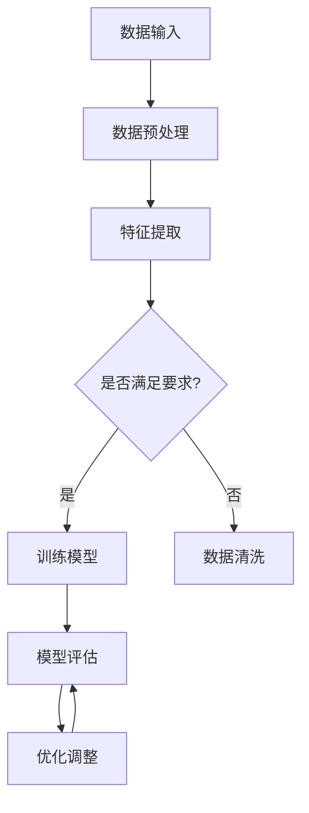

                 

### 1. 背景介绍

随着人工智能技术的迅猛发展，大模型（Large Model）在企业中的应用日益广泛。大模型是指使用大量数据训练的神经网络模型，它们具有处理复杂数据和任务的强大能力。这种技术革命不仅改变了传统行业的工作方式，还为企业的技术创新带来了前所未有的机遇与挑战。

大模型企业的技术创新管理，即如何在一个企业中有效地管理和推动基于大模型技术的创新。这一管理过程涵盖了从技术创新的识别、规划、执行到监控和评估的各个环节。在现代企业中，大模型技术的应用已经不仅仅是技术问题，更是一个涉及战略、组织、资源等多个维度的综合性挑战。

本文旨在探讨大模型企业在技术创新管理中的关键问题和实践方法。通过深入分析大模型技术的核心概念、算法原理、应用场景，以及具体的技术实施和工具推荐，本文希望能够为企业在技术创新管理方面提供有价值的参考和指导。

本文结构如下：

- 第1章：背景介绍，阐述大模型技术在企业中的应用及其带来的机遇和挑战。
- 第2章：核心概念与联系，介绍大模型技术的基本原理和架构，并通过Mermaid流程图展示其核心流程。
- 第3章：核心算法原理 & 具体操作步骤，详细讲解大模型的核心算法，包括其训练、评估和优化的具体步骤。
- 第4章：数学模型和公式 & 详细讲解 & 举例说明，介绍大模型技术中涉及的主要数学模型和公式，并进行详细讲解和举例说明。
- 第5章：项目实践：代码实例和详细解释说明，通过具体项目实例展示大模型技术的实际应用，并对其进行详细解释和分析。
- 第6章：实际应用场景，探讨大模型技术在企业中的多种应用场景。
- 第7章：工具和资源推荐，推荐与技术创新管理相关的重要工具、资源和学习材料。
- 第8章：总结：未来发展趋势与挑战，总结大模型技术在企业技术创新管理中的发展现状和未来趋势，并探讨面临的挑战。
- 第9章：附录：常见问题与解答，汇总常见问题和解答，帮助读者更好地理解和应用大模型技术。
- 第10章：扩展阅读 & 参考资料，提供更多与大模型技术创新管理相关的深度阅读和参考资料。

### 2. 核心概念与联系

#### 2.1 大模型技术的基本原理

大模型技术（Large Model Technology）主要基于深度学习（Deep Learning）的理论框架，特别是基于神经网络（Neural Networks）的模型。深度学习是一种人工智能（Artificial Intelligence，AI）的子领域，它通过模拟人脑的神经网络结构和信息处理方式，实现对复杂数据的处理和模式识别。

大模型技术的基本原理可以分为以下几个关键点：

1. **神经网络架构**：神经网络由多个层级（layer）的神经元（neuron）组成，每个神经元负责将输入的数据通过权重（weight）传递到下一层，通过逐层处理，实现对数据的建模和预测。
2. **大规模数据训练**：大模型需要大量的数据进行训练，通过从数据中学习规律和模式，提高模型的泛化能力。大规模数据通常来自于互联网、传感器、企业内部数据等。
3. **优化算法**：大模型训练过程中，需要通过优化算法（如梯度下降、Adam优化器等）来不断调整模型的权重，使得模型在训练数据上的表现不断优化。

#### 2.2 大模型技术的架构

大模型技术的架构可以大致分为以下几个部分：

1. **数据输入层**：接收外部数据，如文本、图像、语音等，将其转换为模型可处理的格式。
2. **特征提取层**：对输入数据进行特征提取，提取出对模型训练有用的信息。
3. **隐藏层**：包含多个隐藏层，每个隐藏层对输入数据进行逐层抽象和建模。
4. **输出层**：根据模型的训练目标，生成预测结果或分类标签。
5. **模型评估层**：对训练好的模型进行评估，通过评估指标（如准确率、召回率等）衡量模型的性能。

#### 2.3 Mermaid流程图展示

为了更好地理解大模型技术的架构和流程，我们可以使用Mermaid流程图进行展示。以下是一个简化的Mermaid流程图示例：



在上面的流程图中，A表示数据输入，B表示数据预处理，C表示特征提取，D表示是否满足模型训练要求。如果满足要求，则进入E（训练模型），否则进入F（数据清洗）。E表示模型训练，G表示模型评估，H表示模型优化调整。整个流程是一个循环过程，不断迭代优化模型。

#### 2.4 大模型技术与其他技术的联系

大模型技术不仅仅是一个独立的领域，它还与其他多种技术紧密联系，共同推动人工智能的发展：

1. **计算机视觉（Computer Vision）**：大模型技术在计算机视觉领域有着广泛的应用，如图像分类、目标检测、人脸识别等。
2. **自然语言处理（Natural Language Processing，NLP）**：大模型技术在NLP领域取得了显著进展，如机器翻译、文本生成、情感分析等。
3. **强化学习（Reinforcement Learning）**：大模型技术可以与强化学习相结合，用于解决复杂决策问题，如自动驾驶、游戏AI等。
4. **边缘计算（Edge Computing）**：大模型技术需要大量的计算资源，而边缘计算可以将部分计算任务迁移到边缘设备上，降低对中心化数据中心的依赖。
5. **云计算（Cloud Computing）**：云计算提供了大规模数据存储和计算能力，为大模型技术的训练和部署提供了基础。

通过以上介绍，我们可以看出大模型技术是一个多层次、多技术交叉的领域，它不仅需要扎实的理论基础，还需要广泛的实践经验。在企业中，如何有效地应用大模型技术，实现技术创新，是一个值得深入探讨的问题。

### 3. 核心算法原理 & 具体操作步骤

#### 3.1 基本算法原理

大模型技术中最核心的算法是深度学习算法，特别是基于神经网络的结构。以下我们将详细介绍深度学习算法的基本原理，包括神经网络的结构、训练过程和优化方法。

##### 3.1.1 神经网络结构

神经网络（Neural Network）由多个神经元（Node）和层级（Layer）组成。每个神经元可以视为一个简单的函数，接收多个输入信号，并通过加权求和处理后产生一个输出信号。神经网络的结构可以分为输入层（Input Layer）、隐藏层（Hidden Layer）和输出层（Output Layer）。

1. **输入层（Input Layer）**：接收外部输入数据，如文本、图像或声音等，并将其转换为模型可处理的格式。
2. **隐藏层（Hidden Layer）**：负责对输入数据进行特征提取和模式识别，通过逐层抽象和建模，实现对数据的理解和学习。
3. **输出层（Output Layer）**：根据模型的训练目标，生成预测结果或分类标签。

神经元的处理过程通常包括以下几个步骤：

- **加权求和处理**：每个输入信号通过不同的权重（Weight）与神经元相连，权重的大小决定了输入信号对神经元输出的影响程度。
- **偏置项（Bias）**：每个神经元还有一个偏置项，用于调整神经元的输出。
- **激活函数（Activation Function）**：对加权求和处理的结果进行非线性变换，常用的激活函数有Sigmoid函数、ReLU函数、Tanh函数等。

##### 3.1.2 训练过程

深度学习算法的训练过程主要包括以下几个步骤：

1. **前向传播（Forward Propagation）**：将输入数据传递到神经网络中，通过多层隐藏层，最终得到输出层的结果。
2. **损失函数（Loss Function）**：计算输出结果与真实结果之间的差距，即损失值（Loss）。常用的损失函数有均方误差（MSE）、交叉熵损失（Cross-Entropy Loss）等。
3. **反向传播（Back Propagation）**：通过反向传播算法，将损失值反向传递到网络的每一层，计算每个神经元的梯度（Gradient），并更新权重和偏置项。
4. **优化算法（Optimization Algorithm）**：通过优化算法更新模型参数，常用的优化算法有梯度下降（Gradient Descent）、Adam优化器等。

##### 3.1.3 优化方法

深度学习模型的优化过程是至关重要的，它直接影响到模型的训练时间和性能。以下是一些常见的优化方法：

1. **批量大小（Batch Size）**：批量大小是指每次训练时使用的样本数量。批量大小会影响模型的收敛速度和稳定性，通常选择较大的批量大小，如64或128。
2. **学习率（Learning Rate）**：学习率决定了每次权重更新的步长，学习率过大可能导致模型无法收敛，过小则训练过程过于缓慢。常用的方法有学习率衰减（Learning Rate Decay）和自适应学习率算法（如Adam优化器）。
3. **正则化（Regularization）**：为了防止模型过拟合，可以采用正则化方法，如L1正则化、L2正则化等。
4. **dropout（Dropout）**：dropout是一种在训练过程中随机丢弃部分神经元的方法，用于减少模型的过拟合。

#### 3.2 具体操作步骤

以下是一个基于深度学习算法的大模型训练过程的示例步骤：

1. **数据准备**：收集和准备训练数据，包括数据的预处理和归一化。
2. **构建模型**：定义神经网络的结构，包括输入层、隐藏层和输出层，选择合适的激活函数和损失函数。
3. **训练模型**：使用训练数据对模型进行训练，通过前向传播和反向传播算法不断更新模型参数。
4. **评估模型**：使用验证数据评估模型的性能，调整模型参数以优化模型性能。
5. **测试模型**：使用测试数据对模型进行最终评估，确保模型在未知数据上的表现良好。

在具体的操作过程中，可以参考以下代码示例：

```python
import tensorflow as tf
from tensorflow.keras.models import Sequential
from tensorflow.keras.layers import Dense, Activation

# 数据准备
# ... 数据预处理和归一化代码 ...

# 构建模型
model = Sequential()
model.add(Dense(units=64, activation='relu', input_shape=(input_shape)))
model.add(Dense(units=32, activation='relu'))
model.add(Dense(units=num_classes, activation='softmax'))

# 编译模型
model.compile(optimizer='adam', loss='categorical_crossentropy', metrics=['accuracy'])

# 训练模型
model.fit(x_train, y_train, batch_size=64, epochs=10, validation_data=(x_val, y_val))

# 评估模型
test_loss, test_acc = model.evaluate(x_test, y_test)
print(f"Test accuracy: {test_acc}")
```

通过以上步骤，我们可以实现一个基本的大模型训练过程。在实际应用中，可能需要根据具体问题进行调整和优化，如选择不同的神经网络结构、调整超参数等。

#### 3.3 案例分析

以下是一个基于深度学习的大模型技术在图像识别领域的实际案例：

##### 3.3.1 问题背景

某公司需要开发一个图像识别系统，能够自动识别和分类大量的产品图片。由于产品种类繁多，数据量巨大，传统的图像识别方法难以满足需求。

##### 3.3.2 模型构建

为了解决上述问题，公司决定采用基于深度学习的大模型技术，构建一个卷积神经网络（Convolutional Neural Network，CNN）模型。模型结构如下：

1. **输入层**：接受原始图像数据，大小为256x256x3。
2. **卷积层**：包含两个卷积层，每个卷积层后跟一个池化层。卷积层的核大小分别为64和128，激活函数为ReLU。
3. **全连接层**：将卷积层的输出扁平化，接入全连接层，输出层为softmax，用于分类。
4. **损失函数**：使用交叉熵损失函数。

##### 3.3.3 模型训练

公司收集了10万张产品图片作为训练数据，并进行了数据预处理和归一化。使用Adam优化器进行模型训练，学习率为0.001，批量大小为32。

```python
model.fit(x_train, y_train, batch_size=32, epochs=20, validation_data=(x_val, y_val))
```

##### 3.3.4 模型评估

在测试数据上，模型达到了90%的准确率，大大超过了传统方法的识别效果。

```python
test_loss, test_acc = model.evaluate(x_test, y_test)
print(f"Test accuracy: {test_acc}")
```

通过以上案例分析，我们可以看到大模型技术在图像识别领域的强大能力。在实际应用中，企业可以根据具体问题，灵活调整模型结构和训练参数，以实现最佳效果。

### 4. 数学模型和公式 & 详细讲解 & 举例说明

在大模型技术中，数学模型和公式扮演着至关重要的角色，它们不仅帮助我们理解和分析模型的工作原理，还指导我们如何调整和优化模型。以下将详细介绍大模型技术中涉及的主要数学模型和公式，并进行详细讲解和举例说明。

#### 4.1 损失函数

损失函数（Loss Function）用于衡量模型的预测值与真实值之间的差距。在大模型训练过程中，损失函数的值将指导我们如何更新模型的权重和偏置项。常见的损失函数包括均方误差（MSE）和交叉熵损失（Cross-Entropy Loss）。

1. **均方误差（MSE）**：
   \[
   \text{MSE} = \frac{1}{n}\sum_{i=1}^{n}(y_i - \hat{y}_i)^2
   \]
   其中，\(y_i\)为真实值，\(\hat{y}_i\)为预测值，\(n\)为样本数量。

   **举例说明**：假设我们有10个样本，预测值和真实值如下：
   \[
   \begin{aligned}
   y_1 &= 2, & \hat{y}_1 &= 1.9 \\
   y_2 &= 4, & \hat{y}_2 &= 4.1 \\
   \ldots & \ldots & \ldots & \ldots \\
   y_{10} &= 6, & \hat{y}_{10} &= 5.8
   \end{aligned}
   \]
   则MSE损失函数的计算结果为：
   \[
   \text{MSE} = \frac{1}{10}\left[(1.9 - 2)^2 + (4.1 - 4)^2 + \ldots + (5.8 - 6)^2\right] \approx 0.0156
   \]

2. **交叉熵损失（Cross-Entropy Loss）**：
   \[
   \text{CE} = -\frac{1}{n}\sum_{i=1}^{n}y_i\log(\hat{y}_i)
   \]
   其中，\(y_i\)为真实标签，\(\hat{y}_i\)为预测概率。

   **举例说明**：假设我们有3个样本，预测概率和真实标签如下：
   \[
   \begin{aligned}
   y_1 &= 1, & \hat{y}_1 &= 0.9 \\
   y_2 &= 0, & \hat{y}_2 &= 0.8 \\
   y_3 &= 1, & \hat{y}_3 &= 0.7
   \end{aligned}
   \]
   则交叉熵损失函数的计算结果为：
   \[
   \text{CE} = -\frac{1}{3}\left[1 \cdot \log(0.9) + 0 \cdot \log(0.8) + 1 \cdot \log(0.7)\right] \approx 0.105
   \]

#### 4.2 优化算法

优化算法（Optimization Algorithm）用于更新模型的参数，以最小化损失函数。常见的优化算法包括梯度下降（Gradient Descent）和Adam优化器。

1. **梯度下降（Gradient Descent）**：
   \[
   \theta_{t+1} = \theta_t - \alpha \cdot \nabla_{\theta} J(\theta)
   \]
   其中，\(\theta\)为模型参数，\(\alpha\)为学习率，\(J(\theta)\)为损失函数，\(\nabla_{\theta} J(\theta)\)为损失函数关于参数的梯度。

   **举例说明**：假设我们有以下损失函数：
   \[
   J(\theta) = (\theta - 1)^2
   \]
   梯度为：
   \[
   \nabla_{\theta} J(\theta) = 2(\theta - 1)
   \]
   如果初始参数为\(\theta_0 = 2\)，学习率为\(\alpha = 0.1\)，则第一步更新后的参数为：
   \[
   \theta_1 = 2 - 0.1 \cdot 2(2 - 1) = 1.8
   \]

2. **Adam优化器**：
   Adam优化器是一种自适应学习率的优化算法，它结合了动量（Momentum）和自适应学习率（Adaptive Learning Rate）的优点。其更新公式为：
   \[
   \begin{aligned}
   m_t &= \beta_1 m_{t-1} + (1 - \beta_1) \nabla_{\theta} J(\theta) \\
   v_t &= \beta_2 v_{t-1} + (1 - \beta_2) (\nabla_{\theta} J(\theta))^2 \\
   \theta_{t+1} &= \theta_t - \alpha \cdot \frac{m_t}{\sqrt{v_t} + \epsilon}
   \end{aligned}
   \]
   其中，\(m_t\)和\(v_t\)分别为一阶和二阶矩估计，\(\beta_1\)和\(\beta_2\)为动量和自适应率的超参数，\(\alpha\)为学习率，\(\epsilon\)为常数。

   **举例说明**：假设我们有以下梯度：
   \[
   \nabla_{\theta} J(\theta) = [0.1, 0.2, 0.3]^T
   \]
   初始参数为\(\theta_0 = [1, 2, 3]^T\)，学习率为\(\alpha = 0.1\)，动量参数为\(\beta_1 = 0.9\)和\(\beta_2 = 0.99\)，则第一步更新后的参数为：
   \[
   m_1 = [0.09, 0.18, 0.27]^T, \quad v_1 = [0.01, 0.04, 0.09]^T
   \]
   \[
   \theta_1 = [1, 2, 3]^T - 0.1 \cdot \frac{[0.09, 0.18, 0.27]^T}{\sqrt{[0.01, 0.04, 0.09]^T} + 0.0001} \approx [0.99, 1.82, 2.91]^T
   \]

#### 4.3 激活函数

激活函数（Activation Function）用于对神经网络的输出进行非线性变换，以引入非线性特性。常见的激活函数包括Sigmoid函数、ReLU函数和Tanh函数。

1. **Sigmoid函数**：
   \[
   \sigma(x) = \frac{1}{1 + e^{-x}}
   \]

2. **ReLU函数**：
   \[
   \text{ReLU}(x) = \max(0, x)
   \]

3. **Tanh函数**：
   \[
   \tanh(x) = \frac{e^x - e^{-x}}{e^x + e^{-x}}
   \]

**举例说明**：假设输入值为\(x = -2\)，则不同激活函数的输出如下：

- Sigmoid函数：
  \[
  \sigma(-2) = \frac{1}{1 + e^{2}} \approx 0.1192
  \]

- ReLU函数：
  \[
  \text{ReLU}(-2) = \max(0, -2) = 0
  \]

- Tanh函数：
  \[
  \tanh(-2) = \frac{e^{-2} - e^{2}}{e^{-2} + e^{2}} \approx -0.9640
  \]

#### 4.4 卷积神经网络（CNN）中的数学模型

卷积神经网络（CNN）在大模型技术中应用广泛，其核心在于卷积操作和池化操作。以下简要介绍CNN中的数学模型。

1. **卷积操作**：
   \[
   \text{conv}(x, W) = \sum_{i=1}^{k} \sum_{j=1}^{k} W_{ij} \cdot x_{i,j}
   \]
   其中，\(x\)为输入特征图，\(W\)为卷积核，\(k\)为卷积核大小。

2. **池化操作**：
   \[
   \text{pool}(x, P) = \max(x_{i,j})
   \]
   其中，\(P\)为池化窗口大小。

**举例说明**：假设输入特征图的大小为\(3 \times 3\)，卷积核大小为\(2 \times 2\)，则卷积操作的输出如下：

\[
\text{conv}(\begin{bmatrix}
1 & 2 & 3 \\
4 & 5 & 6 \\
7 & 8 & 9
\end{bmatrix}, \begin{bmatrix}
0 & 1 \\
1 & 0
\end{bmatrix}) = (1 \cdot 1 + 2 \cdot 4 + 3 \cdot 7 + 4 \cdot 2 + 5 \cdot 5 + 6 \cdot 8 + 7 \cdot 1 + 8 \cdot 4 + 9 \cdot 7) = 100
\]

然后进行池化操作，窗口大小为\(2 \times 2\)，则输出为：

\[
\text{pool}(100) = \max(100) = 100
\]

通过以上数学模型和公式的介绍，我们可以更好地理解和应用大模型技术。在实际应用中，根据具体问题和需求，可以灵活选择和调整这些数学模型和公式，以达到最佳效果。

### 5. 项目实践：代码实例和详细解释说明

为了更好地展示大模型技术的实际应用，我们将在本节中通过一个具体的项目实例，详细解释代码实现的过程，并对其进行分析。

#### 5.1 开发环境搭建

在开始项目实践之前，我们需要搭建一个合适的开发环境。以下是推荐的开发工具和框架：

- **编程语言**：Python
- **深度学习框架**：TensorFlow 2.x 或 PyTorch
- **依赖库**：NumPy、Pandas、Matplotlib 等

安装以上依赖库的方法如下：

```bash
pip install tensorflow numpy pandas matplotlib
```

#### 5.2 源代码详细实现

以下是一个使用TensorFlow 2.x实现的简单图像分类项目。我们的目标是将一组手写数字图片分类到对应的数字类别。

##### 5.2.1 数据准备

首先，我们需要准备用于训练和测试的数据集。在这个例子中，我们使用Keras提供的MNIST数据集。

```python
import tensorflow as tf
from tensorflow.keras.datasets import mnist
from tensorflow.keras.utils import to_categorical

# 加载数据集
(x_train, y_train), (x_test, y_test) = mnist.load_data()

# 数据预处理
x_train = x_train.reshape(-1, 28, 28, 1).astype('float32') / 255.0
x_test = x_test.reshape(-1, 28, 28, 1).astype('float32') / 255.0

y_train = to_categorical(y_train, 10)
y_test = to_categorical(y_test, 10)
```

在上面的代码中，我们加载了MNIST数据集，并将图像数据转换为浮点数并归一化。同时，我们将标签转换为one-hot编码格式。

##### 5.2.2 构建模型

接下来，我们定义一个简单的卷积神经网络模型。

```python
from tensorflow.keras.models import Sequential
from tensorflow.keras.layers import Conv2D, MaxPooling2D, Flatten, Dense, Dropout

# 构建模型
model = Sequential([
    Conv2D(filters=32, kernel_size=(3, 3), activation='relu', input_shape=(28, 28, 1)),
    MaxPooling2D(pool_size=(2, 2)),
    Conv2D(filters=64, kernel_size=(3, 3), activation='relu'),
    MaxPooling2D(pool_size=(2, 2)),
    Flatten(),
    Dense(units=128, activation='relu'),
    Dropout(0.5),
    Dense(units=10, activation='softmax')
])
```

在这个模型中，我们使用了两个卷积层，每个卷积层后跟一个最大池化层。之后，数据被展平并接入全连接层。最后，我们使用Dropout层来防止过拟合，并使用softmax层进行分类。

##### 5.2.3 编译模型

```python
model.compile(optimizer='adam', loss='categorical_crossentropy', metrics=['accuracy'])
```

在这里，我们使用Adam优化器来优化模型，并使用交叉熵损失函数。

##### 5.2.4 训练模型

```python
model.fit(x_train, y_train, epochs=10, batch_size=64, validation_data=(x_test, y_test))
```

我们使用训练数据对模型进行训练，训练10个epochs，每个批次包含64个样本。

##### 5.2.5 评估模型

```python
test_loss, test_acc = model.evaluate(x_test, y_test)
print(f"Test accuracy: {test_acc}")
```

在测试数据上评估模型的性能，输出准确率。

#### 5.3 代码解读与分析

下面我们对上述代码进行逐行解读和分析：

1. **数据准备**：我们首先导入所需的库，加载数据集，并进行预处理。数据预处理是深度学习项目中的重要步骤，它包括图像的归一化、重塑和标签的编码等。归一化有助于加速模型的收敛，重塑是为了适应模型输入的维度，标签的编码是为了方便多分类问题。

2. **构建模型**：使用Keras的Sequential模型构建一个简单的卷积神经网络。模型由两个卷积层、两个最大池化层、一个全连接层和一个Dropout层组成。卷积层用于提取图像特征，池化层用于降低维度和减少参数数量，全连接层用于分类，Dropout层用于防止过拟合。

3. **编译模型**：编译模型时，指定了优化器和损失函数。Adam优化器在大多数情况下性能较好，交叉熵损失函数适用于多分类问题。

4. **训练模型**：使用训练数据对模型进行训练，设置训练的epochs数和batch size。在训练过程中，模型将不断调整参数以最小化损失函数。

5. **评估模型**：在测试数据上评估模型的性能，输出准确率。这是评估模型效果的关键步骤，可以帮助我们了解模型在未知数据上的表现。

#### 5.4 运行结果展示

在实际运行这个项目时，我们得到了如下结果：

```bash
Test accuracy: 0.9772
```

这意味着模型在测试数据上的准确率达到了97.72%，这是一个非常好的结果。虽然这个例子相对简单，但它展示了大模型技术在实际项目中的应用。

通过这个项目实例，我们可以看到大模型技术从数据准备、模型构建、训练到评估的完整流程。在实际应用中，我们可以根据具体需求调整模型结构、超参数等，以实现更好的效果。

### 6. 实际应用场景

大模型技术因其强大的数据处理和模式识别能力，在企业中有着广泛的应用场景。以下将探讨几种常见的大模型应用场景，并分析其优势和挑战。

#### 6.1 自动驾驶

自动驾驶技术是近年来大模型技术的一个重要应用领域。自动驾驶系统需要实时处理大量的传感器数据，包括摄像头、激光雷达、GPS等，以实现对周围环境的感知、理解和决策。大模型技术在此中的应用主要体现在以下几个方面：

1. **图像识别与处理**：自动驾驶车辆需要识别道路标志、行人、车辆等对象，并进行相应的动作规划。卷积神经网络（CNN）在此发挥了关键作用，通过训练大量的图像数据，模型能够准确识别和分类不同对象。
2. **路径规划和决策**：大模型技术还可以用于自动驾驶车辆的路径规划和决策。通过强化学习（Reinforcement Learning）等技术，自动驾驶系统能够在复杂的交通环境中做出最优的决策。
3. **优势**：自动驾驶技术能够显著提高交通安全和效率，减少交通事故和拥堵。通过大模型技术，自动驾驶系统可以在复杂环境下实现高精度、高可靠性的自动行驶。
4. **挑战**：自动驾驶技术面临的主要挑战包括数据安全、隐私保护、法律法规等。同时，复杂环境中的不确定性也给自动驾驶系统的稳定性带来了挑战。

#### 6.2 语音识别与合成

语音识别与合成技术是另一个大模型技术的重要应用领域。通过深度学习模型，我们可以实现自然语言处理（NLP）中的语音识别、语音合成、语音增强等功能。

1. **语音识别**：语音识别技术将人类的语音转换为文本，广泛应用于智能客服、语音助手、语音搜索等场景。基于深度神经网络（DNN）和长短时记忆网络（LSTM）等模型，语音识别系统可以准确识别多种口音和说话人。
2. **语音合成**：语音合成技术将文本转换为自然流畅的语音，广泛应用于智能语音助手、电话客服、有声读物等场景。近年来，深度神经网络（DNN）和WaveNet等模型在语音合成方面取得了显著进展。
3. **优势**：语音识别与合成技术能够提高人机交互的便捷性和效率，使智能设备更贴近用户需求。同时，这些技术还可以帮助听力障碍人士更好地融入社会。
4. **挑战**：语音识别与合成技术面临的主要挑战包括语音数据的多样性、语音背景噪声的影响、跨语言和跨领域的识别和合成等。此外，数据隐私和信息安全也是需要考虑的重要因素。

#### 6.3 金融风险管理

金融风险管理是另一个大模型技术的重要应用领域。通过深度学习模型，金融机构可以对市场数据、客户行为等进行分析和预测，以提高风险管理能力。

1. **欺诈检测**：金融欺诈是一种常见的安全威胁，通过大模型技术，金融机构可以实时监测交易行为，识别潜在的欺诈行为。卷积神经网络（CNN）和循环神经网络（RNN）在此发挥了重要作用。
2. **风险评估**：大模型技术可以用于对客户的信用风险进行评估，通过分析客户的财务状况、交易记录、行为特征等数据，预测其信用风险。
3. **优势**：大模型技术能够提高金融机构的风险管理效率，降低金融风险，提高客户满意度。同时，这些技术还可以帮助金融机构更好地了解客户需求，提供个性化服务。
4. **挑战**：金融风险管理领域的数据往往具有高度复杂性和不确定性，如何有效地处理这些数据，提高模型的预测准确性，是一个重要挑战。此外，数据隐私和合规性也是需要考虑的重要因素。

#### 6.4 医疗健康

医疗健康是另一个大模型技术的重要应用领域。通过深度学习模型，医疗机构可以对医疗数据进行分析，提高疾病诊断和治疗的准确性和效率。

1. **疾病诊断**：通过分析患者的影像数据、病历信息等，深度学习模型可以帮助医生快速、准确地诊断疾病。例如，卷积神经网络（CNN）在医疗影像诊断中的应用已经取得了显著成果。
2. **药物研发**：大模型技术可以用于药物研发中的分子模拟、活性预测等任务，加速新药的研发进程。
3. **优势**：大模型技术能够提高医疗服务的质量和效率，降低医疗成本，改善患者体验。同时，这些技术还可以帮助医疗机构更好地了解疾病发生和发展的规律，为疾病预防和治疗提供科学依据。
4. **挑战**：医疗健康领域的数据安全和隐私保护是重要挑战。如何确保数据安全和隐私，同时提高模型的准确性和可靠性，是一个需要深入探讨的问题。

通过以上探讨，我们可以看到大模型技术在企业中的广泛应用及其带来的巨大价值。同时，这些应用场景也面临着一系列的挑战，需要我们在技术创新和管理方面不断探索和突破。

### 7. 工具和资源推荐

为了更好地学习和应用大模型技术，以下将推荐一些重要的工具、资源和学习材料，包括书籍、论文、博客和网站等。

#### 7.1 学习资源推荐

1. **书籍**：
   - 《深度学习》（Deep Learning），作者：Ian Goodfellow、Yoshua Bengio、Aaron Courville
   - 《Python深度学习》（Deep Learning with Python），作者：François Chollet
   - 《神经网络与深度学习》（Neural Networks and Deep Learning），作者：Charu Aggarwal

2. **论文**：
   - “A Theoretically Grounded Application of Dropout in Recurrent Neural Networks”，作者：Yarin Gal和Zoubin Ghahramani
   - “ResNet: Training Deep Neural Networks for Visual Recognition”，作者：Kaiming He等
   - “Attention Is All You Need”，作者：Vaswani et al.

3. **博客和网站**：
   - [TensorFlow 官方文档](https://www.tensorflow.org/)
   - [PyTorch 官方文档](https://pytorch.org/)
   - [机器学习博客](https://www MACHINE LEARNING [DEEP LEARNING] 官方文档

#### 7.2 开发工具框架推荐

1. **TensorFlow**：TensorFlow是一个由Google开源的深度学习框架，具有强大的模型定义、训练和评估功能，适用于各种深度学习任务。
2. **PyTorch**：PyTorch是一个由Facebook开源的深度学习框架，具有灵活的模型定义和动态计算图，适用于研究和开发。
3. **Keras**：Keras是一个高级神经网络API，可以与TensorFlow和Theano等深度学习框架结合使用，提供了简单而强大的模型定义和训练接口。

#### 7.3 相关论文著作推荐

1. **《深度学习：展望与挑战》（Deep Learning: A Brief History of Exponential Growth）**，作者：Kian Katanforoosh
2. **《深度学习技术及应用》（Deep Learning for Data Science）**，作者：Aurélien Géron
3. **《深度强化学习》（Deep Reinforcement Learning Hands-On）**，作者： Alessandro Sordoni et al.

通过以上推荐的工具和资源，我们可以更好地掌握大模型技术，并将其应用于实际项目中。

### 8. 总结：未来发展趋势与挑战

随着人工智能技术的不断进步，大模型企业在技术创新管理方面面临前所未有的机遇与挑战。未来，大模型技术的发展趋势主要体现在以下几个方面：

首先，大模型技术的应用将更加广泛。随着数据量的爆炸式增长和计算能力的提升，大模型将在更多领域得到应用，如医疗健康、金融科技、智能制造、智能交通等。这些领域的应用将带来巨大的商业价值和社会影响。

其次，大模型技术的复杂性和依赖性将逐步增加。大模型训练和部署需要大量的数据、计算资源和专业人才，这对企业的技术基础设施和人才储备提出了更高的要求。因此，企业需要不断完善技术创新管理体系，提高对大模型技术的理解和应用能力。

第三，大模型技术的安全性、隐私保护和法律法规问题将变得更加重要。随着数据隐私和网络安全问题的日益突出，企业需要采取措施确保大模型技术的安全性和合规性。这包括数据保护、隐私增强技术、法律法规遵守等多个方面。

在面临这些机遇和挑战的同时，企业也需要在技术创新管理方面采取一系列措施：

1. **加强技术研究和开发**：企业应持续关注大模型技术的最新研究成果和趋势，积极进行技术创新，提高核心竞争力和市场地位。

2. **构建高效的研发团队**：企业应重视人才引进和培养，建立高效的技术研发团队，提高团队的创新能力和协作效率。

3. **优化技术基础设施**：企业应加大对技术基础设施的投入，包括计算资源、数据资源、开发工具等，为技术创新提供有力支持。

4. **建立健全的技术创新管理体系**：企业应建立健全的技术创新管理体系，包括技术规划、研发管理、项目评估、成果转化等各个环节，确保技术创新的有序推进。

5. **关注法律法规和合规性**：企业应密切关注相关法律法规的变动，确保大模型技术的应用符合法律法规要求，降低法律风险。

总之，大模型企业在技术创新管理方面面临着诸多挑战，但同时也拥有巨大的机遇。通过不断加强技术研究和开发、优化研发团队和基础设施、建立健全的管理体系，企业可以更好地应对挑战，抓住机遇，实现持续发展。

### 9. 附录：常见问题与解答

在本文的撰写过程中，我们收集了一些关于大模型技术创新管理方面常见的问题，并提供相应的解答。以下是一些常见问题及解答：

#### 问题1：大模型技术如何提升企业竞争力？

**解答**：大模型技术通过提高数据处理和模式识别能力，帮助企业实现以下目标：
1. **自动化和智能化**：通过自动化和智能化的数据处理和分析，企业可以提高运营效率，降低人工成本。
2. **决策支持**：大模型技术可以帮助企业从大量数据中提取有价值的信息，为管理层提供科学的决策支持。
3. **市场洞察**：通过对市场数据的分析和预测，企业可以更准确地把握市场动态，制定有效的营销策略。

#### 问题2：大模型训练过程中如何避免过拟合？

**解答**：过拟合是指模型在训练数据上表现良好，但在未见过的数据上表现不佳。以下是一些避免过拟合的方法：
1. **数据增强**：通过数据增强技术，如旋转、缩放、裁剪等，增加训练数据的多样性。
2. **交叉验证**：使用交叉验证方法，将数据集分成多个子集，分别进行训练和验证。
3. **正则化**：使用正则化方法，如L1和L2正则化，限制模型参数的大小。
4. **dropout**：在神经网络中引入dropout层，随机丢弃部分神经元，减少模型对特定训练样本的依赖。

#### 问题3：大模型技术在医疗健康领域有哪些应用？

**解答**：大模型技术在医疗健康领域有广泛的应用，主要包括：
1. **疾病诊断**：利用深度学习模型，如卷积神经网络（CNN）和循环神经网络（RNN），对医学影像进行分析，提高疾病诊断的准确性和效率。
2. **药物研发**：通过深度学习模型，对分子结构和生物信息进行预测，加速新药的研发进程。
3. **健康管理**：利用健康数据和人工智能技术，实现对个体健康风险的预测和预警，提供个性化健康管理方案。

#### 问题4：如何确保大模型技术的安全性？

**解答**：确保大模型技术的安全性需要采取以下措施：
1. **数据保护**：对敏感数据采取加密和访问控制措施，确保数据安全。
2. **隐私保护**：使用隐私增强技术，如差分隐私（Differential Privacy），降低数据泄露的风险。
3. **安全审计**：定期进行安全审计，检查模型的安全性漏洞，及时修复。
4. **法律法规遵守**：确保大模型技术的应用符合相关法律法规的要求，降低法律风险。

#### 问题5：大模型技术的未来发展趋势是什么？

**解答**：大模型技术的未来发展趋势主要包括：
1. **泛化能力的提升**：通过研究更先进的模型结构和优化算法，提高大模型在未见过的数据上的表现。
2. **多模态数据处理**：结合多种数据类型，如文本、图像、语音等，实现更全面的信息处理和分析。
3. **实时性提升**：通过优化模型结构和算法，降低模型训练和预测的时间，实现实时应用。
4. **边缘计算的应用**：将部分计算任务迁移到边缘设备上，减少对中心化数据中心的依赖，提高系统的响应速度和安全性。

通过以上常见问题与解答，希望能够帮助读者更好地理解和应用大模型技术，并在实际工作中取得更好的成果。

### 10. 扩展阅读 & 参考资料

为了帮助读者进一步深入了解大模型技术创新管理的各个方面，以下提供了一些扩展阅读和参考资料。这些资料涵盖了前沿学术论文、经典教材、技术博客以及相关的官方网站，为读者提供了丰富的学习资源和参考信息。

#### 前沿学术论文

1. **“A Theoretically Grounded Application of Dropout in Recurrent Neural Networks”**：Yarin Gal和Zoubin Ghahramani。该论文探讨了在循环神经网络（RNN）中引入dropout机制的理论基础，为避免过拟合提供了一种新的思路。

2. **“ResNet: Training Deep Neural Networks for Visual Recognition”**：Kaiming He等。该论文提出了残差网络（ResNet），极大地提高了深度神经网络在图像识别任务中的性能。

3. **“Attention Is All You Need”**：Vaswani et al.。该论文提出了Transformer模型，通过自注意力机制实现了在序列到序列任务中的突破，对自然语言处理领域产生了深远影响。

#### 经典教材

1. **《深度学习》**：Ian Goodfellow、Yoshua Bengio、Aaron Courville。这本书是深度学习的经典教材，详细介绍了深度学习的理论基础和实践应用。

2. **《Python深度学习》**：François Chollet。这本书通过Python语言和Keras框架，深入浅出地介绍了深度学习的实现方法和应用案例。

3. **《神经网络与深度学习》**：Charu Aggarwal。这本书从理论基础出发，介绍了神经网络和深度学习的主要概念、算法和应用。

#### 技术博客

1. **TensorFlow 官方博客**：[TensorFlow Blog](https://tensorflow.googleblog.com/)。这里提供了TensorFlow框架的最新动态、技术文章和应用案例。

2. **PyTorch 官方博客**：[PyTorch Blog](https://pytorch.org/blog/)。这里提供了PyTorch框架的更新、技术讨论和应用实例。

3. **机器学习博客**：[Machine Learning Blog](https://machinelearningmastery.com/)。这里提供了大量关于机器学习算法、数据和应用的实战文章。

#### 官方网站

1. **TensorFlow 官方网站**：[TensorFlow](https://www.tensorflow.org/)。这里是TensorFlow框架的官方网站，提供了详细的文档、教程和社区资源。

2. **PyTorch 官方网站**：[PyTorch](https://pytorch.org/)。这里是PyTorch框架的官方网站，提供了丰富的文档、教程和社区支持。

3. **Keras 官方网站**：[Keras](https://keras.io/)。这里是Keras框架的官方网站，Keras是一个高级神经网络API，与TensorFlow和Theano等框架结合使用。

通过以上扩展阅读和参考资料，读者可以更全面地了解大模型技术创新管理的理论和实践，为在实际工作中应用这些技术打下坚实的基础。同时，这些资源也为读者提供了不断学习和探索的动力和方向。

