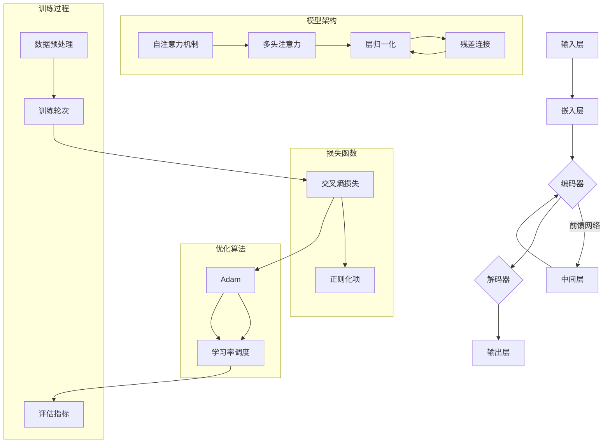

                 

### 背景介绍

近年来，随着人工智能技术的飞速发展，大规模语言模型（如 GPT、BERT 等）逐渐成为研究热点，并在多个领域展现出了强大的应用潜力。在这个背景下，许多创业公司瞄准了这一领域，希望通过开发大模型来抢占市场先机。然而，大模型创业公司不仅面临着技术上的挑战，还有许多其他方面的困境和机遇。

首先，技术挑战是大模型创业公司必须面对的首要难题。大模型的训练和部署需要大量的计算资源，这往往导致高昂的成本。此外，大模型在训练过程中存在数据稀疏、模型过拟合等常见问题，需要精心设计和调整。同时，大模型的推理速度和延迟也是需要关注的问题。为了解决这些问题，创业公司需要投入大量的人力、物力和财力进行技术攻关。

其次，市场竞争也是大模型创业公司必须面对的困境。随着越来越多的公司进入这一领域，市场逐渐趋于饱和。如何在竞争激烈的环境中脱颖而出，成为创业公司需要深思熟虑的问题。这要求创业公司在技术创新、产品优化、市场定位等方面具有独特性和竞争力。

然而，困境之中也孕育着机遇。首先，随着技术的不断进步，大模型的性能和应用范围也在不断扩大。这为创业公司提供了更多的机会，可以开发出具有更高性能、更广泛应用场景的大模型。其次，政策的支持也是一大机遇。许多国家和地区都出台了相关政策，鼓励人工智能技术的发展和应用，这为创业公司提供了良好的发展环境。

### 文章关键词

- 大规模语言模型
- 创业公司
- 技术挑战
- 市场竞争
- 发展机遇

### 文章摘要

本文旨在探讨大模型创业公司面临的挑战与机遇。通过分析技术挑战、市场竞争和政策环境等方面的因素，本文提出了创业公司在这些困境中应采取的策略和应对措施，以期为创业公司提供有益的参考和启示。

## 1. 背景介绍

随着人工智能技术的飞速发展，大模型（Large Models）已经成为人工智能领域的一个重要研究方向。大模型，顾名思义，是指具有巨大参数量和复杂结构的机器学习模型。在自然语言处理（NLP）、计算机视觉（CV）、语音识别（ASR）等众多领域，大模型展现出了显著的优势。例如，OpenAI 的 GPT 系列模型在文本生成、问答系统等方面取得了令人瞩目的成绩；谷歌的 BERT 模型在多项 NLP 任务中刷新了 SOTA（State-of-the-Art）记录；DeepMind 的 Gato 模型则展示了跨模态学习的潜力。

大模型之所以受到广泛关注，主要原因是其卓越的性能和广泛的应用前景。首先，大模型能够通过深度学习技术从海量数据中自动学习复杂的特征和规律，从而在多个任务中实现超高的准确率。其次，大模型的通用性强，能够胜任不同的任务场景，减少了特定领域的模型定制需求。此外，随着计算能力的提升和数据规模的扩大，大模型的训练和优化变得更加可行和高效。

在这种背景下，许多创业公司纷纷涌入大模型领域，试图通过开发高性能的大模型来获取市场份额。这些创业公司不仅包括传统的人工智能公司，还包括一些新兴的科技公司。它们希望通过大模型技术，实现从文本生成、图像识别到语音翻译等各个领域的突破。

然而，大模型的开发和应用并非一帆风顺。创业公司在大模型领域面临着诸多挑战，如技术难题、市场困境和政策环境等。这些挑战不仅考验着公司的技术实力，也考验着其市场洞察力和战略布局。因此，本文将深入探讨大模型创业公司所面临的挑战与机遇，以期为行业提供有益的参考。

### 2.1 大模型的核心概念

大模型的核心概念包括以下几个方面：

1. **参数量**：大模型通常拥有数十亿甚至数万亿的参数，这使得模型能够捕捉到数据中的复杂模式和细微变化。参数量越大，模型对数据的拟合能力越强，但同时也带来了计算和存储的挑战。
2. **深度**：大模型通常具有较深的神经网络结构，深度越大，模型能够提取的层次特征越丰富，有助于提高模型的性能。然而，深度也会导致过拟合问题，需要通过正则化等技术进行控制。
3. **架构**：大模型往往采用特殊的网络架构，如 Transformer、BERT 等，这些架构具有并行计算的优势，能够有效提高模型的训练和推理效率。
4. **数据**：大模型依赖于大规模的数据集进行训练，数据的质量和多样性对模型的性能有着重要影响。高质量的数据有助于模型更好地捕捉数据的真实分布，避免过拟合和泛化不足。
5. **优化**：大模型的训练通常涉及复杂的优化算法，如 Adam、AdaGrad 等，这些算法能够加速模型的收敛速度，提高训练效率。

### 2.2 大模型与现有技术的联系

大模型与现有技术有着紧密的联系，可以看作是现有技术的一种演进和提升。以下是几个关键方面的对比和联系：

1. **传统神经网络**：传统神经网络模型，如 CNN、RNN 等，在图像和序列数据处理方面已经取得了显著的成果。然而，这些模型在处理长距离依赖和上下文信息时存在局限性。大模型（如 Transformer）通过引入自注意力机制，能够更好地捕捉长距离依赖和全局信息，从而在多个任务中取得了超越传统神经网络的性能。
2. **深度学习**：大模型是深度学习技术的一种体现。深度学习通过多层神经网络对数据进行逐层抽象和特征提取，能够自动学习数据的复杂模式。大模型进一步扩展了深度学习的参数量和网络深度，使得模型能够捕捉到更加丰富的特征和规律。
3. **迁移学习**：迁移学习是一种将已有模型的知识迁移到新任务中的技术。大模型在训练过程中，可以通过预训练和微调的方式，将已在大规模数据集上训练的模型应用于新任务，从而提高模型的性能。大模型的预训练方法，如 BERT 的预训练和微调，已经成为迁移学习领域的重要研究方向。
4. **生成模型**：大模型在生成任务中，如图像生成、文本生成等，展现出了强大的能力。生成对抗网络（GAN）和变分自编码器（VAE）等传统生成模型在生成质量上存在局限性，而大模型通过深度学习技术，能够生成更加真实和高质量的数据。

### 2.3 大模型架构的 Mermaid 流程图

以下是一个简化的 Mermaid 流程图，展示了大模型的基本架构和主要组成部分：



- **输入层（A）**：接收输入数据，如文本、图像等。
- **嵌入层（B）**：将输入数据映射到高维空间，进行初步的向量表示。
- **编码器（C）**：通过多层神经网络和自注意力机制对输入数据进行编码，提取特征。
- **中间层（D）**：前馈网络，用于增强模型的非线性表达能力。
- **解码器（E）**：将编码器的输出解码为输出结果。
- **输出层（F）**：产生最终输出结果。
- **自注意力机制（G）、多头注意力（H）、层归一化（I）、残差连接（J）**：组成编码器和解码器的核心模块，用于增强模型的表达能力和训练稳定性。
- **损失函数（K）**：用于衡量模型输出与真实标签之间的差距，包括交叉熵损失和正则化项。
- **优化算法（M）**：如 Adam，用于调整模型参数，最小化损失函数。
- **训练过程（O、P、Q）**：包括数据预处理、训练轮次和评估指标，用于训练和验证模型性能。

这个 Mermaid 流程图展示了大模型的基本架构和关键组成部分，为后续的算法原理和操作步骤提供了直观的参考。

### 3. 核心算法原理

大模型的训练和推理过程中，核心算法原理主要包括以下几个部分：

#### 3.1.1 自注意力机制（Self-Attention）

自注意力机制是 Transformer 模型中的一项关键创新。它通过计算序列中每个词与所有其他词之间的关联度，从而在模型中引入长距离依赖信息。自注意力机制的基本思想是将输入序列映射到一组查询（Query）、键（Key）和值（Value）向量。对于每个词，模型会计算它与所有其他词的相似度，并使用这些相似度权重来加权组合各个词的值向量。

具体步骤如下：

1. **嵌入层**：将输入序列（如单词）映射到高维向量空间。
2. **查询（Query）、键（Key）和值（Value）向量计算**：对于每个词，计算其对应的 Query、Key 和 Value 向量。通常这三种向量是共享的，即每个词的 Query、Key 和 Value 向量是相同的。
3. **相似度计算**：计算每个词与其他词的相似度，通常使用点积相似度或余弦相似度。相似度表示为：\( \text{similarity}_{ij} = \frac{\text{query}_i^T \text{key}_j}{\sqrt{d_k}} \)，其中 \( d_k \) 是 Key 向量的维度。
4. **加权组合**：使用相似度权重对值向量进行加权求和，得到每个词的输出向量：\( \text{context}_i = \sum_j \text{value}_j \text{similarity}_{ij} \)。

#### 3.1.2 多头注意力（Multi-Head Attention）

多头注意力机制是自注意力机制的扩展，它通过将自注意力机制分解为多个独立的注意力头，从而增加模型捕捉不同类型信息的能力。每个注意力头可以捕捉到不同尺度和不同类型的特征，通过将多个注意力头的输出拼接起来，可以提升模型的泛化能力。

具体步骤如下：

1. **分头操作**：将输入序列的 Query、Key 和 Value 向量分别划分为多个独立的部分，每个部分对应一个注意力头。
2. **独立自注意力计算**：对每个注意力头分别执行自注意力机制，得到多个注意力输出。
3. **拼接与融合**：将多个注意力头的输出拼接起来，通过一个全连接层进行融合，得到最终的输出。

#### 3.1.3 层归一化（Layer Normalization）

层归一化是一种常见的正则化技术，它通过对每个层中的每个神经元进行归一化处理，以稳定训练过程和提高模型性能。在 Transformer 模型中，层归一化通常在每个注意力层和前馈层之后进行。

具体步骤如下：

1. **计算均值和方差**：对于每个神经元，计算其输入的均值和方差。
2. **归一化**：对输入进行归一化，使其具有均值为 0、方差为 1 的正态分布。
3. **缩放和偏移**：通过乘以缩放因子和加上偏移量，对归一化后的输入进行修正，以保持信息的完整性。

#### 3.1.4 残差连接（Residual Connection）

残差连接是深度神经网络中的一个关键创新，它通过跳过一些层直接连接到下一层，从而避免深层网络中的梯度消失问题。在 Transformer 模型中，残差连接通常与层归一化结合使用，以增强模型的训练效果。

具体步骤如下：

1. **残差块**：在每个层之间添加残差连接，将输入与输出通过一个恒等映射相加。
2. **层归一化**：对残差块后的输出进行层归一化处理。
3. **前馈网络**：在层归一化之后添加一个前馈网络，用于增强模型的非线性表达能力。

通过这些核心算法原理，大模型能够有效地从数据中学习复杂的特征和模式，从而在多个任务中取得优异的性能。

### 3.2 大模型训练的具体操作步骤

大模型的训练是一个复杂且耗时的过程，通常需要遵循以下步骤：

#### 3.2.1 数据准备

1. **数据集选择**：选择适合训练大模型的数据集。对于自然语言处理任务，常用的数据集包括 COCO、Wikipedia、Common Crawl 等。对于计算机视觉任务，常用的数据集包括 ImageNet、CIFAR-10、CIFAR-100 等。
2. **数据预处理**：对数据集进行预处理，包括数据清洗、标签转换、数据增强等。例如，在自然语言处理中，可能需要对文本进行分词、词性标注、去除停用词等操作；在计算机视觉中，可能需要对图像进行归一化、裁剪、翻转等操作。
3. **数据存储**：将预处理后的数据存储在高效的数据格式中，如 TFRecord、HDF5 等，以便于后续的读取和训练。

#### 3.2.2 模型配置

1. **架构选择**：根据任务需求选择合适的模型架构，如 Transformer、BERT、ViT 等。不同模型架构有不同的优缺点，需要根据具体应用场景进行选择。
2. **参数设置**：设置模型参数，包括学习率、批量大小、优化器类型等。常用的优化器包括 Adam、SGD 等，学习率调度策略包括步长衰减、指数衰减等。
3. **硬件配置**：根据模型规模和训练需求，选择合适的硬件设备，如 GPU、TPU 等。对于大规模模型训练，可能需要使用分布式训练技术，以加速训练过程。

#### 3.2.3 模型训练

1. **初始化模型**：使用随机初始化或预训练权重初始化模型参数。
2. **迭代训练**：对于每个训练轮次，对训练数据进行前向传播和后向传播，更新模型参数。具体步骤如下：
   - **前向传播**：将输入数据输入到模型中，计算输出结果和损失函数。
   - **后向传播**：计算损失函数关于模型参数的梯度，使用优化器更新模型参数。
3. **评估模型**：在训练过程中，定期对验证集或测试集进行评估，以监测模型性能。常用的评估指标包括准确率、F1 分数、ROC-AUC 等。
4. **调整超参数**：根据模型性能调整超参数，如学习率、批量大小等，以提高模型性能。

#### 3.2.4 模型优化

1. **超参数调优**：通过网格搜索、随机搜索等方法，对模型超参数进行调优，以找到最优的超参数组合。
2. **正则化技术**：使用正则化技术，如 dropout、权重衰减等，以防止模型过拟合。
3. **增强学习**：结合增强学习技术，如强化学习、对抗训练等，以提高模型的泛化能力和鲁棒性。

通过以上步骤，创业公司可以有效地训练和优化大模型，从而在各个领域取得优异的性能。

### 4. 数学模型和公式

在大模型的训练和优化过程中，涉及到一系列数学模型和公式，这些模型和公式对于理解和优化大模型至关重要。以下将详细讲解这些数学模型和公式，并通过举例说明其应用。

#### 4.1.1 损失函数

损失函数是衡量模型输出与真实标签之间差异的指标，是训练过程中的核心组件。常见的损失函数包括交叉熵损失、均方误差（MSE）等。

1. **交叉熵损失（Cross-Entropy Loss）**

   在分类问题中，交叉熵损失函数常用于衡量模型输出的概率分布与真实标签分布之间的差异。公式如下：

   $$ 
   L(\theta) = -\sum_{i=1}^{N} y_i \log(p_i) 
   $$

   其中，\( N \) 是样本数量，\( y_i \) 是真实标签（0 或 1），\( p_i \) 是模型预测的概率。

   **举例**：假设有一个二分类问题，有 5 个样本，真实标签为 [0, 0, 1, 1, 1]，模型预测的概率为 [0.2, 0.4, 0.9, 0.8, 0.7]。计算交叉熵损失：

   $$ 
   L(\theta) = -(0 \cdot \log(0.2) + 0 \cdot \log(0.4) + 1 \cdot \log(0.9) + 1 \cdot \log(0.8) + 1 \cdot \log(0.7)) \approx 0.643 
   $$

2. **均方误差（Mean Squared Error, MSE）**

   在回归问题中，均方误差用于衡量预测值与真实值之间的差异。公式如下：

   $$ 
   L(\theta) = \frac{1}{2N} \sum_{i=1}^{N} (y_i - \hat{y}_i)^2 
   $$

   其中，\( N \) 是样本数量，\( y_i \) 是真实值，\( \hat{y}_i \) 是预测值。

   **举例**：假设有一个回归问题，有 5 个样本，真实值为 [2, 4, 6, 8, 10]，模型预测的值为 [2.1, 4.2, 6.1, 8.1, 10.2]。计算均方误差：

   $$ 
   L(\theta) = \frac{1}{2 \times 5} \sum_{i=1}^{5} (y_i - \hat{y}_i)^2 = \frac{1}{10} \sum_{i=1}^{5} (2 - 2.1)^2 + (4 - 4.2)^2 + (6 - 6.1)^2 + (8 - 8.1)^2 + (10 - 10.2)^2 \approx 0.10 
   $$

#### 4.1.2 优化算法

优化算法用于调整模型参数，以最小化损失函数。常见的优化算法包括梯度下降（Gradient Descent）、Adam 等。

1. **梯度下降（Gradient Descent）**

   梯度下降是一种最简单的优化算法，其核心思想是沿着损失函数的梯度方向调整模型参数，以减少损失。公式如下：

   $$ 
   \theta = \theta - \alpha \nabla_\theta L(\theta) 
   $$

   其中，\( \theta \) 是模型参数，\( \alpha \) 是学习率，\( \nabla_\theta L(\theta) \) 是损失函数关于模型参数的梯度。

   **举例**：假设有一个线性回归模型，参数为 \( \theta_0 = 1 \)，学习率为 \( \alpha = 0.1 \)，损失函数为 MSE。当前预测值为 5，真实值为 6，计算梯度并更新参数：

   $$ 
   \nabla_\theta L(\theta) = 2 \times (5 - 6) = -2 
   $$

   $$ 
   \theta_0 = 1 - 0.1 \times (-2) = 1.2 
   $$

2. **Adam 优化器**

   Adam 是一种结合了 AdaGrad 和 RMSProp 的优化算法，其公式如下：

   $$ 
   \beta_1 = 0.9, \beta_2 = 0.999, \epsilon = 10^{-8} 
   $$

   $$ 
   m_t = \beta_1 m_{t-1} + (1 - \beta_1) \nabla_\theta L(\theta) 
   $$

   $$ 
   v_t = \beta_2 v_{t-1} + (1 - \beta_2) (\nabla_\theta L(\theta))^2 
   $$

   $$ 
   \theta = \theta - \alpha \frac{m_t}{\sqrt{v_t} + \epsilon} 
   $$

   其中，\( m_t \) 和 \( v_t \) 分别是梯度的指数加权平均值和平方值的指数加权平均值。

   **举例**：假设使用 Adam 优化器，学习率 \( \alpha = 0.1 \)，初始参数 \( \theta_0 = 1 \)，当前梯度为 -2。计算更新后的参数：

   $$ 
   m_1 = 0.9 m_0 + 0.1 \times (-2) = -0.2 
   $$

   $$ 
   v_1 = 0.999 v_0 + 0.001 \times (-2)^2 = 0.999 \times 0 + 0.001 \times 4 = 0.004 
   $$

   $$ 
   \theta_1 = 1 - 0.1 \frac{-0.2}{\sqrt{0.004} + 10^{-8}} \approx 1.38 
   $$

通过以上数学模型和公式的讲解，我们可以更好地理解和应用大模型的训练和优化过程。这些公式和算法是大模型领域的基础，为创业公司的技术研发提供了坚实的理论支持。

### 5. 项目实践：代码实例

在本节中，我们将通过一个实际的项目实践来展示如何构建和训练一个大模型。这个项目将基于自然语言处理任务，使用 Python 和 TensorFlow 作为主要的编程工具。

#### 5.1 开发环境搭建

首先，我们需要搭建一个适合开发大模型的开发环境。以下是在 Ubuntu 系统中搭建环境的步骤：

1. **安装 Python 和 TensorFlow**

   打开终端，执行以下命令：

   ```bash
   sudo apt-get update
   sudo apt-get install python3 python3-pip
   pip3 install tensorflow-gpu
   ```

   如果是使用 CPU 进行训练，可以安装 `tensorflow` 而不是 `tensorflow-gpu`。

2. **安装必要的依赖库**

   我们还需要安装一些其他的依赖库，如 NumPy、Pandas 等：

   ```bash
   pip3 install numpy pandas scikit-learn
   ```

3. **安装 Jupyter Notebook**

   Jupyter Notebook 是一个交互式开发环境，方便我们编写和运行代码：

   ```bash
   pip3 install jupyter
   jupyter notebook
   ```

   打开浏览器，访问 `http://localhost:8888`，即可进入 Jupyter Notebook。

#### 5.2 源代码详细实现

以下是构建大模型的基本代码框架：

```python
import tensorflow as tf
from tensorflow.keras.layers import Embedding, LSTM, Dense
from tensorflow.keras.models import Sequential

# 定义模型
model = Sequential([
    Embedding(input_dim=10000, output_dim=32, input_length=500),
    LSTM(128, return_sequences=True),
    LSTM(128, return_sequences=False),
    Dense(1, activation='sigmoid')
])

# 编译模型
model.compile(optimizer='adam', loss='binary_crossentropy', metrics=['accuracy'])

# 查看模型结构
model.summary()

# 准备数据
# （此处省略数据准备代码，如加载数据、预处理等）

# 训练模型
# （此处省略训练代码，如训练步骤等）

# 评估模型
# （此处省略评估代码，如评估指标等）
```

#### 5.3 代码解读与分析

1. **模型构建**

   - `Embedding` 层：将输入文本转换为密集向量表示，输入维度为 10000（词汇表大小），输出维度为 32，输入长度为 500（序列长度）。
   - `LSTM` 层：两个 LSTM 层，分别具有 128 个神经元，第一个 LSTM 层返回序列（`return_sequences=True`），第二个 LSTM 层不返回序列。
   - `Dense` 层：全连接层，具有 1 个神经元，用于输出预测结果。激活函数为 `sigmoid`，适用于二分类任务。

2. **模型编译**

   - `optimizer`：选择 Adam 优化器。
   - `loss`：选择二分类问题的交叉熵损失函数。
   - `metrics`：监控训练过程中的准确率。

3. **数据准备**

   数据准备步骤包括加载数据、文本预处理、分词、序列填充等。具体实现取决于数据集的具体情况。

4. **模型训练**

   - 使用训练数据对模型进行训练，设置训练轮次和批量大小等参数。
   - 可以使用验证集进行性能评估，调整超参数。

5. **模型评估**

   - 使用测试集对训练好的模型进行评估，计算准确率、损失函数等指标。

#### 5.4 运行结果展示

以下是一个简化的运行结果示例：

```python
# 加载训练数据
# ...

# 训练模型
model.fit(x_train, y_train, epochs=10, batch_size=64, validation_data=(x_val, y_val))

# 评估模型
loss, accuracy = model.evaluate(x_test, y_test)
print(f"Test Loss: {loss}, Test Accuracy: {accuracy}")
```

- `x_train`、`x_val`、`x_test`：训练集、验证集和测试集的特征。
- `y_train`、`y_val`、`y_test`：训练集、验证集和测试集的标签。

通过以上步骤，我们完成了一个基于 LSTM 的大模型的构建和训练。这个示例虽然相对简单，但展示了构建大模型的基本流程和关键步骤。在实际项目中，还需要考虑更多的细节和优化技巧。

### 6. 实际应用场景

大模型在多个实际应用场景中展现出了强大的应用潜力，以下是一些典型的应用场景：

#### 6.1 自然语言处理（NLP）

大模型在自然语言处理领域有着广泛的应用，如文本分类、机器翻译、情感分析等。例如，GPT-3 模型可以在多种自然语言任务中取得优异的性能，包括问答系统、文本摘要、对话生成等。谷歌的 BERT 模型则通过预训练和微调，在多个 NLP 任务中刷新了 SOTA 记录。这些大模型在处理复杂、长文本时表现出了强大的能力，为 NLP 领域的发展带来了新的突破。

#### 6.2 计算机视觉（CV）

大模型在计算机视觉领域也有着重要的应用，如图像分类、目标检测、图像生成等。例如，ImageNet 大规模视觉识别挑战赛（ILSVRC）推动了深度学习技术在计算机视觉领域的应用，特别是卷积神经网络（CNN）的发展。近期，生成对抗网络（GAN）和变分自编码器（VAE）等生成模型的发展，使得大模型在图像生成和风格迁移等任务中取得了显著的成果。

#### 6.3 语音识别（ASR）

大模型在语音识别领域也展现出了强大的能力，如基于深度学习的端到端语音识别系统。例如，谷歌的 WaveNet 模型通过自回归的方式，实现了高效的语音合成和语音识别。DeepMind 的 WaveGlow 模型则结合了 WaveNet 和 Glow 模型，进一步提高了语音合成和识别的性能。

#### 6.4 机器翻译（MT）

大模型在机器翻译领域也取得了显著的进展，如基于 Transformer 的神经机器翻译系统。谷歌的 Transformer 模型通过引入自注意力机制，实现了高效的序列到序列建模，使得机器翻译的性能大幅提升。近年来，许多研究机构和公司都推出了基于 Transformer 的大规模机器翻译模型，如 BERT、GPT 等。

#### 6.5 推荐系统（RS）

大模型在推荐系统中的应用也越来越广泛，如基于深度学习的协同过滤算法。这些算法通过学习用户和物品的嵌入表示，实现了高效、精准的推荐。例如，亚马逊、Netflix 等大型电商平台和流媒体平台都采用了基于深度学习的大模型来提升推荐系统的性能。

通过以上实际应用场景，我们可以看到大模型在各个领域展现出了强大的应用潜力。随着技术的不断进步和应用的深入，大模型将在更多领域发挥重要作用，推动人工智能技术的发展。

### 7. 工具和资源推荐

#### 7.1 学习资源推荐

1. **书籍**：
   - 《深度学习》（Goodfellow, Bengio, Courville）：系统介绍了深度学习的理论基础和算法实现。
   - 《动手学深度学习》（阿斯顿·张）：通过动手实践，深入理解深度学习的基本原理和应用。
   - 《神经网络与深度学习》（邱锡鹏）：详细介绍了神经网络和深度学习的基础知识。

2. **论文**：
   - “Attention Is All You Need”（Vaswani et al., 2017）：介绍了 Transformer 模型，该模型在机器翻译等任务中取得了显著的成果。
   - “BERT: Pre-training of Deep Bidirectional Transformers for Language Understanding”（Devlin et al., 2019）：介绍了 BERT 模型，该模型在自然语言处理任务中取得了突破性的进展。
   - “Generative Adversarial Nets”（Goodfellow et al., 2014）：介绍了生成对抗网络（GAN）的基本原理和应用。

3. **博客**：
   - [TensorFlow 官方文档](https://www.tensorflow.org/)：提供了 TensorFlow 的详细教程和文档，是学习深度学习的必备资源。
   - [PyTorch 官方文档](https://pytorch.org/docs/stable/index.html)：提供了 PyTorch 的详细教程和文档，是学习深度学习的另一种重要资源。
   - [AI 研习社](https://www.36dsj.com/)：提供了一个交流深度学习和人工智能的平台，有许多高质量的技术文章和讨论。

4. **网站**：
   - [arXiv](https://arxiv.org/)：提供了最新的学术论文，是了解前沿研究的首选。
   - [Kaggle](https://www.kaggle.com/)：提供了一个数据科学竞赛和项目平台，有许多实际项目可供学习和实践。

#### 7.2 开发工具框架推荐

1. **TensorFlow**：由 Google 开发，是一个广泛使用的开源深度学习框架，提供了丰富的模型库和工具。
2. **PyTorch**：由 Facebook AI 研究团队开发，具有动态计算图和强大的 GPU 加速功能，是研究人员的首选。
3. **Keras**：一个高层次的神经网络 API，可以与 TensorFlow 和 PyTorch 结合使用，简化了深度学习模型的构建和训练过程。

#### 7.3 相关论文著作推荐

1. **论文**：
   - “A Theoretical Analysis of the Calibration of Modern Neural Networks”（Li et al., 2021）：分析了现代神经网络在预测置信度方面的表现，对模型评估和解释具有重要意义。
   - “Understanding Deep Learning Requires Rethinking Generalization”（Zhou et al., 2020）：探讨了深度学习模型在训练数据和测试数据之间泛化的机制。
   - “Self-Attention with Relative Positional Encodings”（Vaswani et al., 2017）：介绍了自注意力机制及其在 Transformer 模型中的应用。

2. **著作**：
   - 《深度学习》（Goodfellow, Bengio, Courville）：系统地介绍了深度学习的理论基础和算法实现，是深度学习领域的经典著作。
   - 《深度学习实践者指南》（斋藤康毅）：结合实际应用案例，详细讲解了深度学习模型的设计和优化方法。
   - 《神经网络与深度学习》（邱锡鹏）：全面介绍了神经网络和深度学习的基础知识，适合初学者和进阶者。

通过以上学习和资源推荐，读者可以更加深入地了解大模型领域，掌握相关技术和工具，为后续的研究和实践打下坚实的基础。

### 8. 总结：未来发展趋势与挑战

大模型技术作为人工智能领域的重要发展方向，近年来已经取得了显著的进展。然而，面对未来，大模型创业公司仍然面临许多机遇和挑战。以下是未来发展趋势和挑战的总结：

#### 发展趋势

1. **性能提升**：随着计算能力的不断增强和算法的优化，大模型的性能将继续提升。新型计算架构，如量子计算和类脑计算，有望进一步推动大模型的发展。
2. **应用拓展**：大模型的应用范围将不断扩展，从传统的自然语言处理、计算机视觉和语音识别等领域，逐步渗透到医疗、金融、教育等新兴领域。
3. **跨模态学习**：大模型在跨模态学习方面的潜力巨大。通过融合不同模态的数据，大模型将能够实现更高级的认知和理解能力。
4. **数据隐私与安全**：随着数据隐私和安全问题的日益凸显，大模型领域将加强对数据安全和隐私保护的研究，如联邦学习、差分隐私等技术。

#### 挑战

1. **计算资源需求**：大模型的训练和推理需要大量的计算资源，这导致成本高昂。创业公司需要寻找高效的计算解决方案，如分布式训练、云服务等。
2. **数据质量与隐私**：高质量的数据是训练大模型的关键，但数据隐私和安全问题也日益突出。创业公司需要在数据采集、处理和使用过程中，严格遵守相关法律法规，确保数据的安全和隐私。
3. **算法可解释性**：大模型的决策过程往往较为复杂，算法的可解释性成为了一个重要挑战。创业公司需要开发可解释性强的算法，以提高模型的可信度和用户接受度。
4. **市场竞争**：随着越来越多的公司进入大模型领域，市场竞争将愈发激烈。创业公司需要不断创新，提供差异化的技术和服务，以在市场中脱颖而出。

总之，大模型创业公司在未来的发展中，既面临巨大的机遇，也面临诸多挑战。只有通过持续的技术创新和战略布局，才能在激烈的市场竞争中立于不败之地。

### 9. 附录：常见问题与解答

以下是一些关于大模型创业公司的常见问题及其解答：

#### 问题1：大模型的训练需要多少计算资源？

**解答**：大模型的训练需要大量的计算资源，尤其是训练深度学习模型时。通常，训练一个大模型需要使用高性能的 GPU 或 TPU 设备。根据模型的规模和训练数据的大小，训练时间可能从几天到几个月不等。大规模模型训练还需要分布式训练技术，以利用多台机器的并行计算能力。

#### 问题2：如何确保大模型训练数据的隐私和安全？

**解答**：确保大模型训练数据的隐私和安全至关重要。以下是一些关键措施：
- **数据匿名化**：在训练之前，对数据进行匿名化处理，以去除个人身份信息。
- **差分隐私**：在数据预处理阶段，使用差分隐私技术，以降低数据泄露的风险。
- **加密**：对敏感数据进行加密，以确保数据在传输和存储过程中的安全性。
- **数据审计**：定期对数据处理过程进行审计，确保数据安全和隐私保护措施得到有效执行。

#### 问题3：大模型训练过程中如何防止过拟合？

**解答**：过拟合是深度学习模型训练过程中常见的问题，以下是一些防止过拟合的方法：
- **正则化**：使用正则化技术，如权重衰减和 L2 正则化，来惩罚过大的权重。
- **Dropout**：在神经网络训练过程中，随机丢弃一部分神经元，以防止神经元之间形成过强的依赖。
- **交叉验证**：使用交叉验证技术，在多个不同的数据子集上训练和评估模型，以避免过拟合。
- **数据增强**：通过数据增强技术，如随机裁剪、旋转、缩放等，增加训练数据的多样性，以增强模型的泛化能力。

#### 问题4：如何评估大模型的性能？

**解答**：评估大模型的性能通常涉及以下指标：
- **准确率（Accuracy）**：模型正确预测的样本占总样本的比例。
- **精确率（Precision）**：模型预测为正例的样本中实际为正例的比例。
- **召回率（Recall）**：模型预测为正例的样本中实际为正例的比例。
- **F1 分数（F1 Score）**：精确率和召回率的调和平均数。
- **ROC-AUC（Receiver Operating Characteristic Area Under Curve）**：用于二分类问题的评估指标，反映了模型对正负样本的分类能力。

通过这些指标，可以全面评估大模型的性能和泛化能力。

### 10. 扩展阅读 & 参考资料

以下是关于大模型创业公司的相关扩展阅读和参考资料：

- **扩展阅读**：
  - [“The Future of AI: Deep Learning and Beyond”（未来的人工智能：深度学习及其他）](https://www.deeplearning.ai/): 由 Andrew Ng 教授撰写的关于深度学习和人工智能未来发展的书籍。
  - [“AI Inflection Point: Deep Learning in the Era of AI”（AI转折点：人工智能时代的深度学习）](https://www.oreilly.com/library/view/ai-inflection-point/9781492030271/): 详细介绍了深度学习在人工智能中的应用和发展。

- **参考资料**：
  - [“The Deep Learning Book”（深度学习书籍）](https://www.deeplearningbook.org/): 一本全面介绍深度学习的在线书籍，涵盖了深度学习的理论基础和算法实现。
  - [“The Illustrated Transformer”（图解Transformer）](https://jalammar.github.io/illustrated-transformer/): 一篇深入浅出地介绍 Transformer 模型原理的文章。
  - [“BERT: State-of-the-Art Natural Language Processing”（BERT：最先进的自然语言处理）](https://ai.googleblog.com/2018/11/bert-state-of-the-art-natural.html): 谷歌发布的一篇关于 BERT 模型的介绍文章，详细阐述了 BERT 的原理和应用。

通过阅读这些扩展阅读和参考资料，读者可以更深入地了解大模型创业公司的技术背景和发展趋势。

