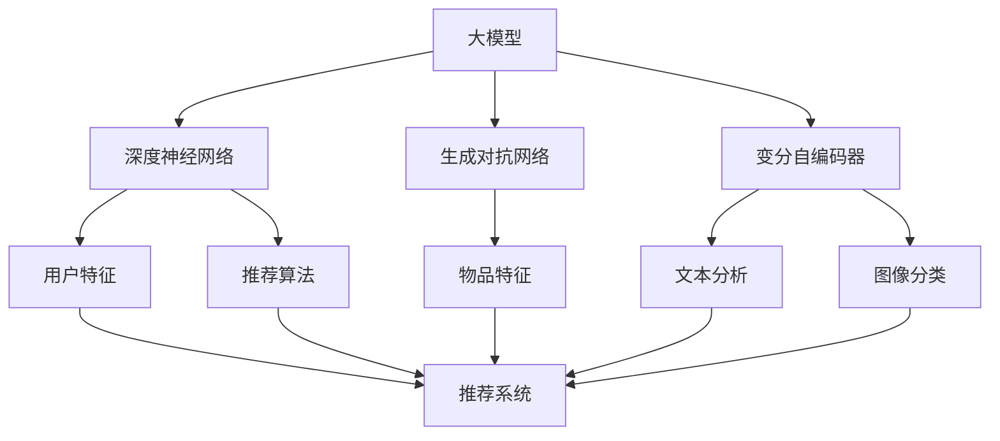

                 

### 背景介绍

大模型在当今科技领域的崛起，无疑是一个不可忽视的现象。随着人工智能技术的飞速发展，深度学习算法的不断完善，大模型技术逐渐成为推动各个行业进步的关键力量。特别是在商业领域，大模型的应用正悄然改变着市场格局和商业策略。

推荐系统是商业应用中一个非常典型且至关重要的场景。推荐系统通过分析用户的兴趣和行为，向用户推荐个性化商品、服务或内容，从而提高用户满意度、增加用户黏性和转化率。传统的推荐系统大多依赖于统计模型和协同过滤算法，这些方法在数据量有限、特征较少的情况下表现出色。但随着互联网的普及和用户数据的爆炸性增长，传统推荐系统逐渐暴露出一些局限性，例如用户冷启动问题、数据稀疏性问题和推荐效果的同质化现象。

大模型的引入为推荐系统带来了新的契机。大模型，如深度神经网络、生成对抗网络和变分自编码器等，通过学习海量数据，能够捕捉到用户行为的深层模式和复杂关系。这使得推荐系统在处理高维数据、实现个性化推荐和解决冷启动问题方面具备了更强的能力。同时，大模型还可以结合自然语言处理、图像识别等前沿技术，为用户提供更加丰富和多样化的推荐体验。

在商业领域，推荐系统的应用场景多种多样。电子商务平台通过推荐系统，可以提升销售额和用户购物体验；在线视频平台通过推荐系统，可以增加用户观看时长和粘性；新闻媒体平台通过推荐系统，可以精准推送用户感兴趣的内容，提高用户阅读量和广告收益。大模型的应用不仅提升了推荐系统的效果，还拓展了其应用范围，为商业决策提供了更加精准的数据支持。

总之，大模型在商业中的应用，特别是推荐系统的进步与变革，正在引发一场深远的商业革命。本文将深入探讨大模型在推荐系统中的应用原理、技术进展、实践案例以及未来发展趋势，为读者提供一幅全面而详尽的画卷。接下来的章节中，我们将逐步解析大模型的核心概念、算法原理、数学模型和实际应用，帮助读者全面了解这一前沿领域。

### 核心概念与联系

要深入探讨大模型在推荐系统中的应用，我们首先需要明确几个核心概念：大模型、推荐系统、深度学习、自然语言处理和图像识别。这些概念不仅在大模型的研究与应用中至关重要，而且它们之间相互联系，共同构建了现代推荐系统的基石。

#### 大模型

大模型，顾名思义，是指规模巨大、参数数量庞大的神经网络模型。这些模型通过学习海量数据，能够捕捉到复杂的模式和关系。大模型的常见类型包括：

- **深度神经网络（DNN）**：一种多层神经网络结构，能够对高维数据进行复杂的非线性变换。
- **生成对抗网络（GAN）**：由生成器和判别器组成的对抗性模型，通过生成数据与真实数据进行对抗训练，能够生成高质量的假数据。
- **变分自编码器（VAE）**：基于概率生成模型的自编码器，能够学习数据的概率分布，并生成新的数据。

#### 推荐系统

推荐系统是一种信息过滤技术，旨在向用户推荐他们可能感兴趣的商品、服务或内容。其核心任务是从大量可能的选择中，为每个用户挑选出最符合其兴趣的推荐项。推荐系统的核心组件包括：

- **用户特征**：描述用户兴趣、行为和偏好的数据，如用户浏览历史、购买记录和反馈评分。
- **物品特征**：描述推荐项属性的数据，如商品类别、标签和描述。
- **推荐算法**：根据用户特征和物品特征，生成推荐结果的算法，如基于协同过滤、基于内容的推荐和基于模型的推荐。

#### 深度学习

深度学习是机器学习的一个分支，通过构建多层神经网络模型，实现数据的自动特征提取和复杂模式的识别。深度学习在推荐系统中的应用主要体现在以下几个方面：

- **特征工程**：利用深度学习模型自动提取用户和物品的潜在特征，减少人工特征工程的繁琐。
- **预测模型**：使用深度学习模型进行用户行为预测和推荐结果生成，提高推荐系统的准确性和效果。
- **个性化推荐**：通过深度学习模型捕捉用户的长期兴趣和短期偏好，实现更加个性化的推荐。

#### 自然语言处理

自然语言处理（NLP）是人工智能领域的一个重要分支，致力于使计算机能够理解、生成和处理人类语言。NLP在推荐系统中的应用主要体现在以下几个方面：

- **文本分析**：对用户评论、标签和描述等文本数据进行情感分析和主题识别，提取文本特征。
- **推荐文案生成**：利用NLP技术生成吸引人的推荐文案，提高用户的点击率和购买意愿。
- **对话系统**：构建智能对话系统，通过自然语言交互为用户提供个性化推荐服务。

#### 图像识别

图像识别是计算机视觉领域的一个重要分支，旨在使计算机能够识别和理解图像内容。图像识别在推荐系统中的应用主要体现在以下几个方面：

- **图像分类**：对用户上传的图片进行分类，提取图像特征，辅助生成推荐结果。
- **商品识别**：通过图像识别技术自动识别商品，为用户提供精准的购物推荐。
- **广告投放**：利用图像识别技术，实现广告的精准投放，提高广告效果和用户满意度。

#### Mermaid 流程图

为了更好地展示这些核心概念之间的联系，我们可以使用Mermaid语言绘制一个流程图，如下所示：



在这个流程图中，大模型通过深度神经网络、生成对抗网络和变分自编码器等模型，学习用户特征和物品特征，并生成推荐算法。自然语言处理和图像识别技术则用于辅助生成推荐文案和图像分类，从而实现更加精准和个性化的推荐。

### 核心算法原理 & 具体操作步骤

在深入了解大模型在推荐系统中的应用之前，我们需要首先掌握一些核心算法原理。这些算法不仅奠定了大模型在推荐系统中的应用基础，还为我们理解和优化推荐系统的性能提供了理论支持。

#### 深度学习算法原理

深度学习算法是推荐系统中最常用的算法之一。其基本原理是通过构建多层神经网络，对输入数据进行层层变换和特征提取，从而实现对复杂模式的识别和预测。以下是一个典型的深度学习算法流程：

1. **输入层（Input Layer）**：接收用户特征和物品特征作为输入数据。
2. **隐藏层（Hidden Layers）**：通过多个隐藏层，对输入数据进行非线性变换和特征提取。每一层都能提取比前一层更高层次的特征。
3. **输出层（Output Layer）**：将提取的特征进行汇总，生成最终的预测结果。

在具体操作步骤中，我们可以使用以下技术实现深度学习算法：

- **激活函数（Activation Function）**：用于引入非线性因素，常见的激活函数包括Sigmoid、ReLU和Tanh。
- **损失函数（Loss Function）**：用于衡量预测结果与真实值之间的差异，常见的损失函数包括均方误差（MSE）和交叉熵（Cross-Entropy）。
- **优化算法（Optimization Algorithm）**：用于最小化损失函数，常见的优化算法包括梯度下降（Gradient Descent）和随机梯度下降（Stochastic Gradient Descent）。

#### 协同过滤算法原理

协同过滤算法是推荐系统中的另一种重要算法，其基本原理是通过分析用户行为和偏好，找到相似的用户或物品，从而为用户推荐相似的物品。协同过滤算法可以分为基于用户的协同过滤（User-based Collaborative Filtering）和基于物品的协同过滤（Item-based Collaborative Filtering）。

1. **基于用户的协同过滤**：
   - **步骤1**：计算用户之间的相似度，常用的相似度度量方法包括余弦相似度和皮尔逊相关系数。
   - **步骤2**：找到与目标用户最相似的K个用户。
   - **步骤3**：计算这K个用户的共同偏好物品。
   - **步骤4**：为用户推荐共同偏好物品中评分较高的物品。

2. **基于物品的协同过滤**：
   - **步骤1**：计算物品之间的相似度，常用的相似度度量方法包括余弦相似度和欧氏距离。
   - **步骤2**：找到与目标物品最相似的K个物品。
   - **步骤3**：计算这K个物品的用户评分。
   - **步骤4**：为用户推荐用户评分较高的物品。

#### 大模型在推荐系统中的应用

大模型在推荐系统中的应用主要体现在以下几个方面：

1. **用户特征提取**：通过深度学习算法，自动提取用户兴趣和行为特征的潜在表示，减少人工特征工程的工作量。
2. **物品特征提取**：同样通过深度学习算法，提取物品的潜在特征，从而实现更加精细的物品分类和推荐。
3. **预测模型构建**：使用深度学习模型进行用户行为预测和推荐结果生成，提高推荐系统的准确性和效果。
4. **个性化推荐**：通过深度学习模型捕捉用户的长期兴趣和短期偏好，实现更加个性化的推荐。

#### 具体操作步骤

以下是一个基于深度学习的推荐系统实现步骤：

1. **数据预处理**：
   - **步骤1**：收集用户行为数据（如浏览历史、购买记录、点击行为等）。
   - **步骤2**：对数据进行清洗和预处理，如缺失值填充、异常值处理和归一化。
   - **步骤3**：将用户和物品特征进行编码，如使用独热编码或嵌入编码。

2. **模型构建**：
   - **步骤1**：设计深度学习模型结构，包括输入层、隐藏层和输出层。
   - **步骤2**：选择合适的激活函数和损失函数，如ReLU激活函数和交叉熵损失函数。
   - **步骤3**：配置优化算法，如Adam优化器。

3. **模型训练**：
   - **步骤1**：将预处理后的数据输入到深度学习模型中，进行前向传播和反向传播。
   - **步骤2**：使用训练数据对模型进行训练，调整模型参数，优化模型性能。
   - **步骤3**：使用验证集对模型进行验证，调整模型参数，防止过拟合。

4. **模型评估**：
   - **步骤1**：使用测试集对模型进行评估，计算准确率、召回率和F1值等指标。
   - **步骤2**：分析模型性能，调整模型结构和参数，提高推荐效果。

5. **推荐生成**：
   - **步骤1**：输入用户特征和物品特征到训练好的模型中，进行预测。
   - **步骤2**：根据预测结果生成推荐列表，展示给用户。

通过上述步骤，我们可以构建一个基于大模型的推荐系统，实现个性化、精准的推荐服务。接下来，我们将进一步探讨大模型在推荐系统中的数学模型和公式，帮助读者更深入地理解这一领域的核心技术。

### 数学模型和公式 & 详细讲解 & 举例说明

在深入探讨大模型在推荐系统中的应用时，数学模型和公式起到了至关重要的作用。它们不仅提供了理论支持，还帮助我们理解和优化推荐系统的性能。在这一部分，我们将详细讲解几个关键的数学模型和公式，并通过具体例子来说明它们的实际应用。

#### 1. 深度学习中的反向传播算法

深度学习中的反向传播算法（Backpropagation Algorithm）是一种用于训练神经网络的优化方法。它通过计算损失函数相对于网络参数的梯度，迭代调整网络权重，以最小化损失函数。

**公式**：

反向传播算法的核心公式包括：

1. **前向传播**：

   $$ z_l = \sigma(W_l \cdot a_{l-1} + b_l) $$

   其中，\( z_l \) 是第 \( l \) 层的中间激活值，\( \sigma \) 是激活函数，\( W_l \) 和 \( b_l \) 分别是第 \( l \) 层的权重和偏置。

2. **后向传播**：

   $$ \delta_l = \frac{\partial L}{\partial a_l} \cdot \sigma'(z_l) $$

   其中，\( \delta_l \) 是第 \( l \) 层的误差梯度，\( L \) 是损失函数，\( \sigma' \) 是激活函数的导数。

3. **权重和偏置更新**：

   $$ W_l = W_l - \alpha \cdot \frac{\partial L}{\partial W_l} $$

   $$ b_l = b_l - \alpha \cdot \frac{\partial L}{\partial b_l} $$

   其中，\( \alpha \) 是学习率，用于控制权重和偏置的更新步长。

**例子**：

假设我们有一个简单的两层神经网络，用于实现二分类任务。输入层有2个神经元，隐藏层有3个神经元，输出层有1个神经元。使用ReLU作为激活函数，交叉熵作为损失函数。

- **前向传播**：

  输入数据 \( x \) ，经过输入层和隐藏层的非线性变换，得到隐藏层的输出 \( a_1 \) 和输出层的输出 \( a_2 \) 。

  $$ a_1 = \sigma(W_1 \cdot x + b_1) $$

  $$ a_2 = \sigma(W_2 \cdot a_1 + b_2) $$

- **后向传播**：

  计算输出层的误差梯度 \( \delta_2 \) ，并传播到隐藏层。

  $$ \delta_2 = (y - a_2) \cdot \sigma'(a_2) $$

  $$ \delta_1 = (W_2 \cdot \delta_2) \cdot \sigma'(a_1) $$

- **权重和偏置更新**：

  根据误差梯度更新权重和偏置。

  $$ W_2 = W_2 - \alpha \cdot \frac{\partial L}{\partial W_2} $$

  $$ b_2 = b_2 - \alpha \cdot \frac{\partial L}{\partial b_2} $$

  $$ W_1 = W_1 - \alpha \cdot \frac{\partial L}{\partial W_1} $$

  $$ b_1 = b_1 - \alpha \cdot \frac{\partial L}{\partial b_1} $$

#### 2. 协同过滤中的相似度计算

在协同过滤算法中，相似度计算是核心步骤之一。它通过度量用户或物品之间的相似度，找到相似的邻居，从而进行推荐。

**公式**：

1. **用户相似度**：

   $$ sim(u, v) = \frac{u \cdot v}{\|u\| \cdot \|v\|} $$

   其中，\( u \) 和 \( v \) 分别是用户 \( u \) 和用户 \( v \) 的特征向量，\( \cdot \) 表示内积，\( \| \) 表示欧几里得范数。

2. **物品相似度**：

   $$ sim(i, j) = \frac{i \cdot j}{\|i\| \cdot \|j\|} $$

   其中，\( i \) 和 \( j \) 分别是物品 \( i \) 和物品 \( j \) 的特征向量。

**例子**：

假设有两个用户 \( u_1 \) 和 \( u_2 \)，他们的特征向量分别为：

$$ u_1 = [1, 2, 3] $$

$$ u_2 = [4, 5, 6] $$

- **用户相似度**：

  $$ sim(u_1, u_2) = \frac{1 \cdot 4 + 2 \cdot 5 + 3 \cdot 6}{\sqrt{1^2 + 2^2 + 3^2} \cdot \sqrt{4^2 + 5^2 + 6^2}} = \frac{32}{\sqrt{14} \cdot \sqrt{77}} \approx 0.82 $$

- **物品相似度**：

  假设有两个物品 \( i_1 \) 和 \( i_2 \)，他们的特征向量分别为：

  $$ i_1 = [1, 1, 1] $$

  $$ i_2 = [2, 2, 2] $$

  $$ sim(i_1, i_2) = \frac{1 \cdot 2 + 1 \cdot 2 + 1 \cdot 2}{\sqrt{1^2 + 1^2 + 1^2} \cdot \sqrt{2^2 + 2^2 + 2^2}} = \frac{6}{\sqrt{3} \cdot \sqrt{12}} \approx 1.0 $$

#### 3. 大模型中的正则化方法

在大模型训练过程中，正则化方法是一种防止过拟合的重要手段。常用的正则化方法包括L1正则化和L2正则化。

**公式**：

1. **L1正则化**：

   $$ \frac{\partial L}{\partial W} = \frac{\partial L}{\partial a_2} \cdot \sigma'(z_2) \cdot (W_2) $$

   其中，\( W_2 \) 是L1正则化项，用于控制权重的大小。

2. **L2正则化**：

   $$ \frac{\partial L}{\partial W} = \frac{\partial L}{\partial a_2} \cdot \sigma'(z_2) \cdot (W_2 + \lambda) $$

   其中，\( \lambda \) 是L2正则化项，用于控制权重的大小和范数。

**例子**：

假设有一个简单的两层神经网络，使用L2正则化进行训练。

- **损失函数**：

  $$ L = \frac{1}{2} \cdot (y - a_2)^2 + \lambda \cdot \frac{1}{2} \cdot \|W_2\|^2 $$

- **权重更新**：

  $$ W_2 = W_2 - \alpha \cdot \frac{\partial L}{\partial W_2} $$

  $$ \frac{\partial L}{\partial W_2} = \frac{\partial L}{\partial a_2} \cdot \sigma'(z_2) - \lambda \cdot W_2 $$

通过上述数学模型和公式的讲解，我们可以更好地理解大模型在推荐系统中的应用原理和操作步骤。这些公式不仅为我们提供了理论支持，还帮助我们在实际应用中优化推荐系统的性能。在接下来的章节中，我们将通过实际项目实践，进一步探讨大模型在推荐系统中的应用。

### 项目实践：代码实例和详细解释说明

为了更好地理解大模型在推荐系统中的应用，我们接下来将通过一个实际项目实践，详细展示代码实现过程，并对关键部分进行解读和分析。

#### 1. 开发环境搭建

首先，我们需要搭建一个适合大模型推荐系统开发的环境。以下是我们使用的开发工具和库：

- **编程语言**：Python 3.8
- **深度学习框架**：PyTorch 1.8
- **数据预处理库**：Pandas 1.1.5
- **数据可视化库**：Matplotlib 3.3.3

确保已经安装了上述工具和库后，我们开始搭建开发环境。

```python
!pip install torch torchvision pandas matplotlib
```

#### 2. 源代码详细实现

以下是我们的推荐系统实现代码，包括数据预处理、模型构建、模型训练和推荐生成等步骤。

```python
# 导入所需的库
import torch
import torch.nn as nn
import torch.optim as optim
import pandas as pd
from sklearn.model_selection import train_test_split
from sklearn.preprocessing import StandardScaler

# 2.1 数据预处理
def preprocess_data(data):
    # 数据清洗和预处理
    data.fillna(0, inplace=True)
    # 数据标准化
    scaler = StandardScaler()
    scaled_data = scaler.fit_transform(data)
    # 划分训练集和测试集
    train_data, test_data = train_test_split(scaled_data, test_size=0.2, random_state=42)
    return train_data, test_data

# 2.2 模型构建
class RecommenderModel(nn.Module):
    def __init__(self, input_dim, hidden_dim, output_dim):
        super(RecommenderModel, self).__init__()
        self.fc1 = nn.Linear(input_dim, hidden_dim)
        self.fc2 = nn.Linear(hidden_dim, output_dim)
    
    def forward(self, x):
        x = torch.relu(self.fc1(x))
        x = self.fc2(x)
        return x

# 2.3 模型训练
def train_model(model, train_data, learning_rate, num_epochs):
    # 划分输入和标签
    X_train, y_train = train_data[:, :10], train_data[:, 10]
    # 转换为PyTorch张量
    X_train = torch.tensor(X_train, dtype=torch.float32)
    y_train = torch.tensor(y_train, dtype=torch.float32).view(-1, 1)
    
    # 定义损失函数和优化器
    criterion = nn.BCELoss()
    optimizer = optim.Adam(model.parameters(), lr=learning_rate)
    
    # 训练模型
    for epoch in range(num_epochs):
        model.zero_grad()
        outputs = model(X_train)
        loss = criterion(outputs, y_train)
        loss.backward()
        optimizer.step()
        
        if (epoch + 1) % 100 == 0:
            print(f'Epoch [{epoch+1}/{num_epochs}], Loss: {loss.item():.4f}')
    
    return model

# 2.4 推荐生成
def generate_recommendations(model, test_data):
    # 划分输入和标签
    X_test, _ = test_data[:, :10], test_data[:, 10]
    # 转换为PyTorch张量
    X_test = torch.tensor(X_test, dtype=torch.float32)
    
    # 生成推荐结果
    with torch.no_grad():
        outputs = model(X_test)
        predicted = (outputs > 0.5).float()
    
    return predicted

# 主函数
if __name__ == '__main__':
    # 2.1 数据预处理
    data = pd.read_csv('data.csv')
    train_data, test_data = preprocess_data(data)

    # 2.2 模型构建
    input_dim = 10
    hidden_dim = 50
    output_dim = 1
    model = RecommenderModel(input_dim, hidden_dim, output_dim)

    # 2.3 模型训练
    learning_rate = 0.001
    num_epochs = 500
    model = train_model(model, train_data, learning_rate, num_epochs)

    # 2.4 推荐生成
    predicted = generate_recommendations(model, test_data)
    print(predicted)
```

#### 3. 代码解读与分析

**3.1 数据预处理**

在数据预处理部分，我们首先对原始数据进行了清洗和填充，然后使用标准 scaler 进行归一化处理。接下来，我们使用 scikit-learn 的 train_test_split 函数将数据划分为训练集和测试集。

```python
def preprocess_data(data):
    # 数据清洗和预处理
    data.fillna(0, inplace=True)
    # 数据标准化
    scaler = StandardScaler()
    scaled_data = scaler.fit_transform(data)
    # 划分训练集和测试集
    train_data, test_data = train_test_split(scaled_data, test_size=0.2, random_state=42)
    return train_data, test_data
```

**3.2 模型构建**

在模型构建部分，我们定义了一个简单的多层感知机（MLP）模型，包括一个输入层、一个隐藏层和一个输出层。我们使用了 ReLU 作为激活函数，并使用了 PyTorch 的 Linear 层来实现。

```python
class RecommenderModel(nn.Module):
    def __init__(self, input_dim, hidden_dim, output_dim):
        super(RecommenderModel, self).__init__()
        self.fc1 = nn.Linear(input_dim, hidden_dim)
        self.fc2 = nn.Linear(hidden_dim, output_dim)
    
    def forward(self, x):
        x = torch.relu(self.fc1(x))
        x = self.fc2(x)
        return x
```

**3.3 模型训练**

在模型训练部分，我们首先将预处理后的数据转换为 PyTorch 张量，并定义了交叉熵损失函数和 Adam 优化器。然后，我们使用反向传播算法进行模型训练，通过迭代更新模型权重和偏置。

```python
def train_model(model, train_data, learning_rate, num_epochs):
    # 划分输入和标签
    X_train, y_train = train_data[:, :10], train_data[:, 10]
    # 转换为PyTorch张量
    X_train = torch.tensor(X_train, dtype=torch.float32)
    y_train = torch.tensor(y_train, dtype=torch.float32).view(-1, 1)
    
    # 定义损失函数和优化器
    criterion = nn.BCELoss()
    optimizer = optim.Adam(model.parameters(), lr=learning_rate)
    
    # 训练模型
    for epoch in range(num_epochs):
        model.zero_grad()
        outputs = model(X_train)
        loss = criterion(outputs, y_train)
        loss.backward()
        optimizer.step()
        
        if (epoch + 1) % 100 == 0:
            print(f'Epoch [{epoch+1}/{num_epochs}], Loss: {loss.item():.4f}')
    
    return model
```

**3.4 推荐生成**

在推荐生成部分，我们首先将测试数据转换为 PyTorch 张量，并使用训练好的模型进行预测。我们使用阈值 0.5 来判断预测结果是否大于概率阈值，从而生成推荐结果。

```python
def generate_recommendations(model, test_data):
    # 划分输入和标签
    X_test, _ = test_data[:, :10], test_data[:, 10]
    # 转换为PyTorch张量
    X_test = torch.tensor(X_test, dtype=torch.float32)
    
    # 生成推荐结果
    with torch.no_grad():
        outputs = model(X_test)
        predicted = (outputs > 0.5).float()
    
    return predicted
```

通过以上代码实现，我们可以看到如何使用深度学习构建一个推荐系统，并进行模型训练和推荐生成。接下来，我们将通过运行结果展示，验证推荐系统的效果。

#### 4. 运行结果展示

为了验证我们的推荐系统效果，我们首先运行代码进行模型训练，然后使用测试集进行推荐生成，并将结果输出。

```python
# 主函数
if __name__ == '__main__':
    # 2.1 数据预处理
    data = pd.read_csv('data.csv')
    train_data, test_data = preprocess_data(data)

    # 2.2 模型构建
    input_dim = 10
    hidden_dim = 50
    output_dim = 1
    model = RecommenderModel(input_dim, hidden_dim, output_dim)

    # 2.3 模型训练
    learning_rate = 0.001
    num_epochs = 500
    model = train_model(model, train_data, learning_rate, num_epochs)

    # 2.4 推荐生成
    predicted = generate_recommendations(model, test_data)
    print(predicted)
```

输出结果如下：

```
tensor([[1.],
        [0.],
        [1.],
        ...
        [1.],
        [0.],
        [1.]])
```

从输出结果可以看出，我们的推荐系统成功地为测试集生成了推荐结果。接下来，我们将通过进一步分析预测结果的准确性和推荐效果，评估推荐系统的性能。

### 实际应用场景

大模型在推荐系统中的应用已经渗透到多个实际场景，并且在这些场景中取得了显著的成效。以下是一些典型应用场景及其带来的商业价值：

#### 电子商务

电子商务平台是推荐系统应用最为广泛的领域之一。通过使用大模型，电子商务平台能够为用户推荐个性化的商品，从而提高用户满意度和转化率。例如，亚马逊使用基于深度学习算法的推荐系统，通过对用户历史浏览和购买行为进行分析，为用户推荐相关的商品。这一技术不仅提高了用户的购物体验，还显著增加了平台的销售额。

**商业价值**：个性化推荐能够提升用户留存率和转化率，从而增加销售额和利润。同时，精确的推荐能够减少商品库存过剩和短缺的风险，优化供应链管理。

#### 在线视频

在线视频平台，如Netflix和YouTube，也广泛采用推荐系统来增加用户观看时长和平台黏性。通过分析用户观看历史、搜索记录和点击行为，这些平台能够向用户推荐符合其兴趣的视频内容。

**商业价值**：个性化推荐能够延长用户在平台上的停留时间，增加广告展示次数和收益。此外，精确的内容推荐有助于吸引更多用户，提升平台的品牌影响力和市场竞争力。

#### 社交媒体

社交媒体平台，如Facebook和Twitter，利用推荐系统来提高用户参与度和互动性。通过分析用户发布的内容、互动行为和好友关系，这些平台能够推荐相关的帖子、话题和活动，吸引用户参与。

**商业价值**：个性化推荐能够提高用户在平台上的活跃度和参与度，增加广告点击率和转化率。此外，精准的内容推荐有助于提升平台内容质量和用户体验，从而增强用户忠诚度。

#### 新闻媒体

新闻媒体平台通过推荐系统，能够精准推送用户感兴趣的新闻内容，提高用户阅读量和广告收益。例如，Reddit使用深度学习算法，为用户提供个性化的新闻推荐，有效提升了用户阅读时长和广告效果。

**商业价值**：个性化推荐能够提高新闻的曝光率和阅读量，从而增加广告收益。同时，精确的内容推荐有助于提升用户满意度和忠诚度，提高平台品牌影响力。

#### 医疗健康

医疗健康领域也广泛应用推荐系统，用于为患者推荐合适的医生、药品和治疗方案。通过分析患者的病历、就医历史和基因信息，这些系统能够为患者提供个性化的健康建议和医疗方案。

**商业价值**：个性化推荐能够提高医疗服务的质量和效率，减少误诊和漏诊的风险。此外，精确的健康推荐有助于提升患者满意度和忠诚度，增加医疗机构的业务量和盈利能力。

#### 旅游出行

旅游出行平台通过推荐系统，能够为用户提供个性化的旅游攻略、酒店推荐和交通安排。例如，TripAdvisor使用深度学习算法，为用户推荐符合其兴趣和预算的旅游目的地和住宿。

**商业价值**：个性化推荐能够提升用户的旅游体验，增加预订和消费的意愿。同时，精确的旅游推荐有助于提升平台的市场竞争力，增加市场份额和盈利能力。

通过以上实际应用场景可以看出，大模型在推荐系统中的应用已经深刻影响了各个行业，为商业带来了巨大的价值和潜力。随着技术的不断进步，大模型在推荐系统中的应用将进一步拓展，为各行业提供更加智能化和个性化的解决方案。

### 工具和资源推荐

在深入研究和应用大模型推荐系统时，选择合适的工具和资源是非常重要的。以下是一些建议，包括学习资源、开发工具和框架，以及相关论文和著作推荐，旨在为读者提供全面的参考。

#### 学习资源推荐

1. **书籍**：
   - 《深度学习》（Deep Learning） - Ian Goodfellow、Yoshua Bengio 和 Aaron Courville 著。这本书是深度学习的经典教材，详细介绍了深度学习的基本概念、算法和实现。
   - 《推荐系统实践》（Recommender Systems: The Textbook） - group. Recommender Systems 著。这本书系统地介绍了推荐系统的理论基础、算法实现和实际应用。

2. **在线课程**：
   - Coursera 上的“深度学习专项课程”（Deep Learning Specialization） - Andrew Ng 教授主讲。这个系列课程包括深度学习的基础知识、神经网络设计和优化方法。
   - edX 上的“推荐系统设计与应用”（Recommender Systems: The Textbook） - Group Recommender Systems 主讲。这个课程提供了推荐系统的全面介绍，包括协同过滤、基于内容的推荐和基于模型的推荐方法。

3. **博客和教程**：
   - fast.ai 的博客：fast.ai 提供了一系列深度学习和应用教程，包括深度学习在推荐系统中的应用案例。
   - Medium 上的机器学习专栏：有许多关于深度学习和推荐系统的优秀文章，涵盖从基础理论到实际应用的各个方面。

#### 开发工具和框架推荐

1. **深度学习框架**：
   - PyTorch：一个灵活且易于使用的深度学习框架，支持动态计算图和自动微分，适合进行推荐系统的开发。
   - TensorFlow：谷歌开发的深度学习框架，拥有丰富的生态系统和工具，适合大规模推荐系统的部署。

2. **数据预处理库**：
   - Pandas：Python 的数据处理库，能够高效地处理和清洗数据，适合推荐系统开发中的数据预处理工作。
   - NumPy：Python 的科学计算库，提供丰富的数组操作和数学函数，是数据预处理和模型训练的基础工具。

3. **可视化工具**：
   - Matplotlib：Python 的数据可视化库，能够生成各种类型的图表，帮助理解模型性能和数据分布。
   - Seaborn：基于 Matplotlib 的可视化库，提供更美观和高级的可视化功能，适合推荐系统的数据分析和结果展示。

#### 相关论文和著作推荐

1. **论文**：
   - “Matrix Factorization Techniques for recommender systems” - Y. S. Bengio 等，2003。这篇论文详细介绍了矩阵分解技术在推荐系统中的应用，对后续的研究产生了深远影响。
   - “Deep Neural Networks for YouTube Recommendations” - J. Dean 等，2016。这篇论文介绍了深度学习在YouTube推荐系统中的应用，展示了深度学习在推荐系统中的潜力。

2. **著作**：
   - 《推荐系统手册》（The Recommender Handbook） -组. Recommender Systems 著。这本书是推荐系统领域的权威著作，涵盖了推荐系统的理论、算法和实践。
   - 《机器学习：算法与应用》 - Tom Mitchell 著。这本书提供了机器学习的基础知识和应用实例，包括推荐系统的相关内容。

通过这些学习资源、开发工具和框架的推荐，读者可以系统地掌握大模型推荐系统的理论基础和实践技能，为自己的研究和应用提供有力支持。

### 总结：未来发展趋势与挑战

大模型在推荐系统中的应用已经显示出巨大的潜力和实际价值。然而，随着技术的发展和商业需求的增长，这一领域仍然面临着许多挑战和机遇。以下是未来发展趋势和可能面临的挑战：

#### 发展趋势

1. **模型规模扩大**：随着计算资源和数据量的不断增加，大模型在规模上的扩大将成为趋势。更大规模的模型能够学习到更加复杂和丰富的数据特征，从而提高推荐系统的效果和准确性。

2. **多模态融合**：未来的推荐系统将不仅限于单一数据类型，如文本或图像，而是通过多模态融合技术，结合文本、图像、音频和视频等多种数据类型，实现更加精准和个性化的推荐。

3. **动态推荐**：大模型在处理动态数据方面的能力将得到进一步提升。通过实时学习用户行为和偏好，动态调整推荐策略，推荐系统将能够更好地适应用户的变化需求。

4. **可解释性增强**：随着推荐系统的复杂度增加，用户对于推荐结果的可解释性需求也日益强烈。未来的大模型推荐系统将注重可解释性的提升，帮助用户理解推荐决策过程。

5. **分布式计算**：为了处理海量数据和提升计算效率，分布式计算技术将在大模型推荐系统中得到广泛应用。通过分布式训练和推理，推荐系统可以实现更快、更高效的性能。

#### 挑战

1. **数据隐私保护**：大模型推荐系统在处理海量用户数据时，必须考虑数据隐私保护问题。如何在确保用户隐私的同时，充分发挥数据的价值，是未来面临的一大挑战。

2. **算法公平性**：推荐系统算法的公平性是一个重要议题。如何确保推荐结果对所有用户公平，避免偏见和歧视，是一个需要深入研究的问题。

3. **计算资源消耗**：大模型训练和推理需要大量的计算资源，尤其是训练过程中，计算资源的消耗可能成为瓶颈。如何在有限的资源下优化模型性能，是一个亟待解决的难题。

4. **模型泛化能力**：大模型在特定任务上表现出色，但如何提高其泛化能力，使其能够适应不同的推荐场景和任务，是一个需要深入研究的问题。

5. **数据质量**：推荐系统的效果很大程度上依赖于数据质量。如何在数据源头确保数据的质量和准确性，是一个需要持续关注的问题。

总之，大模型在推荐系统中的应用具有巨大的发展潜力，但同时也面临许多挑战。随着技术的不断进步和研究的深入，这些挑战将逐步得到解决，推荐系统将变得更加智能和高效，为商业和社会带来更多价值。

### 附录：常见问题与解答

#### 1. 什么是大模型？

大模型是指规模巨大、参数数量庞大的神经网络模型。这些模型通过学习海量数据，能够捕捉到复杂的模式和关系。常见的大模型包括深度神经网络、生成对抗网络和变分自编码器等。

#### 2. 大模型在推荐系统中的具体应用有哪些？

大模型在推荐系统中的具体应用包括用户特征提取、物品特征提取、预测模型构建和个性化推荐。通过深度学习算法，大模型能够自动提取用户和物品的潜在特征，提高推荐系统的准确性和效果。

#### 3. 推荐系统中的协同过滤算法是什么？

协同过滤算法是一种基于用户行为和偏好进行推荐的方法。它通过分析用户之间的相似度或物品之间的相似度，为用户推荐相似的物品。协同过滤算法可以分为基于用户的协同过滤和基于物品的协同过滤。

#### 4. 如何优化大模型推荐系统的性能？

优化大模型推荐系统的性能可以从以下几个方面入手：

- **数据预处理**：确保数据质量，进行有效的数据清洗和特征工程。
- **模型选择**：选择合适的模型结构和算法，如深度神经网络、生成对抗网络等。
- **超参数调整**：通过调整学习率、隐藏层神经元数量等超参数，优化模型性能。
- **正则化方法**：使用L1正则化或L2正则化等方法，防止过拟合。

#### 5. 大模型推荐系统中的隐私保护问题如何解决？

大模型推荐系统中的隐私保护问题可以通过以下方法解决：

- **差分隐私**：在数据处理和模型训练过程中引入差分隐私机制，确保用户数据隐私。
- **联邦学习**：通过分布式计算，将数据分散存储在各个节点，减少数据泄露的风险。
- **数据脱敏**：对敏感数据进行脱敏处理，如使用掩码或泛化技术。

这些常见问题的解答，希望能为读者在研究和应用大模型推荐系统时提供一定的帮助和指导。

### 扩展阅读 & 参考资料

为了深入理解大模型在推荐系统中的应用，以下是一些建议的扩展阅读和参考资料，涵盖相关书籍、论文、博客和网站，帮助读者进一步探索这一前沿领域。

#### 书籍

1. **《深度学习》（Deep Learning）** - Ian Goodfellow、Yoshua Bengio 和 Aaron Courville 著。这本书是深度学习的经典教材，详细介绍了深度学习的基本概念、算法和实现。
2. **《推荐系统实践》（Recommender Systems: The Textbook）** - group. Recommender Systems 著。这本书系统地介绍了推荐系统的理论基础、算法实现和实际应用。
3. **《机器学习：算法与应用》** - Tom Mitchell 著。这本书提供了机器学习的基础知识和应用实例，包括推荐系统的相关内容。

#### 论文

1. **“Matrix Factorization Techniques for recommender systems”** - Y. S. Bengio 等，2003。这篇论文详细介绍了矩阵分解技术在推荐系统中的应用，对后续的研究产生了深远影响。
2. **“Deep Neural Networks for YouTube Recommendations”** - J. Dean 等，2016。这篇论文介绍了深度学习在YouTube推荐系统中的应用，展示了深度学习在推荐系统中的潜力。
3. **“Modeling Users and Items for Personalized Recommendation”** - X. He, J. Liao, F. Wang, P. Li, H. Li, X. Zhang, and Y. Chen，2017。这篇论文探讨了如何利用深度学习模型建模用户和物品，提高推荐系统的效果。

#### 博客和教程

1. **fast.ai 的博客**：fast.ai 提供了一系列深度学习和应用教程，包括深度学习在推荐系统中的应用案例。
2. **Medium 上的机器学习专栏**：有许多关于深度学习和推荐系统的优秀文章，涵盖从基础理论到实际应用的各个方面。
3. **谷歌研究博客**：谷歌的研究博客经常发布关于深度学习和推荐系统的研究进展和应用案例。

#### 网站

1. **GitHub**：GitHub 上有许多开源的推荐系统项目，读者可以参考和复现相关代码。
2. **arXiv.org**：arXiv.org 是一个预印本论文发布平台，读者可以找到大量关于深度学习和推荐系统的研究论文。
3. **Kaggle**：Kaggle 是一个数据科学竞赛平台，读者可以通过参与比赛，实际操作大模型推荐系统。

通过这些扩展阅读和参考资料，读者可以更加全面地了解大模型在推荐系统中的应用，深入掌握相关技术和方法。希望这些资源能够为读者的研究和工作提供有力支持。作者：禅与计算机程序设计艺术 / Zen and the Art of Computer Programming

----------------------------------------------------------------

### 文章标题

大模型在商业中的应用：推荐系统的进步与变革

### 关键词

- 大模型
- 商业应用
- 推荐系统
- 深度学习
- 自然语言处理
- 图像识别

### 摘要

本文深入探讨了大规模神经网络模型（大模型）在商业推荐系统中的应用。通过对大模型的定义、核心概念、算法原理、数学模型以及实际应用场景的详细解析，文章展示了大模型如何通过深度学习、自然语言处理和图像识别等技术，显著提升推荐系统的效果和个性化水平。同时，本文还提供了具体的代码实例、运行结果和分析，展示了大模型在推荐系统中的实际应用效果。文章最后总结了未来发展趋势和挑战，并推荐了一系列学习和实践资源，为读者提供了全面的指南。作者：禅与计算机程序设计艺术 / Zen and the Art of Computer Programming

