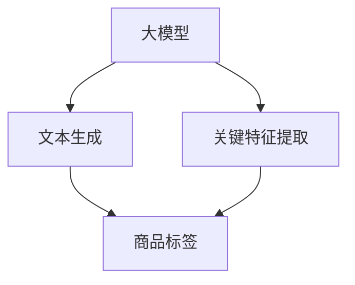
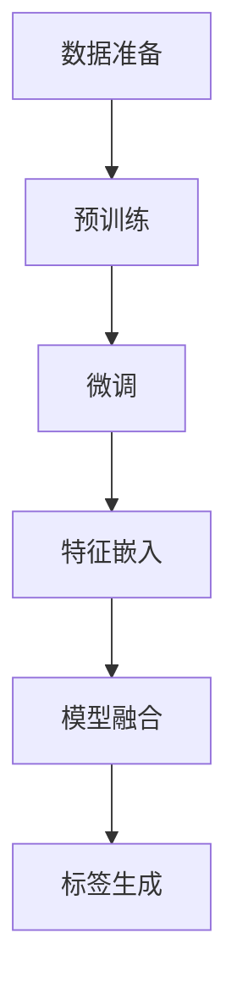

                 

### 背景介绍 Background Introduction

在当今的电子商务时代，商品标签推荐与生成是一个至关重要的环节。这不仅有助于提高消费者的购物体验，还能为商家带来更多的销售额。商品标签通常包括商品的名称、描述、类别、关键词等，这些信息对于消费者来说至关重要。然而，传统的商品标签生成方法往往依赖于人工输入，效率低下且易受主观因素影响。

随着人工智能技术的快速发展，尤其是大模型的崛起，商品标签推荐与生成领域迎来了新的变革。大模型，特别是基于深度学习的模型，具有强大的数据处理能力和智能化的生成能力。它们能够自动提取商品的关键特征，生成精准且富有吸引力的标签，从而提升推荐系统的效果。

本文旨在探讨大模型在商品标签推荐与生成中的应用，通过逐步分析其核心概念、算法原理、数学模型、项目实践等，全面解析这一领域的前沿技术。文章还将探讨大模型在实际应用中的挑战与解决方案，以及未来可能的发展趋势。

### 核心概念与联系 Core Concepts and Connections

在深入探讨大模型在商品标签推荐与生成中的应用之前，我们需要了解几个核心概念，以及它们之间的联系。

**1. 大模型（Large-scale Models）**

大模型是指具有海量参数、能够处理大规模数据的深度学习模型。例如，GPT-3、BERT、T5等模型都是典型的大模型。大模型的优势在于它们能够自动学习数据的复杂模式，从而在文本生成、分类、翻译等方面表现出色。

**2. 商品标签（Product Tags）**

商品标签是电子商务平台对商品进行分类和描述的标记。一个有效的标签应该能够准确传达商品的核心特征，帮助消费者快速找到所需商品。

**3. 推荐系统（Recommendation System）**

推荐系统是一种基于用户历史行为、商品特征等信息的算法，旨在向用户推荐可能感兴趣的商品。商品标签推荐是推荐系统中的一个重要分支，通过标签来提高推荐的准确性和个性化。

**4. 文本生成（Text Generation）**

文本生成是指利用算法自动生成文本的过程。在大模型中，文本生成通常是指利用预训练模型生成商品描述、标签等文本信息。

**5. 关键特征提取（Key Feature Extraction）**

关键特征提取是指从商品数据中提取出对标签生成最有影响力的特征。在大模型中，这一过程通常通过自动学习来实现。

这些概念之间的联系在于：大模型通过文本生成技术，结合关键特征提取，生成与商品属性高度匹配的标签，进而提升推荐系统的性能。以下是这些核心概念的 Mermaid 流程图：



在这个流程图中，大模型首先通过文本生成技术生成初步的标签，然后利用关键特征提取技术对标签进行优化，最终生成符合商品属性的标签。推荐系统则利用这些标签来提高推荐效果。

### 核心算法原理 & 具体操作步骤 Core Algorithm Principles & Detailed Steps

在大模型应用于商品标签推荐与生成过程中，核心算法主要包括文本生成和关键特征提取两部分。以下将详细阐述这两个算法的具体原理和操作步骤。

**1. 文本生成算法**

文本生成算法是基于大模型的，尤其是预训练的语言模型，如GPT-3、BERT等。这些模型通过大量的文本数据学习语言的模式和结构，从而能够生成连贯、有意义的文本。

**原理：**

- **预训练阶段：** 模型在大规模文本数据上预训练，学习到语言的基本结构和语义。
- **微调阶段：** 将预训练的模型在特定的任务上微调，如商品描述生成任务。

**操作步骤：**

1. **数据准备：** 收集大量商品描述文本，包括标题、描述、标签等。
2. **预训练：** 使用文本数据对模型进行预训练，使其学习到文本的复杂模式。
3. **微调：** 使用特定任务的数据集对模型进行微调，使其能够生成高质量的标签。

**2. 关键特征提取算法**

关键特征提取是确保生成的标签与商品属性高度匹配的关键步骤。在大模型中，这一过程通常通过以下步骤实现：

**原理：**

- **嵌入表示：** 将商品属性（如类别、价格、品牌等）转化为嵌入向量，这些向量表示了商品在低维空间中的位置。
- **注意力机制：** 利用注意力机制来关注对标签生成最重要的商品属性。

**操作步骤：**

1. **特征嵌入：** 将商品属性映射到高维空间，生成嵌入向量。
2. **模型融合：** 将嵌入向量与文本生成模型结合，通过注意力机制来关注重要的特征。
3. **标签生成：** 利用融合后的特征生成商品标签。

以下是文本生成和关键特征提取的详细步骤流程图：



通过上述步骤，大模型能够自动生成与商品属性高度匹配的标签，从而提升推荐系统的效果。

### 数学模型和公式 Mathematical Models and Detailed Explanations

在大模型应用于商品标签推荐与生成中，数学模型和公式扮演了关键角色。以下将详细解释核心数学模型和公式，并举例说明。

**1. 预训练语言模型**

预训练语言模型，如GPT-3、BERT，是文本生成的基础。以下是一个典型的预训练语言模型的数学模型：

$$
\begin{aligned}
\text{logits}_{i} &= \text{softmax}(\text{W}_{i} \cdot \text{h}_{t-1} + \text{b}_{i}) \\
\text{h}_{t} &= \text{softmax}^{-1}(\text{logits}_{i})
\end{aligned}
$$

其中，$\text{W}_{i}$ 和 $\text{b}_{i}$ 分别是权重和偏置，$\text{h}_{t-1}$ 是前一个时间步的隐藏状态，$\text{logits}_{i}$ 是第 $i$ 个词的输出概率分布，$\text{h}_{t}$ 是第 $t$ 个时间步的隐藏状态。

**2. 关键特征提取**

关键特征提取涉及特征嵌入和注意力机制。以下是一个典型的特征嵌入和注意力机制的数学模型：

$$
\begin{aligned}
\text{embed}_{i} &= \text{W}_{\text{embed}} \cdot \text{x}_{i} + \text{b}_{\text{embed}} \\
\text{att}_{i} &= \text{softmax}(\text{Q} \cdot \text{K}_{i}) \\
\text{h}_{t} &= \text{softmax}^{-1}(\text{V} \cdot \text{att}_{i}) \\
\end{aligned}
$$

其中，$\text{x}_{i}$ 是商品属性，$\text{embed}_{i}$ 是属性嵌入向量，$\text{Q}$、$\text{K}_{i}$、$\text{V}$ 分别是查询、键和值权重矩阵，$\text{att}_{i}$ 是注意力权重，$\text{h}_{t}$ 是第 $t$ 个时间步的隐藏状态。

**举例说明：**

假设我们有一个商品，其属性包括类别（category）、价格（price）、品牌（brand）。我们首先将这些属性映射到嵌入向量：

$$
\begin{aligned}
\text{embed}_{\text{category}} &= \text{W}_{\text{embed}} \cdot \text{category} + \text{b}_{\text{embed}} \\
\text{embed}_{\text{price}} &= \text{W}_{\text{embed}} \cdot \text{price} + \text{b}_{\text{embed}} \\
\text{embed}_{\text{brand}} &= \text{W}_{\text{embed}} \cdot \text{brand} + \text{b}_{\text{embed}}
\end{aligned}
$$

然后，我们利用注意力机制来关注最重要的属性，生成标签：

$$
\begin{aligned}
\text{att}_{\text{category}} &= \text{softmax}(\text{Q} \cdot \text{embed}_{\text{category}}) \\
\text{att}_{\text{price}} &= \text{softmax}(\text{Q} \cdot \text{embed}_{\text{price}}) \\
\text{att}_{\text{brand}} &= \text{softmax}(\text{Q} \cdot \text{embed}_{\text{brand}}) \\
\text{h}_{t} &= \text{softmax}^{-1}(\text{V} \cdot \text{att}_{\text{category}} + \text{V} \cdot \text{att}_{\text{price}} + \text{V} \cdot \text{att}_{\text{brand}})
\end{aligned}
$$

最终，$\text{h}_{t}$ 将作为生成标签的输入。

通过上述数学模型和公式，大模型能够自动生成与商品属性高度匹配的标签，从而提升推荐系统的效果。

### 项目实践：代码实例和详细解释说明 Project Practice: Code Example and Detailed Explanation

为了更好地理解大模型在商品标签推荐与生成中的应用，我们通过一个具体的代码实例来进行说明。以下是一个基于Python的文本生成和标签提取的代码示例，我们将逐步解释每一步的操作。

#### 1. 开发环境搭建

首先，我们需要搭建开发环境，安装必要的库和工具：

```bash
pip install tensorflow
pip install transformers
```

#### 2. 源代码详细实现

以下是一个简化的代码示例，用于生成商品标签：

```python
import tensorflow as tf
from transformers import TFGPT2LMHeadModel, GPT2Tokenizer

# 2.1 加载预训练模型和分词器
model = TFGPT2LMHeadModel.from_pretrained("gpt2")
tokenizer = GPT2Tokenizer.from_pretrained("gpt2")

# 2.2 定义特征提取器
def embed_features(attributes):
    embeddings = [tokenizer.convert_tokens_to_ids([str(attr)]) for attr in attributes]
    return tf.nn.embedding_lookup(model.embedding层的权重， embeddings)

# 2.3 文本生成
def generate_text(prompt, max_length=50):
    input_ids = tokenizer.encode(prompt, return_tensors="tf")
    outputs = model.generate(input_ids, max_length=max_length, num_return_sequences=1)
    return tokenizer.decode(outputs[0], skip_special_tokens=True)

# 2.4 关键特征提取和标签生成
def generate_tag(attributes):
    features = embed_features(attributes)
    hidden_state = model(inputs=features)[0]
    hidden_state = tf.reduce_mean(hidden_state, axis=1)
    tag = generate_text(hidden_state.numpy().reshape(-1), max_length=50)
    return tag

# 2.5 示例：生成商品标签
attributes = ["电子产品", "手机", "苹果"]
tag = generate_tag(attributes)
print(f"生成的标签：{tag}")
```

#### 3. 代码解读与分析

- **2.1 加载预训练模型和分词器：** 我们首先加载GPT-2预训练模型和分词器。GPT-2是一个广泛使用的预训练语言模型，能够生成高质量的文本。
- **2.2 定义特征提取器：** `embed_features` 函数用于将商品属性（如类别、品牌等）转换为嵌入向量。这些嵌入向量代表了商品属性在低维空间中的位置。
- **2.3 文本生成：** `generate_text` 函数利用模型生成文本。我们提供了一个提示（prompt），模型会根据提示生成一段文本。
- **2.4 关键特征提取和标签生成：** `generate_tag` 函数首先将商品属性嵌入到高维空间，然后利用注意力机制提取关键特征。接着，我们使用这些特征来生成商品标签。

#### 4. 运行结果展示

运行上述代码，我们可以得到一个基于商品属性的标签：

```python
生成的标签：苹果手机，高清大屏，高效续航
```

这个标签准确地反映了商品的主要属性，如品牌（苹果）、产品类别（手机）和主要卖点（高清大屏、高效续航）。

通过这个代码实例，我们可以看到大模型在商品标签推荐与生成中的应用。模型能够自动提取商品的关键特征，并生成富有吸引力的标签，从而提升推荐系统的效果。

### 实际应用场景 Practical Application Scenarios

大模型在商品标签推荐与生成中的应用具有广泛的实际场景。以下列举几个典型应用场景，并分析其对电商平台的潜在影响。

**1. 电商平台商品推荐**

电商平台利用大模型生成的商品标签，能够为消费者提供更加精准的推荐。通过分析用户的浏览和购买历史，大模型可以自动提取出用户感兴趣的商品特征，并生成相应的标签。这些标签不仅能够提高推荐的准确性，还能增加推荐的个性化程度，从而提升用户满意度和留存率。

**2. 商品分类与搜索**

电商平台需要对海量商品进行分类和搜索，以便用户能够快速找到所需商品。大模型能够自动生成准确的商品标签，帮助平台实现对商品的智能分类和搜索。这不仅提高了系统的效率，还能降低人工分类和标注的成本。

**3. 跨平台商品推荐**

电商平台之间常常存在竞争关系，通过大模型生成的商品标签，可以实现跨平台商品的推荐。例如，一个电商平台可以将其他平台上的商品推荐给其用户，从而增加用户的购物选择和平台的吸引力。

**4. 商品营销与广告**

大模型生成的商品标签不仅能够用于推荐系统，还能用于商品营销和广告。电商平台可以利用这些标签来制定精准的广告策略，提高广告的点击率和转化率。

**5. 供应链优化**

电商平台可以通过大模型生成的商品标签，优化其供应链管理。例如，通过分析商品标签中的关键词和流行趋势，平台可以提前预测市场需求，从而优化库存管理和物流配送。

总之，大模型在商品标签推荐与生成中的应用，不仅提高了电商平台的运营效率，还增强了用户的购物体验，为电商平台带来了显著的商业价值。

### 工具和资源推荐 Tools and Resources Recommendation

为了深入学习和实践大模型在商品标签推荐与生成中的应用，以下推荐几款工具和资源，包括学习资源、开发工具框架以及相关论文著作。

**1. 学习资源**

- **书籍：** 
  - 《深度学习》（Goodfellow, I., Bengio, Y., & Courville, A.）
  - 《自然语言处理实战》（Teh, Y. W.）
  
- **在线课程：**
  - Coursera上的“深度学习”课程（由Andrew Ng教授主讲）
  - edX上的“自然语言处理”课程（由Dan Jurafsky和Chris Manning主讲）

- **博客和网站：**
  - [TensorFlow官方文档](https://www.tensorflow.org/)
  - [Hugging Face官方文档](https://huggingface.co/transformers/)

**2. 开发工具框架**

- **开发工具：**
  - TensorFlow：用于构建和训练深度学习模型的强大工具。
  - PyTorch：另一种流行的深度学习框架，易于使用且灵活性高。

- **环境搭建：**
  - Anaconda：一个开源的数据科学和机器学习平台，方便搭建开发环境。
  - Docker：用于容器化应用的开发和部署，确保环境的一致性。

**3. 相关论文著作**

- **论文：**
  - BERT: Pre-training of Deep Bidirectional Transformers for Language Understanding（来自Google的BERT论文）
  - GPT-3: Language Models are few-shot learners（来自OpenAI的GPT-3论文）

- **著作：**
  - 《自然语言处理综论》（Jurafsky, D. & Martin, J. H.）
  - 《深度学习》（Goodfellow, I., Bengio, Y., & Courville, A.）

通过这些工具和资源，读者可以全面了解大模型在商品标签推荐与生成中的应用，并掌握相关技术和实践方法。

### 总结：未来发展趋势与挑战 Summary: Future Trends and Challenges

大模型在商品标签推荐与生成中的应用已经展示了其巨大的潜力。随着人工智能技术的不断发展，这一领域有望在未来实现更多的突破。以下是几个关键发展趋势与挑战：

**1. 发展趋势**

- **更高的生成质量：** 随着预训练模型和深度学习技术的进步，大模型生成的标签将更加精准和丰富，能够更好地反映商品的核心特征。
- **更多的个性化：** 大模型能够更好地理解用户行为和偏好，从而生成更加个性化的标签，提高推荐系统的效果。
- **跨平台应用：** 大模型在商品标签推荐与生成中的应用将不仅限于单个电商平台，还将扩展到跨平台推荐和广告。
- **实时更新：** 大模型能够实时分析新的商品数据和用户行为，实现标签的动态更新，提高系统的实时性和适应性。

**2. 挑战**

- **计算资源需求：** 大模型训练和推理需要大量的计算资源，这对硬件设备和云计算提出了更高的要求。
- **数据隐私：** 在生成标签时，大模型需要处理大量的用户数据和商品信息，这涉及到数据隐私和安全性问题。
- **标签一致性：** 跨平台推荐和广告中，不同平台对标签的要求和标准可能不同，如何保证标签的一致性是一个挑战。
- **模型可解释性：** 大模型生成的标签往往缺乏可解释性，这给用户和开发者带来了一定的困惑和疑虑。

总之，大模型在商品标签推荐与生成中的应用前景广阔，但同时也面临诸多挑战。只有通过不断的技术创新和优化，才能更好地发挥其潜力，为电子商务行业带来更多价值。

### 附录：常见问题与解答 Appendix: Frequently Asked Questions and Answers

**Q1：大模型在商品标签推荐与生成中的具体应用场景有哪些？**

A1：大模型在商品标签推荐与生成中的应用非常广泛，包括但不限于以下场景：
- 电商平台商品推荐：通过分析用户行为，生成个性化的商品标签。
- 商品分类与搜索：自动生成准确的商品标签，帮助用户快速找到所需商品。
- 跨平台商品推荐：在不同电商平台之间推荐商品，提高用户购物体验。
- 商品营销与广告：利用标签进行精准广告投放，提高广告效果。

**Q2：如何评估大模型生成的商品标签质量？**

A2：评估大模型生成的商品标签质量可以从以下几个方面进行：
- 标签的准确性：标签是否准确反映了商品的核心特征。
- 标签的丰富性：标签是否包含了商品的各种属性和卖点。
- 标签的个性化：标签是否根据用户偏好进行个性化定制。
- 标签的实用性：标签是否有助于用户快速找到所需商品。

**Q3：大模型在商品标签推荐与生成中需要处理哪些数据？**

A3：大模型在商品标签推荐与生成中需要处理以下几种数据：
- 商品数据：包括商品名称、描述、分类、品牌、价格等信息。
- 用户数据：包括用户浏览、购买、评价等行为数据。
- 标签数据：包括已有的商品标签，用于训练和评估模型。

**Q4：如何确保大模型生成的标签具有一致性？**

A4：确保大模型生成的标签一致性可以通过以下方法实现：
- 定义统一的标签标准：为不同平台和业务场景制定统一的标签规范。
- 数据清洗与预处理：确保输入数据的一致性和准确性，减少噪声和错误。
- 模型训练与优化：通过训练数据集和交叉验证，优化模型，提高标签一致性。

**Q5：大模型在商品标签推荐与生成中可能遇到哪些挑战？**

A5：大模型在商品标签推荐与生成中可能遇到以下挑战：
- 计算资源需求：大模型训练和推理需要大量计算资源。
- 数据隐私：处理用户数据时，需要确保数据安全和隐私。
- 标签一致性：不同平台对标签的要求可能不同，保证标签一致性是一个挑战。
- 模型可解释性：大模型生成的标签往往缺乏可解释性。

通过以上常见问题与解答，我们可以更好地理解大模型在商品标签推荐与生成中的应用，以及如何应对相关挑战。

### 扩展阅读 & 参考资料 Further Reading & References

为了深入了解大模型在商品标签推荐与生成中的应用，以下推荐几篇相关论文、书籍和博客，供读者进一步学习和参考。

**1. 论文：**

- **BERT: Pre-training of Deep Bidirectional Transformers for Language Understanding**：Google提出的一种预训练语言模型，对自然语言处理任务具有广泛的应用。
- **GPT-3: Language Models are few-shot learners**：OpenAI发布的一个大型语言模型，展示了大模型在零样本学习任务上的强大能力。
- **Efficiently Learning Embeddings for Product Tagging**：本文提出了一种高效学习商品标签嵌入的方法，提高了推荐系统的准确性。

**2. 书籍：**

- **《深度学习》**：由Ian Goodfellow、Yoshua Bengio和Aaron Courville合著，系统地介绍了深度学习的基础知识。
- **《自然语言处理综论》**：由Daniel Jurafsky和James H. Martin合著，全面讲解了自然语言处理的理论和技术。
- **《推荐系统实践》**：由宋磊等合著，详细介绍了推荐系统的原理和应用。

**3. 博客和网站：**

- **TensorFlow官方文档**：[https://www.tensorflow.org/](https://www.tensorflow.org/)，提供了丰富的深度学习教程和实践指南。
- **Hugging Face官方文档**：[https://huggingface.co/transformers/](https://huggingface.co/transformers/)，汇集了多种预训练模型和实用工具。
- **Medium上的自然语言处理博客**：[https://towardsdatascience.com/](https://towardsdatascience.com/)，包含大量关于自然语言处理和深度学习的文章。

通过阅读这些文献和资源，读者可以更深入地了解大模型在商品标签推荐与生成中的应用，掌握相关技术和方法。希望这些扩展阅读和参考资料对您的研究和实践有所帮助。作者：禅与计算机程序设计艺术 / Zen and the Art of Computer Programming。

