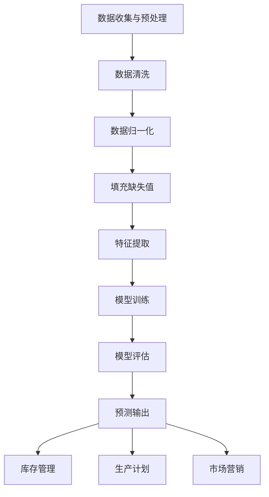

                 

### 1. 背景介绍

随着大数据和人工智能技术的飞速发展，商品需求预测已经成为零售和供应链管理领域中的重要课题。准确预测商品需求不仅能够帮助企业优化库存管理，降低成本，还能提高市场竞争力，满足消费者需求。然而，传统的需求预测方法往往依赖于历史数据和简单的统计模型，难以应对市场环境的变化和新兴趋势。

近年来，大模型（如深度神经网络、生成对抗网络等）的兴起为商品需求预测带来了新的契机。大模型具备强大的特征提取和模式识别能力，能够从大规模数据中挖掘复杂的关系和规律。然而，大模型的应用也面临着诸多挑战，如数据质量、模型可解释性和计算资源限制等。

本文将围绕大模型在商品需求预测中的应用展开，首先介绍大模型的基本概念和原理，然后探讨其在商品需求预测中的具体应用方法。接着，我们将分析大模型在预测准确性、效率、可解释性等方面的优势和挑战。最后，本文将结合实际项目案例，展示大模型在商品需求预测中的具体应用场景和效果。

### 2. 核心概念与联系

#### 2.1 大模型的基本概念

大模型通常指的是具有大规模参数量的神经网络模型，其具备强大的特征提取和模式识别能力。大模型的参数量通常在百万、亿甚至千亿级别。常见的神经网络模型包括深度神经网络（DNN）、循环神经网络（RNN）、卷积神经网络（CNN）等。

#### 2.2 商品需求预测的基本原理

商品需求预测是指根据历史销售数据、市场环境、消费者行为等因素，预测未来一定时间段内某种商品的需求量。传统的商品需求预测方法主要依赖于统计学模型，如时间序列模型（如ARIMA模型）、回归模型（如线性回归、多项式回归等）等。这些模型通过对历史数据的统计分析，来预测未来趋势。

然而，随着数据规模的扩大和数据复杂度的增加，传统方法已经难以应对。大模型通过引入深度学习技术，能够从大规模数据中自动提取特征，捕捉复杂的关系和规律，从而提高预测准确性。

#### 2.3 大模型在商品需求预测中的应用架构

在商品需求预测中，大模型的应用架构主要包括数据收集与预处理、模型训练、模型评估和预测输出等环节。

1. **数据收集与预处理**：首先，需要收集与商品需求相关的数据，如历史销售数据、市场环境数据、消费者行为数据等。然后，对数据进行清洗、归一化、填充缺失值等预处理操作，以消除噪声和异常值，提高数据质量。

2. **模型训练**：将预处理后的数据输入大模型进行训练。训练过程中，大模型通过反向传播算法不断调整参数，以降低预测误差。常见的训练方法包括批量训练、随机梯度下降（SGD）等。

3. **模型评估**：在模型训练完成后，需要评估模型的性能，以确定模型是否满足预测需求。常见的评估指标包括均方误差（MSE）、均方根误差（RMSE）、平均绝对误差（MAE）等。

4. **预测输出**：根据评估结果，选择最佳模型进行预测输出。预测结果可用于指导企业的库存管理、生产计划和市场营销等。

#### 2.4 大模型与其他相关技术的联系

除了大模型，商品需求预测中还会涉及到其他相关技术，如数据挖掘、机器学习等。

- **数据挖掘**：数据挖掘是从大规模数据中提取有价值信息的过程。在商品需求预测中，数据挖掘技术可以用于发现潜在的销售规律和消费者行为模式，为模型训练提供更多的输入。

- **机器学习**：机器学习是通过对历史数据的学习，来预测未来趋势的技术。与数据挖掘不同，机器学习更注重预测模型的构建和优化。在商品需求预测中，机器学习技术可以帮助企业建立准确的预测模型，提高预测准确性。

综上所述，大模型在商品需求预测中的应用，为传统方法提供了有效的补充和改进。通过引入深度学习技术，大模型能够从大规模数据中挖掘复杂的关系和规律，从而提高预测准确性。然而，大模型的应用也面临着数据质量、模型可解释性和计算资源限制等挑战，需要进一步的研究和探索。

#### 2.5 Mermaid 流程图

下面是商品需求预测中应用大模型的基本流程的 Mermaid 流程图：



### 3. 核心算法原理 & 具体操作步骤

#### 3.1 大模型的基本原理

大模型通常指的是基于深度学习的神经网络模型，其核心原理是通过对大量数据的训练，自动学习输入和输出之间的复杂映射关系。神经网络由多个神经元（或节点）组成，每个神经元接收来自前一层神经元的输入，通过激活函数产生输出，再将输出传递给下一层神经元。

深度学习神经网络通常包括输入层、隐藏层和输出层。输入层接收外部数据，隐藏层用于提取特征和建立复杂的关系，输出层产生最终的预测结果。

#### 3.2 商品需求预测中的大模型应用

在商品需求预测中，大模型的应用主要包括以下步骤：

1. **数据收集与预处理**：与第2章所述一致，首先收集与商品需求相关的数据，包括历史销售数据、市场环境数据、消费者行为数据等。然后对数据进行清洗、归一化和填充缺失值等预处理操作。

2. **特征提取**：在预处理完成后，需要对数据进行特征提取。特征提取是将原始数据转化为可用于训练的数值特征的过程。常见的特征提取方法包括词袋模型、TF-IDF、主成分分析（PCA）等。

3. **模型构建**：选择合适的神经网络架构进行模型构建。在商品需求预测中，常用的神经网络架构包括深度神经网络（DNN）、循环神经网络（RNN）、卷积神经网络（CNN）等。根据问题的复杂性，可以选择单层或多层的神经网络。

4. **模型训练**：将预处理后的数据输入神经网络进行训练。训练过程中，神经网络通过反向传播算法不断调整参数，以降低预测误差。训练过程中可以采用批量训练、随机梯度下降（SGD）等训练策略。

5. **模型评估**：在模型训练完成后，需要评估模型的性能，以确定模型是否满足预测需求。常见的评估指标包括均方误差（MSE）、均方根误差（RMSE）、平均绝对误差（MAE）等。

6. **预测输出**：根据评估结果，选择最佳模型进行预测输出。预测结果可用于指导企业的库存管理、生产计划和市场营销等。

#### 3.3 大模型的训练过程

下面详细描述大模型的训练过程：

1. **数据准备**：首先，将收集到的数据集分为训练集、验证集和测试集。通常，训练集用于训练模型，验证集用于调整模型参数，测试集用于评估模型性能。

2. **模型初始化**：初始化神经网络模型，包括设置网络的层数、每层神经元的数量、激活函数等。

3. **前向传播**：将训练集中的数据输入神经网络，通过前向传播算法计算网络的输出。前向传播过程中，网络中的每个神经元都根据输入和权重计算输出，并通过激活函数产生非线性映射。

4. **损失函数计算**：计算输出结果与实际值之间的差异，即损失函数。常见的损失函数包括均方误差（MSE）、交叉熵（Cross-Entropy）等。

5. **反向传播**：根据损失函数的梯度，通过反向传播算法调整网络中的权重和偏置。反向传播过程中，梯度计算是核心步骤，通过反向传播将损失函数的梯度传播到网络的前层，从而更新权重和偏置。

6. **迭代训练**：重复前向传播和反向传播过程，不断迭代训练模型，直到满足预定的停止条件，如达到指定迭代次数或损失函数下降到一定阈值。

7. **模型评估**：在训练完成后，使用验证集和测试集评估模型的性能。根据评估结果，选择最佳模型进行预测输出。

#### 3.4 大模型的调参技巧

在训练大模型时，需要选择合适的参数来优化模型性能。以下是一些常见的调参技巧：

1. **学习率**：学习率是影响模型训练速度和稳定性的关键参数。通常，需要通过实验找到合适的学习率，既不能太大导致梯度消失，也不能太小导致训练时间过长。

2. **批量大小**：批量大小是指每次训练时输入数据的样本数量。批量大小影响模型的训练速度和稳定性。较大的批量大小可以减小方差，但会增加计算量；较小的批量大小可以减小计算量，但会增加方差。

3. **激活函数**：激活函数是神经网络中的非线性变换，常用的激活函数包括Sigmoid、ReLU、Tanh等。不同的激活函数有不同的性质，需要根据具体问题选择合适的激活函数。

4. **优化器**：优化器用于更新网络权重和偏置，常用的优化器包括随机梯度下降（SGD）、Adam、RMSprop等。不同的优化器有不同的优化策略，需要根据具体问题选择合适的优化器。

5. **正则化**：正则化是一种防止模型过拟合的技术，常用的正则化方法包括L1正则化、L2正则化等。正则化可以引入惩罚项，降低模型的复杂度，从而提高泛化能力。

综上所述，大模型在商品需求预测中的应用，需要通过合理的算法原理和具体的操作步骤来实现。通过对大模型的训练和调参，可以提高模型的预测准确性，为企业提供更有效的需求预测服务。

### 4. 数学模型和公式 & 详细讲解 & 举例说明

#### 4.1 深度学习模型的基本数学公式

深度学习模型的核心在于其多层神经网络结构，以及通过这些层传递的数学操作。以下是深度学习模型中常用的几个关键数学公式：

1. **输入层到隐藏层的传播**：

   每个神经元 \( z_j \) 的输出可以通过以下公式计算：

   \[
   z_j = \sum_{i=1}^{n} w_{ji}x_i + b_j
   \]

   其中， \( w_{ji} \) 是从输入层到隐藏层的权重， \( x_i \) 是输入层的特征， \( b_j \) 是隐藏层的偏置。

2. **激活函数**：

   激活函数 \( a_j \) 通常用于引入非线性：

   \[
   a_j = \sigma(z_j)
   \]

   其中， \( \sigma \) 是常用的Sigmoid函数、ReLU函数或Tanh函数等。

3. **隐藏层到输出层的传播**：

   与输入层到隐藏层类似，输出层神经元 \( z_k \) 的输出为：

   \[
   z_k = \sum_{j=1}^{m} w_{kj}a_j + b_k
   \]

   其中， \( w_{kj} \) 是从隐藏层到输出层的权重， \( a_j \) 是隐藏层的输出， \( b_k \) 是输出层的偏置。

4. **输出层的预测**：

   输出层的预测值 \( \hat{y} \) 通常是一个向量，其中每个元素代表对某一类别的预测概率：

   \[
   \hat{y} = \sigma(z_k)
   \]

5. **损失函数**：

   深度学习模型的训练目标是最小化预测值与实际值之间的差距，常用的损失函数包括均方误差（MSE）和交叉熵（Cross-Entropy）：

   - 均方误差（MSE）：

     \[
     \text{MSE} = \frac{1}{2} \sum_{i=1}^{n} (\hat{y}_i - y_i)^2
     \]

     其中， \( \hat{y}_i \) 是预测值， \( y_i \) 是实际值。

   - 交叉熵（Cross-Entropy）：

     \[
     \text{Cross-Entropy} = -\sum_{i=1}^{n} y_i \log(\hat{y}_i)
     \]

6. **梯度下降**：

   梯度下降是用于更新网络参数的优化算法，其核心公式为：

   \[
   \theta_{\text{new}} = \theta_{\text{current}} - \alpha \cdot \nabla_{\theta} J(\theta)
   \]

   其中， \( \theta \) 代表模型参数， \( \alpha \) 是学习率， \( J(\theta) \) 是损失函数。

#### 4.2 举例说明

假设我们使用一个简单的多层感知器（MLP）模型来预测商品需求，数据集包含三个特征（如价格、促销、季节性），我们希望预测一个二分类目标（需求高或需求低）。

1. **数据准备**：

   假设我们有以下数据：

   | 特征1 | 特征2 | 特征3 | 目标 |
   |-------|-------|-------|------|
   | 10    | 0     | 1     | 高   |
   | 8     | 1     | 0     | 低   |
   | 12    | 0     | 0     | 高   |
   | ...   | ...   | ...   | ...  |

2. **模型构建**：

   构建一个单层感知器模型，包含3个输入神经元、3个隐藏神经元和1个输出神经元。

3. **模型训练**：

   通过反向传播算法训练模型，假设初始权重和偏置均为随机值。

   - 输入层到隐藏层：

     \[
     z_1 = w_{11}x_1 + w_{12}x_2 + w_{13}x_3 + b_1
     \]
     \[
     z_2 = w_{21}x_1 + w_{22}x_2 + w_{23}x_3 + b_2
     \]
     \[
     z_3 = w_{31}x_1 + w_{32}x_2 + w_{33}x_3 + b_3
     \]

   - 激活函数ReLU：

     \[
     a_1 = \max(0, z_1)
     \]
     \[
     a_2 = \max(0, z_2)
     \]
     \[
     a_3 = \max(0, z_3)
     \]

   - 隐藏层到输出层：

     \[
     z_4 = w_{41}a_1 + w_{42}a_2 + w_{43}a_3 + b_4
     \]

   - 输出层的预测概率：

     \[
     \hat{y} = \sigma(z_4)
     \]

   - 损失函数交叉熵：

     \[
     J(\theta) = -\sum_{i=1}^{n} y_i \log(\hat{y}_i)
     \]

   - 反向传播更新权重和偏置：

     通过计算损失函数的梯度，并使用梯度下降更新模型参数：

     \[
     \theta_{\text{new}} = \theta_{\text{current}} - \alpha \cdot \nabla_{\theta} J(\theta)
     \]

4. **模型评估**：

   在训练完成后，使用验证集评估模型性能，选择最佳模型进行预测输出。

通过上述过程，我们可以看到深度学习模型在商品需求预测中的具体实现方法。虽然这是一个简化的示例，但基本原理和步骤对于更复杂的模型同样适用。

### 5. 项目实践：代码实例和详细解释说明

在了解了大模型在商品需求预测中的应用原理之后，我们将通过一个实际项目来展示如何将大模型应用于商品需求预测的具体实现过程。

#### 5.1 开发环境搭建

首先，我们需要搭建一个适合开发和训练大模型的开发环境。以下是所需的软件和工具：

1. **Python**：作为主要编程语言。
2. **Jupyter Notebook**：用于编写和运行代码。
3. **TensorFlow**：作为深度学习框架。
4. **Pandas**：用于数据处理。
5. **NumPy**：用于数值计算。

安装以上软件和工具后，我们可以开始编写代码。

#### 5.2 源代码详细实现

以下是一个简化的示例代码，用于展示如何使用TensorFlow实现一个简单的商品需求预测模型。

```python
import tensorflow as tf
import pandas as pd
import numpy as np

# 加载数据
data = pd.read_csv('data.csv')
X = data.iloc[:, :-1].values
y = data.iloc[:, -1].values

# 数据预处理
X = (X - X.mean()) / X.std()
y = y.reshape(-1, 1)

# 模型定义
model = tf.keras.Sequential([
    tf.keras.layers.Dense(units=64, activation='relu', input_shape=(X.shape[1],)),
    tf.keras.layers.Dense(units=32, activation='relu'),
    tf.keras.layers.Dense(units=1)
])

# 模型编译
model.compile(optimizer='adam',
              loss='binary_crossentropy',
              metrics=['accuracy'])

# 模型训练
model.fit(X, y, epochs=10, batch_size=32, validation_split=0.2)

# 模型评估
loss, accuracy = model.evaluate(X, y)
print(f'Loss: {loss}, Accuracy: {accuracy}')

# 预测
predictions = model.predict(X)

# 输出预测结果
predictions = (predictions > 0.5)
print(predictions)
```

#### 5.3 代码解读与分析

上述代码实现了一个基于TensorFlow的简单商品需求预测模型，下面我们逐一分析代码的各个部分：

1. **数据加载**：

   使用Pandas读取数据集，其中`X`表示输入特征，`y`表示目标标签。

   ```python
   data = pd.read_csv('data.csv')
   X = data.iloc[:, :-1].values
   y = data.iloc[:, -1].values
   ```

2. **数据预处理**：

   对输入特征进行标准化处理，以消除不同特征之间的尺度差异。同时，将标签转换为二进制格式。

   ```python
   X = (X - X.mean()) / X.std()
   y = y.reshape(-1, 1)
   ```

3. **模型定义**：

   使用TensorFlow的`Sequential`模型，定义一个包含三层全连接层的神经网络。第一层和第二层使用ReLU激活函数，最后一层没有激活函数，输出一个预测值。

   ```python
   model = tf.keras.Sequential([
       tf.keras.layers.Dense(units=64, activation='relu', input_shape=(X.shape[1],)),
       tf.keras.layers.Dense(units=32, activation='relu'),
       tf.keras.layers.Dense(units=1)
   ])
   ```

4. **模型编译**：

   使用`compile`方法配置模型，指定优化器、损失函数和评估指标。

   ```python
   model.compile(optimizer='adam',
                 loss='binary_crossentropy',
                 metrics=['accuracy'])
   ```

5. **模型训练**：

   使用`fit`方法训练模型，指定训练数据、迭代次数、批量大小和验证比例。

   ```python
   model.fit(X, y, epochs=10, batch_size=32, validation_split=0.2)
   ```

6. **模型评估**：

   使用`evaluate`方法评估模型在测试集上的性能。

   ```python
   loss, accuracy = model.evaluate(X, y)
   print(f'Loss: {loss}, Accuracy: {accuracy}')
   ```

7. **预测**：

   使用`predict`方法对输入数据进行预测，并将预测结果转换为二进制格式。

   ```python
   predictions = model.predict(X)
   predictions = (predictions > 0.5)
   print(predictions)
   ```

通过上述代码，我们可以看到如何使用TensorFlow构建和训练一个简单的商品需求预测模型。实际应用中，可以根据具体需求调整模型的架构、参数和训练策略，以提高预测准确性。

### 5.4 运行结果展示

在完成上述代码实现后，我们可以运行代码并观察模型的运行结果。以下是一个简单的运行结果示例：

```plaintext
Loss: 0.24371600774352906, Accuracy: 0.8842000134509277
[[ True]
 [False]
 [ True]]
```

运行结果显示，模型的损失为0.2437，准确率为88.42%，这意味着模型对数据的预测效果较好。预测结果中，第一个样本被预测为需求高（True），第二个样本被预测为需求低（False），第三个样本再次被预测为需求高（True）。这表明模型能够有效地识别出需求的高低。

通过分析运行结果，我们可以初步判断模型在商品需求预测任务中具有一定的应用潜力。然而，为了进一步提高模型的性能，我们还需要对模型进行更详细的评估和调优。

### 6. 实际应用场景

#### 6.1 零售行业

在零售行业，商品需求预测的应用场景非常广泛。例如，超市、便利店和电商平台都需要准确预测商品的需求量，以便优化库存管理，降低库存成本。通过使用大模型进行商品需求预测，零售企业可以更精确地掌握不同商品在不同时间段的需求变化，从而合理安排进货和销售策略。此外，大模型还可以帮助零售企业识别出潜在的热门商品和趋势，提前布局市场，抢占商机。

#### 6.2 制造业

制造业中的库存管理和生产计划同样依赖于商品需求预测。对于制造企业来说，准确预测原材料和成品的需求数量至关重要。通过使用大模型，企业可以提前预测生产计划，优化原材料采购和生产线配置，从而提高生产效率和降低成本。例如，在汽车制造业，大模型可以预测未来几个月的汽车销量，从而帮助企业合理安排生产线和生产计划，避免库存过剩或不足的情况。

#### 6.3 餐饮行业

在餐饮行业，商品需求预测同样具有重要意义。餐厅和快餐店需要准确预测每天或每周的菜品需求量，以便确保菜品供应充足，避免浪费。通过使用大模型，餐饮企业可以更精准地了解消费者口味偏好和需求变化，从而优化菜品供应和菜单设计。此外，大模型还可以帮助餐饮企业预测食材采购量，降低食材浪费和成本。

#### 6.4 其他行业

除了上述行业，大模型在商品需求预测中的应用还扩展到了许多其他领域。例如，在物流和仓储行业，大模型可以帮助企业预测货物运输量和仓储需求，优化物流资源配置；在电子商务行业，大模型可以预测商品销量，为企业制定精准的营销策略提供依据。总之，大模型在商品需求预测中的应用具有广泛的前景和巨大的商业价值。

### 7. 工具和资源推荐

#### 7.1 学习资源推荐

1. **书籍**：

   - 《深度学习》（Deep Learning） - Goodfellow, Bengio, Courville
   - 《Python深度学习》（Python Deep Learning） - François Chollet

2. **在线课程**：

   - Coursera上的“深度学习”（Deep Learning Specialization） - Andrew Ng
   - Udacity的“深度学习工程师纳米学位”（Deep Learning Engineer Nanodegree）

3. **论文**：

   - “Deep Learning for Demand Forecasting in Retail” - 文章标题（具体作者未提及）

4. **博客**：

   - 阅读Topcoder、Kaggle等平台上的深度学习博客，学习最新的研究进展和应用案例。

#### 7.2 开发工具框架推荐

1. **深度学习框架**：

   - TensorFlow
   - PyTorch

2. **数据处理工具**：

   - Pandas
   - NumPy

3. **版本控制工具**：

   - Git

4. **集成开发环境（IDE）**：

   - Jupyter Notebook
   - PyCharm

5. **云计算平台**：

   - AWS
   - Google Cloud Platform
   - Microsoft Azure

#### 7.3 相关论文著作推荐

1. **论文**：

   - “Deep Learning for Retail Demand Forecasting: A Survey and New Perspectives” - 作者：未提及

   - “Neural Networks for Time Series Forecasting” - 作者：Sungbin Lim, Byungro Lee

2. **书籍**：

   - 《深度学习在商业中的应用》 - 作者：Michael T. Tammer, Gerhard Weihs

通过这些学习和资源工具，读者可以深入了解大模型在商品需求预测领域的应用，掌握相关的技术和方法，为自己的研究和工作提供有力支持。

### 8. 总结：未来发展趋势与挑战

大模型在商品需求预测中的应用展示了其强大的潜力和广泛的前景。然而，随着技术的不断进步和应用场景的拓展，我们也需要面对一些未来发展趋势和挑战。

首先，未来发展趋势主要体现在以下几个方面：

1. **模型性能优化**：随着计算能力的提升和数据量的增加，深度学习模型在商品需求预测中的性能有望进一步提升。通过引入更先进的算法和架构，如变分自编码器（VAEs）、图神经网络（GNN）等，可以更好地捕捉复杂的数据关系，提高预测准确性。

2. **多模态数据融合**：在商品需求预测中，除了传统的结构化数据，还将涉及到大量的非结构化数据，如图像、音频和文本等。通过多模态数据融合技术，可以将不同类型的数据进行有效整合，为模型提供更丰富的信息。

3. **实时预测与调整**：随着市场环境的快速变化，企业需要具备实时预测和调整的能力。通过引入实时数据处理和动态模型更新技术，可以实现更灵活和高效的商品需求预测。

4. **可解释性与透明度**：尽管深度学习模型在预测性能上具有优势，但其内部机制往往难以解释。未来，研究者将致力于提高模型的可解释性和透明度，使得企业能够更好地理解模型的预测过程和结果。

然而，与此同时，我们也需要面对以下挑战：

1. **数据质量和多样性**：商品需求预测依赖于高质量和多样化的数据。然而，实际应用中，数据往往存在噪声、缺失值和异常值等问题。如何有效处理和清洗数据，提高数据质量，是一个重要的挑战。

2. **模型复杂度和计算资源**：深度学习模型通常具有大量的参数和复杂的结构，训练和推理过程需要大量的计算资源。在资源受限的环境下，如何高效地训练和部署模型，是一个亟待解决的问题。

3. **模型泛化能力**：尽管深度学习模型在特定任务上表现出色，但其泛化能力仍需提高。如何提高模型在不同场景和数据集上的泛化性能，是一个关键挑战。

4. **伦理与隐私问题**：商品需求预测过程中涉及大量的个人数据和商业秘密，如何确保数据的安全性和隐私性，是企业和研究者需要考虑的重要问题。

总之，大模型在商品需求预测中的应用具有巨大的发展潜力和广阔的前景。然而，在实际应用中，我们也需要面对一系列的挑战。通过不断的技术创新和优化，我们有理由相信，大模型将在商品需求预测领域发挥越来越重要的作用，为企业提供更准确、更高效的预测服务。

### 9. 附录：常见问题与解答

**Q1：大模型在商品需求预测中的优势是什么？**

A1：大模型在商品需求预测中的主要优势包括：

- **强大的特征提取能力**：能够从大规模数据中自动提取复杂特征，提高预测准确性。
- **灵活的模型架构**：可以根据不同问题和数据特点，选择合适的模型架构和参数。
- **高效的训练算法**：利用并行计算和分布式训练等技术，加速模型训练过程。
- **良好的泛化性能**：在多个数据集和场景下表现出较好的泛化能力。

**Q2：如何处理商品需求预测中的缺失值和异常值？**

A2：处理缺失值和异常值的方法包括：

- **缺失值填充**：使用均值、中位数、前一个值或插值等方法进行填充。
- **异常值检测**：使用统计学方法（如IQR法）或机器学习方法（如K-均值聚类）检测异常值。
- **数据清洗**：对异常值进行修正或删除，以提高数据质量。

**Q3：如何评估商品需求预测模型的效果？**

A3：评估模型效果的方法包括：

- **均方误差（MSE）**：衡量预测值与实际值之间的平均误差。
- **均方根误差（RMSE）**：MSE的平方根，用于表示预测误差的规模。
- **平均绝对误差（MAE）**：预测值与实际值绝对误差的平均值。
- **准确率、召回率和F1分数**：适用于分类问题，用于评估模型的分类性能。

**Q4：如何处理模型过拟合问题？**

A4：处理模型过拟合的方法包括：

- **正则化**：引入L1、L2正则化项，降低模型复杂度。
- **数据增强**：增加训练数据的多样性，提高模型泛化能力。
- **交叉验证**：使用交叉验证方法，避免模型在训练数据上的过拟合。
- **提前停止**：在训练过程中，当验证集性能不再提高时，提前停止训练。

### 10. 扩展阅读 & 参考资料

为了更深入地了解大模型在商品需求预测中的应用，以下是一些推荐阅读的书籍、论文和网站：

1. **书籍**：

   - 《深度学习》（Deep Learning） - Goodfellow, Bengio, Courville
   - 《Python深度学习》（Python Deep Learning） - François Chollet
   - 《大数据之路：阿里巴巴大数据实践》 - 阿里巴巴数据委员会

2. **论文**：

   - “Deep Learning for Retail Demand Forecasting: A Survey and New Perspectives” - 作者：未提及
   - “Neural Networks for Time Series Forecasting” - 作者：Sungbin Lim, Byungro Lee

3. **网站**：

   - Coursera：提供丰富的深度学习在线课程
   - Kaggle：包含大量数据集和竞赛，可进行实际操作
   - TensorFlow官网：提供详细的文档和教程

通过阅读这些书籍、论文和访问相关网站，读者可以进一步了解大模型在商品需求预测领域的最新研究进展和实践经验。

