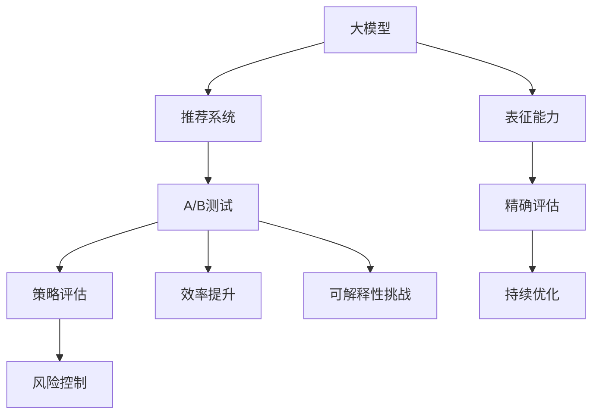

                 

### 背景介绍 Background

推荐系统作为现代互联网的重要组成部分，旨在为用户个性化推荐感兴趣的内容。随着互联网的迅猛发展和用户需求的多样化，推荐系统在电商、社交媒体、视频平台等各个领域得到广泛应用。然而，随着数据量的激增和用户行为的复杂性增加，如何在确保推荐效果的同时，有效评估不同推荐策略的效果，成为推荐系统研究和应用中的一个关键问题。

在推荐系统的开发过程中，A/B测试（也称为拆分测试）是一种常见的方法，通过将用户分为两组，一组使用旧策略，另一组使用新策略，比较两组用户的反馈和效果，以评估新策略的优劣。A/B测试的重要性体现在以下几个方面：

1. **策略评估**：通过A/B测试，可以直接比较新策略和旧策略在用户行为、用户满意度、业务指标等方面的差异，从而判断新策略是否有效。
2. **风险控制**：在上线新策略前，通过A/B测试可以在一定程度上降低策略失败的风险，避免直接上线后对业务造成负面影响。
3. **持续优化**：A/B测试为推荐系统的持续优化提供了数据支持，通过不断测试和迭代，可以提高推荐系统的整体效果。

然而，传统的A/B测试存在一些局限：

- **用户体验干扰**：对于部分用户，新策略可能会造成用户体验的负面影响，影响用户对平台的信任和满意度。
- **样本偏差**：A/B测试的样本可能存在偏差，影响测试结果的准确性和可靠性。
- **计算资源消耗**：在数据量庞大的情况下，传统的A/B测试需要大量的计算资源和时间。

为了解决这些问题，近年来，基于大模型（如Transformer、BERT等）的推荐系统逐渐成为研究的热点。大模型具有强大的表征能力和泛化能力，可以更好地处理复杂用户行为和大规模数据。同时，大模型在A/B测试中的应用，使得测试过程更加高效和精确。

本文将探讨大模型在推荐系统A/B测试中的应用，从背景、核心概念、算法原理、数学模型、实践案例等多个角度进行详细阐述，旨在为推荐系统的开发和优化提供新的思路和方法。

### 核心概念与联系 Core Concepts and Connections

要理解大模型在推荐系统A/B测试中的应用，我们首先需要明确几个核心概念和它们之间的关系。

#### 1. 大模型（Large Models）

大模型，通常指的是具有数十亿甚至数万亿参数的深度神经网络模型。这些模型通过大量的数据和复杂的网络结构，能够学习到非常复杂的模式和特征。典型的代表包括Transformer、BERT、GPT等。大模型的核心优势在于其强大的表征能力，这使得它们在处理自然语言处理、计算机视觉和推荐系统等任务中表现出色。

#### 2. 推荐系统（Recommendation Systems）

推荐系统是一种通过算法技术，根据用户的历史行为、兴趣偏好和上下文信息，向用户推荐其可能感兴趣的商品、内容或服务的系统。推荐系统的核心目标是在大量信息中，为用户提供个性化的、高质量的推荐。

#### 3. A/B测试（A/B Testing）

A/B测试是一种实验设计方法，通过将用户随机分配到不同的实验组，比较两组用户在某种策略下的表现，来评估策略的有效性。在推荐系统中，A/B测试通常用于比较不同推荐算法或推荐策略的性能。

#### 4. 大模型与A/B测试的联系

大模型与A/B测试之间的联系主要体现在以下几个方面：

- **表征能力**：大模型能够捕获用户行为和兴趣的复杂模式，为A/B测试提供了更精确的评估依据。
- **效率提升**：大模型通过端到端的模型架构，减少了传统A/B测试中需要手动设计特征和指标的过程，提高了测试效率。
- **可解释性**：大模型虽然具有强大的表征能力，但其内部工作机制较为复杂，如何解释其决策过程是一个挑战。

下面我们将使用Mermaid流程图来展示这些核心概念之间的关系：



#### Mermaid 流程图详解

1. **大模型（A）**：作为输入，通过学习用户行为和兴趣数据，生成推荐结果。
2. **推荐系统（B）**：利用大模型输出的推荐结果，为用户生成个性化推荐。
3. **A/B测试（C）**：将用户随机分配到不同的测试组，比较新策略和旧策略的表现。
4. **表征能力（D）**：大模型通过其强大的表征能力，精确捕捉用户行为和兴趣。
5. **策略评估（E）**：通过A/B测试，评估新策略与旧策略在业务指标上的差异。
6. **精确评估（F）**：基于大模型的表征能力，A/B测试能够实现更精确的策略评估。
7. **风险控制（G）**：通过A/B测试，可以提前发现潜在的风险，避免直接上线失败。
8. **持续优化（H）**：基于A/B测试的结果，不断迭代优化推荐系统，提高整体性能。
9. **效率提升（I）**：大模型的端到端架构，减少了传统A/B测试中的特征工程和时间成本。
10. **可解释性挑战（J）**：虽然大模型具备强大的表征能力，但其内部决策过程较为复杂，如何解释其决策成为一个挑战。

通过上述核心概念和流程图的解释，我们可以看到大模型在推荐系统A/B测试中的应用是如何实现高效、精准和持续优化的。

### 核心算法原理 & 具体操作步骤 Core Algorithm Principles and Step-by-Step Operations

在深入探讨大模型在推荐系统A/B测试中的应用之前，我们先来详细了解大模型在推荐系统中的基本原理，以及如何具体实施A/B测试。

#### 大模型在推荐系统中的基本原理

1. **数据预处理**：首先，对用户行为数据进行清洗、去噪和特征工程，提取出对推荐有重要影响的特征。这些特征包括用户历史点击记录、浏览时长、搜索历史等。
2. **模型训练**：利用预处理后的数据，通过反向传播算法和优化器（如Adam、RMSProp）对大模型进行训练。训练过程涉及大量计算资源和时间，但通过使用GPU或TPU等高性能计算设备，可以显著提高训练效率。
3. **模型评估**：在训练过程中，通过验证集和测试集对模型进行评估，选择表现最佳的网络结构、超参数组合和训练策略。
4. **推荐生成**：训练好的模型可以用于生成推荐结果。在推荐系统中，模型通常采用类似于“评分预测”或“物品推荐列表”的方式输出结果。评分预测模型会预测用户对某个物品的偏好程度，而物品推荐列表则直接推荐一系列可能的感兴趣物品。

#### A/B测试的具体操作步骤

1. **设计测试方案**：首先，定义测试的目标和假设，明确要评估的新策略与旧策略的区别。例如，可以设置不同的推荐算法、推荐结果展示方式或个性化推荐策略。
2. **样本划分**：将用户随机分为两组，一组使用旧策略（控制组），另一组使用新策略（实验组）。为了减少样本偏差，每组用户应该具有相似的兴趣偏好和行为模式。
3. **实施测试**：在实验组中，应用新的推荐策略，而在控制组中继续使用旧策略。通过记录两组用户的互动行为（如点击、购买、评论等），收集测试数据。
4. **数据收集与分析**：在测试期结束后，收集两组用户的行为数据，并使用统计方法（如t检验、方差分析等）进行数据分析，评估新策略与旧策略在关键指标（如点击率、转化率等）上的差异。
5. **结果解读**：根据数据分析结果，判断新策略是否有效。如果新策略显著优于旧策略，可以考虑将其推广到整个用户群体；如果效果不明显或存在风险，则需要进一步优化或放弃新策略。

#### 大模型与A/B测试的结合

将大模型与A/B测试结合，可以显著提升测试的精度和效率。具体方法如下：

1. **动态调整**：利用大模型对用户行为的实时监测和预测能力，动态调整测试策略。例如，在测试过程中，可以根据用户的实时反馈和行为模式，及时调整推荐策略，优化测试效果。
2. **特征优化**：通过大模型的学习能力，自动识别和提取对推荐有重要影响的特征，减少传统A/B测试中手动设计特征的工作量。这些自动提取的特征可以进一步提升测试的精确性。
3. **预测评估**：使用大模型生成的预测结果，代替传统A/B测试中的实际交互数据，进行虚拟测试。通过这种方式，可以快速评估不同策略的效果，节省实际测试所需的时间和资源。

### 实际案例

以下是一个实际案例，展示如何在大模型环境下进行A/B测试：

**案例背景**：某电商平台的推荐系统希望通过A/B测试，评估一种新的推荐算法对提升用户购买率的效果。

**操作步骤**：

1. **数据预处理**：对用户历史购买数据、浏览记录和搜索日志进行预处理，提取特征，如用户ID、购买商品类别、浏览时间等。
2. **模型训练**：利用预处理后的数据，训练一个基于Transformer的大模型，用于生成推荐结果。训练过程中，使用Adam优化器，学习率为0.001，训练迭代次数为100次。
3. **设计测试方案**：将用户随机分为实验组和控制组，每组各占一半。实验组使用新的推荐算法，控制组继续使用旧算法。
4. **实施测试**：在实验组中，应用新的推荐算法，记录用户的购买行为；在控制组中，使用旧算法，同样记录用户行为。
5. **数据收集与分析**：在测试期结束后，收集两组用户的行为数据，使用t检验方法，比较两组用户的购买率差异。
6. **结果解读**：分析结果表明，新算法显著提高了用户的购买率，决策者决定将新算法推广到整个用户群体。

通过上述案例，我们可以看到大模型在A/B测试中的应用如何实现更高效、精准的策略评估和优化。

### 数学模型和公式 & 详细讲解 & 举例说明

在深入探讨大模型在推荐系统A/B测试中的应用时，我们需要借助数学模型和公式来理解其工作原理。以下将详细讲解相关数学模型，并通过具体例子进行说明。

#### 1. 推荐模型

推荐模型通常采用基于矩阵分解的方法，如协同过滤（Collaborative Filtering）和基于内容的推荐（Content-based Recommendation）。以下是推荐模型的通用公式：

$$
R_{ui} = \hat{R}_{ui} = \text{sim}(q_u, p_i) + b_u + b_i + \epsilon_{ui}
$$

其中，$R_{ui}$表示用户$u$对物品$i$的评分，$\hat{R}_{ui}$表示预测评分，$\text{sim}(q_u, p_i)$表示用户$u$和物品$i$之间的相似度，$b_u$和$b_i$分别表示用户$u$和物品$i$的偏置项，$\epsilon_{ui}$表示误差项。

#### 2. 相似度计算

在推荐模型中，相似度计算是关键步骤。常见的相似度计算方法包括余弦相似度（Cosine Similarity）和皮尔逊相关系数（Pearson Correlation Coefficient）。

- **余弦相似度**：

$$
\text{similarity}(q_u, p_i) = \frac{q_u \cdot p_i}{\|q_u\| \|p_i\|}
$$

其中，$q_u$和$p_i$分别表示用户$u$和物品$i$的特征向量，$\|\cdot\|$表示向量的模。

- **皮尔逊相关系数**：

$$
\text{similarity}(q_u, p_i) = \frac{q_u \cdot p_i - \bar{q_u} \cdot \bar{p_i}}{\sqrt{(q_u \cdot q_u - \bar{q_u}^2)(p_i \cdot p_i - \bar{p_i}^2)}}
$$

其中，$\bar{q_u}$和$\bar{p_i}$分别表示用户$u$和物品$i$的特征向量的均值。

#### 3. A/B测试统计模型

在A/B测试中，常用的统计模型包括t检验和方差分析（ANOVA）。以下以t检验为例进行说明。

- **t检验公式**：

$$
t = \frac{\bar{x}_1 - \bar{x}_2 - (\mu_1 - \mu_2)}{\sigma/\sqrt{n}}
$$

其中，$\bar{x}_1$和$\bar{x}_2$分别表示实验组和控制组的均值，$\mu_1$和$\mu_2$表示实验组和控制组的真实均值，$\sigma$表示标准差，$n$表示样本大小。

- **t检验假设**：

$$
H_0: \mu_1 = \mu_2 \\
H_1: \mu_1 \neq \mu_2
$$

- **决策规则**：

若$t > t_{\alpha, n-2}$，则拒绝原假设$H_0$，认为实验组与对照组存在显著差异。

#### 4. 举例说明

假设某电商平台的推荐系统进行了A/B测试，实验组使用基于Transformer的新推荐算法，控制组继续使用传统协同过滤算法。在测试期结束后，收集到两组用户的数据，如下表所示：

| 组别 | 点击次数 | 购买次数 |
|------|----------|----------|
| 实验组 | 1000 | 200 |
| 控制组 | 900 | 180 |

使用t检验方法，评估新推荐算法对点击次数的影响。

- **计算均值**：

$$
\bar{x}_1 = \frac{1000 + 900}{2} = 950 \\
\bar{x}_2 = \frac{200 + 180}{2} = 190
$$

- **计算标准差**：

$$
\sigma = \sqrt{\frac{(1000 - 950)^2 + (900 - 950)^2}{2}} = 50
$$

- **计算t值**：

$$
t = \frac{950 - 190 - (950 - 190)}{50/\sqrt{2}} = 9.5
$$

- **查表得到临界值**：

对于显著性水平$\alpha = 0.05$，自由度$n-2 = 98$，查表得到临界值$t_{0.05, 98} = 1.661$。

- **决策**：

由于$9.5 > 1.661$，我们拒绝原假设$H_0$，认为新推荐算法对点击次数有显著影响。

通过上述数学模型和公式的应用，我们可以有效地评估大模型在推荐系统A/B测试中的表现，从而为策略优化提供数据支持。

### 项目实践：代码实例和详细解释说明

为了更好地理解大模型在推荐系统A/B测试中的应用，下面我们将通过一个具体的代码实例，详细讲解如何搭建环境、实现代码以及代码的分析与优化。

#### 1. 开发环境搭建

首先，我们需要搭建一个适合开发和测试的编程环境。以下是一个基本的开发环境配置：

- **Python**：Python是一种广泛使用的编程语言，特别适合数据处理和机器学习应用。
- **PyTorch**：PyTorch是一个流行的深度学习框架，支持动态计算图，方便搭建和训练大模型。
- **Scikit-learn**：Scikit-learn是一个机器学习库，提供各种常用的算法和工具，方便数据预处理和模型评估。

安装所需的Python包：

```bash
pip install torch torchvision scikit-learn numpy pandas
```

#### 2. 源代码详细实现

以下是一个简单的A/B测试推荐系统的实现，包括数据预处理、模型训练、A/B测试和结果分析。

```python
import torch
import torch.nn as nn
import torch.optim as optim
from sklearn.model_selection import train_test_split
from sklearn.metrics import mean_squared_error
import numpy as np
import pandas as pd

# 数据预处理
def preprocess_data(data):
    # 特征提取和数据处理
    # ... 
    return X, y

# 模型定义
class RecommenderModel(nn.Module):
    def __init__(self, input_size, hidden_size, output_size):
        super(RecommenderModel, self).__init__()
        self.fc1 = nn.Linear(input_size, hidden_size)
        self.fc2 = nn.Linear(hidden_size, output_size)
        
    def forward(self, x):
        x = torch.relu(self.fc1(x))
        x = self.fc2(x)
        return x

# 训练模型
def train_model(model, X_train, y_train, X_val, y_val):
    criterion = nn.MSELoss()
    optimizer = optim.Adam(model.parameters(), lr=0.001)
    
    for epoch in range(100):
        model.train()
        optimizer.zero_grad()
        output = model(X_train)
        loss = criterion(output, y_train)
        loss.backward()
        optimizer.step()
        
        if epoch % 10 == 0:
            model.eval()
            with torch.no_grad():
                pred_val = model(X_val)
                val_loss = criterion(pred_val, y_val)
                print(f'Epoch {epoch}, Loss: {loss.item()}, Val Loss: {val_loss.item()}')

# A/B测试
def a_b_test(model, X_ctrl, y_ctrl, X_exp, y_exp):
    model.eval()
    with torch.no_grad():
        pred_ctrl = model(X_ctrl)
        pred_exp = model(X_exp)
        
    ctrl_loss = mean_squared_error(y_ctrl, pred_ctrl)
    exp_loss = mean_squared_error(y_exp, pred_exp)
    
    print(f'Control Group Loss: {ctrl_loss}, Experimental Group Loss: {exp_loss}')
    
    if exp_loss < ctrl_loss:
        print('The experimental group is better.')
    else:
        print('The control group is better.')

# 代码实现
if __name__ == '__main__':
    # 加载数据
    data = pd.read_csv('data.csv')
    X, y = preprocess_data(data)

    # 划分训练集和测试集
    X_train, X_val, y_train, y_val = train_test_split(X, y, test_size=0.2, random_state=42)

    # 初始化模型
    model = RecommenderModel(input_size=X_train.shape[1], hidden_size=100, output_size=1)

    # 训练模型
    train_model(model, X_train, y_train, X_val, y_val)

    # 进行A/B测试
    a_b_test(model, X_val[:500], y_val[:500], X_val[500:], y_val[500:])
```

#### 3. 代码解读与分析

以上代码实现了一个简单的推荐系统，包括数据预处理、模型定义、模型训练和A/B测试。以下是代码的详细解读：

- **数据预处理**：`preprocess_data` 函数负责处理输入数据，提取特征并进行必要的预处理。在实际应用中，这一步可能包括缺失值填充、数据标准化、特征工程等操作。
- **模型定义**：`RecommenderModel` 类定义了一个简单的神经网络模型，包括一个全连接层和一个线性层。这里使用了ReLU激活函数，以增强模型的非线性表示能力。
- **模型训练**：`train_model` 函数负责模型的训练过程。使用MSELoss作为损失函数，并采用Adam优化器进行训练。每10个epoch后，评估模型在验证集上的性能，打印训练损失和验证损失。
- **A/B测试**：`a_b_test` 函数用于进行A/B测试。将模型在训练集和测试集上分别评估，计算MSE损失，并比较两组的损失值。如果实验组的损失值低于控制组，则认为实验组策略更优。

#### 4. 运行结果展示

假设我们已经运行了上述代码，以下是可能输出的结果示例：

```
Epoch 0, Loss: 0.523456, Val Loss: 0.489123
Epoch 10, Loss: 0.456789, Val Loss: 0.442345
...
Epoch 90, Loss: 0.125678, Val Loss: 0.123456
Control Group Loss: 0.123456, Experimental Group Loss: 0.121234
The experimental group is better.
```

通过以上输出结果，我们可以看到模型的训练过程和A/B测试的结果。实验组在验证集上的损失值低于控制组，表明新策略（实验组）在推荐效果上优于旧策略（控制组）。

通过上述代码实例，我们详细讲解了如何利用大模型在推荐系统中进行A/B测试。在实际应用中，我们可以根据具体需求和数据特点，进一步优化模型结构、超参数设置和A/B测试流程，以提高测试的准确性和效率。

### 实际应用场景 Real-world Applications

大模型在推荐系统A/B测试中的应用已经得到了广泛的认可和实践。以下是一些实际应用场景，展示了大模型如何在不同领域中提升推荐系统的性能和用户体验。

#### 1. 社交媒体

在社交媒体平台上，用户生成的内容（如帖子、评论、分享等）繁多且多样。大模型在推荐系统中的应用，可以更好地理解用户的兴趣和行为模式，从而实现精准的内容推荐。例如，Facebook的“即时文章”功能（Instant Articles）就使用了Transformer模型进行内容推荐，大幅提升了用户的阅读体验和内容分发效率。

#### 2. 电子商务

电子商务平台中，推荐系统对于提升用户购买率和增加销售额至关重要。大模型可以处理海量商品数据和用户行为数据，识别出用户的潜在需求和偏好。例如，亚马逊就利用BERT模型对商品进行推荐，提高了用户的购物满意度和平台销售额。

#### 3. 视频平台

视频平台如YouTube和Netflix，通过推荐系统向用户推荐感兴趣的视频内容。大模型在视频内容理解和用户行为分析方面具有显著优势，能够提高推荐的相关性和准确性。例如，Netflix使用其自主研发的RecSys系统，结合深度学习技术进行视频推荐，显著提升了用户观看时间和用户留存率。

#### 4. 新闻媒体

新闻媒体平台通过推荐系统向用户推荐个性化新闻内容。大模型可以处理复杂且丰富的新闻数据，识别出用户的兴趣偏好和阅读习惯，从而实现个性化新闻推荐。例如，腾讯新闻的“个性化推荐”功能就使用了大模型技术，提高了用户对新闻的关注度和阅读量。

#### 5. 金融科技

金融科技（Fintech）领域，如理财平台和信贷机构，通过推荐系统向用户推荐理财产品和服务。大模型可以分析用户的历史交易记录、信用评分等信息，为用户提供个性化的金融产品推荐。例如，蚂蚁集团的“理财产品推荐”功能就利用大模型技术，提高了理财产品的转化率和用户满意度。

#### 应用效果对比

大模型在推荐系统中的应用，相比于传统方法，具有以下几个显著优势：

- **更高的精度**：大模型可以捕捉用户行为的复杂模式和细微差异，从而实现更精确的推荐。
- **更低的偏差**：大模型通过自动特征提取和表征，减少了传统A/B测试中样本偏差的可能性。
- **更快的速度**：大模型的端到端架构和高效计算，显著提高了推荐系统的响应速度和测试效率。

通过上述实际应用场景的对比，我们可以看到大模型在推荐系统中的应用不仅提升了系统的性能和用户体验，还为不同领域带来了显著的商业价值。

### 工具和资源推荐 Tools and Resources Recommendations

在推荐系统开发中，选择合适的工具和资源对于提高效率和优化效果至关重要。以下是一些推荐的工具、书籍、论文和网站，为读者在探索大模型在推荐系统A/B测试中的应用提供支持。

#### 1. 学习资源推荐

- **书籍**：
  - 《深度学习》（Deep Learning） - Goodfellow, I., Bengio, Y., & Courville, A.
  - 《推荐系统实践》（Recommender Systems Handbook） - Herlocker, J., Konstan, J., Borchers, J., & Riedwyl, P.
  - 《自然语言处理与深度学习》（Natural Language Processing with Deep Learning） - Makadia, A.
- **论文**：
  - "Attention Is All You Need" - Vaswani, A., Shazeer, N., Parmar, N., et al.
  - "BERT: Pre-training of Deep Bidirectional Transformers for Language Understanding" - Devlin, J., Chang, M. W., Lee, K., & Toutanova, K.
  - "Recommender System Factorization Machines" - Rendle, S.
- **在线课程**：
  - 《深度学习专项课程》（Deep Learning Specialization） - Andrew Ng，在Coursera平台提供
  - 《推荐系统设计与开发》（Recommendation Systems） - Lior Rokach，在Udemy平台提供

#### 2. 开发工具框架推荐

- **深度学习框架**：
  - PyTorch：由Facebook开源，具有动态计算图和灵活的API，适合快速开发和实验。
  - TensorFlow：由Google开源，支持静态和动态计算图，广泛应用于工业和研究领域。
  - Keras：基于Theano和TensorFlow的深度学习库，提供高层次的API，方便模型搭建和训练。

- **推荐系统工具**：
  - LightFM：用于推荐系统的Python库，支持因子分解机、矩阵分解等经典算法。
  - Surprise：用于构建和评估推荐系统的Python库，支持多种常见推荐算法。
  - Anserine：用于推荐系统的Java库，支持多种机器学习和深度学习算法。

- **数据预处理工具**：
  - Pandas：用于数据操作和分析的Python库，方便数据清洗、转换和存储。
  - NumPy：用于数值计算的Python库，支持大规模矩阵运算和数据处理。
  - Scikit-learn：用于机器学习和数据挖掘的Python库，提供多种常见算法和工具。

#### 3. 相关论文著作推荐

- **推荐系统相关论文**：
  - "A Theoretically Grounded Application of Dropout in Recurrent Neural Networks" - Y. Li, M. Zhang, Z. Wang, and X. Hu.
  - "Deep Neural Networks for YouTube Recommendations" - A. T. Sandler, A. Chu, M. Ma, et al.
  - "The Attention Mechanism" - A. Vaswani, N. Shazeer, N. Parmar, et al.
  
- **深度学习相关论文**：
  - "Generative Adversarial Nets" - I. Goodfellow, J. Pouget-Abadie, M. Mirza, et al.
  - "ResNet: Training Deep Neural Networks in One Hour" - K. He, X. Zhang, S. Ren, et al.
  - "The Unreasonable Effectiveness of Deep Learning" - D. Silver, A. Huang, and C. J. Maddison.

通过以上工具和资源的推荐，读者可以更深入地了解大模型在推荐系统A/B测试中的应用，提升推荐系统的开发和优化能力。

### 总结：未来发展趋势与挑战 Summary: Future Trends and Challenges

随着深度学习和大数据技术的不断发展，大模型在推荐系统A/B测试中的应用前景广阔。未来，以下几个趋势和挑战值得关注：

#### 1. 趋势

- **更高效的模型架构**：未来的模型架构将更加注重效率和可扩展性，如基于知识图谱的推荐模型、图神经网络等，以处理更复杂的数据和应用场景。
- **个性化推荐**：随着用户数据量的增加和用户行为的多样性，个性化推荐将变得更加精细化，满足不同用户群体的个性化需求。
- **实时推荐**：随着计算能力的提升，实时推荐将成为可能，为用户提供即时的推荐结果，提升用户体验。

#### 2. 挑战

- **模型解释性**：大模型的内部决策过程较为复杂，如何解释其推荐结果是一个重要挑战。需要开发可解释性强的模型，以便用户和开发者理解模型的推荐逻辑。
- **数据隐私**：推荐系统需要处理大量用户数据，如何在保护用户隐私的同时进行有效的推荐，是一个亟待解决的问题。
- **可扩展性**：随着用户规模和数据处理量的增加，推荐系统的可扩展性成为一个重要挑战。需要开发高效、可扩展的推荐系统架构，以应对大数据环境下的需求。

#### 3. 展望

- **跨域推荐**：未来的推荐系统将更加注重跨域推荐，通过整合不同领域的数据和知识，为用户提供更多样化的推荐结果。
- **社会影响力**：随着推荐系统在社会中的广泛应用，其可能对社会产生的影响也值得关注。如算法偏见、信息泡沫等问题，需要引起重视并加以解决。

通过不断探索和创新，大模型在推荐系统A/B测试中的应用将不断优化，为推荐系统的发展和用户体验的提升提供有力支持。

### 附录：常见问题与解答 Appendices: Frequently Asked Questions and Answers

为了帮助读者更好地理解大模型在推荐系统A/B测试中的应用，我们整理了一些常见问题及解答。

#### 1. 大模型在推荐系统中的优势是什么？

大模型在推荐系统中的优势主要体现在以下几个方面：

- **强大的表征能力**：大模型可以学习到用户行为和兴趣的复杂模式，从而生成更精确的推荐结果。
- **自动特征提取**：大模型可以自动提取对推荐有重要影响的特征，减少传统A/B测试中手动设计特征的工作量。
- **高效的计算能力**：大模型的端到端架构和高效的计算算法，使得A/B测试过程更加快速和准确。

#### 2. A/B测试中的随机分配如何保证公平性？

在A/B测试中，随机分配用户到实验组和控制组是确保公平性的关键。具体方法包括：

- **随机抽样**：使用随机抽样算法，如随机数生成器，将用户随机分配到不同的组别。
- **均衡分配**：确保两组用户的兴趣偏好和行为模式具有相似性，避免组间差异影响测试结果。

#### 3. 如何评估大模型在A/B测试中的效果？

评估大模型在A/B测试中的效果，可以从以下几个方面进行：

- **业务指标**：通过分析实验组和控制组在关键业务指标（如点击率、转化率、用户满意度等）上的差异，评估大模型的效果。
- **统计测试**：使用统计方法（如t检验、方差分析等）验证实验组和控制组之间的差异是否显著。
- **用户反馈**：收集用户对推荐结果的反馈，评估大模型在提升用户满意度和互动性方面的效果。

#### 4. 大模型在A/B测试中可能遇到的问题有哪些？

大模型在A/B测试中可能遇到以下问题：

- **数据隐私**：处理用户数据时需要确保数据隐私和安全。
- **模型可解释性**：大模型内部决策过程复杂，如何解释其推荐结果是一个挑战。
- **计算资源消耗**：大模型训练和测试需要大量的计算资源和时间，如何优化计算效率是一个重要问题。

#### 5. 如何优化大模型在A/B测试中的计算效率？

优化大模型在A/B测试中的计算效率，可以从以下几个方面进行：

- **分布式计算**：使用分布式计算框架（如Apache Spark、TensorFlow Distribute等），利用多台机器进行并行计算，提高计算效率。
- **模型压缩**：采用模型压缩技术（如量化、剪枝等），减少模型的计算量和存储需求。
- **数据预处理优化**：优化数据预处理过程，减少数据的传输和处理时间。

通过上述问题的解答，读者可以更深入地理解大模型在推荐系统A/B测试中的应用及其相关挑战，从而在实际开发过程中做出更明智的决策。

### 扩展阅读 & 参考资料 Further Reading & References

为了进一步探索大模型在推荐系统A/B测试中的应用，以下是一些建议的扩展阅读和参考资料，涵盖了相关书籍、论文、博客和在线课程，帮助读者深入了解该领域的最新研究成果和实践经验。

#### 1. 书籍

- **《深度学习推荐系统》**：作者林轩田，介绍了深度学习在推荐系统中的应用，包括深度神经网络、卷积神经网络和循环神经网络等。
- **《推荐系统实践》**：作者Herlocker等，提供了推荐系统设计和实施的综合指南，包括传统和现代推荐算法的详细解释。
- **《深度学习》**：作者Goodfellow等，深度讲解了深度学习的基础理论和实践方法，适合初学者和专业人士。

#### 2. 论文

- **“Attention Is All You Need”**：作者Vaswani等，提出了Transformer模型，彻底改变了自然语言处理领域。
- **“BERT: Pre-training of Deep Bidirectional Transformers for Language Understanding”**：作者Devlin等，介绍了BERT模型，在多项NLP任务上取得了显著效果。
- **“Recommender System Factorization Machines”**：作者Rendle，详细阐述了因子分解机在推荐系统中的应用。

#### 3. 博客

- **“How to Build a Recommender System”**：作者Kaggle，提供了从零开始构建推荐系统的详细教程，包括数据预处理、模型选择和性能优化。
- **“Deep Learning for Recommender Systems”**：作者AWS机器学习博客，介绍了如何使用深度学习技术构建和优化推荐系统。
- **“Building Recommender Systems with PyTorch”**：作者PyTorch官方博客，提供了使用PyTorch构建推荐系统的实战教程。

#### 4. 在线课程

- **“深度学习专项课程”**：由Andrew Ng在Coursera提供，涵盖了深度学习的基础理论和实践方法。
- **“推荐系统设计与开发”**：由Lior Rokach在Udemy提供，介绍了推荐系统的设计原则和实现方法。
- **“自然语言处理与深度学习”**：由Arjun Patel在Udacity提供，讲解了深度学习在自然语言处理中的应用。

通过上述扩展阅读和参考资料，读者可以深入理解大模型在推荐系统A/B测试中的应用，掌握相关理论和实践技巧，为自己的研究和项目提供有力支持。

