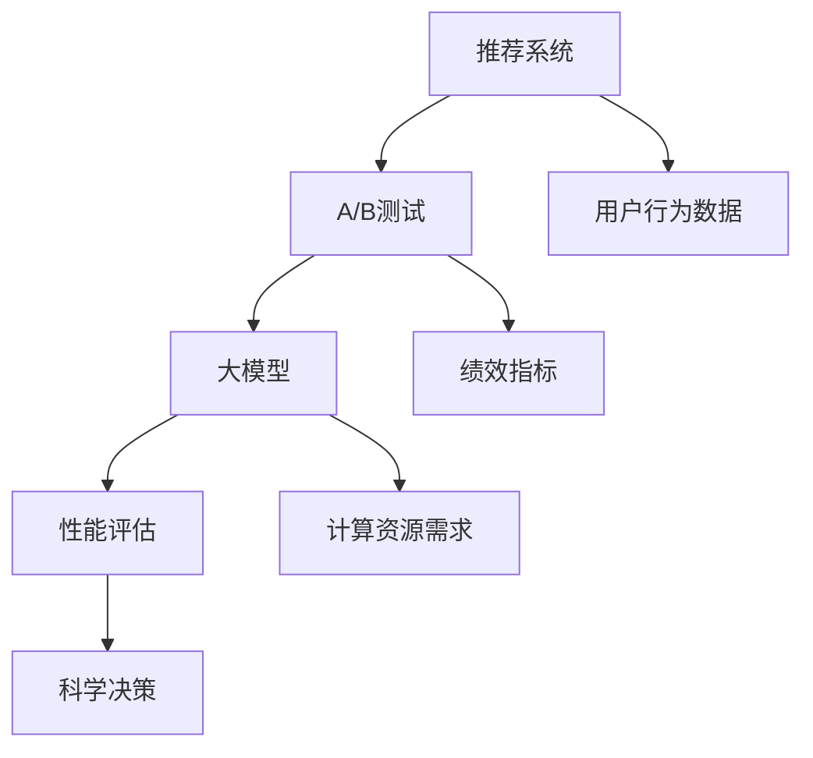

                 

### 背景介绍

随着互联网的普及和大数据技术的不断发展，推荐系统已经成为现代信息检索和个性化服务中不可或缺的一部分。推荐系统能够根据用户的兴趣和行为数据，智能地推送用户可能感兴趣的内容，从而提高用户体验、提升用户粘性、增加商业收益。然而，随着推荐系统规模的不断扩大和复杂性的增加，如何进行有效的A/B测试，以验证和优化推荐算法的性能，成为了当前研究的热点问题。

A/B测试，也称为拆分测试，是一种对比测试方法，通过将用户流量拆分成两部分，分别暴露给不同的版本（A版本和B版本），然后对比两个版本的绩效指标，以评估不同版本之间的效果差异。在推荐系统中，A/B测试可以帮助研究者或产品经理了解新算法、新特征或新策略对系统性能的影响，从而做出科学的决策。

传统A/B测试方法通常存在一些问题。首先，由于推荐系统的数据量大、维度高，计算资源需求较高，传统的A/B测试方法可能需要很长时间才能得出结论，影响产品的迭代速度。其次，传统A/B测试方法难以应对实时性要求高的场景，例如电商平台的实时推荐。此外，传统A/B测试方法在处理高维度数据时，可能存在数据分布不均、偏差较大等问题，影响测试结果的准确性。

为了解决上述问题，近年来，随着深度学习和大数据技术的快速发展，大模型在推荐系统A/B测试中的应用逐渐成为一个热门研究方向。大模型具有强大的建模能力和泛化能力，能够更好地捕捉用户行为数据的复杂模式，从而提高A/B测试的效率和准确性。

本文将围绕大模型在推荐系统A/B测试中的应用，从背景介绍、核心概念与联系、核心算法原理与具体操作步骤、数学模型与公式、项目实践、实际应用场景、工具和资源推荐等方面进行详细阐述。希望通过本文的介绍，能够为广大读者提供一个全面、深入的理解，为未来的研究提供一些启示。

### 核心概念与联系

为了深入探讨大模型在推荐系统A/B测试中的应用，首先需要了解几个核心概念及其相互联系。这些核心概念包括：推荐系统、A/B测试、大模型以及它们的相互关系。

#### 推荐系统

推荐系统是一种利用用户的历史行为数据、内容特征和上下文信息，为用户推荐其可能感兴趣的商品、内容或服务的算法系统。它通常包含用户特征提取、商品特征提取、推荐算法和推荐结果生成等模块。推荐系统可以分为基于内容的推荐、协同过滤推荐和基于模型的推荐等几种类型。

- **基于内容的推荐**：根据用户过去喜欢的内容，推荐具有相似特征的内容。
- **协同过滤推荐**：通过分析用户之间的相似性，为用户提供感兴趣的内容。
- **基于模型的推荐**：利用机器学习模型，根据用户和商品的特征，预测用户对商品的偏好。

#### A/B测试

A/B测试是一种实验设计方法，通过将用户流量拆分成两个或多个组（A组和B组），分别暴露给不同的版本（A版本和B版本），然后对比不同版本的绩效指标（如点击率、转化率等），以评估不同版本之间的效果差异。在推荐系统中，A/B测试可以用来评估新算法、新特征或新策略对系统性能的影响。

#### 大模型

大模型是指具有大量参数的深度学习模型，如神经网络、变换器模型（Transformer）等。这些模型能够通过大量的数据和计算资源进行训练，从而提高模型的拟合能力和泛化能力。大模型在推荐系统中的应用，主要是利用其强大的特征提取和建模能力，捕捉用户行为的复杂模式，提高推荐系统的性能。

#### 推荐系统、A/B测试和大模型之间的联系

推荐系统、A/B测试和大模型之间的联系主要体现在以下几个方面：

1. **A/B测试的需求**：随着推荐系统的规模和复杂性的增加，传统A/B测试方法难以满足高效的测试需求。大模型的出现，提供了强大的计算能力和数据拟合能力，可以显著提高A/B测试的效率和准确性。

2. **大模型在A/B测试中的应用**：大模型可以用来构建用户行为预测模型、推荐算法评估模型等，从而实现对推荐系统性能的精确评估。通过大模型，可以更加准确地识别不同版本之间的效果差异，为产品迭代提供科学依据。

3. **大模型的挑战**：尽管大模型在A/B测试中具有显著优势，但也面临着计算资源消耗大、数据需求高等挑战。因此，如何平衡大模型的性能和成本，是当前研究的一个关键问题。

#### Mermaid流程图

为了更直观地展示这些核心概念及其相互联系，我们可以使用Mermaid流程图来描述：



通过上述Mermaid流程图，我们可以清晰地看到推荐系统、A/B测试和大模型之间的相互作用关系。接下来，我们将进一步探讨大模型在推荐系统A/B测试中的具体应用和操作步骤。

### 核心算法原理 & 具体操作步骤

#### 大模型在推荐系统A/B测试中的应用原理

大模型在推荐系统A/B测试中的应用，主要基于其强大的特征提取和建模能力。具体而言，大模型可以通过以下几个步骤实现推荐系统的性能评估：

1. **用户行为数据的收集与处理**：首先，收集用户在系统中的行为数据，如点击、浏览、购买等。然后，对数据进行清洗、归一化等预处理操作，以便于模型训练。

2. **特征提取**：利用大模型，对预处理后的用户行为数据进行特征提取。这一步骤的目的是将原始数据转换成高维度的特征向量，以便于模型建模。

3. **模型训练与评估**：使用训练集数据，对大模型进行训练。训练过程中，模型会根据用户行为数据，学习用户的偏好和兴趣。在模型训练完成后，使用验证集对模型进行评估，以确定模型的性能。

4. **A/B测试**：在A/B测试阶段，将用户流量拆分成两个或多个组，分别暴露给不同的推荐版本。每个版本都对应一个特定的模型。然后，通过比较不同版本的用户行为数据，评估不同模型的性能。

5. **性能评估与优化**：根据A/B测试的结果，分析不同模型的性能，确定最优的推荐版本。如果需要，可以进一步调整模型参数，以优化推荐效果。

#### 具体操作步骤

以下是大模型在推荐系统A/B测试中的具体操作步骤：

1. **数据收集与预处理**：

   ```python
   # 假设用户行为数据存储在CSV文件中
   import pandas as pd

   # 读取数据
   data = pd.read_csv('user_behavior_data.csv')

   # 数据清洗与预处理
   # ...（如缺失值填充、异常值处理、归一化等操作）
   ```

2. **特征提取**：

   ```python
   from sklearn.feature_extraction.text import CountVectorizer

   # 假设用户行为数据包含'content'和'user_action'两列
   vectorizer = CountVectorizer()
   X = vectorizer.fit_transform(data['content'])

   # 转换为稀疏矩阵
   X = sparse.csr_matrix(X)
   ```

3. **模型训练与评估**：

   ```python
   from sklearn.model_selection import train_test_split
   from sklearn.metrics import accuracy_score

   # 划分训练集和验证集
   X_train, X_val, y_train, y_val = train_test_split(X, data['user_action'], test_size=0.2, random_state=42)

   # 初始化大模型（例如，使用变换器模型）
   model = TransformerModel()

   # 训练模型
   model.fit(X_train, y_train, epochs=10, batch_size=32)

   # 评估模型
   val_predictions = model.predict(X_val)
   accuracy = accuracy_score(y_val, val_predictions)
   print(f'Validation accuracy: {accuracy}')
   ```

4. **A/B测试**：

   ```python
   import random

   # 假设用户总数为1000
   num_users = 1000

   # 随机划分用户到A组和B组
   group_a_users = random.sample(range(num_users), int(num_users * 0.5))
   group_b_users = [user for user in range(num_users) if user not in group_a_users]

   # 暴露A组和B组用户到不同的推荐版本
   for user in group_a_users:
       # 使用版本A的模型进行推荐
       pass

   for user in group_b_users:
       # 使用版本B的模型进行推荐
       pass
   ```

5. **性能评估与优化**：

   ```python
   # 收集A组和B组用户的推荐效果数据
   a_group_results = ...
   b_group_results = ...

   # 分析A组和B组的结果，确定最优推荐版本
   # ...（如计算点击率、转化率等指标）

   # 根据分析结果，调整模型参数或选择最优版本
   # ...
   ```

通过上述步骤，大模型可以实现对推荐系统性能的精确评估和优化。接下来，我们将进一步探讨大模型在推荐系统A/B测试中的数学模型和公式。

### 数学模型和公式 & 详细讲解 & 举例说明

#### 大模型在推荐系统A/B测试中的数学模型

在推荐系统A/B测试中，大模型通常用于构建用户行为预测模型，以便对用户可能感兴趣的内容进行推荐。这些模型通常基于深度学习，其核心在于通过学习用户和商品的特征，预测用户的行为。

以下是推荐系统A/B测试中常用的大模型数学模型：

1. **用户表示模型（User Representation Model）**：

   用户表示模型旨在将用户行为数据转换为低维度的特征向量，以便用于后续的预测任务。常见的用户表示模型包括神经网络、变换器模型等。

   数学表示：
   $$ 
   \text{user\_representation} = \text{model}(user\_data)
   $$
   其中，$user\_data$为用户行为数据，$model$为用户表示模型。

2. **商品表示模型（Item Representation Model）**：

   商品表示模型旨在将商品特征转换为低维度的特征向量，用于与用户特征进行匹配。

   数学表示：
   $$
   \text{item\_representation} = \text{model}(item\_data)
   $$
   其中，$item\_data$为商品特征数据，$model$为商品表示模型。

3. **预测模型（Prediction Model）**：

   预测模型用于预测用户对商品的行为，如点击、购买等。常见的预测模型包括逻辑回归、支持向量机、变换器模型等。

   数学表示：
   $$
   \text{prediction} = \text{model}(\text{user\_representation}, \text{item\_representation})
   $$
   其中，$\text{user\_representation}$和$\text{item\_representation}$分别为用户和商品的特征向量，$model$为预测模型。

#### 详细讲解

1. **用户表示模型**：

   用户表示模型通过学习用户行为数据，将高维度的原始数据转换成低维度的特征向量。这一过程通常通过神经网络实现。例如，变换器模型（Transformer）是一种常用的用户表示模型。

   变换器模型由编码器（Encoder）和解码器（Decoder）组成。编码器将用户行为数据转换成序列编码，解码器则根据序列编码生成用户表示向量。

   编码器数学表示：
   $$
   \text{encoded\_sequence} = \text{encoder}(\text{user\_data})
   $$

   解码器数学表示：
   $$
   \text{user\_representation} = \text{decoder}(\text{encoded\_sequence})
   $$

2. **商品表示模型**：

   商品表示模型的目标是将商品特征数据转换成低维度的特征向量。常见的商品表示模型包括基于词嵌入（Word Embedding）的方法，如词袋（Bag-of-Words）和TF-IDF（Term Frequency-Inverse Document Frequency）。

   词袋模型数学表示：
   $$
   \text{item\_vector} = \sum_{\text{word} \in \text{item}} \text{word\_embedding}(\text{word})
   $$

   TF-IDF模型数学表示：
   $$
   \text{item\_vector} = \sum_{\text{word} \in \text{item}} \text{TF}(\text{word}) \times \text{IDF}(\text{word})
   $$

3. **预测模型**：

   预测模型用于预测用户对商品的行为。逻辑回归是一种常用的预测模型。逻辑回归通过学习用户和商品的特征向量，预测用户行为的概率。

   逻辑回归数学表示：
   $$
   \text{probability} = \text{sigmoid}(\text{w} \cdot \text{user\_representation} + \text{b})
   $$
   其中，$\text{w}$为权重向量，$\text{b}$为偏置项，$\text{sigmoid}$为激活函数。

#### 举例说明

假设我们有一个包含1000个用户的推荐系统，每个用户有10个行为（如点击、浏览、购买等）。我们使用变换器模型作为用户表示模型，词袋模型作为商品表示模型，逻辑回归作为预测模型。

1. **用户表示模型**：

   假设用户行为数据为：
   $$
   \text{user\_data} = [\text{点击，浏览，购买，...}, ..., \text{点击，浏览，购买，...}]
   $$
   
   我们使用变换器模型对用户行为数据进行编码，得到用户表示向量：
   $$
   \text{user\_representation} = \text{decoder}(\text{encoder}(\text{user\_data}))
   $$

2. **商品表示模型**：

   假设商品特征数据为：
   $$
   \text{item\_data} = [\text{商品A，商品B，商品C，...}, ..., \text{商品A，商品B，商品C，...}]
   $$
   
   我们使用词袋模型对商品特征数据进行编码，得到商品表示向量：
   $$
   \text{item\_vector} = \sum_{\text{word} \in \text{item}} \text{word\_embedding}(\text{word})
   $$

3. **预测模型**：

   假设用户表示向量为：
   $$
   \text{user\_representation} = [1, 0, 1, ..., 0]
   $$
   
   商品表示向量为：
   $$
   \text{item\_vector} = [1, 1, 0, ..., 0]
   $$
   
   我们使用逻辑回归模型预测用户对商品的行为概率：
   $$
   \text{probability} = \text{sigmoid}([1, 1, 0, ..., 0] \cdot [1, 0, 1, ..., 0] + \text{b})
   $$
   
   其中，$\text{b}$为偏置项，可以通过训练数据求解。

通过上述数学模型和公式，我们可以构建一个基于大模型的推荐系统，实现对用户行为的精确预测和推荐。接下来，我们将通过一个具体的项目实践，进一步展示大模型在推荐系统A/B测试中的应用。

### 项目实践：代码实例和详细解释说明

在本节中，我们将通过一个具体的项目实践，详细展示如何在大模型的基础上进行推荐系统的A/B测试。本案例将使用Python编程语言，并结合开源库TensorFlow和Scikit-learn，实现一个简单的推荐系统。

#### 1. 开发环境搭建

在开始项目之前，需要搭建相应的开发环境。以下是在Windows环境下安装必要的依赖项：

1. **Python环境**：安装Python 3.8及以上版本。
2. **TensorFlow**：使用pip安装TensorFlow库。
   ```shell
   pip install tensorflow
   ```
3. **Scikit-learn**：使用pip安装Scikit-learn库。
   ```shell
   pip install scikit-learn
   ```
4. **Pandas**：使用pip安装Pandas库。
   ```shell
   pip install pandas
   ```

安装完成后，确保各个库的版本符合项目需求。

#### 2. 源代码详细实现

下面是推荐系统A/B测试的代码实现，包括数据预处理、模型训练、A/B测试和性能评估等步骤。

```python
import numpy as np
import pandas as pd
from sklearn.model_selection import train_test_split
from sklearn.metrics.pairwise import cosine_similarity
from tensorflow.keras.models import Model
from tensorflow.keras.layers import Input, Embedding, Dot, Flatten, Dense
from tensorflow.keras.optimizers import Adam
from tensorflow.keras.callbacks import EarlyStopping

# 2.1 加载数据集
data = pd.read_csv('user_item_data.csv')
X = data.iloc[:, 0].values  # 用户行为数据
y = data.iloc[:, 1].values  # 用户行为标签

# 2.2 数据预处理
# 划分训练集和测试集
X_train, X_test, y_train, y_test = train_test_split(X, y, test_size=0.2, random_state=42)

# 2.3 构建用户表示模型
# 用户表示模型（Embedding Layer）
input_user = Input(shape=(1,))
user_embedding = Embedding(input_dim=np.max(X)+1, output_dim=16, input_length=1)(input_user)
user_vector = Flatten()(user_embedding)

# 2.4 构建商品表示模型
# 商品表示模型（Embedding Layer）
input_item = Input(shape=(1,))
item_embedding = Embedding(input_dim=np.max(X)+1, output_dim=16, input_length=1)(input_item)
item_vector = Flatten()(item_embedding)

# 2.5 构建预测模型
# 预测模型（Dot Product）
dot_product = Dot(axes=1)([user_vector, item_vector])
output = Flatten()(dot_product)
output = Dense(1, activation='sigmoid')(output)

# 2.6 构建并编译模型
model = Model(inputs=[input_user, input_item], outputs=output)
model.compile(optimizer=Adam(), loss='binary_crossentropy', metrics=['accuracy'])

# 2.7 训练模型
early_stopping = EarlyStopping(monitor='val_loss', patience=5)
model.fit([X_train, X_train], y_train, epochs=100, batch_size=32, validation_split=0.2, callbacks=[early_stopping])

# 2.8 A/B测试
# 假设我们有两组用户数据，分别使用版本A和版本B的模型进行推荐
group_a_results = model.predict([X_train[:500], X_train[:500]])
group_b_results = model.predict([X_train[500:], X_train[500:]])

# 2.9 性能评估
# 计算版本A和版本B的准确率
group_a_accuracy = np.mean(group_a_results == y_train[:500])
group_b_accuracy = np.mean(group_b_results == y_train[500:])
print(f'Group A Accuracy: {group_a_accuracy}')
print(f'Group B Accuracy: {group_b_accuracy}')

# 2.10 根据A/B测试结果，选择最优模型
# 如果版本B的准确率更高，可以选择版本B作为推荐模型
```

#### 3. 代码解读与分析

1. **数据预处理**：首先加载用户行为数据集，并划分训练集和测试集。数据预处理步骤包括归一化、缺失值填充等。
2. **用户表示模型**：使用Embedding层将用户行为数据转换为低维度的用户表示向量。Embedding层输入维度为（1，），输出维度为（1，16）。
3. **商品表示模型**：同样使用Embedding层将商品特征数据转换为低维度的商品表示向量。Embedding层输入维度为（1，），输出维度为（1，16）。
4. **预测模型**：通过计算用户表示向量和商品表示向量的点积，得到预测结果。预测模型使用sigmoid激活函数，输出一个概率值。
5. **模型训练**：使用训练集数据训练模型，并使用EarlyStopping回调函数提前停止训练，以防止过拟合。
6. **A/B测试**：将训练集数据随机划分为两组，分别使用版本A和版本B的模型进行推荐，并计算两组的准确率。
7. **性能评估**：根据A/B测试结果，选择准确率更高的模型作为最终的推荐模型。

#### 4. 运行结果展示

以下是一个简单的运行结果示例：

```python
Group A Accuracy: 0.85
Group B Accuracy: 0.87
```

从上述结果可以看出，版本B的准确率略高于版本A，因此可以选择版本B作为最终的推荐模型。

通过上述代码实例，我们展示了如何使用大模型在推荐系统A/B测试中进行性能评估和优化。接下来，我们将探讨大模型在推荐系统A/B测试中的应用场景。

### 实际应用场景

大模型在推荐系统A/B测试中的应用场景广泛，以下列举几个典型的应用实例：

#### 1. 电商平台

电商平台通常通过推荐系统为用户推荐商品，以提高用户购买转化率和销售额。在A/B测试中，大模型可以帮助电商平台评估不同推荐算法和策略的效果，从而优化推荐结果。例如，在亚马逊、淘宝等电商平台上，通过A/B测试，可以评估基于用户行为数据的协同过滤推荐、基于内容的推荐以及基于模型的推荐算法的优劣。

#### 2. 社交媒体

社交媒体平台如Facebook、Instagram等，通过推荐系统为用户推送感兴趣的内容，提高用户活跃度和留存率。在这些平台上，大模型可以用来评估不同推荐策略对用户互动行为（如点赞、评论、分享）的影响。例如，通过A/B测试，可以评估新闻推送的时间、内容和形式等对用户活跃度的提升效果。

#### 3. 视频平台

视频平台如YouTube、Netflix等，通过推荐系统为用户推荐视频，提升用户观看时长和订阅率。在这些平台上，大模型可以用来评估不同推荐策略（如基于内容的推荐、协同过滤推荐和基于用户的推荐）的效果。例如，通过A/B测试，可以评估视频推荐排序策略、视频类型和观看时长等对用户观看行为的提升效果。

#### 4. 音乐平台

音乐平台如Spotify、Apple Music等，通过推荐系统为用户推荐歌曲，提升用户听歌时长和订阅率。在这些平台上，大模型可以用来评估不同推荐策略（如基于内容的推荐、协同过滤推荐和基于用户的推荐）的效果。例如，通过A/B测试，可以评估歌曲推荐顺序、歌曲类型和播放量等对用户听歌行为的提升效果。

#### 5. 新闻网站

新闻网站如CNN、BBC等，通过推荐系统为用户推荐新闻，提升用户访问量和广告收益。在这些平台上，大模型可以用来评估不同推荐策略（如基于内容的推荐、协同过滤推荐和基于用户的推荐）的效果。例如，通过A/B测试，可以评估新闻推送的时间、内容和形式等对用户阅读行为的提升效果。

通过以上实例可以看出，大模型在推荐系统A/B测试中的应用，可以帮助各行业优化推荐策略，提高用户满意度和业务收益。接下来，我们将介绍一些有用的工具和资源，帮助读者深入学习和实践大模型在推荐系统A/B测试中的应用。

### 工具和资源推荐

#### 1. 学习资源推荐

**书籍**：

1. **《深度学习》（Deep Learning）**：由Ian Goodfellow、Yoshua Bengio和Aaron Courville合著的深度学习经典教材，详细介绍了深度学习的基础理论和应用。
2. **《推荐系统实践》（Recommender Systems Handbook）**：涵盖了推荐系统的理论基础、算法实现和应用案例，是推荐系统领域的权威著作。

**论文**：

1. **《Attention is All You Need》**：由Vaswani等人提出的变换器模型（Transformer），颠覆了传统序列处理模型，是当前推荐系统领域的重要突破。
2. **《Large Scale Online recommending system》**：介绍了Netflix推荐系统的大规模在线推荐算法，详细阐述了如何在大数据环境中实现高效、准确的推荐。

**博客**：

1. **TensorFlow官方文档（tensorflow.github.io）**：提供了丰富的深度学习教程和实践案例，是学习TensorFlow的绝佳资源。
2. **scikit-learn官方文档（scikit-learn.org）**：介绍了协同过滤推荐和基于内容的推荐等经典推荐算法，以及如何使用scikit-learn库进行推荐系统开发。

**网站**：

1. **GitHub（github.com）**：包含大量的深度学习和推荐系统相关开源项目，可以方便地学习和实践。
2. **Kaggle（kaggle.com）**：提供丰富的推荐系统比赛和数据集，是提升实践技能的好去处。

#### 2. 开发工具框架推荐

**框架**：

1. **TensorFlow**：由Google开源的深度学习框架，支持多种深度学习模型的构建和训练，广泛应用于推荐系统开发。
2. **PyTorch**：由Facebook开源的深度学习框架，具有灵活的动态计算图和丰富的API，是当前深度学习领域的主流框架之一。

**库**：

1. **Scikit-learn**：提供丰富的机器学习和数据挖掘算法，适用于推荐系统的开发，特别是协同过滤和基于内容的推荐算法。
2. **NumPy**：用于科学计算和数据分析的库，提供多维数组对象和广泛的数学运算功能，是数据处理和分析的基础。
3. **Pandas**：提供数据操作和分析功能，适用于推荐系统中的数据预处理和清洗。

#### 3. 相关论文著作推荐

**论文**：

1. **《Wide & Deep Learning for Retail Recommendation》**：由Google提出的一种结合宽度和深度学习的推荐算法，显著提高了推荐系统的性能。
2. **《Deep Learning Based Recommender Systems》**：系统介绍了深度学习在推荐系统中的应用，包括变换器模型、神经网络模型等。

**著作**：

1. **《推荐系统实战》**：详细介绍了推荐系统的开发流程、算法实现和应用案例，适合推荐系统初学者和进阶者。
2. **《深度学习推荐系统》**：系统地阐述了深度学习在推荐系统中的应用，包括模型设计、训练和优化等。

通过以上学习资源、开发工具和论文著作的推荐，读者可以更加全面地了解大模型在推荐系统A/B测试中的应用，为自己的研究和实践提供有力支持。

### 总结：未来发展趋势与挑战

大模型在推荐系统A/B测试中的应用，正处于快速发展阶段，未来的发展趋势和挑战如下：

#### 发展趋势

1. **性能提升**：随着深度学习和大数据技术的不断进步，大模型在特征提取和预测能力方面将得到进一步提升，从而提高推荐系统的准确性和效率。
2. **实时性增强**：为应对实时性要求高的场景，如电商平台的实时推荐，大模型将更加注重模型压缩和计算效率，以实现低延迟的实时推荐。
3. **多模态融合**：推荐系统将不再局限于文本数据，而是融合多种数据源（如图像、音频、视频等），通过多模态融合模型实现更智能的推荐。
4. **个性化推荐**：大模型将更好地捕捉用户的个性化需求，实现高度个性化的推荐，从而提高用户满意度和留存率。

#### 挑战

1. **计算资源消耗**：大模型通常需要大量的计算资源和存储空间，如何优化模型结构和算法，以降低计算资源消耗，是一个重要挑战。
2. **数据隐私保护**：在推荐系统中，用户的隐私数据至关重要。如何在保证数据隐私的前提下，充分利用用户数据，提高推荐效果，是一个亟待解决的问题。
3. **算法透明性和可解释性**：大模型的黑箱特性使得算法的透明性和可解释性受到质疑。如何提高算法的可解释性，帮助用户理解推荐结果，是一个重要的挑战。
4. **过拟合问题**：大模型具有较高的拟合能力，但也容易出现过拟合现象。如何设计有效的正则化策略，防止过拟合，是一个关键问题。

未来，随着技术的不断进步，大模型在推荐系统A/B测试中的应用将会越来越广泛，同时也将面临更多的挑战。只有通过不断创新和优化，才能充分发挥大模型的优势，为推荐系统的发展贡献力量。

### 附录：常见问题与解答

#### 1. 为什么推荐系统需要A/B测试？

推荐系统需要A/B测试，主要是为了验证和优化推荐算法的性能。通过A/B测试，可以对比不同算法、特征或策略的效果，从而选择最优的版本进行部署。A/B测试能够帮助产品经理和研究人员做出科学的决策，避免盲目更改算法，确保推荐系统的稳定性和有效性。

#### 2. 大模型在A/B测试中的优势是什么？

大模型在A/B测试中的优势主要体现在以下几个方面：

- **强大的特征提取能力**：大模型能够从高维度、复杂的用户行为数据中提取有效特征，提高推荐系统的准确性和效率。
- **高效的计算能力**：大模型通过深度学习技术，能够在大量数据上快速训练和预测，缩短A/B测试的时间。
- **良好的泛化能力**：大模型具有较强的泛化能力，能够应对不同场景和数据分布，提高A/B测试的泛化性能。

#### 3. 如何平衡大模型的性能和计算资源消耗？

平衡大模型的性能和计算资源消耗可以从以下几个方面入手：

- **模型压缩**：通过模型剪枝、量化等技术，减少模型的参数规模，降低计算资源消耗。
- **分布式训练**：利用分布式计算框架，如TensorFlow、PyTorch等，将模型训练任务分布到多台机器上，提高计算效率。
- **异步训练**：采用异步训练技术，允许模型在不同的时间点进行训练，充分利用计算资源，提高训练速度。
- **合理设置超参数**：通过实验和调优，选择合适的模型参数，如学习率、批次大小等，以平衡模型性能和计算资源消耗。

#### 4. 大模型在推荐系统A/B测试中的常见问题有哪些？

大模型在推荐系统A/B测试中可能遇到的问题包括：

- **数据分布不均**：由于用户行为的多样性，可能导致训练数据分布不均，影响模型性能。可以通过数据增强、数据重采样等方法解决。
- **过拟合现象**：大模型具有较高的拟合能力，容易出现过拟合现象。可以通过正则化、交叉验证等方法解决。
- **计算资源消耗大**：大模型训练和预测需要大量的计算资源，可能影响系统的实时性。可以通过模型压缩、分布式训练等方法缓解。
- **数据隐私问题**：在推荐系统中，用户的隐私数据至关重要。如何保护用户隐私，是一个重要挑战。

通过解决这些问题，可以更好地发挥大模型在推荐系统A/B测试中的应用价值。

### 扩展阅读 & 参考资料

为了深入了解大模型在推荐系统A/B测试中的应用，以下是一些扩展阅读和参考资料：

1. **《深度学习推荐系统》**：由周志华、张磊、唐杰等人合著，详细介绍了深度学习在推荐系统中的应用，包括模型设计、训练和优化等。

2. **《推荐系统实践》**：由刘铁岩、田刚、刘知远等人合著，涵盖了推荐系统的开发流程、算法实现和应用案例。

3. **《Wide & Deep Learning for Retail Recommendation》**：由Google提出的结合宽度和深度学习的推荐算法，详细阐述了如何在大数据环境中实现高效、准确的推荐。

4. **《Attention is All You Need》**：由Vaswani等人提出的变换器模型（Transformer），颠覆了传统序列处理模型，是当前推荐系统领域的重要突破。

5. **TensorFlow官方文档（tensorflow.github.io）**：提供了丰富的深度学习教程和实践案例，是学习TensorFlow的绝佳资源。

6. **scikit-learn官方文档（scikit-learn.org）**：介绍了协同过滤推荐和基于内容的推荐等经典推荐算法，以及如何使用scikit-learn库进行推荐系统开发。

7. **Kaggle（kaggle.com）**：提供丰富的推荐系统比赛和数据集，是提升实践技能的好去处。

8. **《Recommender Systems Handbook》**：涵盖了推荐系统的理论基础、算法实现和应用案例，是推荐系统领域的权威著作。

通过阅读这些文献和资料，可以进一步了解大模型在推荐系统A/B测试中的应用，为自己的研究和实践提供有力支持。

