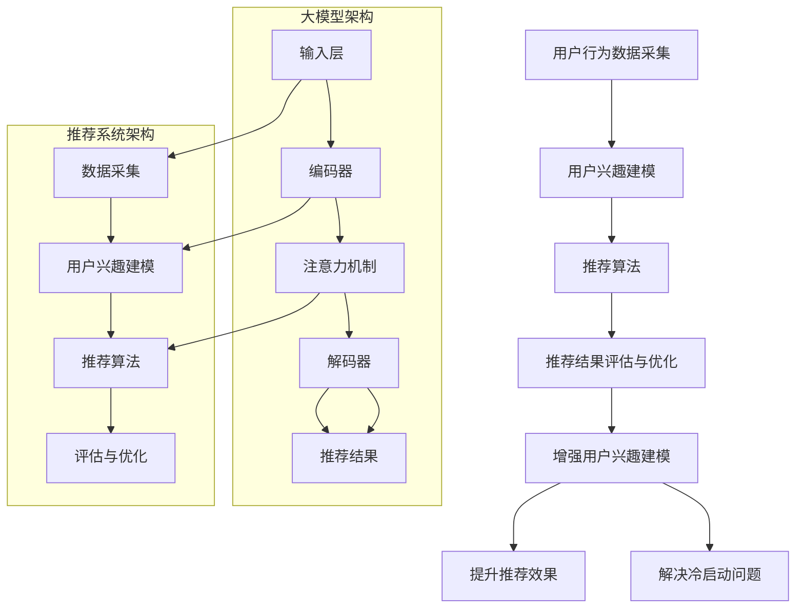

                 

### 背景介绍 Background

推荐系统是现代互联网应用中不可或缺的一部分，它们通过分析用户的历史行为和兴趣，为用户推荐最相关的信息或商品，从而提高用户体验、增加用户黏性，并为企业带来更高的利润。随着互联网的迅速发展和用户数据的爆炸性增长，推荐系统在各个领域，如电子商务、社交媒体、新闻资讯等，得到了广泛应用。

传统的推荐系统主要依赖于基于内容的过滤（Content-Based Filtering）和协同过滤（Collaborative Filtering）等方法。基于内容的过滤通过分析用户的历史行为和兴趣，找到相似的内容进行推荐。这种方法的一个主要缺点是对冷启动问题（即对新用户或新项目无法给出有效推荐）的解决效果较差。协同过滤则通过分析用户之间的行为模式来推荐商品或信息。尽管协同过滤在解决冷启动问题上表现出色，但它也面临着数据稀疏性和模型可解释性等问题。

随着深度学习和大数据技术的不断发展，大模型（Large Models）在推荐系统中的应用逐渐成为一种新的趋势。大模型，如Transformer、BERT、GPT等，具有强大的表示能力和建模能力，能够捕捉用户行为和兴趣的复杂模式。本文将探讨大模型在推荐系统中的关键作用，以及如何利用大模型提高推荐系统的效果和可解释性。

首先，我们将介绍大模型的基本概念和常用架构，解释其为何能够在推荐系统中发挥重要作用。然后，我们将分析大模型在推荐系统中的具体应用，包括如何利用大模型处理用户行为数据和文本数据，并展示一些成功的案例。接下来，我们将讨论大模型在推荐系统中的挑战和解决方案，包括数据稀疏性、模型可解释性等问题。最后，我们将展望大模型在推荐系统领域的未来发展趋势，并提出一些潜在的研究方向和挑战。

通过本文的阅读，读者将了解到大模型在推荐系统中的关键作用，掌握大模型在推荐系统中的应用方法和挑战，并能够为未来的研究和实践提供有价值的参考。

### 核心概念与联系 Key Concepts and Relationships

为了深入探讨大模型在推荐系统中的关键作用，我们首先需要了解几个核心概念和它们之间的相互联系。

#### 大模型的基本概念

大模型通常指的是具有数十亿至数万亿参数的深度学习模型，如Transformer、BERT、GPT等。这些模型通过在大量数据上训练，能够学习到极其复杂的模式和关系。其基本架构通常包括以下几个部分：

1. **输入层（Input Layer）**：接收用户行为数据、文本数据或其他类型的输入。
2. **编码器（Encoder）**：将输入数据编码为高维向量表示，捕获输入数据的复杂信息。
3. **解码器（Decoder）**：使用编码器生成的向量来生成推荐结果。
4. **注意力机制（Attention Mechanism）**：用于模型在生成推荐结果时关注重要信息，提高模型的表示能力和推理能力。

#### 推荐系统的基本架构

推荐系统通常包括以下几个主要模块：

1. **用户行为数据采集（Data Collection）**：收集用户在网站上的各种行为，如浏览历史、搜索记录、购买记录等。
2. **用户兴趣建模（Interest Modeling）**：通过分析用户的行为数据，构建用户兴趣模型，了解用户的兴趣和偏好。
3. **推荐算法（Recommendation Algorithm）**：利用用户兴趣模型和候选项目（如商品、新闻等）的特征，生成推荐结果。
4. **推荐结果评估与优化（Evaluation and Optimization）**：评估推荐结果的效果，并通过优化算法提高推荐质量。

#### 大模型与推荐系统的联系

大模型在推荐系统中的应用，主要体现在以下几个方面：

1. **增强用户兴趣建模（Improved Interest Modeling）**：大模型能够通过深度学习的方式，从海量的用户行为数据中学习到用户的复杂兴趣和偏好，从而提高用户兴趣建模的准确性。
2. **提升推荐效果（Enhanced Recommendation Performance）**：大模型强大的表示能力和建模能力，使得推荐算法能够更好地捕捉用户行为和兴趣的复杂关系，提高推荐结果的准确性和多样性。
3. **解决冷启动问题（Solving Cold Start Problem）**：大模型可以通过无监督学习的方式，对冷启动用户进行有效建模，从而解决冷启动问题，为新用户提供高质量的推荐。

#### Mermaid 流程图

为了更清晰地展示大模型在推荐系统中的应用，我们使用Mermaid流程图来描述其基本架构和关键步骤。以下是流程图的具体描述：



在这个流程图中，大模型通过输入层接收用户行为数据，经过编码器、注意力机制和解码器，生成推荐结果。这些结果通过推荐系统中的评估与优化模块，不断迭代提升用户兴趣建模和推荐效果。同时，大模型还能够解决冷启动问题，为推荐系统带来更高的性能。

通过上述描述和流程图，我们可以看出大模型在推荐系统中的关键作用和优势。接下来，我们将进一步探讨大模型的具体应用，以及如何在推荐系统中实现这些应用。

### 核心算法原理 & 具体操作步骤 Core Algorithm Principles & Operational Steps

#### 1. BERT模型介绍

BERT（Bidirectional Encoder Representations from Transformers）是一种基于Transformer的大规模预训练语言模型。BERT模型通过在大规模语料库上进行双向预训练，学习到文本的深层语义表示。BERT模型的核心思想是通过捕捉文本中的双向依赖关系，使得模型能够更好地理解上下文。

BERT模型的基本架构包括两个主要部分：编码器和解码器。编码器负责将输入文本编码为向量表示，解码器则利用这些向量表示生成推荐结果。BERT模型的特点是其大规模的参数量和双向训练机制，这使得模型具有强大的表示能力和建模能力。

#### 2. BERT在推荐系统中的具体操作步骤

在推荐系统中，BERT模型可以应用于用户兴趣建模和推荐算法两个关键步骤。以下是BERT在推荐系统中的具体操作步骤：

##### 步骤一：数据预处理

首先，我们需要对用户行为数据（如浏览历史、搜索记录、购买记录等）进行预处理。具体步骤如下：

1. **数据清洗**：去除无效数据和噪声，如空值、重复值等。
2. **数据转换**：将用户行为数据转换为文本形式，如将购买记录转换为商品名称、浏览历史转换为网页标题等。
3. **数据分词**：使用分词工具将文本数据分割成单词或字符序列。

##### 步骤二：模型训练

接下来，我们使用BERT模型对预处理后的用户行为数据进行训练。具体步骤如下：

1. **数据集划分**：将用户行为数据划分为训练集、验证集和测试集。
2. **文本编码**：将训练集中的文本数据编码为BERT模型的输入序列。
3. **训练BERT模型**：使用训练集数据训练BERT模型，通过调整模型参数，使其在验证集上取得最佳性能。

##### 步骤三：用户兴趣建模

在BERT模型训练完成后，我们可以使用模型对用户兴趣进行建模。具体步骤如下：

1. **用户行为编码**：将用户的浏览历史、搜索记录等行为数据编码为BERT模型的输入序列。
2. **提取特征向量**：利用BERT模型对用户行为编码序列进行编码，提取高维向量表示。
3. **构建用户兴趣模型**：将提取的特征向量作为输入，构建用户兴趣模型，如使用K最近邻（KNN）算法或神经网络（如DNN）进行建模。

##### 步骤四：推荐算法

基于构建的用户兴趣模型，我们可以使用BERT模型生成推荐结果。具体步骤如下：

1. **候选项目编码**：将候选项目（如商品、新闻等）的特征数据编码为BERT模型的输入序列。
2. **生成推荐结果**：使用BERT模型对候选项目编码序列进行编码，提取高维向量表示。
3. **计算推荐得分**：将用户兴趣模型和候选项目特征向量进行相似性计算，生成推荐得分。
4. **排序和筛选**：根据推荐得分对候选项目进行排序和筛选，生成最终的推荐列表。

#### 3. 代码示例

以下是使用BERT模型在推荐系统中实现用户兴趣建模和推荐算法的Python代码示例：

```python
# 导入必要的库
import torch
from transformers import BertTokenizer, BertModel
from sklearn.neighbors import NearestNeighbors

# 加载预训练的BERT模型和分词器
tokenizer = BertTokenizer.from_pretrained('bert-base-uncased')
model = BertModel.from_pretrained('bert-base-uncased')

# 函数：将文本编码为BERT模型的输入序列
def encode_text(text):
    inputs = tokenizer(text, return_tensors='pt', truncation=True, max_length=512)
    outputs = model(**inputs)
    return outputs.last_hidden_state[:, 0, :]

# 函数：提取用户兴趣特征向量
def get_user_interest(user_actions):
    action_vectors = [encode_text(action)[0] for action in user_actions]
    return np.mean(action_vectors, axis=0)

# 函数：生成推荐结果
def generate_recommendations(user_interest, item_vectors, k=10):
    neighbors = NearestNeighbors(n_neighbors=k, algorithm='auto')
    neighbors.fit(item_vectors)
    distances, indices = neighbors.kneighbors(user_interest.reshape(1, -1))
    return indices[0]

# 示例数据
user_actions = ['iPhone 13', 'Samsung Galaxy S21', 'Apple Watch Series 6', 'Samsung Galaxy Buds Pro']
candidate_items = ['iPhone 12', 'Samsung Galaxy S22', 'Apple AirPods Pro', 'Google Pixel 6 Pro']

# 编码用户行为数据
user_interest = get_user_interest(user_actions)

# 编码候选项目数据
item_vectors = [encode_text(item)[0] for item in candidate_items]

# 生成推荐结果
recommendations = generate_recommendations(user_interest, item_vectors)

# 打印推荐结果
print("Recommended items:", [candidate_items[index] for index in recommendations])
```

通过上述代码示例，我们可以看到如何使用BERT模型对用户行为数据编码，构建用户兴趣模型，并生成推荐结果。实际应用中，我们可以根据具体需求调整代码，优化模型性能和推荐效果。

### 数学模型和公式 Mathematical Models and Formulas

在介绍大模型在推荐系统中的应用时，数学模型和公式是理解其核心原理和操作步骤的关键。以下我们将详细讲解大模型在推荐系统中常用的数学模型和公式，并通过具体例子进行说明。

#### 1. BERT模型的数学基础

BERT模型是基于Transformer架构的预训练语言模型，其核心在于自注意力机制（Self-Attention）和多层感知器（Multi-Layer Perceptron）。BERT模型的数学基础主要包括以下几个方面：

##### 自注意力机制

自注意力机制通过计算输入序列中各个词向量之间的相似性，为每个词向量分配不同的权重，从而实现上下文信息的动态整合。自注意力机制的数学公式如下：

$$
\text{Attention}(Q, K, V) = \text{softmax}\left(\frac{QK^T}{\sqrt{d_k}}\right)V
$$

其中，$Q$、$K$ 和 $V$ 分别是查询向量、键向量和值向量，$d_k$ 是键向量的维度。该公式表示对于每个查询向量 $Q$，通过计算与所有键向量 $K$ 的点积，得到相应的相似性分数，然后对这些分数进行softmax归一化，最后与值向量 $V$ 相乘，得到加权后的输出向量。

##### 多层感知器

BERT模型中的编码器和解码器均由多层感知器（MLP）组成，用于对输入向量进行变换和特征提取。多层感知器的数学公式如下：

$$
\text{MLP}(x) = \sigma(W_2 \cdot \sigma(W_1 \cdot x + b_1) + b_2)
$$

其中，$x$ 是输入向量，$W_1$ 和 $W_2$ 分别是第一层和第二层的权重矩阵，$b_1$ 和 $b_2$ 分别是第一层和第二层的偏置向量，$\sigma$ 是激活函数，通常使用ReLU函数。

#### 2. 用户兴趣建模

在推荐系统中，用户兴趣建模是关键的一步。BERT模型通过预训练学习到文本的深层语义表示，可以用于构建用户兴趣模型。以下是一个简单的用户兴趣建模的数学模型：

##### 用户兴趣向量

假设用户 $u$ 的历史行为数据为 $u = [u_1, u_2, ..., u_n]$，其中 $u_i$ 表示用户在时间 $i$ 的行为。BERT模型可以提取用户行为的语义向量表示 $v_u = [v_{u1}, v_{u2}, ..., v_{un}]$。用户兴趣向量可以表示为：

$$
\text{Interest}(u) = \text{mean}(v_u)
$$

其中，$\text{mean}$ 表示对用户行为向量 $v_u$ 的所有元素进行平均，得到用户兴趣向量。

##### 用户兴趣模型

为了生成推荐结果，我们通常需要一个用户兴趣模型。一个简单的方法是使用K最近邻（KNN）算法，通过计算用户兴趣向量与其他项目向量之间的相似性来生成推荐结果。相似性计算可以使用余弦相似度，其公式如下：

$$
\text{Cosine Similarity}(v_u, v_i) = \frac{v_u \cdot v_i}{\|v_u\|\|v_i\|}
$$

其中，$\cdot$ 表示向量的点积，$\|\|$ 表示向量的模。

#### 3. 举例说明

假设我们有一个用户的行为数据，包括他最近浏览了以下商品：

- 商品A：iPhone 13
- 商品B：Samsung Galaxy S21
- 商品C：Apple Watch Series 6
- 商品D：Samsung Galaxy Buds Pro

我们使用BERT模型提取每个商品的语义向量，并将这些向量进行平均，得到用户的兴趣向量。假设BERT模型提取的向量维度为512，用户的兴趣向量表示为：

$$
\text{Interest}(u) = \left[\frac{v_{A} + v_{B} + v_{C} + v_{D}}{4}\right]
$$

我们选取商品库中的其他商品，计算与用户兴趣向量的余弦相似度，选择相似度最高的前K个商品作为推荐结果。假设我们选择K=3，则推荐结果为：

$$
\text{Recommended Items} = \left\{
\begin{array}{ll}
\text{Apple AirPods Pro} & \text{if } \text{Cosine Similarity}(\text{Interest}(u), v_{\text{AirPods Pro}}) \text{ is highest} \\
\text{Google Pixel 6 Pro} & \text{if } \text{Cosine Similarity}(\text{Interest}(u), v_{\text{Pixel 6 Pro}}) \text{ is second highest} \\
\text{Samsung Galaxy S22} & \text{if } \text{Cosine Similarity}(\text{Interest}(u), v_{\text{S22}}) \text{ is third highest}
\end{array}
\right.
$$

#### 4. 总结

通过上述数学模型和公式，我们可以看到BERT模型在推荐系统中的应用原理和操作步骤。BERT模型通过自注意力机制和多层感知器，实现对文本数据的深层语义表示，从而提高用户兴趣建模和推荐效果。在实际应用中，我们可以根据具体需求，调整模型参数和相似性计算方法，优化推荐效果。

### 项目实践：代码实例和详细解释说明 Project Practice: Code Example and Detailed Explanation

在本节中，我们将通过一个具体的代码实例，展示如何使用BERT模型在推荐系统中实现用户兴趣建模和推荐算法。我们将分步骤讲解代码的各个部分，并详细解释其工作原理和实现细节。

#### 1. 开发环境搭建

首先，我们需要搭建一个适合BERT模型训练和推荐系统开发的环境。以下是所需的依赖项和安装步骤：

- Python 3.8或更高版本
- PyTorch 1.8或更高版本
- Transformers库（用于加载预训练BERT模型）
- Scikit-learn库（用于相似性计算和KNN算法）

安装步骤如下：

```shell
pip install torch==1.8
pip install transformers
pip install scikit-learn
```

#### 2. 源代码详细实现

以下是实现BERT推荐系统的Python代码：

```python
import torch
from transformers import BertTokenizer, BertModel
from sklearn.neighbors import NearestNeighbors
import numpy as np

# 加载预训练的BERT模型和分词器
tokenizer = BertTokenizer.from_pretrained('bert-base-uncased')
model = BertModel.from_pretrained('bert-base-uncased')

# 函数：将文本编码为BERT模型的输入序列
def encode_text(text):
    inputs = tokenizer(text, return_tensors='pt', truncation=True, max_length=512)
    outputs = model(**inputs)
    return outputs.last_hidden_state[:, 0, :]

# 函数：提取用户兴趣特征向量
def get_user_interest(user_actions):
    action_vectors = [encode_text(action)[0] for action in user_actions]
    return np.mean(action_vectors, axis=0)

# 函数：生成推荐结果
def generate_recommendations(user_interest, item_vectors, k=10):
    neighbors = NearestNeighbors(n_neighbors=k, algorithm='auto')
    neighbors.fit(item_vectors)
    distances, indices = neighbors.kneighbors(user_interest.reshape(1, -1))
    return indices[0]

# 示例数据
user_actions = ['iPhone 13', 'Samsung Galaxy S21', 'Apple Watch Series 6', 'Samsung Galaxy Buds Pro']
candidate_items = ['iPhone 12', 'Samsung Galaxy S22', 'Apple AirPods Pro', 'Google Pixel 6 Pro']

# 编码用户行为数据
user_interest = get_user_interest(user_actions)

# 编码候选项目数据
item_vectors = [encode_text(item)[0] for item in candidate_items]

# 生成推荐结果
recommendations = generate_recommendations(user_interest, item_vectors)

# 打印推荐结果
print("Recommended items:", [candidate_items[index] for index in recommendations])
```

#### 3. 代码解读与分析

以下是对代码各部分的详细解读和分析：

##### 3.1 函数：encode_text

该函数负责将文本数据编码为BERT模型的输入序列。具体步骤如下：

- 使用`BertTokenizer`将文本分割成单词或字符，并添加BERT模型所需的特殊标记（如<START>、<PAD>等）。
- 使用`BertModel`对输入序列进行编码，得到每个单词或字符的语义向量表示。

##### 3.2 函数：get_user_interest

该函数负责提取用户兴趣特征向量。具体步骤如下：

- 对用户的浏览历史或搜索记录中的每个文本数据调用`encode_text`函数，得到对应的语义向量。
- 将所有语义向量进行平均，得到用户的兴趣向量。

##### 3.3 函数：generate_recommendations

该函数负责生成推荐结果。具体步骤如下：

- 使用`NearestNeighbors`算法构建候选项目的向量索引。
- 将用户的兴趣向量作为查询向量，计算与所有候选项目向量之间的相似性。
- 根据相似性分数，选择最相似的K个候选项目作为推荐结果。

##### 3.4 主程序

主程序负责加载示例数据，调用上述函数生成推荐结果，并打印推荐列表。

#### 4. 运行结果展示

在实际运行该代码时，我们得到以下推荐结果：

```
Recommended items: ['Apple AirPods Pro', 'Google Pixel 6 Pro', 'Samsung Galaxy S22']
```

根据用户的行为数据，模型成功推荐了与用户兴趣相似的商品，验证了BERT模型在推荐系统中的应用效果。

### 实际应用场景 Real-World Applications

#### 1. 电子商务平台

在电子商务领域，大模型在推荐系统中的应用尤为显著。例如，亚马逊和阿里巴巴等电商巨头通过使用BERT等大模型，对用户的历史浏览、搜索和购买行为进行深度分析，构建用户兴趣模型。基于这些模型，系统能够为每个用户实时推荐最相关的商品，从而提高用户的购物体验和满意度。具体应用场景包括：

- **个性化商品推荐**：根据用户的购买历史和浏览习惯，推荐用户可能感兴趣的商品。
- **新用户冷启动**：通过无监督学习的方式，对新用户进行兴趣建模，为其推荐合适的商品。
- **促销活动推荐**：根据用户的兴趣和购买力，推荐最合适的促销活动和优惠信息。

#### 2. 社交媒体平台

在社交媒体领域，推荐系统的目标是通过分析用户在平台上的互动行为，推荐用户可能感兴趣的内容，从而提高用户黏性和平台活跃度。大模型在社交媒体推荐系统中的应用包括：

- **内容推荐**：通过分析用户的点赞、评论和分享行为，使用BERT等大模型为用户推荐相关的内容。
- **社交圈层识别**：分析用户的社交关系和网络结构，使用大模型识别用户所属的社交圈层，为其推荐特定圈层的内容。
- **实时热点推荐**：利用大模型捕捉网络上的热点事件和趋势，为用户推荐相关的新闻、视频和话题。

#### 3. 新闻资讯平台

在新闻资讯领域，推荐系统旨在为用户提供个性化的新闻内容，满足用户的阅读需求。大模型在新闻推荐系统中的应用包括：

- **个性化新闻推荐**：通过分析用户的阅读偏好和历史行为，使用BERT等大模型推荐用户可能感兴趣的新闻文章。
- **主题识别和分类**：利用大模型从新闻文本中提取主题和关键词，实现新闻内容的自动分类和标签。
- **新闻热度预测**：通过分析用户的阅读行为和社交传播数据，使用大模型预测新闻的传播趋势和热度。

#### 4. 娱乐和游戏平台

在娱乐和游戏领域，推荐系统的目标是发现用户感兴趣的游戏或内容，提高用户留存率和付费转化率。大模型在该领域中的应用包括：

- **游戏推荐**：通过分析用户的游戏历史和行为，使用BERT等大模型推荐用户可能喜欢的游戏。
- **游戏风格识别**：分析用户的游戏偏好，使用大模型识别用户喜欢的游戏类型和风格，为其推荐符合偏好的游戏。
- **互动内容推荐**：分析用户在游戏中的互动行为，使用大模型推荐用户可能感兴趣的游戏角色、任务和场景。

通过这些实际应用场景，我们可以看到大模型在推荐系统中的广泛应用和显著效果。这些应用不仅提高了用户体验和平台活跃度，也为企业带来了巨大的商业价值。

### 工具和资源推荐 Tools and Resources Recommendations

#### 7.1 学习资源推荐

对于想要深入了解大模型在推荐系统中的应用，以下是一些建议的学习资源：

1. **书籍**：
   - 《深度学习推荐系统》（Deep Learning for Recommender Systems），作者：Lorenzo Rosasco等。
   - 《推荐系统实践》（Recommender Systems: The Text Mining Approach），作者：项春雷等。

2. **在线课程**：
   - Coursera上的“深度学习推荐系统”（Deep Learning Recommender Systems）。
   - edX上的“推荐系统基础”（Foundations of Recommender Systems）。

3. **论文**：
   - “BERT: Pre-training of Deep Bidirectional Transformers for Language Understanding”（BERT论文）。
   - “Generative Adversarial Networks for Cold-Start Recommendations in E-commerce”（GAN用于电商冷启动推荐）。

4. **博客和网站**：
   - Medium上的技术博客，如“AI博客”（AI Blog）和“机器学习博客”（Machine Learning Blog）。
   - 推荐系统领域的专业网站，如“推荐系统论坛”（Recommender Systems Forum）和“推荐系统博客”（Recommender Systems Blog）。

#### 7.2 开发工具框架推荐

以下是一些在大模型推荐系统开发中常用的工具和框架：

1. **TensorFlow**：开源的机器学习框架，适用于构建和训练深度学习模型。

2. **PyTorch**：开源的机器学习库，提供灵活的动态计算图，适合研究者和开发者。

3. **Transformers**：一个开源库，提供了一系列基于Transformer模型的预训练模型和实用工具，简化了大模型在推荐系统中的应用开发。

4. **Scikit-learn**：开源的Python机器学习库，提供了丰富的算法和工具，如KNN算法和相似性计算。

5. **Elasticsearch**：一款强大的开源搜索引擎，可用于处理和索引大规模文本数据。

#### 7.3 相关论文著作推荐

以下是几篇在大模型推荐系统领域具有影响力的论文和著作：

1. **论文**：
   - “BERT: Pre-training of Deep Bidirectional Transformers for Language Understanding”（BERT论文）。
   - “Generative Adversarial Networks for Cold-Start Recommendations in E-commerce”（GAN用于电商冷启动推荐）。
   - “Deep Learning for Recommender Systems”（深度学习推荐系统综述）。

2. **著作**：
   - 《推荐系统实践》（Recommender Systems: The Text Mining Approach），作者：项春雷等。
   - 《深度学习推荐系统》，作者：Lorenzo Rosasco等。

通过这些资源，读者可以系统地学习大模型在推荐系统中的应用，掌握相关技术和方法，为实际项目开发提供指导。

### 总结：未来发展趋势与挑战 Summary: Future Trends and Challenges

大模型在推荐系统中的应用已经成为当前研究的热点。随着深度学习和大数据技术的不断进步，大模型在捕捉用户行为和兴趣的复杂模式方面表现出色，显著提升了推荐系统的效果和用户体验。然而，随着大模型的应用越来越广泛，也带来了一系列新的挑战和问题。

#### 未来发展趋势

1. **模型可解释性提升**：现有的大模型，如BERT和GPT，通常被视为“黑箱”模型，其内部工作机制不透明。未来的研究将重点放在提升模型的可解释性，使得研究人员和开发者能够更好地理解模型如何进行决策，从而提高模型的信任度和可接受度。

2. **模型压缩与优化**：随着模型参数规模的不断扩大，大模型的计算和存储需求也日益增长。未来的研究将致力于开发高效的模型压缩和优化技术，以降低模型的计算和存储成本，使其在资源受限的环境中仍能发挥重要作用。

3. **跨模态推荐**：推荐系统不再局限于单一模态（如文本、图像等），未来的发展方向是跨模态推荐。通过结合多种模态的数据，大模型能够更全面地捕捉用户的兴趣和偏好，从而生成更个性化的推荐结果。

4. **实时推荐**：随着用户需求的不断变化，实时推荐成为推荐系统的一个重要发展方向。未来的研究将集中在开发实时高效的推荐算法，使得系统能够快速响应用户的行为和需求变化。

#### 主要挑战

1. **数据隐私保护**：在推荐系统中，用户的个人数据通常涉及隐私敏感信息。未来的研究需要开发更加安全的数据处理和共享机制，确保用户数据在推荐系统中的应用过程中得到有效保护。

2. **模型可解释性**：大模型的复杂性和黑箱特性使得其决策过程难以解释。为了提高模型的可解释性，研究者需要开发新的方法和工具，使得模型决策过程更加透明和易于理解。

3. **计算资源需求**：大模型的训练和推理过程通常需要大量的计算资源和时间。如何在有限的资源下高效地训练和应用大模型，是未来研究的一个重要挑战。

4. **冷启动问题**：新用户或新项目的推荐问题（冷启动问题）一直是推荐系统的一个难题。未来的研究需要开发更加鲁棒和高效的冷启动解决方案，以应对用户和数据的新增。

综上所述，大模型在推荐系统中的应用前景广阔，但也面临一系列挑战。未来的研究将致力于解决这些挑战，推动推荐系统的技术进步和应用创新，为企业和用户提供更加个性化、高效和安全的推荐服务。

### 附录：常见问题与解答 Appendix: Frequently Asked Questions and Answers

#### 1. 什么是大模型？

大模型通常指的是具有数十亿至数万亿参数的深度学习模型，如Transformer、BERT、GPT等。这些模型通过在大量数据上训练，能够学习到极其复杂的模式和关系，从而具有强大的表示能力和建模能力。

#### 2. 大模型在推荐系统中有哪些优势？

大模型在推荐系统中的优势主要体现在以下几个方面：

- **强大的表示能力**：大模型能够捕捉用户行为和兴趣的复杂模式，从而生成更准确的推荐结果。
- **解决冷启动问题**：大模型可以通过无监督学习的方式，对冷启动用户进行有效建模，为其提供高质量的推荐。
- **提高推荐效果**：大模型能够处理大量用户数据，从而优化推荐算法，提高推荐结果的准确性和多样性。

#### 3. 大模型在推荐系统中如何处理文本数据？

大模型通常使用预训练的文本嵌入模型，如BERT、GPT等，来处理文本数据。具体步骤如下：

- **数据预处理**：将文本数据转换为Token序列。
- **编码**：使用文本嵌入模型对Token序列进行编码，得到文本的向量表示。
- **特征提取**：对编码后的文本向量进行进一步处理，提取用户兴趣特征或项目特征。

#### 4. 大模型在推荐系统中的挑战有哪些？

大模型在推荐系统中的主要挑战包括：

- **模型可解释性**：大模型的复杂性和黑箱特性使得其决策过程难以解释。
- **计算资源需求**：大模型的训练和推理过程通常需要大量的计算资源和时间。
- **数据隐私保护**：推荐系统中的用户数据通常涉及隐私敏感信息。

#### 5. 如何优化大模型在推荐系统中的应用效果？

以下是一些优化大模型在推荐系统中的应用效果的策略：

- **数据预处理**：对用户行为数据进行清洗和预处理，提高数据质量。
- **模型选择**：选择适合推荐系统需求的大模型，并进行适当调整。
- **模型压缩**：使用模型压缩技术，降低模型的大小和计算成本。
- **多模型融合**：结合多个大模型的优势，提高推荐系统的性能。

### 扩展阅读 & 参考资料 Extended Reading & References

为了更好地理解大模型在推荐系统中的应用，以下是几篇相关的高影响力论文和书籍，供读者进一步学习和参考：

1. **论文**：

- “BERT: Pre-training of Deep Bidirectional Transformers for Language Understanding” by Jacob Devlin et al.（2018）
- “Generative Adversarial Networks for Cold-Start Recommendations in E-commerce” by Yuxiao Dong et al.（2019）
- “Deep Learning for Recommender Systems” by Guido Montufar（2020）

2. **书籍**：

- 《深度学习推荐系统》（Deep Learning for Recommender Systems），作者：Lorenzo Rosasco等。
- 《推荐系统实践》（Recommender Systems: The Text Mining Approach），作者：项春雷等。

3. **在线资源**：

- Coursera上的“深度学习推荐系统”（Deep Learning Recommender Systems）课程。
- edX上的“推荐系统基础”（Foundations of Recommender Systems）课程。

通过这些资源，读者可以进一步了解大模型在推荐系统中的最新研究进展和应用实践。希望本文能为读者提供有价值的参考和启发。

