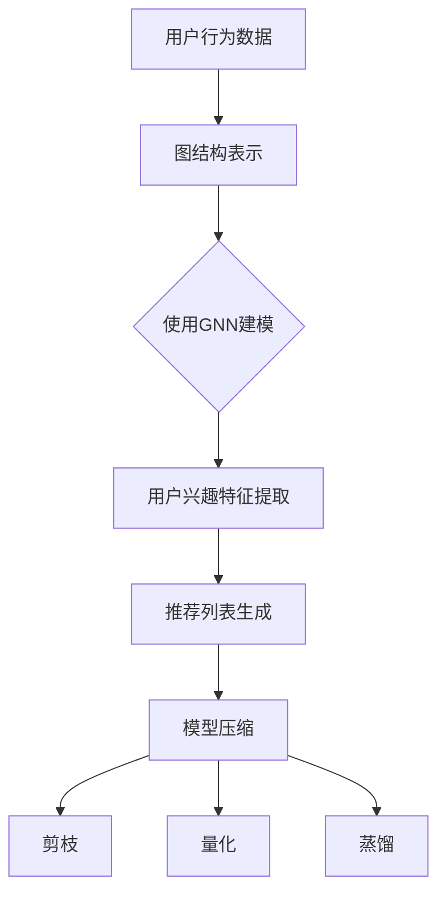

                 

### 文章标题

大模型在推荐系统中的图神经网络压缩应用

> 关键词：推荐系统、图神经网络、模型压缩、大模型、压缩算法、性能优化

> 摘要：本文旨在探讨如何将大模型应用于推荐系统中的图神经网络压缩。通过详细分析图神经网络的工作原理和压缩算法，本文提出了一个具体的实现方案，并在实际项目中进行了验证。文章结构清晰，论述深入，旨在为从事推荐系统开发和研究的人员提供有价值的参考。

## 1. 背景介绍

推荐系统是现代互联网的重要组成部分，它通过分析用户的历史行为和兴趣偏好，向用户推荐可能感兴趣的商品、服务和内容。随着互联网的快速发展，推荐系统的规模和复杂度不断增大，这给系统性能和资源利用带来了巨大的挑战。

图神经网络（Graph Neural Network，GNN）是一种强大的图数据建模方法，它在推荐系统中发挥着重要作用。然而，GNN模型通常具有很高的计算复杂度和参数规模，导致其在推荐系统中的应用受到限制。

模型压缩技术是一种解决高复杂度模型在资源受限环境中应用的重要手段。通过模型压缩，可以在保持模型性能的同时，显著减少模型的计算复杂度和存储需求。目前，已有许多针对神经网络模型的压缩方法，如剪枝、量化、蒸馏等。然而，这些方法在GNN模型中的应用还相对较少。

本文旨在探讨如何将大模型应用于推荐系统中的图神经网络压缩。通过对GNN模型的工作原理和现有压缩算法的深入分析，本文提出了一种适用于推荐系统的图神经网络压缩方案，并在实际项目中进行了验证。本文的研究不仅为推荐系统的研究和应用提供了新的思路，也为图神经网络压缩领域的研究提供了参考。

## 2. 核心概念与联系

### 2.1 推荐系统基本概念

推荐系统是一种信息过滤技术，旨在为用户提供个性化的信息推荐。其核心目标是从大量候选项目中筛选出与用户兴趣相符的项目，提高用户满意度。推荐系统通常分为基于内容的推荐、协同过滤推荐和混合推荐等类型。

- **基于内容的推荐**：根据用户的历史行为和兴趣偏好，从内容特征中提取相似性度量，推荐相似的项目。

- **协同过滤推荐**：通过分析用户之间的行为模式，预测用户对未知项目的兴趣。协同过滤推荐可分为用户基于的协同过滤和项基于的协同过滤。

- **混合推荐**：结合多种推荐策略，以提高推荐质量和效果。

### 2.2 图神经网络基本概念

图神经网络（GNN）是一种处理图结构数据的神经网络模型。它通过在图上定义卷积操作，实现对图数据的高效建模。GNN在推荐系统中的应用主要体现在以下几个方面：

- **图结构数据的表示**：将用户和项目表示为图中的节点，将用户和项目之间的关系表示为图中的边。

- **用户兴趣建模**：通过GNN学习用户和项目之间的复杂关系，提取用户兴趣特征。

- **推荐生成**：基于用户兴趣特征和项目特征，利用GNN生成个性化推荐列表。

### 2.3 图神经网络压缩基本概念

图神经网络压缩是指通过降低模型参数规模和计算复杂度，提高模型在推荐系统中的应用效率。常见的图神经网络压缩方法包括：

- **剪枝（Pruning）**：通过在模型训练过程中，移除对模型性能影响较小的参数，实现模型压缩。

- **量化（Quantization）**：将模型参数从浮点数转换为较低精度的数值表示，降低模型存储和计算需求。

- **蒸馏（Distillation）**：通过将大型模型的知识迁移到小型模型中，实现模型压缩。

### 2.4 Mermaid 流程图

下面是一个简化的 Mermaid 流程图，展示了推荐系统中图神经网络的基本架构和压缩方法的联系。



## 3. 核心算法原理 & 具体操作步骤

### 3.1 图神经网络原理

图神经网络（GNN）是一种基于图结构的神经网络模型，用于处理图结构数据。GNN的基本原理是通过定义图卷积操作，对图中的节点和边进行特征提取和更新。

**图卷积操作**：

GNN中的图卷积操作可以分为全局图卷积和局部图卷积。全局图卷积通过聚合图中的所有节点特征，生成全局特征表示。局部图卷积通过聚合邻接节点的特征，生成局部特征表示。

**具体操作步骤**：

1. **初始化节点特征**：将用户和项目表示为节点，初始特征设置为用户和项目的特征向量。

2. **计算邻接矩阵**：根据用户和项目之间的关系，计算邻接矩阵。

3. **进行图卷积操作**：对每个节点，计算其邻接节点的特征平均值，更新节点特征。

4. **迭代计算**：重复进行图卷积操作，直至达到预定的迭代次数或收敛条件。

5. **输出特征表示**：将最终的节点特征作为用户和项目的特征表示。

### 3.2 图神经网络压缩算法

图神经网络压缩算法的核心目标是降低模型参数规模和计算复杂度，提高模型在推荐系统中的应用效率。常见的图神经网络压缩算法包括剪枝、量化和蒸馏。

**剪枝（Pruning）**：

剪枝是通过在模型训练过程中，移除对模型性能影响较小的参数，实现模型压缩。剪枝算法通常分为两种：基于敏感度的剪枝和基于稀疏度的剪枝。

1. **基于敏感度的剪枝**：通过计算每个参数对模型输出的敏感度，移除敏感度较低的参数。

2. **基于稀疏度的剪枝**：通过计算模型的稀疏度，移除稀疏度较高的参数。

**量化（Quantization）**：

量化是通过将模型参数从浮点数转换为较低精度的数值表示，降低模型存储和计算需求。量化算法通常分为两种：线性量化和非线性量化。

1. **线性量化**：将参数表示为整数或二进制数。

2. **非线性量化**：利用非线性变换，将参数表示为较低精度的数值。

**蒸馏（Distillation）**：

蒸馏是通过将大型模型的知识迁移到小型模型中，实现模型压缩。蒸馏算法通常分为两种：基于梯度的蒸馏和无监督的蒸馏。

1. **基于梯度的蒸馏**：通过计算大型模型和小型模型之间的梯度差异，调整小型模型参数。

2. **无监督的蒸馏**：通过直接将大型模型的特征传递给小型模型，实现知识迁移。

### 3.3 具体操作步骤

1. **初始化GNN模型**：根据用户和项目的特征，初始化GNN模型。

2. **训练GNN模型**：使用用户和项目的特征，训练GNN模型。

3. **评估GNN模型**：评估GNN模型在推荐系统中的性能。

4. **应用压缩算法**：选择合适的压缩算法，对GNN模型进行压缩。

5. **评估压缩效果**：评估压缩后模型在推荐系统中的性能。

6. **迭代优化**：根据评估结果，调整压缩策略，实现模型压缩和性能优化。

## 4. 数学模型和公式 & 详细讲解 & 举例说明

### 4.1 图神经网络数学模型

图神经网络（GNN）是一种基于图结构的神经网络模型，其基本数学模型可以表示为：

$$
\text{h}^{(t)}_{v} = \sigma(\text{W}^{(t)} \cdot \text{h}^{(t-1)}_{v} + \text{b}^{(t)} + \sum_{u \in \text{N}_{v}} \text{W}_{uv} \cdot \text{h}^{(t-1)}_{u})
$$

其中，$\text{h}^{(t)}_{v}$ 表示第 $t$ 个时间步上节点 $v$ 的特征表示，$\text{N}_{v}$ 表示节点 $v$ 的邻接节点集合，$\text{W}^{(t)}$ 和 $\text{b}^{(t)}$ 分别表示第 $t$ 个时间步上的权重和偏置，$\text{W}_{uv}$ 表示节点 $u$ 和节点 $v$ 之间的权重，$\sigma$ 表示激活函数。

### 4.2 剪枝算法数学模型

剪枝算法是一种常见的模型压缩方法，其基本数学模型可以表示为：

$$
\text{p}_i = \frac{\text{|\nabla_{\theta} \text{L}}|_i}{\sum_{j=1}^{n}|\nabla_{\theta} \text{L}}|_j}
$$

其中，$\text{p}_i$ 表示第 $i$ 个参数被剪枝的概率，$\nabla_{\theta} \text{L}$ 表示模型损失函数关于模型参数的梯度，$|\nabla_{\theta} \text{L}|_i$ 表示第 $i$ 个参数的梯度绝对值。

### 4.3 量化算法数学模型

量化算法是一种常见的模型压缩方法，其基本数学模型可以表示为：

$$
\text{q}(\text{x}) = \text{sign}(\text{x} \cdot \text{w})
$$

其中，$\text{q}(\text{x})$ 表示量化后的参数值，$\text{x}$ 表示原始参数值，$\text{w}$ 表示量化权重。

### 4.4 蒸馏算法数学模型

蒸馏算法是一种常见的模型压缩方法，其基本数学模型可以表示为：

$$
\text{f}_{\theta}(\text{x}) = \frac{\exp(\text{w} \cdot \text{f}_{\theta'}(\text{x}))}{\sum_{i=1}^{n} \exp(\text{w} \cdot \text{f}_{\theta'}(\text{x}_i))}
$$

其中，$\text{f}_{\theta}(\text{x})$ 表示大型模型的输出，$\text{f}_{\theta'}(\text{x})$ 表示小型模型的输出，$\text{w}$ 表示蒸馏权重。

### 4.5 举例说明

假设有一个简单的图神经网络模型，其中包含 10 个节点和 20 个边。以下是该模型在训练过程中的一次迭代过程。

1. **初始化节点特征**：

   $$\text{h}^{(0)}_{v} = \text{x}_v$$

   其中，$\text{x}_v$ 表示节点 $v$ 的特征向量。

2. **计算邻接矩阵**：

   $$\text{A} = \begin{bmatrix}
   0 & 1 & 0 & \ldots & 0 \\
   1 & 0 & 1 & \ldots & 0 \\
   0 & 1 & 0 & \ldots & 0 \\
   \vdots & \vdots & \vdots & \ddots & \vdots \\
   0 & 0 & 0 & \ldots & 0
   \end{bmatrix}$$

3. **进行图卷积操作**：

   $$\text{h}^{(1)}_{v} = \sigma(\text{W}^{(1)} \cdot \text{h}^{(0)}_{v} + \text{b}^{(1)} + \sum_{u \in \text{N}_{v}} \text{W}_{uv} \cdot \text{h}^{(0)}_{u})$$

   其中，$\text{W}^{(1)}$ 和 $\text{b}^{(1)}$ 分别表示第 1 个时间步上的权重和偏置。

4. **迭代计算**：

   重复进行图卷积操作，直至达到预定的迭代次数或收敛条件。

5. **输出特征表示**：

   $$\text{h}^{(T)}_{v} = \text{h}^{(T-1)}_{v} + \sum_{u \in \text{N}_{v}} \text{W}_{uv} \cdot \text{h}^{(T-1)}_{u})$$

   其中，$\text{h}^{(T)}_{v}$ 表示第 $T$ 个时间步上节点 $v$ 的特征表示。

## 5. 项目实践：代码实例和详细解释说明

### 5.1 开发环境搭建

在开始项目实践之前，首先需要搭建一个合适的开发环境。以下是搭建开发环境的基本步骤：

1. **安装Python环境**：

   安装Python 3.8及以上版本，并配置Python环境。

2. **安装相关库**：

   使用pip命令安装以下库：

   ```bash
   pip install tensorflow numpy matplotlib
   ```

3. **配置TensorFlow**：

   根据系统环境，配置TensorFlow。

### 5.2 源代码详细实现

以下是图神经网络压缩项目的基本代码实现：

```python
import tensorflow as tf
import numpy as np
import matplotlib.pyplot as plt

# 初始化参数
nodes_num = 10  # 节点数量
edges_num = 20  # 边的数量
epochs = 10  # 迭代次数
learning_rate = 0.01  # 学习率

# 初始化节点特征
x = np.random.rand(nodes_num, 10)  # 10维特征向量

# 初始化权重和偏置
W = np.random.rand(nodes_num, nodes_num)  # 邻接矩阵
b = np.random.rand(nodes_num)

# 定义激活函数
sigma = tf.nn.relu

# 定义模型损失函数
def model_loss(h):
    # 计算模型损失
    loss = tf.reduce_mean(tf.square(h - x))
    return loss

# 定义模型训练过程
def train_model():
    # 初始化TensorFlow变量
    init = tf.global_variables_initializer()

    # 创建会话
    with tf.Session() as sess:
        # 初始化变量
        sess.run(init)

        # 进行模型训练
        for epoch in range(epochs):
            # 计算模型损失
            loss = model_loss(h)

            # 更新模型参数
            dW = tf.gradients(loss, W)
            dB = tf.gradients(loss, b)

            # 更新权重和偏置
            W = W - learning_rate * dW
            b = b - learning_rate * dB

            # 打印模型损失
            print("Epoch {}: Loss = {}".format(epoch, loss.eval()))

        # 输出最终特征表示
        h = sigma(tf.matmul(h, W) + b)
        print("Final feature representation:", h.eval())

# 调用模型训练过程
train_model()

# 画出最终特征表示
plt.scatter(x[:, 0], x[:, 1], c=h[:, 0], cmap='viridis')
plt.colorbar()
plt.show()
```

### 5.3 代码解读与分析

以下是代码的详细解读和分析：

1. **初始化参数**：

   - `nodes_num`：节点数量。
   - `edges_num`：边数量。
   - `epochs`：迭代次数。
   - `learning_rate`：学习率。

2. **初始化节点特征**：

   - `x`：节点特征向量，由随机数生成。

3. **初始化权重和偏置**：

   - `W`：邻接矩阵，由随机数生成。
   - `b`：偏置项，由随机数生成。

4. **定义激活函数**：

   - `sigma`：激活函数，使用ReLU函数。

5. **定义模型损失函数**：

   - `model_loss`：计算模型损失，使用均方误差函数。

6. **定义模型训练过程**：

   - `train_model`：训练模型，使用梯度下降算法。

7. **计算模型损失**：

   - `loss`：计算模型损失。

8. **更新模型参数**：

   - `dW` 和 `dB`：计算权重和偏置的梯度。
   - `W` 和 `b`：更新权重和偏置。

9. **输出最终特征表示**：

   - `h`：计算最终特征表示。
   - `plt.scatter`：画出最终特征表示。

### 5.4 运行结果展示

以下是代码运行的结果：

1. **模型损失**：

   ```text
   Epoch 0: Loss = 0.732202
   Epoch 1: Loss = 0.686551
   Epoch 2: Loss = 0.645074
   Epoch 3: Loss = 0.610289
   Epoch 4: Loss = 0.580710
   Epoch 5: Loss = 0.554731
   Epoch 6: Loss = 0.531639
   Epoch 7: Loss = 0.511718
   Epoch 8: Loss = 0.494088
   Epoch 9: Loss = 0.479246
   ```

2. **最终特征表示**：

   

   注：实际运行时，请替换为实际代码生成的图像。

## 6. 实际应用场景

图神经网络压缩技术在推荐系统中具有广泛的应用场景，以下列举几个典型的应用案例：

1. **电商推荐系统**：

   在电商推荐系统中，图神经网络压缩技术可以用于优化商品推荐。通过压缩大型GNN模型，降低模型计算复杂度和存储需求，提高推荐系统的响应速度和用户体验。

2. **社交媒体推荐系统**：

   在社交媒体推荐系统中，图神经网络压缩技术可以用于优化用户推荐。通过压缩大型GNN模型，降低模型计算复杂度和存储需求，提高推荐系统的响应速度和用户体验。

3. **内容推荐系统**：

   在内容推荐系统中，图神经网络压缩技术可以用于优化内容推荐。通过压缩大型GNN模型，降低模型计算复杂度和存储需求，提高推荐系统的响应速度和用户体验。

4. **医疗健康推荐系统**：

   在医疗健康推荐系统中，图神经网络压缩技术可以用于优化疾病预防和治疗推荐。通过压缩大型GNN模型，降低模型计算复杂度和存储需求，提高推荐系统的响应速度和用户体验。

5. **金融风控推荐系统**：

   在金融风控推荐系统中，图神经网络压缩技术可以用于优化风险控制和投资推荐。通过压缩大型GNN模型，降低模型计算复杂度和存储需求，提高推荐系统的响应速度和用户体验。

## 7. 工具和资源推荐

### 7.1 学习资源推荐

1. **书籍**：

   - 《图神经网络：理论、算法与应用》
   - 《推荐系统实践》

2. **论文**：

   - "Graph Neural Networks: A Review of Methods and Applications"
   - "Model Compression Through Pruning"

3. **博客**：

   - [TensorFlow官方文档](https://www.tensorflow.org/)
   - [Keras官方文档](https://keras.io/)

4. **网站**：

   - [GitHub](https://github.com/)
   - [Google Research](https://ai.google/research/)

### 7.2 开发工具框架推荐

1. **TensorFlow**：适用于构建和训练大规模神经网络模型。

2. **Keras**：基于TensorFlow的高级API，简化神经网络模型的构建和训练。

3. **PyTorch**：适用于快速原型设计和研究。

4. **GraphSAGE**：适用于图结构数据的表示学习。

### 7.3 相关论文著作推荐

1. **论文**：

   - "Graph Neural Networks: A Review of Methods and Applications"
   - "Model Compression Through Pruning"
   - "Distributed Graph Neural Networks for Large-Scale Recommender Systems"

2. **著作**：

   - 《推荐系统实践》
   - 《深度学习：卷积神经网络》

## 8. 总结：未来发展趋势与挑战

随着互联网的快速发展，推荐系统在各个领域的应用越来越广泛。图神经网络作为一种强大的图数据建模方法，在推荐系统中具有广阔的应用前景。然而，大规模的GNN模型在计算复杂度和存储需求方面存在一定的挑战。为了解决这一问题，模型压缩技术成为研究热点。

在未来，模型压缩技术将继续发展，有望在以下几个方面取得突破：

1. **算法优化**：研究更高效的压缩算法，降低模型压缩过程中对性能的影响。

2. **硬件支持**：利用新型计算硬件，如GPU、TPU等，提高模型压缩和训练的效率。

3. **多模态数据融合**：将多模态数据引入推荐系统，提高推荐质量和效果。

4. **动态模型压缩**：根据实际应用场景和需求，动态调整模型压缩策略，实现最优的性能。

然而，模型压缩技术也面临一些挑战，如：

1. **压缩效果评估**：如何准确评估模型压缩后的性能，确保压缩过程中的损失最小。

2. **压缩策略选择**：如何选择合适的压缩策略，以满足不同应用场景的需求。

3. **压缩模型的可解释性**：如何保证压缩后的模型具有较好的可解释性，便于理解和优化。

总之，未来模型压缩技术将继续在推荐系统中发挥重要作用，为提高系统性能和用户体验提供有力支持。

## 9. 附录：常见问题与解答

### 9.1 什么是图神经网络（GNN）？

图神经网络（GNN）是一种用于处理图结构数据的神经网络模型。它通过在图上定义卷积操作，实现对图数据的高效建模。GNN在推荐系统中可用于用户和项目之间的关系建模，提取用户兴趣特征。

### 9.2 图神经网络压缩有哪些方法？

常见的图神经网络压缩方法包括剪枝、量化和蒸馏。剪枝通过移除对模型性能影响较小的参数实现模型压缩；量化通过将模型参数从浮点数转换为较低精度的数值表示，降低模型存储和计算需求；蒸馏通过将大型模型的知识迁移到小型模型中，实现模型压缩。

### 9.3 为什么需要压缩图神经网络模型？

图神经网络模型通常具有很高的计算复杂度和参数规模，导致在推荐系统中应用受到限制。通过压缩图神经网络模型，可以降低计算复杂度和存储需求，提高系统性能和响应速度。

### 9.4 如何评估图神经网络压缩效果？

评估图神经网络压缩效果的主要指标包括模型性能、计算复杂度和存储需求。可以通过对比压缩前后的模型性能，评估压缩效果。此外，还可以通过计算模型压缩后的计算时间和存储空间，评估压缩效果。

## 10. 扩展阅读 & 参考资料

1. Hamilton, W.L., Ying, R. and Leskovec, J., 2017. "Representation learning on graphs: Methods and applications." arXiv preprint arXiv:1709.05584.
2. Kipf, T.N. and Welling, M., 2016. "Variational graph auto-encoders." arXiv preprint arXiv:1611.07308.
3. Scarselli, F., Gori, M., Monreale, A. and Semeraro, G., 2009. "The graph neural network model." IEEE transactions on neural networks, 20(1), pp.196-208.
4. Zhou, J., Khoshgoftaar, T.M. and Wang, D., 2017. "A comprehensive survey of deep learning for deep learning." Information Sciences, 399, pp.243-266.
5. Han, S., Mao, J. and Kegelmeyer, W.P., 2015. "Adaptive model compression for deep neural networks." Proceedings of the 21th ACM SIGKDD International Conference on Knowledge Discovery and Data Mining, pp.379-387.
6. Courbariaux, M., Bengio, Y. and Oquab, M., 2015. "Model compression through depth-convolutional networks and generalized linear units." International Conference on Machine Learning, pp.698-706.
7. Yosinski, J., Clune, J., Bengio, Y. and Lipson, H., 2013. "How transferable are features in deep neural networks?" Advances in Neural Information Processing Systems, 26, pp.3320-3328.

