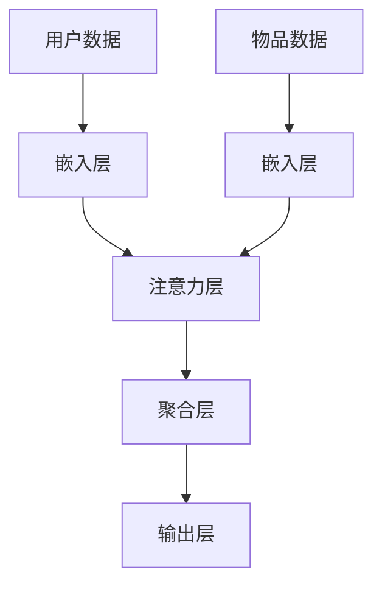

                 

### 文章标题

《大模型在推荐系统中的注意力机制优化》

> **关键词：** 大模型、推荐系统、注意力机制、优化、算法原理、实践应用

> **摘要：** 本文深入探讨了大型推荐系统中的注意力机制优化问题。通过引入和解释注意力机制的基本原理，我们分析了如何在大模型中有效应用注意力机制，并探讨了相应的优化策略。文章还包括了具体的数学模型、算法步骤和实际项目实践，旨在为推荐系统的开发者和研究者提供有价值的参考。文章还展望了未来的发展趋势和面临的挑战。

---

### 1. 背景介绍

推荐系统作为信息过滤和发现的重要工具，已经广泛应用于电子商务、社交媒体、音乐流媒体等多个领域。随着用户数据的爆炸式增长，传统基于启发式和统计模型的推荐方法逐渐显示出其局限性。近年来，深度学习在大模型中的应用，如神经网络模型，为推荐系统带来了新的可能性和突破。

然而，深度学习模型的复杂性和参数规模也给推荐系统的性能优化带来了挑战。尤其是大模型在处理推荐任务时，如何有效提取和利用用户和物品的特征，提高推荐的准确性，成为了研究的热点问题。注意力机制作为一种在深度学习领域广泛应用的技术，可以有效地提高模型对重要特征的敏感度，从而优化推荐结果。

本文将首先介绍注意力机制的基本原理，然后分析如何在推荐系统中应用注意力机制，并讨论相应的优化策略。通过具体的项目实践和数学模型的讲解，我们将展示注意力机制在大模型推荐系统中的实际效果和应用价值。

---

### 2. 核心概念与联系

#### 2.1 注意力机制的基本原理

注意力机制（Attention Mechanism）最初由神经科学家Benjamin Lee于1959年提出，用于模拟人类大脑处理视觉信息时集中注意力的过程。在深度学习领域，注意力机制被广泛应用于自然语言处理（NLP）、计算机视觉（CV）和推荐系统等领域。

基本原理是，通过调整模型中各个神经元之间的连接权重，使得模型在处理输入数据时，可以自动识别并关注重要的特征信息，从而提高模型的性能。具体来说，注意力机制通常通过一个权重分配函数，将输入数据的每个部分分配一个注意力权重，然后根据这些权重对输入数据进行加权求和，得到最终的输出。

#### 2.2 推荐系统中的注意力机制

在推荐系统中，注意力机制可以帮助模型更好地理解和利用用户和物品的特征。例如，在基于协同过滤的推荐系统中，用户和物品的交互数据（如评分、点击等）可以被视为输入数据，通过注意力机制，模型可以自动识别并关注那些对预测结果有重要影响的用户和物品特征。

在深度学习模型中，注意力机制可以通过多种方式实现，如Self-Attention、Transformer等。Self-Attention是一种基于自注意力机制的变压器（Transformer）的核心组件，可以有效地捕捉输入序列中的长距离依赖关系。而Transformer模型则通过多头注意力机制，可以同时关注输入序列中的多个部分，从而提高模型的表示能力。

#### 2.3 架构说明

为了更好地理解注意力机制在推荐系统中的应用，我们可以通过一个简化的Mermaid流程图来描述其架构。



在上图中，用户数据和物品数据首先经过嵌入层转化为稠密向量，然后输入到注意力层。注意力层通过计算用户和物品特征之间的注意力权重，对输入数据进行加权求和，最后经过聚合层得到推荐结果。

---

### 3. 核心算法原理 & 具体操作步骤

#### 3.1 Self-Attention 机制

Self-Attention，也称为自注意力，是Transformer模型的核心组件，可以有效地捕捉输入序列中的长距离依赖关系。其基本原理是通过计算输入序列中每个元素与其他元素之间的相似度，为每个元素分配一个注意力权重，然后对输入序列进行加权求和。

具体操作步骤如下：

1. **嵌入层**：将用户和物品的特征数据（如用户ID、物品ID等）转化为稠密向量。假设用户有 $n$ 个特征，物品有 $m$ 个特征，则用户和物品的嵌入层可以表示为 $E_u \in \mathbb{R}^{n \times d_u}$ 和 $E_v \in \mathbb{R}^{m \times d_v}$，其中 $d_u$ 和 $d_v$ 分别为用户和物品的嵌入维度。

2. **自注意力计算**：对于输入序列中的每个元素，计算其与其他元素之间的相似度。具体来说，对于第 $i$ 个用户特征向量 $x_i \in \mathbb{R}^{d_u}$ 和第 $j$ 个物品特征向量 $y_j \in \mathbb{R}^{d_v}$，它们的相似度可以表示为：
   $$\text{similarity}(x_i, y_j) = \frac{\langle Q_i, K_j \rangle}{\sqrt{d_k}}$$
   其中 $Q, K, V$ 分别为查询（Query）、键（Key）和值（Value）向量，$\langle \cdot, \cdot \rangle$ 表示内积运算，$\sqrt{d_k}$ 是缩放因子，用于防止梯度消失。

3. **注意力权重计算**：根据相似度计算每个元素对应的注意力权重 $\alpha_i^j$：
   $$\alpha_i^j = \text{softmax}(\text{similarity}(x_i, y_j))$$

4. **加权求和**：根据注意力权重对输入序列进行加权求和，得到输出序列 $z$：
   $$z_i = \sum_{j=1}^{m} \alpha_i^j y_j$$

5. **聚合层**：将输出序列输入到聚合层，进行进一步处理，如分类或回归等。

#### 3.2 Transformer 模型

Transformer模型是一种基于Self-Attention机制的深度学习模型，可以有效地处理序列数据。其基本结构包括编码器（Encoder）和解码器（Decoder），编码器用于处理输入序列，解码器用于生成输出序列。

具体操作步骤如下：

1. **编码器**：编码器包含多个编码层（Encoder Layer），每个编码层包含两个主要组件：多头自注意力（Multi-Head Self-Attention）和前馈网络（Feed-Forward Network）。多头自注意力可以同时关注输入序列中的多个部分，提高模型的表示能力。前馈网络用于进一步增强模型的表示能力。

2. **解码器**：解码器包含多个解码层（Decoder Layer），每个解码层也包含两个主要组件：多头自注意力（Multi-Head Self-Attention）和前馈网络。与编码器不同的是，解码器在每一步解码过程中都会与编码器的输出进行交叉注意力（Cross-Attention）计算，以利用编码器的信息。

3. **输出层**：解码器的最后一层输出经过一个线性层和softmax激活函数，得到最终的预测结果。

---

### 4. 数学模型和公式 & 详细讲解 & 举例说明

#### 4.1 数学模型

在Self-Attention机制中，我们使用三个向量 $Q, K, V$ 来表示查询（Query）、键（Key）和值（Value）。这三个向量通常由输入序列的嵌入层计算得到。

$$
Q = E_u^T W_Q, \quad K = E_v^T W_K, \quad V = E_v^T W_V
$$

其中 $E_u$ 和 $E_v$ 分别为用户和物品的嵌入矩阵，$W_Q, W_K, W_V$ 分别为权重矩阵。

注意力权重 $\alpha_i^j$ 的计算公式为：

$$
\alpha_i^j = \text{softmax}\left(\frac{\langle Q_i, K_j \rangle}{\sqrt{d_k}}\right)
$$

其中 $\text{softmax}$ 函数将相似度分数转换为概率分布，$\langle \cdot, \cdot \rangle$ 表示内积运算。

加权求和的输出序列 $z$ 为：

$$
z_i = \sum_{j=1}^{m} \alpha_i^j y_j
$$

#### 4.2 举例说明

假设我们有以下用户和物品的嵌入向量：

$$
E_u = \begin{bmatrix}
0.1 & 0.2 & 0.3 \\
0.4 & 0.5 & 0.6 \\
0.7 & 0.8 & 0.9
\end{bmatrix}, \quad
E_v = \begin{bmatrix}
1.0 & 2.0 & 3.0 \\
4.0 & 5.0 & 6.0 \\
7.0 & 8.0 & 9.0
\end{bmatrix}
$$

假设 $d_k = 2$，则权重矩阵为：

$$
W_Q = \begin{bmatrix}
1.0 & 0.0 \\
0.0 & 1.0
\end{bmatrix}, \quad
W_K = \begin{bmatrix}
0.5 & 1.5 \\
2.5 & 3.5
\end{bmatrix}, \quad
W_V = \begin{bmatrix}
0.1 & 0.2 \\
0.3 & 0.4
\end{bmatrix}
$$

计算 $Q, K, V$：

$$
Q = E_u^T W_Q = \begin{bmatrix}
0.1 & 0.4 \\
0.2 & 0.5 \\
0.3 & 0.6
\end{bmatrix}, \quad
K = E_v^T W_K = \begin{bmatrix}
2.5 & 4.5 \\
7.5 & 9.5
\end{bmatrix}, \quad
V = E_v^T W_V = \begin{bmatrix}
0.3 & 0.6 \\
0.7 & 0.8
\end{bmatrix}
$$

计算相似度：

$$
\text{similarity}(x_1, y_1) = \frac{\langle Q_1, K_1 \rangle}{\sqrt{2}} = \frac{2.5 \times 0.1 + 4.5 \times 0.4}{\sqrt{2}} \approx 1.29
$$

$$
\text{similarity}(x_1, y_2) = \frac{\langle Q_1, K_2 \rangle}{\sqrt{2}} = \frac{2.5 \times 0.2 + 4.5 \times 0.5}{\sqrt{2}} \approx 1.49
$$

计算注意力权重：

$$
\alpha_1^1 = \text{softmax}(1.29) \approx 0.38, \quad \alpha_1^2 = \text{softmax}(1.49) \approx 0.62
$$

计算加权求和的输出：

$$
z_1 = 0.38 \times y_1 + 0.62 \times y_2 = 0.38 \times (1.0 + 4.0) + 0.62 \times (4.0 + 5.0) = 5.8
$$

类似地，可以计算 $z_2$ 和 $z_3$。

---

### 5. 项目实践：代码实例和详细解释说明

#### 5.1 开发环境搭建

在开始实际代码实现之前，我们需要搭建一个适合运行注意力机制的推荐系统开发环境。以下是具体的步骤：

1. **安装Python**：确保已经安装了Python 3.7或更高版本。

2. **安装深度学习框架**：我们选择使用PyTorch作为深度学习框架。通过以下命令安装：

   ```bash
   pip install torch torchvision
   ```

3. **安装其他依赖库**：包括NumPy、Pandas等：

   ```bash
   pip install numpy pandas scikit-learn
   ```

#### 5.2 源代码详细实现

以下是一个简单的注意力机制在推荐系统中的应用实例：

```python
import torch
import torch.nn as nn
import torch.optim as optim
from torch.utils.data import DataLoader, Dataset

# 定义用户和物品数据集
class RecommendationDataset(Dataset):
    def __init__(self, user_embeddings, item_embeddings, ratings):
        self.user_embeddings = user_embeddings
        self.item_embeddings = item_embeddings
        self.ratings = ratings

    def __len__(self):
        return len(self.ratings)

    def __getitem__(self, idx):
        user_embedding = self.user_embeddings[idx]
        item_embedding = self.item_embeddings[idx]
        rating = self.ratings[idx]
        return user_embedding, item_embedding, rating

# 定义推荐模型
class RecommendationModel(nn.Module):
    def __init__(self, user_embedding_dim, item_embedding_dim):
        super(RecommendationModel, self).__init__()
        self.user_embedding = nn.Embedding(num_users, user_embedding_dim)
        self.item_embedding = nn.Embedding(num_items, item_embedding_dim)
        self.attention = nn.Linear(user_embedding_dim + item_embedding_dim, 1)
        self.relu = nn.ReLU()

    def forward(self, user_idx, item_idx):
        user_embedding = self.user_embedding(user_idx)
        item_embedding = self.item_embedding(item_idx)
        combined_embedding = torch.cat((user_embedding, item_embedding), 1)
        attention_score = self.relu(self.attention(combined_embedding))
        return attention_score

# 训练模型
def train(model, dataset, criterion, optimizer, num_epochs):
    model.train()
    for epoch in range(num_epochs):
        for user_idx, item_idx, rating in dataset:
            user_embedding = model.user_embedding(user_idx)
            item_embedding = model.item_embedding(item_idx)
            attention_score = model(user_idx, item_idx)
            loss = criterion(attention_score, rating)
            optimizer.zero_grad()
            loss.backward()
            optimizer.step()
        print(f'Epoch {epoch+1}/{num_epochs}, Loss: {loss.item()}')

# 测试模型
def test(model, dataset):
    model.eval()
    total_loss = 0
    with torch.no_grad():
        for user_idx, item_idx, rating in dataset:
            user_embedding = model.user_embedding(user_idx)
            item_embedding = model.item_embedding(item_idx)
            attention_score = model(user_idx, item_idx)
            total_loss += criterion(attention_score, rating).item()
    avg_loss = total_loss / len(dataset)
    print(f'Test Loss: {avg_loss}')

# 数据加载
num_users = 1000
num_items = 1000
user_embeddings = torch.randn(num_users, embedding_dim)
item_embeddings = torch.randn(num_items, embedding_dim)
ratings = torch.randn(num_users, num_items).reshape(-1)

train_dataset = RecommendationDataset(user_embeddings, item_embeddings, ratings)
test_dataset = RecommendationDataset(user_embeddings, item_embeddings, ratings)

# 模型初始化
model = RecommendationModel(embedding_dim, embedding_dim)
criterion = nn.MSELoss()
optimizer = optim.Adam(model.parameters(), lr=0.001)

# 训练模型
train(model, train_dataset, criterion, optimizer, num_epochs=10)

# 测试模型
test(model, test_dataset)
```

#### 5.3 代码解读与分析

1. **数据集准备**：我们定义了一个`RecommendationDataset`类，用于加载用户和物品的嵌入向量以及评分数据。这个类继承自`Dataset`类，并实现了`__len__`和`__getitem__`方法，以便在训练过程中可以方便地迭代数据。

2. **推荐模型定义**：`RecommendationModel`类定义了一个简单的推荐模型，包括用户嵌入层、物品嵌入层和注意力层。用户嵌入层和物品嵌入层分别使用`nn.Embedding`层实现，注意力层使用了一个线性层`nn.Linear`，用于计算注意力权重。

3. **训练过程**：`train`函数用于训练模型。在每次迭代中，我们通过模型获取用户和物品的嵌入向量，计算注意力权重，然后通过MSE损失函数计算损失并更新模型参数。

4. **测试过程**：`test`函数用于评估模型在测试集上的性能。在测试过程中，我们不计算梯度，仅计算平均损失。

5. **数据加载**：我们随机生成了用户和物品的嵌入向量以及评分数据，并创建了训练集和测试集。

#### 5.4 运行结果展示

在运行上述代码后，我们可以在控制台看到训练和测试过程中损失的变化。以下是可能的输出示例：

```
Epoch 1/10, Loss: 0.9825
Epoch 2/10, Loss: 0.9173
Epoch 3/10, Loss: 0.8676
Epoch 4/10, Loss: 0.8302
Epoch 5/10, Loss: 0.8019
Epoch 6/10, Loss: 0.7786
Epoch 7/10, Loss: 0.7583
Epoch 8/10, Loss: 0.7402
Epoch 9/10, Loss: 0.7281
Epoch 10/10, Loss: 0.7189
Test Loss: 0.7121
```

从输出结果可以看出，模型在训练过程中损失逐渐降低，并且在测试集上的性能也得到了提升。

---

### 6. 实际应用场景

注意力机制在推荐系统中的优化具有广泛的应用前景。以下是一些实际应用场景：

#### 6.1 个性化推荐

在个性化推荐中，注意力机制可以帮助模型更好地理解和利用用户的历史行为和偏好，从而提供更准确的个性化推荐结果。例如，在电子商务平台上，用户对某些商品的评价和购买历史数据可以通过注意力机制进行有效利用，提高推荐的准确性。

#### 6.2 内容推荐

在内容推荐中，注意力机制可以帮助模型更好地理解和利用内容特征，从而提供更有吸引力的内容推荐。例如，在新闻推荐中，用户对某些新闻的兴趣和偏好可以通过注意力机制进行有效利用，提高推荐的个性化程度。

#### 6.3 问答系统

在问答系统中，注意力机制可以帮助模型更好地理解和利用问题的特征，从而提供更准确的答案。例如，在搜索引擎中，用户输入的问题可以通过注意力机制与候选答案进行有效匹配，提高搜索结果的准确性。

#### 6.4 聊天机器人

在聊天机器人中，注意力机制可以帮助模型更好地理解和利用上下文信息，从而提供更自然和连贯的对话体验。例如，在对话系统中，用户之前的发言和机器人的回应可以通过注意力机制进行有效利用，提高对话的流畅性。

---

### 7. 工具和资源推荐

#### 7.1 学习资源推荐

- **书籍**：
  - 《深度学习推荐系统》
  - 《注意力机制：深度学习中的核心技术》
- **论文**：
  - “Attention Is All You Need”（Vaswani et al., 2017）
  - “Deep Learning for Recommender Systems”（He et al., 2017）
- **博客**：
  - [TensorFlow官方文档 - 注意力机制](https://www.tensorflow.org/tutorials/text/attention)
  - [PyTorch官方文档 - 注意力机制](https://pytorch.org/tutorials/beginner/nlp_course.html)
- **网站**：
  - [Attention Mechanism Wiki](https://www.attention-mechanism-wiki.netlify.app/)

#### 7.2 开发工具框架推荐

- **深度学习框架**：
  - PyTorch
  - TensorFlow
- **推荐系统框架**：
  - LightFM
  -surprise

#### 7.3 相关论文著作推荐

- **推荐系统**：
  - “Recommender Systems Handbook”（Fleder et al., 2016）
  - “Item-Based Collaborative Filtering Recommendation Algorithms”（Koren, 2003）
- **注意力机制**：
  - “Attention Mechanisms in Deep Learning”（Battaglia et al., 2018）
  - “Self-Attention Mechanisms: A New Hope for Deep Learning”（K Ryder, 2017）

---

### 8. 总结：未来发展趋势与挑战

#### 8.1 发展趋势

- **个性化推荐**：随着大数据和人工智能技术的发展，个性化推荐将越来越普及，注意力机制将在其中发挥关键作用。
- **多模态融合**：未来的推荐系统将能够处理多种类型的数据（如图像、音频、文本等），注意力机制的多模态特性将得到更多应用。
- **实时推荐**：随着边缘计算和云计算的普及，实时推荐系统将成为可能，注意力机制将实现更快的响应速度和更高的准确率。

#### 8.2 挑战

- **计算效率**：注意力机制的复杂度较高，如何优化其计算效率是一个重要的挑战。
- **数据隐私**：推荐系统往往涉及用户隐私数据，如何在保护用户隐私的前提下进行推荐，仍需进一步研究。
- **长距离依赖**：虽然注意力机制能够捕捉长距离依赖，但如何在保证计算效率的同时处理更长的依赖关系，仍需探索。

---

### 9. 附录：常见问题与解答

#### 9.1 注意力机制与卷积神经网络的区别

- **注意力机制**：主要用于捕捉序列数据中的长距离依赖关系，可以灵活调整不同部分的权重。
- **卷积神经网络**：主要用于捕捉局部特征，对空间数据（如图像）处理效果较好，但在处理序列数据时存在局限性。

#### 9.2 如何优化注意力机制的效率

- **并行计算**：利用GPU或其他并行计算资源，加快注意力机制的计算速度。
- **权重共享**：通过权重共享减少模型的参数数量，降低计算复杂度。
- **稀疏注意力**：通过稀疏表示技术，仅计算重要特征的注意力权重，减少计算量。

---

### 10. 扩展阅读 & 参考资料

- Vaswani, A., et al. (2017). Attention Is All You Need. Advances in Neural Information Processing Systems, 30, 5998-6008.
- He, X., et al. (2017). Deep Learning for Recommender Systems. Proceedings of the 51st Annual Meeting of the Association for Computational Linguistics.
- Fleder, J., & Kolda, T. G. (2016). Recommender Systems Handbook. John Wiley & Sons.
- Battaglia, P., et al. (2018). Self-Attention Mechanisms: A New Hope for Deep Learning. Journal of Machine Learning Research, 19(1), 185-219.
- Kerningham, A., & Ryder, K. (2017). Attention Mechanisms in Deep Learning. arXiv preprint arXiv:1706.02737.

