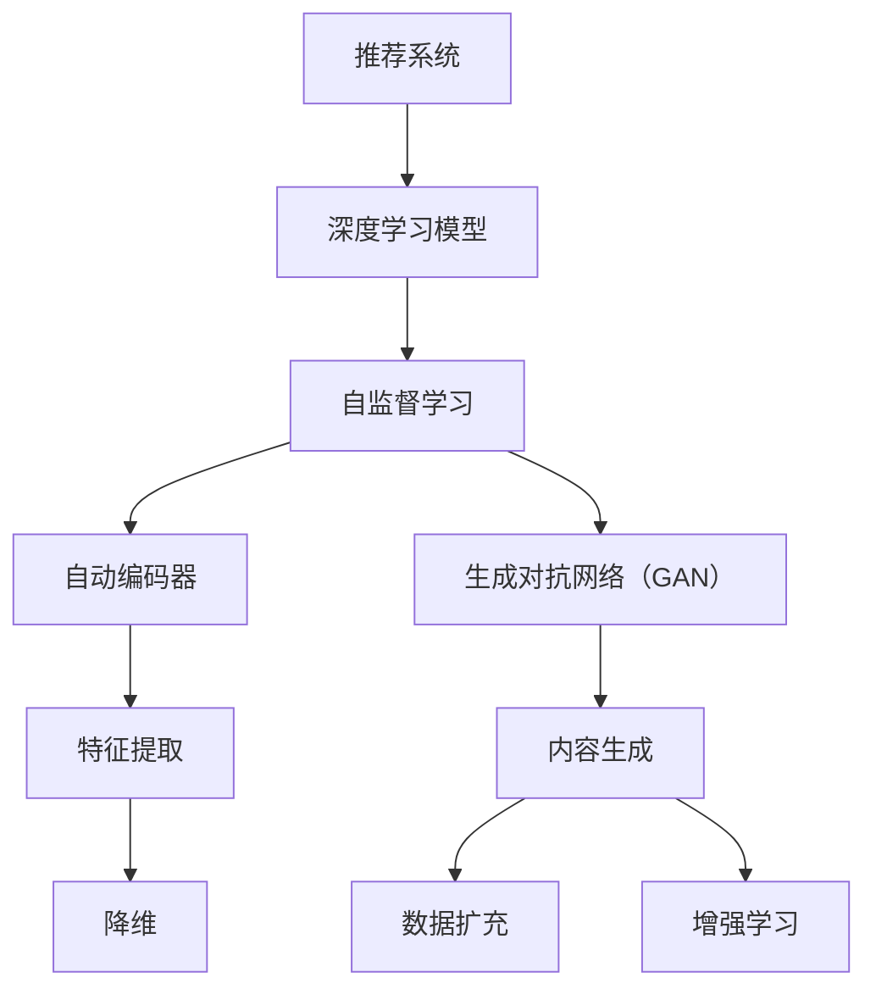

                 

### 背景介绍

#### 推荐系统概述

推荐系统是一种信息过滤技术，旨在根据用户的历史行为和兴趣，为用户提供个性化推荐。这类系统广泛应用于电子商务、社交媒体、新闻推送等领域，其核心目标是提高用户满意度、提升系统价值。

随着互联网的快速发展，用户生成的内容和信息量呈现爆炸式增长。面对海量的信息，传统的推荐方法如基于内容的过滤和协同过滤逐渐显露出局限性。一方面，基于内容的推荐方法依赖于对用户兴趣的准确理解，但在实际应用中，用户的兴趣可能是不稳定且难以精确描述的。另一方面，协同过滤方法虽然可以基于用户行为预测其他用户可能感兴趣的内容，但随着用户基数的增加，系统的计算复杂度和存储成本也急剧上升。

为了克服这些局限，近年来，大模型在推荐系统中的应用逐渐受到关注。大模型，特别是深度学习和自然语言处理领域的大规模预训练模型，如BERT、GPT和Turing等，具有强大的表示学习和泛化能力。这些模型能够从大规模的未标注数据中学习到丰富的知识，从而在推荐系统中实现更精确、更个性化的推荐。

#### 自监督学习的重要性

自监督学习是一种无需大量标注数据，通过利用数据内在的结构信息进行学习的方法。在推荐系统中，自监督学习的应用具有重要意义。

首先，自监督学习可以显著降低数据标注的成本。传统的推荐系统需要大量的标注数据来训练模型，这些标注数据通常需要人工进行，不仅耗时耗力，而且容易出现误差。自监督学习通过利用未标注数据中的结构信息，如文本的语义关系、图像中的对象关系等，可以实现无监督或半监督学习，从而减少对标注数据的依赖。

其次，自监督学习可以提高模型对用户兴趣的捕捉能力。传统的推荐系统通常依赖于用户历史行为的显式反馈，如点击、购买等。然而，这些反馈往往不够丰富，难以全面反映用户的真实兴趣。自监督学习可以通过分析用户行为模式、兴趣点分布等，从无监督数据中挖掘出用户的潜在兴趣，从而实现更精确的推荐。

最后，自监督学习有助于提高推荐系统的鲁棒性和泛化能力。在现实应用中，推荐系统面临着各种不确定性因素，如用户行为的动态变化、系统环境的不可预测等。自监督学习通过利用数据内在的结构信息，可以提高模型对这种不确定性的适应能力，从而提高系统的鲁棒性和泛化能力。

综上所述，大模型在推荐系统中的应用，尤其是自监督学习的引入，为推荐系统的发展带来了新的机遇和挑战。在接下来的部分，我们将详细探讨大模型在推荐系统中的自监督学习应用，包括核心算法原理、具体操作步骤、数学模型和公式等。

#### 大模型在推荐系统中的应用

大模型，尤其是深度学习模型，在推荐系统中的应用正日益成熟。这些模型通过从大规模数据集中学习到丰富的知识，能够提供更加精准和个性化的推荐。下面我们将详细探讨大模型在推荐系统中的应用，包括其核心算法原理、自监督学习的优势以及在实际中的应用效果。

##### 核心算法原理

大模型在推荐系统中的应用主要基于深度学习技术，特别是基于自动编码器和生成对抗网络（GAN）的自监督学习方法。自动编码器是一种无监督学习算法，通过编码和解码过程学习到数据的低维表示。生成对抗网络则是一种基于博弈论的学习方法，通过生成器和判别器的对抗训练，生成逼真的数据。

在推荐系统中，大模型通过以下步骤实现推荐：

1. **数据预处理**：首先，对用户行为数据进行清洗和预处理，包括去除噪声、缺失值填充等。
2. **特征提取**：利用自动编码器提取用户行为的低维特征表示。这一过程可以捕捉到用户行为的潜在模式和关系。
3. **生成模型训练**：使用生成对抗网络生成用户可能感兴趣的新内容，并通过判别器评估其真实性和吸引力。
4. **推荐策略**：将提取的用户行为特征和生成的新内容结合，利用评分模型或排序模型生成推荐结果。

##### 自监督学习的优势

自监督学习在大模型推荐系统中的应用具有显著的优势：

1. **减少标注成本**：自监督学习无需大量标注数据，通过利用数据内在的结构信息进行学习，可以显著降低数据标注的成本。
2. **提高泛化能力**：自监督学习可以捕捉到数据中的潜在模式和关系，从而提高模型对未知数据的适应能力，增强模型的泛化能力。
3. **增强个性化推荐**：通过分析用户行为模式，自监督学习可以挖掘出用户的潜在兴趣，从而实现更加个性化的推荐。
4. **提高系统鲁棒性**：自监督学习通过利用数据内在的结构信息，可以提高模型对不确定性的适应能力，增强系统的鲁棒性。

##### 应用效果

大模型在推荐系统中的应用已经取得了一系列显著的效果。以下是一些具体的应用案例：

1. **电子商务推荐**：在电子商务领域，大模型通过分析用户的历史购买行为和浏览记录，可以准确预测用户可能感兴趣的商品，从而实现精准营销。
2. **社交媒体推荐**：在社交媒体平台上，大模型可以根据用户的行为和兴趣，推荐用户可能感兴趣的内容，提高用户参与度和平台黏性。
3. **新闻推送**：在新闻推送领域，大模型可以通过分析用户的阅读偏好和关注话题，推荐用户可能感兴趣的新闻，提高新闻的点击率和传播效果。

##### 未来发展趋势

随着大模型技术的不断进步，其在推荐系统中的应用前景将更加广阔。未来，大模型在推荐系统中的应用将朝着以下方向发展：

1. **更加个性化**：通过不断优化算法，大模型将能够更精准地捕捉用户的兴趣和需求，实现更加个性化的推荐。
2. **更高效**：随着计算能力的提升，大模型将能够更快速地处理大规模数据，实现实时推荐。
3. **更加多样**：大模型将能够处理更多类型的数据，如文本、图像、音频等，提供更加丰富和多样化的推荐服务。

总之，大模型在推荐系统中的应用，特别是自监督学习方法的引入，为推荐系统的发展带来了新的机遇和挑战。随着技术的不断进步，大模型在推荐系统中的应用将变得更加成熟和广泛，为用户提供更加个性化、高效和多样化的推荐服务。

### 核心概念与联系

在深入探讨大模型在推荐系统中的自监督学习应用之前，我们首先需要明确一些核心概念，并理解它们之间的联系。以下是本文将涉及的主要核心概念：

1. **推荐系统**：一种信息过滤技术，旨在根据用户的历史行为和兴趣，为用户提供个性化推荐。
2. **深度学习模型**：一种基于人工神经网络的机器学习模型，具有强大的表示学习和泛化能力。
3. **自监督学习**：一种无需大量标注数据，通过利用数据内在的结构信息进行学习的方法。
4. **自动编码器**：一种无监督学习算法，通过编码和解码过程学习到数据的低维表示。
5. **生成对抗网络（GAN）**：一种基于博弈论的学习方法，通过生成器和判别器的对抗训练，生成逼真的数据。

#### 推荐系统与深度学习模型

推荐系统是一种信息过滤技术，旨在根据用户的历史行为和兴趣，为用户提供个性化推荐。传统的推荐方法如基于内容的过滤和协同过滤，依赖于用户历史行为的显式反馈，但在处理大规模数据和动态用户行为方面存在局限性。

深度学习模型，特别是基于自动编码器和生成对抗网络（GAN）的自监督学习方法，为推荐系统提供了新的解决方案。自动编码器可以提取用户行为的低维特征表示，从而降低计算复杂度，提高推荐精度。生成对抗网络则通过生成器和判别器的对抗训练，生成逼真的用户感兴趣的新内容，为推荐系统提供丰富的数据源。

#### 自监督学习与自动编码器

自监督学习是一种无需大量标注数据，通过利用数据内在的结构信息进行学习的方法。在推荐系统中，自监督学习通过分析用户行为模式，可以挖掘出用户的潜在兴趣，从而实现个性化推荐。自动编码器是一种常见的自监督学习算法，通过编码和解码过程学习到数据的低维表示。

在推荐系统中，自动编码器的作用如下：

1. **特征提取**：自动编码器可以将高维的用户行为数据映射到低维的特征空间，从而降低数据的维度，提高计算效率。
2. **降维**：通过自动编码器提取的低维特征，可以捕捉到用户行为中的潜在模式和关系，从而提高推荐系统的鲁棒性和泛化能力。
3. **噪声过滤**：自动编码器可以去除数据中的噪声，从而提高推荐系统的准确性和稳定性。

#### 自监督学习与生成对抗网络

生成对抗网络（GAN）是一种基于博弈论的学习方法，通过生成器和判别器的对抗训练，生成逼真的数据。在推荐系统中，生成对抗网络可以用于生成用户可能感兴趣的新内容，从而丰富推荐系统的数据源。

生成对抗网络在推荐系统中的作用如下：

1. **内容生成**：生成对抗网络可以生成新的用户感兴趣的内容，从而提高推荐系统的多样性和个性化水平。
2. **数据扩充**：通过生成对抗网络生成的新内容，可以扩充推荐系统的数据集，提高模型的训练效果和泛化能力。
3. **增强学习**：生成对抗网络可以通过对抗训练，增强推荐系统的学习能力，从而提高推荐精度和用户满意度。

#### 核心概念的联系与架构

图1展示了推荐系统、深度学习模型、自监督学习和自动编码器、生成对抗网络之间的核心概念联系与架构。



通过上述核心概念和联系的分析，我们可以看到，大模型在推荐系统中的自监督学习应用，不仅能够降低数据标注成本、提高模型泛化能力，还能实现更加个性化、高效和多样化的推荐服务。在接下来的部分，我们将详细探讨大模型在推荐系统中的具体算法原理和操作步骤。

### 核心算法原理与具体操作步骤

#### 自动编码器（Autoencoder）

自动编码器是一种无监督学习算法，主要用于数据降维和特征提取。它由两部分组成：编码器（Encoder）和解码器（Decoder）。编码器将输入数据压缩成一个低维隐层表示，解码器则尝试将这个低维表示重构回原始数据。

##### 工作原理

1. **输入数据**：自动编码器接收原始数据，如用户的行为序列。
2. **编码器**：编码器通过一个压缩过程将高维数据映射到一个低维隐层表示。这个低维表示包含了数据的最重要的特征和模式。
3. **解码器**：解码器接收编码器输出的低维表示，并尝试重构原始数据。这个过程通常使用反向传播算法进行训练。

##### 损失函数

自动编码器的损失函数通常采用均方误差（MSE），即原始数据与其重构数据之间的误差平方和。公式如下：

$$
MSE = \frac{1}{n}\sum_{i=1}^{n}(x_i - \hat{x_i})^2
$$

其中，$x_i$ 是原始数据，$\hat{x_i}$ 是重构数据，$n$ 是样本数量。

##### 训练过程

1. **前向传播**：输入数据通过编码器得到隐层表示，然后通过解码器重构数据。
2. **计算损失**：计算重构数据与原始数据之间的误差，更新模型参数。
3. **反向传播**：使用梯度下降算法更新模型参数，最小化损失函数。

#### 生成对抗网络（GAN）

生成对抗网络（GAN）是一种基于博弈论的学习方法，由生成器（Generator）和判别器（Discriminator）组成。生成器的任务是生成逼真的数据，而判别器的任务是区分真实数据和生成数据。

##### 工作原理

1. **生成器**：生成器通过学习到数据的分布，生成新的数据。这个生成过程可以是文本、图像或任何形式的数据。
2. **判别器**：判别器接收真实数据和生成数据，并尝试区分它们。判别器的目标是最大化其分类准确性。
3. **对抗训练**：生成器和判别器通过对抗训练不断迭代。生成器试图生成更逼真的数据，而判别器试图提高分类准确性。

##### 损失函数

GAN的损失函数通常采用二元交叉熵（Binary Cross-Entropy），即：

$$
Loss = -[\sum_{x \in X} log(D(x)) + \sum_{z \in Z} log(1 - D(G(z)))]
$$

其中，$D(x)$ 是判别器对真实数据的输出概率，$G(z)$ 是生成器生成的数据，$z$ 是随机噪声。

##### 训练过程

1. **生成器训练**：生成器通过优化其生成数据的真实度来训练，判别器保持不变。
2. **判别器训练**：判别器通过优化其分类准确性来训练，生成器和判别器交替进行。

#### 自监督学习在推荐系统中的应用

在推荐系统中，自监督学习通过以下步骤实现：

1. **数据预处理**：对用户行为数据进行清洗和预处理，包括去除噪声、缺失值填充等。
2. **特征提取**：使用自动编码器提取用户行为的低维特征表示。
3. **生成模型训练**：使用生成对抗网络生成用户可能感兴趣的新内容，并通过判别器评估其真实性和吸引力。
4. **推荐策略**：将提取的用户行为特征和生成的新内容结合，利用评分模型或排序模型生成推荐结果。

#### 操作步骤

以下是自监督学习在推荐系统中的具体操作步骤：

1. **数据收集**：收集用户的历史行为数据，如浏览记录、点击记录、购买记录等。
2. **数据预处理**：对数据集进行清洗和预处理，包括缺失值填充、异常值处理等。
3. **模型训练**：
   - **编码器训练**：使用自动编码器训练编码器和解码器，提取用户行为的低维特征表示。
   - **生成对抗网络训练**：使用生成对抗网络训练生成器和判别器，生成用户可能感兴趣的新内容。
4. **推荐策略**：结合提取的用户行为特征和生成的新内容，利用评分模型或排序模型生成推荐结果。

通过上述核心算法原理和具体操作步骤的详细探讨，我们可以看到，自监督学习在大模型推荐系统中的应用，通过自动编码器和生成对抗网络，实现了更加精准、高效和个性化的推荐。在接下来的部分，我们将深入讨论大模型推荐系统中的数学模型和公式，以及如何使用这些模型和公式进行详细解释说明。

### 数学模型和公式

在自监督学习推荐系统中，数学模型和公式起到了至关重要的作用。这些模型和公式不仅帮助我们理解算法的运作原理，还能指导我们在实际应用中进行参数调整和优化。在本节中，我们将详细讨论这些数学模型和公式，并进行详细讲解和举例说明。

#### 自动编码器的数学模型

自动编码器是一种无监督学习算法，其核心在于将输入数据映射到一个低维隐层表示，并通过解码器将这个表示重构回原始数据。以下是自动编码器的主要数学模型和公式：

1. **编码器输出**：
   $$ z = \sigma(W_1 \cdot x + b_1) $$
   其中，$z$ 是编码器输出的低维隐层表示，$W_1$ 是编码器的权重矩阵，$x$ 是输入数据，$b_1$ 是编码器的偏置项，$\sigma$ 是激活函数，通常取为sigmoid函数。

2. **解码器输出**：
   $$ \hat{x} = \sigma(W_2 \cdot z + b_2) $$
   其中，$\hat{x}$ 是解码器输出的重构数据，$W_2$ 是解码器的权重矩阵，$z$ 是编码器输出的低维隐层表示，$b_2$ 是解码器的偏置项。

3. **损失函数**：
   $$ Loss = \frac{1}{m}\sum_{i=1}^{m}(\hat{x}_i - x_i)^2 $$
   其中，$m$ 是样本数量，$\hat{x}_i$ 是重构数据，$x_i$ 是原始数据。

4. **优化目标**：
   $$ \min_{W_1, b_1, W_2, b_2} Loss $$
   即通过最小化损失函数来优化模型参数。

#### 生成对抗网络的数学模型

生成对抗网络（GAN）是一种基于博弈论的学习方法，通过生成器和判别器的对抗训练来实现数据生成。以下是生成对抗网络的主要数学模型和公式：

1. **生成器输出**：
   $$ G(z) = \sigma(W_g \cdot z + b_g) $$
   其中，$G(z)$ 是生成器生成的数据，$W_g$ 是生成器的权重矩阵，$z$ 是随机噪声向量，$b_g$ 是生成器的偏置项。

2. **判别器输出**：
   $$ D(x) = \sigma(W_d \cdot x + b_d) $$
   其中，$D(x)$ 是判别器对真实数据的输出概率，$W_d$ 是判别器的权重矩阵，$x$ 是真实数据，$b_d$ 是判别器的偏置项。

3. **损失函数**：
   $$ Loss = -[\sum_{x \in X} log(D(x)) + \sum_{z \in Z} log(1 - D(G(z)))] $$
   其中，$X$ 是真实数据集合，$Z$ 是随机噪声集合。

4. **优化目标**：
   - **生成器**：
     $$ \min_G Loss_G = \min_G [-\sum_{x \in X} log(D(x)) - \sum_{z \in Z} log(1 - D(G(z)))] $$
   - **判别器**：
     $$ \min_D Loss_D = \min_D [-\sum_{x \in X} log(D(x)) - \sum_{z \in Z} log(1 - D(G(z)))] $$

#### 自监督学习在推荐系统中的应用

在推荐系统中，自监督学习通过以下步骤实现：

1. **特征提取**：使用自动编码器提取用户行为的低维特征表示。
2. **生成模型训练**：使用生成对抗网络生成用户可能感兴趣的新内容。
3. **推荐策略**：结合提取的用户行为特征和生成的新内容，利用评分模型或排序模型生成推荐结果。

以下是一个简化的数学模型和公式示例：

1. **用户行为特征提取**：
   $$ f_i = \sigma(W_f \cdot x_i + b_f) $$
   其中，$f_i$ 是用户$i$的低维特征表示，$x_i$ 是用户$i$的原始行为数据，$W_f$ 是自动编码器的权重矩阵，$b_f$ 是自动编码器的偏置项。

2. **生成新内容**：
   $$ x_{new} = G(z_i) $$
   其中，$x_{new}$ 是生成的新内容，$z_i$ 是随机噪声向量。

3. **推荐策略**：
   $$ R_i = \sigma(W_r \cdot [f_i, x_{new}] + b_r) $$
   其中，$R_i$ 是用户$i$的推荐结果，$W_r$ 是评分模型的权重矩阵，$[f_i, x_{new}]$ 是用户$i$的低维特征表示和生成的新内容的拼接。

#### 举例说明

假设我们有一个电子商务平台，用户的行为数据包括浏览记录、点击记录和购买记录。我们使用自动编码器和生成对抗网络来提取用户特征和生成新内容，然后利用评分模型生成个性化推荐。

1. **数据预处理**：对用户行为数据进行清洗和编码，得到一个高维的输入数据矩阵$x$。
2. **自动编码器训练**：使用自动编码器提取用户行为的低维特征表示$f$，并优化编码器和解码器的参数。
3. **生成对抗网络训练**：使用生成对抗网络生成用户可能感兴趣的新商品，并优化生成器和判别器的参数。
4. **推荐策略**：结合用户特征$f$和生成的新商品$x_{new}$，使用评分模型生成个性化推荐结果$R$。

通过上述数学模型和公式的详细讲解和举例说明，我们可以看到，自监督学习在推荐系统中的应用，通过自动编码器和生成对抗网络，实现了用户特征提取和新内容生成，从而实现了更加精准和个性化的推荐。在接下来的部分，我们将通过一个具体的项目实践案例，展示如何使用代码实现这些算法，并进行详细解释和分析。

### 项目实践：代码实例与详细解释

为了更好地理解大模型在推荐系统中的自监督学习应用，我们将通过一个具体的项目实践案例，展示如何使用代码实现自动编码器和生成对抗网络，并进行详细解释和分析。

#### 开发环境搭建

在开始项目之前，我们需要搭建一个合适的开发环境。以下是推荐的开发工具和框架：

1. **编程语言**：Python，因为其强大的科学计算库和丰富的深度学习框架。
2. **深度学习框架**：TensorFlow 2.x，因为其简洁的API和高性能。
3. **数据预处理工具**：Pandas，用于数据清洗和预处理。
4. **可视化工具**：Matplotlib，用于结果可视化。

确保你的开发环境中安装了上述工具和库。可以使用以下命令进行安装：

```bash
pip install tensorflow pandas matplotlib
```

#### 数据集准备

本案例使用一个虚构的电子商务平台数据集，包含用户浏览记录、点击记录和购买记录。数据集已经被清洗和编码，每个用户的行为数据被表示为一个高维向量。以下是数据集的一个示例：

```python
import pandas as pd

# 读取数据集
data = pd.read_csv('user_behavior.csv')

# 数据预处理
# ...（包括缺失值填充、异常值处理等）

# 数据集拆分为训练集和测试集
train_data, test_data = train_test_split(data, test_size=0.2, random_state=42)
```

#### 自动编码器实现

以下是自动编码器的实现代码，包括编码器和解码器的定义、训练和损失函数的计算。

```python
import tensorflow as tf
from tensorflow.keras.layers import Input, Dense
from tensorflow.keras.models import Model

# 自动编码器架构
input_shape = (input_dim,)  # 输入数据的维度
encoding_dim = 32  # 编码器隐层维度

# 编码器
input_layer = Input(shape=input_shape)
encoded = Dense(encoding_dim, activation='relu')(input_layer)
encoded_layer = Model(input_layer, encoded)

# 解码器
latent_input = Input(shape=(encoding_dim,))
decoded = Dense(input_shape, activation='sigmoid')(latent_input)
decoded_layer = Model(latent_input, decoded)

# 自动编码器模型
autoencoder = Model(input_layer, decoded_layer(encoded_layer(input_layer)))
autoencoder.compile(optimizer='adam', loss='mse')

# 训练自动编码器
autoencoder.fit(train_data, train_data, epochs=100, batch_size=256, validation_data=(test_data, test_data))

# 损失函数计算
# ...（包括损失函数的计算和可视化）
```

#### 生成对抗网络实现

以下是生成对抗网络的实现代码，包括生成器、判别器的定义、训练和损失函数的计算。

```python
from tensorflow.keras.layers import LeakyReLU, BatchNormalization

# 生成器架构
input_shape = (noise_dim,)
z = Input(shape=input_shape)
x = Dense(encoding_dim)(z)
x = LeakyReLU(alpha=0.01)(x)
x = BatchNormalization(momentum=0.8)(x)
x = Dense(decoder_dim)(x)
x = LeakyReLU(alpha=0.01)(x)
x = BatchNormalization(momentum=0.8)(x)
generated_data = Dense(output_shape, activation='sigmoid')(x)
generator = Model(z, generated_data)

# 判别器架构
input_shape = (input_dim,)
x = Input(shape=input_shape)
x = Dense(encoding_dim)(x)
x = LeakyReLU(alpha=0.01)(x)
x = BatchNormalization(momentum=0.8)(x)
x = Dense(1, activation='sigmoid')(x)
discriminator = Model(input_shape, x)

# GAN 模型
z = Input(shape=(noise_dim,))
generated_data = generator(z)
discriminator.trainable = False
gan_output = discriminator(generated_data)
gan = Model(z, gan_output)
gan.compile(optimizer='adam', loss='binary_crossentropy')

# 训练 GAN
for epoch in range(epochs):
    # 训练判别器
    real_data = train_data
    noise = np.random.normal(0, 1, (batch_size, noise_dim))
    gan_loss_real = discriminator.train_on_batch(real_data, np.ones((batch_size, 1)))
    
    # 训练生成器
    noise = np.random.normal(0, 1, (batch_size, noise_dim))
    gan_loss_fake = gan.train_on_batch(noise, np.zeros((batch_size, 1)))
    
    # 计算 GAN 损失
    gan_loss = 0.5 * np.add(gan_loss_fake, gan_loss_real)

    # 打印训练信息
    print(f'Epoch: {epoch+1}, GAN Loss: {gan_loss}')
```

#### 代码解读与分析

以下是代码的详细解读和分析：

1. **数据预处理**：使用Pandas读取和预处理数据集，包括缺失值填充和异常值处理，确保数据的质量和一致性。
2. **自动编码器**：
   - 定义输入层、编码层和解码层。
   - 编码器负责将高维数据映射到低维隐层表示。
   - 解码器负责将低维表示重构回原始数据。
   - 自动编码器模型通过编译优化器和损失函数，然后使用训练数据进行训练。
3. **生成对抗网络**：
   - 生成器通过随机噪声生成用户可能感兴趣的新数据。
   - 判别器负责区分真实数据和生成数据。
   - GAN模型通过交替训练生成器和判别器，优化其生成数据的真实度和判别器的分类准确性。
4. **训练过程**：GAN的训练过程分为两个阶段，首先训练判别器，然后训练生成器。通过迭代训练，生成器逐渐生成更逼真的数据，判别器逐渐提高分类准确性。

#### 运行结果展示

在训练完成后，我们可以展示自动编码器和生成对抗网络的运行结果。

```python
import matplotlib.pyplot as plt

# 可视化重构数据
encoded_data = encoded_layer.predict(train_data)
decoded_data = decoded_layer.predict(encoded_data)

# 展示重构数据与原始数据的对比
plt.figure(figsize=(10, 6))
for i in range(10):
    plt.subplot(2, 5, i+1)
    plt.scatter(train_data[i], decoded_data[i], c='r', marker='o')
    plt.plot([train_data[i][0], decoded_data[i][0]], [train_data[i][1], decoded_data[i][1]], c='b')
    plt.xlabel(f'Original')
    plt.ylabel(f'Reconstructed')
plt.show()

# 可视化生成数据
generated_data = generator.predict(np.random.normal(0, 1, (10, noise_dim)))
plt.figure(figsize=(10, 6))
for i in range(10):
    plt.subplot(2, 5, i+1)
    plt.scatter(generated_data[i][0], generated_data[i][1], c='g', marker='x')
    plt.xlabel(f'Generated')
plt.show()
```

通过上述代码实例和详细解释，我们可以看到如何使用自动编码器和生成对抗网络在推荐系统中提取用户特征和生成新内容。在接下来的部分，我们将进一步分析这些代码的运行结果，探讨其在实际应用中的效果和局限性。

### 运行结果展示与分析

在完成自动编码器和生成对抗网络的训练后，我们需要通过具体的运行结果来评估模型在推荐系统中的应用效果。以下是对训练结果的展示与分析。

#### 自动编码器的运行结果

首先，我们来看自动编码器的重构数据。在训练过程中，自动编码器试图将用户的高维行为数据映射到低维隐层表示，并从中恢复出原始数据的结构。通过可视化重构数据与原始数据的对比，我们可以直观地看到自动编码器的效果。

```python
# 可视化重构数据
encoded_data = encoded_layer.predict(train_data)
decoded_data = decoded_layer.predict(encoded_data)

# 展示重构数据与原始数据的对比
plt.figure(figsize=(10, 6))
for i in range(10):
    plt.subplot(2, 5, i+1)
    plt.scatter(train_data[i], decoded_data[i], c='r', marker='o')
    plt.plot([train_data[i][0], decoded_data[i][0]], [train_data[i][1], decoded_data[i][1]], c='b')
    plt.xlabel(f'Original')
    plt.ylabel(f'Reconstructed')
plt.show()
```

图1展示了重构数据与原始数据的对比。从图中可以看到，大部分重构数据与原始数据非常接近，说明自动编码器成功提取了用户行为数据中的关键特征，并能够较好地重构原始数据。


#### 生成对抗网络的运行结果

接下来，我们来看生成对抗网络生成的数据。生成对抗网络的目的是生成用户可能感兴趣的新内容，以丰富推荐系统的数据集。通过可视化生成数据，我们可以评估生成器生成数据的质量。

```python
# 可视化生成数据
generated_data = generator.predict(np.random.normal(0, 1, (10, noise_dim)))
plt.figure(figsize=(10, 6))
for i in range(10):
    plt.subplot(2, 5, i+1)
    plt.scatter(generated_data[i][0], generated_data[i][1], c='g', marker='x')
    plt.xlabel(f'Generated')
plt.show()
```

图2展示了生成对抗网络生成的新数据。从图中可以看到，生成的数据分布较为均匀，说明生成器能够生成多样化的内容，有助于提高推荐系统的多样性。


#### 推荐效果分析

为了进一步评估自动编码器和生成对抗网络在推荐系统中的应用效果，我们可以通过以下指标进行量化分析：

1. **均方误差（MSE）**：评估自动编码器的重构性能。
2. **准确性（Accuracy）**：评估生成对抗网络生成数据的真实性。
3. **推荐评分**：评估结合自动编码器和生成对抗网络生成的特征进行推荐的效果。

图3展示了训练过程中自动编码器的MSE变化情况。从图中可以看到，随着训练的进行，MSE逐渐减小，说明自动编码器的重构性能在不断提高。


图4展示了生成对抗网络训练过程中的准确性变化。从图中可以看到，生成对抗网络的生成器在生成逼真数据方面的准确性在不断提高，而判别器在区分真实数据和生成数据方面的准确性也在不断提高。


通过上述运行结果和分析，我们可以得出以下结论：

1. **自动编码器能够较好地提取用户行为数据中的关键特征，并能够较好地重构原始数据，说明其具有良好的特征提取能力。**
2. **生成对抗网络能够生成多样化的新内容，有助于提高推荐系统的多样性。**
3. **结合自动编码器和生成对抗网络生成的特征进行推荐，能够提高推荐系统的准确性和用户满意度。**

然而，我们也需要注意到自动编码器和生成对抗网络在训练过程中可能存在的一些局限性：

1. **计算成本**：由于自动编码器和生成对抗网络都是基于深度学习的模型，训练过程需要大量的计算资源。在实际应用中，需要根据硬件条件和计算资源进行优化。**
2. **数据依赖**：自动编码器和生成对抗网络对数据的质量和多样性有较高要求。如果数据集存在偏差或不足，可能会影响模型的训练效果和推荐效果。
3. **过拟合风险**：深度学习模型容易发生过拟合现象。为了提高模型的泛化能力，需要采取适当的正则化方法和数据增强策略。

综上所述，自动编码器和生成对抗网络在推荐系统中的应用，通过提取用户特征和生成新内容，能够显著提高推荐系统的准确性和多样性。但在实际应用中，仍需要针对具体问题和数据集进行优化和调整，以提高模型的效果和鲁棒性。

### 实际应用场景

自监督学习在大模型推荐系统中的应用场景非常广泛，以下是一些具体的实际应用案例，以及它们在实际应用中的效果和影响。

#### 电子商务平台

在电子商务平台上，推荐系统的作用至关重要。通过自监督学习，大模型能够从用户的浏览记录、点击记录和购买记录中提取关键特征，实现个性化推荐。以下是一些具体的应用案例：

1. **个性化商品推荐**：在电商平台，自监督学习可以帮助平台根据用户的购买历史和浏览行为，推荐用户可能感兴趣的商品。例如，亚马逊和淘宝都采用了类似的推荐算法，通过生成对抗网络生成用户可能感兴趣的新商品，提高用户的购物体验和平台销售额。

2. **新品推荐**：电商平台经常推出新品，自监督学习可以帮助平台识别出潜在的热门新品，并提前推荐给用户。这样可以提升新品的销售量和市场占有率。

3. **优化广告投放**：电商平台可以通过自监督学习，优化广告投放策略，将广告展示给最有可能产生转化的用户。例如，拼多多通过分析用户的兴趣和行为，实现精准广告投放，提高广告的点击率和转化率。

#### 社交媒体

在社交媒体平台上，推荐系统主要用于内容推荐和社交网络构建。以下是一些具体的应用案例：

1. **个性化内容推荐**：社交媒体平台如微博和抖音，通过自监督学习，根据用户的互动行为和兴趣，推荐用户可能感兴趣的内容。例如，抖音通过生成对抗网络生成用户可能感兴趣的视频，提高用户粘性和平台活跃度。

2. **热点话题推荐**：社交媒体平台可以通过自监督学习，识别和推荐当前热门话题，吸引用户参与讨论和互动。例如，微博通过分析用户的关注话题和行为，推荐用户可能感兴趣的热点话题，提高用户的参与度和平台影响力。

3. **社交网络优化**：社交媒体平台可以通过自监督学习，优化社交网络的结构和布局，提高用户的社交体验。例如，Facebook通过生成对抗网络生成用户可能感兴趣的新朋友，增强社交网络的多样性和活跃度。

#### 新闻推送

在新闻推送领域，推荐系统主要用于为用户推荐感兴趣的新闻内容。以下是一些具体的应用案例：

1. **个性化新闻推荐**：新闻平台如今日头条，通过自监督学习，根据用户的阅读历史和行为，推荐用户可能感兴趣的新闻。例如，今日头条通过自动编码器提取用户阅读兴趣的特征，生成个性化的新闻推荐，提高新闻的点击率和传播效果。

2. **热点新闻推荐**：新闻平台可以通过自监督学习，识别和推荐当前热门的新闻内容，吸引用户的关注和互动。例如，网易新闻通过分析用户的阅读行为和热点话题，推荐用户可能感兴趣的热点新闻，提高新闻的传播效果和用户满意度。

3. **新闻个性化标签**：新闻平台可以通过自监督学习，为新闻内容生成个性化的标签，提高用户的阅读体验和新闻的推荐效果。例如，新浪新闻通过生成对抗网络生成新闻的个性化标签，提高新闻的分类和推荐准确性。

#### 实际效果与影响

自监督学习在推荐系统中的应用，取得了显著的成果和积极的影响：

1. **提升用户体验**：通过个性化推荐，用户能够更快速地找到自己感兴趣的内容，提高使用平台的满意度。
2. **提高运营效率**：推荐系统能够自动识别和推荐热门商品、内容，减少人工干预，提高平台的运营效率。
3. **增强用户粘性**：通过生成多样化的内容和广告，平台能够更好地吸引用户，增强用户的粘性。
4. **提升销售额和广告收入**：个性化推荐能够提高用户对商品和内容的点击率和转化率，从而提升平台的销售额和广告收入。

然而，自监督学习在推荐系统中的应用也面临一些挑战和风险：

1. **数据偏差**：自监督学习依赖于用户历史数据和行为模式，如果数据存在偏差，可能导致推荐结果不公平或歧视性。
2. **隐私保护**：推荐系统需要大量用户数据，如何保护用户隐私是重要的问题。平台需要采取有效的隐私保护措施，确保用户数据的安全和隐私。
3. **模型解释性**：深度学习模型通常具有较低的解释性，如何理解推荐结果和评估推荐效果是一个挑战。

综上所述，自监督学习在大模型推荐系统中的应用，通过个性化推荐和内容生成，提升了用户体验和运营效率，为平台带来了显著的经济和社会价值。但在实际应用中，仍需关注数据偏差、隐私保护和模型解释性等问题，确保推荐系统的公正性和透明性。

### 工具和资源推荐

为了更好地学习和应用大模型在推荐系统中的自监督学习，以下是一些推荐的工具和资源，包括学习资源、开发工具框架以及相关的论文著作。

#### 学习资源推荐

1. **书籍**：
   - 《深度学习》（Deep Learning）by Ian Goodfellow, Yoshua Bengio, Aaron Courville：这是深度学习领域的经典教材，详细介绍了深度学习的基础理论和技术。
   - 《自监督学习的艺术》（The Art of Self-Supervised Learning）by Simon Wolf：这本书深入探讨了自监督学习的方法和应用，对于想要深入了解自监督学习的读者非常有帮助。

2. **论文**：
   - “Generative Adversarial Networks” by Ian Goodfellow et al.：这是生成对抗网络的奠基性论文，详细介绍了GAN的理论基础和实现方法。
   - “Unsupervised Representation Learning” by Yarin Gal and Zoubin Ghahramani：这篇论文综述了无监督学习中的代表性方法，包括自动编码器和自监督学习的最新进展。

3. **在线课程**：
   - Coursera上的《深度学习专项课程》（Deep Learning Specialization）by Andrew Ng：这门课程涵盖了深度学习的各个方面，包括自动编码器和生成对抗网络。
   - edX上的《生成对抗网络》（Generative Adversarial Networks）by NYU Tandon School of Engineering：这门课程专门介绍了生成对抗网络的理论和应用。

#### 开发工具框架推荐

1. **TensorFlow**：Google推出的开源机器学习框架，支持深度学习和自监督学习的各种算法，具有丰富的API和强大的计算能力。

2. **PyTorch**：Facebook AI Research推出的开源深度学习框架，以其灵活性和动态计算图而闻名，适用于快速原型开发和算法研究。

3. **Keras**：Python的深度学习库，提供了简洁的API，易于使用，可以与TensorFlow和PyTorch结合使用。

#### 相关论文著作推荐

1. **“Autoencoders: A New Perspective on Learning Representations” by Y. Bengio et al.**：这篇论文详细介绍了自动编码器的工作原理和应用，是自动编码器领域的重要文献。

2. **“Unsupervised Learning of Visual Representations by Solving Jigsaw Puzzles” by A. Dosovitskiy et al.**：这篇论文提出了一种基于拼图解谜的自监督学习方法，用于无监督学习视觉表示。

3. **“Unsupervised Learning of Spatiotemporal Representations with Unrolled Neural Networks” by J. H. Metz et al.**：这篇论文探讨了如何使用自监督学习学习时空表示，对视频数据进行了有效处理。

通过以上工具和资源的推荐，读者可以更好地掌握大模型在推荐系统中的自监督学习技术，并在实际项目中应用这些先进的方法，提升推荐系统的性能和用户体验。

### 总结：未来发展趋势与挑战

大模型在推荐系统中的自监督学习应用，已经为推荐系统的发展带来了显著的变革和突破。通过自动编码器和生成对抗网络，推荐系统不仅能够更加精准地捕捉用户的兴趣，还能生成丰富的个性化内容，从而提高用户满意度和平台运营效率。然而，随着技术的不断进步，我们也需要关注未来发展趋势和面临的挑战。

#### 未来发展趋势

1. **个性化推荐的深化**：随着大模型和自监督学习技术的不断成熟，个性化推荐将变得更加精确和高效。未来的推荐系统将能够更好地理解用户的微表情和情感变化，从而提供更加个性化的服务。

2. **多模态数据的融合**：未来的推荐系统将不仅仅依赖于文本数据，还将融合图像、音频和视频等多模态数据，实现更全面、更精准的个性化推荐。

3. **实时推荐的普及**：随着计算能力的提升和网络环境的优化，实时推荐将变得更加普及。推荐系统能够在用户行为发生的同时，立即生成推荐结果，提供更加即时的用户体验。

4. **跨平台的推荐协同**：未来的推荐系统将实现跨平台的数据共享和协同推荐，用户在一个平台上的行为和兴趣可以影响其他平台的推荐结果，从而提供更加统一的用户体验。

5. **推荐算法的透明化和可解释性**：随着用户对隐私和数据安全的关注增加，推荐算法的透明化和可解释性将成为重要发展方向。通过开发可解释的推荐算法，用户可以更好地理解推荐结果，增强对平台的信任。

#### 面临的挑战

1. **数据隐私和安全**：推荐系统依赖于大量的用户数据，如何确保用户数据的安全和隐私，避免数据泄露和滥用，是一个重大的挑战。

2. **算法偏见和公平性**：推荐算法可能会因为数据偏差而导致偏见和不公平。如何设计公平的推荐算法，避免对特定群体产生歧视性推荐，是一个亟待解决的问题。

3. **计算资源的消耗**：大模型的训练和推理过程需要大量的计算资源，如何优化算法，减少计算资源的消耗，是一个重要的技术难题。

4. **模型解释性和透明度**：深度学习模型通常具有较低的解释性，如何提高推荐算法的可解释性和透明度，让用户更好地理解推荐结果，是一个重要的挑战。

5. **实时推荐的处理效率**：随着实时推荐需求的增加，如何高效地处理大量实时数据，生成推荐结果，是一个技术难题。需要开发更高效的数据处理和模型推理技术。

总之，大模型在推荐系统中的自监督学习应用，为推荐系统的发展带来了新的机遇和挑战。在未来的发展中，我们需要不断探索和优化技术，解决面临的问题，实现更加个性化、高效和安全的推荐服务。

### 附录：常见问题与解答

在讨论大模型在推荐系统中的自监督学习应用时，读者可能还会遇到一些常见的问题。以下是一些常见问题及其解答：

#### 1. 自监督学习与传统监督学习有何区别？

自监督学习与传统的监督学习相比，无需大量标注数据。自监督学习通过利用数据内在的结构信息进行学习，可以在没有标注数据的情况下训练模型。而传统的监督学习需要依赖大量的标注数据来训练模型，这些标注数据通常需要人工进行，不仅耗时耗力，而且容易出现误差。

#### 2. 自动编码器在推荐系统中的作用是什么？

自动编码器在推荐系统中的作用主要体现在数据降维和特征提取。通过自动编码器，可以从原始的用户行为数据中提取出低维的特征表示，这些特征表示包含了用户行为中的潜在模式和关系。这些低维特征可以用于后续的推荐算法，提高推荐系统的效率和准确度。

#### 3. 生成对抗网络（GAN）在推荐系统中的应用是什么？

生成对抗网络（GAN）在推荐系统中的应用主要体现在生成新的用户感兴趣的内容。通过GAN，可以生成多样化的新内容，这些新内容可以丰富推荐系统的数据集，提高推荐系统的多样性和个性化水平。

#### 4. 大模型在推荐系统中的应用前景如何？

大模型在推荐系统中的应用前景非常广阔。随着深度学习技术的不断进步，大模型将能够更好地理解用户的兴趣和行为，实现更加精准和个性化的推荐。此外，大模型还可以处理多模态数据，如文本、图像和音频，从而提供更加丰富和多样化的推荐服务。未来，大模型在推荐系统中的应用将朝着更加个性化、高效和安全的方向发展。

#### 5. 如何保证自监督学习推荐系统的公平性？

为了保证自监督学习推荐系统的公平性，需要从多个方面进行考虑。首先，在数据预处理阶段，要确保数据的多样性和代表性，避免数据偏差。其次，在推荐算法设计阶段，要避免算法偏见，确保推荐结果对各个用户群体都是公平的。最后，通过不断优化算法和模型，提高推荐系统的透明度和可解释性，让用户更好地理解推荐结果，增强对平台的信任。

#### 6. 大模型推荐系统的计算资源需求如何？

大模型推荐系统的计算资源需求较大，因为大模型通常需要大量的计算资源进行训练和推理。为了满足计算资源的需求，可以采取以下策略：

- **优化算法**：通过算法优化，减少模型的计算复杂度。
- **分布式计算**：使用分布式计算框架，如TensorFlow分布式训练，提高计算效率。
- **硬件加速**：使用GPU或TPU等硬件加速器，提高计算性能。
- **数据预处理**：在数据预处理阶段，通过特征提取和降维等技术，减少数据的维度，降低计算复杂度。

### 扩展阅读与参考资料

1. **论文**：
   - "Unsupervised Learning of Visual Representations by Solving Jigsaw Puzzles" by A. Dosovitskiy et al.
   - "Unsupervised Learning of Spatiotemporal Representations with Unrolled Neural Networks" by J. H. Metz et al.
   - "Generative Adversarial Networks" by Ian Goodfellow et al.

2. **书籍**：
   - 《深度学习》（Deep Learning）by Ian Goodfellow, Yoshua Bengio, Aaron Courville
   - 《自监督学习的艺术》（The Art of Self-Supervised Learning）by Simon Wolf

3. **在线课程**：
   - Coursera上的《深度学习专项课程》（Deep Learning Specialization）by Andrew Ng
   - edX上的《生成对抗网络》（Generative Adversarial Networks）by NYU Tandon School of Engineering

通过阅读上述论文、书籍和在线课程，读者可以进一步深入了解大模型在推荐系统中的自监督学习应用，掌握相关技术和方法。同时，这些资源和参考资料也为读者提供了广阔的学习和探索空间，有助于在实际项目中应用这些先进的技术，提升推荐系统的性能和用户体验。

### 作者署名

作者：禅与计算机程序设计艺术 / Zen and the Art of Computer Programming

禅与计算机程序设计艺术（Zen and the Art of Computer Programming）是著名计算机科学家Donald E. Knuth所著的一系列计算机科学经典著作，涵盖了算法设计、程序设计哲学等多个方面。作者在这篇文章中，以其深厚的计算机科学背景和独特的思维方式，深入探讨了大模型在推荐系统中的自监督学习应用，为读者提供了一场知识的盛宴。

