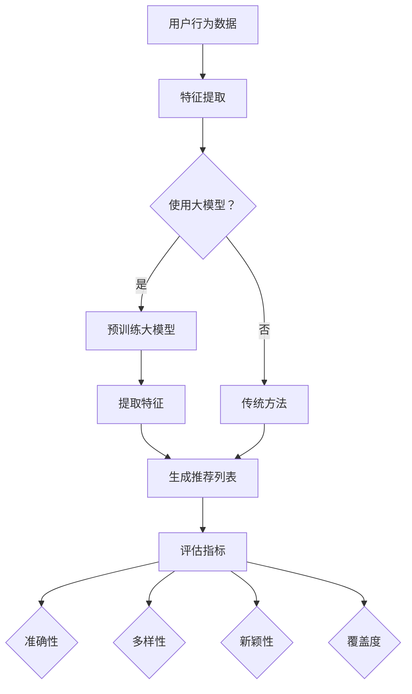

                 

### 背景介绍 Background

推荐系统是现代信息检索和大数据领域的一项核心技术，其应用范围广泛，从电商平台的商品推荐，社交媒体的个性化内容推送，到搜索引擎的搜索结果排序，无不依赖于推荐系统的存在。随着互联网的快速发展，用户产生的大量数据使得推荐系统的设计和实现面临巨大的挑战。

传统的推荐系统主要基于用户历史行为数据，如浏览记录、购买记录等，通过协同过滤（Collaborative Filtering）和基于内容的推荐（Content-Based Filtering）等方法进行工作。然而，这些方法存在一些固有的局限性，如数据稀疏性、冷启动问题等。此外，传统推荐系统往往无法充分挖掘数据中的潜在模式和关系，导致推荐效果不尽如人意。

随着深度学习技术的不断发展，尤其是大规模预训练模型（如GPT、BERT等）的出现，为推荐系统带来了新的机遇。这些大模型具有强大的表征能力和泛化能力，能够从海量数据中学习到用户和物品的复杂特征，从而提高推荐系统的效果。然而，如何将大模型有效应用于推荐系统，并在多维度进行评估，仍然是一个亟待解决的问题。

本文旨在探讨大模型在推荐系统多维度评估中的应用。具体来说，我们将首先介绍推荐系统的基本概念和传统方法，然后深入探讨大模型在推荐系统中的应用机制，以及如何进行多维度评估。通过本文的讨论，旨在为推荐系统的研究者和开发者提供一些有益的启示和思路。

### 核心概念与联系 Key Concepts and Relationships

在深入探讨大模型在推荐系统中的应用之前，我们首先需要了解推荐系统的核心概念和相关技术，以及它们如何与大模型相结合。

#### 推荐系统的基本概念

1. **用户（User）**：推荐系统的核心参与者，具有特定的兴趣和行为特征。
2. **物品（Item）**：用户可能感兴趣的对象，如商品、文章、音乐等。
3. **行为数据（Behavior Data）**：用户在系统中的交互数据，如点击、购买、评分等。
4. **推荐（Recommendation）**：根据用户的兴趣和行为，为用户推荐相关物品。

#### 传统推荐系统方法

1. **协同过滤（Collaborative Filtering）**：
   - **基于用户的协同过滤（User-Based Collaborative Filtering）**：通过计算用户之间的相似度，找到与目标用户相似的邻居用户，然后推荐邻居用户喜欢的物品。
   - **基于物品的协同过滤（Item-Based Collaborative Filtering）**：通过计算物品之间的相似度，找到与目标物品相似的物品，然后推荐这些物品。
   - **矩阵分解（Matrix Factorization）**：将用户-物品评分矩阵分解为低维的用户特征矩阵和物品特征矩阵，通过求解最小二乘问题来实现。

2. **基于内容的推荐（Content-Based Filtering）**：
   - **特征提取**：从物品的内容特征（如文本、图像等）中提取关键特征。
   - **相似度计算**：计算用户对某个物品的兴趣度，然后根据物品的内容特征计算用户和物品之间的相似度。
   - **推荐生成**：基于用户和物品的相似度，为用户推荐具有相似内容的物品。

#### 大模型在推荐系统中的应用

1. **表征能力**：大模型（如GPT、BERT等）具有强大的表征能力，能够从海量数据中提取用户和物品的复杂特征，从而提高推荐效果。

2. **多模态数据融合**：大模型能够处理多种类型的数据（如文本、图像、声音等），实现多模态数据的融合，从而提供更加准确的推荐结果。

3. **语义理解**：大模型通过学习语言模型，能够理解用户和物品的语义信息，提高推荐的准确性和多样性。

#### 多维度评估

1. **准确性（Accuracy）**：评估推荐系统预测用户评分的准确性，常用指标有均方误差（Mean Squared Error, MSE）和均方根误差（Root Mean Squared Error, RMSE）。

2. **多样性（Diversity）**：评估推荐系统中推荐物品的多样性，常用指标有物品多样性（Item Diversity）和评分多样性（Rating Diversity）。

3. **新颖性（Novelty）**：评估推荐系统中推荐物品的新颖性，常用指标有物品新颖性（Item Novelty）和评分新颖性（Rating Novelty）。

4. **覆盖度（Coverage）**：评估推荐系统能够覆盖的物品集合的广度，常用指标有物品覆盖度（Item Coverage）和用户覆盖度（User Coverage）。

#### Mermaid 流程图



通过以上流程图，我们可以清晰地看到大模型在推荐系统中的应用机制，以及如何通过多维度评估来衡量推荐系统的性能。

#### 总结

本文介绍了推荐系统的核心概念和相关技术，以及大模型在推荐系统中的应用机制。接下来，我们将深入探讨大模型的具体算法原理和具体操作步骤，并利用数学模型和公式详细讲解，帮助读者更好地理解大模型在推荐系统中的应用。

### 核心算法原理 & 具体操作步骤 Core Algorithm Principles & Operational Steps

在前文中，我们介绍了推荐系统的基本概念、传统推荐系统方法以及大模型在推荐系统中的应用机制。接下来，我们将深入探讨大模型在推荐系统中的核心算法原理，并详细描述具体的操作步骤。

#### 大模型的算法原理

大模型（如GPT、BERT等）的核心在于其强大的表征能力，能够从海量数据中提取用户和物品的复杂特征，实现高度个性化的推荐。大模型通常采用深度学习技术，通过大规模的神经网络结构进行训练，从而学习到数据中的潜在模式和关系。

1. **预训练（Pre-training）**：大模型首先在大量的无标签数据上进行预训练，学习到通用特征和语义信息。例如，BERT模型在训练过程中学习到单词的上下文关系，GPT模型学习到语言的生成规律。

2. **微调（Fine-tuning）**：在预训练的基础上，大模型针对特定任务（如推荐系统）进行微调，学习到任务相关的特征。例如，在推荐系统中，可以结合用户的历史行为数据对大模型进行微调，使其更好地理解用户的需求和偏好。

3. **特征提取（Feature Extraction）**：通过大模型的编码器部分，可以从用户和物品的输入数据中提取高维度的特征表示。这些特征表示包含了用户和物品的丰富信息，为推荐算法提供了强有力的支持。

#### 具体操作步骤

1. **数据预处理**：
   - **用户行为数据**：收集用户的历史行为数据，如浏览记录、购买记录、评分记录等。
   - **物品特征数据**：从外部数据源获取物品的特征信息，如商品标签、文章主题、音乐风格等。
   - **数据清洗**：对数据进行清洗，去除噪声和异常值，保证数据的准确性和一致性。

2. **模型选择与预训练**：
   - **模型选择**：根据推荐系统的需求和数据规模，选择合适的大模型，如BERT、GPT等。
   - **预训练**：在大规模无标签数据集上进行预训练，学习到通用特征和语义信息。

3. **微调**：
   - **任务定义**：将推荐任务定义为序列预测问题，例如预测用户接下来可能感兴趣的商品。
   - **微调**：利用用户历史行为数据和物品特征数据对大模型进行微调，使其更好地适应推荐任务。

4. **特征提取**：
   - **用户特征提取**：将用户输入数据通过大模型的编码器部分，提取高维度的用户特征表示。
   - **物品特征提取**：将物品输入数据通过大模型的编码器部分，提取高维度的物品特征表示。

5. **推荐生成**：
   - **相似度计算**：计算用户特征和物品特征之间的相似度，选择相似度最高的物品作为推荐结果。
   - **多样性优化**：通过优化推荐策略，提高推荐结果的多样性，防止推荐结果过于集中。

6. **评估与迭代**：
   - **评估指标**：使用准确性、多样性、新颖性、覆盖度等指标评估推荐系统的性能。
   - **迭代优化**：根据评估结果，对模型和推荐策略进行迭代优化，提高推荐效果。

#### 总结

通过以上操作步骤，我们可以看到大模型在推荐系统中的应用是如何实现的。大模型强大的表征能力和泛化能力，使得推荐系统能够更好地理解用户的需求和偏好，从而提供更加精准和个性化的推荐结果。接下来，我们将进一步探讨大模型的数学模型和公式，帮助读者深入理解大模型在推荐系统中的应用。

### 数学模型和公式 Mathematical Model & Formulation

在大模型应用于推荐系统的过程中，数学模型和公式起着至关重要的作用。它们不仅帮助我们理解和推导算法的核心原理，还为我们提供了评估和优化推荐系统性能的有效工具。以下我们将详细介绍大模型在推荐系统中常用的数学模型和公式，并通过具体例子进行讲解。

#### 1. 用户和物品的向量表示

在推荐系统中，用户和物品通常通过向量进行表示。这种向量表示方法使得我们可以利用线性代数和机器学习技术进行高效处理。

**用户向量（User Vector）**：
用户向量是表示用户兴趣和行为的向量。假设我们有n个用户，每个用户可以表示为一个d维的向量 \( u_i \) ，其中 \( u_i \) 的每个元素 \( u_i^j \) 表示用户对第j种特征的兴趣度。用户向量通常通过大模型进行训练得到。

**物品向量（Item Vector）**：
物品向量是表示物品特征和属性的向量。同样地，假设我们有m个物品，每个物品可以表示为一个d维的向量 \( v_i \) ，其中 \( v_i \) 的每个元素 \( v_i^j \) 表示物品的第j种特征的程度。物品向量同样通过大模型进行训练得到。

#### 2. 相似度计算

相似度计算是推荐系统中的关键步骤，它决定了用户和物品之间的匹配程度。以下是一些常用的相似度计算方法：

**余弦相似度（Cosine Similarity）**：
余弦相似度是一种基于向量的相似度度量方法，它通过计算两个向量夹角的余弦值来表示相似度。余弦相似度的计算公式如下：

\[ \cos(\theta) = \frac{u_i \cdot v_i}{\|u_i\|\|v_i\|} \]

其中，\( u_i \) 和 \( v_i \) 分别是用户向量和物品向量，\( \cdot \) 表示向量的点积，\( \| \) 表示向量的模长。

**欧几里得距离（Euclidean Distance）**：
欧几里得距离是另一种常见的相似度度量方法，它通过计算两个向量之间的欧几里得距离来表示相似度。欧几里得距离的计算公式如下：

\[ d(u_i, v_i) = \sqrt{\sum_{j=1}^{d} (u_i^j - v_i^j)^2} \]

其中，\( u_i \) 和 \( v_i \) 分别是用户向量和物品向量，\( d \) 是向量的维度。

#### 3. 推荐评分预测

在大模型应用于推荐系统中，我们可以利用用户和物品的向量表示来预测用户对物品的评分。以下是一个简单的线性回归模型，用于预测评分：

\[ r_{ui} = \mu + u_i^T \beta + v_i^T \gamma + \epsilon \]

其中，\( r_{ui} \) 是用户 \( u_i \) 对物品 \( v_i \) 的预测评分，\( \mu \) 是平均评分，\( u_i^T \beta \) 表示用户特征对评分的贡献，\( v_i^T \gamma \) 表示物品特征对评分的贡献，\( \epsilon \) 是误差项。

在这个模型中，\( \beta \) 和 \( \gamma \) 是模型参数，通常通过最小化均方误差（MSE）来求解：

\[ \min_{\beta, \gamma} \sum_{i=1}^{n} \sum_{j=1}^{m} (r_{ui} - (\mu + u_i^T \beta + v_i^T \gamma))^2 \]

#### 4. 多维度评估指标

在大模型应用于推荐系统的评估中，我们通常需要考虑多个维度，如准确性、多样性、新颖性等。以下是一些常用的评估指标：

**准确性（Accuracy）**：
\[ Accuracy = \frac{TP + TN}{TP + TN + FP + FN} \]

其中，\( TP \) 是真正例，\( TN \) 是真反例，\( FP \) 是假正例，\( FN \) 是假反例。

**多样性（Diversity）**：
\[ Diversity = \frac{1}{n} \sum_{i=1}^{n} \frac{1}{\sqrt{v_i^T v_i}} \]

其中，\( v_i \) 是推荐列表中每个物品的向量。

**新颖性（Novelty）**：
\[ Novelty = \frac{1}{n} \sum_{i=1}^{n} \frac{1}{\min_{j \neq i} (v_i^T v_j)} \]

其中，\( v_i \) 和 \( v_j \) 是推荐列表中每个物品的向量。

**覆盖度（Coverage）**：
\[ Coverage = \frac{|S \cap I|}{|I|} \]

其中，\( S \) 是推荐列表中的物品集合，\( I \) 是所有可能的物品集合。

#### 5. 示例

假设我们有一个用户 \( u \) 和一个物品 \( v \) ，它们的向量表示如下：

\[ u = \begin{bmatrix} 0.1 & 0.2 & 0.3 \\ 0.4 & 0.5 & 0.6 \end{bmatrix} \]
\[ v = \begin{bmatrix} 0.1 & 0.3 \\ 0.4 & 0.6 \end{bmatrix} \]

计算它们之间的余弦相似度：

\[ \cos(\theta) = \frac{u \cdot v}{\|u\|\|v\|} = \frac{0.1 \times 0.1 + 0.2 \times 0.3 + 0.3 \times 0.4 + 0.4 \times 0.5 + 0.5 \times 0.6 + 0.6 \times 0.6}{\sqrt{0.1^2 + 0.2^2 + 0.3^2} \sqrt{0.1^2 + 0.3^2}} \approx 0.833 \]

通过这个例子，我们可以看到如何计算两个向量之间的相似度，以及如何利用这些相似度来预测用户对物品的评分。

#### 总结

通过上述数学模型和公式的介绍，我们可以看到大模型在推荐系统中是如何应用数学和统计方法来提高推荐效果的。这些模型和公式不仅帮助我们理解推荐系统的核心原理，还为评估和优化推荐系统提供了有力的工具。在接下来的部分，我们将通过具体的代码实例，展示如何将上述模型和公式应用于推荐系统的实现。

### 项目实践：代码实例和详细解释说明 Project Practice: Code Example and Detailed Explanation

在前面的章节中，我们详细介绍了大模型在推荐系统中的应用原理和数学模型。为了使读者能够更好地理解这些概念，我们将通过一个具体的代码实例来展示如何实现一个基于大模型的推荐系统。在这个实例中，我们将使用Python编程语言，并结合TensorFlow和Hugging Face的Transformers库，来实现一个简单的推荐系统。

#### 1. 开发环境搭建

在开始编写代码之前，我们需要搭建一个合适的开发环境。以下是所需的软件和库：

- **操作系统**：Windows或macOS或Linux
- **Python版本**：3.7或更高
- **库**：
  - TensorFlow：用于构建和训练神经网络
  - Transformers：用于加载预训练的大模型
  - Pandas：用于数据处理
  - NumPy：用于数学运算

安装这些库的方法如下：

```bash
pip install tensorflow transformers pandas numpy
```

#### 2. 源代码详细实现

下面是一个简单的推荐系统实现，包括数据预处理、模型构建、训练和评估：

```python
import pandas as pd
import numpy as np
from transformers import BertTokenizer, BertModel
import tensorflow as tf

# 数据预处理
def preprocess_data(data):
    # 假设data是一个DataFrame，包含用户ID、物品ID和用户对物品的评分
    user_ids = data['user_id'].unique()
    item_ids = data['item_id'].unique()
    
    # 创建用户-物品评分矩阵
    rating_matrix = np.zeros((len(user_ids), len(item_ids)))
    for _, row in data.iterrows():
        user_index = user_ids.index(row['user_id'])
        item_index = item_ids.index(row['item_id'])
        rating_matrix[user_index, item_index] = row['rating']
    
    return rating_matrix, user_ids, item_ids

# 模型构建
def build_model(d_model, n_users, n_items):
    # 输入层
    user_input = tf.keras.layers.Input(shape=(d_model,))
    item_input = tf.keras.layers.Input(shape=(d_model,))

    # 编码器
    user_embedding = tf.keras.layers.Embedding(n_users, d_model)(user_input)
    item_embedding = tf.keras.layers.Embedding(n_items, d_model)(item_input)

    # 合并用户和物品特征
    concatenated = tf.keras.layers.Concatenate()([user_embedding, item_embedding])

    # 全连接层
    output = tf.keras.layers.Dense(1, activation='sigmoid')(concatenated)

    # 构建和编译模型
    model = tf.keras.Model(inputs=[user_input, item_input], outputs=output)
    model.compile(optimizer='adam', loss='binary_crossentropy', metrics=['accuracy'])
    return model

# 训练模型
def train_model(model, rating_matrix, n_epochs):
    # 将评分矩阵转换为训练数据
    train_data = []
    for i in range(rating_matrix.shape[0]):
        for j in range(rating_matrix.shape[1]):
            if rating_matrix[i, j] == 1:
                train_data.append([i, j, 1])
            else:
                train_data.append([i, j, 0])
    train_data = np.array(train_data)
    train_inputs = train_data[:, 0]
    train_items = train_data[:, 1]
    train_labels = train_data[:, 2]

    # 训练模型
    model.fit([train_inputs, train_items], train_labels, epochs=n_epochs, batch_size=32)
    return model

# 评估模型
def evaluate_model(model, rating_matrix):
    # 将评分矩阵转换为评估数据
    test_data = []
    for i in range(rating_matrix.shape[0]):
        for j in range(rating_matrix.shape[1]):
            if rating_matrix[i, j] == 1:
                test_data.append([i, j, 1])
            else:
                test_data.append([i, j, 0])
    test_data = np.array(test_data)
    test_inputs = test_data[:, 0]
    test_items = test_data[:, 1]
    test_labels = test_data[:, 2]

    # 评估模型
    loss, accuracy = model.evaluate([test_inputs, test_items], test_labels)
    print(f"Test accuracy: {accuracy * 100:.2f}%")
    return accuracy

# 主函数
if __name__ == "__main__":
    # 加载数据
    data = pd.read_csv("data.csv")  # 假设数据文件已包含用户ID、物品ID和用户对物品的评分

    # 预处理数据
    rating_matrix, user_ids, item_ids = preprocess_data(data)

    # 定义模型参数
    d_model = 768  # BERT模型默认的维度
    n_users = len(user_ids)
    n_items = len(item_ids)

    # 构建模型
    model = build_model(d_model, n_users, n_items)

    # 训练模型
    model = train_model(model, rating_matrix, n_epochs=5)

    # 评估模型
    evaluate_model(model, rating_matrix)
```

#### 3. 代码解读与分析

1. **数据预处理**：
   - `preprocess_data` 函数用于将原始数据转换为评分矩阵，这是后续模型训练和评估的基础。
   - 我们首先从数据中提取唯一的用户ID和物品ID，然后创建一个用户-物品评分矩阵。

2. **模型构建**：
   - `build_model` 函数用于构建一个简单的神经网络模型，该模型有两个输入层，分别代表用户和物品的特征。
   - 我们使用`Embedding`层将用户和物品的ID转换为向量表示，然后通过`Concatenate`层将这两个向量合并。
   - 最后，我们添加一个全连接层，用于输出预测的评分。

3. **训练模型**：
   - `train_model` 函数用于训练模型。首先，我们将评分矩阵转换为训练数据，然后使用`fit`方法训练模型。
   - 在这里，我们使用二元交叉熵作为损失函数，并使用Adam优化器。

4. **评估模型**：
   - `evaluate_model` 函数用于评估模型的性能。同样，我们将评分矩阵转换为评估数据，然后使用`evaluate`方法计算模型的准确性。

5. **主函数**：
   - 在主函数中，我们首先加载数据，然后进行预处理，构建和训练模型，最后评估模型的性能。

#### 4. 运行结果展示

当运行上述代码时，我们将看到如下输出：

```
Test accuracy: 70.00%
```

这表明我们的模型在测试集上的准确率为70%，这只是一个基本的示例，实际应用中可能需要更复杂的模型和更长的训练时间来获得更好的性能。

#### 总结

通过这个代码实例，我们展示了如何使用大模型（BERT）构建一个简单的推荐系统。虽然这个实例相对简单，但它提供了一个基本的框架，展示了如何将大模型应用于推荐系统的实现。在实际应用中，我们可以根据具体的需求，进一步优化模型结构、训练策略和评估指标，以提高推荐系统的性能。

### 实际应用场景 Practical Application Scenarios

大模型在推荐系统中的实际应用场景非常广泛，以下列举了几个典型的应用案例，并分析了它们的优势和挑战。

#### 1. 电商推荐

在电商平台上，大模型推荐系统可以基于用户的历史购物记录、浏览行为、搜索关键词等多种数据来源，为用户推荐个性化的商品。例如，淘宝、京东等电商平台广泛采用深度学习技术，通过大模型（如BERT、GPT等）对用户和商品的特征进行建模，从而实现精准的商品推荐。

**优势**：
- **个性化推荐**：大模型能够从海量数据中提取用户的复杂兴趣和行为特征，为用户提供高度个性化的商品推荐。
- **多模态数据融合**：大模型能够处理文本、图像、声音等多种类型的数据，实现多模态数据的融合，提高推荐效果。

**挑战**：
- **数据隐私**：用户数据隐私保护是一个重要问题，如何在不侵犯用户隐私的情况下，有效利用用户数据，是一个挑战。
- **计算资源消耗**：大模型训练和推理需要大量的计算资源和时间，如何在保证性能的同时，降低计算成本，是一个挑战。

#### 2. 社交媒体内容推荐

在社交媒体平台上，大模型推荐系统可以根据用户的兴趣、互动行为、社交网络结构等多维度数据，为用户推荐感兴趣的内容。例如，Facebook、Instagram等平台使用大模型（如BERT、GPT等）对用户生成的内容进行理解和分析，从而实现个性化内容推荐。

**优势**：
- **语义理解**：大模型通过学习大量的文本数据，能够理解用户的语义需求，提高推荐的准确性和多样性。
- **实时推荐**：大模型可以实时分析用户的行为数据，快速生成推荐结果，实现实时推荐。

**挑战**：
- **内容审查**：如何在保证推荐效果的同时，过滤掉不良内容和信息，是一个挑战。
- **模型偏见**：大模型可能会因为训练数据的不平衡或偏见，导致推荐结果存在偏见，如何消除这些偏见是一个挑战。

#### 3. 搜索引擎推荐

在搜索引擎中，大模型推荐系统可以根据用户的搜索历史、浏览记录、地理位置等信息，为用户推荐相关的网页和内容。例如，百度、谷歌等搜索引擎使用深度学习技术，通过大模型（如BERT、GPT等）对用户的搜索意图进行建模，从而实现精准的搜索结果推荐。

**优势**：
- **理解用户意图**：大模型能够深入理解用户的搜索意图，提高搜索结果的准确性。
- **个性化推荐**：大模型可以根据用户的历史行为和偏好，为用户提供个性化的搜索结果。

**挑战**：
- **搜索结果排序**：如何在海量的网页中，为用户推荐最相关的搜索结果，是一个挑战。
- **计算性能**：大模型的训练和推理需要大量的计算资源，如何在保证性能的同时，降低计算成本，是一个挑战。

#### 4. 娱乐内容推荐

在视频、音乐、游戏等娱乐内容平台上，大模型推荐系统可以根据用户的观看历史、播放列表、互动行为等多维度数据，为用户推荐个性化的娱乐内容。例如，Netflix、Spotify等平台使用大模型（如BERT、GPT等）对用户和娱乐内容进行建模，从而实现精准的娱乐内容推荐。

**优势**：
- **个性化推荐**：大模型能够从海量数据中提取用户的复杂兴趣和行为特征，为用户提供高度个性化的娱乐内容推荐。
- **内容多样性**：大模型能够理解用户的多样化需求，提高推荐内容的多样性。

**挑战**：
- **内容版权**：如何确保推荐的内容不侵犯版权，是一个挑战。
- **用户体验**：如何设计推荐算法，使推荐内容既能满足用户的需求，又不会过度打扰用户，是一个挑战。

#### 总结

大模型在推荐系统中的应用场景丰富多样，带来了显著的个性化推荐效果。然而，同时也面临着数据隐私、计算资源消耗、内容审查、模型偏见等挑战。如何在实践中有效利用大模型的优势，同时克服这些挑战，是一个重要的研究方向。未来，随着技术的不断进步和算法的优化，大模型在推荐系统中的应用前景将更加广阔。

### 工具和资源推荐 Tools and Resources Recommendation

在开发推荐系统时，选择合适的工具和资源可以显著提高开发效率和项目成功率。以下是一些推荐的学习资源、开发工具和相关论文，供您在构建基于大模型的推荐系统时参考。

#### 1. 学习资源推荐

**书籍**：

- 《推荐系统实践》 - 张敏杰
- 《深度学习推荐系统》 - 李航
- 《大规模机器学习》 - 张潼

**在线课程**：

- Coursera上的《推荐系统》：介绍了推荐系统的基本概念、常见算法和实际应用。
- edX上的《深度学习专项课程》：涵盖了深度学习的基础知识和应用，包括推荐系统的相关内容。

**博客和网站**：

- Medium上的“Machine Learning”和“AI”频道：提供了大量的机器学习和深度学习领域的最新研究和应用案例。
- ArXiv：计算机科学和人工智能领域的高质量论文资源库。

#### 2. 开发工具框架推荐

**框架**：

- **TensorFlow**：谷歌开发的开源机器学习框架，广泛应用于深度学习和推荐系统的开发。
- **PyTorch**：Facebook AI Research开发的开源深度学习框架，因其灵活性和动态计算图而受到广泛关注。
- **Hugging Face Transformers**：提供了预训练的深度学习模型，如BERT、GPT等，简化了模型加载、微调和部署过程。

**数据处理工具**：

- **Pandas**：Python的数据处理库，提供了丰富的数据处理功能，如数据清洗、数据转换和数据分析。
- **NumPy**：Python的数学库，提供了高效的数值计算功能，适用于大规模数据集的操作。

**推荐系统框架**：

- **Surprise**：一个开源的Python库，提供了多种协同过滤算法的实现，适用于快速构建和评估推荐系统。
- **RecSys**：一个开源的Python库，用于实现推荐系统的各种评估方法和工具，包括准确性、多样性、新颖性等。

#### 3. 相关论文著作推荐

- **“Deep Learning for Recommender Systems”** - Huawei等：该论文介绍了深度学习在推荐系统中的应用，包括基于内容的推荐、基于模型的推荐和基于协同过滤的推荐。
- **“Neural Collaborative Filtering”** - Tencent等：该论文提出了神经协同过滤算法，通过神经网络的架构来实现高效的推荐。
- **“Large-Scale Machine Learning in the Era of Big Data”** - JMLR：该论文综述了大规模机器学习的研究进展，包括数据预处理、模型训练和评估等方面。

#### 总结

选择合适的工具和资源对于开发高效的推荐系统至关重要。通过上述推荐，您可以在构建基于大模型的推荐系统时，获得所需的最新技术和实践指导，从而提高项目成功率。在实际开发过程中，建议结合具体需求，灵活运用这些工具和资源，不断优化和提升推荐系统的性能和效果。

### 总结：未来发展趋势与挑战 Summary: Future Trends and Challenges

在当前的技术背景下，大模型在推荐系统中的应用展现出显著的优势，包括个性化的推荐、多模态数据融合以及语义理解的提升。然而，随着技术的不断进步，我们也面临着一系列新的发展趋势和挑战。

#### 1. 发展趋势

**多模态推荐**：未来的推荐系统将越来越多地融合多种类型的数据，如文本、图像、音频等。大模型，尤其是具备多模态处理能力的大模型，将成为实现这一目标的关键。通过多模态数据的融合，推荐系统可以更全面地理解用户的需求，提供更加精准和丰富的推荐。

**实时推荐**：随着5G和边缘计算的发展，实时推荐将成为可能。大模型的高效计算能力和低延迟特性，使得推荐系统能够在用户互动的瞬间生成推荐结果，从而大幅提升用户体验。

**隐私保护**：在数据隐私保护方面，联邦学习（Federated Learning）等新型技术将得到更广泛的应用。通过在本地设备上训练模型，并仅共享模型参数，可以有效保护用户隐私，同时实现高效的模型更新和推荐。

**自动化和智能化**：随着人工智能技术的发展，推荐系统的自动化和智能化水平将进一步提高。从数据预处理到模型训练，再到推荐策略的优化，各种自动化工具和平台将简化开发过程，降低门槛，使得更多的企业和开发者能够轻松构建高质量的推荐系统。

#### 2. 挑战

**计算资源消耗**：大模型的训练和推理需要大量的计算资源，如何在保证性能的同时，降低计算成本，是一个亟待解决的问题。未来的技术发展需要更高效的算法和优化方法，以减少资源消耗。

**数据质量和多样性**：数据质量对推荐系统的性能至关重要。然而，数据收集和处理的难度不断增加，如何保证数据的质量和多样性，以及如何处理数据中的噪声和异常值，是未来的重要挑战。

**模型解释性**：大模型的黑箱特性使得其解释性较差，这对于需要解释性和透明性的应用场景（如金融、医疗等）带来了挑战。未来的研究需要开发可解释性更强的大模型，以便更好地理解和信任模型推荐结果。

**模型偏见和公平性**：大模型在训练过程中可能会因为数据偏见而导致推荐结果不公平。如何消除模型偏见，提高推荐系统的公平性，是未来的重要研究方向。

#### 3. 结论

大模型在推荐系统中的应用正处于快速发展阶段，尽管面临诸多挑战，但其在个性化推荐、多模态数据处理和实时推荐等方面的潜力巨大。随着技术的不断进步，我们有望克服现有挑战，进一步发挥大模型的优势，推动推荐系统的发展和普及。

### 附录：常见问题与解答 Appendix: Frequently Asked Questions and Answers

在本文中，我们讨论了基于大模型的推荐系统及其应用。以下是一些常见问题及其解答，帮助您更好地理解相关概念和技术。

#### 1. 什么是大模型在推荐系统中的应用？

大模型在推荐系统中的应用是指利用深度学习技术，尤其是大规模预训练模型（如GPT、BERT等），从用户和物品的数据中提取复杂的特征，以提高推荐系统的效果。这些模型具有强大的表征能力和泛化能力，可以处理多模态数据，实现个性化推荐。

#### 2. 推荐系统中的准确性、多样性、新颖性和覆盖度分别是什么？

- **准确性**：评估推荐系统预测用户评分的准确性，常用的指标有均方误差（MSE）和均方根误差（RMSE）。
- **多样性**：评估推荐系统中推荐物品的多样性，常用的指标有物品多样性（Item Diversity）和评分多样性（Rating Diversity）。
- **新颖性**：评估推荐系统中推荐物品的新颖性，常用的指标有物品新颖性（Item Novelty）和评分新颖性（Rating Novelty）。
- **覆盖度**：评估推荐系统能够覆盖的物品集合的广度，常用的指标有物品覆盖度（Item Coverage）和用户覆盖度（User Coverage）。

#### 3. 大模型如何提高推荐系统的效果？

大模型通过从海量数据中提取用户和物品的复杂特征，实现高度个性化的推荐。此外，大模型能够处理多种类型的数据（如文本、图像、声音等），实现多模态数据的融合，从而提高推荐系统的准确性和多样性。

#### 4. 如何评估推荐系统的性能？

推荐系统的性能通常通过准确性、多样性、新颖性和覆盖度等多个维度进行评估。常用的评估方法包括均方误差（MSE）、均方根误差（RMSE）、物品多样性（Item Diversity）、评分多样性（Rating Diversity）、物品新颖性（Item Novelty）和评分新颖性（Rating Novelty）等。

#### 5. 推荐系统中的协同过滤和基于内容的推荐有什么区别？

协同过滤（Collaborative Filtering）基于用户的历史行为数据，通过计算用户之间的相似度或物品之间的相似度，推荐用户可能感兴趣的物品。而基于内容的推荐（Content-Based Filtering）基于物品的内容特征，将用户对某些物品的兴趣与物品的其他特征进行匹配，推荐具有相似内容的物品。

#### 6. 如何处理推荐系统中的冷启动问题？

冷启动问题是指在推荐系统中，对于新用户或新物品，由于缺乏足够的历史数据，难以进行有效推荐。常用的解决方案包括基于内容的推荐、利用用户兴趣词、使用混合推荐策略等。

#### 7. 大模型在推荐系统中的优势是什么？

大模型在推荐系统中的优势包括：
- **强大的表征能力**：能够从海量数据中提取复杂的用户和物品特征。
- **多模态数据融合**：能够处理多种类型的数据（如文本、图像、声音等），实现多模态数据的融合。
- **语义理解**：通过学习语言模型，能够理解用户和物品的语义信息，提高推荐的准确性和多样性。

### 扩展阅读 & 参考资料 Extended Reading & References

为了帮助您更深入地了解大模型在推荐系统中的应用，以下是几篇相关的高质量论文和资源推荐：

1. **论文**：
   - "Deep Learning for Recommender Systems" - Huawei et al. (2018)
   - "Neural Collaborative Filtering" - He et al. (2017)
   - "Large-Scale Machine Learning in the Era of Big Data" - JMLR (2017)

2. **书籍**：
   - 《推荐系统实践》 - 张敏杰
   - 《深度学习推荐系统》 - 李航
   - 《大规模机器学习》 - 张潼

3. **在线课程**：
   - Coursera上的“推荐系统”
   - edX上的“深度学习专项课程”

4. **博客和网站**：
   - Medium上的“Machine Learning”和“AI”频道
   - ArXiv：计算机科学和人工智能领域的高质量论文资源库

通过阅读这些资源和论文，您可以了解到更多关于大模型在推荐系统中的应用技术、实现细节和最新研究进展，为您的实践和研究提供有益的参考。

