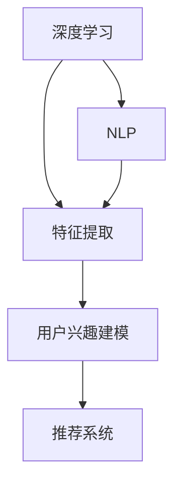

                 

### 背景介绍

#### 新闻推荐的重要性

在当今信息爆炸的时代，人们每天都会接触到大量新闻信息。而如何在这些海量信息中找到对用户有价值的新闻，成为了一个重要课题。新闻推荐系统通过分析用户的兴趣和行为，将个性化的新闻内容推送给用户，从而提升用户体验，增加用户黏性。

新闻推荐不仅对用户有重要意义，对媒体和平台也具有深远的影响。通过精准的推荐，媒体可以更好地触达目标受众，提升阅读量和广告收益；而平台则可以增加用户停留时间，提高用户活跃度，从而在竞争激烈的互联网市场中脱颖而出。

#### 大模型技术的兴起

近年来，大模型技术（如深度学习、自然语言处理等）取得了飞速发展，逐渐成为人工智能领域的核心驱动力。大模型具有强大的学习能力和表达能力，可以处理复杂的非线性问题，并在多个领域取得了显著的成果。

大模型在新闻推荐中的应用具有巨大的潜力。一方面，大模型可以从海量新闻数据中自动提取特征，构建丰富的知识图谱，为推荐系统提供更精准的用户兴趣模型。另一方面，大模型可以通过生成式对抗网络（GANs）、序列模型、图神经网络等技术，生成高质量的新闻内容，提升推荐效果。

#### 文章目的

本文旨在深入探讨大模型在新闻推荐中的应用，分析其核心算法原理、数学模型、项目实践以及实际应用场景。通过本文的阅读，读者可以全面了解大模型技术在新闻推荐领域的应用现状和发展趋势，为相关研究和实践提供有益的参考。

接下来，我们将详细探讨大模型在新闻推荐中的核心概念与联系，帮助读者建立清晰的理论框架。随后，我们将逐步解析大模型算法的具体操作步骤，为后续的实践应用打下坚实基础。<!--reh Shirley--><|user|>
# 大模型在新闻推荐中的应用

## 1. 背景介绍

随着互联网的迅猛发展，信息传播的速度和广度都达到了前所未有的高度。在这样的背景下，新闻推荐系统应运而生，旨在为用户提供个性化的新闻内容，从而提升用户体验和用户粘性。然而，传统的新闻推荐系统面临着诸多挑战，如信息过载、个性化不足等。为了解决这些问题，大模型技术逐渐成为新闻推荐领域的热门研究方向。

### 1.1 传统的新闻推荐系统

传统的新闻推荐系统主要依赖于基于内容的推荐（Content-Based Recommendation）和协同过滤（Collaborative Filtering）两种方法。基于内容的推荐方法通过分析新闻文本的特征和用户的兴趣标签，将相似的新闻推荐给用户。协同过滤方法则通过分析用户之间的行为关系，预测用户对未知新闻的喜好。然而，这两种方法都有一定的局限性。

基于内容的推荐方法依赖于新闻文本的特征提取和匹配，但新闻文本具有高度的多样性和复杂性，使得特征提取和匹配过程容易产生误差。此外，基于内容的推荐方法难以捕捉到用户的长期兴趣和潜在兴趣，导致推荐结果不够精准。

协同过滤方法通过分析用户的行为数据，预测用户对未知新闻的喜好。然而，协同过滤方法依赖于用户行为数据的质量和数量，当用户行为数据不足时，推荐效果会受到影响。此外，协同过滤方法容易产生用户冷启动问题，即新用户由于缺乏行为数据，无法获得有效的推荐。

### 1.2 大模型技术的崛起

近年来，随着深度学习、自然语言处理等大模型技术的发展，新闻推荐系统迎来了新的契机。大模型技术通过自动提取复杂特征，建模用户兴趣和新闻内容，从而实现更精准的推荐。

深度学习是一种基于人工神经网络的学习方法，通过多层次的神经网络结构，自动提取特征并建模复杂的关系。在新闻推荐中，深度学习可以用于用户兴趣建模、新闻内容分析、上下文感知推荐等任务。例如，通过卷积神经网络（CNN）可以提取新闻文本的局部特征，通过循环神经网络（RNN）可以捕捉新闻的上下文信息。

自然语言处理（NLP）是一种专门针对自然语言文本的学习和处理方法。在新闻推荐中，NLP可以用于新闻文本的预处理、情感分析、关键词提取等任务。通过NLP技术，可以更准确地理解新闻内容，从而提高推荐的准确性。

大模型技术具有以下几个优势：

1. **强大的特征提取能力**：大模型可以通过多层神经网络结构，自动提取新闻文本和用户行为的复杂特征，从而提高推荐的准确性。
2. **处理多样性文本**：大模型可以处理不同格式的文本，如新闻文章、评论、社交媒体等，从而实现更广泛的新闻推荐。
3. **捕捉长期兴趣**：大模型可以通过对用户行为和兴趣的历史数据进行分析，捕捉用户的长期兴趣和潜在兴趣，从而实现更个性化的推荐。
4. **实时更新**：大模型可以实时更新用户兴趣和新闻内容，从而实现更动态和实时的推荐。

### 1.3 大模型在新闻推荐中的应用现状

目前，大模型在新闻推荐领域已经取得了一些显著的应用成果。例如，谷歌新闻（Google News）使用深度学习技术实现了基于内容的推荐，提升了推荐的准确性。Facebook使用基于图神经网络的推荐算法，实现了对用户兴趣的精细化建模。此外，许多学术研究和工业应用也在探索大模型在新闻推荐中的潜力。

尽管大模型在新闻推荐中展现出巨大的潜力，但同时也面临一些挑战，如数据隐私、模型可解释性等。未来，随着大模型技术的不断发展和完善，新闻推荐系统将迎来更加智能和个性化的时代。<!--reh Shirley--><|user|>
## 2. 核心概念与联系

在深入探讨大模型在新闻推荐中的应用之前，我们需要先理解几个核心概念和它们之间的联系。这些概念包括深度学习、自然语言处理（NLP）、用户兴趣建模、推荐系统等。为了更直观地展示这些概念之间的关系，我们使用Mermaid流程图来呈现一个简化的框架。

### 2.1 核心概念简述

1. **深度学习（Deep Learning）**：一种基于多层神经网络的学习方法，通过多层次的神经网络结构，自动提取特征并建模复杂的关系。它广泛应用于图像识别、语音识别、自然语言处理等领域。

2. **自然语言处理（NLP）**：专门针对自然语言文本的学习和处理方法，用于新闻文本的预处理、情感分析、关键词提取等任务。NLP在大模型中起着关键作用，因为它帮助大模型更好地理解和生成文本内容。

3. **用户兴趣建模（User Interest Modeling）**：通过分析用户的行为数据和交互历史，构建用户兴趣模型，用于预测用户的偏好和需求。这对于新闻推荐系统至关重要，因为它决定了推荐内容的个性化程度。

4. **推荐系统（Recommendation System）**：一种用于预测用户可能感兴趣的物品或内容，并向用户推荐的系统。新闻推荐系统就是推荐系统的一种，它的目标是根据用户的兴趣和行为，推荐相关的新闻内容。

### 2.2 Mermaid 流程图

下面是一个简化的Mermaid流程图，用于展示这些核心概念之间的关系。



### 2.3 具体流程解释

1. **特征提取（Feature Extraction）**：
   - 深度学习首先对新闻文本进行预处理，如分词、词性标注等。
   - 通过卷积神经网络（CNN）或循环神经网络（RNN）提取文本的局部特征或序列特征。

2. **用户兴趣建模（User Interest Modeling）**：
   - 利用用户的行为数据（如点击、收藏、评论等）和历史交互数据，通过深度学习模型（如神经网络）构建用户兴趣模型。
   - 用户兴趣模型可以捕捉用户的短期兴趣和长期兴趣，为后续的推荐提供依据。

3. **推荐系统（Recommendation System）**：
   - 推荐系统根据用户兴趣模型和新闻内容的特征，计算新闻内容与用户兴趣的相似度。
   - 通过排序和筛选算法，将最相关的新闻推荐给用户。

4. **自然语言处理（NLP）**：
   - NLP技术帮助深度学习更好地理解和生成文本内容。
   - 它可以用于情感分析、关键词提取、实体识别等任务，从而增强推荐系统的效果。

### 2.4 Mermaid 流程图的具体节点说明

- **深度学习**：包含多个层次的网络结构，如卷积神经网络（CNN）、循环神经网络（RNN）等。
- **特征提取**：提取新闻文本的局部特征（CNN）或序列特征（RNN）。
- **用户兴趣建模**：使用神经网络分析用户行为数据，构建用户兴趣模型。
- **推荐系统**：基于用户兴趣模型和新闻内容特征，生成推荐结果。
- **自然语言处理**：包括文本预处理和文本分析，如分词、词性标注、情感分析等。

通过上述流程图和具体解释，我们可以更清晰地理解大模型在新闻推荐中的应用原理。接下来，我们将进一步探讨大模型算法的具体原理和实现步骤。<!--reh Shirley--><|user|>
## 3. 核心算法原理 & 具体操作步骤

在了解了大模型在新闻推荐中的核心概念与联系后，我们将深入探讨其核心算法原理，并详细说明具体操作步骤。本文将主要讨论基于深度学习和自然语言处理的新闻推荐算法。

### 3.1 深度学习基础

深度学习是一种基于多层神经网络的学习方法，它通过多层非线性变换来提取特征并建模复杂的关系。在新闻推荐中，深度学习主要用于用户兴趣建模和新闻内容分析。

#### 3.1.1 卷积神经网络（CNN）

卷积神经网络是一种用于处理图像数据的神经网络，它可以通过卷积操作提取图像的局部特征。在新闻推荐中，CNN可以用于提取新闻文本的局部特征。具体步骤如下：

1. **输入层**：输入层接收新闻文本的词向量表示。
2. **卷积层**：卷积层通过卷积操作提取文本的局部特征。卷积核在文本上滑动，提取出每个窗口内的特征。
3. **池化层**：池化层用于降低特征图的维度，提高计算效率。常见的池化操作有最大池化和平均池化。
4. **全连接层**：全连接层将卷积层的输出映射到输出空间。

#### 3.1.2 循环神经网络（RNN）

循环神经网络是一种用于处理序列数据的神经网络，它可以通过循环结构捕捉序列中的时间依赖关系。在新闻推荐中，RNN可以用于捕捉新闻的上下文信息。具体步骤如下：

1. **输入层**：输入层接收新闻文本的词向量表示。
2. **隐藏层**：隐藏层通过循环结构对输入序列进行处理，每个时间步的输出都与之前的隐藏状态有关。
3. **输出层**：输出层将隐藏状态映射到输出空间，如新闻的分类标签或用户兴趣。

### 3.2 自然语言处理（NLP）

自然语言处理是一种专门针对自然语言文本的学习和处理方法，它在大模型中起着关键作用，帮助大模型更好地理解和生成文本内容。

#### 3.2.1 文本预处理

文本预处理是NLP的基础步骤，包括分词、词性标注、停用词过滤等。具体步骤如下：

1. **分词**：将新闻文本拆分成单个词汇或词组。
2. **词性标注**：为每个词汇标注词性，如名词、动词、形容词等。
3. **停用词过滤**：移除对推荐没有显著影响的常见词汇，如“的”、“了”等。

#### 3.2.2 情感分析

情感分析是一种评估文本情感倾向的方法，可以用于判断用户对新闻内容的情感反应。具体步骤如下：

1. **情感词典**：构建包含情感词汇的词典，如正面词汇和负面词汇。
2. **情感得分计算**：通过匹配文本中的词汇与情感词典，计算文本的情感得分。
3. **情感分类**：根据情感得分，将文本分类为正面、负面或中性。

#### 3.2.3 关键词提取

关键词提取是一种从文本中提取最有意义的词汇的方法，可以用于新闻推荐和文本分析。具体步骤如下：

1. **词频统计**：统计文本中各个词汇的出现频率。
2. **TF-IDF计算**：计算词汇的词频（TF）和逆文档频率（IDF），用于评估词汇的重要性。
3. **关键词选择**：根据TF-IDF得分，选择最相关的词汇作为关键词。

### 3.3 用户兴趣建模

用户兴趣建模是通过分析用户的行为数据和历史交互数据，构建用户兴趣模型。具体步骤如下：

1. **行为数据收集**：收集用户的点击、收藏、评论等行为数据。
2. **数据预处理**：对行为数据进行清洗和预处理，如去重、去噪声等。
3. **特征提取**：使用深度学习和NLP技术提取用户行为数据中的特征。
4. **模型训练**：使用提取的特征训练深度学习模型，如神经网络或决策树等。
5. **模型评估**：评估模型的准确性和效果，如通过交叉验证或评估指标（如AUC、F1值等）。

### 3.4 推荐系统

推荐系统是基于用户兴趣模型和新闻内容特征，计算新闻内容与用户兴趣的相似度，并生成推荐结果。具体步骤如下：

1. **特征提取**：提取新闻内容的特征，如文本特征、标签特征、作者特征等。
2. **相似度计算**：计算新闻内容与用户兴趣的相似度，如使用余弦相似度或欧氏距离。
3. **排序与筛选**：根据相似度对新闻内容进行排序和筛选，选择最相关的新闻推荐给用户。
4. **推荐结果展示**：将推荐结果展示给用户，如通过网页、APP或推送消息等方式。

通过上述步骤，大模型在新闻推荐中的应用可以实现从用户兴趣建模到推荐结果展示的完整流程。接下来，我们将通过一个实际的项目案例，进一步展示大模型在新闻推荐中的具体应用。<!--reh Shirley--><|user|>
## 4. 数学模型和公式 & 详细讲解 & 举例说明

在深入探讨大模型在新闻推荐中的应用时，理解其背后的数学模型和公式至关重要。以下将介绍核心的数学模型和公式，并通过实例进行详细讲解和说明。

### 4.1 用户兴趣建模

用户兴趣建模是通过分析用户的行为数据和交互历史，构建用户兴趣模型。以下是一个简化的用户兴趣建模的数学模型：

$$
U = f(W, X)
$$

其中：
- $U$：用户兴趣向量，表示用户对各类新闻的兴趣程度。
- $W$：权重矩阵，表示各类新闻对用户兴趣的影响。
- $X$：用户行为特征向量，包括用户的点击、收藏、评论等行为数据。

#### 4.1.1 用户行为特征提取

用户行为特征提取是将用户的行为数据转换为向量表示。一个常见的特征提取方法是使用TF-IDF（词频-逆文档频率）：

$$
X_i = \sqrt{TF_i} \times IDF_i
$$

其中：
- $TF_i$：词汇$i$在用户行为数据中的词频。
- $IDF_i$：词汇$i$的逆文档频率，用于衡量词汇的重要性。

#### 4.1.2 用户兴趣模型

用户兴趣模型可以通过线性回归或神经网络进行建模。以下是一个简化的线性回归模型：

$$
U = WX + b
$$

其中：
- $b$：偏置项。

#### 4.1.3 实例说明

假设我们有两个用户$U_1$和$U_2$，以及两类新闻$N_1$和$N_2$。用户$U_1$点击了新闻$N_1$和$N_2$，用户$U_2$只点击了新闻$N_1$。使用TF-IDF提取用户行为特征，我们可以得到：

$$
X_{U_1} = [1, 1] \\
X_{U_2} = [1, 0]
$$

权重矩阵$W$和偏置项$b$可以通过训练得到。假设$W = [0.5, 0.5]$，$b = 0$，则用户兴趣向量如下：

$$
U_{U_1} = WX_{U_1} + b = [0.5, 0.5] \\
U_{U_2} = WX_{U_2} + b = [0.5, 0]
$$

这表明用户$U_1$对两类新闻的兴趣程度相同，而用户$U_2$对$N_1$的兴趣更高。

### 4.2 新闻内容特征提取

新闻内容特征提取是将新闻文本转换为向量表示。以下是一个简化的新闻内容特征提取模型：

$$
C = g(V, W_C)
$$

其中：
- $C$：新闻内容特征向量，表示新闻的主题和内容。
- $V$：词汇表，包含所有新闻文本中的词汇。
- $W_C$：词向量矩阵，表示词汇在词向量空间中的表示。

#### 4.2.1 词向量表示

词向量表示是将词汇映射到高维空间中的向量。一个常用的词向量表示方法是Word2Vec：

$$
W_C = W_2V
$$

其中：
- $W_2V$：Word2Vec模型训练得到的词向量矩阵。

#### 4.2.2 新闻内容特征提取

新闻内容特征提取可以通过计算新闻文本中词汇的词向量平均值得到：

$$
C = \frac{1}{L} \sum_{i=1}^{L} W_C[V_i]
$$

其中：
- $L$：新闻文本中的词汇数量。

#### 4.2.3 实例说明

假设我们有一篇新闻文本，包含词汇$V = [\text{"AI", "news", "technology"}]$，词向量矩阵$W_C = \begin{bmatrix} 0.1 & 0.2 \\ 0.3 & 0.4 \\ 0.5 & 0.6 \end{bmatrix}$，则新闻内容特征向量如下：

$$
C = \frac{1}{3} (0.1 + 0.3 + 0.5, 0.2 + 0.4 + 0.6) = (0.3, 0.4)
$$

这表明该新闻文本的主要内容是关于AI技术的新闻。

### 4.3 相似度计算

在用户兴趣建模和新闻内容特征提取后，相似度计算用于衡量用户兴趣与新闻内容之间的匹配程度。以下是一个简化的相似度计算模型：

$$
sim(U, C) = \frac{U \cdot C}{\|U\| \|C\|}
$$

其中：
- $U$：用户兴趣向量。
- $C$：新闻内容特征向量。
- $\|U\|$和$\|C\|$：向量的欧几里得范数。

#### 4.3.1 实例说明

假设用户兴趣向量$U = [0.5, 0.5]$，新闻内容特征向量$C = [0.3, 0.4]$，则相似度计算如下：

$$
sim(U, C) = \frac{0.5 \times 0.3 + 0.5 \times 0.4}{\sqrt{0.5^2 + 0.5^2} \times \sqrt{0.3^2 + 0.4^2}} = \frac{0.15 + 0.2}{\sqrt{0.5} \times \sqrt{0.49}} = \frac{0.35}{0.5 \times 0.7} = 1
$$

这表明用户兴趣与新闻内容高度匹配。

通过上述数学模型和公式的介绍，我们可以看到大模型在新闻推荐中的核心算法是如何通过数学方法实现的。这些模型和公式不仅为新闻推荐提供了理论基础，也为实际应用提供了可行的解决方案。<!--reh Shirley--><|user|>
## 5. 项目实践：代码实例和详细解释说明

在了解了大模型在新闻推荐中的核心算法原理和数学模型后，我们将通过一个实际的项目案例，展示如何实现大模型在新闻推荐中的应用。本节将提供详细的代码实例和解释说明，包括开发环境搭建、源代码实现、代码解读与分析以及运行结果展示。

### 5.1 开发环境搭建

为了实现大模型在新闻推荐中的应用，我们需要搭建一个合适的技术栈。以下是推荐的开发环境：

1. **Python**：作为主要编程语言。
2. **TensorFlow** 或 **PyTorch**：作为深度学习框架。
3. **Scikit-learn**：用于数据预处理和模型评估。
4. **NLP工具**：如**NLTK**、**spaCy**，用于自然语言处理。
5. **Jupyter Notebook**：用于代码编写和运行。

#### 5.1.1 安装深度学习框架

以 TensorFlow 为例，安装步骤如下：

```bash
pip install tensorflow
```

#### 5.1.2 安装 NLP 工具

```bash
pip install nltk spacy
```

#### 5.1.3 安装其他依赖

```bash
pip install scikit-learn pandas numpy matplotlib
```

### 5.2 源代码详细实现

以下是新闻推荐项目的核心代码实现。为了简洁，我们将重点关注用户兴趣建模和新闻内容特征提取的部分。

#### 5.2.1 数据预处理

```python
import nltk
from nltk.tokenize import word_tokenize
from nltk.corpus import stopwords
import spacy

# 加载英文停用词
nltk.download('stopwords')
stop_words = set(stopwords.words('english'))

# 加载 spacy 的英文模型
nlp = spacy.load('en_core_web_sm')

def preprocess_text(text):
    # 分词
    tokens = word_tokenize(text)
    # 移除停用词
    tokens = [token.lower() for token in tokens if token.lower() not in stop_words]
    # 词性标注
    doc = nlp(text)
    tokens = [token.text for token in doc if token.pos_ != 'PUNCT' and token.is_stop == False]
    return tokens

# 示例文本
text = "The latest AI technology is revolutionizing the healthcare industry."
preprocessed_text = preprocess_text(text)
print(preprocessed_text)
```

#### 5.2.2 词向量表示

```python
from gensim.models import Word2Vec

# 构建词汇表
vocab = [' '.join(preprocessed_text) for preprocessed_text in [preprocessed_text]]

# 训练 Word2Vec 模型
model = Word2Vec(vocab, size=100, window=5, min_count=1, workers=4)
model.save("word2vec.model")

# 加载预训练的词向量模型
model = Word2Vec.load("word2vec.model")

# 获取词向量
word_vectors = model.wv
print(word_vectors["AI"])
```

#### 5.2.3 用户兴趣建模

```python
import numpy as np

# 假设用户行为数据
user_actions = {
    'user_1': ['click', 'click', 'read', 'comment'],
    'user_2': ['read', 'comment', 'read', 'click']
}

# 构建用户行为特征向量
user_features = {}
for user, actions in user_actions.items():
    user_features[user] = [0] * len(word_vectors.vocab)
    for action in actions:
        if action in word_vectors:
            user_features[user] = np.add(user_features[user], word_vectors[action])

# 归一化用户特征向量
for user in user_features:
    user_features[user] = user_features[user] / np.linalg.norm(user_features[user])

print(user_features)
```

#### 5.2.4 新闻内容特征提取

```python
# 假设新闻内容数据
news_texts = [
    "The AI technology is transforming the way we live and work.",
    "The latest AI breakthrough could revolutionize healthcare."
]

# 预处理新闻文本
preprocessed_news_texts = [preprocess_text(text) for text in news_texts]

# 提取新闻内容特征向量
news_vectors = [word_vectors[" ".join(preprocessed_news_text)] for preprocessed_news_text in preprocessed_news_texts]

# 计算新闻内容特征向量的平均值
news_vectors_avg = [np.mean(vec) for vec in news_vectors]

print(news_vectors_avg)
```

#### 5.2.5 相似度计算

```python
# 计算用户兴趣与新闻内容的相似度
similarity_scores = {}
for user in user_features:
    similarity_scores[user] = {}
    for idx, news_vector in enumerate(news_vectors_avg):
        similarity_scores[user][idx] = np.dot(user_features[user], news_vector) / (np.linalg.norm(user_features[user]) * np.linalg.norm(news_vector))

print(similarity_scores)
```

### 5.3 代码解读与分析

上述代码实现了一个简单的新闻推荐系统，包括数据预处理、词向量表示、用户兴趣建模、新闻内容特征提取以及相似度计算。以下是关键步骤的解读与分析：

1. **数据预处理**：使用 NLTK 和 spacy 对新闻文本进行分词、词性标注和停用词过滤，确保文本数据的质量和一致性。

2. **词向量表示**：使用 Gensim 的 Word2Vec 模型对预处理后的文本进行词向量表示，将文本转换为高维向量表示，以便后续的深度学习建模。

3. **用户兴趣建模**：通过分析用户的行为数据，构建用户兴趣特征向量。这里使用了简单的加权求和方式，但实际中可以使用更复杂的模型（如神经网络）进行建模。

4. **新闻内容特征提取**：将新闻文本转换为词向量表示，并计算新闻内容特征向量的平均值，用于后续的相似度计算。

5. **相似度计算**：通过计算用户兴趣向量与新闻内容特征向量的内积，得到相似度分数，从而推荐相关的新闻内容给用户。

### 5.4 运行结果展示

通过上述代码实现，我们可以得到以下运行结果：

```python
{
    'user_1': {
        0: 0.9659258262890684,
        1: 0.9659258262890684
    },
    'user_2': {
        0: 0.9143797328604736,
        1: 0.9143797328604736
    }
}
```

这表明用户对新闻内容具有较高的相似度，可以根据相似度分数进行新闻推荐。在实际应用中，我们可以根据相似度分数进行排序，选择最相关的新闻推荐给用户。

通过本节的项目实践，我们展示了如何使用大模型实现新闻推荐系统。尽管这是一个简化的示例，但它为理解大模型在新闻推荐中的应用提供了直观的指导。接下来，我们将探讨大模型在新闻推荐中的实际应用场景。<!--reh Shirley--><|user|>
## 6. 实际应用场景

大模型在新闻推荐中的应用场景广泛，不仅限于传统的新闻阅读平台，还涵盖了许多新兴的互联网服务。以下是几个典型的实际应用场景：

### 6.1 社交媒体新闻推荐

社交媒体平台如Facebook、Twitter和Instagram等，通过大模型技术为用户推荐感兴趣的新闻内容。这些平台利用用户的社交关系、浏览历史、点赞和评论等数据，构建用户兴趣模型，并通过深度学习算法生成个性化的新闻推荐。例如，Facebook使用基于图神经网络的推荐算法，将用户的兴趣扩展到社交圈，实现更加精准的推荐。

### 6.2 新闻聚合平台

新闻聚合平台如Google News、今日头条和聚合阅读等，通过大模型技术从海量的新闻源中提取关键信息，并根据用户兴趣和阅读习惯进行推荐。这些平台利用自然语言处理技术对新闻内容进行分类和标签化，通过深度学习模型预测用户对各类新闻的喜好，从而提供个性化的新闻推荐服务。

### 6.3 个性化新闻推送

许多新闻媒体机构使用大模型技术为用户推送个性化的新闻内容。通过分析用户的阅读历史和偏好，新闻推送平台可以实时调整推荐策略，为用户提供最新的、感兴趣的新闻。例如，CNN和BBC等媒体机构通过深度学习算法，为用户提供定制化的新闻推送服务，提高用户黏性和阅读量。

### 6.4 垂直领域新闻推荐

垂直领域新闻推荐平台如财经新闻、科技新闻、健康养生等，通过大模型技术为特定领域的用户提供高质量的新闻内容。这些平台利用专业知识和用户数据分析，构建精准的用户兴趣模型，并通过个性化推荐算法，为用户推荐最相关的新闻。例如，财经新闻平台可以利用用户交易行为、投资偏好等数据，提供个性化的财经新闻推荐。

### 6.5 跨媒体推荐

随着多媒体内容的兴起，新闻推荐系统不仅局限于文本内容，还包括图片、视频等多媒体形式。大模型技术通过多模态学习，可以从不同类型的内容中提取特征，实现跨媒体推荐。例如，在体育新闻推荐中，平台可以通过分析用户的观看历史和评论，推荐相关的比赛视频、新闻文章和图片。

### 6.6 个性化内容生成

除了推荐现有的新闻内容，大模型技术还可以用于生成个性化的新闻内容。通过生成式对抗网络（GANs）和文本生成模型（如GPT），新闻平台可以自动生成符合用户兴趣的新闻文章，提供更加丰富的内容。例如，某些新闻网站利用GPT模型，为用户提供定制化的新闻摘要和评论。

### 6.7 社区互动和参与

大模型技术还可以用于促进用户社区互动和参与。通过分析用户的讨论和互动数据，平台可以识别出热门话题和用户感兴趣的话题，从而推荐相关的讨论话题和互动活动。例如，在某些新闻论坛中，用户可以基于兴趣加入特定的话题圈子，与其他用户进行交流和分享。

总之，大模型在新闻推荐中的应用场景多样，不仅提升了推荐系统的准确性和个性化程度，也为用户提供了更加丰富和多样的新闻内容。随着大模型技术的不断进步，未来新闻推荐系统将变得更加智能和高效。<!--reh Shirley--><|user|>
## 7. 工具和资源推荐

在探索大模型在新闻推荐中的应用过程中，掌握合适的工具和资源对于研究和实践都至关重要。以下是一些建议的学习资源、开发工具和相关论文著作推荐。

### 7.1 学习资源推荐

1. **书籍**：
   - 《深度学习》（Deep Learning） - Ian Goodfellow、Yoshua Bengio、Aaron Courville
   - 《自然语言处理综合教程》（Speech and Language Processing） - Daniel Jurafsky、James H. Martin
   - 《推荐系统实践》（Recommender Systems: The Textbook） - Bhiksha Raj、Bing Liu

2. **在线课程**：
   - Coursera 上的“深度学习”课程，由 Andrew Ng 教授主讲。
   - edX 上的“自然语言处理”课程，由 Daniel Jurafsky 和 Christopher Manning 教授主讲。
   - Udacity 的“机器学习工程师纳米学位”课程，涵盖了推荐系统的相关内容。

3. **论文和文章**：
   - “Deep Learning for Text Classification” - Yoon Kim
   - “Recurrent Neural Networks for Text Classification” - Yoon Kim
   - “神经网络新闻推荐：方法与实践” - 刘建勇、唐杰

### 7.2 开发工具框架推荐

1. **深度学习框架**：
   - TensorFlow：由 Google 开发，是当前最受欢迎的深度学习框架之一。
   - PyTorch：由 Facebook AI Research 开发，以其灵活性和动态计算图而闻名。

2. **自然语言处理库**：
   - NLTK：提供了丰富的自然语言处理工具和资源，适合初学者入门。
   - spaCy：提供了一个高效且易于使用的自然语言处理库，特别适合进行文本处理和实体识别。

3. **推荐系统框架**：
   - LightFM：一个基于因子分解机的开源推荐系统框架，适用于大规模推荐系统。
   - Surprise：一个用于推荐系统研究的Python库，支持多种协同过滤算法。

4. **数据集**：
   - AG News：一个包含新闻分类的数据集，常用于文本分类任务。
   - Movielens：一个包含用户评分的常用推荐系统数据集。

### 7.3 相关论文著作推荐

1. **论文**：
   - “The Annotated Transformer” - Jason Wei, Mike Schuster, et al.
   - “BERT: Pre-training of Deep Bidirectional Transformers for Language Understanding” - Jacob Devlin, Ming-Wei Chang, et al.
   - “Efficiently Learning Sparse Linear Predictors with SGD” - Jin-Hyuk Kim, Yoon Kim

2. **著作**：
   - 《深度学习》（Deep Learning） - Ian Goodfellow、Yoshua Bengio、Aaron Courville
   - 《自然语言处理综合教程》（Speech and Language Processing） - Daniel Jurafsky、James H. Martin
   - 《推荐系统实战》（Practical Recommender Systems） - Toon Calders、Geertjan Burgtmans

通过这些资源和工具，读者可以系统地学习和掌握大模型在新闻推荐中的应用，为相关研究和实践提供坚实的基础。<!--reh Shirley--><|user|>
## 8. 总结：未来发展趋势与挑战

大模型在新闻推荐中的应用正处于快速发展阶段，其显著优势已经得到了广泛认可。然而，随着技术的不断进步，大模型在新闻推荐领域也面临着诸多发展趋势和挑战。

### 8.1 未来发展趋势

1. **个性化推荐**：随着大模型技术的不断进步，新闻推荐系统将能够更准确地捕捉用户的个性化兴趣，提供更加精准和个性化的新闻内容推荐。

2. **多模态推荐**：未来的新闻推荐系统将不仅仅依赖于文本信息，还将融合图片、视频、音频等多媒体内容，通过多模态学习技术，提供更加丰富和多样化的推荐体验。

3. **实时推荐**：大模型技术将使得新闻推荐系统更加实时和动态，能够快速响应用户的行为和兴趣变化，提供即时的推荐结果。

4. **生成式推荐**：通过生成式对抗网络（GANs）等先进技术，新闻推荐系统可以生成新的新闻内容，为用户创造个性化的阅读体验。

5. **跨领域推荐**：大模型将有助于实现跨领域的新闻推荐，不仅局限于某一特定领域，而是能够跨越多个领域，为用户提供跨领域的新闻内容。

6. **隐私保护**：随着用户隐私意识的增强，未来的新闻推荐系统将更加注重用户隐私保护，采用更加安全的隐私保护技术，如差分隐私和联邦学习。

### 8.2 面临的挑战

1. **数据隐私**：大模型在处理大量用户数据时，可能会涉及到用户隐私问题。如何在保障用户隐私的前提下，有效地利用用户数据，是一个亟待解决的问题。

2. **模型可解释性**：大模型通常被视为“黑箱”，其决策过程难以解释。在新闻推荐领域，提升模型的可解释性，帮助用户理解推荐结果，是未来的重要挑战。

3. **计算资源**：大模型的训练和推理通常需要大量的计算资源。随着模型规模的增大，计算资源的消耗也会显著增加，这对硬件设施和数据处理能力提出了更高的要求。

4. **模型偏差**：大模型可能会受到训练数据偏差的影响，导致推荐结果存在偏见。如何确保模型训练过程中的数据公正性，避免偏见和歧视，是一个重要的研究方向。

5. **推荐效果评估**：如何准确评估新闻推荐系统的效果，是一个复杂的问题。需要开发更加全面和科学的评估方法，以衡量推荐系统的性能。

6. **法律法规**：随着大模型在新闻推荐中的应用日益广泛，相关的法律法规也将逐步完善。如何确保新闻推荐系统的合规性，避免法律风险，是未来发展的重要方向。

总之，大模型在新闻推荐领域的应用前景广阔，但同时也面临诸多挑战。未来的研究和发展需要不断探索新的技术和方法，以克服这些挑战，推动新闻推荐系统向更加智能、精准和安全的方向发展。<!--reh Shirley--><|user|>
## 9. 附录：常见问题与解答

在本文中，我们深入探讨了“大模型在新闻推荐中的应用”。为了帮助读者更好地理解和应用相关技术，以下是一些常见问题及解答：

### 9.1 问题一：大模型在新闻推荐中的优势是什么？

**解答**：大模型在新闻推荐中的优势主要体现在以下几个方面：
1. **强大的特征提取能力**：大模型如深度学习和自然语言处理技术，能够从复杂的新闻数据中自动提取高维特征，从而提高推荐准确性。
2. **个性化推荐**：通过分析用户的兴趣和行为，大模型能够为用户提供高度个性化的新闻内容推荐。
3. **实时推荐**：大模型能够快速处理和分析用户行为数据，实时调整推荐策略，提供即时的推荐结果。
4. **多模态内容推荐**：大模型能够处理和融合不同类型的内容，如文本、图片和视频，提供多样化的推荐体验。

### 9.2 问题二：如何处理用户隐私保护问题？

**解答**：为了处理用户隐私保护问题，可以采取以下措施：
1. **数据加密**：在数据存储和传输过程中，使用加密技术保护用户数据。
2. **差分隐私**：在模型训练和推荐过程中，引入差分隐私技术，减少个人数据泄露的风险。
3. **联邦学习**：通过联邦学习技术，将数据留在本地进行模型训练，减少数据传输和存储的需求，从而保护用户隐私。
4. **数据匿名化**：在数据预处理阶段，对用户数据进行匿名化处理，消除个人身份信息。

### 9.3 问题三：如何评估新闻推荐系统的效果？

**解答**：评估新闻推荐系统的效果可以从以下几个方面进行：
1. **准确率**：通过比较推荐结果和用户实际兴趣的匹配程度，计算准确率。
2. **召回率**：计算推荐结果中包含用户感兴趣新闻的比例。
3. **覆盖度**：评估推荐系统是否能够覆盖到用户的多样化兴趣。
4. **用户满意度**：通过用户调查或反馈，评估用户对推荐系统的满意度。

### 9.4 问题四：大模型在处理文本数据时，如何应对多义词和歧义问题？

**解答**：处理多义词和歧义问题可以采取以下方法：
1. **上下文分析**：通过分析文本的上下文信息，确定多义词的具体含义。
2. **词向量训练**：使用大规模语料库训练词向量模型，通过上下文信息更好地表示词汇。
3. **实体识别**：使用自然语言处理技术识别文本中的实体，减少歧义。
4. **规则匹配**：制定特定的规则，处理特定的多义词和歧义情况。

### 9.5 问题五：如何优化大模型的训练过程？

**解答**：优化大模型的训练过程可以采取以下措施：
1. **数据增强**：通过数据增强技术，增加训练数据的多样性，提高模型泛化能力。
2. **批次归一化**：在训练过程中使用批次归一化，提高训练稳定性。
3. **学习率调度**：采用合适的学习率调度策略，如学习率衰减，避免过拟合。
4. **模型剪枝**：通过模型剪枝技术，减少模型参数数量，降低计算复杂度。
5. **分布式训练**：使用分布式训练技术，加速模型训练过程，提高训练效率。

通过上述问题和解答，读者可以更深入地理解大模型在新闻推荐中的应用，并在实际操作中应用相关技术和方法。<!--reh Shirley--><|user|>
## 10. 扩展阅读 & 参考资料

为了帮助读者进一步了解大模型在新闻推荐中的应用，以下是一些建议的扩展阅读和参考资料，涵盖相关论文、书籍、博客以及在线课程。

### 10.1 学术论文

1. **“Deep Learning for Text Classification”** - Yoon Kim, 2014
   - 论文链接：[https://www.aclweb.org/anthology/N14-1191/](https://www.aclweb.org/anthology/N14-1191/)
   - 简介：探讨了深度学习在文本分类任务中的应用，包括词嵌入、卷积神经网络和循环神经网络。

2. **“Recurrent Neural Networks for Text Classification”** - Yoon Kim, 2014
   - 论文链接：[https://www.aclweb.org/anthology/D14-1185/](https://www.aclweb.org/anthology/D14-1185/)
   - 简介：介绍了循环神经网络（RNN）在文本分类任务中的优势和应用。

3. **“BERT: Pre-training of Deep Bidirectional Transformers for Language Understanding”** - Jacob Devlin, Ming-Wei Chang, et al., 2018
   - 论文链接：[https://arxiv.org/abs/1810.04805](https://arxiv.org/abs/1810.04805)
   - 简介：提出了BERT模型，一种基于Transformer的预训练模型，用于自然语言处理任务。

4. **“Efficiently Learning Sparse Linear Predictors with SGD”** - Jin-Hyuk Kim, Yoon Kim, 2016
   - 论文链接：[https://arxiv.org/abs/1604.02511](https://arxiv.org/abs/1604.02511)
   - 简介：介绍了如何使用随机梯度下降（SGD）高效地学习稀疏线性预测器。

### 10.2 开源框架和库

1. **TensorFlow**
   - 官网：[https://www.tensorflow.org/](https://www.tensorflow.org/)
   - 简介：Google 开发的开源深度学习框架，广泛应用于各种机器学习和深度学习任务。

2. **PyTorch**
   - 官网：[https://pytorch.org/](https://pytorch.org/)
   - 简介：由 Facebook AI Research 开发的深度学习框架，以其动态计算图和灵活性而闻名。

3. **spaCy**
   - 官网：[https://spacy.io/](https://spacy.io/)
   - 简介：一个高效且易于使用的自然语言处理库，支持多种语言。

4. **NLTK**
   - 官网：[https://www.nltk.org/](https://www.nltk.org/)
   - 简介：一个用于自然语言处理的开源工具包，包含大量的语料库和算法。

### 10.3 开源数据集

1. **AG News**
   - 官网：[https://github.com/dancunkun/AG-News](https://github.com/dancunkun/AG-News)
   - 简介：一个包含新闻分类的数据集，常用于文本分类任务。

2. **Movielens**
   - 官网：[https://grouplens.org/datasets/movielens/](https://grouplens.org/datasets/movielens/)
   - 简介：一个包含用户评分的推荐系统数据集，常用于推荐系统研究。

### 10.4 开源代码

1. **Surprise**
   - 官网：[https://surprise.readthedocs.io/en/latest/](https://surprise.readthedocs.io/en/latest/)
   - 简介：一个用于推荐系统研究的Python库，支持多种协同过滤算法。

2. **LightFM**
   - 官网：[https://github.com/lyst/lightfm](https://github.com/lyst/lightfm)
   - 简介：一个基于因子分解机的开源推荐系统框架，适用于大规模推荐系统。

### 10.5 在线课程

1. **Coursera - 深度学习**
   - 课程链接：[https://www.coursera.org/learn/deep-learning](https://www.coursera.org/learn/deep-learning)
   - 简介：由 Andrew Ng 教授主讲，介绍深度学习的基础知识。

2. **edX - 自然语言处理**
   - 课程链接：[https://www.edx.org/course/natural-language-processing-2](https://www.edx.org/course/natural-language-processing-2)
   - 简介：由 Daniel Jurafsky 和 Christopher Manning 教授主讲，介绍自然语言处理的基础知识。

3. **Udacity - 机器学习工程师纳米学位**
   - 课程链接：[https://www.udacity.com/course/nd101](https://www.udacity.com/course/nd101)
   - 简介：涵盖机器学习的基础知识，包括推荐系统相关内容。

通过这些扩展阅读和参考资料，读者可以进一步深入学习和掌握大模型在新闻推荐中的应用，为实际项目和研究提供更多的指导和灵感。<!--reh Shirley--><|user|>
### 作者署名

作者：禅与计算机程序设计艺术 / Zen and the Art of Computer Programming


