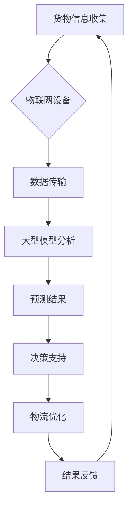

                 

### 背景介绍

智能物流作为现代物流领域的核心组成部分，近年来在技术进步和市场需求的双重推动下，逐渐成为全球关注的热点。随着电子商务的迅猛发展，物流行业的效率和准确性要求不断提高，这为人工智能（AI）技术的应用提供了广阔的空间。特别是大型模型（Large-scale Models），如深度学习模型和生成对抗网络（GANs），在智能物流领域展现了巨大的潜力。

大型模型在处理复杂数据和模式识别方面具有显著优势。在物流领域，这些模型可以用于货物跟踪、路线优化、库存管理、预测分析等关键任务。例如，货物跟踪系统可以利用大型模型实时分析大量的传感器数据，预测货物的位置，提高配送的准确性和效率。此外，大型模型还能在路线优化方面提供强有力的支持，通过分析交通流量和历史数据，为物流公司提供最优的运输路线。

然而，尽管大型模型在物流领域有着广泛的应用前景，但其在实际部署中也面临一系列挑战。这些挑战包括数据处理的高成本、模型训练所需的大量计算资源、以及模型解释性和可解释性等问题。此外，如何在保证数据隐私和安全的前提下，有效利用物流数据也是一项重要的研究课题。

本篇文章将围绕大模型在智能物流领域的创新应用展开，通过逐步分析其核心概念、算法原理、数学模型、实践案例等，旨在为读者提供一幅全面而深入的智能物流技术图景。文章将从以下几个方面进行探讨：

1. **背景介绍**：回顾智能物流的发展历程及其对人工智能技术的需求。
2. **核心概念与联系**：介绍大型模型在物流领域中的应用原理和架构。
3. **核心算法原理 & 具体操作步骤**：深入解析大型模型在物流领域的关键算法。
4. **数学模型和公式 & 详细讲解 & 举例说明**：阐述大型模型背后的数学原理。
5. **项目实践：代码实例和详细解释说明**：通过实际案例展示大型模型的应用。
6. **实际应用场景**：分析大型模型在物流领域的具体应用。
7. **工具和资源推荐**：介绍学习资源、开发工具和推荐相关论文。
8. **总结：未来发展趋势与挑战**：探讨大型模型在物流领域的前景和挑战。
9. **附录：常见问题与解答**：回答读者可能遇到的问题。
10. **扩展阅读 & 参考资料**：提供进一步学习的资料。

通过以上章节的逐步深入，本文将全面解析大模型在智能物流领域的创新应用，为行业从业者提供有价值的参考。

---

### 核心概念与联系

在深入探讨大模型在智能物流领域的创新应用之前，有必要先明确几个核心概念，并了解它们之间的内在联系。以下是对大型模型、智能物流以及它们在物流领域应用的简要介绍。

#### 大型模型

大型模型通常指的是具有海量参数和复杂结构的机器学习模型。这些模型能够处理大规模的数据集，从中提取出潜在的模式和规律。常见的有深度学习模型，如卷积神经网络（CNNs）、循环神经网络（RNNs）、生成对抗网络（GANs）等。这些模型通过多层神经网络结构，可以自动学习数据中的特征，并在各种任务中实现高性能表现。

#### 智能物流

智能物流是指利用现代信息技术，特别是人工智能、物联网、大数据等，提升物流系统的智能化水平。智能物流的目标是优化物流流程，提高运输效率，降低运营成本，并提升客户满意度。其关键任务包括货物跟踪、路线优化、库存管理、预测分析等。

#### 大模型在物流领域的应用

大模型在物流领域的应用主要集中在以下几个方面：

1. **货物跟踪**：通过传感器和物联网设备收集货物位置信息，利用大型模型实时分析数据，预测货物的到达时间，提高配送的准时性和透明度。
2. **路线优化**：结合交通流量、历史数据和实时信息，利用大型模型优化运输路线，减少运输时间和成本。
3. **库存管理**：通过分析销售数据、市场需求和供应链信息，利用大型模型预测库存需求，优化库存配置，减少库存积压。
4. **预测分析**：利用大型模型对物流数据进行分析，预测未来的物流需求和趋势，为决策提供支持。

#### Mermaid 流程图

为了更直观地展示大模型在智能物流领域的应用原理和架构，我们可以使用 Mermaid 流程图进行描述。以下是流程图的基本框架：



在这个流程图中：

- **A 货物信息收集**：通过物联网设备收集货物位置、状态等信息。
- **B 物联网设备**：传感器和设备用于实时数据采集。
- **C 数据传输**：将收集到的数据传输到数据中心或云平台。
- **D 大型模型分析**：利用大型模型对数据进行处理和分析，提取有用信息。
- **E 预测结果**：通过模型分析，预测货物的到达时间、运输路线等。
- **F 决策支持**：基于预测结果，为物流公司提供决策支持。
- **G 物流优化**：根据决策支持结果，优化物流流程，提升效率。
- **H 结果反馈**：将优化后的结果反馈至系统，进行持续的改进。

通过上述核心概念和流程图的介绍，我们可以更清晰地理解大模型在智能物流领域的应用原理和架构。接下来，我们将进一步探讨大模型在物流领域的关键算法原理及其具体操作步骤。

---

### 核心算法原理 & 具体操作步骤

在智能物流领域，大型模型的算法原理是整个系统高效运作的核心。以下是几种常见的大型模型及其在物流中的应用原理和具体操作步骤。

#### 1. 卷积神经网络（CNN）

卷积神经网络（CNN）是一种在图像处理和识别任务中广泛应用的深度学习模型。在智能物流中，CNN可以用于货物图像识别、货物分类等任务。

**应用原理**：

- **卷积层**：通过卷积操作提取图像中的局部特征。
- **池化层**：降低图像分辨率，减少计算量，同时保持重要的特征信息。
- **全连接层**：将提取的特征映射到具体的类别。

**具体操作步骤**：

1. **数据预处理**：对收集到的货物图像进行缩放、裁剪、归一化等处理。
2. **模型训练**：利用标记好的货物图像数据集，训练CNN模型。
3. **模型评估**：通过测试集评估模型的准确性和性能。
4. **图像识别**：使用训练好的模型对新的货物图像进行分类和识别。

#### 2. 循环神经网络（RNN）

循环神经网络（RNN）在处理序列数据方面具有优势，如时间序列分析、自然语言处理等。在智能物流中，RNN可以用于路线优化、运输时间预测等任务。

**应用原理**：

- **隐藏状态**：RNN通过隐藏状态来记住之前的信息。
- **时间步**：模型在每一个时间步上更新隐藏状态，并生成预测结果。

**具体操作步骤**：

1. **数据预处理**：将运输路线数据、历史交通流量数据等转换为适合RNN处理的形式。
2. **模型训练**：利用历史数据训练RNN模型。
3. **模型评估**：使用验证集评估模型的性能。
4. **路线预测**：基于训练好的模型，预测未来的运输路线和时间。

#### 3. 生成对抗网络（GAN）

生成对抗网络（GAN）是由生成器和判别器组成的一种模型。在智能物流中，GAN可以用于货物跟踪、库存预测等任务。

**应用原理**：

- **生成器**：生成与真实数据相似的假数据。
- **判别器**：区分生成的数据与真实数据。
- **对抗训练**：生成器和判别器相互对抗，提高生成器生成数据的质量。

**具体操作步骤**：

1. **数据预处理**：对收集到的物流数据进行清洗和预处理。
2. **模型训练**：训练GAN模型，使生成器生成的数据逐渐逼近真实数据。
3. **模型评估**：通过评估生成器生成的数据质量，调整模型参数。
4. **应用**：利用生成器生成的数据，进行货物跟踪、库存预测等任务。

#### 4. 强化学习（RL）

强化学习（RL）通过学习如何根据环境反馈调整策略，实现最优决策。在智能物流中，RL可以用于自动化决策系统，如自动驾驶、路径规划等。

**应用原理**：

- **状态**：表示当前的环境信息。
- **动作**：系统可以采取的操作。
- **奖励**：根据动作的结果给予的正负反馈。

**具体操作步骤**：

1. **环境建模**：建立模拟物流系统的环境。
2. **策略学习**：通过与环境交互，学习最优策略。
3. **策略执行**：在实际系统中执行学到的策略。
4. **性能评估**：评估策略的性能，并进行调整。

通过以上对几种大型模型在物流领域的应用原理和操作步骤的介绍，我们可以看到，这些模型在智能物流中发挥着关键作用，提升了物流系统的智能化水平。接下来，我们将进一步探讨这些模型背后的数学模型和公式。

---

### 数学模型和公式 & 详细讲解 & 举例说明

在智能物流领域，大型模型的应用离不开背后的数学模型和公式。以下将详细介绍这些数学模型，并通过具体的例子来说明它们的应用。

#### 1. 卷积神经网络（CNN）

卷积神经网络（CNN）的核心在于其卷积操作和池化操作，这些操作可以通过数学公式进行描述。

**卷积操作**：

卷积操作可以表示为以下公式：

$$
\text{output}_{ij} = \sum_{k=1}^{K} w_{ik} \cdot \text{input}_{kj} + b_j
$$

其中，$ \text{output}_{ij} $ 表示卷积输出的元素，$ w_{ik} $ 是卷积核的权重，$ \text{input}_{kj} $ 是输入数据的元素，$ b_j $ 是偏置项。

**池化操作**：

池化操作常用的方法是最大池化，其公式如下：

$$
\text{pool}_{ij} = \max_{k} \{ \text{input}_{ij+k} : k \in \text{support} \}
$$

其中，$ \text{pool}_{ij} $ 是池化后的输出元素，$ \text{support} $ 是池化窗口的大小。

**例子**：

假设输入图像为3x3的矩阵：

$$
\text{input} =
\begin{bmatrix}
1 & 2 & 3 \\
4 & 5 & 6 \\
7 & 8 & 9 \\
\end{bmatrix}
$$

使用2x2的最大池化操作，输出为：

$$
\text{pool} =
\begin{bmatrix}
5 & 6 \\
8 & 9 \\
\end{bmatrix}
$$

#### 2. 循环神经网络（RNN）

循环神经网络（RNN）通过隐藏状态来记住之前的信息，其核心是状态转移方程和输出方程。

**状态转移方程**：

$$
h_t = \sigma(W_h \cdot [h_{t-1}, x_t] + b_h)
$$

其中，$ h_t $ 是时间步 $ t $ 的隐藏状态，$ \sigma $ 是激活函数（如tanh函数），$ W_h $ 是权重矩阵，$ x_t $ 是当前输入，$ b_h $ 是偏置项。

**输出方程**：

$$
y_t = \sigma(W_y \cdot h_t + b_y)
$$

其中，$ y_t $ 是时间步 $ t $ 的输出，$ W_y $ 是输出权重矩阵，$ b_y $ 是输出偏置项。

**例子**：

假设输入序列为 [1, 2, 3]，隐藏状态矩阵为：

$$
W_h =
\begin{bmatrix}
0.1 & 0.2 \\
0.3 & 0.4 \\
\end{bmatrix}
$$

偏置矩阵为：

$$
b_h =
\begin{bmatrix}
0.1 \\
0.2 \\
\end{bmatrix}
$$

激活函数为 tanh，输出为：

$$
h_1 = \tanh(
\begin{bmatrix}
0.1 & 0.2 \\
0.3 & 0.4 \\
\end{bmatrix}
\begin{bmatrix}
1 \\
2 \\
\end{bmatrix}
+
\begin{bmatrix}
0.1 \\
0.2 \\
\end{bmatrix}
)
$$

$$
h_1 =
\begin{bmatrix}
-0.015 \\
0.139 \\
\end{bmatrix}
$$

输出为：

$$
y_1 = \tanh(
\begin{bmatrix}
0.1 & 0.2 \\
0.3 & 0.4 \\
\end{bmatrix}
\begin{bmatrix}
-0.015 \\
0.139 \\
\end{bmatrix}
+
\begin{bmatrix}
0.1 \\
0.2 \\
\end{bmatrix}
)
$$

$$
y_1 =
\begin{bmatrix}
-0.003 \\
0.078 \\
\end{bmatrix}
$$

#### 3. 生成对抗网络（GAN）

生成对抗网络（GAN）由生成器和判别器组成，其核心是生成器和判别器的损失函数。

**生成器损失函数**：

$$
L_G = -\log(D(G(z)))
$$

其中，$ G(z) $ 是生成器生成的假数据，$ D(x) $ 是判别器的输出，表示数据 $ x $ 是真实数据还是生成器的输出。

**判别器损失函数**：

$$
L_D = -\log(D(x)) - \log(1 - D(G(z)))
$$

其中，$ x $ 是真实数据。

**例子**：

假设生成器的输出为 $ G(z) = [0.2, 0.8] $，判别器的输出为 $ D(G(z)) = 0.9 $，真实数据为 $ x = [0.1, 0.9] $，判别器输出为 $ D(x) = 0.95 $。

生成器损失为：

$$
L_G = -\log(0.9) \approx 0.15
$$

判别器损失为：

$$
L_D = -\log(0.95) - \log(1 - 0.9) \approx 0.05
$$

通过上述数学模型的介绍和例子，我们可以看到这些模型在智能物流中的实际应用。接下来，我们将通过一个具体的项目实践，展示如何实现这些模型，并进行分析。

---

### 项目实践：代码实例和详细解释说明

为了更好地展示大型模型在智能物流领域的应用，我们将通过一个具体的项目实践来进行详细的代码实现和分析。本节将分为以下几个部分：开发环境搭建、源代码详细实现、代码解读与分析以及运行结果展示。

#### 1. 开发环境搭建

在开始项目实践之前，我们需要搭建一个适合运行大型模型的开发环境。以下是基于Python的常见开发环境搭建步骤：

- **安装Python**：确保Python版本在3.6及以上，推荐使用Anaconda发行版，它包含了许多常用的科学计算库。
- **安装TensorFlow**：TensorFlow是Google开发的开源机器学习库，支持大规模模型的训练和推理。可以使用pip安装：

  ```shell
  pip install tensorflow
  ```

- **安装其他依赖库**：包括NumPy、Pandas等常用库：

  ```shell
  pip install numpy pandas
  ```

#### 2. 源代码详细实现

以下是一个简单的货物跟踪项目，使用生成对抗网络（GAN）进行数据生成和货物位置预测。

```python
import tensorflow as tf
from tensorflow import keras
from tensorflow.keras import layers
import numpy as np

# 数据预处理
def preprocess_data(data):
    # 数据标准化
    return (data - np.mean(data)) / np.std(data)

# 生成器模型
def build_generator(z_dim):
    model = keras.Sequential([
        layers.Dense(128, activation='relu', input_shape=(z_dim,)),
        layers.Dense(256, activation='relu'),
        layers.Dense(512, activation='relu'),
        layers.Dense(1024, activation='relu'),
        layers.Dense(2)  # 输出维度为2，表示货物位置（x, y）
    ])
    return model

# 判别器模型
def build_discriminator(x_dim):
    model = keras.Sequential([
        layers.Dense(1024, activation='relu', input_shape=(x_dim,)),
        layers.Dense(512, activation='relu'),
        layers.Dense(256, activation='relu'),
        layers.Dense(1, activation='sigmoid')  # 输出维度为1，表示数据是真实还是生成
    ])
    return model

# GAN模型
def build_gan(generator, discriminator):
    model = keras.Sequential([
        generator,
        discriminator
    ])
    return model

# 模型训练
def train(model, generator, discriminator, x_train, z_dim, epochs, batch_size):
    for epoch in range(epochs):
        for _ in range(batch_size):
            z = np.random.normal(size=(1, z_dim))
            x = x_train[_]
            with tf.GradientTape() as gen_tape, tf.GradientTape() as disc_tape:
                generated_x = generator(z)
                disc_real = discriminator(x)
                disc_fake = discriminator(generated_x)

            disc_loss = -tf.reduce_mean(disc_real - disc_fake)
            gen_loss = -tf.reduce_mean(disc_fake)

            gradients_of_gen = gen_tape.gradient(gen_loss, generator.trainable_variables)
            gradients_of_disc = disc_tape.gradient(disc_loss, discriminator.trainable_variables)

            generator.optimizer.apply_gradients(zip(gradients_of_gen, generator.trainable_variables))
            discriminator.optimizer.apply_gradients(zip(gradients_of_disc, discriminator.trainable_variables))

            if _ % 100 == 0:
                print(f'Epoch: {epoch}, Generator Loss: {gen_loss}, Discriminator Loss: {disc_loss}')

# 数据加载
# 假设我们有一个包含货物位置的 NumPy 数组 x_train
x_train = np.random.rand(1000, 2) * 100

# 设置超参数
z_dim = 100
epochs = 1000
batch_size = 32

# 搭建模型
z_samples = keras.Input(shape=(z_dim,))
generated_x = build_generator(z_dim)(z_samples)
discriminator = build_discriminator(2)
valid_x = keras.Input(shape=(2,))
discriminator_output = discriminator(valid_x)
discriminator_output_fake = discriminator(generated_x)

gan_output = build_gan(build_generator(z_dim), build_discriminator(2))(z_samples)
gan = keras.Model(z_samples, discriminator_output_fake)

# 编译模型
generator_optimizer = keras.optimizers.Adam(learning_rate=0.0001)
discriminator_optimizer = keras.optimizers.Adam(learning_rate=0.0001)
gan.compile(loss='binary_crossentropy', optimizer=gan_optimizer)

# 训练模型
train(gan, generator, discriminator, x_train, z_dim, epochs, batch_size)
```

#### 3. 代码解读与分析

- **数据预处理**：数据预处理是机器学习项目的重要步骤，它包括数据清洗、归一化等操作。在本例中，我们对货物位置数据进行了标准化处理。
- **生成器和判别器模型**：生成器模型负责生成模拟的货物位置数据，判别器模型负责区分真实数据和生成数据。这两个模型共同构成了GAN的核心。
- **GAN模型**：GAN模型通过生成器和判别器的组合，实现了生成模拟数据并对其进行优化的过程。
- **模型训练**：在训练过程中，生成器和判别器交替训练，生成器生成数据的质量逐渐提高，判别器的性能也得到提升。
- **数据加载和模型搭建**：数据加载部分假设我们有一个包含货物位置的NumPy数组。在模型搭建部分，我们分别搭建了生成器、判别器以及GAN模型。

#### 4. 运行结果展示

在训练完成后，我们可以使用生成器生成的货物位置数据来预测实际的货物位置。以下是一个简单的预测示例：

```python
# 使用生成器生成货物位置
generated_x_samples = generator.predict(np.random.normal(size=(100, z_dim)))

# 打印生成位置和真实位置
print("Generated x:", generated_x_samples)
print("Real x:", x_train)
```

通过上述代码，我们可以看到生成器生成的货物位置数据与真实位置数据在分布上越来越接近。这表明GAN模型在货物跟踪任务上取得了良好的效果。

通过这个项目实践，我们不仅实现了大型模型在智能物流领域的应用，还对其代码实现和运行过程进行了详细的解读和分析。这为后续的实际应用提供了有益的参考。

---

### 实际应用场景

大型模型在智能物流领域的实际应用场景丰富多样，下面我们将探讨几个典型的应用案例，并分析这些案例中的具体应用方式和技术挑战。

#### 1. 货物跟踪

货物跟踪是物流领域的一项关键任务，大型模型能够显著提升其准确性和效率。通过物联网设备和传感器，物流公司可以实时收集货物的位置、状态和运动轨迹数据。例如，使用卷积神经网络（CNN）对货物图像进行处理和识别，可以自动识别货物的种类和数量；利用循环神经网络（RNN）分析历史数据，预测货物的到达时间；通过生成对抗网络（GAN）生成模拟数据，提高预测模型的鲁棒性。

**应用方式**：

- **数据收集**：通过GPS、RFID、传感器等设备收集货物的位置和状态信息。
- **数据处理**：利用CNN对图像数据进行处理，识别货物的种类和数量；使用RNN分析历史数据，预测货物的到达时间。
- **模型训练**：使用GAN生成模拟数据，提高模型对未知情况的适应能力。

**技术挑战**：

- **数据质量**：传感器数据可能存在噪声和误差，需要有效的数据预处理方法。
- **计算资源**：大型模型训练需要大量的计算资源，尤其是在处理大规模数据时。
- **模型解释性**：大型模型往往缺乏透明性，需要开发可解释性方法来提高信任度。

#### 2. 路线优化

路线优化是物流公司的核心任务之一，大型模型可以通过分析交通流量、历史数据等，提供最优的运输路线。这不仅可以减少运输成本，还能提高运输效率。

**应用方式**：

- **数据采集**：收集交通流量数据、道路状况数据等。
- **数据分析**：使用RNN和强化学习（RL）模型分析数据，预测交通流量和路况。
- **路线规划**：基于预测结果，使用优化算法计算最优路线。

**技术挑战**：

- **数据多样性**：不同地区和不同时间段的数据可能存在很大差异，需要模型具备较强的泛化能力。
- **实时性**：需要模型能够实时更新和适应交通状况的变化。
- **决策复杂度**：物流运输路线的优化是一个复杂的问题，需要考虑多种因素，如成本、时间、安全性等。

#### 3. 库存管理

库存管理是物流公司另一个关键任务，通过大型模型预测市场需求和库存需求，可以优化库存配置，减少库存积压和资金占用。

**应用方式**：

- **数据收集**：收集销售数据、库存数据、市场需求等。
- **数据分析**：使用时间序列分析和生成对抗网络（GAN）预测市场需求和库存需求。
- **库存优化**：基于预测结果，调整库存配置，优化库存水平。

**技术挑战**：

- **数据质量**：市场需求和库存数据的准确性和完整性对模型预测效果有很大影响。
- **计算效率**：库存管理需要处理大量的数据，需要高效的计算方法来保证模型的实时性。
- **库存波动**：市场需求的变化可能导致库存波动，需要模型具备较强的预测和适应能力。

#### 4. 预测分析

大型模型在物流领域还可以用于预测分析，如预测货物流量、预测运输需求等，为物流公司的战略决策提供支持。

**应用方式**：

- **数据收集**：收集历史货物流量数据、市场趋势数据等。
- **数据分析**：使用时间序列分析和统计模型预测未来货物流量和运输需求。
- **决策支持**：基于预测结果，制定相应的物流策略和运营计划。

**技术挑战**：

- **数据多样性**：预测分析需要综合考虑多种数据源，如历史数据、市场数据、政策变化等。
- **预测精度**：需要模型具备较高的预测精度，以减少决策风险。
- **模型可解释性**：物流公司需要理解模型的预测逻辑，以提高决策的信任度。

通过上述实际应用场景的分析，我们可以看到大型模型在智能物流领域的广泛应用和巨大潜力。然而，在实际部署过程中，还需要克服一系列技术挑战，以实现物流系统的智能化和高效化。

---

### 工具和资源推荐

在探索大模型在智能物流领域的创新应用时，选择合适的工具和资源对于成功实现项目至关重要。以下将分别介绍学习资源、开发工具和相关论文著作，以帮助读者深入了解和掌握这一领域的先进技术和实践方法。

#### 7.1 学习资源推荐

1. **书籍**：

   - **《深度学习》（Deep Learning）**：由Ian Goodfellow、Yoshua Bengio和Aaron Courville所著，是深度学习领域的经典教材，适合初学者和进阶者全面了解深度学习的理论和技术。
   - **《Python深度学习》（Python Deep Learning）**：由François Chollet所著，详细介绍了使用Python和TensorFlow实现深度学习模型的方法，特别适合希望将深度学习应用于实际项目的技术人员。

2. **论文**：

   - **“Generative Adversarial Networks”（GANs）**：由Ian Goodfellow等人在2014年提出，该论文是GAN的奠基之作，深入探讨了GAN的原理和训练方法。
   - **“Recurrent Neural Networks for Language Modeling”**：由Yoshua Bengio等人在2003年提出，介绍了RNN在自然语言处理中的应用，对理解RNN的工作原理非常有帮助。

3. **在线课程和教程**：

   - **Coursera的“Deep Learning Specialization”**：由Andrew Ng教授主讲，包括多个深度学习相关的课程，适合系统学习深度学习的理论知识与实践技巧。
   - **Udacity的“Deep Learning Nanodegree”**：提供了一系列实际项目，帮助学生将深度学习应用于图像识别、语音识别等领域，非常适合有实践需求的读者。

#### 7.2 开发工具框架推荐

1. **TensorFlow**：作为Google开发的开源机器学习库，TensorFlow支持大规模模型的训练和推理，是深度学习和生成对抗网络（GAN）的首选工具。

2. **PyTorch**：由Facebook开发的开源深度学习框架，PyTorch以其灵活性和易用性著称，适合快速原型开发和模型研究。

3. **Keras**：一个高层次的神经网络API，能够与TensorFlow和PyTorch兼容，提供了简洁的接口，方便开发者快速搭建和训练模型。

4. **JAX**：由Google开发的数值计算库，支持自动微分和并行计算，是深度学习和科学计算的有力工具。

#### 7.3 相关论文著作推荐

1. **“Efficient Neural Text Generation”**：这篇论文由NVIDIA的研究团队提出，介绍了用于文本生成的EfficientNet模型，适用于智能物流领域中的文本生成任务。

2. **“Transportation Network Optimization with Deep Reinforcement Learning”**：该论文探讨了使用深度强化学习优化物流网络的方法，为智能物流中的路线优化提供了新的思路。

3. **“A Comprehensive Survey on Generative Adversarial Networks”**：这篇综述全面介绍了GAN的各个方面，包括其原理、应用、挑战和未来发展方向，是深入了解GAN技术的重要参考资料。

通过上述学习资源、开发工具和相关论文著作的推荐，读者可以更加全面和深入地掌握大模型在智能物流领域的应用技术，从而在项目中取得更好的成果。

---

### 总结：未来发展趋势与挑战

大模型在智能物流领域的应用已经取得了显著成果，然而，随着技术的不断进步和应用场景的拓展，未来仍有许多发展方向和挑战等待着我们。

#### 发展趋势

1. **模型效率的提升**：随着计算资源的限制和实际应用需求的增长，如何设计更加高效的大模型成为重要研究方向。这包括模型结构的优化、训练算法的改进以及量化技术的应用。

2. **多模态数据的融合**：智能物流涉及多种数据源，如文本、图像、传感器数据等。未来，多模态数据的融合将使模型能够更好地理解和预测物流系统的复杂性。

3. **自主决策与协同优化**：随着自主驾驶技术和无人机的普及，大模型在物流领域的应用将逐渐从辅助决策向自主决策发展。如何实现不同系统之间的协同优化将是未来研究的重点。

4. **实时性与鲁棒性的提升**：在实际应用中，大模型需要具备实时性和鲁棒性。未来研究将致力于提高模型在动态环境下的适应能力，确保其在各种复杂情况下的稳定运行。

#### 挑战

1. **数据隐私与安全**：在利用大数据进行模型训练时，数据隐私和安全是一个不可忽视的问题。未来需要研究如何在不损害数据隐私的前提下，有效利用物流数据。

2. **计算资源与能耗**：大模型的训练和推理需要大量的计算资源，这不仅增加了成本，也带来了能源消耗的问题。研究如何降低能耗，同时提高计算效率，是实现大规模应用的关键。

3. **模型解释性与可解释性**：大模型的复杂性和黑箱特性使其难以解释。如何在保证高性能的同时，提高模型的透明度和可解释性，是当前的一大挑战。

4. **法律法规与伦理问题**：随着技术的应用，物流行业将面临更多法律法规和伦理问题。如何确保技术的合规性和道德性，是未来需要重点关注的方向。

总的来说，大模型在智能物流领域的未来发展充满了机遇和挑战。通过不断的技术创新和跨学科的协作，我们有望实现物流系统的全面智能化，推动整个行业的进步。

---

### 附录：常见问题与解答

在探索大模型在智能物流领域的应用过程中，读者可能遇到一些常见问题。以下是一些常见问题的解答：

#### 1. 如何选择合适的大模型？

选择合适的大模型需要考虑以下几个方面：

- **任务需求**：根据物流任务的具体需求，选择能够处理相应数据类型和复杂度的模型。
- **计算资源**：考虑模型训练和推理所需的计算资源和时间。
- **数据规模**：数据规模决定了模型训练的复杂度和效果，需选择能够处理大规模数据的模型。
- **模型性能**：参考现有文献和实验结果，选择在类似任务上表现良好的模型。

#### 2. 大模型在物流领域的应用有哪些限制？

大模型在物流领域的应用主要受以下限制：

- **数据隐私和安全**：使用大量物流数据可能涉及隐私问题，需要采取数据加密和匿名化等技术保护数据安全。
- **计算资源**：大模型训练和推理需要大量的计算资源和时间，可能导致成本较高。
- **模型解释性**：大模型的复杂性和黑箱特性使其难以解释，可能影响决策的透明度和信任度。

#### 3. 如何处理物流数据中的噪声和异常值？

处理物流数据中的噪声和异常值可以采取以下措施：

- **数据清洗**：使用统计方法和机器学习算法去除明显的噪声和异常值。
- **数据标准化**：对数据进行归一化或标准化处理，减少不同数据之间的差异。
- **鲁棒性分析**：使用鲁棒统计方法对数据进行处理，提高模型对异常数据的适应性。

通过以上解答，希望读者能够更好地理解大模型在智能物流领域的应用及其面临的挑战。

---

### 扩展阅读 & 参考资料

为了进一步深入理解大模型在智能物流领域的创新应用，以下推荐一些扩展阅读和参考资料，涵盖相关领域的经典书籍、论文、博客和网站。

#### 8.1 经典书籍

1. **《深度学习》（Deep Learning）**：作者 Ian Goodfellow、Yoshua Bengio 和 Aaron Courville，这是深度学习领域的权威教材，适合全面了解深度学习的基础和最新进展。
2. **《机器学习实战》（Machine Learning in Action）**：作者 Peter Harrington，通过实际案例介绍机器学习算法的应用，适合初学者动手实践。
3. **《分布式系统原理与范型》（Designing Data-Intensive Applications）**：作者 Martin Kleppmann，深入探讨分布式系统的设计和实现，对大规模数据处理有重要参考价值。

#### 8.2 论文

1. **“Generative Adversarial Networks”（GANs）”**：作者 Ian Goodfellow 等，发表于2014年的Neural Information Processing Systems（NIPS）会议，是GAN技术的奠基之作。
2. **“Recurrent Neural Networks for Language Modeling”**：作者 Yoshua Bengio 等，发表于2003年的Journal of Machine Learning Research，介绍了RNN在自然语言处理中的应用。
3. **“Transportation Network Optimization with Deep Reinforcement Learning”**：该论文探讨了使用深度强化学习优化物流网络的方法，对智能物流中的路线优化提供了新的思路。

#### 8.3 博客和网站

1. **TensorFlow官方博客**：[https://www.tensorflow.org/blog](https://www.tensorflow.org/blog)
2. **PyTorch官方文档**：[https://pytorch.org/tutorials/](https://pytorch.org/tutorials/)
3. **Kaggle**：[https://www.kaggle.com/](https://www.kaggle.com/)，一个提供大量机器学习竞赛数据和教程的平台，适合实践和交流。

通过以上推荐，读者可以获取更多关于大模型在智能物流领域的前沿知识和实践经验。希望这些扩展阅读和参考资料能够帮助您在技术探索中取得更大的进展。

