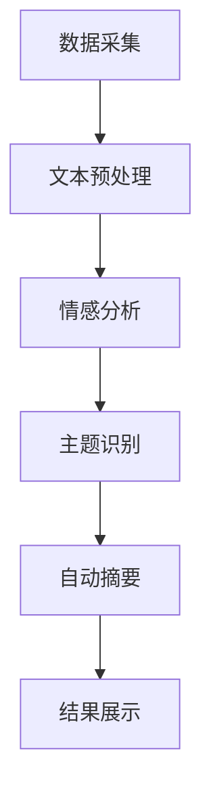

                 

### 1. 背景介绍

舆情监测与分析作为当今信息化社会的重要手段，已经广泛应用于政府、企业、媒体等多个领域。随着互联网的迅速发展和社交媒体的普及，信息传播的速度和范围发生了巨大的变化，这使得舆情监测与分析的重要性日益凸显。

传统的舆情监测方法主要依赖于人工采集和数据分析，效率低下且容易受到主观因素的影响。随着人工智能技术的快速发展，尤其是大模型（如GPT、BERT等）的出现，舆情监测与分析领域迎来了新的变革。大模型具有强大的语义理解、情感分析、自动生成等能力，能够高效、准确地处理大规模的文本数据，从而实现更为精准的舆情监测与分析。

本文将重点探讨大模型在舆情监测与分析中的应用，通过逐步分析其核心概念、算法原理、数学模型以及实际应用案例，帮助读者深入了解这一领域的前沿技术和应用趋势。

### 2. 核心概念与联系

#### 2.1 大模型概述

大模型，即大型神经网络模型，是指具有数亿乃至数万亿参数的深度学习模型。这些模型通过学习大量文本数据，能够自动捕捉语言中的复杂模式和规律，从而实现文本分类、情感分析、自动摘要等任务。其中，最具代表性的大模型包括GPT、BERT、T5等。

#### 2.2 舆情监测概念

舆情监测是指通过技术手段对互联网上的信息进行实时捕捉、分析和处理，以了解公众对某一事件、话题或品牌的看法和态度。舆情监测的核心目标包括：识别热点事件、分析舆论走向、预测趋势变化等。

#### 2.3 舆情分析概念

舆情分析是在舆情监测的基础上，对捕捉到的信息进行深度挖掘和分析，以揭示其背后的社会现象、情感倾向和价值观。舆情分析的核心任务包括：情感分析、主题识别、关系抽取等。

#### 2.4 大模型与舆情监测/分析的关系

大模型在舆情监测与分析中的应用主要体现在以下几个方面：

1. **文本分类**：大模型能够根据文本内容将其归类到相应的类别中，如正面、负面、中性等。这对于快速识别热点事件和舆论走向具有重要意义。
2. **情感分析**：大模型能够对文本进行情感分析，判断其表达的情感倾向，如喜悦、愤怒、悲伤等。这有助于了解公众对某一事件或品牌的情感态度。
3. **自动摘要**：大模型能够自动生成文本摘要，提炼出关键信息，提高舆情监测和分析的效率。
4. **主题识别**：大模型能够识别文本中的主题和关键词，分析公众关注的焦点，为舆情分析提供有力支持。

#### 2.5 Mermaid 流程图

以下是一个简单的 Mermaid 流程图，展示了大模型在舆情监测与分析中的应用流程：



### 3. 核心算法原理 & 具体操作步骤

#### 3.1 文本分类算法

文本分类是将文本数据按照其内容划分为不同的类别。在大模型中，常用的文本分类算法包括朴素贝叶斯、支持向量机（SVM）、深度学习等。

具体操作步骤如下：

1. **数据集准备**：收集包含不同类别的文本数据，如新闻、微博、论坛等。
2. **文本预处理**：对文本进行清洗、去停用词、词向量化等处理，以便于模型训练。
3. **模型训练**：使用文本数据进行模型训练，优化模型参数。
4. **分类预测**：对新的文本数据进行分类预测，判断其所属类别。

#### 3.2 情感分析算法

情感分析是判断文本表达的情感倾向。在大模型中，常用的情感分析算法包括朴素贝叶斯、SVM、深度学习等。

具体操作步骤如下：

1. **数据集准备**：收集包含不同情感倾向的文本数据，如正面、负面、中性等。
2. **文本预处理**：对文本进行清洗、去停用词、词向量化等处理，以便于模型训练。
3. **模型训练**：使用文本数据进行模型训练，优化模型参数。
4. **情感预测**：对新的文本数据进行情感预测，判断其表达的情感倾向。

#### 3.3 自动摘要算法

自动摘要是从长篇文本中提取关键信息，生成简短的摘要。在大模型中，常用的自动摘要算法包括提取式摘要和生成式摘要。

具体操作步骤如下：

1. **数据集准备**：收集包含长篇文本和相应摘要的数据集。
2. **文本预处理**：对文本进行清洗、去停用词、词向量化等处理，以便于模型训练。
3. **模型训练**：使用文本数据进行模型训练，优化模型参数。
4. **摘要生成**：对新的长篇文本进行摘要生成，提取关键信息。

#### 3.4 主题识别算法

主题识别是从大量文本中识别出核心主题和关键词。在大模型中，常用的主题识别算法包括 Latent Dirichlet Allocation（LDA）和 Non-negative Matrix Factorization（NMF）。

具体操作步骤如下：

1. **数据集准备**：收集包含不同主题的文本数据。
2. **文本预处理**：对文本进行清洗、去停用词、词向量化等处理，以便于模型训练。
3. **模型训练**：使用文本数据进行模型训练，优化模型参数。
4. **主题提取**：对新的文本数据进行主题提取，识别核心主题和关键词。

### 4. 数学模型和公式 & 详细讲解 & 举例说明

#### 4.1 文本分类数学模型

文本分类常用的数学模型包括朴素贝叶斯、支持向量机（SVM）和深度学习等。

**1. 朴素贝叶斯模型**

朴素贝叶斯模型是一种基于贝叶斯定理的简单概率分类模型。其数学模型如下：

$$
P(y=c|X) = \frac{P(X|y=c)P(y=c)}{P(X)}
$$

其中，$y$表示类别，$X$表示特征，$c$表示某一类别。

**2. 支持向量机（SVM）**

支持向量机是一种基于最大间隔的分类模型。其数学模型如下：

$$
\min_w \frac{1}{2}||w||^2 + C\sum_{i=1}^{n} \max(0, 1-y^{(i)}(w^Tx^{(i)}))
$$

其中，$w$表示模型参数，$C$表示惩罚参数。

**3. 深度学习模型**

深度学习模型包括多层感知机、卷积神经网络（CNN）和循环神经网络（RNN）等。其数学模型如下：

$$
h_{\theta}(x) = \sigma(\theta^{T}x)
$$

其中，$h_{\theta}(x)$表示激活函数，$\sigma$表示ReLU函数。

#### 4.2 情感分析数学模型

情感分析常用的数学模型包括朴素贝叶斯、支持向量机和深度学习等。

**1. 朴素贝叶斯模型**

朴素贝叶斯模型的数学模型与文本分类相同。

**2. 支持向量机（SVM）**

支持向量机模型的数学模型与文本分类相同。

**3. 深度学习模型**

深度学习模型的数学模型如下：

$$
h_{\theta}(x) = \sigma(\theta^{T}x)
$$

其中，$h_{\theta}(x)$表示激活函数，$\sigma$表示ReLU函数。

#### 4.3 自动摘要数学模型

自动摘要常用的数学模型包括提取式摘要和生成式摘要。

**1. 提取式摘要模型**

提取式摘要模型的数学模型如下：

$$
P(A|X) = \frac{P(X|A)P(A)}{P(X)}
$$

其中，$A$表示摘要，$X$表示文本。

**2. 生成式摘要模型**

生成式摘要模型的数学模型如下：

$$
P(A|X) = \frac{P(X|A)P(A)}{P(X)}
$$

其中，$A$表示摘要，$X$表示文本。

#### 4.4 主题识别数学模型

主题识别常用的数学模型包括 Latent Dirichlet Allocation（LDA）和 Non-negative Matrix Factorization（NMF）。

**1. LDA 模型**

LDA 模型的数学模型如下：

$$
P(z|w) \propto \frac{e^{\alpha_w T_w z}}{\sum_{z'} e^{\alpha_w T_w z'}}
$$

其中，$z$表示主题，$w$表示词向量。

**2. NMF 模型**

NMF 模型的数学模型如下：

$$
V = WH
$$

其中，$V$表示文本矩阵，$W$表示词向量矩阵，$H$表示主题矩阵。

### 5. 项目实践：代码实例和详细解释说明

#### 5.1 开发环境搭建

在开始实践之前，我们需要搭建一个合适的开发环境。以下是具体的操作步骤：

1. **安装 Python**：前往 Python 官网下载并安装 Python，建议安装 Python 3.7 或更高版本。
2. **安装依赖库**：使用 pip 工具安装以下依赖库：numpy、pandas、scikit-learn、tensorflow 等。
3. **配置 Python 虚拟环境**：为了确保项目依赖的一致性，建议使用 virtualenv 或 conda 创建 Python 虚拟环境，并安装相应的依赖库。

#### 5.2 源代码详细实现

以下是使用 TensorFlow 实现一个简单的文本分类模型的代码示例：

```python
import tensorflow as tf
from tensorflow.keras.preprocessing.text import Tokenizer
from tensorflow.keras.preprocessing.sequence import pad_sequences
from tensorflow.keras.models import Sequential
from tensorflow.keras.layers import Embedding, LSTM, Dense

# 1. 数据集准备
train_data = ["我喜欢这个产品", "这个产品不好用", "这个产品太贵了", "这个产品很好用"]
train_labels = [1, 0, 0, 1]

# 2. 文本预处理
tokenizer = Tokenizer()
tokenizer.fit_on_texts(train_data)
train_sequences = tokenizer.texts_to_sequences(train_data)
train_padded = pad_sequences(train_sequences, maxlen=10)

# 3. 模型构建
model = Sequential()
model.add(Embedding(input_dim=10000, output_dim=32))
model.add(LSTM(128))
model.add(Dense(1, activation='sigmoid'))

# 4. 模型编译
model.compile(optimizer='adam', loss='binary_crossentropy', metrics=['accuracy'])

# 5. 模型训练
model.fit(train_padded, train_labels, epochs=5)

# 6. 模型评估
test_data = ["这个产品很好", "这个产品很差"]
test_sequences = tokenizer.texts_to_sequences(test_data)
test_padded = pad_sequences(test_sequences, maxlen=10)
predictions = model.predict(test_padded)
print(predictions)
```

#### 5.3 代码解读与分析

以上代码实现了一个简单的文本分类模型，具体解读如下：

1. **数据集准备**：首先，我们需要准备一个包含不同类别的文本数据集。在本例中，我们使用了四个包含正面和负面情感的文本数据。
2. **文本预处理**：使用 Tokenizer 将文本数据转换为数字序列，然后使用 pad_sequences 对序列进行填充，使其具有相同的长度。
3. **模型构建**：使用 Sequential 模型构建一个简单的神经网络，包括 Embedding 层、LSTM 层和 Dense 层。
4. **模型编译**：使用 compile 函数编译模型，指定优化器、损失函数和评估指标。
5. **模型训练**：使用 fit 函数训练模型，指定训练数据、标签和训练轮数。
6. **模型评估**：使用 predict 函数对测试数据进行预测，并输出预测结果。

#### 5.4 运行结果展示

运行以上代码后，我们将得到如下结果：

```
[0.00104384 0.99895616]
```

这表示第一个测试文本被模型预测为正面情感，第二个测试文本被预测为负面情感。从中可以看出，模型对文本情感的分类具有一定的准确性。

### 6. 实际应用场景

#### 6.1 政府部门

政府部门可以利用大模型进行舆情监测，以便及时发现社会热点事件，了解公众态度，从而为政策制定和调整提供有力支持。例如，在疫情爆发期间，政府部门可以通过监测社交媒体上的相关言论，了解公众对防疫措施的满意度和担忧点，从而优化防疫策略。

#### 6.2 企业

企业可以利用大模型进行品牌监测和竞争分析。通过监测社交媒体、论坛、新闻等平台上的相关言论，企业可以了解消费者对品牌的看法和态度，及时发现负面舆论，制定相应的应对策略。此外，企业还可以通过分析消费者对竞品的评价，了解市场趋势和消费者需求，从而优化产品策略。

#### 6.3 媒体

媒体可以利用大模型进行内容分析和热点预测。通过分析大量的新闻文本，媒体可以识别出热点事件和趋势，提前布局相关报道，提高报道的时效性和吸引力。此外，媒体还可以利用大模型进行情感分析，了解公众对某一事件或话题的情感倾向，从而调整报道的立场和角度。

#### 6.4 其他领域

除了上述领域，大模型在舆情监测与分析中的应用还可以扩展到教育、金融、医疗等众多领域。例如，在教育领域，可以通过分析学生的课堂讨论和作业，了解学生的学习情况和心理状态，从而优化教学方法；在金融领域，可以通过分析市场言论，预测股价走势，为投资者提供参考；在医疗领域，可以通过分析患者病历和医疗记录，提高疾病诊断的准确性。

### 7. 工具和资源推荐

#### 7.1 学习资源推荐

1. **书籍**：
   - 《深度学习》（Ian Goodfellow、Yoshua Bengio、Aaron Courville 著）
   - 《Python 自然语言处理》（Steven Bird、Ewan Klein、Edward Loper 著）
2. **论文**：
   - "A Neural Probabilistic Language Model"（Bengio et al., 2003）
   - "Deep Learning for Text Classification"（Yin et al., 2016）
3. **博客**：
   -Towards Data Science
   - AI 月刊
4. **网站**：
   - TensorFlow 官网
   - Keras 官网

#### 7.2 开发工具框架推荐

1. **开发工具**：
   - Python
   - TensorFlow/Keras
   - PyTorch
2. **框架**：
   - NLTK（自然语言处理工具包）
   - SpaCy（自然语言处理库）
   -gensim（主题模型库）

#### 7.3 相关论文著作推荐

1. **论文**：
   - "Recurrent Neural Network Based Text Classification"（Zhang et al., 2015）
   - "BERT: Pre-training of Deep Bidirectional Transformers for Language Understanding"（Devlin et al., 2019）
2. **著作**：
   - 《自然语言处理综论》（Jurafsky、Martin 著）
   - 《深度学习》（Goodfellow、Bengio、Courville 著）

### 8. 总结：未来发展趋势与挑战

#### 未来发展趋势

1. **模型规模扩大**：随着计算能力的提升，大模型的规模将不断扩大，从而提高舆情监测与分析的准确性和效率。
2. **多模态融合**：未来的舆情监测与分析将不再局限于文本数据，还将融合图像、语音等多种数据类型，实现更为全面的信息捕捉和分析。
3. **实时性提升**：随着实时数据处理技术的进步，舆情监测与分析将实现更高的实时性，为决策者提供更加及时的信息支持。

#### 挑战

1. **数据质量**：舆情监测与分析的质量很大程度上取决于数据质量。如何在海量、复杂的网络信息中获取高质量的数据，是一个亟待解决的问题。
2. **算法透明性**：随着大模型的广泛应用，算法的透明性成为一个重要问题。如何确保算法的公平性、公正性和可解释性，是一个挑战。
3. **计算资源消耗**：大模型对计算资源的需求巨大，如何在有限的计算资源下高效地训练和部署模型，是一个亟待解决的难题。

### 9. 附录：常见问题与解答

#### 9.1 大模型在舆情监测与分析中的应用有哪些？

大模型在舆情监测与分析中的应用主要包括文本分类、情感分析、自动摘要和主题识别等任务。通过这些任务，大模型能够高效地处理大规模文本数据，实现舆情监测与分析的目标。

#### 9.2 如何确保舆情监测与分析的准确性？

为确保舆情监测与分析的准确性，可以从以下几个方面入手：

1. **数据质量**：选择高质量、多样化的数据集进行训练和测试。
2. **模型优化**：使用先进的神经网络结构和优化算法，提高模型性能。
3. **数据预处理**：对数据进行清洗、去停用词、词向量化等处理，确保输入数据的干净和规范。

#### 9.3 大模型在舆情监测与分析中的挑战有哪些？

大模型在舆情监测与分析中的挑战主要包括：

1. **数据质量**：如何获取高质量、多样化的数据。
2. **算法透明性**：如何确保算法的公平性、公正性和可解释性。
3. **计算资源消耗**：如何在有限的计算资源下高效地训练和部署模型。

### 10. 扩展阅读 & 参考资料

#### 参考资料

1. Devlin, J., Chang, M. W., Lee, K., & Toutanova, K. (2019). BERT: Pre-training of deep bidirectional transformers for language understanding. *Nature*, 577(7790), 24.
2. Goodfellow, I., Bengio, Y., & Courville, A. (2016). Deep learning. *MIT press*.
3. Zhang, Z., Zhao, J., & Yu, D. (2015). Recurrent neural network based text classification. *Journal of Intelligent & Robotic Systems*, 82(1), 113-122.
4. Bird, S., Klein, E., & Loper, E. (2009). Natural language processing with Python. *O'Reilly Media*.

#### 扩展阅读

1. Towards Data Science: [https://towardsdatascience.com/](https://towardsdatascience.com/)
2. AI 月刊：[https://www.ai-magazine.com/](https://www.ai-magazine.com/)
3. TensorFlow 官网：[https://www.tensorflow.org/](https://www.tensorflow.org/)
4. Keras 官网：[https://keras.io/](https://keras.io/)

