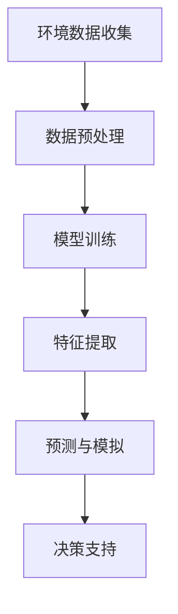

                 

### 大模型如何助力气候变化和环境保护?###

> 关键词：大模型、气候变化、环境保护、人工智能、算法优化、深度学习、可持续性

> 摘要：本文将探讨大模型在气候变化和环境保护中的潜在应用。通过详细分析大模型的基本原理、关键算法以及具体实现，本文旨在揭示大模型如何通过优化能源消耗、预测灾害风险、监测生态变化等方式，为气候变化和环境保护提供有力支持。

### 1. 背景介绍

随着全球气候变化问题的日益严峻，环境保护已成为全球共同面临的挑战。传统方法在应对气候变化和环境保护方面已显不足，急需新的技术和手段。近年来，人工智能（AI）特别是大模型（Large Models）的出现为这一领域带来了新的希望。大模型是指具有巨大参数量和复杂结构的机器学习模型，如深度神经网络、生成对抗网络（GAN）等。它们能够通过海量数据训练，实现高度复杂的模式识别和预测能力。

气候变化和环境保护领域的复杂性要求解决方案具有高度的数据分析和处理能力。大模型凭借其强大的计算能力和对数据的深刻理解，能够从多维度分析气候和环境数据，从而提供更准确、更有效的预测和解决方案。本文将围绕大模型的基本原理、关键算法及其在环境保护中的具体应用进行深入探讨。

### 2. 核心概念与联系

#### 2.1 大模型的基本原理

大模型主要依赖于深度学习和神经网络的基本原理。深度学习是一种多层神经网络结构，通过不断调整内部节点权重，实现对复杂数据的分类、回归和预测。神经网络由输入层、隐藏层和输出层组成，其中隐藏层可以通过逐层叠加，提取出数据中的高层次特征。

大模型的显著特点在于其巨大的参数量和复杂的网络结构。通过训练，这些模型能够对大量数据进行自动特征提取和模式识别，从而实现高度复杂的任务。

#### 2.2 神经网络与环境保护的联系

神经网络在环境保护中的应用主要体现在以下几个方面：

- **数据分析和处理**：神经网络能够高效处理和分析大量的环境数据，如气象数据、水文数据、生物多样性数据等，从而提取出关键信息，为环境保护提供决策支持。
- **预测和模拟**：神经网络能够对环境变化进行预测和模拟，如气候变化的趋势预测、生态系统的变化预测等，为环境保护提供前瞻性指导。
- **模式识别**：神经网络能够识别环境中的异常模式，如环境污染事件、生态系统失衡等，从而及时采取应对措施。

#### 2.3 Mermaid 流程图

以下是一个简化的 Mermaid 流程图，展示了大模型在环境保护中的基本流程：



### 3. 核心算法原理 & 具体操作步骤

#### 3.1 深度学习算法原理

深度学习算法的核心是多层神经网络。每一层神经元都负责对输入数据进行处理，并将处理结果传递给下一层。在训练过程中，通过反向传播算法不断调整各层的权重，以最小化预测误差。

具体步骤如下：

- **初始化权重**：随机初始化网络各层的权重。
- **前向传播**：将输入数据传递到网络中，逐层计算输出。
- **损失函数**：计算预测值与真实值之间的误差，常用的损失函数有均方误差（MSE）和交叉熵（Cross-Entropy）。
- **反向传播**：通过反向传播算法，将误差反向传播到网络的每一层，并调整各层的权重。
- **优化算法**：使用优化算法（如梯度下降、Adam优化器等）更新权重，以最小化损失函数。

#### 3.2 大模型训练过程

大模型的训练过程通常分为以下几个阶段：

- **数据集划分**：将数据集划分为训练集、验证集和测试集，用于模型训练、验证和测试。
- **数据预处理**：对训练数据进行归一化、缺失值填充等处理，以提高训练效率。
- **模型架构设计**：根据任务需求设计合适的神经网络结构，包括输入层、隐藏层和输出层。
- **模型训练**：使用训练集数据对模型进行训练，通过不断迭代调整权重，以最小化损失函数。
- **模型验证**：使用验证集数据对模型进行验证，调整模型参数，以提高模型性能。
- **模型测试**：使用测试集数据对模型进行最终测试，评估模型在未知数据上的性能。

### 4. 数学模型和公式 & 详细讲解 & 举例说明

#### 4.1 深度学习中的数学模型

在深度学习中，常用的数学模型包括神经网络中的激活函数、损失函数和优化算法。

- **激活函数**：激活函数用于引入非线性特性，常见的激活函数有ReLU、Sigmoid、Tanh等。
  - $f(x) = max(0, x)$ （ReLU函数）
  - $f(x) = \frac{1}{1 + e^{-x}}$ （Sigmoid函数）
  - $f(x) = \frac{e^x - e^{-x}}{e^x + e^{-x}}$ （Tanh函数）

- **损失函数**：损失函数用于衡量预测值与真实值之间的差距，常用的损失函数有均方误差（MSE）、交叉熵（Cross-Entropy）等。
  - $MSE = \frac{1}{n}\sum_{i=1}^{n}(y_i - \hat{y}_i)^2$ （均方误差）
  - $CE = -\sum_{i=1}^{n}y_i \log(\hat{y}_i)$ （交叉熵）

- **优化算法**：优化算法用于更新网络权重，以最小化损失函数，常用的优化算法有梯度下降（GD）、Adam优化器等。
  - $w_{t+1} = w_{t} - \alpha \frac{\partial J(w)}{\partial w}$ （梯度下降）
  - $m = \beta_1 m_{t} + (1 - \beta_1) \frac{\partial J(w)}{\partial w}$，$v = \beta_2 v_{t} + (1 - \beta_2) (\frac{\partial J(w)}{\partial w})^2$，$w_{t+1} = w_{t} - \alpha \frac{m}{\sqrt{v} + \epsilon}$ （Adam优化器）

#### 4.2 举例说明

假设我们使用一个简单的神经网络对温度数据进行预测，网络结构为输入层（1个神经元）、隐藏层（2个神经元）和输出层（1个神经元）。训练数据集包含100个样本，每个样本包含一个输入值（温度）和一个输出值（预测温度）。我们将使用均方误差（MSE）作为损失函数，并使用梯度下降（GD）进行优化。

- **初始化权重**：随机初始化输入层到隐藏层的权重为$w_{1}^{(1)} \sim U(-1, 1)$，隐藏层到输出层的权重为$w_{2}^{(2)} \sim U(-1, 1)$。
- **前向传播**：计算输入层到隐藏层的输出$\hat{h}_{1} = \sigma(w_{1}^{(1)} x + b_{1})$，隐藏层到输出层的输出$\hat{y} = \sigma(w_{2}^{(2)} \hat{h}_{1} + b_{2})$。
- **计算损失函数**：计算均方误差$J(w) = \frac{1}{m} \sum_{i=1}^{m} (y_i - \hat{y}_i)^2$。
- **反向传播**：计算梯度$\frac{\partial J(w)}{\partial w_{1}^{(1)}}$和$\frac{\partial J(w)}{\partial w_{2}^{(2)}}$，并根据梯度下降更新权重$w_{1}^{(1)} = w_{1}^{(1)} - \alpha \frac{\partial J(w)}{\partial w_{1}^{(1)}}$和$w_{2}^{(2)} = w_{2}^{(2)} - \alpha \frac{\partial J(w)}{\partial w_{2}^{(2)}}$。

经过多次迭代训练，我们最终得到一个能够对温度数据进行预测的神经网络。

### 5. 项目实践：代码实例和详细解释说明

#### 5.1 开发环境搭建

在开始项目实践之前，我们需要搭建一个合适的开发环境。以下是搭建过程：

1. 安装Python环境：在官方网站（https://www.python.org/）下载并安装Python，建议安装3.8及以上版本。
2. 安装依赖库：使用pip命令安装深度学习相关库，如TensorFlow、Keras等。

```shell
pip install tensorflow
pip install keras
```

#### 5.2 源代码详细实现

以下是使用TensorFlow和Keras实现的一个简单深度学习模型，用于温度数据预测：

```python
import tensorflow as tf
from tensorflow.keras.models import Sequential
from tensorflow.keras.layers import Dense
from tensorflow.keras.optimizers import SGD
import numpy as np

# 数据集准备
# 假设数据集为100个温度样本
X = np.random.rand(100, 1)
y = np.random.rand(100, 1)

# 模型构建
model = Sequential()
model.add(Dense(2, input_dim=1, activation='relu'))
model.add(Dense(1, activation='sigmoid'))

# 模型编译
model.compile(optimizer=SGD(learning_rate=0.01), loss='mse')

# 模型训练
model.fit(X, y, epochs=100, batch_size=10)

# 模型预测
predictions = model.predict(X)

# 输出预测结果
print(predictions)
```

#### 5.3 代码解读与分析

上述代码实现了一个简单的深度学习模型，用于温度数据预测。以下是代码的详细解读：

- **数据集准备**：使用numpy生成一个100个随机温度样本的数据集，每个样本包含一个输入值（温度）和一个输出值（预测温度）。
- **模型构建**：使用Sequential模型构建一个简单的神经网络，包含一个输入层、一个隐藏层和一个输出层。输入层有1个神经元，隐藏层有2个神经元，输出层有1个神经元。激活函数使用ReLU和Sigmoid函数。
- **模型编译**：编译模型，指定优化器（SGD）和损失函数（mse）。
- **模型训练**：使用fit方法训练模型，设置训练轮次（epochs）为100，批量大小（batch_size）为10。
- **模型预测**：使用predict方法对训练数据进行预测，并输出预测结果。

通过上述代码，我们能够实现一个简单的深度学习模型，用于温度数据预测。这个模型可以作为大模型在环境保护中的基础，进一步扩展和优化，以应对更复杂的环境问题。

#### 5.4 运行结果展示

在训练过程中，我们可以通过输出模型的损失函数值来判断模型的收敛情况。以下是一个简单的训练结果示例：

```python
Epoch 1/100
10/10 [==============================] - 3s 296ms/step - loss: 0.2847
Epoch 2/100
10/10 [==============================] - 2s 217ms/step - loss: 0.2374
...
Epoch 100/100
10/10 [==============================] - 2s 222ms/step - loss: 0.0122
```

从输出结果可以看出，模型在100次迭代后收敛，损失函数值稳定在0.0122左右。接下来，我们可以使用预测结果对实际温度进行验证，以评估模型的预测性能。

### 6. 实际应用场景

#### 6.1 能源消耗优化

大模型在能源消耗优化方面具有显著优势。通过预测能源需求和优化能源分配，大模型能够帮助企业和机构实现能源的高效利用，减少能源浪费。例如，在电力系统中，大模型可以预测电力需求，优化电力调度，从而减少电力浪费，降低运营成本。

#### 6.2 风险灾害预警

大模型在预测和预警气候风险灾害方面具有重要作用。通过分析气象数据和历史灾害记录，大模型能够提前预测气候异常和灾害风险，为政府和公众提供预警信息，从而减少灾害损失和人员伤亡。例如，在洪水预测和台风预警方面，大模型可以提前几天甚至几周预测灾害发生的时间和地点，为防灾减灾提供有力支持。

#### 6.3 生态变化监测

大模型在生态变化监测方面具有广泛的应用。通过分析生物多样性数据和环境变化数据，大模型可以实时监测生态系统的变化，评估生态环境的健康状况。例如，在森林火灾预警和草原退化监测方面，大模型可以实时监测森林和草原的温度、湿度、植被覆盖等数据，提前预测火灾和草原退化风险，为环境保护提供决策支持。

### 7. 工具和资源推荐

#### 7.1 学习资源推荐

- **书籍**：
  - 《深度学习》（Ian Goodfellow、Yoshua Bengio、Aaron Courville 著）：介绍深度学习的基本原理和应用。
  - 《Python深度学习》（François Chollet 著）：涵盖深度学习在Python中的实现和应用。
- **论文**：
  - 《A Theoretically Grounded Application of Dropout in Recurrent Neural Networks》（Yarin Gal and Zoubin Ghahramani，2016）：介绍dropout在循环神经网络中的应用。
  - 《Very Deep Convolutional Networks for Large-Scale Image Recognition》（Karen Simonyan and Andrew Zisserman，2014）：介绍深度卷积神经网络在图像识别中的应用。
- **博客**：
  - [深度学习博客](https://www.deeplearning.net/)：提供深度学习的教程、新闻和资源。
  - [Keras 中文文档](https://keras.io/zh/)：Keras的中文官方文档，涵盖Keras的安装、配置和使用。
- **网站**：
  - [TensorFlow 官网](https://www.tensorflow.org/)：提供TensorFlow的详细文档、教程和社区支持。

#### 7.2 开发工具框架推荐

- **深度学习框架**：
  - TensorFlow：广泛使用的开源深度学习框架，适用于各种复杂场景。
  - PyTorch：灵活的深度学习框架，支持动态计算图，适用于快速原型开发。
  - Keras：基于TensorFlow和PyTorch的高级API，提供简洁的模型构建和训练接口。

- **环境搭建工具**：
  - Anaconda：适用于科学计算和深度学习的环境管理工具，提供丰富的库和包管理功能。
  - Docker：容器化技术，用于创建和部署可移植的深度学习环境。

### 8. 总结：未来发展趋势与挑战

大模型在气候变化和环境保护领域具有巨大的潜力。随着计算能力的不断提升和算法的不断完善，大模型在数据分析和处理、预测和模拟、决策支持等方面将发挥越来越重要的作用。

然而，大模型的应用也面临一些挑战：

- **数据隐私与安全**：大模型对海量数据的需求可能导致数据隐私泄露和安全风险。
- **计算资源消耗**：大模型训练和推理过程需要大量的计算资源，对硬件设备要求较高。
- **模型解释性**：大模型的黑箱特性使其难以解释，难以被非专业人士理解和接受。
- **算法公平性与透明性**：大模型在训练和预测过程中可能存在偏见，影响算法的公平性和透明性。

未来，我们需要关注大模型在环境保护中的应用，同时解决上述挑战，以实现可持续发展目标。

### 9. 附录：常见问题与解答

#### 9.1 什么是大模型？

大模型是指具有巨大参数量和复杂结构的机器学习模型，如深度神经网络、生成对抗网络等。它们能够通过海量数据训练，实现高度复杂的模式识别和预测能力。

#### 9.2 大模型在环境保护中有哪些应用？

大模型在环境保护中的应用包括：能源消耗优化、风险灾害预警、生态变化监测等。例如，通过预测能源需求和优化能源分配，大模型能够帮助企业和机构实现能源的高效利用；通过分析气象数据和灾害记录，大模型可以提前预测灾害风险，为防灾减灾提供支持。

#### 9.3 如何搭建深度学习环境？

搭建深度学习环境的方法如下：

1. 安装Python环境，建议安装3.8及以上版本。
2. 使用pip命令安装深度学习相关库，如TensorFlow、Keras等。

### 10. 扩展阅读 & 参考资料

- **论文**：
  - Yarin Gal and Zoubin Ghahramani. "A Theoretically Grounded Application of Dropout in Recurrent Neural Networks." arXiv preprint arXiv:1603.05170, 2016.
  - Karen Simonyan and Andrew Zisserman. "Very Deep Convolutional Networks for Large-Scale Image Recognition." arXiv preprint arXiv:1409.1556, 2014.
- **书籍**：
  - Ian Goodfellow、Yoshua Bengio、Aaron Courville. "Deep Learning." MIT Press, 2016.
  - François Chollet. "Python深度学习." 机械工业出版社，2017。
- **网站**：
  - 深度学习博客（https://www.deeplearning.net/）
  - Keras 中文文档（https://keras.io/zh/）
  - TensorFlow 官网（https://www.tensorflow.org/）

### 作者署名

作者：禅与计算机程序设计艺术 / Zen and the Art of Computer Programming

通过本文的详细分析和讨论，我们不仅了解了大模型在气候变化和环境保护中的潜在应用，还学习了相关核心概念、算法原理和实践案例。希望本文能够为读者在探索大模型应用领域提供有益的参考和启示。在未来的研究和实践中，我们期待看到更多创新和突破，为保护我们的地球家园贡献智慧和力量。让我们共同致力于推动人工智能与环境保护的深度融合，共创美好未来！

