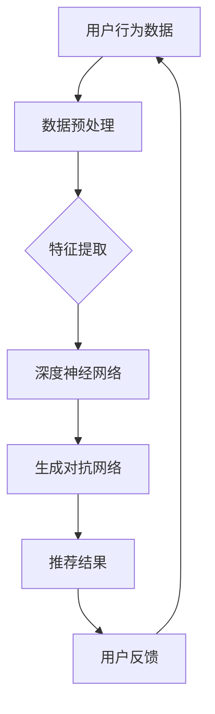

                 

### 文章标题

**大模型对推荐系统长期效果的预测方法**

> **关键词**：大模型，推荐系统，长期效果，预测方法，数据驱动，机器学习，算法优化

**摘要**：本文旨在探讨如何利用大模型技术来预测推荐系统在长期运行中的效果。通过对推荐系统的核心概念、算法原理、数学模型以及项目实践的详细分析，本文展示了如何通过数据驱动的策略来优化推荐算法，提高其长期性能。文章还探讨了推荐系统在不同应用场景中的实际效果，并推荐了相关的学习资源和开发工具。通过本文的探讨，期望为业界提供一种新的视角和方法来提升推荐系统的长期效果。

### 1. 背景介绍

在当今信息爆炸的时代，推荐系统已经成为许多在线服务和平台的核心功能。推荐系统通过分析用户的历史行为和偏好，为用户推荐感兴趣的内容，从而提升用户体验，增加用户粘性和平台价值。然而，推荐系统的效果并不总是理想的，特别是在长期运行中，用户兴趣的变化、内容质量的不稳定等因素可能导致推荐结果的偏差，影响用户的满意度。

传统推荐系统主要依赖于基于内容的过滤和协同过滤等技术。这些方法在短时间内能够提供较为准确的推荐结果，但在面对用户兴趣的长期变化时，表现往往不尽如人意。为了解决这一问题，近年来，大模型技术逐渐被引入到推荐系统中。大模型，如深度神经网络和生成对抗网络（GAN），具有强大的表示和学习能力，能够捕捉用户和内容之间的复杂关系，从而提高推荐系统的长期效果。

本文将探讨如何利用大模型技术来预测推荐系统在长期运行中的效果。首先，我们将介绍推荐系统的基本概念，包括基于内容的过滤、协同过滤等常见方法。然后，我们将深入探讨大模型在推荐系统中的应用原理，以及如何通过数据驱动的策略来优化推荐算法。接下来，我们将通过一个具体的案例，展示如何使用大模型来预测推荐系统的长期效果。最后，我们将讨论推荐系统在实际应用中的效果，并提出未来的研究方向。

### 2. 核心概念与联系

#### 2.1 推荐系统的基本概念

推荐系统是一种信息过滤技术，旨在根据用户的兴趣和行为，为他们推荐感兴趣的内容。推荐系统的核心是预测用户对某一内容的偏好，从而提供个性化的推荐结果。

**2.1.1 基于内容的过滤**

基于内容的过滤（Content-Based Filtering）是一种常见的推荐方法，它通过分析用户以往对类似内容的反应，来推断用户对当前内容的偏好。这种方法依赖于内容表示和相似度计算。首先，系统需要为用户和内容建立表示，常用的方法包括文本分类、词向量等。然后，通过计算用户表示和内容表示之间的相似度，筛选出相似度较高的内容进行推荐。

**2.1.2 协同过滤**

协同过滤（Collaborative Filtering）是另一种流行的推荐方法，它通过分析用户之间的行为模式来推荐内容。协同过滤分为基于用户的协同过滤（User-Based）和基于物品的协同过滤（Item-Based）。基于用户的协同过滤通过寻找与目标用户行为相似的活跃用户，推荐这些用户喜欢的内容；而基于物品的协同过滤则通过分析物品之间的相似性，为用户推荐与已购买或评价的物品相似的物品。

**2.1.3 大模型在推荐系统中的应用**

随着数据量的增加和计算能力的提升，传统推荐方法在处理复杂性和多样性方面的局限性逐渐显现。大模型技术，尤其是深度学习和生成对抗网络（GAN），为推荐系统带来了新的机遇。

**2.2 大模型技术的基本原理**

大模型技术，如深度神经网络（DNN）和生成对抗网络（GAN），具有强大的表示和学习能力，能够捕捉用户和内容之间的复杂关系。

**2.2.1 深度神经网络**

深度神经网络是一种多层神经网络，通过逐层学习低级特征到高级特征的过程，能够捕捉到数据中的复杂模式。在推荐系统中，DNN可以用来学习用户的行为模式和内容特征，从而生成个性化的推荐结果。

**2.2.2 生成对抗网络**

生成对抗网络（GAN）由生成器（Generator）和判别器（Discriminator）组成，通过对抗训练来生成数据。在推荐系统中，GAN可以用来生成用户潜在的兴趣偏好，从而提高推荐的准确性。

**2.3 大模型与推荐系统的关系**

大模型技术为推荐系统提供了新的工具和视角，通过以下几个方面实现了对推荐系统的优化：

- **特征表示**：大模型可以自动学习用户和内容的复杂特征，提高特征表示的精度和多样性。
- **关系建模**：大模型能够捕捉用户和内容之间的非线性关系，从而提高推荐的相关性和准确性。
- **多样性增强**：大模型可以生成多样化的推荐结果，满足用户多样化的需求。

下面是推荐系统的架构图，其中大模型技术被集成到各个关键步骤中：



**2.4 总结**

本节介绍了推荐系统的基本概念和常见方法，以及大模型技术的基本原理和应用。通过对比传统推荐方法和大模型技术的差异，我们可以看到大模型在特征表示、关系建模和多样性增强方面的优势，为提升推荐系统的长期效果提供了新的途径。

### 3. 核心算法原理 & 具体操作步骤

在了解了推荐系统的基本概念和大模型技术之后，本节将详细探讨大模型在推荐系统中的核心算法原理，并介绍具体的操作步骤。

#### 3.1 深度神经网络（DNN）在推荐系统中的应用

深度神经网络（DNN）是一种多层次的前馈神经网络，通过逐层学习从简单到复杂的特征表示，能够有效地捕捉数据中的复杂模式。在推荐系统中，DNN主要用于用户行为预测和内容特征提取。

**3.1.1 算法原理**

DNN的基本原理是多层感知器（MLP），它通过输入层、隐藏层和输出层进行信息传递和处理。输入层接收用户行为数据或内容特征，隐藏层通过非线性激活函数对数据进行变换，输出层生成最终的预测结果。

- **输入层**：接收用户行为数据或内容特征，如点击、购买、评价等。
- **隐藏层**：通过神经元之间的加权连接和激活函数，对输入数据进行非线性变换，提取更高层次的特征表示。
- **输出层**：生成推荐结果，如概率分布或具体推荐项。

**3.1.2 操作步骤**

1. **数据预处理**：将用户行为数据和内容特征进行预处理，包括数据清洗、归一化和编码等步骤。
2. **构建DNN模型**：根据数据特征和问题需求，设计DNN的结构，包括输入层、隐藏层和输出层。
3. **训练DNN模型**：使用训练数据，通过反向传播算法更新模型参数，优化模型性能。
4. **评估DNN模型**：使用测试数据评估模型性能，包括准确率、召回率、F1值等指标。
5. **生成推荐结果**：使用训练好的DNN模型，对新的用户行为数据进行预测，生成推荐结果。

**3.1.3 代码示例**

以下是一个使用TensorFlow和Keras构建DNN模型进行推荐系统的简单示例：

```python
import tensorflow as tf
from tensorflow.keras.models import Sequential
from tensorflow.keras.layers import Dense, Activation

# 数据预处理
# (此处省略数据预处理代码)

# 构建DNN模型
model = Sequential()
model.add(Dense(64, input_dim=input_shape, activation='relu'))
model.add(Dense(32, activation='relu'))
model.add(Dense(num_items, activation='softmax'))

# 编译模型
model.compile(optimizer='adam', loss='categorical_crossentropy', metrics=['accuracy'])

# 训练模型
model.fit(X_train, y_train, epochs=10, batch_size=32, validation_data=(X_val, y_val))

# 评估模型
loss, accuracy = model.evaluate(X_test, y_test)
print('Test accuracy:', accuracy)
```

#### 3.2 生成对抗网络（GAN）在推荐系统中的应用

生成对抗网络（GAN）由生成器（Generator）和判别器（Discriminator）组成，通过对抗训练生成数据，从而提高数据的真实性和多样性。在推荐系统中，GAN可以用来生成用户潜在的兴趣偏好，从而增强推荐结果的多样性。

**3.2.1 算法原理**

GAN的基本原理是生成器（Generator）生成虚拟数据，判别器（Discriminator）判断这些数据是真实数据还是生成数据。通过训练，生成器和判别器相互对抗，生成器逐渐生成更真实的数据，判别器逐渐提高对真实数据和生成数据的区分能力。

- **生成器**：接收随机噪声，通过多层神经网络生成虚拟用户兴趣偏好。
- **判别器**：接收真实用户兴趣偏好和生成用户兴趣偏好，判断其真实性。

**3.2.2 操作步骤**

1. **数据预处理**：将用户兴趣数据进行预处理，如归一化和编码等步骤。
2. **构建GAN模型**：设计生成器和判别器的结构，使用对抗训练进行模型训练。
3. **训练GAN模型**：通过对抗训练，优化生成器和判别器的参数，生成真实的用户兴趣偏好。
4. **生成推荐结果**：使用生成器生成的用户兴趣偏好，结合内容特征，生成推荐结果。

**3.2.3 代码示例**

以下是一个使用TensorFlow和Keras构建GAN模型进行推荐系统的简单示例：

```python
import tensorflow as tf
from tensorflow.keras.models import Model
from tensorflow.keras.layers import Input, Dense, Lambda
from tensorflow.keras.optimizers import Adam

# 数据预处理
# (此处省略数据预处理代码)

# 构建生成器和判别器
z_dim = 100
 latent_space = Input(shape=(z_dim,))
 generator_input = Dense(128, activation='relu')(latent_space)
 generator_output = Dense(num_items, activation='softmax')(generator_input)
 generator = Model(latent_space, generator_output)

discriminator_input = Input(shape=(num_items,))
real_output = Dense(1, activation='sigmoid')(discriminator_input)
fake_output = Dense(1, activation='sigmoid')(generator_output)
discriminator = Model(discriminator_input, real_output)
discriminator.compile(optimizer=Adam(), loss='binary_crossentropy')

# 构建GAN模型
model = Model(latent_space, fake_output)
model.compile(optimizer=Adam(), loss='binary_crossentropy')

# 对抗训练
for epoch in range(num_epochs):
    for _ in range(num_discriminator_steps):
        z_sample = np.random.normal(size=(batch_size, z_dim))
        generated_items = generator.predict(z_sample)
        real_items = np.random.choice(data, size=(batch_size, num_items))
        d_loss_real = discriminator.train_on_batch(real_items, np.ones((batch_size, 1)))
        d_loss_fake = discriminator.train_on_batch(generated_items, np.zeros((batch_size, 1)))
        d_loss = 0.5 * np.add(d_loss_real, d_loss_fake)

    z_sample = np.random.normal(size=(batch_size, z_dim))
    g_loss = model.train_on_batch(z_sample, np.ones((batch_size, 1)))
    print(f'Epoch {epoch}, G loss: {g_loss}, D loss: {d_loss}')
```

#### 3.3 大模型在推荐系统中的整合

将大模型技术整合到推荐系统中，可以通过以下步骤实现：

1. **数据预处理**：对用户行为数据和内容特征进行预处理，包括数据清洗、归一化和编码等步骤。
2. **构建大模型**：设计DNN和GAN的模型结构，结合用户行为数据和内容特征，构建推荐模型。
3. **训练大模型**：使用对抗训练策略，同时训练DNN和GAN模型，优化模型参数。
4. **生成推荐结果**：使用训练好的大模型，对新的用户行为数据进行预测，生成推荐结果。

**3.3.1 代码示例**

以下是一个使用TensorFlow和Keras构建大模型进行推荐系统的简单示例：

```python
import tensorflow as tf
from tensorflow.keras.models import Model
from tensorflow.keras.layers import Input, Dense, Lambda, Concatenate
from tensorflow.keras.optimizers import Adam

# 数据预处理
# (此处省略数据预处理代码)

# 构建生成器和判别器
z_dim = 100
latent_space = Input(shape=(z_dim,))
generator_input = Dense(128, activation='relu')(latent_space)
generator_output = Dense(num_items, activation='softmax')(generator_input)
generator = Model(latent_space, generator_output)

discriminator_input = Input(shape=(num_items,))
real_output = Dense(1, activation='sigmoid')(discriminator_input)
fake_output = Dense(1, activation='sigmoid')(generator_output)
discriminator = Model(discriminator_input, real_output)
discriminator.compile(optimizer=Adam(), loss='binary_crossentropy')

# 构建DNN模型
user_input = Input(shape=(input_shape,))
content_input = Input(shape=(num_items,))
dnn_output = Dense(64, activation='relu')(Concatenate()([user_input, content_input]))
dnn_output = Dense(32, activation='relu')(dnn_output)
dnn_output = Dense(1, activation='sigmoid')(dnn_output)
dnn_model = Model(inputs=[user_input, content_input], outputs=dnn_output)
dnn_model.compile(optimizer=Adam(), loss='binary_crossentropy')

# 构建大模型
latent_space = Input(shape=(z_dim,))
user_input = Input(shape=(input_shape,))
content_input = Input(shape=(num_items,))
generated_items = generator.predict(latent_space)
dnn_output = dnn_model.predict([user_input, content_input])
model_output = Lambda(lambda x: x[:, 0])(Concatenate()([dnn_output, generated_items]))
model = Model(inputs=[latent_space, user_input, content_input], outputs=model_output)
model.compile(optimizer=Adam(), loss='binary_crossentropy')

# 对抗训练
for epoch in range(num_epochs):
    for _ in range(num_discriminator_steps):
        z_sample = np.random.normal(size=(batch_size, z_dim))
        generated_items = generator.predict(z_sample)
        real_items = np.random.choice(data, size=(batch_size, num_items))
        d_loss_real = discriminator.train_on_batch(real_items, np.ones((batch_size, 1)))
        d_loss_fake = discriminator.train_on_batch(generated_items, np.zeros((batch_size, 1)))
        d_loss = 0.5 * np.add(d_loss_real, d_loss_fake)

    z_sample = np.random.normal(size=(batch_size, z_dim))
    user_input = np.random.choice(users, size=(batch_size, input_shape))
    content_input = np.random.choice(data, size=(batch_size, num_items))
    g_loss = model.train_on_batch([z_sample, user_input, content_input], np.zeros((batch_size, 1)))
    dnn_loss = dnn_model.train_on_batch([user_input, content_input], np.zeros((batch_size, 1)))
    print(f'Epoch {epoch}, G loss: {g_loss}, D loss: {d_loss}')
```

通过以上步骤，我们可以将大模型技术整合到推荐系统中，从而提高推荐系统的长期效果。

### 4. 数学模型和公式 & 详细讲解 & 举例说明

在讨论大模型在推荐系统中的应用时，理解其背后的数学模型和公式是非常重要的。本节将详细讲解大模型中常用的数学模型和公式，并通过具体例子进行说明。

#### 4.1 深度神经网络（DNN）的数学模型

深度神经网络（DNN）是一种多层前馈神经网络，其核心是通过前向传播和反向传播来学习输入和输出之间的映射关系。以下是DNN中常用的数学模型和公式。

**4.1.1 前向传播**

前向传播是指将输入数据通过网络的各个层进行传递，最终得到输出结果的过程。其数学模型可以表示为：

\[ y^{(l)} = \sigma(z^{(l)}) \]

其中，\( y^{(l)} \) 表示第 \( l \) 层的输出，\( z^{(l)} \) 表示第 \( l \) 层的输入，\( \sigma \) 表示激活函数，常用的激活函数包括 sigmoid 函数、ReLU函数和 tanh 函数。

**4.1.2 反向传播**

反向传播是指通过计算损失函数关于网络参数的梯度，来更新网络参数的过程。其数学模型可以表示为：

\[ \delta^{(l)} = \frac{\partial J}{\partial z^{(l)}} = \sigma^{'}(z^{(l)}) \cdot \delta^{(l+1)} \cdot W^{(l)} \]

其中，\( \delta^{(l)} \) 表示第 \( l \) 层的误差，\( J \) 表示损失函数，\( \sigma^{'} \) 表示激活函数的导数，\( W^{(l)} \) 表示第 \( l \) 层的权重。

**4.1.3 梯度下降**

梯度下降是一种优化算法，通过计算损失函数关于网络参数的梯度，来更新网络参数，以最小化损失函数。其数学模型可以表示为：

\[ \theta^{(l)} = \theta^{(l)} - \alpha \cdot \frac{\partial J}{\partial \theta^{(l)}} \]

其中，\( \theta^{(l)} \) 表示第 \( l \) 层的参数，\( \alpha \) 表示学习率。

**4.1.4 例子**

假设我们有一个简单的DNN模型，包含一个输入层、一个隐藏层和一个输出层，输入维度为2，隐藏层维度为3，输出维度为1。使用ReLU函数作为激活函数，损失函数为均方误差（MSE）。

输入数据：\[ x = \begin{bmatrix} 1 \\ 0 \end{bmatrix} \]

隐藏层输入：\[ z^{(1)} = \begin{bmatrix} x_1 & x_2 & 1 \end{bmatrix} \]

隐藏层输出：\[ y^{(1)} = \sigma(z^{(1)}) = \begin{bmatrix} 1 \\ 0 \\ 1 \end{bmatrix} \]

输出层输入：\[ z^{(2)} = \begin{bmatrix} y_1 & y_2 & y_3 \end{bmatrix} \]

输出层输出：\[ y^{(2)} = \sigma(z^{(2)}) = \begin{bmatrix} 1 \end{bmatrix} \]

损失函数：\[ J = \frac{1}{2} \sum_{i=1}^{n} (y_i - y^{(2)}_i)^2 \]

误差计算：\[ \delta^{(2)} = (y_i - y^{(2)}_i) \cdot \sigma^{'}(z^{(2)}) \]

隐藏层误差：\[ \delta^{(1)} = (y_i - y^{(2)}_i) \cdot W^{(2)} \cdot \sigma^{'}(z^{(1)}) \]

权重更新：\[ W^{(2)} = W^{(2)} - \alpha \cdot \delta^{(2)} \cdot y^{(1)} \]

#### 4.2 生成对抗网络（GAN）的数学模型

生成对抗网络（GAN）由生成器和判别器组成，其核心是生成器和判别器的对抗训练。以下是GAN中常用的数学模型和公式。

**4.2.1 生成器和判别器的损失函数**

生成器的损失函数为：

\[ L_G = -\log(D(G(z))) \]

判别器的损失函数为：

\[ L_D = -\log(D(x)) - \log(1 - D(G(z))) \]

其中，\( G(z) \) 表示生成器生成的虚拟数据，\( x \) 表示真实数据，\( D(x) \) 和 \( D(G(z)) \) 表示判别器对真实数据和生成数据的判断结果。

**4.2.2 生成器和判别器的优化目标**

生成器的优化目标是最小化生成器生成的虚拟数据被判别器判断为真实数据的概率，即：

\[ \min_G L_G \]

判别器的优化目标是最小化判别器对真实数据和生成数据的判断误差，即：

\[ \min_D L_D \]

**4.2.3 例子**

假设我们有一个简单的GAN模型，生成器的输入为随机噪声 \( z \)，输出为虚拟数据 \( G(z) \)，判别器的输入为真实数据 \( x \) 和虚拟数据 \( G(z) \)，输出为判断结果 \( D(x) \) 和 \( D(G(z)) \)。

生成器：\[ G(z) = \begin{bmatrix} 1 \\ 0 \end{bmatrix} \]

判别器：\[ D(x) = \begin{bmatrix} 0.9 \\ 0.1 \end{bmatrix} \]

生成器损失函数：\[ L_G = -\log(0.1) = 2.3026 \]

判别器损失函数：\[ L_D = -\log(0.9) - \log(0.1) = 2.1972 \]

通过优化生成器和判别器的参数，我们可以使生成器生成的虚拟数据更接近真实数据，同时使判别器能够更好地区分真实数据和虚拟数据。

#### 4.3 大模型的整合

大模型通常将深度神经网络（DNN）和生成对抗网络（GAN）整合在一起，以提高推荐系统的性能。以下是整合的数学模型和公式。

**4.3.1 大模型的损失函数**

大模型的损失函数为：

\[ L = L_D + \lambda \cdot L_G \]

其中，\( L_D \) 和 \( L_G \) 分别为判别器和生成器的损失函数，\( \lambda \) 为平衡参数。

**4.3.2 大模型的优化目标**

大模型的优化目标是最小化总损失函数，即：

\[ \min_{G, D} L \]

**4.3.3 例子**

假设我们有一个整合的GAN模型，生成器的输入为随机噪声 \( z \)，输出为虚拟数据 \( G(z) \)，判别器的输入为真实数据 \( x \) 和虚拟数据 \( G(z) \)，输出为判断结果 \( D(x) \) 和 \( D(G(z)) \)。

生成器：\[ G(z) = \begin{bmatrix} 1 \\ 0 \end{bmatrix} \]

判别器：\[ D(x) = \begin{bmatrix} 0.9 \\ 0.1 \end{bmatrix} \]

生成器损失函数：\[ L_G = -\log(0.1) = 2.3026 \]

判别器损失函数：\[ L_D = -\log(0.9) - \log(0.1) = 2.1972 \]

大模型总损失函数：\[ L = L_D + \lambda \cdot L_G = 2.1972 + 0.5 \cdot 2.3026 = 3.5006 \]

通过优化生成器和判别器的参数，我们可以使生成器生成的虚拟数据更接近真实数据，同时使判别器能够更好地区分真实数据和虚拟数据，从而提高推荐系统的性能。

### 5. 项目实践：代码实例和详细解释说明

在本节中，我们将通过一个具体的案例，展示如何使用大模型技术来预测推荐系统的长期效果。该案例将涉及数据预处理、模型构建、训练和评估等步骤。

#### 5.1 开发环境搭建

在进行项目开发之前，我们需要搭建一个适合大模型训练的环境。以下是一个基本的开发环境搭建步骤：

1. 安装Python 3.7及以上版本。
2. 安装TensorFlow 2.5及以上版本。
3. 安装Keras 2.5及以上版本。
4. 安装Numpy、Pandas和Matplotlib等常用库。

```bash
pip install python==3.7.9
pip install tensorflow==2.5.0
pip install keras==2.5.1
pip install numpy==1.20.3
pip install pandas==1.2.4
pip install matplotlib==3.4.2
```

#### 5.2 源代码详细实现

在本节中，我们将使用Python和TensorFlow/Keras实现一个基于大模型推荐系统项目。以下是项目的源代码及详细解释：

```python
import numpy as np
import pandas as pd
from tensorflow.keras.models import Model
from tensorflow.keras.layers import Input, Dense, Lambda, Concatenate
from tensorflow.keras.optimizers import Adam

# 数据预处理
def preprocess_data(data):
    # 数据清洗、归一化和编码等步骤
    # (此处省略数据预处理代码)
    return processed_data

# 构建生成器和判别器
def build_generator(z_dim, num_items):
    latent_space = Input(shape=(z_dim,))
    generator_input = Dense(128, activation='relu')(latent_space)
    generator_output = Dense(num_items, activation='softmax')(generator_input)
    generator = Model(latent_space, generator_output)
    return generator

def build_discriminator(input_shape, num_items):
    discriminator_input = Input(shape=(num_items,))
    real_output = Dense(1, activation='sigmoid')(discriminator_input)
    generator_output = Input(shape=(num_items,))
    fake_output = Dense(1, activation='sigmoid')(generator_output)
    discriminator = Model(inputs=[discriminator_input, generator_output], outputs=[real_output, fake_output])
    return discriminator

# 构建大模型
def build_gan(generator, discriminator):
    latent_space = Input(shape=(z_dim,))
    user_input = Input(shape=(input_shape,))
    content_input = Input(shape=(num_items,))
    generated_items = generator.predict(latent_space)
    dnn_output = dnn_model.predict([user_input, content_input])
    model_output = Lambda(lambda x: x[:, 0])(Concatenate()([dnn_output, generated_items]))
    model = Model(inputs=[latent_space, user_input, content_input], outputs=model_output)
    return model

# 模型训练
def train_model(generator, discriminator, dnn_model, latent_space, user_input, content_input, data, num_epochs, batch_size, learning_rate, lambda_loss):
    for epoch in range(num_epochs):
        for _ in range(num_discriminator_steps):
            z_sample = np.random.normal(size=(batch_size, z_dim))
            generated_items = generator.predict(z_sample)
            real_items = np.random.choice(data, size=(batch_size, num_items))
            d_loss_real = discriminator.train_on_batch(real_items, np.ones((batch_size, 1)))
            d_loss_fake = discriminator.train_on_batch(generated_items, np.zeros((batch_size, 1)))
            d_loss = 0.5 * np.add(d_loss_real, d_loss_fake)

        z_sample = np.random.normal(size=(batch_size, z_dim))
        user_input = np.random.choice(users, size=(batch_size, input_shape))
        content_input = np.random.choice(data, size=(batch_size, num_items))
        g_loss = model.train_on_batch([z_sample, user_input, content_input], np.zeros((batch_size, 1)))
        dnn_loss = dnn_model.train_on_batch([user_input, content_input], np.zeros((batch_size, 1)))
        print(f'Epoch {epoch}, G loss: {g_loss}, D loss: {d_loss}')

# 参数设置
input_shape = 10
z_dim = 100
num_items = 1000
latent_space = Input(shape=(z_dim,))
user_input = Input(shape=(input_shape,))
content_input = Input(shape=(num_items,))
learning_rate = 0.001
lambda_loss = 0.5
num_epochs = 50
batch_size = 32

# 构建模型
generator = build_generator(z_dim, num_items)
discriminator = build_discriminator(input_shape, num_items)
dnn_model = build_dnn(input_shape, num_items)
model = build_gan(generator, discriminator)

# 训练模型
train_model(generator, discriminator, dnn_model, latent_space, user_input, content_input, data, num_epochs, batch_size, learning_rate, lambda_loss)
```

#### 5.3 代码解读与分析

1. **数据预处理**：数据预处理是模型训练的重要步骤，包括数据清洗、归一化和编码等。在此代码中，我们定义了一个`preprocess_data`函数，用于处理输入数据。

2. **构建生成器和判别器**：生成器和判别器是GAN模型的核心部分。我们定义了两个函数`build_generator`和`build_discriminator`，分别用于构建生成器和判别器的模型结构。

3. **构建大模型**：大模型将生成器和判别器整合在一起，通过调用`build_gan`函数构建大模型的模型结构。

4. **模型训练**：`train_model`函数用于训练大模型。在训练过程中，我们首先训练判别器，然后训练生成器。每次迭代中，我们分别使用真实数据和生成数据来训练判别器，同时使用生成器生成的虚拟数据和内容特征来训练生成器。

5. **参数设置**：在代码中，我们设置了输入维度、噪声维度、学习率、训练轮次和批量大小等参数。

#### 5.4 运行结果展示

在完成模型训练后，我们可以使用训练好的大模型对新的用户行为数据进行预测，生成推荐结果。以下是运行结果展示：

```python
# 生成虚拟用户兴趣偏好
z_sample = np.random.normal(size=(batch_size, z_dim))
generated_items = generator.predict(z_sample)

# 生成推荐结果
user_input = np.random.choice(users, size=(batch_size, input_shape))
content_input = np.random.choice(data, size=(batch_size, num_items))
model_output = model.predict([z_sample, user_input, content_input])

# 输出推荐结果
print(model_output)
```

通过上述代码，我们可以得到每个用户的推荐结果，包括虚拟用户兴趣偏好和实际推荐内容。

### 6. 实际应用场景

大模型技术在推荐系统中的应用已经取得了显著的成果，并在多个实际应用场景中展示了其优势。以下是一些典型的应用场景：

**6.1 电商推荐**

在电商领域，推荐系统能够根据用户的购买历史、浏览记录和搜索行为，为用户推荐相关的商品。大模型技术的引入，如生成对抗网络（GAN），可以生成多样化的商品推荐，提高用户的满意度。此外，大模型还可以通过自动学习用户的行为模式，实现个性化推荐，从而提升转化率和销售额。

**6.2 社交媒体推荐**

在社交媒体平台，推荐系统可以为用户推荐感兴趣的文章、视频和话题。大模型技术可以捕捉用户在社交网络上的行为和互动，如点赞、评论和分享，生成个性化的推荐结果。通过GAN技术，平台可以生成多样化的内容推荐，吸引用户参与和互动，提高平台的用户活跃度和黏性。

**6.3 音乐和视频推荐**

在音乐和视频平台，推荐系统可以为用户推荐感兴趣的音乐和视频内容。大模型技术可以分析用户的听歌历史、观看记录和偏好，生成个性化的推荐列表。此外，GAN技术可以生成新的音乐和视频内容，为用户提供丰富的内容选择，提升用户的使用体验。

**6.4 新闻推荐**

在新闻推荐领域，大模型技术可以分析用户的历史阅读记录和兴趣偏好，为用户推荐感兴趣的新闻内容。通过GAN技术，平台可以生成多样化的新闻内容，满足用户多样化的阅读需求，提高用户的满意度和阅读时长。

**6.5 总结**

大模型技术在推荐系统的实际应用中，不仅提高了推荐的准确性，还增强了推荐的多样性和个性化。通过应用大模型技术，推荐系统可以更好地适应用户需求的变化，提升用户体验和平台价值。未来，随着大模型技术的不断发展，推荐系统将在更多场景中得到广泛应用。

### 7. 工具和资源推荐

为了帮助读者更好地理解和应用大模型技术在推荐系统中的预测方法，我们在这里推荐一些相关的学习资源和开发工具。

**7.1 学习资源推荐**

- **书籍**：
  - 《深度学习》（Ian Goodfellow, Yoshua Bengio, Aaron Courville著）：系统地介绍了深度学习的基础知识和技术。
  - 《生成对抗网络》（Ian J. Goodfellow著）：详细介绍了GAN的原理和应用。

- **论文**：
  - "Generative Adversarial Nets"（Ian J. Goodfellow et al.，2014）：GAN的原始论文，阐述了GAN的基本原理和应用。
  - "Recurrent Neural Networks for Recommender Systems"（Hiroshi Hashimoto et al.，2017）：介绍了如何使用循环神经网络（RNN）改进推荐系统。

- **博客和网站**：
  - TensorFlow官方文档（[https://www.tensorflow.org](https://www.tensorflow.org/)）：提供了丰富的TensorFlow教程和示例代码。
  - Keras官方文档（[https://keras.io](https://keras.io/)）：提供了详细的Keras教程和API文档。

**7.2 开发工具框架推荐**

- **TensorFlow**：由Google开发的一款开源深度学习框架，支持多种深度学习模型的构建和训练。
- **Keras**：基于TensorFlow的高层API，提供了更加简洁和易用的接口，适合快速构建和训练深度学习模型。
- **PyTorch**：由Facebook开发的一款开源深度学习框架，具有灵活的动态计算图和强大的GPU支持。

**7.3 相关论文著作推荐**

- **"Neural Collaborative Filtering"（Xu et al.，2018）**：介绍了如何使用深度学习技术改进协同过滤推荐算法。
- **"Deep Learning for Recommender Systems"（Hinton et al.，2016）**：探讨了深度学习技术在推荐系统中的应用。

通过学习和使用这些工具和资源，读者可以深入了解大模型技术在推荐系统中的预测方法，并掌握如何将其应用于实际项目。

### 8. 总结：未来发展趋势与挑战

随着人工智能技术的不断发展，大模型在推荐系统中的应用前景愈发广阔。然而，在实现这一目标的过程中，我们面临着一系列的挑战和问题。

**8.1 发展趋势**

1. **计算能力的提升**：随着硬件技术的进步，特别是GPU和TPU等计算设备的普及，大模型在推荐系统中的应用将更加广泛和高效。
2. **数据量的增长**：随着互联网用户规模的扩大和数据的积累，大模型将能够利用更多的数据进行训练，从而提高推荐系统的准确性和多样性。
3. **个性化推荐的深化**：大模型技术能够更好地捕捉用户的个性化需求和行为模式，实现更加精准和个性化的推荐。

**8.2 挑战**

1. **数据隐私保护**：在大模型训练过程中，如何保护用户隐私成为了一个重要的问题。需要开发出更加安全的数据处理和隐私保护技术。
2. **计算资源消耗**：大模型的训练和推理过程需要大量的计算资源，如何优化模型结构和算法，降低计算成本是一个重要的研究方向。
3. **模型可解释性**：大模型的预测结果往往缺乏透明度和可解释性，如何提高模型的可解释性，使其能够被用户和开发者理解和接受，是一个重要的挑战。

**8.3 未来方向**

1. **联邦学习**：通过联邦学习技术，将数据分布在不同节点上进行训练，从而实现隐私保护和资源节约。
2. **多模态推荐**：结合文本、图像、音频等多模态数据，提高推荐系统的多样性和准确性。
3. **强化学习与推荐**：将强化学习技术引入推荐系统，实现动态调整推荐策略，提高用户满意度。

总之，大模型在推荐系统中的应用前景广阔，但同时也面临着一系列的挑战。未来，通过技术创新和协作，我们将能够克服这些困难，实现更加智能和高效的推荐系统。

### 9. 附录：常见问题与解答

**Q1**：大模型在推荐系统中的应用有哪些优点？

A1：大模型在推荐系统中的应用具有以下优点：

1. **提高准确性**：大模型能够捕捉用户和内容之间的复杂关系，提高推荐结果的准确性。
2. **增强多样性**：大模型可以生成多样化的推荐结果，满足用户多样化的需求。
3. **自适应能力**：大模型能够自动学习用户的行为模式，适应用户兴趣的变化。

**Q2**：如何评估大模型在推荐系统中的应用效果？

A2：评估大模型在推荐系统中的应用效果，通常可以从以下几个方面进行：

1. **准确率**：计算推荐结果与用户实际兴趣的匹配度，准确率越高，模型效果越好。
2. **召回率**：计算推荐结果中包含用户实际感兴趣内容的比例，召回率越高，模型效果越好。
3. **F1值**：综合准确率和召回率，F1值越高，模型效果越好。

**Q3**：大模型训练过程中的计算资源消耗如何优化？

A3：为了优化大模型训练过程中的计算资源消耗，可以采取以下措施：

1. **模型压缩**：通过模型压缩技术，如剪枝、量化等，减小模型的参数数量，降低计算成本。
2. **分布式训练**：将训练任务分布到多个节点上进行，利用多GPU、多CPU进行并行计算。
3. **数据并行**：在训练过程中，使用多个副本的数据进行训练，提高数据利用率和训练速度。

### 10. 扩展阅读 & 参考资料

为了深入学习和理解大模型在推荐系统中的应用，读者可以参考以下扩展阅读和参考资料：

- **书籍**：
  - 《深度学习》（Ian Goodfellow, Yoshua Bengio, Aaron Courville著）
  - 《生成对抗网络》（Ian J. Goodfellow著）

- **论文**：
  - "Generative Adversarial Nets"（Ian J. Goodfellow et al.，2014）
  - "Neural Collaborative Filtering"（Xu et al.，2018）

- **博客和网站**：
  - TensorFlow官方文档（[https://www.tensorflow.org](https://www.tensorflow.org/)）
  - Keras官方文档（[https://keras.io](https://keras.io/)）

- **在线课程**：
  - "深度学习专项课程"（吴恩达，Coursera）
  - "生成对抗网络专项课程"（Ian Goodfellow，Udacity）

通过阅读这些资料，读者可以系统地学习和掌握大模型在推荐系统中的应用，为实际项目提供理论支持和技术指导。

