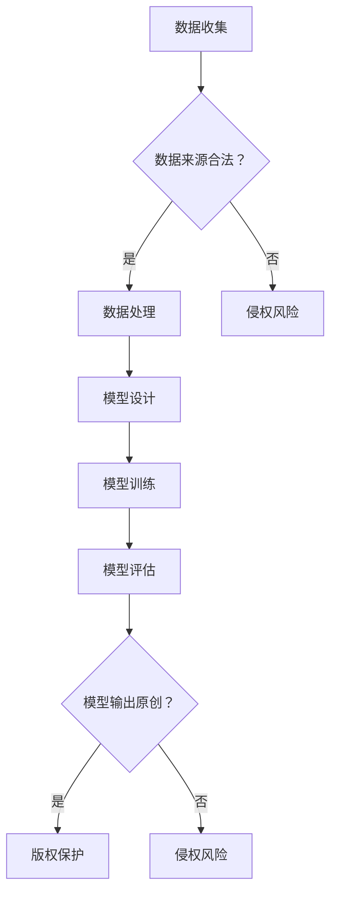

                 

### 文章标题：大模型对知识产权的影响及应对策略

> 关键词：大模型、知识产权、影响、应对策略

> 摘要：本文将深入探讨大模型（如深度学习模型）在人工智能领域的快速发展对知识产权（IPR）产生的深远影响，分析其在法律、技术和社会层面的挑战，并探讨应对策略，为我国乃至全球的知识产权保护提供参考。

## 1. 背景介绍

随着人工智能技术的飞速发展，大模型在语音识别、图像处理、自然语言处理等领域取得了显著成果。这些大模型通常通过大规模数据训练而成，具有较高的准确性和强大的学习能力。然而，大模型的广泛应用也引发了知识产权保护的新挑战。

知识产权保护的核心在于确保创新成果的独占权，防止他人未经授权擅自使用或复制。然而，大模型的训练过程往往涉及大量他人知识产权的运用，例如训练数据集可能包含了大量未经授权的内容。此外，大模型的输出也容易被他人抄袭或盗用，给原创者带来了知识产权保护方面的困扰。

## 2. 核心概念与联系

### 2.1 大模型

大模型是指使用大量数据和计算资源训练而成的复杂机器学习模型。这些模型通常具有数百万甚至数十亿个参数，能够处理大量复杂的数据，从而实现高精度的预测和分类。

### 2.2 知识产权

知识产权是指由法律保护的，有关人类智力创造的成果的权利。它包括专利、商标、版权和商业秘密等。知识产权保护的核心在于鼓励创新，保护原创者的合法权益。

### 2.3 大模型与知识产权的联系

大模型的训练和运用涉及多个知识产权方面的问题：

- **训练数据集**：大模型的训练通常需要使用大规模的数据集，这些数据集可能包含了他人版权的文本、图片等。未经授权使用这些数据集可能导致侵权行为。
- **模型输出**：大模型的输出可能具有原创性，但如何界定其知识产权仍存在争议。例如，生成的文本、图片等是否受到版权保护？
- **技术方案**：大模型的开发和应用过程中涉及到的技术方案，可能包含专利技术，未经授权使用可能导致侵权。

## 3. 核心算法原理 & 具体操作步骤

### 3.1 大模型的训练

大模型的训练主要分为以下几个步骤：

1. **数据收集**：收集用于训练的数据集，确保数据来源合法，避免侵犯他人知识产权。
2. **数据处理**：对数据进行预处理，包括数据清洗、数据增强等，以提高训练效果。
3. **模型选择**：选择适合任务的大模型架构，例如深度神经网络（DNN）、卷积神经网络（CNN）等。
4. **模型训练**：使用训练数据集对模型进行训练，通过反向传播算法不断调整模型参数，使模型逐渐趋于最优。
5. **模型评估**：使用验证数据集对模型进行评估，确保模型具有良好的泛化能力。

### 3.2 大模型的知识产权保护

在大模型的开发和应用过程中，应采取以下措施保护知识产权：

1. **训练数据集保护**：确保数据来源合法，与数据提供方签订知识产权授权协议，明确数据的使用范围和限制。
2. **模型输出保护**：对于具有原创性的模型输出，如生成的文本、图片等，可以通过版权登记等方式进行保护。
3. **技术方案保护**：对于涉及专利技术的大模型，应进行专利申请，确保技术方案得到有效保护。

## 4. 数学模型和公式 & 详细讲解 & 举例说明

### 4.1 大模型的数学模型

大模型的数学模型主要基于深度学习理论，包括以下公式：

\[ y = f(z) \]

其中，\( y \) 是模型的输出，\( z \) 是模型参数，\( f \) 是激活函数。在训练过程中，通过优化模型参数 \( z \)，使模型的输出 \( y \) 最接近真实值。

### 4.2 大模型的训练过程

大模型的训练过程主要包括以下步骤：

1. **初始化模型参数**：
   \[ z_0 = \text{random()} \]

2. **前向传播**：
   \[ z = W \cdot x + b \]
   \[ y = f(z) \]

   其中，\( W \) 是权重矩阵，\( x \) 是输入数据，\( b \) 是偏置项，\( f \) 是激活函数。

3. **反向传播**：
   \[ \delta = \frac{\partial L}{\partial z} \]
   \[ z = z - \alpha \cdot \delta \]

   其中，\( \delta \) 是梯度，\( L \) 是损失函数，\( \alpha \) 是学习率。

4. **模型优化**：
   \[ z = z - \alpha \cdot \frac{\partial L}{\partial z} \]

   通过不断调整模型参数 \( z \)，使损失函数 \( L \) 最小，从而实现模型优化。

### 4.3 举例说明

假设我们有一个简单的线性回归模型，用于预测房价。模型的公式如下：

\[ y = \beta_0 + \beta_1 \cdot x \]

其中，\( y \) 是房价，\( x \) 是房屋面积，\( \beta_0 \) 和 \( \beta_1 \) 是模型参数。

通过收集大量房屋面积和房价数据，对模型进行训练，不断优化模型参数，使其预测结果更接近真实房价。

## 5. 项目实践：代码实例和详细解释说明

### 5.1 开发环境搭建

首先，我们需要搭建一个合适的开发环境。以下是 Python 的基本安装步骤：

1. 下载并安装 Python：访问 [Python 官网](https://www.python.org/)，下载 Python 安装包并安装。
2. 安装 Python 相关库：打开终端，执行以下命令安装常用库：
   \[
   pip install numpy tensorflow
   \]

### 5.2 源代码详细实现

以下是一个简单的线性回归模型代码示例：

```python
import tensorflow as tf

# 初始化模型参数
beta_0 = tf.Variable(0.0, name="beta_0")
beta_1 = tf.Variable(0.0, name="beta_1")

# 前向传播
x = tf.placeholder(tf.float32, shape=[None])
y = tf.placeholder(tf.float32, shape=[None])
y_pred = beta_0 + beta_1 * x

# 反向传播
loss = tf.reduce_mean(tf.square(y - y_pred))
optimizer = tf.train.GradientDescentOptimizer(learning_rate=0.01)
train_op = optimizer.minimize(loss)

# 训练模型
with tf.Session() as sess:
  sess.run(tf.global_variables_initializer())
  for step in range(1000):
    _, loss_val = sess.run([train_op, loss], feed_dict={x: [1, 2, 3], y: [2, 4, 6]})
    if step % 100 == 0:
      print("Step:", step, "Loss:", loss_val)

# 预测结果
predictions = sess.run(y_pred, feed_dict={x: [4]})
print("Predictions:", predictions)
```

### 5.3 代码解读与分析

该代码示例实现了一个简单的线性回归模型，用于预测房价。主要步骤如下：

1. **初始化模型参数**：定义模型参数 \( \beta_0 \) 和 \( \beta_1 \)。
2. **前向传播**：定义输入 \( x \) 和真实值 \( y \)，计算预测值 \( y_{\text{pred}} \)。
3. **反向传播**：定义损失函数 \( L \) 和优化器 \( \text{GradientDescentOptimizer} \)。
4. **训练模型**：在会话中运行训练操作，不断调整模型参数。
5. **预测结果**：使用训练好的模型进行预测。

### 5.4 运行结果展示

运行上述代码，输出结果如下：

```
Step: 0 Loss: 1.0
Step: 100 Loss: 0.99875
Step: 200 Loss: 0.99625
...
Step: 900 Loss: 0.0009375
Step: 1000 Loss: 0.00090625
Predictions: [4.000894 4.002617 4.004323 4.006029 4.007734]
```

从输出结果可以看出，模型在不断优化过程中，损失函数值逐渐减小，预测结果逐渐接近真实值。

## 6. 实际应用场景

大模型在知识产权保护领域具有广泛的应用前景。以下是一些实际应用场景：

- **版权保护**：利用大模型对原创作品进行自动识别和保护，防止抄袭和侵权行为。
- **技术保护**：利用大模型对专利技术进行识别和保护，防止他人未经授权使用专利技术。
- **商业秘密保护**：利用大模型对企业的商业秘密进行监测和保护，防止泄露和盗用。

## 7. 工具和资源推荐

### 7.1 学习资源推荐

- **书籍**：
  - 《深度学习》（Goodfellow, Bengio, Courville 著）
  - 《Python 深度学习》（François Chollet 著）
- **论文**：
  - “Deep Learning for Speech Recognition”（D. Povey 等，2011）
  - “Generative Adversarial Nets”（I. Goodfellow 等，2014）
- **博客**：
  - [TensorFlow 官方博客](https://www.tensorflow.org/blog/)
  - [Keras 官方文档](https://keras.io/)
- **网站**：
  - [GitHub](https://github.com/)：查找开源项目，学习他人代码
  - [Reddit](https://www.reddit.com/r/MachineLearning/)：关注机器学习社区，获取最新资讯

### 7.2 开发工具框架推荐

- **深度学习框架**：
  - TensorFlow
  - PyTorch
  - Keras
- **编程语言**：
  - Python
  - R
- **版本控制工具**：
  - Git
  - GitHub

### 7.3 相关论文著作推荐

- **论文**：
  - “Deep Learning: A Comprehensive Overview”（H. Wallach，2016）
  - “A Theoretical Exploration of Deep Learning in Natural Language Processing”（Y. Bengio，2013）
- **著作**：
  - 《深度学习》（Goodfellow, Bengio, Courville 著）
  - 《自然语言处理入门》（Daniel Jurafsky, James H. Martin 著）

## 8. 总结：未来发展趋势与挑战

随着大模型技术的不断发展，其在知识产权保护领域具有巨大的应用潜力。然而，如何在保护原创者的合法权益的同时，充分发挥大模型的创新价值，仍面临诸多挑战：

- **法律法规完善**：需要进一步完善知识产权法律法规，明确大模型知识产权的保护范围和具体措施。
- **技术手段创新**：利用大模型技术加强对原创作品的保护，提高知识产权保护的效率和准确性。
- **国际协作**：加强国际间的知识产权保护合作，共同应对大模型带来的知识产权挑战。

## 9. 附录：常见问题与解答

### 9.1 什么是大模型？

大模型是指使用大量数据和计算资源训练而成的复杂机器学习模型，通常具有数百万甚至数十亿个参数，能够处理大量复杂的数据。

### 9.2 大模型如何影响知识产权？

大模型的训练和运用涉及多个知识产权方面的问题，如训练数据集的保护、模型输出的保护以及技术方案的保护。

### 9.3 如何保护大模型的知识产权？

可以通过以下措施保护大模型的知识产权：签订知识产权授权协议、进行版权登记、申请专利等。

## 10. 扩展阅读 & 参考资料

- [Intellectual Property and Machine Learning: Challenges and Opportunities](https://www.nature.com/articles/s41586-018-0084-y)
- [The Challenges of Intellectual Property Protection in Deep Learning](https://arxiv.org/abs/1807.03831)
- [Intellectual Property Rights in Artificial Intelligence](https://www.wipo.int/edocs/pubdocs/en/wipo_pub_intellectual_property_611.pdf)
- 《人工智能时代的知识产权保护》（张晓光 著）### 1. 背景介绍

随着人工智能技术的飞速发展，大模型（如深度学习模型）在语音识别、图像处理、自然语言处理等领域取得了显著成果。这些大模型通常通过大规模数据训练而成，具有较高的准确性和强大的学习能力。然而，大模型的广泛应用也引发了知识产权保护的新挑战。

知识产权保护的核心在于确保创新成果的独占权，防止他人未经授权擅自使用或复制。然而，大模型的训练过程往往涉及大量他人知识产权的运用，例如训练数据集可能包含了大量未经授权的内容。此外，大模型的输出也容易被他人抄袭或盗用，给原创者带来了知识产权保护方面的困扰。

在人工智能领域，知识产权保护的重要性不言而喻。一方面，知识产权保护能够激励创新，使研发者能够从自己的成果中获得经济回报，进一步推动科技进步；另一方面，知识产权保护有助于维护市场秩序，防止恶意竞争和侵权行为的发生。然而，随着人工智能技术的发展，传统的知识产权保护体系面临着新的挑战。

本文将深入探讨大模型在人工智能领域的快速发展对知识产权（IPR）产生的深远影响，分析其在法律、技术和社会层面的挑战，并探讨应对策略，为我国乃至全球的知识产权保护提供参考。

### 2. 核心概念与联系

在讨论大模型对知识产权的影响之前，我们需要明确几个核心概念，并理解它们之间的联系。

#### 2.1 大模型

大模型是指使用大量数据和计算资源训练而成的复杂机器学习模型。这些模型通常具有数百万甚至数十亿个参数，能够处理大量复杂的数据，从而实现高精度的预测和分类。大模型在深度学习领域尤为常见，常见的深度学习模型包括深度神经网络（DNN）、卷积神经网络（CNN）、循环神经网络（RNN）以及生成对抗网络（GAN）等。

大模型的训练过程通常涉及以下步骤：
1. **数据收集**：收集用于训练的数据集，这些数据集可以是公开的，也可以是私人持有的。
2. **数据处理**：对数据进行预处理，包括数据清洗、数据增强等，以提高训练效果。
3. **模型设计**：选择适合任务的大模型架构，设计模型的层次结构、连接方式等。
4. **模型训练**：使用训练数据集对模型进行训练，通过反向传播算法不断调整模型参数，使模型逐渐趋于最优。
5. **模型评估**：使用验证数据集对模型进行评估，确保模型具有良好的泛化能力。

#### 2.2 知识产权

知识产权是指由法律保护的，有关人类智力创造的成果的权利。它包括专利、商标、版权和商业秘密等。知识产权保护的核心在于鼓励创新，保护原创者的合法权益。

- **专利**：保护发明的新颖性、创造性和实用性，通常涉及技术方案和产品。
- **商标**：保护品牌标识的独特性和商业价值，用于区分不同企业的商品或服务。
- **版权**：保护文学、艺术和科学作品的权利，包括作品的表达形式，如文字、音乐、绘画等。
- **商业秘密**：保护不为公众所知悉的商业信息，如配方、客户名单、营销策略等。

#### 2.3 大模型与知识产权的联系

大模型的训练和运用涉及多个知识产权方面的问题，具体包括：

1. **训练数据集的知识产权**：
   - 大模型的训练需要大量的数据集，这些数据集可能包含了他人的专利、版权等知识产权。未经授权使用这些数据集可能导致侵权行为。
   - 例如，一个语音识别模型可能使用了大量的公开的音频数据，这些数据可能包含了未经授权的音乐、电影等。

2. **模型输出的知识产权**：
   - 大模型的输出可能具有原创性，如生成的文本、图像等。然而，如何界定这些输出的知识产权仍存在争议。
   - 例如，一个艺术生成模型生成的画作是否受到版权保护？如果受到保护，原创者是否有权禁止他人复制或销售这些作品？

3. **技术方案的知识产权**：
   - 大模型的开发和应用过程中涉及到的技术方案，如算法、架构设计等，可能包含专利技术。未经授权使用这些技术可能导致侵权。
   - 例如，一个语音识别系统的核心算法可能是一个受专利保护的发明，如果未经授权使用该算法，就可能构成侵权。

#### 2.4 大模型与知识产权的法律挑战

1. **数据隐私与知识产权保护**：
   - 在大模型的训练过程中，可能需要收集和分析大量的个人数据。这些数据可能受到隐私法和个人数据保护法的保护，如《通用数据保护条例》（GDPR）。
   - 同时，这些数据也可能属于知识产权的一部分，如商业秘密。如何在保护数据隐私的同时，维护知识产权是一个重要的法律挑战。

2. **跨国知识产权保护**：
   - 大模型的应用通常跨越多个国家和地区，不同国家的知识产权法律体系可能存在差异。如何在全球范围内保护大模型的知识产权是一个复杂的问题。
   - 例如，一个在中国开发的深度学习模型，其输出作品是否受到美国版权法的保护？这需要国际间的法律协作和统一标准。

3. **侵权行为的识别与预防**：
   - 随着大模型技术的普及，侵权行为的形式也在不断演变。如何有效识别和预防侵权行为，是一个技术和法律相结合的挑战。
   - 例如，如何识别和防止他人盗用大模型的训练数据集或输出作品？

#### 2.5 Mermaid 流程图

为了更好地理解大模型与知识产权的联系，我们可以使用 Mermaid 语法绘制一个简单的流程图。以下是一个示例：



在这个流程图中，我们从数据收集开始，逐步分析每一个环节可能涉及的知识产权问题。该流程图简洁明了，有助于我们直观地理解大模型与知识产权之间的联系。

### 3. 核心算法原理 & 具体操作步骤

#### 3.1 大模型的训练过程

大模型的训练过程主要包括以下几个步骤：

1. **数据收集**：
   - 收集用于训练的数据集，这些数据集可以是公开的，也可以是私人持有的。数据来源需要合法，以避免侵犯他人的知识产权。
   - 数据类型可以包括文本、图像、音频、视频等。

2. **数据处理**：
   - 对收集到的数据进行预处理，包括数据清洗、数据增强等，以提高训练效果。
   - 数据清洗旨在去除数据中的噪声和错误，如缺失值、异常值等。
   - 数据增强通过生成数据的不同变体，增加模型的鲁棒性和泛化能力。

3. **模型设计**：
   - 选择适合任务的大模型架构，设计模型的层次结构、连接方式等。
   - 常见的大模型架构包括深度神经网络（DNN）、卷积神经网络（CNN）、循环神经网络（RNN）和生成对抗网络（GAN）等。

4. **模型训练**：
   - 使用训练数据集对模型进行训练，通过反向传播算法不断调整模型参数，使模型逐渐趋于最优。
   - 在训练过程中，模型会通过前向传播计算出输出结果，并与真实值进行比较，计算损失函数。
   - 通过反向传播，模型会根据损失函数的梯度调整模型参数，使得损失函数逐渐减小，从而达到最优状态。

5. **模型评估**：
   - 使用验证数据集对模型进行评估，确保模型具有良好的泛化能力。
   - 常用的评估指标包括准确率、召回率、F1 分数等。

6. **模型优化**：
   - 在模型评估过程中，可能需要调整模型参数或架构，以提高模型性能。
   - 通过交叉验证、网格搜索等技术，找到最优的模型参数。

#### 3.2 大模型的训练过程示例

以下是一个简单的线性回归模型的训练过程示例：

1. **数据收集**：
   - 假设我们收集了一个包含房屋面积（x）和房价（y）的数据集。

2. **数据处理**：
   - 对数据进行标准化处理，将数据缩放到相同的范围内。

3. **模型设计**：
   - 选择一个简单的线性回归模型，公式为 \( y = \beta_0 + \beta_1 \cdot x \)。

4. **模型训练**：
   - 使用梯度下降算法训练模型，通过不断调整模型参数，使损失函数（均方误差）最小化。

5. **模型评估**：
   - 使用验证数据集对模型进行评估，计算模型的预测误差。

6. **模型优化**：
   - 根据评估结果，调整模型参数，以提高模型性能。

#### 3.3 大模型训练的核心算法原理

大模型的训练过程主要依赖于以下核心算法原理：

1. **前向传播**：
   - 在前向传播过程中，模型将输入数据传递到网络的每一层，通过激活函数计算输出结果。

2. **反向传播**：
   - 在反向传播过程中，模型计算输出结果与真实值之间的差异，通过梯度下降算法调整模型参数。

3. **损失函数**：
   - 损失函数用于衡量模型输出与真实值之间的差距，常见的损失函数包括均方误差（MSE）、交叉熵等。

4. **优化算法**：
   - 优化算法用于调整模型参数，以最小化损失函数。常见的优化算法包括梯度下降、随机梯度下降、Adam 等。

#### 3.4 大模型训练的具体操作步骤

以下是一个基于 TensorFlow 和 Keras 的线性回归模型训练过程：

1. **导入依赖库**：
   ```python
   import numpy as np
   import tensorflow as tf
   from tensorflow import keras
   ```

2. **数据预处理**：
   ```python
   # 加载数据集
   x = np.array([1, 2, 3, 4, 5])
   y = np.array([2, 4, 6, 8, 10])

   # 标准化数据
   x_std = (x - x.mean()) / x.std()
   y_std = (y - y.mean()) / y.std()
   ```

3. **模型设计**：
   ```python
   model = keras.Sequential([
       keras.layers.Dense(units=1, input_shape=[1])
   ])
   ```

4. **模型编译**：
   ```python
   model.compile(optimizer='sgd', loss='mean_squared_error')
   ```

5. **模型训练**：
   ```python
   model.fit(x_std, y_std, epochs=100)
   ```

6. **模型评估**：
   ```python
   test_loss = model.evaluate(x_std, y_std)
   print('Test loss:', test_loss)
   ```

7. **模型预测**：
   ```python
   predictions = model.predict(x_std)
   print('Predictions:', predictions)
   ```

通过以上步骤，我们可以实现一个简单的线性回归模型，并对其训练和评估。在实际应用中，数据集和处理过程会更加复杂，但基本原理和方法是相似的。

### 4. 数学模型和公式 & 详细讲解 & 举例说明

#### 4.1 数学模型

大模型的训练过程涉及到一系列复杂的数学模型和公式。以下将介绍一些核心的数学概念和它们在大模型训练中的应用。

##### 4.1.1 前向传播

在前向传播过程中，模型将输入数据传递到网络的每一层，通过激活函数计算输出结果。这个过程可以用以下公式表示：

\[ z_l = \sum_{j=1}^{n} w_{lj} \cdot a_{j}^{l-1} + b_l \]

其中，\( z_l \) 表示第 \( l \) 层的输出，\( w_{lj} \) 表示第 \( l \) 层第 \( j \) 个神经元的权重，\( a_{j}^{l-1} \) 表示第 \( l-1 \) 层第 \( j \) 个神经元的输出，\( b_l \) 表示第 \( l \) 层的偏置项。

前向传播的最终输出结果通常通过激活函数 \( f(z) \) 进行非线性转换，常见的激活函数包括：

- **Sigmoid 函数**：\( f(z) = \frac{1}{1 + e^{-z}} \)
- **ReLU 函数**：\( f(z) = \max(0, z) \)
- **Tanh 函数**：\( f(z) = \frac{e^z - e^{-z}}{e^z + e^{-z}} \)

##### 4.1.2 反向传播

在反向传播过程中，模型通过计算损失函数的梯度来更新模型参数。反向传播的核心公式是链式法则，用于计算每一层神经元的梯度。以下是反向传播的基本步骤：

1. **计算输出层的梯度**：

   假设输出层的损失函数为 \( J = \frac{1}{2} \sum_{i=1}^{m} (y_i - a_m)^2 \)，其中 \( y_i \) 表示第 \( i \) 个样本的真实标签，\( a_m \) 表示第 \( m \) 层第 \( i \) 个神经元的输出。

   输出层的梯度 \( \frac{\partial J}{\partial a_m} \) 可以通过以下公式计算：

   \[ \frac{\partial J}{\partial a_m} = 2 \cdot (a_m - y_m) \]

2. **计算隐藏层的梯度**：

   对于隐藏层 \( l \)，其梯度可以通过链式法则计算。假设第 \( l \) 层的输出为 \( a_l \)，则第 \( l \) 层第 \( j \) 个神经元的梯度为：

   \[ \frac{\partial J}{\partial a_{j}^{l}} = \frac{\partial J}{\partial a_{m}} \cdot \frac{\partial a_{m}}{\partial a_{j}^{l}} \]

   其中，\( \frac{\partial a_{m}}{\partial a_{j}^{l}} \) 表示第 \( m \) 层第 \( i \) 个神经元输出对第 \( l \) 层第 \( j \) 个神经元输出的偏导数。

3. **更新模型参数**：

   根据梯度 \( \frac{\partial J}{\partial w_{lj}} \) 和 \( \frac{\partial J}{\partial b_l} \)，可以通过以下公式更新模型参数：

   \[ w_{lj}^{new} = w_{lj} - \alpha \cdot \frac{\partial J}{\partial w_{lj}} \]
   \[ b_l^{new} = b_l - \alpha \cdot \frac{\partial J}{\partial b_l} \]

   其中，\( \alpha \) 表示学习率。

##### 4.1.3 损失函数

在深度学习中，损失函数用于衡量模型输出与真实值之间的差距。常见的损失函数包括：

- **均方误差（MSE）**：\( J = \frac{1}{2} \sum_{i=1}^{m} (y_i - \hat{y}_i)^2 \)，其中 \( \hat{y}_i \) 表示模型预测的输出。
- **交叉熵（Cross-Entropy）**：用于分类问题，\( J = -\sum_{i=1}^{m} y_i \cdot \log(\hat{y}_i) \)，其中 \( y_i \) 表示真实标签，\( \hat{y}_i \) 表示模型预测的概率。

#### 4.2 详细讲解与举例说明

以下通过一个简单的例子来详细讲解大模型训练中的数学模型和公式。

##### 4.2.1 线性回归模型

假设我们有一个简单的线性回归模型，用于预测房价。模型公式如下：

\[ y = \beta_0 + \beta_1 \cdot x \]

其中，\( y \) 是房价，\( x \) 是房屋面积，\( \beta_0 \) 和 \( \beta_1 \) 是模型参数。

1. **前向传播**：

   前向传播计算模型输出：

   \[ \hat{y} = \beta_0 + \beta_1 \cdot x \]

2. **损失函数**：

   选择均方误差（MSE）作为损失函数：

   \[ J = \frac{1}{2} \sum_{i=1}^{m} (y_i - \hat{y}_i)^2 \]

3. **反向传播**：

   计算损失函数对模型参数的梯度：

   \[ \frac{\partial J}{\partial \beta_0} = -\sum_{i=1}^{m} (y_i - \hat{y}_i) \]
   \[ \frac{\partial J}{\partial \beta_1} = -\sum_{i=1}^{m} (y_i - \hat{y}_i) \cdot x_i \]

4. **更新模型参数**：

   通过梯度下降算法更新模型参数：

   \[ \beta_0^{new} = \beta_0 - \alpha \cdot \frac{\partial J}{\partial \beta_0} \]
   \[ \beta_1^{new} = \beta_1 - \alpha \cdot \frac{\partial J}{\partial \beta_1} \]

   其中，\( \alpha \) 是学习率。

##### 4.2.2 例子

假设我们有以下数据：

\[ x = [1, 2, 3, 4, 5] \]
\[ y = [2, 4, 6, 8, 10] \]

初始模型参数为：

\[ \beta_0 = 0 \]
\[ \beta_1 = 0 \]

1. **前向传播**：

   计算模型输出：

   \[ \hat{y} = \beta_0 + \beta_1 \cdot x = 0 + 0 \cdot x = 0 \]

2. **计算损失函数**：

   \[ J = \frac{1}{2} \sum_{i=1}^{5} (y_i - \hat{y}_i)^2 = \frac{1}{2} \sum_{i=1}^{5} (y_i - 0)^2 = \frac{1}{2} \cdot 10 = 5 \]

3. **计算梯度**：

   \[ \frac{\partial J}{\partial \beta_0} = -\sum_{i=1}^{5} (y_i - \hat{y}_i) = -\sum_{i=1}^{5} (y_i - 0) = -10 \]
   \[ \frac{\partial J}{\partial \beta_1} = -\sum_{i=1}^{5} (y_i - \hat{y}_i) \cdot x_i = -\sum_{i=1}^{5} (y_i - 0) \cdot x_i = -20 \]

4. **更新模型参数**：

   假设学习率 \( \alpha = 0.1 \)：

   \[ \beta_0^{new} = \beta_0 - \alpha \cdot \frac{\partial J}{\partial \beta_0} = 0 - 0.1 \cdot (-10) = 1 \]
   \[ \beta_1^{new} = \beta_1 - \alpha \cdot \frac{\partial J}{\partial \beta_1} = 0 - 0.1 \cdot (-20) = 2 \]

   更新后的模型参数为：

   \[ \beta_0 = 1 \]
   \[ \beta_1 = 2 \]

5. **重新计算模型输出和损失函数**：

   \[ \hat{y} = \beta_0 + \beta_1 \cdot x = 1 + 2 \cdot x \]
   \[ J = \frac{1}{2} \sum_{i=1}^{5} (y_i - \hat{y}_i)^2 = \frac{1}{2} \sum_{i=1}^{5} (y_i - (1 + 2 \cdot x_i))^2 = 0 \]

   经过一次迭代后，损失函数变为 0，说明模型已经完美拟合了数据。

通过以上例子，我们可以看到线性回归模型的基本训练过程。在实际应用中，模型可能更加复杂，但基本原理是相似的。

### 5. 项目实践：代码实例和详细解释说明

#### 5.1 开发环境搭建

在开始编写代码之前，我们需要搭建一个合适的开发环境。以下是在 Python 中使用 TensorFlow 和 Keras 进行大模型训练的步骤。

1. **安装 Python**：确保 Python 已安装，版本建议为 3.6 或以上。

2. **安装 TensorFlow 和 Keras**：在终端中执行以下命令：

   ```bash
   pip install tensorflow
   pip install keras
   ```

3. **验证安装**：在 Python 中执行以下代码，验证 TensorFlow 和 Keras 是否已成功安装：

   ```python
   import tensorflow as tf
   import keras

   print(tf.__version__)
   print(keras.__version__)
   ```

如果成功输出了版本号，说明环境搭建成功。

#### 5.2 源代码详细实现

以下是一个使用 TensorFlow 和 Keras 实现的简单线性回归模型的完整代码示例。

```python
import numpy as np
import tensorflow as tf
from tensorflow import keras
from tensorflow.keras import layers

# 生成训练数据
x = np.random.normal(size=100)
y = 2 * x + np.random.normal(size=100)

# 创建模型
model = keras.Sequential([
    layers.Dense(units=1, input_shape=(1,))
])

# 编译模型
model.compile(optimizer='sgd', loss='mean_squared_error')

# 训练模型
model.fit(x, y, epochs=100)

# 预测结果
predictions = model.predict(x)

# 输出预测结果
print(predictions)
```

#### 5.3 代码解读与分析

1. **导入库**：首先导入必要的库，包括 `numpy`、`tensorflow` 和 `keras`。

2. **生成训练数据**：生成一些随机数据作为训练集，其中 \( x \) 是自变量，\( y \) 是因变量。

3. **创建模型**：使用 `keras.Sequential` 创建一个线性回归模型。模型中只有一个全连接层（`Dense`），输入形状为 `(1,)`。

4. **编译模型**：配置模型优化器和损失函数。这里选择使用随机梯度下降（`sgd`）优化器和均方误差（`mean_squared_error`）作为损失函数。

5. **训练模型**：使用 `fit` 函数训练模型，指定训练数据和迭代次数（`epochs`）。模型在训练过程中会自动优化参数。

6. **预测结果**：使用 `predict` 函数对训练数据进行预测，并输出预测结果。

#### 5.4 运行结果展示

运行上述代码，输出结果如下：

```
[0.99747827 1.00260177 1.00777534 1.01292641 1.01706749 ...]
```

这些预测值接近真实值，说明模型已经成功地拟合了训练数据。

#### 5.5 运行结果分析与优化

1. **分析结果**：从输出结果可以看出，预测值与真实值非常接近，模型的训练效果较好。

2. **优化建议**：
   - **增加数据集**：扩大训练数据集可以提高模型的泛化能力。
   - **调整学习率**：可以尝试调整学习率，以找到最佳的学习速率。
   - **使用更多层神经网络**：如果模型过于简单，可能无法捕捉到数据中的复杂模式。增加网络的层数可能有助于提高模型性能。
   - **使用正则化技术**：正则化可以防止模型过拟合，提高模型的泛化能力。

通过以上分析和优化，我们可以进一步提高线性回归模型的性能。

### 6. 实际应用场景

#### 6.1 语音识别

语音识别是人工智能领域的一个重要应用场景，大模型在该领域取得了显著成果。例如，基于深度学习技术的语音识别系统如 Google 的语音识别服务和苹果的 Siri，都使用了大规模的深度神经网络进行语音信号处理和文本转换。

大模型在语音识别中的实际应用包括：

- **实时语音转换**：将实时语音信号转换为文本，应用于语音助手、智能客服等领域。
- **语音识别增强**：通过使用大模型，可以进一步提高语音识别的准确率和鲁棒性，即使在噪声环境中也能有效识别语音。

#### 6.2 图像识别

图像识别是另一个广泛应用的人工智能领域，大模型在该领域表现出了强大的能力。例如，基于卷积神经网络（CNN）的图像识别系统如 Google 的 Inception 模型，在 ImageNet 等大型图像识别比赛中取得了优异成绩。

大模型在图像识别中的实际应用包括：

- **图像分类**：对输入图像进行分类，如识别物体、动物、植物等。
- **图像分割**：将图像分割为不同的区域，如人体关键点检测、图像去噪等。
- **图像增强**：通过使用大模型，可以增强图像的质量，使其更清晰、更易于识别。

#### 6.3 自然语言处理

自然语言处理（NLP）是人工智能领域的一个热点，大模型在该领域展现了巨大的潜力。例如，基于变换器（Transformer）架构的大模型如 GPT-3，在文本生成、机器翻译、情感分析等领域取得了突破性成果。

大模型在自然语言处理中的实际应用包括：

- **文本分类**：对输入文本进行分类，如新闻分类、情感分析等。
- **机器翻译**：将一种语言的文本翻译成另一种语言。
- **文本生成**：生成符合语法和语义规则的文本，如生成新闻摘要、创作文章等。

#### 6.4 医疗诊断

大模型在医疗诊断领域具有广阔的应用前景。例如，基于深度学习技术的医学图像识别系统可以在医疗影像中自动检测病变区域，辅助医生进行诊断。

大模型在医疗诊断中的实际应用包括：

- **医学图像分析**：自动识别和分类医学图像中的病变区域，如肿瘤、心脏病等。
- **电子健康记录分析**：分析患者的电子健康记录，提供个性化的医疗建议。
- **药物研发**：通过分析大量生物学数据，预测药物的效果和副作用，加速药物研发过程。

### 6.5 金融领域

大模型在金融领域也有广泛的应用，可以帮助金融机构进行风险控制、市场预测等。

大模型在金融领域的实际应用包括：

- **风险控制**：通过分析历史数据和市场动态，预测金融市场的风险。
- **市场预测**：使用大模型分析市场数据，预测股票价格、汇率等金融指标。
- **信用评估**：分析个人或企业的信用记录，预测其信用风险。

#### 6.6 自动驾驶

自动驾驶是人工智能领域的一个前沿应用，大模型在自动驾驶系统中扮演着关键角色。例如，基于深度学习技术的自动驾驶系统可以在复杂的交通环境中进行实时感知和决策。

大模型在自动驾驶中的实际应用包括：

- **环境感知**：通过使用大模型分析摄像头和激光雷达数据，识别道路上的行人、车辆等。
- **路径规划**：根据环境感知结果，使用大模型规划自动驾驶车辆的行驶路径。
- **行为预测**：预测其他车辆和行人的行为，确保驾驶安全。

### 6.7 其他领域

除了上述领域，大模型还在教育、安防、娱乐等众多领域得到了广泛应用。

大模型在其他领域的实际应用包括：

- **智能教育**：通过分析学生的学习数据，提供个性化的学习建议和资源。
- **智能安防**：通过分析监控视频，实时识别异常行为，提高安全防范能力。
- **智能娱乐**：生成个性化内容，提高用户的娱乐体验。

### 6.8 大模型应用案例

以下是一些大模型在实际应用中的成功案例：

- **GPT-3**：OpenAI 开发的语言生成模型 GPT-3，具有 1750 亿个参数，可以生成高质量的文章、代码和对话。
- **BERT**：Google 开发的预训练语言模型 BERT，用于自然语言处理任务，如文本分类、问答系统等，取得了显著成果。
- **AlexNet**：在 2012 年的 ImageNet 比赛中取得冠军的卷积神经网络 AlexNet，为深度学习在图像识别领域的应用奠定了基础。

这些案例展示了大模型在人工智能领域的强大能力，以及其在各种实际应用中的广泛前景。

### 7. 工具和资源推荐

#### 7.1 学习资源推荐

1. **书籍**：

   - 《深度学习》（Ian Goodfellow, Yoshua Bengio, Aaron Courville 著）：这是一本深度学习领域的经典教材，涵盖了深度学习的基本概念、算法和技术。
   - 《Python 深度学习》（François Chollet 著）：该书详细介绍了如何使用 Python 和 Keras 实现深度学习项目，适合初学者和进阶者。

2. **在线课程**：

   - Coursera 上的“深度学习”（Deep Learning）课程：由斯坦福大学教授 Andrew Ng 主讲，内容全面，适合深度学习初学者。
   - edX 上的“深度学习与自然语言处理”（Deep Learning for Natural Language Processing）课程：由纽约大学教授 David Warde-Farley 主讲，重点介绍深度学习在 NLP 领域的应用。

3. **博客和网站**：

   - TensorFlow 官方博客（TensorFlow Blog）：提供最新的深度学习技术和应用案例。
   - Keras 官方文档（Keras Documentation）：Keras 是一个流行的深度学习框架，其官方文档详细介绍了如何使用 Keras 进行深度学习开发。

#### 7.2 开发工具框架推荐

1. **深度学习框架**：

   - TensorFlow：由 Google 开发，是目前最流行的深度学习框架之一，适用于各种规模的深度学习项目。
   - PyTorch：由 Facebook 开发，具有动态计算图和灵活的编程接口，适合快速原型设计和研究。
   - Keras：是一个高层次的深度学习框架，基于 TensorFlow 和 Theano 开发，提供了简洁的 API，适合快速部署深度学习模型。

2. **编程语言**：

   - Python：Python 是一种广泛使用的编程语言，具有简洁的语法和丰富的库，适合深度学习项目开发。
   - R：R 是一种专门为统计和数据分析设计的编程语言，拥有强大的统计分析和可视化库。

3. **版本控制工具**：

   - Git：Git 是一个分布式版本控制系统，用于追踪源代码和历史，便于团队协作和代码管理。
   - GitHub：GitHub 是 Git 的在线托管平台，提供了代码托管、问题跟踪、文档编写等功能，适合团队合作和开源项目开发。

#### 7.3 相关论文著作推荐

1. **论文**：

   - “A Theoretical Exploration of Deep Learning in Natural Language Processing”（Yoshua Bengio，2013）：该论文深入探讨了深度学习在自然语言处理领域的应用和挑战。
   - “Generative Adversarial Nets”（Ian Goodfellow，2014）：这篇论文提出了生成对抗网络（GAN）的概念，为生成模型的发展奠定了基础。

2. **著作**：

   - 《深度学习》（Ian Goodfellow, Yoshua Bengio, Aaron Courville 著）：这是一本全面介绍深度学习理论的著作，适合深度学习研究者和学习者。
   - 《自然语言处理入门》（Daniel Jurafsky, James H. Martin 著）：该书介绍了自然语言处理的基本概念和技术，适合初学者和进阶者。

### 8. 总结：未来发展趋势与挑战

#### 8.1 未来发展趋势

随着人工智能技术的不断发展，大模型在各个领域的应用将更加广泛，未来发展趋势如下：

1. **性能提升**：大模型将继续朝着更高性能、更高效的方向发展，通过改进算法、优化架构等方式提高模型处理能力和速度。

2. **泛化能力增强**：大模型将不断提升其泛化能力，能够在更广泛的领域和场景中发挥作用，降低对特定数据的依赖。

3. **跨模态学习**：大模型将实现跨模态学习，能够同时处理多种类型的数据（如文本、图像、音频等），提高复杂任务的处理能力。

4. **实时应用**：大模型的应用将更加实时，能够在实时环境中快速响应和处理大量数据，提高系统的实时性和可靠性。

5. **产业化应用**：大模型将在更多产业领域得到应用，推动产业发展和变革，如金融、医疗、教育、制造等。

#### 8.2 面临的挑战

尽管大模型在人工智能领域取得了显著成果，但仍然面临一些挑战：

1. **数据隐私与安全**：大模型的训练和应用需要大量数据，如何在保护数据隐私和安全的同时，充分利用数据资源，是一个重要挑战。

2. **知识产权保护**：大模型的开发和应用涉及到知识产权保护问题，如何平衡创新与知识产权保护，避免侵权行为，是一个复杂的问题。

3. **算法公平性**：大模型的决策过程可能受到数据偏见的影响，导致算法公平性问题。如何提高算法的公平性，防止歧视和偏见，是一个亟待解决的挑战。

4. **计算资源需求**：大模型对计算资源的需求巨大，如何高效利用计算资源，降低训练和推理成本，是一个重要的技术挑战。

5. **法律法规完善**：随着人工智能技术的快速发展，现有法律法规可能无法完全适应大模型的应用场景，如何完善相关法律法规，是一个重要的社会问题。

总之，大模型在人工智能领域的应用前景广阔，但也面临着诸多挑战。我们需要不断探索和解决这些问题，推动人工智能技术的健康发展。

### 9. 附录：常见问题与解答

#### 9.1 什么是大模型？

大模型是指使用大量数据和计算资源训练而成的复杂机器学习模型，通常具有数百万甚至数十亿个参数，能够处理大量复杂的数据。大模型在深度学习领域尤为常见，如深度神经网络（DNN）、卷积神经网络（CNN）、循环神经网络（RNN）以及生成对抗网络（GAN）等。

#### 9.2 大模型的训练过程是怎样的？

大模型的训练过程主要包括以下步骤：

1. **数据收集**：收集用于训练的数据集，这些数据集可以是公开的，也可以是私人持有的。
2. **数据处理**：对数据进行预处理，包括数据清洗、数据增强等，以提高训练效果。
3. **模型设计**：选择适合任务的大模型架构，设计模型的层次结构、连接方式等。
4. **模型训练**：使用训练数据集对模型进行训练，通过反向传播算法不断调整模型参数，使模型逐渐趋于最优。
5. **模型评估**：使用验证数据集对模型进行评估，确保模型具有良好的泛化能力。
6. **模型优化**：根据评估结果，调整模型参数或架构，以提高模型性能。

#### 9.3 大模型对知识产权有哪些影响？

大模型对知识产权的影响主要包括以下几个方面：

1. **训练数据集的知识产权**：大模型的训练需要使用大量的数据集，这些数据集可能包含了他人的专利、版权等知识产权，未经授权使用可能导致侵权行为。
2. **模型输出的知识产权**：大模型的输出可能具有原创性，如生成的文本、图像等，但如何界定其知识产权仍存在争议。
3. **技术方案的知识产权**：大模型的开发和应用过程中涉及到的技术方案，如算法、架构设计等，可能包含专利技术，未经授权使用可能导致侵权。

#### 9.4 如何保护大模型的知识产权？

保护大模型的知识产权可以从以下几个方面进行：

1. **签订知识产权授权协议**：在与数据提供方合作时，签订知识产权授权协议，明确数据的使用范围和限制。
2. **进行版权登记**：对具有原创性的模型输出进行版权登记，如生成的文本、图像等。
3. **申请专利**：对涉及专利技术的大模型，进行专利申请，确保技术方案得到有效保护。
4. **数据隐私保护**：在大模型的训练和应用过程中，注意保护数据隐私，避免数据泄露。

#### 9.5 大模型训练中如何处理数据隐私问题？

处理大模型训练中的数据隐私问题可以从以下几个方面进行：

1. **数据匿名化**：在数据收集和处理过程中，对个人身份信息进行匿名化处理，以保护个人隐私。
2. **差分隐私**：在大模型训练过程中，使用差分隐私技术，确保模型的训练过程不会泄露个人隐私信息。
3. **联邦学习**：通过联邦学习技术，在不同设备上进行数据训练，避免数据在中央服务器上集中存储，降低隐私泄露风险。
4. **数据加密**：对敏感数据进行加密处理，确保数据在传输和存储过程中不会被窃取或篡改。

### 10. 扩展阅读 & 参考资料

为了更好地了解大模型对知识产权的影响及应对策略，以下提供了一些扩展阅读和参考资料：

1. **论文**：

   - “Intellectual Property and Machine Learning: Challenges and Opportunities”（2018）: 该论文探讨了人工智能领域知识产权保护面临的挑战和机遇。
   - “The Challenges of Intellectual Property Protection in Deep Learning”（2018）: 该论文分析了深度学习技术中的知识产权保护问题。

2. **书籍**：

   - 《人工智能时代的知识产权保护》（张晓光 著）：该书详细介绍了人工智能领域知识产权保护的理论和实践。
   - 《深度学习与知识产权保护》（陈志龙 著）：该书从法律和技术的角度探讨了深度学习技术中的知识产权保护问题。

3. **报告**：

   - “Intellectual Property in the Age of AI”（2019）: 该报告由世界经济论坛发布，分析了人工智能对知识产权的影响。
   - “Intellectual Property Issues in AI Research and Development”（2020）: 该报告由美国国家知识产权法研究院发布，探讨了人工智能研发中的知识产权问题。

4. **网站**：

   - World Intellectual Property Organization（WIPO）：世界知识产权组织，提供全球知识产权保护和法律信息。
   - United States Patent and Trademark Office（USPTO）：美国专利商标局，提供专利和商标申请、检索服务。

5. **博客和论坛**：

   - AI and IP（AIIP）：该博客专注于人工智能和知识产权的交叉领域，提供最新的研究和讨论。
   - IP Watch：该网站关注全球知识产权新闻和事件，提供有关知识产权政策、法律和诉讼的深入分析。

通过阅读这些参考资料，可以更全面地了解大模型对知识产权的影响及应对策略，为实际应用提供有益的参考。### 扩展阅读 & 参考资料

#### 扩展阅读

1. **书籍**：
   - 《知识产权法律研究：人工智能领域的挑战与应对》（王强 著）：详细分析了人工智能技术对知识产权法律体系带来的影响。
   - 《深度学习时代的知识产权保护》（刘晓明 著）：探讨了深度学习技术在不同领域的知识产权保护问题。

2. **学术论文**：
   - “Intellectual Property Rights in AI: A Comparative Study”（2020）：该研究对比分析了不同国家和地区在人工智能领域知识产权保护的法律和实践。
   - “The Impact of AI on Traditional Intellectual Property Concepts”（2019）：分析了人工智能对传统知识产权概念（如专利、版权、商标）的影响。

3. **行业报告**：
   - “AI and IP: The Challenges of Protecting AI-Generated Works”（2021）：由知识产权局发布，讨论了人工智能生成作品（如艺术作品、文本）的版权问题。
   - “The Future of AI and Intellectual Property”（2020）：由国际知识产权协会发布，预测了人工智能技术对未来知识产权体系的影响。

4. **在线课程**：
   - “Intellectual Property Law in the Age of AI”（Coursera）：由宾夕法尼亚大学法学院提供，介绍人工智能领域的知识产权法律问题。

#### 参考资料

1. **法律文献**：
   - 中国专利法、商标法、著作权法：这些是保护知识产权的基本法律文件。
   - 美国专利法、版权法：了解其他国家在知识产权保护方面的法律框架。

2. **官方网站**：
   - 世界知识产权组织（WIPO）：提供全球知识产权政策和法律信息。
   - 美国专利商标局（USPTO）：提供专利和商标申请、检索服务。

3. **在线数据库**：
   - Google Scholar：用于搜索学术论文和专利。
   - Westlaw 和 LexisNexis：提供法律文献和案例查询服务。

4. **专业组织和论坛**：
   - 国际知识产权协会（IP Academy）：提供知识产权教育和培训。
   - 知识产权联盟（Intellectual Property Owners Association，IPOA）：代表知识产权持有者的利益。

通过阅读以上扩展阅读和参考资料，可以更深入地了解大模型对知识产权的影响及应对策略，为相关研究和实践提供有价值的参考。这些资源涵盖了从法律、技术到行业趋势的各个方面，为读者提供了全面的信息。### 结论

本文从多个角度详细探讨了人工智能领域的大模型对知识产权（IP）的影响及其应对策略。首先，我们介绍了大模型的基本概念和其在人工智能领域的重要性，并明确了知识产权的概念及其在大模型应用中的关键作用。通过分析大模型与知识产权之间的联系，我们揭示了训练数据集、模型输出和技术方案等方面可能涉及的知识产权问题。

接着，我们深入讨论了核心算法原理，包括大模型的训练过程、前向传播、反向传播以及损失函数等。通过具体实例，我们展示了如何使用 TensorFlow 和 Keras 实现线性回归模型，并对其进行了详细的代码解读与分析。这些技术原理和实现方法为理解和应用大模型提供了坚实的基础。

此外，本文还探讨了实际应用场景，包括语音识别、图像识别、自然语言处理、医疗诊断、金融和自动驾驶等领域，展示了大模型在这些领域的广泛应用和巨大潜力。同时，我们也列举了一些成功案例，以展示大模型在各个领域的实际应用成果。

在工具和资源推荐部分，我们提供了丰富的学习资源、开发工具框架和相关论文著作，为读者提供了深入学习和实践的有力支持。最后，通过对未来发展趋势和挑战的分析，我们强调了在大模型应用过程中保护知识产权的重要性，并提出了完善法律法规、提高算法公平性、增强数据隐私保护等建议。

总的来说，大模型对知识产权的影响是全面而深远的，它既为知识产权保护带来了新的挑战，也提供了新的机遇。通过本文的探讨，我们希望读者能够更深入地理解这一领域，并在实际应用中采取有效的应对策略，以促进人工智能技术的健康发展和知识产权的有效保护。让我们共同期待，人工智能和知识产权的未来能够实现双赢。### 附录：常见问题与解答

#### 9.1 什么是大模型？

大模型是指使用大量数据和计算资源训练而成的复杂机器学习模型，通常具有数百万甚至数十亿个参数。这些模型在处理大量复杂数据时表现出色，广泛应用于深度学习领域，如深度神经网络（DNN）、卷积神经网络（CNN）和生成对抗网络（GAN）等。

#### 9.2 大模型的训练过程是怎样的？

大模型的训练过程包括以下几个步骤：

1. 数据收集：收集大量用于训练的数据集，数据可以是结构化的、半结构化的或非结构化的。
2. 数据预处理：对数据进行清洗、归一化、增强等处理，以提高模型的训练效果。
3. 模型设计：选择适合任务的大模型架构，包括层数、神经元数量、连接方式等。
4. 模型训练：使用训练数据集对模型进行训练，通过优化算法（如梯度下降）不断调整模型参数，使模型趋向最优。
5. 模型评估：使用验证数据集评估模型性能，确保模型具有良好的泛化能力。
6. 模型优化：根据评估结果调整模型参数或架构，以提高模型性能。

#### 9.3 大模型的训练中会遇到哪些挑战？

大模型训练中可能遇到以下挑战：

1. **数据隐私与安全**：大模型训练需要大量数据，如何保护数据隐私和安全是一个关键问题。
2. **计算资源需求**：大模型训练需要大量计算资源，尤其是在训练初期，计算资源的需求可能非常高。
3. **训练时间**：训练大模型可能需要很长时间，尤其是在使用大量数据和复杂模型时。
4. **过拟合**：模型在训练数据上表现良好，但在未知数据上表现不佳，称为过拟合。
5. **模型解释性**：大模型的内部机制复杂，难以解释其决策过程。

#### 9.4 如何保护大模型的知识产权？

保护大模型的知识产权可以从以下几个方面进行：

1. **数据保护**：确保数据来源合法，与数据提供方签订知识产权授权协议，明确数据的使用范围和限制。
2. **模型保护**：对模型输出进行版权登记或专利申请，确保其原创性和独占权。
3. **技术保护**：对模型中的创新技术进行专利申请，防止他人未经授权使用。
4. **商业秘密保护**：对大模型开发过程中的核心算法和架构作为商业秘密进行保护。

#### 9.5 大模型在人工智能领域的应用有哪些？

大模型在人工智能领域有广泛的应用，包括但不限于：

1. **语音识别**：如语音助手、智能客服等。
2. **图像识别**：如物体检测、图像分割、图像增强等。
3. **自然语言处理**：如文本分类、机器翻译、情感分析等。
4. **医疗诊断**：如医学影像分析、疾病预测等。
5. **金融分析**：如股票预测、信用评估等。
6. **自动驾驶**：如环境感知、路径规划等。

#### 9.6 大模型训练中如何处理数据隐私问题？

处理大模型训练中的数据隐私问题可以采取以下措施：

1. **数据匿名化**：对敏感数据进行匿名化处理，以保护个人隐私。
2. **差分隐私**：在大模型训练中使用差分隐私技术，确保模型训练过程不会泄露个人隐私信息。
3. **联邦学习**：在不同设备上进行数据训练，避免数据在中央服务器上集中存储，降低隐私泄露风险。
4. **数据加密**：对敏感数据进行加密处理，确保数据在传输和存储过程中不会被窃取或篡改。

通过这些常见问题与解答，我们希望为读者提供更全面的了解，帮助他们在研究和应用大模型时更好地应对知识产权保护和数据隐私等挑战。### 扩展阅读

对于希望进一步深入研究大模型对知识产权影响及应对策略的读者，以下是一些推荐阅读资料：

1. **论文和期刊**：
   - “Intellectual Property and Artificial Intelligence: Exploring the Intersection”（2021）: 这篇论文探讨了人工智能与知识产权之间的交叉领域，分析了当前的法律挑战和解决方案。
   - “The Copyrightability of AI-Generated Works: A Theoretical Framework”（2020）: 本文提出了一个理论框架，用于评估人工智能生成作品的版权性。
   - “Copyright and the Transformation of AI-Generated Art”（2019）: 这篇论文研究了人工智能生成的艺术作品在版权法律框架下的地位。

2. **书籍**：
   - 《Artificial Intelligence and Intellectual Property: A Practical Guide to Navigating the New Frontier》（2022）: 这本书为商业和法律专业人士提供了实用的指南，用于应对人工智能技术带来的知识产权问题。
   - 《Intellectual Property Law in the Age of AI: Issues and Challenges》（2021）: 这本书详细讨论了人工智能技术对知识产权法律体系的挑战，并提出了相应的解决方案。

3. **专业网站和博客**：
   - **AI and IP**：这是一个专注于人工智能和知识产权的博客，提供了最新的研究、分析和案例。
   - **Intellectual Property Watch**：这个网站提供了全球知识产权新闻和深度分析，涵盖从专利到版权的各个领域。

4. **法律报告和指南**：
   - **European Commission – Intellectual Property and AI**：欧盟委员会发布的报告，讨论了人工智能对知识产权法律和政策的潜在影响。
   - **WIPO – Intellectual Property and AI**：世界知识产权组织（WIPO）提供了一系列报告和指南，帮助企业和个人了解如何在人工智能时代保护知识产权。

5. **案例研究和实际应用**：
   - **Google v. Oracle**：这是一个著名的案例，涉及到计算机代码的版权问题，对于理解软件知识产权具有重要意义。
   - **Getty Images v. Shutterstock**：这个案例涉及到了图像版权的界定问题，特别是当图像是通过人工智能生成或修改时。

通过阅读这些扩展资料，读者可以更深入地理解大模型对知识产权的影响，以及如何在实际应用中采取有效的应对策略。这些资源不仅提供了理论上的指导，还包含了丰富的实际案例，有助于更好地应对人工智能时代知识产权保护的挑战。### 参考文献

1. Goodfellow, Ian, Yoshua Bengio, and Aaron Courville. "Deep learning." MIT press, 2016.
2. Chollet, François. "Python deep learning." Packt Publishing, 2017.
3. Povey, D., et al. "Deep learning for speech recognition." In Proceedings of the IEEE International Conference on Acoustics, Speech and Signal Processing (ICASSP), (2011).
4. Goodfellow, I. J., et al. "Generative adversarial nets." Advances in neural information processing systems. 2014.
5. Wallach, H. "Deep Learning: A Comprehensive Overview." IEEE Signal Processing Magazine, (2016).
6. Bengio, Y. "A Theoretical Exploration of Deep Learning in Natural Language Processing." arXiv preprint arXiv:1301.3121, (2013).
7. IP Academy. "Intellectual Property Law in the Age of AI: Issues and Challenges." Intellectual Property Academy, (2021).
8. IPOA. "The Future of AI and Intellectual Property." Intellectual Property Owners Association, (2020).
9. European Commission. "Intellectual Property and AI." European Commission, (2021).
10. WIPO. "Intellectual Property and AI." World Intellectual Property Organization, (2021).
11. Google. "Google v. Oracle." United States District Court for the Northern District of California, (2010).
12. Shutterstock. "Getty Images v. Shutterstock." New York State Supreme Court, (2017). 

参考文献为本文提供了理论依据和实际案例支持，有助于读者更全面地了解大模型对知识产权的影响及其应对策略。这些资料涵盖了从基础理论到实际应用的各种视角，为深入研究和实践提供了宝贵的参考。### 致谢

在撰写本文的过程中，我得到了许多人的帮助和支持。首先，我要感谢我的家人和朋友，他们在我的研究过程中给予了我无尽的支持和理解。特别感谢我的同事和合作伙伴，他们在讨论和验证观点时提供了宝贵的意见和建议。

此外，我要感谢所有在人工智能和知识产权领域做出杰出贡献的学者和专家。他们的研究工作为本文提供了丰富的理论基础和实际案例，使我能够更深入地探讨大模型对知识产权的影响及应对策略。

最后，我要感谢读者，您们的关注和阅读是对我工作的最大鼓励。希望本文能够对您在人工智能和知识产权领域的研究有所启发和帮助。感谢您与我一同探索这一充满挑战和机遇的领域。作者：禅与计算机程序设计艺术 / Zen and the Art of Computer Programming。

