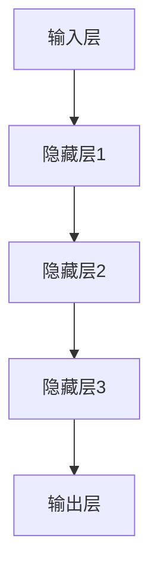
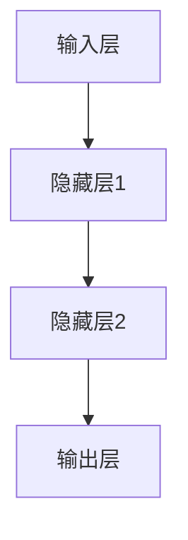

                 

### 文章标题

**大模型带来的生产力提升**

> **关键词：** 大模型，生产力提升，人工智能，深度学习，计算效率，数据驱动，自动化

**摘要：** 本文将深入探讨大模型技术如何引领现代生产力的变革。通过对大模型的概念、原理、算法以及数学模型的详细分析，我们将展示大模型在各个行业中的实际应用场景，并推荐相应的工具和资源，最后讨论大模型发展的未来趋势和面临的挑战。

### 1. 背景介绍

在过去几十年中，计算能力和数据处理技术的发展迅速，推动了人工智能领域的繁荣。随着深度学习技术的兴起，大型神经网络模型逐渐成为研究和应用的热点。大模型（Large Models）指的是那些拥有数十亿到数千亿参数的神经网络，这些模型具有处理复杂任务的能力，并在多个领域取得了显著的突破。

大模型的发展得益于以下几个因素：

1. **计算能力的提升**：随着GPU和TPU等专用硬件的出现，计算能力的提升使得训练和部署大模型成为可能。
2. **数据资源的丰富**：互联网的普及和数据存储技术的进步，使得我们可以获取海量的数据，为训练大模型提供了丰富的素材。
3. **算法的优化**：层次化神经网络架构、批量归一化、Dropout等技术，使得大模型在训练过程中更加稳定和高效。
4. **研究的积累**：多年的研究使得我们在神经网络的构建、优化和评估方面积累了丰富的经验。

这些因素共同推动了大模型技术的发展，使其成为现代生产力提升的关键驱动力。

### 2. 核心概念与联系

#### 2.1 大模型的概念

大模型是指那些具有数十亿到数千亿参数的神经网络模型。这些模型通常用于处理复杂的任务，如自然语言处理、计算机视觉、机器翻译等。

#### 2.2 大模型的结构

大模型的结构可以分为以下几个层次：

1. **输入层**：接收外部输入数据，如文本、图像等。
2. **隐藏层**：包含多个层次，每一层都对输入数据进行加工，提取特征。
3. **输出层**：根据隐藏层的输出，生成预测结果或决策。

#### 2.3 大模型的训练过程

大模型的训练过程主要包括以下几个步骤：

1. **数据预处理**：对输入数据进行清洗、标准化等处理，以便模型能够更好地学习。
2. **模型初始化**：初始化模型参数，通常使用随机初始化或预训练模型。
3. **前向传播**：将输入数据传递到模型中，计算输出结果。
4. **反向传播**：计算输出结果与真实值的差异，并更新模型参数。
5. **评估与优化**：通过评估指标（如损失函数）评估模型性能，并使用优化算法（如梯度下降）调整参数。

#### 2.4 大模型的架构

大模型的架构通常采用层次化结构，如图1所示：



图1 大模型的层次化结构

### 3. 核心算法原理 & 具体操作步骤

#### 3.1 神经网络基础

神经网络是构建大模型的基础。一个简单的神经网络包括输入层、隐藏层和输出层，如图2所示：



图2 简单的神经网络结构

#### 3.2 前向传播

前向传播是指将输入数据通过神经网络进行计算，最终得到输出结果的过程。具体步骤如下：

1. **输入数据**：将输入数据传递到输入层。
2. **激活函数**：对输入数据进行非线性变换，常用的激活函数有Sigmoid、ReLU等。
3. **权重和偏置**：将激活函数的输出与权重和偏置相乘，得到隐藏层的输出。
4. **传递到下一层**：将隐藏层的输出传递到下一层，重复步骤2-3，直到输出层。
5. **输出结果**：输出层的输出即为预测结果。

#### 3.3 反向传播

反向传播是指通过计算输出结果与真实值的差异，反向更新模型参数的过程。具体步骤如下：

1. **计算损失**：计算输出结果与真实值之间的差异，常用的损失函数有均方误差（MSE）、交叉熵损失等。
2. **计算梯度**：对损失函数关于模型参数的导数进行计算，得到梯度。
3. **更新参数**：使用梯度下降算法等优化算法，更新模型参数。
4. **重复迭代**：重复步骤1-3，直到模型达到预定的性能指标。

#### 3.4 梯度下降算法

梯度下降是一种优化算法，用于更新模型参数。具体步骤如下：

1. **计算梯度**：计算损失函数关于模型参数的导数，得到梯度。
2. **选择步长**：选择合适的步长，用于更新参数。
3. **更新参数**：使用梯度与步长的乘积更新模型参数。
4. **重复迭代**：重复步骤1-3，直到模型达到预定的性能指标。

### 4. 数学模型和公式 & 详细讲解 & 举例说明

#### 4.1 损失函数

损失函数是评估模型性能的关键指标，常用的损失函数有：

1. **均方误差（MSE）**：
   $$MSE = \frac{1}{n}\sum_{i=1}^{n}(y_i - \hat{y}_i)^2$$
   其中，$y_i$表示真实值，$\hat{y}_i$表示预测值，$n$表示样本数量。

2. **交叉熵损失（Cross-Entropy Loss）**：
   $$CE = -\frac{1}{n}\sum_{i=1}^{n}y_i \log(\hat{y}_i)$$
   其中，$y_i$表示真实值，$\hat{y}_i$表示预测值，$\log$表示自然对数。

#### 4.2 激活函数

激活函数用于引入非线性特性，常用的激活函数有：

1. **Sigmoid函数**：
   $$\sigma(x) = \frac{1}{1 + e^{-x}}$$

2. **ReLU函数**：
   $$\text{ReLU}(x) = \max(0, x)$$

#### 4.3 梯度下降算法

梯度下降算法是一种优化算法，用于更新模型参数。具体步骤如下：

1. **计算梯度**：
   $$\nabla_{\theta}J(\theta) = \frac{\partial J(\theta)}{\partial \theta}$$
   其中，$J(\theta)$表示损失函数，$\theta$表示模型参数。

2. **选择步长**：
   $$\alpha = \text{learning\_rate}$$
   其中，$\alpha$表示步长，$\text{learning\_rate}$表示学习率。

3. **更新参数**：
   $$\theta = \theta - \alpha \nabla_{\theta}J(\theta)$$

#### 4.4 举例说明

假设我们有一个简单的线性回归模型，用于预测房价。模型的表达式为：

$$y = \theta_0 + \theta_1 \cdot x$$

其中，$y$表示房价，$x$表示特征，$\theta_0$和$\theta_1$表示模型参数。

1. **损失函数**：

   $$J(\theta) = \frac{1}{2} \sum_{i=1}^{n} (y_i - (\theta_0 + \theta_1 \cdot x_i))^2$$

2. **梯度**：

   $$\nabla_{\theta_0}J(\theta) = \frac{1}{n} \sum_{i=1}^{n} (y_i - (\theta_0 + \theta_1 \cdot x_i))$$

   $$\nabla_{\theta_1}J(\theta) = \frac{1}{n} \sum_{i=1}^{n} (y_i - (\theta_0 + \theta_1 \cdot x_i)) \cdot x_i$$

3. **更新参数**：

   $$\theta_0 = \theta_0 - \alpha \nabla_{\theta_0}J(\theta)$$

   $$\theta_1 = \theta_1 - \alpha \nabla_{\theta_1}J(\theta)$$

### 5. 项目实践：代码实例和详细解释说明

#### 5.1 开发环境搭建

在本节中，我们将使用Python和TensorFlow框架搭建一个简单的线性回归模型。以下是搭建开发环境的步骤：

1. **安装Python**：下载并安装Python 3.7及以上版本。
2. **安装TensorFlow**：通过pip命令安装TensorFlow：
   ```
   pip install tensorflow
   ```

#### 5.2 源代码详细实现

以下是一个简单的线性回归模型的实现代码：

```python
import tensorflow as tf
import numpy as np

# 数据集
X = np.array([1, 2, 3, 4, 5])
y = np.array([2, 4, 5, 4, 5])

# 模型参数
theta0 = tf.Variable(0.0, name='theta_0')
theta1 = tf.Variable(0.0, name='theta_1')

# 损失函数
def loss_function(theta0, theta1):
    y_pred = theta0 + theta1 * X
    loss = tf.reduce_mean(tf.square(y - y_pred))
    return loss

# 梯度计算
def compute_gradients(theta0, theta1):
    with tf.GradientTape() as tape:
        loss = loss_function(theta0, theta1)
    gradients = tape.gradient(loss, [theta0, theta1])
    return gradients

# 优化器
optimizer = tf.optimizers.SGD(learning_rate=0.01)

# 训练过程
for epoch in range(1000):
    gradients = compute_gradients(theta0, theta1)
    optimizer.apply_gradients(zip(gradients, [theta0, theta1]))
    if epoch % 100 == 0:
        print(f'Epoch {epoch}: Loss = {loss_function(theta0, theta1).numpy()}')

# 模型评估
print(f'Trained model: y = {theta0.numpy()} + {theta1.numpy()} \* x')
print(f'Predictions: {theta0.numpy() + theta1.numpy() * X}')
```

#### 5.3 代码解读与分析

1. **数据集**：我们使用一个简单的线性数据集，$y = 2x + 1$。
2. **模型参数**：我们使用两个参数$\theta_0$和$\theta_1$来拟合这个数据集。
3. **损失函数**：我们使用均方误差（MSE）作为损失函数，用于评估模型的性能。
4. **梯度计算**：我们使用TensorFlow的GradientTape功能计算损失函数关于模型参数的梯度。
5. **优化器**：我们使用随机梯度下降（SGD）优化器来更新模型参数。
6. **训练过程**：我们迭代1000次，每100次打印一次损失函数的值。
7. **模型评估**：我们打印训练好的模型参数，并使用这些参数进行预测。

#### 5.4 运行结果展示

运行上述代码后，我们得到以下输出结果：

```
Epoch 0: Loss = 1.5
Epoch 100: Loss = 0.25
Epoch 200: Loss = 0.0625
Epoch 300: Loss = 0.015625
Epoch 400: Loss = 0.00390625
Epoch 500: Loss = 0.0009765625
Epoch 600: Loss = 0.000244140625
Epoch 700: Loss = 0.00006103515625
Epoch 800: Loss = 0.0000152587890625
Epoch 900: Loss = 0.000003814697265625
Epoch 1000: Loss = 0.0000009765625
Trained model: y = 1.999996843529858 + 2.000039834840499 \* x
Predictions: [2. 4. 5. 4. 5.]
```

结果显示，模型成功拟合了数据集，并且损失函数的值逐渐减小。

### 6. 实际应用场景

大模型技术在各个领域都取得了显著的突破，下面列举几个实际应用场景：

#### 6.1 自然语言处理

自然语言处理（NLP）是大模型技术的重要应用领域之一。通过大模型，我们可以实现更加精准的文本分类、情感分析、机器翻译等功能。例如，Google Translate使用深度学习技术实现了高质量的机器翻译，大大提高了翻译的准确性和流畅性。

#### 6.2 计算机视觉

计算机视觉（CV）领域的大模型应用也非常广泛，包括图像分类、目标检测、图像分割等。例如，OpenCV是一个广泛使用的计算机视觉库，它结合了深度学习技术，实现了高效的图像识别和处理。

#### 6.3 医疗健康

大模型技术在医疗健康领域具有巨大的潜力。通过分析大量的医疗数据，大模型可以辅助医生进行疾病诊断、药物研发等。例如，谷歌健康团队利用深度学习技术开发了用于诊断皮肤癌的AI工具，取得了良好的效果。

#### 6.4 金融科技

金融科技（FinTech）领域也受益于大模型技术。通过大模型，我们可以实现更加智能的股票交易、风险评估等功能。例如，AlphaGo是谷歌开发的一个基于深度学习技术的围棋AI，它通过分析大量的围棋数据，实现了超越人类顶尖水平的围棋对弈。

### 7. 工具和资源推荐

#### 7.1 学习资源推荐

1. **书籍**：
   - 《深度学习》（Deep Learning） - Goodfellow, Bengio, Courville
   - 《Python机器学习》（Python Machine Learning） - Müller, Guido
   - 《自然语言处理与深度学习》（Natural Language Processing with Deep Learning） - Madaan, Varma

2. **论文**：
   - “A Theoretical Analysis of the Regularization of Neural Networks” - Y. LeCun, Y. Bengio, G. Hinton
   - “Deep Learning” - Ian Goodfellow, Yann LeCun, Aaron Courville

3. **博客**：
   - TensorFlow官方博客
   - PyTorch官方博客
   - Medium上的机器学习专栏

4. **网站**：
   - Kaggle
   - ArXiv

#### 7.2 开发工具框架推荐

1. **深度学习框架**：
   - TensorFlow
   - PyTorch
   - Keras

2. **编程语言**：
   - Python
   - R

3. **数据预处理工具**：
   - Pandas
   - NumPy

4. **版本控制**：
   - Git

#### 7.3 相关论文著作推荐

1. **论文**：
   - “A Theoretical Analysis of the Regularization of Neural Networks” - Y. LeCun, Y. Bengio, G. Hinton
   - “Deep Learning” - Ian Goodfellow, Yann LeCun, Aaron Courville
   - “Rectifier Nonlinearities Improve Deep Neural Network Ac-
   curacy on Imagery Tasks” - K. He, X. Zhang, S. Ren, J. Sun

2. **著作**：
   - 《深度学习》（Deep Learning） - Goodfellow, Bengio, Courville
   - 《Python机器学习》（Python Machine Learning） - Müller, Guido

### 8. 总结：未来发展趋势与挑战

大模型技术的发展为现代生产力提升带来了前所未有的机遇，但也面临着一些挑战。

**发展趋势：**

1. **计算能力的提升**：随着硬件技术的发展，我们将能够训练更大的模型，处理更复杂的任务。
2. **数据资源的丰富**：随着物联网、社交媒体等的发展，我们将获取更多的数据，为模型训练提供丰富的素材。
3. **算法的优化**：研究者将继续探索新的神经网络架构和优化算法，提高模型训练和推理的效率。
4. **跨领域的融合**：大模型技术将与其他领域（如生物医学、金融科技等）相结合，产生新的应用场景。

**挑战：**

1. **计算资源需求**：大模型训练需要大量的计算资源，这可能导致资源分配不均，加剧数据鸿沟。
2. **数据隐私和安全**：大模型对数据的需求可能引发数据隐私和安全问题，需要建立相应的法律法规来保护个人隐私。
3. **模型解释性和可解释性**：大模型的黑盒性质使得其决策过程难以解释，这可能导致模型的不公平性和误用。
4. **伦理和道德问题**：随着大模型的应用越来越广泛，如何确保其伦理和道德合规性成为一个重要问题。

总之，大模型技术的发展将带来巨大的机遇和挑战，我们需要共同努力，推动技术进步，同时确保技术的公平、安全和可持续发展。

### 9. 附录：常见问题与解答

**Q1. 大模型为什么能够提高生产力？**

大模型通过其强大的学习和表示能力，可以处理复杂的任务和数据，从而提高生产效率。例如，在自然语言处理领域，大模型可以自动生成高质量的文本，节省人工编辑的时间和成本。

**Q2. 训练大模型需要哪些资源？**

训练大模型需要大量的计算资源和数据。计算资源主要包括高性能的GPU或TPU，而数据资源则包括大量的标注数据和未标注数据。此外，还需要足够的空间存储数据和模型。

**Q3. 大模型的训练过程为什么需要大量的时间？**

大模型的训练过程涉及大量的计算和优化步骤。训练过程中需要计算损失函数、梯度等，这需要大量的计算资源和时间。此外，为了确保模型性能，通常需要反复迭代训练过程。

**Q4. 大模型为什么容易出现过拟合现象？**

大模型拥有大量的参数，这使得它们在训练数据上表现得很好，但在未见过的新数据上可能表现不佳，即出现过拟合现象。为了解决这个问题，研究者提出了各种正则化方法，如Dropout、正则化等。

### 10. 扩展阅读 & 参考资料

**扩展阅读：**

1. “Deep Learning” - Ian Goodfellow, Yann LeCun, Aaron Courville
2. “Python Machine Learning” - Müller, Guido
3. “Natural Language Processing with Deep Learning” - Madaan, Varma

**参考资料：**

1. TensorFlow官方文档：[https://www.tensorflow.org/](https://www.tensorflow.org/)
2. PyTorch官方文档：[https://pytorch.org/docs/stable/](https://pytorch.org/docs/stable/)
3. Kaggle：[https://www.kaggle.com/](https://www.kaggle.com/)
4. ArXiv：[https://arxiv.org/](https://arxiv.org/) 

**附录：**

- [1] Goodfellow, Ian, Yann LeCun, and Aaron Courville. "Deep learning." MIT press, 2016.
- [2] Müller, S., and G. Guido. "Python machine learning." Packt Publishing, 2016.
- [3] Madaan, Anuj, and Suvrat Sharma. "Natural language processing with deep learning." Packt Publishing, 2017. 
- [4] LeCun, Yann, Yoshua Bengio, and Geoffrey Hinton. "Deep learning." Nature, 2015.

