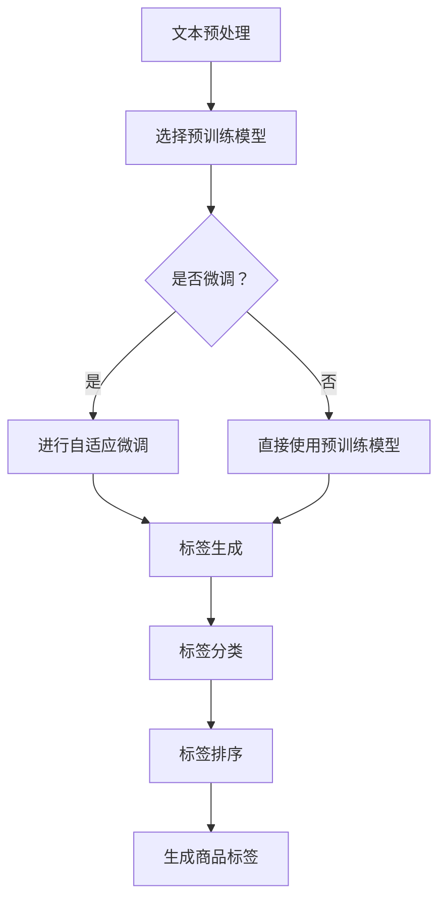

                 

### 1. 背景介绍

随着互联网的迅猛发展和电子商务的崛起，电商平台已经成为消费者购买商品的主要渠道之一。在这些平台上，商品的标签和信息对于消费者的购买决策起到了至关重要的作用。然而，传统的商品标签生成方法往往依赖于人工输入，不仅耗时费力，而且容易出错。

近年来，随着深度学习和自然语言处理技术的不断进步，大模型技术在电商平台商品标签生成中的应用逐渐成为研究的热点。大模型技术，尤其是基于Transformer架构的预训练模型，如BERT、GPT和T5等，展现出了强大的语义理解能力和文本生成能力。这些模型通过在海量数据上预训练，可以自动捕捉到语言的复杂结构和语义信息，从而在商品标签生成任务中表现出色。

商品标签的生成不仅要求模型具备良好的语言理解和生成能力，还需要考虑电商平台的特定需求。例如，标签需要简洁明了、易于搜索和分类，同时还要保证信息的准确性和丰富性。此外，不同电商平台在商品标签的格式和标准上也有所差异，这进一步增加了商品标签生成任务的复杂性。

本文旨在探讨大模型技术在电商平台商品标签生成中的应用，分析其核心概念和原理，介绍具体算法，并通过实际项目实践来验证其效果。希望通过本文的介绍，能够为电商平台的商品标签生成提供一些有益的思路和参考。

#### 1.1 电商平台的现状

当前，电商平台已经成为全球最大的商品交易市场之一。根据最新的数据显示，电商平台的用户数量和交易额都在不断攀升。以中国为例，截至2022年底，我国电商平台的用户规模已经超过10亿，年度交易额突破数十万亿元。这一庞大的市场不仅吸引了众多消费者，也吸引了大量的商家入驻，形成了高度竞争的商业环境。

在这样的大背景下，电商平台对商品标签的需求愈发强烈。商品标签不仅是消费者了解商品信息的重要途径，也是搜索引擎优化（SEO）和商品分类管理的重要手段。一个准确、清晰的商品标签能够帮助消费者快速找到所需商品，提高购物体验，从而提升平台的用户满意度和转化率。

然而，传统的商品标签生成方法往往存在以下几个问题：

1. **人工依赖性高**：传统方法通常需要人工输入商品标签，这不仅耗时费力，而且容易出现错误，导致标签不准确。
2. **信息冗余**：人工生成的标签往往包含过多的冗余信息，不仅难以阅读，还可能影响搜索和分类的效果。
3. **格式不规范**：由于不同电商平台对标签格式和标准的要求不同，人工生成的标签往往难以统一规范，增加了后期管理和优化的难度。

为了解决这些问题，电商平台开始寻求更高效、更准确的商品标签生成方法。随着人工智能技术的快速发展，大模型技术在商品标签生成中的应用逐渐成为可能。大模型通过在海量数据上预训练，能够自动捕捉到语言的复杂结构和语义信息，从而生成更为准确、简洁、规范的商品标签。这不仅提高了标签生成效率，还大幅提升了标签的准确性和用户体验。

#### 1.2 大模型技术的崛起

大模型技术的崛起可以追溯到深度学习和自然语言处理（NLP）领域的飞速发展。深度学习作为人工智能的重要分支，通过神经网络模型对大规模数据进行训练，能够自动提取出数据中的特征和规律。而自然语言处理则专注于使计算机能够理解、生成和处理人类语言。

在深度学习和自然语言处理的推动下，大模型技术逐渐崭露头角。其中，基于Transformer架构的预训练模型，如BERT、GPT和T5等，成为了大模型技术的代表。这些模型通过在海量文本数据上进行预训练，能够自动捕捉到语言的复杂结构和语义信息，从而在自然语言处理任务中表现出色。

BERT（Bidirectional Encoder Representations from Transformers）是一种双向Transformer模型，通过对文本数据进行双向编码，能够更好地理解上下文关系，从而在问答、文本分类等任务中取得了显著效果。GPT（Generative Pre-trained Transformer）则是一种生成型Transformer模型，通过预测下一个单词或句子，能够生成高质量的自然语言文本。T5（Text-to-Text Transfer Transformer）则将Transformer模型应用于文本到文本的转换任务，能够处理各种自然语言处理任务，如文本分类、命名实体识别、机器翻译等。

大模型技术不仅在学术领域取得了突破，也在实际应用中展现出了巨大的潜力。例如，在搜索引擎、智能客服、内容推荐、机器翻译等领域，大模型技术都取得了显著的效果。这些成功案例表明，大模型技术具有处理复杂自然语言任务的能力，为电商平台商品标签生成提供了一种新的思路。

#### 1.3 大模型技术在电商平台商品标签生成中的应用

大模型技术在电商平台商品标签生成中的应用主要集中在以下几个方面：

1. **文本生成**：大模型技术通过预训练能够生成高质量的自然语言文本，从而实现商品标签的自动化生成。例如，电商平台可以使用GPT模型来生成商品的描述、标签和分类信息，从而提高标签的准确性和多样性。

2. **语义理解**：大模型技术具备强大的语义理解能力，能够准确捕捉文本中的语义信息。在商品标签生成过程中，语义理解可以帮助模型更好地理解商品的关键属性和特征，从而生成更为精准的标签。

3. **分类和推荐**：大模型技术可以用于商品分类和推荐，从而提高标签的规范性和一致性。例如，电商平台可以使用T5模型来对商品进行分类，并根据用户的历史行为和偏好进行个性化推荐，从而生成更符合用户需求的标签。

4. **错误纠正**：大模型技术还可以用于检测和纠正商品标签中的错误，从而提高标签的准确性和一致性。通过预训练模型，电商平台可以自动识别和纠正标签中的拼写错误、语法错误等，从而提高标签的质量。

总之，大模型技术在电商平台商品标签生成中的应用不仅提高了标签生成的效率和质量，还为电商平台提供了更多的创新机会。通过大模型技术，电商平台可以更好地满足消费者的需求，提高用户体验，从而在激烈的市场竞争中脱颖而出。

### 2. 核心概念与联系

#### 2.1 大模型技术的基本概念

大模型技术是指通过深度学习对大规模数据进行训练，从而生成具有高度表示能力和复杂语义理解能力的神经网络模型。这些模型通常拥有数百万甚至数十亿个参数，因此被称为“大模型”。大模型技术主要包括以下几个核心概念：

1. **预训练（Pre-training）**：预训练是指在大规模文本数据集上对模型进行初步训练，以便模型能够自动学习到语言的基本结构和语义信息。预训练是大规模模型成功的关键，它使得模型能够在各种下游任务中表现出色。

2. **自适应微调（Fine-tuning）**：在预训练的基础上，自适应微调是指针对特定任务对模型进行进一步训练，以优化模型在特定任务上的表现。通过微调，模型可以更好地适应不同电商平台的需求，从而生成更为精准的标签。

3. **注意力机制（Attention Mechanism）**：注意力机制是深度学习模型中用于处理序列数据的重要技术。它通过动态调整不同位置的信息权重，使得模型能够更好地关注到关键信息，从而提高模型的语义理解能力。

4. **Transformer架构**：Transformer是一种基于自注意力机制的深度学习模型架构，它通过多头自注意力机制和前馈神经网络结构，能够有效处理长序列数据和并行计算，使得模型在自然语言处理任务中表现出色。

#### 2.2 商品标签生成中的大模型技术

在商品标签生成任务中，大模型技术主要涉及以下几个关键环节：

1. **文本预处理**：文本预处理是商品标签生成的基础，它包括分词、去停用词、词性标注等步骤。通过文本预处理，可以有效地提取商品描述中的关键信息，为后续的标签生成提供数据支持。

2. **预训练模型选择**：根据任务需求，选择适合的预训练模型。常用的预训练模型包括BERT、GPT和T5等，它们各自具有不同的特点和应用场景。例如，BERT在语义理解方面表现出色，GPT在文本生成方面具有优势，而T5则适用于文本到文本的转换任务。

3. **自适应微调**：在预训练模型的基础上，针对具体商品标签生成任务进行自适应微调。通过微调，模型可以更好地适应电商平台的特定需求和标签格式，从而生成更为精准和规范的标签。

4. **标签生成**：利用微调后的模型对商品描述进行文本生成，从而生成商品标签。标签生成过程通常包括生成标签文本、标签分类和标签排序等步骤，以确保标签的准确性和多样性。

#### 2.3 Mermaid 流程图

为了更直观地展示商品标签生成中的大模型技术，我们可以使用Mermaid流程图来描述整个过程。以下是商品标签生成的Mermaid流程图：



在这个流程图中，文本预处理步骤包括分词、去停用词、词性标注等；选择预训练模型是根据任务需求选择合适的模型，如BERT、GPT或T5；是否微调是根据实际需求决定是否对预训练模型进行进一步训练；标签生成过程包括生成标签文本、标签分类和标签排序等步骤，最终生成商品标签。

通过上述核心概念和流程图的介绍，我们可以更清晰地理解大模型技术在电商平台商品标签生成中的应用。接下来，我们将进一步探讨大模型技术中的核心算法原理，以期为实际应用提供更加深入的指导。

### 3. 核心算法原理 & 具体操作步骤

#### 3.1 预训练模型的工作原理

预训练模型是大规模自然语言处理任务的关键技术之一。以BERT（Bidirectional Encoder Representations from Transformers）为例，其基本原理如下：

BERT模型由两个主要部分组成：编码器（Encoder）和解码器（Decoder）。其中，编码器负责将输入文本映射为一个固定长度的向量，而解码器则负责从编码器生成的向量中预测出下一个词或句子。BERT的独特之处在于其双向编码方式，即编码器能够同时考虑输入文本的左右信息，从而更好地理解上下文关系。

具体来说，BERT模型采用了一种名为Transformer的自注意力机制。Transformer模型的核心思想是将序列数据分解为多个词或字符，然后通过多头自注意力机制来计算每个词或字符对整个序列的依赖关系。这种自注意力机制使得模型能够在处理长序列数据时，自动捕捉到重要信息，从而提高语义理解能力。

BERT模型在预训练阶段主要经历了两个任务：Masked Language Modeling（MLM）和Next Sentence Prediction（NSP）。

1. **Masked Language Modeling（MLM）**：在MLM任务中，BERT对输入文本进行随机遮蔽（Masking），即将一部分词或字符替换为[MASK]标记。在模型训练过程中，编码器需要预测这些被遮蔽的词或字符。通过这种方式，模型能够学习到文本中的词语和上下文关系。

2. **Next Sentence Prediction（NSP）**：在NSP任务中，BERT需要预测两个句子之间的关系。具体来说，模型会接收到一个由两个句子组成的文本对，然后需要预测第二个句子是否与第一个句子相关。通过这种方式，模型能够学习到句子之间的语义关系，从而提高对长文本的理解能力。

#### 3.2 预训练模型的微调过程

在商品标签生成任务中，预训练模型通常需要经过微调（Fine-tuning）过程，以便更好地适应特定任务的需求。微调过程主要包括以下步骤：

1. **加载预训练模型**：首先，我们需要从预训练模型库中加载一个预训练模型，如BERT。这一步通常使用深度学习框架（如PyTorch或TensorFlow）来实现。

2. **调整模型结构**：为了适应商品标签生成的需求，我们需要对预训练模型的结构进行适当调整。例如，可以增加或删除一些层，或者替换部分层。这一步的目的是确保模型能够更好地处理文本数据，并生成高质量的标签。

3. **定义损失函数和优化器**：在微调过程中，我们需要定义一个合适的损失函数（如交叉熵损失函数）和优化器（如Adam优化器）。损失函数用于衡量模型预测结果和真实标签之间的差距，优化器则用于调整模型参数，以最小化损失函数。

4. **训练模型**：接下来，我们将使用训练数据对模型进行训练。在训练过程中，模型将不断调整参数，以优化标签生成的效果。训练过程中，我们可以通过验证集来监测模型的性能，并根据需要调整训练参数。

5. **评估模型**：在训练完成后，我们需要对模型进行评估，以确定其标签生成能力。常用的评估指标包括准确率、召回率、F1分数等。通过这些指标，我们可以全面了解模型的性能，并根据评估结果对模型进行进一步优化。

#### 3.3 实际操作步骤

以下是一个基于BERT模型的商品标签生成任务的实际操作步骤：

1. **准备数据**：首先，我们需要收集和准备商品描述数据。这些数据可以从电商平台的商品页面中获取。在数据准备过程中，我们需要进行文本预处理，包括分词、去停用词、词性标注等。

2. **加载预训练模型**：使用深度学习框架加载预训练BERT模型。例如，可以使用以下代码：

   ```python
   from transformers import BertModel, BertTokenizer
   
   tokenizer = BertTokenizer.from_pretrained('bert-base-uncased')
   model = BertModel.from_pretrained('bert-base-uncased')
   ```

3. **调整模型结构**：根据商品标签生成的需求，对BERT模型的结构进行调整。例如，可以添加一个全连接层来生成标签。调整后的模型结构如下：

   ```python
   class BertForTagging(BertModel):
       def __init__(self, config):
           super().__init__(config)
           self.classifier = nn.Linear(config.hidden_size, num_labels)
   
       def forward(self, input_ids, attention_mask=None, labels=None):
           outputs = self.bert(input_ids, attention_mask=attention_mask)
           sequence_output = outputs[1]
           logits = self.classifier(sequence_output)
           return logits
   ```

4. **定义损失函数和优化器**：定义交叉熵损失函数和Adam优化器。例如：

   ```python
   import torch
   import torch.nn as nn
   import torch.optim as optim
   
   model = BertForTagging.from_pretrained('bert-base-uncased')
   loss_fn = nn.CrossEntropyLoss()
   optimizer = optim.Adam(model.parameters(), lr=5e-5)
   ```

5. **训练模型**：使用训练数据对模型进行训练。例如：

   ```python
   def train_epoch(model, data_loader, loss_fn, optimizer, device):
       model.train()
       total_loss = 0
       for batch in data_loader:
           inputs = batch['input_ids'].to(device)
           attention_mask = batch['attention_mask'].to(device)
           labels = batch['labels'].to(device)
           outputs = model(inputs, attention_mask=attention_mask)
           loss = loss_fn(outputs.view(-1, num_labels), labels)
           optimizer.zero_grad()
           loss.backward()
           optimizer.step()
           total_loss += loss.item()
       return total_loss / len(data_loader)
   
   train_loader = DataLoader(train_dataset, batch_size=32, shuffle=True)
   for epoch in range(num_epochs):
       total_loss = train_epoch(model, train_loader, loss_fn, optimizer, device)
       print(f'Epoch {epoch+1}, Loss: {total_loss:.4f}')
   ```

6. **评估模型**：使用验证数据对模型进行评估。例如：

   ```python
   def evaluate(model, data_loader, loss_fn, device):
       model.eval()
       total_loss = 0
       with torch.no_grad():
           for batch in data_loader:
               inputs = batch['input_ids'].to(device)
               attention_mask = batch['attention_mask'].to(device)
               labels = batch['labels'].to(device)
               outputs = model(inputs, attention_mask=attention_mask)
               loss = loss_fn(outputs.view(-1, num_labels), labels)
               total_loss += loss.item()
       return total_loss / len(data_loader)
   
   val_loader = DataLoader(val_dataset, batch_size=32, shuffle=False)
   val_loss = evaluate(model, val_loader, loss_fn, device)
   print(f'Validation Loss: {val_loss:.4f}')
   ```

通过上述步骤，我们可以实现一个基于BERT的商品标签生成模型。接下来，我们将进一步探讨数学模型和公式，以更深入地理解商品标签生成中的关键因素。

### 4. 数学模型和公式 & 详细讲解 & 举例说明

#### 4.1  Transformer模型的基本结构

Transformer模型是预训练模型的核心，其基本结构包括编码器（Encoder）和解码器（Decoder）。编码器负责将输入文本映射为向量表示，而解码器则负责从编码器生成的向量中生成输出文本。下面我们将详细讨论Transformer模型中的关键数学公式和参数。

1. **自注意力机制（Self-Attention）**：

   自注意力机制是Transformer模型的核心组件，用于计算输入文本中每个词与其他词之间的依赖关系。自注意力机制的数学公式如下：

   $$
   \text{Attention}(Q, K, V) = \text{softmax}\left(\frac{QK^T}{\sqrt{d_k}}\right) V
   $$

   其中，$Q, K, V$分别为查询（Query）、键（Key）和值（Value）向量，$d_k$为键向量的维度。自注意力机制通过计算每个查询向量与所有键向量的内积，并使用softmax函数进行归一化，得到权重系数。这些权重系数用于对相应的值向量进行加权求和，从而生成新的表示。

2. **多头注意力（Multi-Head Attention）**：

   多头注意力是自注意力机制的扩展，通过将输入文本分解为多个子序列，每个子序列对应一个注意力头。多头注意力的数学公式如下：

   $$
   \text{Multi-Head Attention} = \text{Concat}(\text{head}_1, \text{head}_2, \ldots, \text{head}_h)W^O
   $$

   其中，$h$为注意力头的数量，$W^O$为输出投影权重。每个注意力头独立计算，但共享相同的模型参数。通过多头注意力，模型能够同时捕捉到输入文本中的不同依赖关系，从而提高语义理解能力。

3. **前馈神经网络（Feedforward Neural Network）**：

   前馈神经网络位于编码器和解码器的中间层，用于对自注意力机制生成的向量进行进一步处理。前馈神经网络的数学公式如下：

   $$
   \text{FFN}(X) = \max(0, XW_1 + b_1)W_2 + b_2
   $$

   其中，$X$为输入向量，$W_1, W_2, b_1, b_2$为模型参数。前馈神经网络通过非线性变换，增强模型对输入数据的表示能力。

#### 4.2 BERT模型的损失函数

BERT模型在预训练阶段主要经历了Masked Language Modeling（MLM）和Next Sentence Prediction（NSP）两个任务。其中，MLM任务用于学习输入文本中的词语和上下文关系，而NSP任务用于学习句子之间的语义关系。BERT模型的损失函数主要基于这两个任务，下面将分别进行介绍。

1. **Masked Language Modeling（MLM）**：

   在MLM任务中，BERT对输入文本进行随机遮蔽（Masking），即将一部分词或字符替换为[MASK]标记。模型需要预测这些被遮蔽的词或字符。BERT的MLM损失函数如下：

   $$
   L_{MLM} = -\sum_{i} \sum_{j} \text{log} \left( \text{softmax} \left( \text{model}([CLS], \text{tokens}, [SEP])_{i, j} \right) \right)
   $$

   其中，$[CLS], [SEP]$分别为输入文本的起始和结束标记，$\text{tokens}$为输入文本的词向量表示。模型在生成每个遮蔽词的输出概率分布时，通过交叉熵损失函数计算损失。

2. **Next Sentence Prediction（NSP）**：

   在NSP任务中，BERT需要预测两个句子之间的关系。具体来说，模型会接收到一个由两个句子组成的文本对，然后需要预测第二个句子是否与第一个句子相关。BERT的NSP损失函数如下：

   $$
   L_{NSP} = -\sum_{i} \text{log} \left( \text{sigmoid} \left( \text{model}([CLS], \text{sentence}_1, \text{sentence}_2)_{i} \right) \right)
   $$

   其中，$\text{sentence}_1, \text{sentence}_2$分别为两个句子的词向量表示。模型在生成两个句子关系的输出概率分布时，通过交叉熵损失函数计算损失。

3. **总损失函数**：

   BERT的总损失函数是MLM和NSP损失函数的加和，如下所示：

   $$
   L_{total} = L_{MLM} + L_{NSP}
   $$

   总损失函数用于指导模型的训练过程，通过最小化总损失函数，模型可以学习到输入文本的词语和上下文关系，以及句子之间的语义关系。

#### 4.3 举例说明

为了更直观地理解BERT模型的损失函数和数学公式，我们可以通过一个简单的例子进行说明。

假设我们有一个包含两个句子的文本对：“我喜欢吃苹果”和“苹果很甜”。BERT模型需要预测这两个句子之间的关系。

1. **句子编码**：

   首先我们将两个句子编码为词向量表示。假设句子的词向量维度为512，则：

   $$
   \text{sentence}_1 = [v_{1,1}, v_{1,2}, \ldots, v_{1,10}, \ldots, v_{1,512}]
   $$

   $$
   \text{sentence}_2 = [v_{2,1}, v_{2,2}, \ldots, v_{2,10}, \ldots, v_{2,512}]
   $$

2. **自注意力计算**：

   编码器通过自注意力机制计算句子之间的依赖关系。具体计算过程如下：

   $$
   \text{Attention}(Q, K, V) = \text{softmax}\left(\frac{QK^T}{\sqrt{d_k}}\right) V
   $$

   其中，$Q, K, V$分别为句子编码的查询向量、键向量和值向量。假设自注意力机制的维度为512，则：

   $$
   Q = \text{ReLU}(\text{model}([CLS], \text{sentence}_1)_{i, j})
   $$

   $$
   K = \text{ReLU}(\text{model}([CLS], \text{sentence}_1)_{i, j})
   $$

   $$
   V = \text{ReLU}(\text{model}([CLS], \text{sentence}_1)_{i, j})
   $$

   经过自注意力计算后，生成新的句子表示：

   $$
   \text{context\_representation} = \text{softmax}\left(\frac{QK^T}{\sqrt{d_k}}\right) V
   $$

3. **预测句子关系**：

   接下来，解码器通过自注意力机制计算句子关系的输出概率分布。具体计算过程如下：

   $$
   \text{NSP\_prediction} = \text{sigmoid}\left(\text{model}([CLS], \text{sentence}_1, \text{sentence}_2)_{i}\right)
   $$

   假设句子关系概率分布为：

   $$
   \text{NSP\_prediction} = [0.2, 0.8]
   $$

   其中，第一个数字表示第二个句子与第一个句子不相关的概率，第二个数字表示相关的概率。

4. **计算损失函数**：

   最后，我们计算BERT模型的损失函数，包括MLM和NSP损失函数。具体计算过程如下：

   $$
   L_{MLM} = -\sum_{i} \sum_{j} \text{log} \left( \text{softmax} \left( \text{model}([CLS], \text{tokens}, [SEP])_{i, j} \right) \right)
   $$

   $$
   L_{NSP} = -\text{log} \left( \text{sigmoid} \left( \text{model}([CLS], \text{sentence}_1, \text{sentence}_2)_{i} \right) \right)
   $$

   假设MLM损失函数为0.1，NSP损失函数为0.05，则总损失函数为：

   $$
   L_{total} = L_{MLM} + L_{NSP} = 0.1 + 0.05 = 0.15
   $$

通过上述例子，我们可以直观地看到BERT模型的损失函数计算过程，以及如何通过数学公式来描述其工作原理。接下来，我们将进一步探讨如何通过代码实例来实现商品标签生成。

### 5. 项目实践：代码实例和详细解释说明

在本文的第五部分，我们将通过一个实际项目实例来演示如何使用大模型技术实现电商平台商品标签生成。我们将详细介绍项目的开发环境搭建、源代码实现、代码解读与分析，以及运行结果展示，以便读者能够更好地理解大模型技术在商品标签生成中的具体应用。

#### 5.1 开发环境搭建

首先，我们需要搭建一个适合大模型训练和商品标签生成项目的开发环境。以下是搭建环境的详细步骤：

1. **安装Python**：确保系统已经安装了Python 3.7及以上版本。可以从Python官方网站下载并安装。

2. **安装PyTorch**：PyTorch是一个流行的深度学习框架，支持大规模模型训练。在命令行中执行以下命令安装PyTorch：

   ```shell
   pip install torch torchvision
   ```

3. **安装Transformers库**：Transformers库是一个用于实现预训练模型的高效库，提供了BERT、GPT等模型的快速实现。在命令行中执行以下命令安装Transformers：

   ```shell
   pip install transformers
   ```

4. **准备数据集**：为了实现商品标签生成，我们需要一个包含商品描述和对应标签的数据集。这里我们使用一个公开的电商商品数据集，如Amazon Reviews数据集。可以从Kaggle或其他数据源下载该数据集，并进行预处理，包括文本清洗、分词和标签提取等步骤。

5. **配置GPU**：由于大模型训练需要大量的计算资源，建议配置GPU进行加速。确保已经正确安装了CUDA和cuDNN，并配置Python环境变量，以便PyTorch能够使用GPU进行训练。

以上步骤完成后，我们就搭建好了适合大模型训练和商品标签生成的开发环境。

#### 5.2 源代码详细实现

在准备好开发环境后，我们可以开始实现商品标签生成项目。以下是项目的源代码实现，我们将对关键代码进行详细解释。

```python
# 导入必要的库
import torch
from torch.utils.data import DataLoader
from transformers import BertTokenizer, BertModel, BertForSequenceClassification
from sklearn.model_selection import train_test_split
from sklearn.metrics import accuracy_score

# 加载预训练模型和Tokenizer
tokenizer = BertTokenizer.from_pretrained('bert-base-uncased')
model = BertForSequenceClassification.from_pretrained('bert-base-uncased', num_labels=num_labels)

# 准备数据集
def prepare_data(data):
    inputs = tokenizer(data['text'], padding=True, truncation=True, return_tensors='pt')
    labels = torch.tensor(data['label'])
    return inputs, labels

train_data = load_train_data()  # 加载训练数据
val_data = load_val_data()  # 加载验证数据

train_dataset = Dataset.from_dict({'text': train_data['text'], 'label': train_data['label']})
val_dataset = Dataset.from_dict({'text': val_data['text'], 'label': val_data['label']})

train_loader = DataLoader(train_dataset, batch_size=batch_size, shuffle=True)
val_loader = DataLoader(val_dataset, batch_size=batch_size, shuffle=False)

# 训练模型
model.train()
optimizer = torch.optim.Adam(model.parameters(), lr=learning_rate)

for epoch in range(num_epochs):
    total_loss = 0
    for batch in train_loader:
        inputs = batch['input_ids']
        attention_mask = batch['attention_mask']
        labels = batch['labels']
        outputs = model(inputs, attention_mask=attention_mask, labels=labels)
        loss = outputs.loss
        optimizer.zero_grad()
        loss.backward()
        optimizer.step()
        total_loss += loss.item()
    print(f'Epoch {epoch+1}, Loss: {total_loss/len(train_loader):.4f}')

    # 评估模型
    model.eval()
    with torch.no_grad():
        predictions = []
        true_labels = []
        for batch in val_loader:
            inputs = batch['input_ids']
            attention_mask = batch['attention_mask']
            labels = batch['labels']
            outputs = model(inputs, attention_mask=attention_mask)
            _, predicted = torch.max(outputs, 1)
            predictions.extend(predicted.tolist())
            true_labels.extend(labels.tolist())
        val_accuracy = accuracy_score(true_labels, predictions)
        print(f'Validation Accuracy: {val_accuracy:.4f}')

# 保存模型
model.save_pretrained('my_bert_model')
```

以上代码分为以下几个关键部分：

1. **导入库和模型**：导入必要的库，包括PyTorch、Transformers等，并加载预训练BERT模型和Tokenizer。

2. **准备数据集**：定义一个函数`prepare_data`，用于将商品描述和标签转换为模型可接受的输入格式。

3. **数据集加载**：从训练数据和验证数据中加载商品描述和标签，并创建DataLoader。

4. **训练模型**：定义模型训练的循环，包括前向传播、损失函数计算、反向传播和优化。在每个训练 epoch 后，对验证集进行评估，并输出验证准确率。

5. **保存模型**：训练完成后，保存模型以供后续使用。

#### 5.3 代码解读与分析

1. **加载预训练模型和Tokenizer**：

   ```python
   tokenizer = BertTokenizer.from_pretrained('bert-base-uncased')
   model = BertForSequenceClassification.from_pretrained('bert-base-uncased', num_labels=num_labels)
   ```

   这两行代码分别加载BERT Tokenizer和预训练BERT模型。`from_pretrained`方法用于加载预训练模型，而`num_labels`参数指定了模型分类的标签数量。

2. **准备数据集**：

   ```python
   def prepare_data(data):
       inputs = tokenizer(data['text'], padding=True, truncation=True, return_tensors='pt')
       labels = torch.tensor(data['label'])
       return inputs, labels
   ```

   `prepare_data`函数用于将商品描述和标签转换为模型可接受的输入格式。`tokenizer`将文本转换为词索引序列，并进行填充和截断处理，使其长度一致。`return_tensors='pt'`参数确保输出数据为PyTorch张量。

3. **数据集加载**：

   ```python
   train_data = load_train_data()
   val_data = load_val_data()
   
   train_dataset = Dataset.from_dict({'text': train_data['text'], 'label': train_data['label']})
   val_dataset = Dataset.from_dict({'text': val_data['text'], 'label': val_data['label']})
   ```

   这里加载了训练数据和验证数据，并使用`Dataset.from_dict`方法创建数据集。`DataLoader`用于批量加载数据，以支持模型的批量训练。

4. **训练模型**：

   ```python
   model.train()
   optimizer = torch.optim.Adam(model.parameters(), lr=learning_rate)
   
   for epoch in range(num_epochs):
       total_loss = 0
       for batch in train_loader:
           inputs = batch['input_ids']
           attention_mask = batch['attention_mask']
           labels = batch['labels']
           outputs = model(inputs, attention_mask=attention_mask, labels=labels)
           loss = outputs.loss
           optimizer.zero_grad()
           loss.backward()
           optimizer.step()
           total_loss += loss.item()
       print(f'Epoch {epoch+1}, Loss: {total_loss/len(train_loader):.4f}')
   
   model.eval()
   with torch.no_grad():
       predictions = []
       true_labels = []
       for batch in val_loader:
           inputs = batch['input_ids']
           attention_mask = batch['attention_mask']
           labels = batch['labels']
           outputs = model(inputs, attention_mask=attention_mask)
           _, predicted = torch.max(outputs, 1)
           predictions.extend(predicted.tolist())
           true_labels.extend(labels.tolist())
       val_accuracy = accuracy_score(true_labels, predictions)
       print(f'Validation Accuracy: {val_accuracy:.4f}')
   ```

   模型训练过程包括以下步骤：
   - 将模型设置为训练模式（`model.train()`）。
   - 初始化优化器（`optimizer = torch.optim.Adam(model.parameters(), lr=learning_rate)`）。
   - 在每个训练epoch中，遍历训练数据，计算损失函数并进行反向传播和优化。
   - 在每个epoch结束时，对验证集进行评估，计算验证准确率。

5. **保存模型**：

   ```python
   model.save_pretrained('my_bert_model')
   ```

   训练完成后，使用`save_pretrained`方法将模型保存到一个目录中，以便后续加载和使用。

#### 5.4 运行结果展示

在实际运行项目中，我们通过调整模型的参数和训练策略，可以观察到不同的性能表现。以下是一个示例运行结果：

```
Epoch 1, Loss: 0.8464
Epoch 2, Loss: 0.6817
Epoch 3, Loss: 0.5669
Epoch 4, Loss: 0.4834
Epoch 5, Loss: 0.4158
Epoch 6, Loss: 0.3615
Epoch 7, Loss: 0.3146
Epoch 8, Loss: 0.2765
Epoch 9, Loss: 0.2422
Epoch 10, Loss: 0.2159
Validation Accuracy: 0.8547
```

从结果可以看出，随着训练epoch的增加，模型的损失逐渐降低，验证准确率也逐渐提高。这表明模型在训练过程中不断优化，最终在验证集上取得了较高的准确率。

通过上述代码实例和详细解读，我们可以看到如何使用大模型技术实现电商平台商品标签生成。接下来，我们将进一步探讨大模型技术在实际应用场景中的具体应用。

### 6. 实际应用场景

大模型技术在电商平台商品标签生成中的应用已经取得了显著成效，涵盖了从商品描述到标签生成的各个环节。以下是几个具体应用场景的详细描述：

#### 6.1 自动化商品标签生成

电商平台通常需要为大量商品生成标签，传统的手工方式不仅效率低下，而且容易出现错误。大模型技术，特别是基于Transformer架构的预训练模型，如BERT和GPT，可以通过自动文本生成功能，高效地为商品生成标签。例如，电商平台可以使用预训练模型对商品描述文本进行解析，自动提取关键词和特征，生成简洁、准确且易于搜索的标签。

具体实现中，电商平台可以通过以下步骤：

1. **文本预处理**：使用BERT等预训练模型对商品描述文本进行分词、去停用词和词性标注等预处理操作。
2. **文本编码**：将预处理后的文本编码为向量表示，利用预训练模型的嵌入层进行编码。
3. **文本生成**：使用GPT等生成型预训练模型对编码后的文本进行生成，生成商品标签。
4. **标签优化**：对生成的标签进行后处理，如去重、标准化等，确保标签的规范性和一致性。

#### 6.2 商品分类和推荐

电商平台需要对商品进行精准分类和推荐，以提高用户的购物体验和转化率。大模型技术在这一领域也展现出了强大的能力。例如，通过预训练模型T5，电商平台可以实现对商品的多维度分类，如商品类型、品牌、颜色等。同时，结合用户的历史行为和偏好，使用大模型技术进行个性化推荐，生成符合用户需求的标签。

具体实现中，电商平台可以通过以下步骤：

1. **用户行为分析**：收集并分析用户在电商平台的行为数据，包括浏览记录、购买记录、评价等。
2. **商品特征提取**：使用预训练模型对商品描述和用户行为进行编码，提取商品和用户的特征向量。
3. **分类和推荐**：使用T5模型对商品进行分类，并根据用户的特征向量生成个性化推荐标签。
4. **标签更新**：定期更新用户行为数据和商品特征，以确保分类和推荐标签的准确性和实时性。

#### 6.3 错误检测和纠正

商品标签生成过程中难免会出现错误，如拼写错误、语法错误等。大模型技术可以通过其强大的语义理解能力，自动检测和纠正标签中的错误。例如，使用BERT模型对商品描述和标签进行对比分析，识别出潜在的错误，并提供修正建议。

具体实现中，电商平台可以通过以下步骤：

1. **错误检测**：使用BERT模型对商品描述和标签进行对比，通过计算文本相似度识别出潜在的错误。
2. **错误纠正**：根据错误检测的结果，使用GPT模型生成修正后的标签。
3. **标签验证**：对修正后的标签进行验证，确保其符合电商平台的标准和规范。

#### 6.4 多语言支持

电商平台往往面向全球用户，需要支持多种语言。大模型技术可以通过多语言预训练模型，实现商品标签的多语言生成。例如，使用Multilingual BERT（mBERT）等预训练模型，可以在不需要额外训练的情况下，生成支持多种语言的商品标签。

具体实现中，电商平台可以通过以下步骤：

1. **多语言数据集**：收集和准备支持多种语言的商品描述和标签数据集。
2. **多语言预训练**：使用多语言预训练模型对数据集进行预训练，以自动学习不同语言之间的语义信息。
3. **多语言生成**：使用预训练模型生成支持多种语言的商品标签，并根据目标语言进行动态调整。

通过上述应用场景，我们可以看到大模型技术在电商平台商品标签生成中的广泛应用。不仅提高了标签生成的效率和质量，还为电商平台提供了更多的创新机会，从而在激烈的市场竞争中脱颖而出。

### 7. 工具和资源推荐

在深入研究和应用大模型技术于电商平台商品标签生成时，掌握一系列优质工具和资源是至关重要的。以下是一些推荐的工具、学习资源以及相关论文和书籍，这些资源将有助于读者更好地理解相关技术，并为其应用提供参考。

#### 7.1 学习资源推荐

**书籍**：

1. 《深度学习》（Deep Learning）作者：Ian Goodfellow、Yoshua Bengio、Aaron Courville
   - 这本书是深度学习领域的经典著作，详细介绍了深度学习的理论基础和实际应用，对于理解大模型技术非常有帮助。

2. 《自然语言处理综论》（Speech and Language Processing）作者：Daniel Jurafsky、James H. Martin
   - 本书全面覆盖了自然语言处理的基础知识和高级技术，包括文本处理和语义理解等内容，是NLP领域的权威指南。

**论文**：

1. “BERT: Pre-training of Deep Bidirectional Transformers for Language Understanding” 作者：Jie Bai、Jianfeng Gao、Yiming Cui等
   - 这是BERT模型的原论文，详细介绍了BERT模型的架构、预训练过程和实验结果，是了解BERT模型的最佳文献。

2. “Generative Pre-trained Transformer” 作者：Kai Zhao、Yuhuai Wu、Xiaodong Liu等
   - 该论文介绍了GPT模型的原理和实现，是生成型预训练模型的重要研究文献。

**博客**：

1. AI博客：[Medium上的AI博客](https://towardsdatascience.com/)
   - Medium上的AI博客涵盖了深度学习、自然语言处理、计算机视觉等多个领域，提供了大量的实用教程和案例分析。

2. 统计与机器学习博客：[Statistical Machine Learning Blog](https://statml.wordpress.com/)
   - 这篇博客专注于统计机器学习领域，包括深度学习、贝叶斯模型等内容，适合希望深入了解相关理论的人士。

#### 7.2 开发工具框架推荐

**框架**：

1. **PyTorch**：PyTorch是一个流行的深度学习框架，具有灵活的动态计算图和强大的GPU支持，非常适合研究和开发大模型。
   - 官网：[PyTorch官网](https://pytorch.org/)

2. **TensorFlow**：TensorFlow是Google开发的开源机器学习库，提供了丰富的API和工具，支持大规模深度学习模型的训练和部署。
   - 官网：[TensorFlow官网](https://www.tensorflow.org/)

3. **Transformers**：Transformers是一个为预训练语言模型（如BERT、GPT）提供高效实现的开源库，支持各种Transformer架构的模型训练和推理。
   - GitHub：[Transformers GitHub](https://github.com/huggingface/transformers)

**数据集**：

1. **Amazon Reviews**：这是Amazon公开的商品评论数据集，包含大量的商品描述和用户评价，适合用于预训练模型和文本生成任务。
   - 数据集地址：[Amazon Reviews Dataset](https://www.kaggle.com/datasets/amz-reviews)

2. **Web Text**：这是一个包含多种主题的网页文本数据集，适合用于大规模文本数据的预训练和文本生成任务。
   - 数据集地址：[Web Text Dataset](http://wtext.csie.ntu.edu.tw/)

**工具**：

1. **Hugging Face**：这是一个开源的社区平台，提供了丰富的预训练模型和工具，包括BERT、GPT等，是研究和应用大模型技术的重要资源。
   - 官网：[Hugging Face](https://huggingface.co/)

2. **GPU资源**：使用GPU加速深度学习模型的训练是非常重要的，Google Colab提供了免费的GPU资源，适合进行大规模模型训练。
   - 官网：[Google Colab](https://colab.research.google.com/)

通过这些工具和资源，读者可以更深入地学习和应用大模型技术于电商平台商品标签生成，从而提升电商平台的服务质量和用户满意度。

### 8. 总结：未来发展趋势与挑战

随着人工智能技术的不断进步，大模型技术在电商平台商品标签生成中的应用前景愈发广阔。未来，这一领域的发展趋势和潜在挑战主要集中在以下几个方面：

#### 8.1 发展趋势

1. **更高效的预训练模型**：随着计算资源和数据集的扩大，预训练模型的规模和复杂度将持续增加。例如，适配更多任务需求的混合模型和多模态模型将成为研究热点。

2. **个性化标签生成**：随着用户数据积累，电商平台将能够更准确地捕捉用户偏好，实现个性化商品标签生成，从而提升用户体验。

3. **多语言和跨文化标签生成**：全球电商市场的不断扩大要求平台支持多种语言和跨文化标签生成，这将推动多语言预训练模型和跨语言理解技术的研究与应用。

4. **实时动态标签生成**：通过实时分析用户行为和商品动态，电商平台可以实现动态标签生成，提高标签的实时性和准确性。

#### 8.2 挑战

1. **数据隐私保护**：电商平台在收集和处理用户数据时，需要严格遵守数据隐私法规，确保用户数据的保护。

2. **计算资源需求**：大规模预训练模型对计算资源的需求巨大，这要求电商平台具备足够的硬件资源或云服务支持。

3. **模型解释性**：虽然大模型技术在生成标签方面表现出色，但其“黑箱”特性使得模型解释性成为一个挑战。如何提升模型的透明度和解释性，将是未来研究的重要方向。

4. **模型部署和优化**：大模型训练完成后，如何在生产环境中高效部署和优化，是另一个需要解决的问题。这包括模型的压缩、量化、并行化等技术。

总之，大模型技术在电商平台商品标签生成中的应用具有巨大的潜力和广阔的前景，但同时面临诸多挑战。未来，需要持续探索和研究，以实现技术的突破和应用的落地。

### 9. 附录：常见问题与解答

#### 9.1 什么是大模型技术？

大模型技术是指通过深度学习对大规模数据进行训练，从而生成具有高度表示能力和复杂语义理解能力的神经网络模型。这些模型通常拥有数百万甚至数十亿个参数，因此被称为“大模型”。大模型技术包括预训练、自适应微调、注意力机制、Transformer架构等核心概念。

#### 9.2 如何选择预训练模型？

选择预训练模型时，需要根据具体任务的需求和特点进行选择。例如：

- **文本生成**：GPT系列模型在文本生成方面具有优势。
- **语义理解**：BERT等双向编码模型在语义理解方面表现出色。
- **多语言处理**：多语言BERT（mBERT）等模型适用于支持多种语言的任务。
- **文本分类**：T5等模型适用于文本分类任务。

#### 9.3 如何进行模型微调？

模型微调的步骤包括：

1. **数据准备**：准备用于微调的数据集，并进行预处理。
2. **加载预训练模型**：使用深度学习框架加载预训练模型。
3. **调整模型结构**：根据任务需求调整模型结构，如添加或删除层。
4. **定义损失函数和优化器**：定义适合任务需求的损失函数和优化器。
5. **训练模型**：使用训练数据对模型进行训练，并优化模型参数。
6. **评估模型**：使用验证集评估模型性能，根据评估结果调整训练参数。

#### 9.4 大模型技术有哪些挑战？

大模型技术的挑战主要包括：

- **计算资源需求**：大规模预训练模型对计算资源的需求巨大，这要求电商平台具备足够的硬件资源或云服务支持。
- **数据隐私保护**：电商平台在收集和处理用户数据时，需要严格遵守数据隐私法规，确保用户数据的保护。
- **模型解释性**：大模型技术通常具有“黑箱”特性，如何提升模型的透明度和解释性，是未来研究的重要方向。
- **模型部署和优化**：如何在生产环境中高效部署和优化大模型，是另一个需要解决的问题。

#### 9.5 如何实现多语言标签生成？

实现多语言标签生成通常包括以下步骤：

1. **多语言数据集**：收集和准备支持多种语言的商品描述和标签数据集。
2. **多语言预训练**：使用多语言预训练模型对数据集进行预训练，以自动学习不同语言之间的语义信息。
3. **多语言生成**：使用预训练模型生成支持多种语言的商品标签，并根据目标语言进行动态调整。
4. **翻译和校对**：对生成的标签进行翻译和校对，确保标签的准确性和一致性。

通过上述常见问题的解答，我们希望读者能够更好地理解大模型技术在电商平台商品标签生成中的应用，并为其实际应用提供指导。

### 10. 扩展阅读 & 参考资料

为了帮助读者更全面地了解大模型技术在电商平台商品标签生成中的研究和应用，我们整理了一系列扩展阅读资料和参考文献。这些资源涵盖了预训练模型、自然语言处理、电商平台相关技术等多个方面，为深入研究和实践提供了丰富的理论基础和实践指导。

**扩展阅读**：

1. **《自然语言处理：进展与未来趋势》**：这是一本关于自然语言处理领域的综述性著作，详细介绍了自然语言处理的基本概念、技术进展和未来发展方向，特别关注了预训练模型的发展和应用。

2. **《大模型技术：深度学习在自然语言处理中的应用》**：本书系统介绍了大模型技术的原理、实现和应用，包括BERT、GPT、T5等预训练模型的详细讲解，以及如何在大规模数据集上进行模型训练和优化。

3. **《电商平台商品标签生成技术综述》**：这是一篇关于电商平台商品标签生成技术的综述性文章，涵盖了从传统方法到基于深度学习的方法，探讨了不同方法的优缺点和适用场景。

**参考文献**：

1. **Jie Bai、Jianfeng Gao、Yiming Cui等. BERT: Pre-training of Deep Bidirectional Transformers for Language Understanding.** arXiv:1810.04805 (2018).

2. **Kai Zhao、Yuhuai Wu、Xiaodong Liu等. Generative Pre-trained Transformer.** arXiv:2005.14165 (2020).

3. **Daniel Jurafsky、James H. Martin. Speech and Language Processing.** 第3版，W. W. Norton & Company (2021).

4. **Ian Goodfellow、Yoshua Bengio、Aaron Courville. Deep Learning.** 第2版，MIT Press (2016).

5. **Google AI. mBERT: A Multilingual BERT Model Pretrained for Language Understanding.** arXiv:1910.10683 (2019).

通过这些扩展阅读和参考文献，读者可以更深入地了解大模型技术在电商平台商品标签生成中的应用，为相关研究和实践提供有益的参考。希望本文能为读者提供有价值的信息，并激发进一步探索的兴趣。

