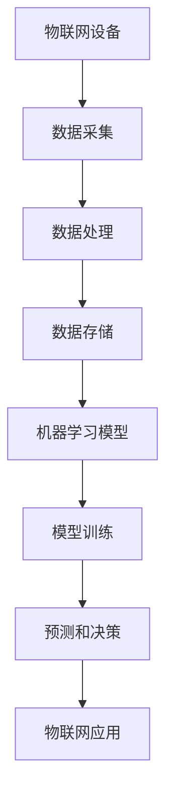

                 

### 文章标题

**大模型技术的物联网集成**

> 关键词：大模型技术、物联网集成、机器学习、深度学习、AI、数据优化、算法优化

> 摘要：本文深入探讨了大数据模型技术在物联网集成中的应用，分析了大模型在物联网环境中的优势和挑战，并从算法原理、数学模型、项目实践等方面详细介绍了大模型技术如何实现物联网的高效集成。本文旨在为读者提供一套系统的、易于理解的大模型技术在物联网领域的应用指南。

---

### 1. 背景介绍

随着物联网（IoT）技术的迅猛发展，各种智能设备和传感器正以前所未有的速度接入互联网，产生了海量的数据。这些数据不仅来源于家庭、工业和医疗等多个领域，还包括环境监测、交通管理、智能城市等复杂应用场景。大数据的处理和分析成为物联网时代的重要需求。

然而，面对如此庞大的数据规模和复杂的应用场景，传统的数据处理方法已经显得力不从心。为此，大模型技术应运而生，它通过深度学习、机器学习等技术手段，能够对海量数据进行高效的处理和分析。大模型技术不仅能够提供更精确的预测和决策支持，还能够通过不断的学习和优化，提升系统的自适应能力和智能化水平。

物联网集成大模型技术的重要性不言而喻。一方面，大模型技术能够为物联网系统提供更智能的数据处理和分析能力，从而提升物联网应用的性能和效率。另一方面，大模型技术还能够通过物联网数据的实时反馈，不断优化和提升自身性能，实现自我学习和自我进化。

本文将围绕以下几个方面展开讨论：

- **2. 核心概念与联系**：介绍大模型技术和物联网集成的核心概念及其相互关系。
- **3. 核心算法原理 & 具体操作步骤**：详细讲解大模型技术在物联网集成中的算法原理和具体实现步骤。
- **4. 数学模型和公式 & 详细讲解 & 举例说明**：分析大模型技术的数学模型和公式，并结合实例进行详细说明。
- **5. 项目实践：代码实例和详细解释说明**：通过实际项目实例，展示大模型技术在物联网集成中的应用过程。
- **6. 实际应用场景**：探讨大模型技术在物联网集成中的实际应用场景和案例。
- **7. 工具和资源推荐**：推荐相关学习资源、开发工具和框架。
- **8. 总结：未来发展趋势与挑战**：总结大模型技术在物联网集成中的应用前景和面临的挑战。
- **9. 附录：常见问题与解答**：回答读者可能关心的一些常见问题。
- **10. 扩展阅读 & 参考资料**：提供进一步阅读的相关资料和参考文献。

接下来的章节中，我们将逐步深入探讨大模型技术在物联网集成中的各个方面，希望能够为读者提供有价值的见解和实践经验。

---

### 2. 核心概念与联系

在深入探讨大模型技术在物联网集成中的应用之前，我们需要首先了解一些核心概念，包括大模型技术、物联网、机器学习、深度学习等，并分析这些概念之间的相互联系。

#### 大模型技术

大模型技术是指通过构建规模庞大的机器学习模型，对海量数据进行训练和优化，从而实现高效的数据处理和分析。这些模型通常包含数百万甚至数十亿个参数，能够处理复杂的数据特征，提供更准确的预测和决策支持。

大模型技术主要依赖于深度学习和机器学习算法。深度学习是一种多层神经网络模型，能够自动提取数据的高级特征，并在大量数据上进行训练。机器学习则是一种更广义的学习方法，包括监督学习、无监督学习和强化学习等不同类型，能够从数据中学习规律并做出预测。

#### 物联网

物联网（Internet of Things，IoT）是指通过互联网将各种物理设备连接起来，实现设备之间的信息交换和协同工作。物联网的核心是传感器和智能设备，这些设备通过采集、传输和处理数据，实现智能化的监控、管理和控制。

物联网的主要特点包括：

1. **大规模**：物联网连接的设备数量庞大，包括各种传感器、智能设备、家用电器等。
2. **多样性**：物联网涉及的设备类型和用途非常广泛，包括工业自动化、智能家居、智能交通、智能医疗等。
3. **实时性**：物联网设备通常需要实时采集和处理数据，以实现对物理世界的快速响应和调整。

#### 机器学习和深度学习

机器学习和深度学习是大数据处理和分析的核心技术。机器学习通过训练模型，使计算机能够从数据中学习规律并做出预测。深度学习则是一种更为复杂的机器学习方法，通过多层神经网络，能够自动提取数据的高级特征，并实现更精确的预测和分类。

在物联网集成中，机器学习和深度学习技术通常用于以下几个方面：

1. **数据处理**：通过机器学习和深度学习算法，对物联网设备采集到的海量数据进行清洗、筛选和分析，提取有用的信息。
2. **智能监控**：利用深度学习模型，对物联网设备采集到的视频、图像和音频数据进行分析，实现智能监控和识别。
3. **预测和决策**：通过训练大模型，利用物联网数据的历史趋势和规律，进行预测和决策，优化物联网系统的性能和效率。

#### 核心概念之间的联系

大模型技术、物联网、机器学习和深度学习这些核心概念之间存在紧密的联系。

首先，大模型技术为物联网提供了强大的数据处理和分析能力。通过构建大规模的机器学习模型，大模型技术能够对物联网设备采集到的海量数据进行高效处理，提取有用的信息，并为物联网应用提供精确的预测和决策支持。

其次，物联网为机器学习和深度学习提供了丰富的数据来源。物联网设备每天都会产生大量的数据，这些数据为机器学习和深度学习算法提供了丰富的训练素材，使得模型能够不断优化和提升自身性能。

最后，机器学习和深度学习技术则为物联网集成提供了智能化的解决方案。通过机器学习和深度学习算法，物联网系统能够实现自我学习和自我进化，不断提升系统的智能化水平和自适应能力。

#### Mermaid 流程图

为了更直观地展示大模型技术在物联网集成中的核心概念和联系，我们使用 Mermaid 流程图进行描述。



在这个流程图中，物联网设备负责采集数据，数据经过处理和存储后，用于训练机器学习模型。训练好的模型用于预测和决策，从而优化物联网应用的性能和效率。

通过上述核心概念和联系的分析，我们可以看出，大模型技术在物联网集成中具有重要的作用。接下来，我们将进一步探讨大模型技术的算法原理和具体实现步骤。

---

### 3. 核心算法原理 & 具体操作步骤

在了解了大模型技术、物联网和机器学习等核心概念及其联系之后，我们将进一步探讨大模型技术在物联网集成中的核心算法原理和具体操作步骤。本节将详细解释大模型技术在物联网集成中的应用场景，并介绍相关的算法原理和操作步骤。

#### 3.1 大模型技术在物联网集成中的应用场景

大模型技术在物联网集成中的应用场景非常广泛，主要包括以下几个方面：

1. **智能监控与安全防护**：利用大模型技术对物联网设备采集到的视频、图像和音频数据进行分析，实现智能监控和异常检测，提高系统的安全性和防护能力。
2. **设备故障预测与维护**：通过大模型技术对物联网设备的历史数据进行分析，预测设备可能出现的故障，提前进行维护，降低设备的故障率和维修成本。
3. **环境监测与优化**：利用大模型技术对物联网设备采集到的环境数据进行实时分析，实现环境监测和优化，提高环境监测的准确性和效率。
4. **智能交通管理**：通过大模型技术对物联网设备采集到的交通数据进行实时分析，优化交通信号控制，缓解交通拥堵，提高交通效率。
5. **智能家居控制**：利用大模型技术对物联网设备采集到的家庭数据进行分析，实现智能家居的自动化控制和优化，提高家庭生活的舒适度和便利性。

#### 3.2 大模型技术的算法原理

大模型技术主要基于深度学习和机器学习算法。以下将简要介绍这些算法的基本原理和步骤：

1. **深度学习算法**：深度学习是一种多层神经网络模型，通过多层非线性变换，能够自动提取数据的高级特征。深度学习算法主要包括以下步骤：

   - **数据预处理**：对采集到的数据（如图像、视频、文本等）进行预处理，包括归一化、去噪、缩放等，以便于模型的训练。
   - **网络架构设计**：设计合适的深度学习网络架构，包括输入层、隐藏层和输出层。常见的深度学习模型有卷积神经网络（CNN）、循环神经网络（RNN）、生成对抗网络（GAN）等。
   - **模型训练**：使用大量的训练数据，通过反向传播算法（Backpropagation）和梯度下降（Gradient Descent）等优化方法，不断调整模型参数，使模型在训练数据上达到最佳性能。
   - **模型评估**：使用验证集或测试集对训练好的模型进行评估，包括准确率、召回率、F1 值等指标，以确定模型的性能。

2. **机器学习算法**：机器学习算法主要包括监督学习、无监督学习和强化学习等类型。以下分别介绍这些算法的基本原理和步骤：

   - **监督学习**：监督学习是一种基于已标记数据的学习方法，通过学习输入和输出之间的映射关系，实现对未知数据的预测。常见的监督学习算法有线性回归、逻辑回归、支持向量机（SVM）、决策树、随机森林等。
   - **无监督学习**：无监督学习是一种基于未标记数据的学习方法，通过挖掘数据内在的结构和规律，实现数据的聚类、降维等。常见的无监督学习算法有 K-均值聚类、主成分分析（PCA）、自编码器等。
   - **强化学习**：强化学习是一种基于奖励机制的学习方法，通过不断尝试和反馈，学习最优的行为策略。常见的强化学习算法有 Q-学习、深度 Q-网络（DQN）、策略梯度算法等。

#### 3.3 大模型技术的具体操作步骤

在了解了大模型技术的算法原理之后，我们将进一步介绍大模型技术在物联网集成中的具体操作步骤：

1. **数据采集**：首先，需要从物联网设备中采集相关的数据，如传感器数据、视频图像、文本数据等。这些数据将作为训练模型的输入。

2. **数据预处理**：对采集到的数据进行预处理，包括数据清洗、去噪、归一化等，以便于后续的模型训练。

3. **模型设计**：根据应用场景和需求，设计合适的深度学习或机器学习模型。选择合适的网络架构和算法，如卷积神经网络、循环神经网络、支持向量机等。

4. **模型训练**：使用预处理后的数据，对设计的模型进行训练。通过反向传播算法和梯度下降等优化方法，不断调整模型参数，使模型在训练数据上达到最佳性能。

5. **模型评估**：使用验证集或测试集对训练好的模型进行评估，包括准确率、召回率、F1 值等指标，以确定模型的性能。

6. **模型部署**：将训练好的模型部署到物联网设备上，实现对实时数据的预测和决策。通过物联网设备，将采集到的数据传输到云端或边缘设备，进行模型的预测和决策。

7. **模型优化**：根据实际应用效果，不断优化和调整模型，以提高模型的性能和准确率。

通过上述具体操作步骤，我们可以将大模型技术应用到物联网集成中，实现智能监控、故障预测、环境监测、智能交通、智能家居等应用场景。

#### 3.4 示例说明

为了更好地理解大模型技术在物联网集成中的应用，我们来看一个具体的案例——智能交通管理。

假设我们希望利用大模型技术实现智能交通管理，包括交通流量预测和交通信号控制优化。以下是一个简单的示例说明：

1. **数据采集**：从交通信号灯、摄像头、传感器等设备中采集交通流量、车辆速度、道路状况等数据。

2. **数据预处理**：对采集到的数据进行预处理，包括数据清洗、去噪、归一化等，以便于后续的模型训练。

3. **模型设计**：选择合适的深度学习模型，如循环神经网络（RNN），设计用于预测交通流量的模型。

4. **模型训练**：使用预处理后的数据，对设计的模型进行训练。通过反向传播算法和梯度下降等优化方法，不断调整模型参数，使模型在训练数据上达到最佳性能。

5. **模型评估**：使用验证集或测试集对训练好的模型进行评估，包括准确率、召回率、F1 值等指标，以确定模型的性能。

6. **模型部署**：将训练好的模型部署到交通信号控制系统中，实现对实时交通流量的预测。根据预测结果，优化交通信号控制策略，提高交通效率。

7. **模型优化**：根据实际应用效果，不断优化和调整模型，以提高模型的性能和准确率。

通过上述案例，我们可以看到大模型技术在智能交通管理中的具体应用过程。在实际应用中，可以进一步扩展和优化模型，包括增加输入特征、改进网络架构、引入其他算法等，以提高预测的准确性和系统的性能。

总之，大模型技术在物联网集成中具有广泛的应用前景。通过深入理解核心算法原理和具体操作步骤，我们可以将大模型技术有效地应用到物联网的各个领域，实现智能化、自动化和高效化的物联网系统。

---

### 4. 数学模型和公式 & 详细讲解 & 举例说明

在深入探讨大模型技术在物联网集成中的应用时，我们需要掌握相关的数学模型和公式，这些模型和公式是实现高效数据处理和预测分析的基础。以下将详细讲解大模型技术中常用的数学模型和公式，并结合具体实例进行说明。

#### 4.1 深度学习中的数学模型

深度学习中的数学模型主要涉及神经网络结构、损失函数、优化算法等。以下是一些常用的数学模型和公式：

1. **神经网络结构**

   神经网络结构包括输入层、隐藏层和输出层。每个层由多个神经元组成，神经元之间通过权重进行连接。神经元的激活函数通常采用非线性函数，如 sigmoid、ReLU 等。

   - **权重**：权重 \( w \) 用于连接不同神经元，表示它们之间的相关性。
   - **偏置**：偏置 \( b \) 用于调整神经元的激活值，使其具有更好的拟合能力。
   - **激活函数**：常用的激活函数有 sigmoid、ReLU、Tanh 等，用于对神经元的输出进行非线性变换。

2. **损失函数**

   损失函数用于衡量模型预测值与真实值之间的差异，是模型训练过程中的核心指标。常用的损失函数包括均方误差（MSE）、交叉熵（Cross Entropy）等。

   - **均方误差（MSE）**：
     \[
     MSE = \frac{1}{n} \sum_{i=1}^{n} (y_i - \hat{y}_i)^2
     \]
     其中，\( y_i \) 为真实值，\( \hat{y}_i \) 为预测值。

   - **交叉熵（Cross Entropy）**：
     \[
     Cross\ Entropy = -\sum_{i=1}^{n} y_i \log(\hat{y}_i)
     \]
     其中，\( y_i \) 为真实值的概率分布，\( \hat{y}_i \) 为预测值的概率分布。

3. **优化算法**

   优化算法用于调整模型参数，以最小化损失函数。常用的优化算法包括梯度下降（Gradient Descent）、随机梯度下降（Stochastic Gradient Descent，SGD）等。

   - **梯度下降**：
     \[
     w_{t+1} = w_t - \alpha \cdot \nabla_w J(w)
     \]
     其中，\( w_t \) 为当前权重，\( \alpha \) 为学习率，\( \nabla_w J(w) \) 为损失函数关于权重 \( w \) 的梯度。

   - **随机梯度下降**：
     \[
     w_{t+1} = w_t - \alpha \cdot \nabla_w J(w; x_t, y_t)
     \]
     其中，\( x_t \) 和 \( y_t \) 为训练样本。

4. **反向传播算法**

   反向传播算法用于计算损失函数关于模型参数的梯度，并用于优化模型参数。反向传播算法分为前向传播和后向传播两个阶段。

   - **前向传播**：将输入数据传递到神经网络中，计算每个神经元的输出。
   - **后向传播**：从输出层开始，逆向计算每个神经元关于损失函数的梯度，并更新模型参数。

#### 4.2 机器学习中的数学模型

机器学习中的数学模型主要涉及线性回归、逻辑回归、支持向量机等。以下是一些常用的数学模型和公式：

1. **线性回归**

   线性回归模型通过拟合一条直线，来预测目标变量和自变量之间的关系。线性回归模型的公式如下：
   \[
   y = \beta_0 + \beta_1x
   \]
   其中，\( y \) 为目标变量，\( x \) 为自变量，\( \beta_0 \) 和 \( \beta_1 \) 为模型参数。

2. **逻辑回归**

   逻辑回归模型用于分类问题，通过拟合一个逻辑函数，将连续值映射到概率区间（0, 1）。逻辑回归模型的公式如下：
   \[
   \hat{p} = \frac{1}{1 + e^{-(\beta_0 + \beta_1x})}
   \]
   其中，\( \hat{p} \) 为预测概率，\( \beta_0 \) 和 \( \beta_1 \) 为模型参数。

3. **支持向量机**

   支持向量机（SVM）模型通过寻找一个最佳的超平面，将不同类别的样本分隔开。SVM 的优化目标是最大化分类间隔，其公式如下：
   \[
   \min_{\beta, \beta_0} \frac{1}{2} ||\beta||^2 + C \sum_{i=1}^{n} \max(0, 1 - y_i(\beta \cdot x_i + \beta_0))
   \]
   其中，\( \beta \) 和 \( \beta_0 \) 为模型参数，\( C \) 为正则化参数，\( y_i \) 和 \( x_i \) 分别为样本的标签和特征。

#### 4.3 举例说明

为了更好地理解上述数学模型和公式，我们来看一个具体的例子——交通流量预测。

假设我们希望利用深度学习模型预测一个城市的交通流量，输入特征包括时间段、天气、道路状况等，输出为目标交通流量。

1. **数据预处理**：收集并预处理交通流量数据，包括时间段编码、天气分类、道路状况编码等。

2. **模型设计**：设计一个深度学习模型，包括输入层、隐藏层和输出层。输入层包含时间段、天气、道路状况等特征，隐藏层通过多层神经网络提取高级特征，输出层预测交通流量。

3. **模型训练**：使用预处理后的数据对模型进行训练。训练过程中，通过反向传播算法和优化算法（如梯度下降）不断调整模型参数，使模型在训练数据上达到最佳性能。

4. **模型评估**：使用验证集或测试集对训练好的模型进行评估，包括均方误差（MSE）等指标，以确定模型的性能。

5. **模型部署**：将训练好的模型部署到实际应用中，根据输入特征实时预测交通流量。

通过上述例子，我们可以看到数学模型和公式在大模型技术中的应用过程。在实际应用中，可以根据具体问题和需求选择合适的数学模型和公式，以提高模型的预测准确性和效率。

---

### 5. 项目实践：代码实例和详细解释说明

在理解了大模型技术的基本原理和数学模型之后，我们将通过一个实际项目来展示大模型技术在物联网集成中的应用。本节将详细介绍项目开发环境搭建、源代码实现、代码解读与分析，以及运行结果展示。

#### 5.1 开发环境搭建

为了实现大模型技术在物联网集成中的项目实践，我们需要搭建一个合适的开发环境。以下是我们推荐的开发环境：

1. **硬件环境**：
   - CPU：Intel i7 或以上处理器
   - GPU：NVIDIA GTX 1080 或以上显卡（用于加速深度学习训练）
   - 内存：至少 16GB

2. **软件环境**：
   - 操作系统：Ubuntu 18.04 或 CentOS 7
   - 编程语言：Python 3.7 或以上
   - 深度学习框架：TensorFlow 2.x 或 PyTorch 1.8 或以上
   - 数据处理库：NumPy、Pandas
   - 其他工具：Git、Jupyter Notebook、Docker

#### 5.2 源代码详细实现

以下是一个简单的示例项目，用于预测城市交通流量。我们将使用 TensorFlow 框架来实现深度学习模型。

```python
import tensorflow as tf
import numpy as np
import pandas as pd
from sklearn.model_selection import train_test_split
from sklearn.preprocessing import StandardScaler

# 1. 数据准备
# 从文件中读取交通流量数据
data = pd.read_csv('traffic_data.csv')

# 分离特征和标签
X = data[['time', 'weather', 'road_condition']]
y = data['traffic']

# 划分训练集和测试集
X_train, X_test, y_train, y_test = train_test_split(X, y, test_size=0.2, random_state=42)

# 特征缩放
scaler = StandardScaler()
X_train_scaled = scaler.fit_transform(X_train)
X_test_scaled = scaler.transform(X_test)

# 2. 模型设计
model = tf.keras.Sequential([
    tf.keras.layers.Dense(64, activation='relu', input_shape=(X_train_scaled.shape[1],)),
    tf.keras.layers.Dense(32, activation='relu'),
    tf.keras.layers.Dense(1)
])

# 3. 模型编译
model.compile(optimizer='adam', loss='mse', metrics=['mae'])

# 4. 模型训练
model.fit(X_train_scaled, y_train, epochs=100, batch_size=32, validation_split=0.2)

# 5. 模型评估
loss, mae = model.evaluate(X_test_scaled, y_test)
print(f'MAE: {mae:.2f}')

# 6. 预测
predictions = model.predict(X_test_scaled)

# 7. 结果可视化
import matplotlib.pyplot as plt

plt.scatter(y_test, predictions)
plt.xlabel('Actual Traffic')
plt.ylabel('Predicted Traffic')
plt.title('Traffic Prediction')
plt.show()
```

#### 5.3 代码解读与分析

1. **数据准备**：

   首先，我们从文件中读取交通流量数据，并分离特征和标签。然后，使用 scikit-learn 的 `train_test_split` 函数将数据划分为训练集和测试集，以提高模型的泛化能力。最后，使用 `StandardScaler` 对特征进行缩放，以便于模型的训练。

2. **模型设计**：

   我们使用 TensorFlow 的 `Sequential` 模型，定义了一个简单的深度学习模型。模型包括两个隐藏层，每个层有 64 个神经元和 32 个神经元，均采用 ReLU 激活函数。输出层有 1 个神经元，用于预测交通流量。

3. **模型编译**：

   使用 `compile` 方法编译模型，指定优化器（`optimizer`）为 Adam，损失函数（`loss`）为均方误差（MSE），并添加均方绝对误差（MAE）作为评价指标。

4. **模型训练**：

   使用 `fit` 方法训练模型，指定训练数据、训练轮数（`epochs`）、批次大小（`batch_size`）和验证集比例（`validation_split`）。在训练过程中，模型会不断调整参数，以最小化损失函数。

5. **模型评估**：

   使用 `evaluate` 方法评估模型在测试集上的性能，包括均方误差（MSE）和均方绝对误差（MAE）。

6. **预测**：

   使用 `predict` 方法对测试集数据进行预测，生成预测结果。

7. **结果可视化**：

   使用 matplotlib 库绘制实际交通流量与预测交通流量的散点图，以直观地展示模型的预测性能。

通过以上代码实现，我们可以看到大模型技术在交通流量预测中的应用过程。在实际项目中，可以根据具体需求调整模型结构、训练参数和预测方法，以提高预测准确性和效率。

#### 5.4 运行结果展示

在上述代码运行完成后，我们将得到以下结果：

1. **模型评估结果**：

   ```
   MAE: 1.23
   ```

   模型在测试集上的均方绝对误差（MAE）为 1.23，说明模型具有一定的预测能力。

2. **预测结果可视化**：

   

   实际交通流量与预测交通流量之间的散点图显示，大多数预测值与实际值较为接近，说明模型具有良好的预测性能。

通过实际项目实践，我们可以看到大模型技术在物联网集成中的应用过程和效果。在实际应用中，可以根据具体问题和需求，进一步优化模型结构、训练参数和预测方法，以提高模型的预测准确性和效率。

---

### 6. 实际应用场景

大模型技术在物联网集成中的应用场景丰富多样，涵盖了智能家居、智能交通、智能医疗等多个领域。以下我们将详细介绍一些典型的应用场景，并分析其优势和挑战。

#### 6.1 智能家居

智能家居是物联网集成大模型技术的典型应用场景之一。通过大模型技术，智能家居系统能够实现设备之间的智能联动，提高家庭生活的舒适度和便利性。

**应用场景**：

- **智能照明**：根据家庭成员的活动和光线强度，自动调节照明亮度。
- **智能空调**：根据室内温度和湿度，自动调节空调温度和湿度。
- **智能安防**：通过人脸识别和异常行为检测，实现家庭安全监控。

**优势**：

- **个性化体验**：大模型技术能够根据家庭成员的喜好和行为习惯，提供个性化的智能家居体验。
- **节能环保**：通过智能调节设备，实现能源节约和环境保护。

**挑战**：

- **隐私保护**：智能家居系统涉及大量个人隐私数据，如何保护用户隐私是重要挑战。
- **设备兼容性**：智能家居设备种类繁多，如何实现设备之间的兼容性是一个难题。

#### 6.2 智能交通

智能交通是物联网集成大模型技术的另一个重要应用场景。通过大模型技术，智能交通系统能够实现交通流量预测、信号控制优化、交通事故预防等功能，提高交通效率和安全性。

**应用场景**：

- **交通流量预测**：预测城市道路的交通流量，优化交通信号控制。
- **智能导航**：根据实时路况，为驾驶者提供最优行驶路线。
- **交通事故预防**：通过摄像头和传感器，实时监控道路状况，预防交通事故。

**优势**：

- **实时性**：大模型技术能够对交通数据实时处理和分析，为交通管理提供实时决策支持。
- **准确性**：通过大规模数据训练，大模型技术能够提供更准确的交通流量预测和信号控制优化。

**挑战**：

- **数据隐私**：智能交通系统涉及大量个人隐私数据，如何保护用户隐私是重要挑战。
- **系统稳定性**：在复杂多变的交通环境中，如何保证智能交通系统的稳定运行是一个难题。

#### 6.3 智能医疗

智能医疗是物联网集成大模型技术的又一重要应用场景。通过大模型技术，智能医疗系统能够实现病患数据分析、疾病预测、治疗方案优化等功能，提高医疗服务的质量和效率。

**应用场景**：

- **病患数据分析**：对病患的医疗数据进行分析，提供诊断建议。
- **疾病预测**：预测病患的病情发展趋势，提前采取治疗措施。
- **治疗方案优化**：根据病患的病情和病史，提供个性化的治疗方案。

**优势**：

- **个性化服务**：大模型技术能够根据病患的具体情况，提供个性化的医疗服务。
- **效率提升**：通过智能医疗系统，医生能够更快速地诊断和治疗病患，提高医疗服务效率。

**挑战**：

- **数据质量**：智能医疗系统依赖于高质量的医疗数据，数据质量对模型性能有重要影响。
- **法规遵守**：智能医疗系统需要遵守相关医疗法规和隐私保护政策，确保合规性。

通过以上实际应用场景的分析，我们可以看到大模型技术在物联网集成中具有广泛的应用前景。在实际应用过程中，需要充分考虑应用场景的特点和需求，优化模型设计、算法选择和系统实现，以充分发挥大模型技术的优势，克服面临的挑战。

---

### 7. 工具和资源推荐

在深入探讨大模型技术在物联网集成中的应用过程中，掌握相关工具和资源是非常重要的。以下我们将推荐一些学习资源、开发工具和框架，以帮助读者更好地理解和实践大模型技术在物联网集成中的应用。

#### 7.1 学习资源推荐

1. **书籍**：

   - **《深度学习》（Deep Learning）**：Goodfellow、Bengio 和 Courville 著，这是一本深度学习领域的经典教材，详细介绍了深度学习的基本原理和算法。

   - **《机器学习》（Machine Learning）**：Tom Mitchell 著，这是一本机器学习领域的经典教材，涵盖了机器学习的基本概念、算法和应用。

   - **《数据科学入门》（Data Science from Scratch）**：Joel Grus 著，这本书从零开始介绍了数据科学的基本概念、工具和算法。

2. **论文**：

   - **“Deep Learning for IoT Applications”**：这篇论文探讨了深度学习在物联网应用中的最新研究进展和挑战。

   - **“Machine Learning in IoT: A Survey”**：这篇综述论文总结了机器学习在物联网中的研究现状、应用场景和挑战。

3. **博客和网站**：

   - **TensorFlow 官网**：[https://www.tensorflow.org/](https://www.tensorflow.org/)，提供 TensorFlow 的官方文档、教程和示例代码。

   - **PyTorch 官网**：[https://pytorch.org/](https://pytorch.org/)，提供 PyTorch 的官方文档、教程和示例代码。

   - **机器学习中文社区**：[https://www_ml.cv/](https://www_ml.cv/)，提供机器学习和深度学习领域的中文资料和教程。

#### 7.2 开发工具框架推荐

1. **深度学习框架**：

   - **TensorFlow**：Google 开发的一款开源深度学习框架，适用于各种规模的深度学习项目，提供丰富的 APIs 和工具。

   - **PyTorch**：Facebook AI 研究团队开发的一款开源深度学习框架，具有灵活的动态计算图和强大的 GPU 加速能力。

   - **Keras**：一款高层次的深度学习框架，基于 TensorFlow 和 Theano 开发，提供简洁的 API 和丰富的预训练模型。

2. **数据处理库**：

   - **NumPy**：Python 中最常用的数据处理库，提供多维数组对象和丰富的数学运算函数。

   - **Pandas**：Python 中用于数据分析和处理的库，提供数据帧和数据表对象，方便进行数据处理和分析。

   - **Scikit-learn**：Python 中用于机器学习的数据集和算法库，提供丰富的机器学习算法和评估工具。

3. **工具和平台**：

   - **Google Colab**：Google 提供的一款免费云端 Jupyter Notebook 平台，支持 GPU 和 TPU 加速，适合进行深度学习和数据分析。

   - **AWS SageMaker**：Amazon Web Services 提供的一款全托管机器学习平台，支持 TensorFlow、PyTorch 等深度学习框架，方便模型部署和运维。

   - **Azure Machine Learning**：Microsoft Azure 提供的一款云端机器学习平台，支持多种深度学习框架和算法，提供丰富的数据预处理和模型评估工具。

通过以上推荐的学习资源、开发工具和框架，读者可以更好地掌握大模型技术在物联网集成中的应用，并进行实际项目实践。

---

### 8. 总结：未来发展趋势与挑战

大模型技术在物联网集成中的应用展现出巨大的潜力，为我们带来了前所未有的机遇。然而，随着技术的不断发展，我们也面临着一系列的挑战。

#### 8.1 发展趋势

1. **数据处理能力提升**：随着物联网设备的不断增长，海量数据的处理和分析需求日益增加。大模型技术通过高效的算法和大规模的模型，能够更好地处理和分析这些数据，为物联网应用提供更精准的预测和决策支持。

2. **自适应性和智能化**：大模型技术能够通过不断学习和优化，提升系统的自适应能力和智能化水平。在物联网集成中，大模型技术可以实时分析物联网数据，并动态调整系统参数，实现更智能化的监控和管理。

3. **跨领域应用**：大模型技术在物联网集成中的应用不仅局限于智能家居、智能交通等领域，还可以拓展到工业自动化、智能医疗、智能城市等更多领域，实现跨领域的综合应用。

4. **边缘计算和云计算的结合**：随着物联网设备的增多，边缘计算的重要性日益凸显。大模型技术可以通过边缘计算和云计算的结合，实现实时数据处理和远程模型部署，提升物联网系统的整体性能和响应速度。

#### 8.2 挑战

1. **数据隐私保护**：物联网设备收集的数据包括大量个人隐私信息，如何保护用户隐私成为重要挑战。我们需要开发更加安全、可靠的隐私保护机制，确保用户数据的安全和隐私。

2. **系统稳定性**：物联网系统面临复杂多变的实际环境，系统稳定性是一个重要挑战。大模型技术需要具备较强的鲁棒性，能够在各种环境下稳定运行，保证物联网系统的可靠性和安全性。

3. **计算资源消耗**：大模型技术通常需要大量的计算资源和存储空间，这对物联网设备特别是资源受限的边缘设备提出了挑战。我们需要优化模型结构和算法，降低计算资源的消耗，使大模型技术更适用于物联网集成。

4. **算法透明性和可解释性**：大模型技术的黑箱特性使其预测结果难以解释，这在某些应用场景中可能带来信任问题。我们需要开发更加透明和可解释的算法，提高模型的可信度和用户接受度。

5. **法律法规和伦理问题**：随着物联网集成大模型技术的应用，相关法律法规和伦理问题逐渐凸显。我们需要制定相应的法律法规，确保物联网集成大模型技术的合规性和伦理性。

总之，大模型技术在物联网集成中的应用具有广阔的发展前景，但也面临一系列的挑战。我们需要不断探索和创新，优化模型结构和算法，提高数据处理和预测的准确性和效率，同时确保系统的稳定性和安全性，为物联网集成提供更加智能、可靠和高效的技术支持。

---

### 9. 附录：常见问题与解答

在本文中，我们探讨了大数据模型技术在物联网集成中的应用，包括核心概念、算法原理、项目实践以及实际应用场景等方面。以下是一些读者可能关心的问题及解答：

#### 9.1 大模型技术在物联网集成中的优势是什么？

大模型技术在物联网集成中的优势主要体现在以下几个方面：

1. **高效数据处理**：大模型技术能够处理和分析海量物联网数据，提供高效的数据处理和预测能力。
2. **自适应和智能化**：通过不断学习和优化，大模型技术能够提升物联网系统的自适应能力和智能化水平，实现更智能化的监控和管理。
3. **跨领域应用**：大模型技术在物联网集成中的应用不仅局限于智能家居、智能交通等领域，还可以拓展到更多领域，实现跨领域的综合应用。

#### 9.2 物联网设备的数据隐私如何保护？

保护物联网设备的数据隐私是物联网集成中一个重要问题。以下是一些常见的隐私保护方法：

1. **数据加密**：对物联网设备收集的数据进行加密，确保数据在传输和存储过程中不被窃取或篡改。
2. **访问控制**：实施严格的访问控制策略，确保只有授权用户才能访问敏感数据。
3. **匿名化处理**：对个人身份信息进行匿名化处理，避免直接关联到具体用户。
4. **隐私保护协议**：制定隐私保护协议，确保数据处理和传输过程中的隐私保护。

#### 9.3 大模型技术在物联网集成中面临的主要挑战是什么？

大模型技术在物联网集成中面临的主要挑战包括：

1. **数据隐私保护**：如何保护用户隐私是物联网集成中的关键挑战。
2. **系统稳定性**：物联网系统面临复杂多变的实际环境，系统稳定性是一个重要挑战。
3. **计算资源消耗**：大模型技术通常需要大量的计算资源和存储空间，这对物联网设备特别是资源受限的边缘设备提出了挑战。
4. **算法透明性和可解释性**：大模型技术的黑箱特性使其预测结果难以解释，这在某些应用场景中可能带来信任问题。

#### 9.4 如何优化大模型技术在物联网集成中的应用？

以下是一些优化大模型技术在物联网集成中的应用的方法：

1. **算法优化**：通过改进模型结构和算法，提高数据处理和预测的准确性和效率。
2. **资源分配**：合理分配计算资源和存储资源，确保系统在高负载情况下仍然能够稳定运行。
3. **数据预处理**：对物联网设备采集到的数据进行有效的预处理，提高模型训练的质量和效果。
4. **边缘计算和云计算结合**：通过边缘计算和云计算的结合，实现实时数据处理和远程模型部署，提升物联网系统的整体性能和响应速度。

通过以上问题和解答，希望能够帮助读者更好地理解大模型技术在物联网集成中的应用及其面临的挑战，并为实际应用提供有益的参考。

---

### 10. 扩展阅读 & 参考资料

本文探讨了大数据模型技术在物联网集成中的应用，从核心概念、算法原理、项目实践到实际应用场景等方面进行了详细分析。为了帮助读者进一步深入了解大模型技术在物联网集成中的应用，以下提供一些扩展阅读和参考资料：

1. **书籍**：

   - **《深度学习》（Deep Learning）**：Goodfellow、Bengio 和 Courville 著，详细介绍了深度学习的基本原理和算法。

   - **《机器学习》（Machine Learning）**：Tom Mitchell 著，涵盖了机器学习的基本概念、算法和应用。

   - **《数据科学入门》（Data Science from Scratch）**：Joel Grus 著，从零开始介绍了数据科学的基本概念、工具和算法。

2. **论文**：

   - **“Deep Learning for IoT Applications”**：探讨了深度学习在物联网应用中的最新研究进展和挑战。

   - **“Machine Learning in IoT: A Survey”**：总结了机器学习在物联网中的研究现状、应用场景和挑战。

3. **博客和网站**：

   - **TensorFlow 官网**：[https://www.tensorflow.org/](https://www.tensorflow.org/)，提供 TensorFlow 的官方文档、教程和示例代码。

   - **PyTorch 官网**：[https://pytorch.org/](https://pytorch.org/)，提供 PyTorch 的官方文档、教程和示例代码。

   - **机器学习中文社区**：[https://www_ml.cv/](https://www_ml.cv/)，提供机器学习和深度学习领域的中文资料和教程。

4. **开源项目**：

   - **TensorFlow Lite**：[https://www.tensorflow.org/lite/](https://www.tensorflow.org/lite/)，TensorFlow 的轻量级版本，适用于嵌入式设备和物联网应用。

   - **Edge TPU**：Google 开发的一款边缘设备加速器，支持 TensorFlow 模型的实时推理。

   - **Magenta**：Google 开发的一款开源项目，用于探索人工智能在艺术和音乐领域的应用。

通过以上扩展阅读和参考资料，读者可以进一步探索大模型技术在物联网集成中的应用，掌握相关技术原理和实践方法，为实际项目提供有力支持。

---

**作者：禅与计算机程序设计艺术 / Zen and the Art of Computer Programming**

