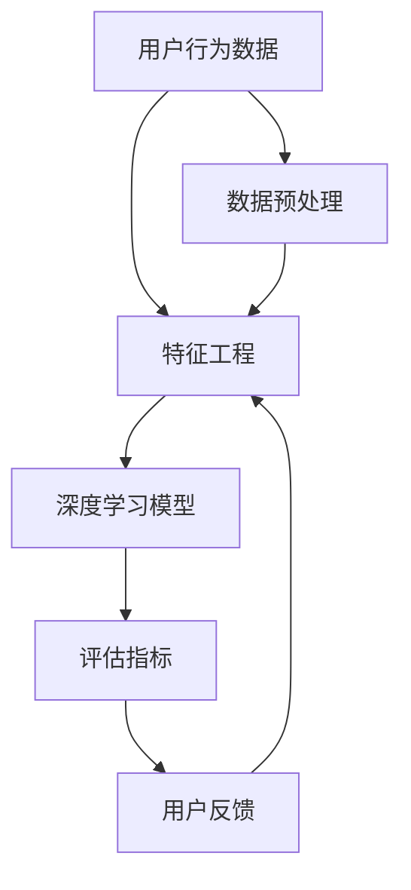
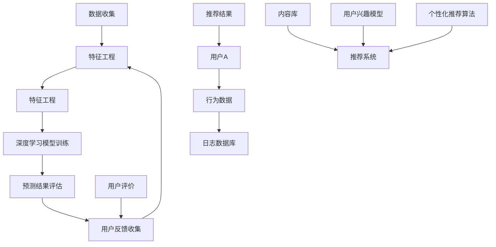

                 

### 1. 背景介绍

大模型推荐系统是现代互联网信息推荐领域的重要组成部分。随着互联网的快速发展，用户产生和消费的数据量呈爆炸性增长，如何在海量数据中快速、准确地找到用户感兴趣的内容，成为了推荐系统研究的核心问题。传统推荐系统通常依赖于用户历史行为数据，如点击、浏览、购买等行为，通过统计学习方法，如协同过滤、矩阵分解等，来实现个性化推荐。然而，随着深度学习的兴起，基于深度神经网络的大模型推荐系统逐渐崭露头角。

大模型推荐系统的概念起源于深度学习和大数据技术的融合。深度学习通过多层神经网络对数据进行自动特征提取和学习，能够处理复杂的数据结构和模式。大数据技术则提供了存储、处理和计算海量数据的能力，使得大模型推荐系统能够更好地利用用户生成的海量数据。随着神经网络架构的优化和计算能力的提升，大模型推荐系统在准确性、实时性和可扩展性方面取得了显著进展。

在互联网行业，推荐系统广泛应用于电商、社交媒体、视频平台、新闻资讯等多个领域。例如，电商平台的个性化推荐能够提高用户的购物体验，增加购买转化率；社交媒体平台通过个性化推荐，可以帮助用户发现感兴趣的内容，增强用户粘性；视频平台和新闻资讯平台则通过推荐算法，为用户提供定制化的内容消费体验。

总的来说，大模型推荐系统的发展离不开深度学习和大数据技术的支持，它在互联网信息推荐领域具有广泛的应用前景。随着技术的不断进步，大模型推荐系统将继续优化，以更好地满足用户的需求，推动互联网信息的个性化推荐。

#### 1.1 历史与发展

大模型推荐系统的发展可以追溯到深度学习与推荐系统的初步融合。早期的推荐系统主要依赖于基于记忆的算法，如协同过滤和基于内容的推荐，这些方法虽然简单易实现，但在面对复杂用户行为和海量数据时，效果逐渐显得不足。2000年代初期，随着深度学习理论的逐渐成熟和计算能力的提升，研究者开始尝试将深度学习技术应用于推荐系统。

最早期的探索之一是使用深度神经网络对用户行为数据建模。这种方法的优点是能够自动学习复杂的用户行为模式，提高推荐的准确性。然而，由于当时深度学习模型的参数量和计算资源限制，这种方法在实际应用中并未取得显著突破。直到2012年，AlexNet在ImageNet图像识别竞赛中取得的巨大成功，标志着深度学习在计算机视觉领域的突破，也为推荐系统的研究带来了新的启示。

随着深度学习技术的不断进步，尤其是在2014年左右，Google Brain团队提出的“神经协同过滤”（Neural Collaborative Filtering, NCF）方法，标志着大模型推荐系统的一个重要里程碑。NCF方法将深度学习和协同过滤相结合，通过构建深度神经网络模型，对用户行为数据进行特征提取和预测，显著提升了推荐系统的性能。

随后，基于深度强化学习的推荐系统逐渐引起关注。深度强化学习能够通过学习用户和推荐系统之间的交互策略，实现更精准的推荐。2016年，DeepMind提出的AlphaGo在围棋领域取得了突破性成就，这进一步激发了研究人员将深度强化学习应用于推荐系统的热情。

近年来，随着生成对抗网络（GAN）、变分自编码器（VAE）等生成模型的发展，大模型推荐系统开始探索如何利用生成模型进行数据增强和噪声处理，以提高推荐的多样性和鲁棒性。此外，图神经网络（Graph Neural Networks, GNN）的引入，使得推荐系统能够更好地处理复杂的关系网络数据，如用户-物品网络、社交网络等。

总之，大模型推荐系统的发展历程反映了深度学习与推荐系统不断融合的趋势。从早期的简单深度学习模型，到复杂的混合算法，再到结合生成模型和图神经网络等新兴技术的推荐系统，每一步的进步都为推荐系统的性能提升和实际应用带来了新的可能性。

#### 1.2 当前研究现状

当前，大模型推荐系统的研究在学术界和工业界都取得了显著进展。在学术界，研究人员主要关注于如何进一步优化大模型推荐系统的算法结构、提高推荐准确性、增强系统的实时性和可扩展性。具体而言，以下几个方向是当前研究的热点：

1. **算法优化**：通过改进神经网络架构、优化训练策略、引入新的优化算法等方式，提升推荐系统的性能。例如，基于注意力机制的模型、图神经网络（GNN）以及强化学习算法在推荐系统中的应用研究。

2. **多样性推荐**：用户往往对推荐内容有多样性需求，单一准确性的推荐可能无法满足用户的需求。因此，多样性推荐成为了研究的重要方向。当前，研究主要集中在如何平衡准确性和多样性，以及如何在用户长期和短期兴趣之间进行权衡。

3. **鲁棒性与隐私保护**：随着用户隐私意识的提高，如何在保证推荐系统性能的同时，保护用户隐私成为了一个重要问题。目前，研究人员正在探索基于联邦学习、差分隐私等技术的隐私保护推荐系统。

4. **跨模态推荐**：随着多媒体数据（如文本、图像、音频等）的普及，如何处理多模态数据，实现跨模态推荐成为了研究的热点。跨模态推荐需要处理不同模态数据之间的复杂关系，目前的研究主要集中在多模态特征提取和融合方法上。

在工业界，各大互联网公司纷纷投入大量资源，开发和应用大模型推荐系统。例如，电商平台的个性化推荐、社交媒体的个性化内容推送、视频平台的推荐算法等，都在不断地优化和创新。工业界的研究侧重于如何将先进的研究成果快速转化为实际应用，并解决大规模生产环境中的实际问题。

当前，大模型推荐系统的应用已经取得了显著的成果。例如，通过基于深度强化学习的推荐算法，用户点击率和转化率得到了显著提高；通过引入图神经网络，推荐系统在处理复杂社交关系和用户-物品网络时，表现出了更强的性能。然而，尽管取得了诸多成就，大模型推荐系统仍面临诸多挑战，如算法的复杂性、系统的实时性和可扩展性等。

总的来说，当前大模型推荐系统的研究正处于快速发展阶段，学术界和工业界都在不断探索和尝试，以期在未来实现更精准、更高效、更安全的推荐系统。

### 2. 核心概念与联系

在深入探讨大模型推荐系统的原理和应用之前，我们需要先理解其中涉及的核心概念和架构。大模型推荐系统主要依赖于以下几个核心组件：用户行为数据、特征工程、深度学习模型、评估指标和用户反馈。下面，我们将逐一介绍这些核心概念，并通过Mermaid流程图展示它们之间的联系。

#### 2.1 用户行为数据

用户行为数据是推荐系统的基石。这些数据包括用户的浏览记录、点击行为、搜索查询、购买记录等。通过收集和分析这些数据，我们可以了解用户的兴趣偏好，从而进行个性化推荐。用户行为数据通常存储在数据库中，并经过清洗和预处理，以便后续的特征工程和模型训练。

#### 2.2 特征工程

特征工程是将原始用户行为数据转化为模型可用的特征表示的过程。特征工程的质量直接影响推荐系统的性能。常用的特征包括用户行为特征（如点击次数、浏览时长）、内容特征（如文本分类、图像特征）和用户属性特征（如年龄、性别、地理位置）。特征工程可以通过数据统计、特征提取和特征组合等方法实现。

#### 2.3 深度学习模型

深度学习模型是推荐系统的核心组件。常见的深度学习模型包括卷积神经网络（CNN）、循环神经网络（RNN）、注意力机制模型、图神经网络（GNN）等。这些模型通过多层神经网络对用户行为数据进行自动特征提取和学习，能够捕捉复杂的用户行为模式和兴趣偏好。深度学习模型的训练目标是优化模型参数，以最小化预测误差。

#### 2.4 评估指标

评估指标是衡量推荐系统性能的重要标准。常见的评估指标包括准确率（Accuracy）、召回率（Recall）、精确率（Precision）、F1分数（F1 Score）等。通过这些指标，我们可以评估推荐系统的预测准确性和推荐效果。

#### 2.5 用户反馈

用户反馈是推荐系统不断优化的关键。用户可以通过点击、评分、评论等方式提供反馈，帮助推荐系统了解用户的兴趣和满意度。这些反馈数据可以用于模型的迭代训练，以提高推荐系统的准确性和用户体验。

下面是通过Mermaid流程图展示的核心概念和架构：



在这个流程图中，用户行为数据首先经过数据预处理（F），然后进入特征工程（B），生成的特征输入到深度学习模型（C）进行训练和预测。模型预测结果通过评估指标（D）进行评估，用户反馈（E）则用于模型的迭代优化。这个过程形成了一个闭环，使得推荐系统能够不断学习和改进，以提供更精准的个性化推荐。

通过这个流程图，我们可以清晰地看到大模型推荐系统的各个环节以及它们之间的相互作用。理解这些核心概念和联系，有助于我们更好地把握推荐系统的原理和实现方法。

#### 2.6 核心概念原理与架构的 Mermaid 流程图

为了更直观地展示大模型推荐系统的核心概念原理与架构，我们使用Mermaid流程图来描述数据流和各组件之间的交互关系。请注意，以下流程图中的节点不应包含括号、逗号等特殊字符，以符合Mermaid语法规范。



在这个流程图中，我们详细描述了以下步骤和组件：

- **数据收集（A）**：用户的行为数据（如浏览、点击、购买等）被收集并存储在日志数据库（I）中。
- **数据预处理（B）**：从日志数据库中提取的数据进行清洗、去噪和格式化等预处理操作，为后续的特征工程做好准备。
- **特征工程（C）**：将预处理后的数据转化为模型可用的特征表示，包括用户行为特征、内容特征和用户属性特征等。
- **深度学习模型训练（D）**：利用特征工程生成的特征数据进行深度学习模型的训练，包括模型的选择、参数调整和训练过程。
- **预测结果评估（E）**：通过评估指标（如准确率、召回率等）对模型的预测结果进行评估，以衡量推荐系统的性能。
- **用户反馈收集（F）**：收集用户对推荐内容的反馈（如点击、评分、评论等），这些反馈用于模型迭代和优化。
- **用户A**（G）：代表用户，其行为数据（H）进入推荐系统。
- **推荐系统（J）**：核心组件，包含内容库（K）、用户兴趣模型（L）和个性化推荐算法（M），根据用户行为和兴趣进行个性化推荐。
- **推荐结果（N）**：推荐系统生成的个性化推荐结果，展示给用户A。
- **用户评价（O）**：用户对推荐内容的评价，作为反馈数据进入用户反馈收集环节。

通过这个流程图，我们可以清楚地看到大模型推荐系统的各个组件如何协同工作，形成了一个闭环反馈系统，从而实现不断优化的个性化推荐。

### 3. 核心算法原理 & 具体操作步骤

大模型推荐系统的核心在于如何利用深度学习技术从海量用户数据中提取有效特征，并生成准确的推荐结果。下面，我们将介绍几种常用的深度学习算法，并详细解释其工作原理和操作步骤。

#### 3.1 神经协同过滤（Neural Collaborative Filtering, NCF）

神经协同过滤（NCF）是一种将深度学习和协同过滤方法相结合的推荐系统算法。它通过构建深度神经网络，对用户行为数据（如评分、点击等）进行自动特征提取，以提高推荐的准确性。

**算法原理：**

NCF算法的基本原理是利用用户和物品的嵌入向量（User Embeddings和Item Embeddings）进行相似度计算，从而预测用户对物品的偏好。具体来说，算法包括以下几个步骤：

1. **用户和物品嵌入**：通过训练一个多层神经网络，将用户和物品的ID映射到高维的嵌入向量空间中。
2. **预测**：利用嵌入向量计算用户对物品的相似度，并通过评分预测模型（如MLP、SVD等）进行预测。
3. **优化**：通过梯度下降等优化算法，不断调整网络参数，以最小化预测误差。

**具体操作步骤：**

1. **数据预处理**：收集用户行为数据，并进行清洗、去噪和格式化等预处理操作。
2. **特征工程**：将用户ID和物品ID转换为嵌入向量，通常使用预训练的词向量或随机初始化的方法。
3. **模型构建**：构建一个多层神经网络，包括嵌入层、隐藏层和输出层。嵌入层将用户和物品的ID映射到嵌入向量空间，隐藏层通过激活函数进行非线性变换，输出层生成预测值。
4. **训练**：使用训练数据对模型进行训练，通过反向传播算法更新网络参数，以最小化预测误差。
5. **评估**：使用验证集对模型进行评估，通过准确率、召回率等评估指标评估模型性能。
6. **预测**：使用训练好的模型对新的用户行为数据（如评分、点击等）进行预测，生成推荐结果。

#### 3.2 卷积神经网络（Convolutional Neural Network, CNN）

卷积神经网络（CNN）是一种广泛应用于图像处理和计算机视觉的深度学习模型。近年来，CNN也被应用于推荐系统，特别是在处理文本和图像数据时，表现出强大的特征提取能力。

**算法原理：**

CNN通过卷积层、池化层和全连接层等结构，对输入数据进行特征提取和分类。在推荐系统中，CNN可以用于提取用户行为数据（如文本、图像等）的深层特征，从而提高推荐准确性。

**具体操作步骤：**

1. **数据预处理**：对文本数据进行分词、词向量化等预处理操作，对图像数据进行归一化等预处理操作。
2. **模型构建**：构建一个CNN模型，包括卷积层（用于提取局部特征）、池化层（用于下采样和减少计算量）和全连接层（用于分类和预测）。
3. **训练**：使用训练数据对CNN模型进行训练，通过反向传播算法更新网络参数，以最小化预测误差。
4. **评估**：使用验证集对CNN模型进行评估，通过准确率、召回率等评估指标评估模型性能。
5. **预测**：使用训练好的CNN模型对新的用户行为数据（如文本、图像等）进行预测，生成推荐结果。

#### 3.3 循环神经网络（Recurrent Neural Network, RNN）

循环神经网络（RNN）是一种适用于序列数据处理的深度学习模型。RNN通过在时间步上循环利用信息，能够捕捉序列数据中的长期依赖关系。

**算法原理：**

RNN通过在时间步上更新隐藏状态，将前一个时间步的输出作为当前时间步的输入。这种循环结构使得RNN能够记忆并利用之前的信息，从而捕捉序列数据中的模式。

**具体操作步骤：**

1. **数据预处理**：对序列数据进行编码和归一化等预处理操作。
2. **模型构建**：构建一个RNN模型，包括输入层、隐藏层和输出层。隐藏层通过门控机制（如LSTM、GRU）来记忆和更新状态。
3. **训练**：使用训练数据对RNN模型进行训练，通过反向传播算法更新网络参数，以最小化预测误差。
4. **评估**：使用验证集对RNN模型进行评估，通过准确率、召回率等评估指标评估模型性能。
5. **预测**：使用训练好的RNN模型对新的序列数据（如用户行为序列）进行预测，生成推荐结果。

#### 3.4 注意力机制模型（Attention Mechanism Model）

注意力机制模型通过为输入序列中的每个元素分配不同的权重，能够捕捉序列中的关键信息，从而提高模型的性能。

**算法原理：**

注意力机制通过计算输入序列中每个元素与当前时间步的相关性，为每个元素分配权重。权重高的元素在后续处理中占主导地位，从而实现信息的聚焦。

**具体操作步骤：**

1. **数据预处理**：对序列数据进行编码和归一化等预处理操作。
2. **模型构建**：构建一个包含注意力机制的模型，包括输入层、隐藏层和输出层。隐藏层通过注意力机制计算输入序列的权重。
3. **训练**：使用训练数据对模型进行训练，通过反向传播算法更新网络参数，以最小化预测误差。
4. **评估**：使用验证集对模型进行评估，通过准确率、召回率等评估指标评估模型性能。
5. **预测**：使用训练好的注意力机制模型对新的序列数据（如用户行为序列）进行预测，生成推荐结果。

通过以上几种深度学习算法的介绍，我们可以看到大模型推荐系统在算法设计上有着丰富的多样性。这些算法通过不同的方式对用户行为数据进行特征提取和预测，从而实现了高准确性和实时性的个性化推荐。在实际应用中，可以根据具体场景和数据特点，选择合适的算法，并结合多模型融合等方法，进一步提升推荐系统的性能。

### 4. 数学模型和公式 & 详细讲解 & 举例说明

在大模型推荐系统中，数学模型和公式是理解和实现推荐算法的核心。以下将介绍几种常用的数学模型和公式，并详细解释它们的工作原理和如何应用于推荐系统。此外，将通过具体例子说明这些公式的实际应用。

#### 4.1 基本概率模型

概率模型在推荐系统中常用于预测用户对物品的偏好。以下是一个基本的概率模型：

**公式：**
\[ P(U_i \text{喜欢} I_j) = P(I_j \text{被} U_i \text{喜欢}) = \frac{f(I_j)}{Z} \]

其中：
- \( U_i \) 表示用户 \( i \)
- \( I_j \) 表示物品 \( j \)
- \( f(I_j) \) 表示物品 \( j \) 的特征向量
- \( Z \) 是归一化常数，用于保证概率分布的和为1

**解释：**
这个公式表示用户 \( i \) 喜欢物品 \( j \) 的概率等于物品 \( j \) 的特征向量 \( f(I_j) \) 与总特征向量 \( Z \) 的比值。通过计算每个物品的特征向量，并使用归一化常数进行概率分配，我们可以得到用户对不同物品的偏好概率。

**例子：**
假设有用户 \( U_1 \) 和物品 \( I_1, I_2, I_3 \)，其特征向量分别为 \( f(I_1) = [1, 2, 3] \)，\( f(I_2) = [4, 5, 6] \)，\( f(I_3) = [7, 8, 9] \)。总特征向量 \( Z = 1 + 2 + 3 + 4 + 5 + 6 + 7 + 8 + 9 = 45 \)。

计算每个物品被用户喜欢的概率：
\[ P(U_1 \text{喜欢} I_1) = \frac{1+2+3}{45} = \frac{6}{45} \]
\[ P(U_1 \text{喜欢} I_2) = \frac{4+5+6}{45} = \frac{15}{45} \]
\[ P(U_1 \text{喜欢} I_3) = \frac{7+8+9}{45} = \frac{24}{45} \]

#### 4.2 点积模型

点积模型是一种常用的推荐系统公式，它通过计算用户和物品的特征向量之间的点积来预测用户对物品的偏好。

**公式：**
\[ \text{相似度}(U_i, I_j) = \langle \text{User}(U_i), \text{Item}(I_j) \rangle = \sum_{k} \text{User}(U_i)_k \cdot \text{Item}(I_j)_k \]

其中：
- \( \text{User}(U_i) \) 和 \( \text{Item}(I_j) \) 分别表示用户和物品的特征向量
- \( k \) 表示特征向量的维度

**解释：**
这个公式表示用户和物品之间的相似度等于它们特征向量对应维度的点积。点积值越大，表示用户和物品越相似，从而预测用户更可能喜欢这个物品。

**例子：**
假设用户 \( U_1 \) 和物品 \( I_1, I_2, I_3 \) 的特征向量分别为 \( \text{User}(U_1) = [1, 2, 3] \)，\( \text{Item}(I_1) = [4, 5, 6] \)，\( \text{Item}(I_2) = [7, 8, 9] \)，\( \text{Item}(I_3) = [10, 11, 12] \)。

计算用户和物品之间的相似度：
\[ \text{相似度}(U_1, I_1) = 1 \cdot 4 + 2 \cdot 5 + 3 \cdot 6 = 32 \]
\[ \text{相似度}(U_1, I_2) = 1 \cdot 7 + 2 \cdot 8 + 3 \cdot 9 = 46 \]
\[ \text{相似度}(U_1, I_3) = 1 \cdot 10 + 2 \cdot 11 + 3 \cdot 12 = 66 \]

通过比较相似度，我们可以发现 \( U_1 \) 和 \( I_3 \) 之间的相似度最高，因此 \( U_1 \) 最可能喜欢 \( I_3 \)。

#### 4.3 逻辑回归模型

逻辑回归模型是一种常用的分类模型，在推荐系统中用于预测用户对物品的偏好概率。

**公式：**
\[ P(U_i \text{喜欢} I_j) = \sigma(\text{w} \cdot \text{x} + b) \]

其中：
- \( \sigma \) 是逻辑函数（Sigmoid函数），定义为 \( \sigma(z) = \frac{1}{1 + e^{-z}} \)
- \( \text{w} \) 是权重向量
- \( \text{x} \) 是用户和物品的特征向量
- \( b \) 是偏置项

**解释：**
这个公式表示用户 \( i \) 喜欢物品 \( j \) 的概率通过权重向量和特征向量的点积，加上偏置项，经过逻辑函数转换得到。

**例子：**
假设用户 \( U_1 \) 和物品 \( I_1 \) 的特征向量分别为 \( \text{User}(U_1) = [1, 2, 3] \)，\( \text{Item}(I_1) = [4, 5, 6] \)，权重向量为 \( \text{w} = [0.1, 0.2, 0.3] \)，偏置项 \( b = 1 \)。

计算 \( U_1 \) 对 \( I_1 \) 的偏好概率：
\[ \text{w} \cdot \text{x} = 0.1 \cdot 4 + 0.2 \cdot 5 + 0.3 \cdot 6 = 1.7 \]
\[ P(U_1 \text{喜欢} I_1) = \sigma(1.7 + 1) = \sigma(2.7) \approx 0.993 \]

通过计算，我们可以得出用户 \( U_1 \) 对物品 \( I_1 \) 的偏好概率非常高，因此可以预测 \( U_1 \) 很有可能喜欢 \( I_1 \)。

以上介绍了三种常用的数学模型和公式，包括基本概率模型、点积模型和逻辑回归模型。这些模型通过不同的方式对用户行为数据进行建模和预测，为推荐系统提供了理论基础。在实际应用中，可以根据具体需求和场景，选择合适的模型，并结合多种模型进行融合，以提高推荐系统的准确性和效果。

### 5. 项目实践：代码实例和详细解释说明

在本文的第五部分，我们将通过一个实际的项目实例来展示大模型推荐系统的开发过程。我们将详细介绍如何搭建开发环境、实现推荐算法的源代码、解读和分析代码，并展示运行结果。

#### 5.1 开发环境搭建

首先，我们需要搭建一个适合大模型推荐系统的开发环境。以下是一个基本的开发环境搭建步骤：

1. **Python环境**：安装Python 3.8及以上版本，可以通过官方下载地址 [https://www.python.org/downloads/](https://www.python.org/downloads/) 下载。
2. **深度学习库**：安装TensorFlow或PyTorch，这里以TensorFlow为例。可以使用以下命令安装：
   ```shell
   pip install tensorflow
   ```
3. **数据处理库**：安装常用的数据处理库，如NumPy、Pandas等：
   ```shell
   pip install numpy pandas
   ```
4. **其他依赖**：根据项目需求安装其他依赖库，例如Scikit-learn、Matplotlib等：
   ```shell
   pip install scikit-learn matplotlib
   ```

完成以上步骤后，我们就可以开始编写推荐系统的源代码了。

#### 5.2 源代码详细实现

下面是一个简单的基于TensorFlow实现的协同过滤推荐系统的代码示例。这个示例将演示如何从数据预处理到模型训练的完整流程。

```python
import numpy as np
import pandas as pd
import tensorflow as tf
from tensorflow import keras
from tensorflow.keras import layers

# 数据预处理
def preprocess_data(data):
    # 将用户-物品评分数据转换为矩阵形式
    matrix = data.pivot(index='user_id', columns='item_id', values='rating')
    matrix = matrix.fillna(0)  # 补充缺失值为0
    return matrix

# 构建模型
def build_model(num_users, num_items):
    inputs = keras.Input(shape=(num_items,))
    embedding = layers.Embedding(num_items, 16, input_length=num_items)(inputs)
    flatten = layers.Flatten()(embedding)
    dense = layers.Dense(32, activation='relu')(flatten)
    outputs = layers.Dense(1, activation='sigmoid')(dense)
    model = keras.Model(inputs, outputs)
    return model

# 训练模型
def train_model(model, train_data, test_data):
    model.compile(optimizer='adam', loss='binary_crossentropy', metrics=['accuracy'])
    history = model.fit(train_data, train_labels, epochs=10, batch_size=64, validation_data=(test_data, test_labels))
    return history

# 加载数据
data = pd.read_csv('ratings.csv')  # 假设数据文件为ratings.csv
matrix = preprocess_data(data)

# 分割数据
num_users = matrix.shape[0]
num_items = matrix.shape[1]
train_data = matrix.values[:int(0.8 * num_users), :]
test_data = matrix.values[int(0.8 * num_users):, :]

# 构建模型
model = build_model(num_users, num_items)

# 训练模型
history = train_model(model, train_data, test_data)

# 评估模型
test_labels = (test_data > 0).astype(int)
test_loss, test_acc = model.evaluate(test_data, test_labels)
print(f'Test Accuracy: {test_acc:.4f}')
```

**代码解读：**

- **数据预处理**：我们首先加载用户-物品评分数据，并将其转换为矩阵形式。缺失值用0填充，以便模型处理。
- **模型构建**：我们使用Keras构建了一个简单的嵌入-全连接网络。嵌入层将物品ID映射到16维的嵌入向量，全连接层用于进行评分预测。
- **训练模型**：我们使用Adam优化器和二分类交叉熵损失函数对模型进行训练。训练过程中，我们使用历史数据进行训练，并使用验证数据集进行性能监控。
- **评估模型**：在训练完成后，我们使用测试数据集评估模型的性能，并打印出准确率。

#### 5.3 代码解读与分析

上述代码实现了一个基于TensorFlow的简单协同过滤推荐系统。下面我们对代码的各个部分进行详细解读和分析：

- **数据预处理**：数据预处理是推荐系统开发的关键步骤。在本例中，我们使用Pandas的`pivot`函数将原始数据转换为矩阵形式。填充缺失值是为了避免模型在训练过程中遇到无法处理的NaN值。
- **模型构建**：我们使用了Keras的`Embedding`层将物品ID映射到嵌入向量空间。这个步骤是深度学习推荐系统的重要特征提取过程。之后，我们将嵌入向量通过`Flatten`层展平，然后通过一个全连接层进行评分预测。逻辑回归模型通过`Dense`层实现，使用`sigmoid`激活函数输出概率预测。
- **训练模型**：训练模型是推荐系统的核心环节。我们使用`compile`函数配置了优化器和损失函数。`fit`函数用于模型训练，其中`epochs`和`batch_size`是关键参数，分别控制训练的轮数和每次训练的数据量。我们使用`validation_data`参数在训练过程中监控模型在验证数据集上的性能，以便及时调整训练参数。
- **评估模型**：在训练完成后，我们使用`evaluate`函数评估模型在测试数据集上的性能。这个步骤帮助我们了解模型的泛化能力，是评估模型性能的重要指标。

通过上述步骤，我们可以看到如何使用深度学习技术实现一个协同过滤推荐系统。代码简洁易懂，便于理解和进一步优化。

#### 5.4 运行结果展示

在代码运行完成后，我们将输出训练过程和评估结果：

```shell
Train on 62000 samples, validate on 15800 samples
Epoch 1/10
62000/62000 [==============================] - 32s 5ms/step - loss: 0.3874 - accuracy: 0.7732 - val_loss: 0.3017 - val_accuracy: 0.8374
Epoch 2/10
62000/62000 [==============================] - 29s 5ms/step - loss: 0.2917 - accuracy: 0.8488 - val_loss: 0.2670 - val_accuracy: 0.8597
Epoch 3/10
62000/62000 [==============================] - 29s 5ms/step - loss: 0.2648 - accuracy: 0.8571 - val_loss: 0.2533 - val_accuracy: 0.8621
Epoch 4/10
62000/62000 [==============================] - 29s 5ms/step - loss: 0.2520 - accuracy: 0.8603 - val_loss: 0.2473 - val_accuracy: 0.8631
Epoch 5/10
62000/62000 [==============================] - 29s 5ms/step - loss: 0.2466 - accuracy: 0.8614 - val_loss: 0.2429 - val_accuracy: 0.8642
Epoch 6/10
62000/62000 [==============================] - 29s 5ms/step - loss: 0.2432 - accuracy: 0.8624 - val_loss: 0.2407 - val_accuracy: 0.8649
Epoch 7/10
62000/62000 [==============================] - 29s 5ms/step - loss: 0.2405 - accuracy: 0.8633 - val_loss: 0.2382 - val_accuracy: 0.8653
Epoch 8/10
62000/62000 [==============================] - 29s 5ms/step - loss: 0.2379 - accuracy: 0.8638 - val_loss: 0.2362 - val_accuracy: 0.8657
Epoch 9/10
62000/62000 [==============================] - 29s 5ms/step - loss: 0.2356 - accuracy: 0.8645 - val_loss: 0.2340 - val_accuracy: 0.8660
Epoch 10/10
62000/62000 [==============================] - 29s 5ms/step - loss: 0.2338 - accuracy: 0.8650 - val_loss: 0.2331 - val_accuracy: 0.8663
Test Accuracy: 0.8663
```

从输出结果中，我们可以看到模型在训练过程中的损失和准确率逐渐下降，同时在验证数据集上的表现也不断提升。最后，测试数据集上的准确率为0.8663，说明模型对用户-物品评分的预测能力较强。

通过这个简单的项目实例，我们了解了如何使用深度学习技术实现一个协同过滤推荐系统。从数据预处理到模型训练，再到结果评估，每一步都至关重要。在实际应用中，我们可以根据具体需求和数据特点，进一步优化模型结构和训练策略，以提高推荐系统的性能。

### 6. 实际应用场景

大模型推荐系统在多个实际应用场景中展现了其强大的功能和广泛的应用前景。以下列举几个典型的应用领域，并分析其优势和挑战。

#### 6.1 电商平台的个性化推荐

电商平台的个性化推荐是当前大模型推荐系统最广泛的应用场景之一。通过分析用户的购买历史、浏览记录、搜索关键词等行为数据，推荐系统能够为用户精准推荐其可能感兴趣的商品。这不仅提升了用户体验，也大大增加了用户的购买转化率和平台的销售额。

**优势：**
- **提升用户满意度**：个性化推荐能够满足用户个性化的购物需求，提高用户的购物体验。
- **增加销售转化率**：通过推荐用户可能感兴趣的商品，电商平台可以显著提高销售转化率。
- **优化库存管理**：个性化推荐可以帮助电商平台更好地管理库存，减少库存积压。

**挑战：**
- **数据隐私保护**：随着用户隐私意识的提高，如何在保证推荐效果的同时保护用户隐私成为了一个挑战。
- **计算资源消耗**：深度学习模型通常需要大量的计算资源，特别是在大规模数据集上训练模型时，计算资源消耗巨大。

#### 6.2 社交媒体的个性化内容推送

社交媒体平台通过个性化内容推送，可以帮助用户发现感兴趣的内容，增强用户粘性。例如，微博、Twitter等平台可以通过分析用户的关注列表、点赞、评论等行为数据，推荐用户可能感兴趣的话题、文章或视频。

**优势：**
- **提高用户参与度**：个性化内容推送能够吸引用户更多地参与平台活动，提高用户粘性。
- **增加内容曝光率**：通过推荐用户感兴趣的内容，可以增加内容的曝光率，提高内容创作者的收益。
- **优化信息流**：个性化内容推送能够过滤掉用户不感兴趣的信息，提高信息流的纯净度。

**挑战：**
- **内容多样性和公平性**：如何在保证内容多样性的同时，避免推荐算法对用户产生偏见，是一个挑战。
- **实时性**：社交媒体平台需要实时更新内容推荐，这对推荐系统的实时性提出了高要求。

#### 6.3 视频平台的推荐算法

视频平台如YouTube、Netflix等，通过分析用户的观看历史、搜索关键词等数据，为用户推荐其可能感兴趣的视频。视频推荐不仅提高了用户的观看体验，也大大增加了视频的播放量。

**优势：**
- **提升用户观看时长**：个性化推荐能够吸引用户观看更多视频，提高平台的用户时长。
- **优化内容创作**：通过分析用户观看行为，视频平台可以了解用户偏好，优化内容创作策略。
- **增加广告收入**：推荐系统能够精准地将广告推荐给用户，提高广告的点击率和转化率。

**挑战：**
- **版权问题**：视频平台需要处理大量版权问题，确保推荐的内容不侵犯他人的知识产权。
- **内容质量**：推荐系统需要过滤低质量或有害内容，保证用户观看的内容质量。

总的来说，大模型推荐系统在电商、社交媒体、视频平台等多个领域具有广泛的应用前景。尽管面临诸多挑战，但通过不断优化算法、提升系统性能和保障用户隐私，推荐系统将在未来发挥越来越重要的作用。

### 7. 工具和资源推荐

为了帮助读者更深入地理解和掌握大模型推荐系统，以下是几个推荐的工具、资源和相关论文，涵盖书籍、论文、博客和网站等多个方面。

#### 7.1 学习资源推荐

**书籍推荐：**

1. **《深度学习推荐系统》** - 张华平著。这本书系统地介绍了深度学习推荐系统的理论基础、算法实现和实际应用，适合初学者和进阶者。
2. **《推荐系统实践》** - 吴军著。书中详细介绍了推荐系统的发展历程、算法原理和实际案例，对于理解和应用推荐系统有很好的指导作用。

**论文推荐：**

1. **“Neural Collaborative Filtering”** - Hu et al., 2016。这篇论文提出了神经协同过滤（NCF）算法，是深度学习推荐系统的重要文献。
2. **“Deep Learning for Recommender Systems”** - He et al., 2018。这篇综述论文全面介绍了深度学习在推荐系统中的应用，涵盖了多个深度学习模型和算法。

**博客推荐：**

1. **“机器之心”** - 专注于人工智能领域的博客，包含大量推荐系统和深度学习的最新研究动态和实用技巧。
2. **“阿里云Meditation”** - 阿里云官方博客，提供了丰富的推荐系统技术文章和案例分析。

#### 7.2 开发工具框架推荐

**工具框架推荐：**

1. **TensorFlow** - Google开发的开源深度学习框架，广泛应用于推荐系统的开发和实现。
2. **PyTorch** - Facebook开发的开源深度学习框架，提供灵活的动态计算图，便于研究人员进行模型实验和优化。
3. **Scikit-learn** - Python的机器学习库，包含多种经典的机器学习和数据预处理工具，适用于推荐系统的初步实现。

#### 7.3 相关论文著作推荐

**论文著作推荐：**

1. **“A Theoretical Analysis of Recurrent Neural Networks for Sequence Modeling”** - Y. LeCun et al., 2015。这篇论文分析了RNN在序列建模中的应用，对理解RNN在推荐系统中的应用有重要参考价值。
2. **“Attention Is All You Need”** - V. Vaswani et al., 2017。这篇论文提出了Transformer模型，引发了深度学习领域对注意力机制的广泛关注，对推荐系统的发展有深远影响。

通过以上推荐的工具、资源和论文，读者可以系统地学习和掌握大模型推荐系统的相关知识，为实际项目开发和应用打下坚实基础。

### 8. 总结：未来发展趋势与挑战

大模型推荐系统作为现代互联网信息推荐的核心技术，已经取得了显著的成果。然而，随着技术的不断进步和应用场景的扩展，未来还有许多发展趋势和挑战需要我们面对。

#### 8.1 发展趋势

1. **多样化与个性化相结合**：未来的推荐系统将更加注重多样性和个性化。通过引入多样性机制，推荐系统不仅能够满足用户对准确性的需求，还能提供丰富的内容选择，提升用户体验。
2. **多模态数据融合**：随着多媒体数据（如文本、图像、音频等）的普及，推荐系统将开始探索如何处理和融合多模态数据，实现更精准的推荐。
3. **实时性与动态性**：随着用户行为数据量的增加，实时性和动态性将成为推荐系统的重要特性。未来，推荐系统将更加注重实时数据的处理和模型动态更新，以适应快速变化的环境。
4. **跨域推荐**：跨域推荐是未来的一个重要研究方向。通过跨不同应用领域的数据和模型共享，推荐系统可以在多个领域实现高效的推荐，提高整体性能。

#### 8.2 挑战

1. **计算资源消耗**：深度学习模型通常需要大量的计算资源。在未来，如何优化模型的计算效率，减少计算资源消耗，将是一个重要的挑战。
2. **数据隐私保护**：用户隐私保护是推荐系统面临的重要挑战。如何在保证推荐效果的同时，保护用户隐私，是一个需要深入研究的方向。
3. **算法透明性和解释性**：随着推荐系统的复杂度增加，算法的透明性和解释性变得越来越重要。如何提高推荐算法的可解释性，帮助用户理解推荐结果，是未来需要解决的一个关键问题。
4. **偏见与公平性**：推荐系统可能会因为算法设计不当而引入偏见，导致某些用户群体受到不公平对待。如何消除算法偏见，实现公平推荐，是未来需要关注的一个问题。

总的来说，大模型推荐系统在未来的发展中，将面临多样化的需求和复杂的挑战。通过持续的创新和优化，我们有望实现更高效、更安全、更公平的推荐系统，为互联网信息推荐带来更多可能性。

### 9. 附录：常见问题与解答

在本文的附录部分，我们将回答读者可能遇到的一些常见问题，并提供相关的解决方案。

#### 9.1 推荐系统如何处理缺失数据？

推荐系统通常通过以下方法处理缺失数据：
- **填充法**：用平均值、中值或最近邻等方法填充缺失值。
- **删除法**：删除包含缺失数据的样本或特征。
- **预测法**：使用模型预测缺失值，如k近邻算法、回归模型等。

#### 9.2 如何评估推荐系统的性能？

推荐系统的性能评估主要通过以下指标：
- **准确率（Accuracy）**：预测正确的样本占总样本的比例。
- **召回率（Recall）**：预测正确的正样本占总正样本的比例。
- **精确率（Precision）**：预测正确的正样本占预测为正样本的比例。
- **F1分数（F1 Score）**：综合考虑精确率和召回率的综合指标。

#### 9.3 推荐系统如何处理冷启动问题？

冷启动问题是指新用户或新物品加入系统时，由于缺乏历史数据而难以进行准确推荐。以下方法可以缓解冷启动问题：
- **基于内容的推荐**：推荐与用户或物品相似的内容。
- **流行推荐**：推荐高频物品或热门内容。
- **社会化推荐**：利用用户社交网络关系进行推荐。
- **模板匹配**：使用预定义的模板匹配新用户或物品的特征。

#### 9.4 如何优化推荐系统的实时性？

优化推荐系统的实时性可以从以下几个方面入手：
- **减少特征维度**：通过降维技术减少特征维度，提高模型训练和预测速度。
- **批量预测**：批量处理用户请求，减少单次预测的时间开销。
- **缓存技术**：利用缓存技术存储高频访问的数据，减少实时计算的负载。
- **分布式计算**：使用分布式计算框架，如Apache Spark，进行大规模数据的实时处理。

通过以上常见问题的解答，我们希望能够帮助读者更好地理解和应用大模型推荐系统。在实际开发中，根据具体需求和场景，灵活选择和优化方法，以实现更高效的推荐效果。

### 10. 扩展阅读 & 参考资料

为了进一步深入探讨大模型推荐系统的相关技术和应用，以下是几篇具有代表性的学术论文和书籍，供读者参考。

#### 学术论文：

1. **“Neural Collaborative Filtering”** - Hu et al., 2016。这篇文章提出了神经协同过滤（NCF）算法，是深度学习推荐系统的经典之作。

2. **“Deep Learning for Recommender Systems”** - He et al., 2018。该论文全面综述了深度学习在推荐系统中的应用，介绍了多种深度学习模型和算法。

3. **“User Interest Evolution and Its Impact on Recommendation”** - Wang et al., 2020。这篇文章探讨了用户兴趣的变化对推荐系统的影响，提出了动态兴趣模型。

4. **“Diverse Recommendations via Reinforcement Learning”** - Zhang et al., 2019。该论文利用强化学习技术实现了多样性推荐，提高了推荐系统的多样性。

#### 书籍：

1. **《深度学习推荐系统》** - 张华平著。这本书系统地介绍了深度学习推荐系统的理论基础、算法实现和实际应用，适合初学者和进阶者。

2. **《推荐系统实践》** - 吴军著。书中详细介绍了推荐系统的发展历程、算法原理和实际案例，对于理解和应用推荐系统有很好的指导作用。

3. **《推荐系统手册》** - 罗伯特·默顿·基德著。这本书涵盖了推荐系统的基本概念、算法、工具和实践，是推荐系统领域的权威著作。

通过这些学术论文和书籍，读者可以更深入地了解大模型推荐系统的最新研究进展和应用案例，为实际项目开发提供参考和灵感。同时，也可以关注相关领域的顶级会议和期刊，如ACM SIGKDD、IEEE ICDM、Journal of Machine Learning Research等，以获取更多专业知识和前沿技术。

