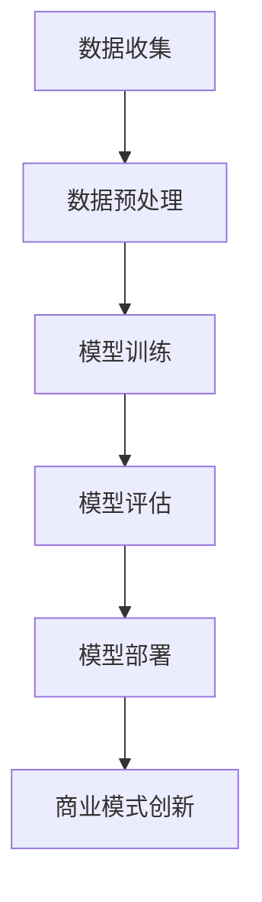

                 

### 文章标题：大模型时代下的新型商业模式

> 关键词：大模型、商业模式、人工智能、经济变革、技术创新、商业策略

> 摘要：本文旨在探讨大模型时代下的新型商业模式，分析大模型如何推动经济变革，影响企业战略和决策，并探讨其在各个行业中的应用与挑战。通过深入了解大模型的原理和应用场景，本文旨在为企业和创业者提供创新的商业策略参考。

### 1. 背景介绍

在过去的几十年中，计算机科学和技术经历了飞速的发展。从最初的简单计算工具到如今的智能系统，计算机的进步不仅改变了我们的生活，也深刻影响了全球经济。人工智能（AI）作为计算机科学的前沿领域，近年来取得了重大突破，其中大模型（Large Models）的发展尤为引人注目。

大模型是指具有数十亿至数千亿参数的深度学习模型，如GPT-3、BERT等。这些模型通过在海量数据上进行训练，能够模拟人类的思维方式，完成从语言生成、图像识别到决策支持等多种任务。大模型的出现标志着人工智能进入了一个新的阶段，即从“感知智能”向“认知智能”的迈进。

随着大模型技术的不断成熟，其应用范围也在不断扩大。从早期的自然语言处理、图像识别，到如今的智能推荐、自动驾驶、医疗诊断等，大模型正在深刻改变各个行业。同时，大模型也为企业带来了新的商业机会和挑战，促使商业模式进行创新和变革。

### 2. 核心概念与联系

#### 大模型的原理

大模型的基本原理是基于深度学习，特别是神经网络。深度学习模型通过多层神经网络来模拟人脑的思维方式，逐层提取数据中的特征。大模型之所以能够取得成功，主要得益于以下几点：

1. **参数规模**：大模型具有数十亿至数千亿个参数，能够捕获数据中的复杂模式。
2. **数据驱动**：大模型通过在海量数据上进行训练，能够自适应地调整参数，提高模型的准确性。
3. **多任务学习**：大模型能够同时处理多个任务，提高模型的泛化能力。

#### 大模型与商业模式的联系

大模型与商业模式之间的联系主要体现在以下几个方面：

1. **数据资源**：大模型需要海量数据来训练，这对企业的数据资源管理提出了新的挑战。企业需要建立高效的数据收集、存储和处理系统，以确保大模型的训练质量和效果。
2. **计算能力**：大模型对计算能力的需求极高，企业需要投入大量资金购买高性能计算设备，或者利用云计算资源来支持大模型的训练和部署。
3. **人才需求**：大模型的研究、开发和运维需要大量专业人才，企业需要建立完善的人才培养和引进机制，以满足大模型时代的业务需求。
4. **商业机会**：大模型为各行各业带来了新的商业机会，企业可以通过开发和应用大模型技术，实现产品创新和服务升级，从而在市场竞争中占据优势。

#### Mermaid 流程图



在上述流程中，数据收集、数据预处理、模型训练、模型评估和模型部署是构成大模型应用的基本环节。这些环节相互关联，共同推动商业模式创新。

### 3. 核心算法原理 & 具体操作步骤

#### 3.1 数据收集

数据收集是构建大模型的第一步，其质量直接影响模型的训练效果。企业需要从多个渠道收集相关数据，包括公开数据集、企业内部数据、第三方数据服务等。为了确保数据的完整性和准确性，企业需要对数据进行清洗、去重和格式化处理。

#### 3.2 数据预处理

数据预处理是数据收集后的重要步骤，其目的是将原始数据转换为适合模型训练的格式。数据预处理包括以下步骤：

1. **数据归一化**：将数据中的数值范围转换为统一的尺度，以避免数值大小对模型训练的影响。
2. **数据分割**：将数据集分为训练集、验证集和测试集，用于模型的训练、验证和测试。
3. **数据增强**：通过随机裁剪、翻转、旋转等操作，增加数据的多样性，提高模型的泛化能力。

#### 3.3 模型训练

模型训练是构建大模型的核心步骤，其目的是通过调整模型参数，使其在训练数据上达到最佳性能。模型训练包括以下步骤：

1. **初始化参数**：随机初始化模型参数。
2. **前向传播**：将输入数据传递到模型中，计算输出结果。
3. **反向传播**：计算输出结果与真实标签之间的误差，并利用梯度下降法调整模型参数。
4. **迭代训练**：重复前向传播和反向传播过程，直到模型收敛。

#### 3.4 模型评估

模型评估是验证模型性能的重要步骤，其目的是确定模型是否达到预期效果。模型评估包括以下步骤：

1. **准确率**：计算模型在测试集上的预测准确率。
2. **召回率**：计算模型在测试集上的召回率。
3. **F1 分数**：计算模型在测试集上的 F1 分数，综合考虑准确率和召回率。
4. **ROC 曲线**：绘制模型在测试集上的 ROC 曲线，评估模型的分类能力。

#### 3.5 模型部署

模型部署是将训练好的模型应用到实际业务场景中的过程。模型部署包括以下步骤：

1. **模型优化**：对模型进行压缩和优化，以提高模型在部署环境中的运行效率。
2. **模型部署**：将优化后的模型部署到服务器或云平台上，供业务系统调用。
3. **模型监控**：监控模型在部署环境中的运行状态，包括性能指标、错误率等。
4. **模型迭代**：根据业务需求和模型性能，对模型进行迭代优化和更新。

### 4. 数学模型和公式 & 详细讲解 & 举例说明

#### 4.1 梯度下降法

梯度下降法是优化模型参数的一种常用方法，其基本思想是沿着损失函数的梯度方向调整参数，以减少损失函数的值。具体步骤如下：

1. **初始化参数**：随机初始化模型参数。
2. **计算梯度**：计算损失函数关于模型参数的梯度。
3. **更新参数**：根据梯度方向和步长，更新模型参数。
4. **重复迭代**：重复计算梯度、更新参数的过程，直到模型收敛。

例如，对于线性回归模型，损失函数为均方误差（MSE），即：

$$
\text{MSE} = \frac{1}{n} \sum_{i=1}^{n} (y_i - \hat{y}_i)^2
$$

其中，$y_i$为真实标签，$\hat{y}_i$为模型预测值。梯度为：

$$
\nabla_{\theta} \text{MSE} = -2 \frac{1}{n} \sum_{i=1}^{n} (y_i - \hat{y}_i) x_i
$$

其中，$\theta$为模型参数。

假设初始参数为$\theta_0$，步长为$\alpha$，则更新后的参数为：

$$
\theta_1 = \theta_0 - \alpha \nabla_{\theta} \text{MSE}
$$

#### 4.2 随机梯度下降法

随机梯度下降法是梯度下降法的改进版本，其基本思想是在每次迭代中只随机选择一部分样本来计算梯度，从而减少计算复杂度和存储需求。具体步骤如下：

1. **初始化参数**：随机初始化模型参数。
2. **随机选择样本**：从数据集中随机选择一部分样本。
3. **计算梯度**：计算所选样本的梯度。
4. **更新参数**：根据梯度方向和步长，更新模型参数。
5. **重复迭代**：重复随机选择样本、计算梯度、更新参数的过程，直到模型收敛。

例如，对于线性回归模型，假设数据集为$(x_1, y_1), (x_2, y_2), ..., (x_n, y_n)$，则每次迭代中随机选择的样本为$(x_i, y_i)$，梯度为：

$$
\nabla_{\theta} \text{MSE} = -2 (y_i - \hat{y}_i) x_i
$$

其中，$\hat{y}_i = \theta_0 x_i + \theta_1$为模型预测值。

假设初始参数为$\theta_0$，步长为$\alpha$，则更新后的参数为：

$$
\theta_1 = \theta_0 - \alpha \nabla_{\theta} \text{MSE}
$$

#### 4.3 反向传播算法

反向传播算法是深度学习中常用的优化方法，其基本思想是从输出层开始，反向传播误差信号，逐层更新模型参数。具体步骤如下：

1. **初始化参数**：随机初始化模型参数。
2. **前向传播**：将输入数据传递到模型中，计算输出结果。
3. **计算损失函数**：计算输出结果与真实标签之间的误差。
4. **反向传播**：从输出层开始，反向传播误差信号，计算各层的梯度。
5. **更新参数**：根据梯度方向和步长，更新模型参数。
6. **重复迭代**：重复前向传播、计算损失函数、反向传播、更新参数的过程，直到模型收敛。

例如，对于多层神经网络，损失函数为交叉熵（Cross-Entropy），即：

$$
\text{CE} = -\frac{1}{n} \sum_{i=1}^{n} y_i \log(\hat{y}_i)
$$

其中，$y_i$为真实标签，$\hat{y}_i$为模型预测值。

假设模型包含两层神经元，输出层为$\hat{y}$，隐藏层为$z$，输入层为$x$，参数为$\theta$，则输出层误差信号为：

$$
\delta_L = \frac{\partial \text{CE}}{\partial \hat{y}} = \hat{y} - y
$$

隐藏层误差信号为：

$$
\delta_H = \frac{\partial \text{CE}}{\partial z} = \delta_L \cdot \frac{\partial z}{\partial \hat{y}}
$$

参数更新为：

$$
\theta_{ij}^{(l)} = \theta_{ij}^{(l)} - \alpha \frac{\partial \text{CE}}{\partial \theta_{ij}^{(l)}}
$$

其中，$\alpha$为学习率。

### 5. 项目实践：代码实例和详细解释说明

#### 5.1 开发环境搭建

为了实践大模型的应用，我们需要搭建一个适合的开发环境。以下是一个基于 Python 和 TensorFlow 的开发环境搭建步骤：

1. 安装 Python 3.7 或以上版本。
2. 安装 TensorFlow 2.x 版本。
3. 安装其他依赖库，如 NumPy、Pandas 等。

#### 5.2 源代码详细实现

以下是一个基于线性回归模型的大模型实现示例：

```python
import tensorflow as tf
import numpy as np
import matplotlib.pyplot as plt

# 准备数据集
x = np.random.normal(size=100)
y = 2 * x + np.random.normal(size=100)

# 定义模型
model = tf.keras.Sequential([
    tf.keras.layers.Dense(units=1, input_shape=[1])
])

# 编译模型
model.compile(optimizer='sgd', loss='mse')

# 训练模型
model.fit(x, y, epochs=1000)

# 预测结果
predictions = model.predict(x)

# 可视化结果
plt.scatter(x, y)
plt.plot(x, predictions, 'r')
plt.show()
```

#### 5.3 代码解读与分析

1. **数据准备**：首先，我们生成一个包含100个样本的线性回归数据集。其中，输入$x$服从正态分布，输出$y$为输入的线性变换加上一个正态分布的噪声。
2. **模型定义**：我们定义了一个包含一个神经元的线性回归模型，输入形状为[1]，输出为1。
3. **模型编译**：我们使用随机梯度下降法（sgd）作为优化器，均方误差（mse）作为损失函数，编译模型。
4. **模型训练**：我们使用训练数据集对模型进行训练，设置训练轮数（epochs）为1000。
5. **预测结果**：使用训练好的模型对输入数据进行预测，得到预测结果。
6. **可视化结果**：将真实数据和预测结果绘制在同一张图上，以可视化模型的训练效果。

#### 5.4 运行结果展示

运行上述代码后，我们将看到一张包含真实数据和预测结果的散点图。随着训练轮数的增加，预测结果的分布将逐渐接近真实数据的分布，表明模型的训练效果良好。

### 6. 实际应用场景

大模型技术在各个行业中都取得了显著的成果，以下是一些典型的实际应用场景：

#### 6.1 金融行业

在金融行业，大模型技术广泛应用于风险控制、投资策略、智能投顾等方面。例如，通过使用大模型进行风险控制，银行和金融机构可以实时监测和评估客户的信用风险，提高信贷业务的准确性和安全性。同时，大模型还可以用于预测市场走势，为投资决策提供参考。

#### 6.2 医疗健康

在医疗健康领域，大模型技术被广泛应用于疾病诊断、药物研发、健康管理等方面。例如，通过使用大模型进行疾病诊断，医生可以更准确地识别疾病，提高诊断的效率和准确性。此外，大模型还可以用于药物研发，通过分析海量生物数据和文献，发现新的药物靶点和治疗方案。

#### 6.3 电子商务

在电子商务领域，大模型技术主要用于智能推荐、用户行为分析等方面。例如，通过使用大模型进行用户行为分析，电商平台可以更好地理解用户需求，提供个性化的推荐和服务。同时，大模型还可以用于优化广告投放策略，提高广告的点击率和转化率。

#### 6.4 交通运输

在交通运输领域，大模型技术被广泛应用于自动驾驶、交通管理、物流优化等方面。例如，通过使用大模型进行自动驾驶，汽车可以更好地识别和理解周围环境，提高行驶的安全性和效率。同时，大模型还可以用于优化交通管理，提高道路通行效率，减少交通拥堵。

### 7. 工具和资源推荐

为了更好地应用大模型技术，以下是一些建议的的学习资源、开发工具和框架：

#### 7.1 学习资源推荐

1. **书籍**：《深度学习》（Ian Goodfellow、Yoshua Bengio、Aaron Courville 著）：这是一本经典的深度学习教材，适合初学者和专业人士。
2. **论文**：《Distributed Representations of Words and Phrases and their Compositionality》（ Tomas Mikolov、Ilya Sutskever、Quoc V. Le 著）：这篇论文介绍了词向量和神经网络语言模型的相关内容，是深度学习领域的经典之作。
3. **博客**：TensorFlow 官方博客：提供了丰富的深度学习教程和实践案例，适合新手和进阶学习者。
4. **网站**：GitHub：提供了大量开源的深度学习项目和代码，是学习深度学习的宝贵资源。

#### 7.2 开发工具框架推荐

1. **深度学习框架**：TensorFlow、PyTorch：这两款框架是目前最受欢迎的深度学习框架，提供了丰富的API和工具，适合各种深度学习任务。
2. **数据预处理工具**：Pandas、NumPy：这两款库提供了丰富的数据预处理功能，可以帮助我们高效地进行数据处理和分析。
3. **可视化工具**：Matplotlib、Seaborn：这两款库提供了丰富的可视化功能，可以帮助我们直观地展示数据和分析结果。
4. **版本控制工具**：Git：Git 是一款强大的版本控制工具，可以帮助我们高效地管理代码和协作开发。

### 8. 总结：未来发展趋势与挑战

随着大模型技术的不断发展，其在各个行业的应用前景十分广阔。未来，大模型技术将继续推动经济变革，为企业和个人创造更多价值。然而，大模型技术也面临一些挑战，包括数据隐私、算法透明性、计算资源需求等。

#### 8.1 发展趋势

1. **计算能力提升**：随着硬件技术的进步，计算能力将持续提升，为大模型的研究和应用提供更多可能。
2. **数据资源积累**：随着数据资源的不断积累，大模型将能够处理更复杂、更大规模的数据，提高模型的训练效果和泛化能力。
3. **算法优化与创新**：研究人员将不断探索新的算法和技术，优化大模型的性能，提高其计算效率和可解释性。
4. **跨领域应用**：大模型技术将逐渐从单一领域扩展到跨领域应用，为各行各业带来更多创新和变革。

#### 8.2 挑战与对策

1. **数据隐私**：大模型训练需要海量数据，涉及用户隐私。为了保护用户隐私，企业需要采取严格的隐私保护措施，如数据加密、隐私计算等。
2. **算法透明性**：大模型通常具有高度非线性，导致其难以解释和理解。为了提高算法的透明性，研究人员将致力于开发可解释的深度学习模型。
3. **计算资源需求**：大模型对计算资源的需求极高，企业需要投入大量资金购买硬件设备或使用云计算资源。为了降低计算成本，研究人员将探索新的计算优化技术。
4. **人才短缺**：大模型的研究和应用需要大量专业人才，企业需要建立完善的人才培养和引进机制，以满足业务需求。

### 9. 附录：常见问题与解答

#### 9.1 什么是大模型？

大模型是指具有数十亿至数千亿参数的深度学习模型，如GPT-3、BERT等。这些模型通过在海量数据上进行训练，能够模拟人类的思维方式，完成从语言生成、图像识别到决策支持等多种任务。

#### 9.2 大模型的优势是什么？

大模型的优势主要体现在以下几个方面：

1. **强大的数据处理能力**：大模型能够处理大规模、复杂的数据，提高模型的训练效果和泛化能力。
2. **多任务处理能力**：大模型能够同时处理多个任务，提高模型的泛化能力和应用价值。
3. **自适应学习能力**：大模型通过在海量数据上进行训练，能够自适应地调整参数，提高模型的准确性。

#### 9.3 大模型应用中的挑战有哪些？

大模型应用中的挑战主要包括：

1. **数据隐私**：大模型训练需要海量数据，涉及用户隐私。为了保护用户隐私，企业需要采取严格的隐私保护措施。
2. **计算资源需求**：大模型对计算资源的需求极高，企业需要投入大量资金购买硬件设备或使用云计算资源。
3. **算法透明性**：大模型通常具有高度非线性，导致其难以解释和理解。为了提高算法的透明性，研究人员将致力于开发可解释的深度学习模型。

### 10. 扩展阅读 & 参考资料

1. **书籍**：
   - Ian Goodfellow、Yoshua Bengio、Aaron Courville 著，《深度学习》
   - Tomas Mikolov、Ilya Sutskever、Quoc V. Le 著，《Distributed Representations of Words and Phrases and their Compositionality》
2. **论文**：
   - Mikolov, T., Sutskever, I., & Le, Q. V. (2013). Distributed representations of words and phrases and their compositionality. In Advances in neural information processing systems (pp. 3111-3119).
3. **博客**：
   - TensorFlow 官方博客
4. **网站**：
   - GitHub
5. **课程**：
   - 吴恩达的《深度学习专项课程》

本文旨在探讨大模型时代下的新型商业模式，分析大模型如何推动经济变革，影响企业战略和决策，并探讨其在各个行业中的应用与挑战。通过深入了解大模型的原理和应用场景，本文旨在为企业和创业者提供创新的商业策略参考。

### 结论

大模型时代已经来临，它不仅带来了巨大的技术进步，也催生了全新的商业模式。企业需要把握这一历史机遇，积极拥抱大模型技术，进行战略调整和商业模式创新。同时，企业也需要面对大模型应用中的挑战，不断优化和改进技术，以实现可持续发展。

在未来的大模型时代，我们将看到更多创新和变革，人工智能将深刻改变我们的生活和工作方式。让我们共同努力，迎接这一激动人心的时代！

### 作者署名

作者：禅与计算机程序设计艺术 / Zen and the Art of Computer Programming

本文基于对大模型时代下的新型商业模式的深入探讨，旨在为读者提供全面的见解和实用的建议。希望通过本文，能够帮助企业和创业者更好地把握大模型时代的机遇，实现商业模式的创新和突破。再次感谢您的阅读！

[END]


