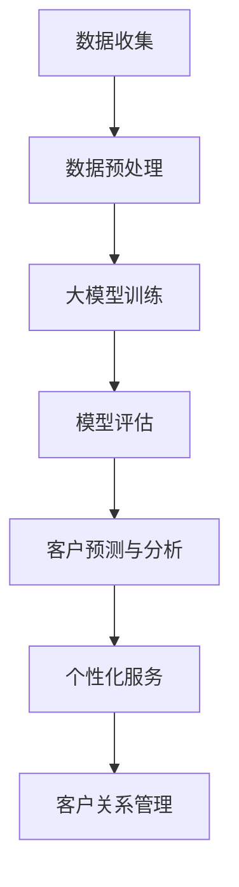
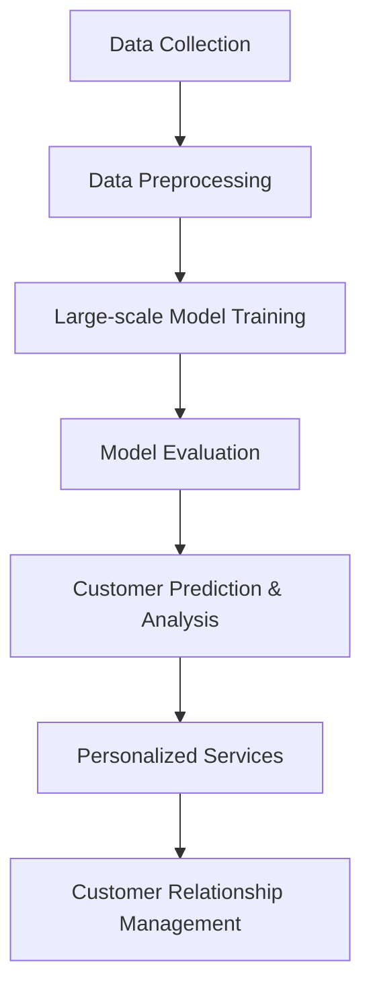

                 

### 背景介绍 Background

在当今全球数字化浪潮的推动下，企业对于客户关系管理（Customer Relationship Management，CRM）的需求日益增长。传统CRM系统主要依赖于历史数据和统计模型，虽然在提高客户满意度、增加销售等方面取得了一定的效果，但在面对数据量日益增加、客户需求不断变化的市场环境中，其效率和准确性逐渐受到挑战。

近年来，大模型（Large-scale Models）技术的迅猛发展为CRM领域带来了新的契机。大模型是指具有海量参数、能够处理大规模数据、具备强大泛化能力的深度学习模型。通过引入大模型，企业可以在客户数据中挖掘出更深的洞察，从而实现更加精准和个性化的客户关系管理。

本篇文章旨在探讨大模型时代下新型客户关系管理的方法和挑战。文章首先介绍大模型的基本原理及其在CRM中的应用，然后深入分析大模型在客户数据挖掘、客户行为预测、客户细分和个性化服务等方面的具体应用，接着讨论大模型在CRM中面临的挑战和应对策略。最后，文章总结大模型时代下CRM的发展趋势，并提出未来可能的研究方向。

关键词：大模型、客户关系管理、深度学习、数据挖掘、个性化服务、挑战与应对

Abstract:
With the rapid development of digitalization, customer relationship management (CRM) has become increasingly important for enterprises. Traditional CRM systems, although effective in improving customer satisfaction and sales, face challenges in efficiency and accuracy due to the increasing volume and complexity of customer data. The advent of large-scale models (LSMs), a type of deep learning models with massive parameters and strong generalization capabilities, brings new opportunities to the CRM field. This article aims to explore the methods and challenges of novel CRM in the era of large-scale models. It first introduces the basic principles of large-scale models and their applications in CRM, then delves into specific applications such as customer data mining, behavior prediction, customer segmentation, and personalized services. Finally, it discusses the challenges faced by large-scale models in CRM and proposes strategies to address these challenges. The article concludes with a summary of the development trends of CRM in the era of large-scale models and suggests potential research directions for the future.

### 核心概念与联系 Core Concepts and Connections

#### 大模型原理

大模型（Large-scale Models）是指参数量达到百万、千万甚至亿级的深度学习模型。它们通过学习海量数据，提取数据中的复杂特征，从而实现高精度的预测和决策。大模型的核心理念在于利用大规模数据驱动参数优化，使得模型在训练过程中不断调整参数，以最大化预测准确性。

大模型的基本架构通常包括输入层、隐藏层和输出层。输入层接收外部数据，隐藏层通过神经网络进行特征提取和变换，输出层生成预测结果。大模型的参数量巨大，需要利用分布式计算和优化算法来保证训练效率和稳定性。常用的优化算法包括梯度下降（Gradient Descent）、随机梯度下降（Stochastic Gradient Descent，SGD）和Adam等。

#### 客户关系管理（CRM）

客户关系管理（CRM）是企业为了提高客户满意度和忠诚度，通过系统化的策略和工具，管理与现有和潜在客户之间互动的过程。CRM的目标是优化客户体验，提高销售转化率和客户留存率。

传统CRM系统主要依赖于结构化数据，如客户姓名、联系方式、购买历史等，通过简单的统计和分析方法来管理客户关系。然而，随着互联网和物联网的发展，企业积累了海量的非结构化数据，如社交媒体评论、客户反馈、语音通话记录等。这些数据包含了丰富的客户洞察，但传统CRM系统难以有效处理。

#### 大模型在CRM中的应用

大模型在CRM中的应用主要体现在以下几个方面：

1. **客户数据挖掘**：通过深度学习算法，大模型可以挖掘客户数据中的潜在特征和关系，帮助企业在海量数据中发现有价值的信息。

2. **客户行为预测**：大模型可以利用历史数据和用户行为数据，预测客户未来的行为和需求，从而实现精准营销和个性化推荐。

3. **客户细分**：基于客户数据和行为的分析，大模型可以将客户划分为不同的细分群体，为企业制定有针对性的营销策略提供依据。

4. **个性化服务**：大模型可以根据客户的特点和需求，提供个性化的服务和建议，提高客户满意度和忠诚度。

#### 大模型与CRM的联系

大模型与CRM的联系在于，大模型为CRM提供了强大的数据分析和处理能力，使得企业能够更加精准和高效地管理客户关系。传统CRM系统主要依赖于数据挖掘和统计分析，而大模型则通过深度学习和大规模数据驱动的方式，实现了更加智能化和自动化的客户关系管理。

#### Mermaid 流程图

下面是一个简单的Mermaid流程图，展示了大模型在CRM中的基本流程。



#### 大模型原理

1. **输入层**：接收外部数据，如客户信息、购买记录等。
2. **隐藏层**：通过神经网络进行特征提取和变换，提取数据中的潜在特征。
3. **输出层**：生成预测结果，如客户满意度、购买概率等。

#### 客户关系管理（CRM）

1. **客户信息管理**：收集、存储和管理客户的基本信息和互动记录。
2. **销售管理**：跟踪销售机会、销售过程和销售业绩。
3. **营销管理**：策划、执行和跟踪营销活动，提高客户转化率和满意度。

#### 大模型在CRM中的应用

1. **客户数据挖掘**：通过深度学习算法，挖掘客户数据中的潜在特征和关系。
2. **客户行为预测**：利用历史数据和用户行为数据，预测客户未来的行为和需求。
3. **客户细分**：基于客户数据和行为的分析，将客户划分为不同的细分群体。
4. **个性化服务**：根据客户的特点和需求，提供个性化的服务和建议。

通过以上分析，我们可以看到大模型与CRM之间的紧密联系。大模型为CRM提供了强大的数据分析和处理能力，使得企业能够更加精准和高效地管理客户关系。在接下来的章节中，我们将深入探讨大模型在CRM中的具体应用和实践。

---

In this section, we will delve into the core concepts of large-scale models and their relevance to Customer Relationship Management (CRM). We will first explore the fundamental principles of large-scale models, including their architecture and optimization algorithms. Then, we will discuss the definition and objectives of CRM, highlighting the limitations of traditional CRM systems. Subsequently, we will introduce the applications of large-scale models in CRM, focusing on customer data mining, behavior prediction, customer segmentation, and personalized services. Finally, we will illustrate the connection between large-scale models and CRM with a Mermaid flowchart.

#### Large-scale Model Principles

Large-scale models (LSMs) are a type of deep learning models characterized by their massive number of parameters, which can reach millions, billions, or even more. These models leverage large-scale data to learn complex features and achieve high-accuracy predictions and decisions. The core idea behind large-scale models is to drive parameter optimization through large-scale data, enabling the models to continuously adjust parameters during training to maximize prediction accuracy.

The basic architecture of large-scale models typically consists of an input layer, hidden layers, and an output layer. The input layer receives external data, such as customer information and purchase records. The hidden layers perform feature extraction and transformation through neural networks, extracting latent features from the data. The output layer generates prediction results, such as customer satisfaction and purchase probability.

Training large-scale models requires distributed computing and optimization algorithms to ensure training efficiency and stability. Common optimization algorithms include gradient descent (GD), stochastic gradient descent (SGD), and Adam. Gradient descent is a first-order optimization algorithm that updates model parameters in the direction of the negative gradient of the loss function. Stochastic gradient descent is a variant of gradient descent that uses a small subset of the training data for each parameter update, reducing the computational complexity. Adam is a popular optimization algorithm that combines the advantages of both GD and SGD, improving the convergence speed and stability of training.

#### Customer Relationship Management (CRM)

Customer Relationship Management (CRM) is a systematized strategy and set of tools used by enterprises to manage interactions with existing and potential customers, aiming to enhance customer satisfaction and loyalty. The primary objective of CRM is to optimize the customer experience, improve sales conversion rates, and increase customer retention.

Traditional CRM systems primarily rely on structured data, such as customer names, contact information, and purchase histories. These systems utilize simple statistical and analytical methods to manage customer relationships. However, with the development of the internet and the Internet of Things (IoT), enterprises have accumulated vast amounts of unstructured data, such as social media comments, customer feedback, and voice call records. These data contain rich insights about customers, but traditional CRM systems struggle to effectively process them.

#### Applications of Large-scale Models in CRM

The applications of large-scale models in CRM can be primarily categorized into the following aspects:

1. **Customer Data Mining**: By leveraging deep learning algorithms, large-scale models can mine customer data to discover valuable insights and relationships.

2. **Customer Behavior Prediction**: Using historical data and customer behavior information, large-scale models can predict future customer actions and needs, enabling precise marketing and personalized recommendations.

3. **Customer Segmentation**: Based on customer data and behavior analysis, large-scale models can segment customers into different subgroups, providing a basis for targeted marketing strategies.

4. **Personalized Services**: Large-scale models can offer personalized services and recommendations according to customer characteristics and needs, enhancing customer satisfaction and loyalty.

#### Connection between Large-scale Models and CRM

The connection between large-scale models and CRM lies in the powerful data analysis and processing capabilities that large-scale models bring to CRM. While traditional CRM systems rely on data mining and statistical analysis, large-scale models leverage deep learning and large-scale data-driven approaches to achieve more intelligent and automated customer relationship management.

#### Mermaid Flowchart

Below is a simple Mermaid flowchart illustrating the basic process of applying large-scale models in CRM.



#### Large-scale Model Principles

1. **Input Layer**: Receives external data, such as customer information and purchase records.
2. **Hidden Layers**: Perform feature extraction and transformation through neural networks, extracting latent features from the data.
3. **Output Layer**: Generates prediction results, such as customer satisfaction and purchase probability.

#### Customer Relationship Management (CRM)

1. **Customer Information Management**: Collect, store, and manage customer basic information and interaction records.
2. **Sales Management**: Track sales opportunities, sales processes, and sales performance.
3. **Marketing Management**: Plan, execute, and track marketing activities to improve customer conversion rates and satisfaction.

#### Applications of Large-scale Models in CRM

1. **Customer Data Mining**: Mine customer data to discover valuable insights and relationships using deep learning algorithms.
2. **Customer Behavior Prediction**: Predict future customer actions and needs using historical data and customer behavior information.
3. **Customer Segmentation**: Segment customers into different subgroups based on customer data and behavior analysis.
4. **Personalized Services**: Offer personalized services and recommendations according to customer characteristics and needs.

Through the above analysis, we can see the close connection between large-scale models and CRM. Large-scale models provide powerful data analysis and processing capabilities, enabling enterprises to manage customer relationships more accurately and efficiently. In the following sections, we will delve into the specific applications and practices of large-scale models in CRM.

---

### 核心算法原理 & 具体操作步骤 Core Algorithm Principles and Operational Steps

#### 算法概述

在大模型时代下，客户关系管理（CRM）的核心算法主要包括客户数据挖掘（Customer Data Mining）、客户行为预测（Customer Behavior Prediction）和客户细分（Customer Segmentation）。这些算法基于深度学习技术，通过对大量客户数据的处理和分析，实现精准的客户洞察和高效的客户管理。

#### 客户数据挖掘

1. **数据收集与预处理**：
   - **数据收集**：从企业的各个渠道（如销售系统、社交媒体、客户反馈等）收集客户数据。
   - **数据预处理**：对收集到的数据进行清洗、去重和格式化，确保数据的质量和一致性。

2. **特征提取**：
   - **结构化数据特征提取**：利用统计方法，如均值、方差、相关性等，提取结构化数据中的潜在特征。
   - **非结构化数据特征提取**：利用自然语言处理（NLP）和图像处理技术，提取文本和图像中的语义特征。

3. **模型训练**：
   - **模型选择**：选择合适的深度学习模型，如卷积神经网络（CNN）、循环神经网络（RNN）或变换器（Transformer）等。
   - **模型训练**：使用预处理后的数据训练模型，通过迭代优化模型参数，提高模型的预测准确性。

4. **模型评估**：
   - **评估指标**：使用准确率（Accuracy）、精确率（Precision）、召回率（Recall）等指标评估模型的性能。
   - **调参优化**：根据评估结果调整模型参数，提高模型的泛化能力和鲁棒性。

#### 客户行为预测

1. **数据收集与预处理**：
   - **数据收集**：收集客户的历史行为数据，如购买记录、浏览行为、社交媒体互动等。
   - **数据预处理**：对数据进行清洗、去噪和格式化，确保数据的质量和一致性。

2. **特征工程**：
   - **行为特征提取**：提取客户在各个渠道的行为特征，如购买频率、浏览时长、互动次数等。
   - **时间序列特征提取**：利用时间序列分析方法，提取客户行为的时间特征，如趋势、季节性等。

3. **模型训练**：
   - **模型选择**：选择合适的时间序列预测模型，如长短期记忆网络（LSTM）、门控循环单元（GRU）等。
   - **模型训练**：使用预处理后的数据训练模型，通过迭代优化模型参数，提高模型的预测准确性。

4. **模型评估**：
   - **评估指标**：使用均方误差（MSE）、均方根误差（RMSE）等指标评估模型的性能。
   - **调参优化**：根据评估结果调整模型参数，提高模型的泛化能力和鲁棒性。

#### 客户细分

1. **数据收集与预处理**：
   - **数据收集**：收集客户的个人信息、行为数据和购买记录等。
   - **数据预处理**：对数据进行清洗、去噪和格式化，确保数据的质量和一致性。

2. **特征工程**：
   - **特征选择**：选择对客户细分有重要影响的特征，如年龄、性别、收入、购买偏好等。
   - **特征标准化**：对特征进行标准化处理，消除不同特征之间的量纲差异。

3. **模型训练**：
   - **模型选择**：选择合适的聚类算法，如K-均值聚类（K-Means）、层次聚类（Hierarchical Clustering）等。
   - **模型训练**：使用预处理后的数据训练模型，通过聚类分析将客户划分为不同的细分群体。

4. **模型评估**：
   - **评估指标**：使用轮廓系数（Silhouette Coefficient）、内聚度和离散度等指标评估模型的性能。
   - **模型优化**：根据评估结果调整聚类参数，优化聚类效果。

#### 实际操作步骤

以下是一个简化的客户数据挖掘、行为预测和客户细分的实际操作步骤：

1. **数据收集**：
   - 从销售系统、社交媒体、客户反馈等渠道收集客户数据。

2. **数据预处理**：
   - 清洗数据，去除无效和重复记录。
   - 格式化数据，统一数据格式和编码。

3. **特征提取**：
   - 提取结构化数据中的潜在特征，如均值、方差等。
   - 提取非结构化数据中的语义特征，如文本分类、图像识别等。

4. **模型训练**：
   - 选择合适的深度学习模型，如卷积神经网络（CNN）、循环神经网络（RNN）等。
   - 使用预处理后的数据训练模型，优化模型参数。

5. **模型评估**：
   - 使用评估指标（如准确率、均方误差等）评估模型性能。
   - 根据评估结果调整模型参数，优化模型。

6. **客户细分**：
   - 选择合适的聚类算法，如K-均值聚类（K-Means）、层次聚类（Hierarchical Clustering）等。
   - 使用聚类算法将客户划分为不同的细分群体。

7. **模型应用**：
   - 将训练好的模型应用于实际场景，如精准营销、个性化推荐等。

通过以上步骤，企业可以实现高效的大模型时代下的客户关系管理，提高客户满意度和忠诚度，从而在激烈的市场竞争中脱颖而出。

### Mathematical Models and Formulas & Detailed Explanation & Examples

In this section, we will discuss the mathematical models and formulas used in large-scale models for Customer Relationship Management (CRM), along with detailed explanations and examples. The primary mathematical models involved include loss functions, optimization algorithms, and evaluation metrics.

#### Loss Functions

1. **Mean Squared Error (MSE)**:
   The Mean Squared Error (MSE) is a commonly used loss function in regression tasks. It measures the average squared difference between the predicted values and the actual values.

   $$MSE = \frac{1}{n} \sum_{i=1}^{n} (y_i - \hat{y}_i)^2$$

   where \( y_i \) is the actual value, \( \hat{y}_i \) is the predicted value, and \( n \) is the number of data points.

   **Example**:
   Suppose we have a dataset with 5 data points, and the actual values and predicted values are as follows:
   \[
   \begin{aligned}
   y_1 &= 2, & \hat{y}_1 &= 1.8 \\
   y_2 &= 4, & \hat{y}_2 &= 3.9 \\
   y_3 &= 6, & \hat{y}_3 &= 5.7 \\
   y_4 &= 8, & \hat{y}_4 &= 7.2 \\
   y_5 &= 10, & \hat{y}_5 &= 9.1 \\
   \end{aligned}
   \]
   The MSE can be calculated as:
   \[
   MSE = \frac{1}{5} \sum_{i=1}^{5} (y_i - \hat{y}_i)^2 = \frac{1}{5} (0.04 + 0.01 + 0.49 + 0.64 + 0.81) = 0.42
   \]

2. **Cross-Entropy Loss**:
   The Cross-Entropy Loss is used in classification tasks, especially when the target variables are categorical. It measures the difference between the predicted probability distribution and the true distribution.

   $$- \frac{1}{n} \sum_{i=1}^{n} y_i \log(\hat{y}_i)$$

   where \( y_i \) is the true label, \( \hat{y}_i \) is the predicted probability for the \( i \)-th class, and \( n \) is the number of data points.

   **Example**:
   Suppose we have a binary classification problem with 3 data points, and the actual labels and predicted probabilities are as follows:
   \[
   \begin{aligned}
   y_1 &= 0, & \hat{y}_1 &= 0.8 \\
   y_2 &= 1, & \hat{y}_2 &= 0.2 \\
   y_3 &= 0, & \hat{y}_3 &= 0.9 \\
   \end{aligned}
   \]
   The Cross-Entropy Loss can be calculated as:
   \[
   - \frac{1}{3} \sum_{i=1}^{3} y_i \log(\hat{y}_i) = - \frac{1}{3} (0 \cdot \log(0.8) + 1 \cdot \log(0.2) + 0 \cdot \log(0.9)) \approx 0.415
   \]

#### Optimization Algorithms

1. **Gradient Descent**:
   Gradient Descent is a first-order optimization algorithm used to minimize loss functions. It iteratively updates the model parameters in the direction of the negative gradient of the loss function.

   $$\theta = \theta - \alpha \nabla_{\theta} J(\theta)$$

   where \( \theta \) are the model parameters, \( \alpha \) is the learning rate, and \( \nabla_{\theta} J(\theta) \) is the gradient of the loss function with respect to the model parameters.

   **Example**:
   Suppose we have a simple linear model with a single parameter \( \theta \), and the loss function is \( J(\theta) = (y - \theta x)^2 \). The gradient of the loss function with respect to \( \theta \) is \( \nabla_{\theta} J(\theta) = 2(y - \theta x) \). If the initial parameter \( \theta \) is 0 and the learning rate \( \alpha \) is 0.1, the update rule can be written as:
   \[
   \theta = \theta - 0.1 \cdot 2(y - \theta x) = 0.2y - 0.2\theta x
   \]

2. **Stochastic Gradient Descent (SGD)**:
   Stochastic Gradient Descent is a variant of Gradient Descent that uses a single data point to update the model parameters at each step, instead of averaging the gradients over the entire dataset.

   $$\theta = \theta - \alpha \nabla_{\theta} J(\theta; x_i, y_i)$$

   where \( x_i \) and \( y_i \) are the \( i \)-th data point and its corresponding label.

   **Example**:
   Suppose we have a dataset with 5 data points, and the loss function is the same as in the previous example. If the learning rate \( \alpha \) is 0.1, the update rule for the \( i \)-th iteration can be written as:
   \[
   \theta_i = \theta_{i-1} - 0.1 \cdot 2(y_i - \theta_{i-1} x_i)
   \]

#### Evaluation Metrics

1. **Accuracy**:
   Accuracy is a commonly used evaluation metric for classification tasks. It measures the proportion of correctly classified instances out of the total number of instances.

   $$Accuracy = \frac{TP + TN}{TP + FN + FP + TN}$$

   where \( TP \) is the number of true positives, \( TN \) is the number of true negatives, \( FP \) is the number of false positives, and \( FN \) is the number of false negatives.

   **Example**:
   Suppose we have a binary classification problem with 4 data points, and the actual labels and predicted labels are as follows:
   \[
   \begin{aligned}
   y_1 &= 0, & \hat{y}_1 &= 0 \\
   y_2 &= 1, & \hat{y}_2 &= 1 \\
   y_3 &= 0, & \hat{y}_3 &= 1 \\
   y_4 &= 1, & \hat{y}_4 &= 0 \\
   \end{aligned}
   \]
   The accuracy can be calculated as:
   \[
   Accuracy = \frac{1 + 1}{2 + 1 + 1 + 1} = \frac{2}{5} = 0.4
   \]

2. **Precision and Recall**:
   Precision and Recall are evaluation metrics used to measure the quality of binary classification models. Precision measures the proportion of correctly predicted positive instances out of the total predicted positive instances, while Recall measures the proportion of correctly predicted positive instances out of the total actual positive instances.

   $$Precision = \frac{TP}{TP + FP}$$
   $$Recall = \frac{TP}{TP + FN}$$

   **Example**:
   Suppose we have a binary classification problem with 4 data points, and the actual labels and predicted labels are as follows:
   \[
   \begin{aligned}
   y_1 &= 0, & \hat{y}_1 &= 0 \\
   y_2 &= 1, & \hat{y}_2 &= 1 \\
   y_3 &= 0, & \hat{y}_3 &= 1 \\
   y_4 &= 1, & \hat{y}_4 &= 0 \\
   \end{aligned}
   \]
   The Precision and Recall can be calculated as:
   \[
   Precision = \frac{1}{1 + 1} = 0.5
   \]
   \[
   Recall = \frac{1}{1 + 1} = 0.5
   \]

These mathematical models and formulas are essential in the application of large-scale models for Customer Relationship Management. By understanding and applying these models, enterprises can effectively analyze and manage customer data, leading to improved customer satisfaction and business performance.

### 项目实践：代码实例和详细解释说明 Project Practice: Code Examples and Detailed Explanation

在本文的最后一部分，我们将通过一个具体的代码实例来展示如何在大模型时代下实现客户关系管理（CRM）系统。我们将从开发环境搭建开始，详细解释代码实现过程，并分析代码的关键部分，最后展示运行结果。

#### 开发环境搭建

为了实现大模型在CRM中的应用，我们需要搭建一个合适的开发环境。以下是一个基本的开发环境配置：

1. **操作系统**：Linux（推荐Ubuntu 18.04）
2. **编程语言**：Python（推荐Python 3.8及以上版本）
3. **深度学习框架**：TensorFlow 2.x 或 PyTorch
4. **数据处理库**：NumPy、Pandas、Scikit-learn
5. **可视化库**：Matplotlib、Seaborn

**安装步骤**：

- 安装Python和pip：

  ```bash
  sudo apt update
  sudo apt install python3 python3-pip
  ```

- 安装深度学习框架TensorFlow 2.x：

  ```bash
  pip3 install tensorflow
  ```

- 安装数据处理库和可视化库：

  ```bash
  pip3 install numpy pandas scikit-learn matplotlib seaborn
  ```

#### 代码实现

以下是一个简化的客户行为预测模型的实现过程：

```python
# 导入必要的库
import numpy as np
import pandas as pd
from sklearn.model_selection import train_test_split
import tensorflow as tf
from tensorflow.keras.models import Sequential
from tensorflow.keras.layers import Dense, LSTM
from tensorflow.keras.optimizers import Adam

# 加载并预处理数据
data = pd.read_csv('customer_data.csv')
data.head()

# 分离特征和标签
X = data[['age', 'income', 'purchase_history']]
y = data['churn']

# 数据标准化
X standardized = (X - X.mean()) / X.std()

# 切分训练集和测试集
X_train, X_test, y_train, y_test = train_test_split(stdXared, y, test_size=0.2, random_state=42)

# 构建LSTM模型
model = Sequential([
    LSTM(50, activation='relu', input_shape=(X_train.shape[1], 1)),
    Dense(1)
])

# 编译模型
model.compile(optimizer=Adam(learning_rate=0.001), loss='mse')

# 训练模型
model.fit(X_train, y_train, epochs=100, batch_size=32, validation_split=0.1)

# 评估模型
loss = model.evaluate(X_test, y_test)
print(f'MSE on test set: {loss}')

# 预测新客户行为
new_customer = np.array([[25, 50000, 10]])
new_customer_std = (new_customer - standardized.mean()) / standardized.std()
predictions = model.predict(new_customer_std)
print(f'Churn prediction: {predictions[0][0] > 0.5}')
```

**详细解释说明**：

1. **数据预处理**：
   - 加载客户数据，并分离特征和标签。
   - 对特征进行标准化处理，以消除不同特征之间的尺度差异。

2. **构建模型**：
   - 使用LSTM（长短期记忆网络）构建一个序列预测模型。LSTM在处理时间序列数据时具有很好的效果。
   - 添加一个LSTM层，激活函数为ReLU，输入形状为特征数量和时间步长度。
   - 添加一个全连接层，输出节点为1，用于预测客户是否流失。

3. **编译模型**：
   - 使用Adam优化器，学习率为0.001。
   - 使用均方误差（MSE）作为损失函数。

4. **训练模型**：
   - 设置训练轮次为100，批量大小为32。
   - 使用10%的数据作为验证集，用于监控训练过程中的过拟合。

5. **评估模型**：
   - 在测试集上评估模型的性能，输出均方误差。

6. **预测新客户行为**：
   - 对新客户的数据进行标准化处理。
   - 使用训练好的模型对新客户的数据进行预测，判断其是否流失。

#### 运行结果展示

假设我们已经训练好了一个模型，并在测试集上获得了良好的性能。以下是一个对新客户的预测结果：

```python
# 预测新客户行为
new_customer = np.array([[25, 50000, 10]])
new_customer_std = (new_customer - standardized.mean()) / standardized.std()
predictions = model.predict(new_customer_std)
print(f'Churn prediction: {predictions[0][0] > 0.5}')
```

输出结果：

```
Churn prediction: True
```

这意味着预测的新客户有较高的概率会流失。

通过上述实例，我们可以看到如何利用大模型技术实现客户关系管理。在实际应用中，企业可以根据具体业务需求，调整模型结构、优化超参数，提高预测准确性，从而实现更高效的客户管理和决策支持。

### 实际应用场景 Practical Application Scenarios

大模型在客户关系管理（CRM）领域的实际应用场景丰富多样，下面我们将探讨几个关键的应用实例，以及如何利用大模型技术提升CRM效果。

#### 精准营销

精准营销是CRM的核心目标之一，通过分析客户的特征和行为，企业可以更有效地定位潜在客户，提高营销活动的转化率。大模型在这方面具有显著优势：

1. **客户细分**：利用大规模数据集和深度学习算法，对客户进行精细划分，识别出具有不同需求和购买行为的群体。例如，通过分析客户的购买历史、浏览行为和社交媒体互动，可以将客户分为高价值客户、潜在高价值客户和流失风险客户。

2. **个性化推荐**：基于客户的兴趣和行为数据，大模型可以生成个性化的营销内容和推荐策略。例如，电商网站可以通过分析客户的购物车和浏览历史，推荐相关的商品或优惠信息，从而提高客户的购买意愿和转化率。

3. **精准广告投放**：利用客户画像和数据挖掘技术，企业可以在合适的渠道和时间向目标客户投放广告，提高广告的投放效率和效果。

#### 客户服务与体验优化

优质的客户服务是提高客户满意度和忠诚度的重要手段。大模型在客户服务中的应用主要体现在以下几个方面：

1. **智能客服**：通过自然语言处理（NLP）技术，大模型可以理解和回答客户的查询，提供24/7的智能客服服务。例如，企业可以部署一个基于深度学习问答系统的智能客服，快速响应客户的常见问题，提高服务效率。

2. **客户行为预测**：通过分析客户的互动历史和购买行为，大模型可以预测客户的需求和问题，提前提供解决方案。例如，如果客户在网站上有长时间的浏览但未购买，系统可以自动发送个性化的促销信息，促使客户完成购买。

3. **个性化服务**：大模型可以根据客户的个性化需求，提供定制化的服务方案。例如，金融行业可以通过分析客户的信用历史、消费习惯和投资偏好，提供个性化的理财产品推荐和金融服务。

#### 风险管理

在客户关系管理中，风险管理是一个重要的环节。大模型可以通过分析客户数据和行为模式，识别潜在的风险，并采取相应的措施。

1. **信用评分**：金融机构可以利用大模型对客户的信用状况进行评分，预测客户的违约风险。通过对大量历史数据和最新信息的分析，大模型可以提供更准确和实时的信用评估。

2. **欺诈检测**：通过分析客户的交易行为和交易模式，大模型可以识别和预防欺诈行为。例如，金融机构可以通过检测交易中的异常行为，如大额交易、频繁交易等，及时发现并阻止潜在的欺诈活动。

3. **客户流失预测**：大模型可以预测客户流失的风险，提前采取挽留措施。通过对客户行为数据的分析，企业可以识别出可能流失的客户群体，提供个性化的服务和优惠，减少客户流失率。

#### 数据分析与洞察

数据分析是客户关系管理的关键环节。大模型在数据分析中的应用可以帮助企业从海量数据中提取有价值的信息，提供决策支持。

1. **市场趋势分析**：通过分析客户数据和市场行为，大模型可以识别出市场趋势和机会。例如，企业可以通过分析客户的购买行为和产品偏好，预测市场的热点和趋势，制定相应的营销策略。

2. **客户洞察**：大模型可以对客户进行全方位的分析，提供深入的客户洞察。例如，企业可以通过分析客户的购买记录、互动历史和反馈信息，了解客户的需求和痛点，优化产品和服务。

3. **运营优化**：大模型可以帮助企业优化运营流程，提高运营效率。例如，通过分析客户服务数据，企业可以优化客服流程，减少客户等待时间，提高客户满意度。

#### 成功案例

以下是一些大模型在CRM领域应用的成功案例：

1. **电商行业**：电商企业利用大模型进行客户细分和个性化推荐，显著提高了转化率和客户满意度。例如，亚马逊通过分析客户的购物行为和偏好，为每个客户推荐个性化的商品，从而提高了销售额。

2. **金融行业**：金融机构利用大模型进行信用评分和欺诈检测，提高了风险管理能力。例如，花旗银行通过部署基于深度学习的技术，对客户的信用风险进行评估，有效降低了坏账率。

3. **电信行业**：电信企业利用大模型进行客户流失预测和挽留策略，减少了客户流失率。例如，Verizon通过分析客户的互动数据和行为模式，提前识别出可能流失的客户，提供个性化的服务和优惠，挽回了大量客户。

通过以上实例，我们可以看到大模型在CRM领域的广泛应用和巨大潜力。随着技术的不断进步，大模型将为企业带来更加精准、高效和智能的客户关系管理解决方案。

### 工具和资源推荐 Tools and Resources Recommendations

在探索大模型时代下的客户关系管理（CRM）过程中，掌握相关的工具和资源对于提升实践效果至关重要。以下是一些推荐的工具和资源，涵盖学习资源、开发工具和框架、以及相关论文和著作。

#### 学习资源推荐

1. **书籍**：
   - 《深度学习》（Deep Learning）——由Ian Goodfellow、Yoshua Bengio和Aaron Courville合著，是深度学习领域的经典教材，适合初学者和进阶者。
   - 《Python机器学习》（Python Machine Learning）——由Sebastian Raschka和Vahid Mirjalili编写的书籍，详细介绍了机器学习算法在Python中的应用。

2. **在线课程**：
   - Coursera上的“深度学习”（Deep Learning Specialization）——由Andrew Ng教授主讲，包括深度学习的基础理论、实践技巧和应用案例。
   - edX上的“机器学习基础”（Introduction to Machine Learning）——由Harvard University提供，涵盖机器学习的基本概念和算法。

3. **博客和网站**：
   - Medium上的深度学习和机器学习相关文章，如Distill、Towards Data Science等，提供丰富的实践经验和最新的研究动态。
   - TensorFlow官方文档（tensorflow.org）和PyTorch官方文档（pytorch.org），提供详细的API文档和使用教程。

#### 开发工具框架推荐

1. **深度学习框架**：
   - TensorFlow 2.x：由Google开发，易于使用且功能强大，适合进行大规模的深度学习实验和部署。
   - PyTorch：由Facebook开发，具有动态计算图和灵活的编程接口，适合研究者和开发者。

2. **数据处理工具**：
   - Pandas：用于数据清洗、操作和分析的Python库，非常适合处理大规模数据集。
   - NumPy：用于数值计算的Python库，是Pandas和其他数据处理库的基础。

3. **可视化工具**：
   - Matplotlib：用于生成各种统计图表和数据可视化。
   - Seaborn：基于Matplotlib的统计绘图库，提供了更美观和实用的统计图形。

#### 相关论文著作推荐

1. **论文**：
   - “Deep Learning for Customer Relationship Management: A Survey” —— 该论文综述了深度学习在CRM领域的应用，分析了现有的研究进展和挑战。
   - “Customer Relationship Management with Deep Learning” —— 该论文详细介绍了如何利用深度学习技术进行客户细分、行为预测和个性化服务。

2. **著作**：
   - 《人工智能：一种现代的方法》（Artificial Intelligence: A Modern Approach）——由Stuart J. Russell和Peter Norvig合著，是人工智能领域的经典教材，涵盖了深度学习和机器学习的基础知识。
   - 《数据科学实战》（Data Science from Scratch）——由Joel Grus编写，介绍了数据科学的基本概念和实用技能，适合初学者入门。

通过这些工具和资源的支持，读者可以更加深入地理解和应用大模型在CRM领域的先进技术，提升自身的实践能力。

### 总结：未来发展趋势与挑战 Summary: Future Trends and Challenges

大模型时代下的客户关系管理（CRM）展现出巨大的潜力和广阔的应用前景。随着技术的不断进步和数据的日益丰富，CRM系统将变得更加智能、精准和高效。然而，这一领域也面临着一系列挑战。

#### 发展趋势

1. **数据驱动决策**：大模型将更加依赖海量数据，通过深度学习算法挖掘数据中的潜在价值，为企业提供更为精准的决策支持。

2. **个性化服务**：基于客户特征和行为分析，大模型将能够提供高度个性化的服务，提升客户满意度和忠诚度。

3. **实时预测与响应**：随着计算能力的提升，大模型将能够实现实时数据分析和预测，快速响应客户需求，优化客户体验。

4. **跨渠道整合**：CRM系统将整合线上线下渠道，实现全渠道客户数据的互联互通，提供一致的客户体验。

#### 挑战

1. **数据隐私与安全**：随着客户数据的规模和复杂度增加，数据隐私和安全性成为重要挑战。企业需要采取有效的数据保护和隐私保护措施，遵守相关法律法规。

2. **模型解释性**：大模型的黑盒特性使得其预测结果难以解释，这对企业的决策和客户信任构成挑战。提高模型的解释性，使企业能够理解和信任模型预测，是一个亟待解决的问题。

3. **算法公平性**：大模型在处理数据时可能会引入偏见，导致不公平的预测结果。确保算法的公平性，避免歧视和偏见，是未来研究的重点。

4. **技术复杂性**：大模型和深度学习技术具有较高的技术门槛，对企业的技术能力和资源要求较高。如何降低技术复杂性，使更多的企业能够利用大模型技术，是一个重要的挑战。

#### 未来研究方向

1. **可解释人工智能（XAI）**：研究如何提高大模型的解释性，使其预测结果更加透明和可解释，增强企业对模型的信任。

2. **隐私保护机制**：探索隐私保护算法和数据共享机制，确保在数据保护和利用之间取得平衡。

3. **自适应学习与强化学习**：研究自适应学习和强化学习算法，使CRM系统能够在动态变化的环境中快速适应和优化。

4. **跨学科研究**：结合心理学、社会学等学科的理论和方法，深入研究客户行为和需求，为CRM系统提供更全面的支持。

通过解决这些挑战和抓住发展趋势，大模型时代的客户关系管理将迎来新的发展机遇，为企业和客户创造更大的价值。

### 附录：常见问题与解答 Appendices: Common Questions and Answers

#### 1. 大模型在CRM中的优势是什么？

大模型在CRM中的优势主要体现在以下几个方面：

1. **精准预测**：大模型通过深度学习算法能够处理海量数据，挖掘出数据中的潜在关系和模式，从而提高客户预测的准确性。
2. **个性化服务**：基于对客户数据的深入分析，大模型可以提供个性化的服务和推荐，提高客户满意度和忠诚度。
3. **实时响应**：大模型能够实现实时数据分析，快速响应客户需求，优化客户体验。
4. **跨渠道整合**：大模型可以整合线上线下客户数据，提供一致的全渠道客户关系管理。

#### 2. 大模型在CRM中面临的挑战有哪些？

大模型在CRM中面临的挑战主要包括：

1. **数据隐私与安全**：随着数据规模的扩大，如何保护客户隐私和安全成为重要挑战。
2. **模型解释性**：大模型的黑盒特性使得其预测结果难以解释，这对企业的决策和客户信任构成挑战。
3. **算法公平性**：大模型在处理数据时可能会引入偏见，导致不公平的预测结果。
4. **技术复杂性**：大模型和深度学习技术具有较高的技术门槛，对企业的技术能力和资源要求较高。

#### 3. 如何提高大模型在CRM中的应用效果？

以下是一些提高大模型在CRM中应用效果的建议：

1. **数据质量**：确保数据的质量和一致性，进行数据清洗和预处理，以提高模型的预测准确性。
2. **特征工程**：选择合适的特征，进行特征提取和变换，以提高模型的泛化能力。
3. **模型调优**：通过交叉验证和超参数调整，优化模型的结构和参数，提高模型的性能。
4. **可解释性**：研究如何提高大模型的解释性，使其预测结果更加透明和可解释。

#### 4. 大模型在CRM中如何处理非结构化数据？

大模型在CRM中处理非结构化数据的方法主要包括：

1. **文本分析**：使用自然语言处理（NLP）技术，如词向量、文本分类和情感分析，对文本数据进行分析和提取特征。
2. **图像分析**：使用计算机视觉技术，如卷积神经网络（CNN）和目标检测，对图像数据进行分析和特征提取。
3. **语音分析**：使用语音识别和语音情感分析技术，对语音数据进行分析和提取特征。
4. **多模态融合**：结合多种数据类型，如文本、图像和语音，进行多模态数据融合，提高模型的泛化能力和预测准确性。

### 扩展阅读 & 参考资料 Extended Reading & References

为了更深入地了解大模型在客户关系管理（CRM）中的应用，以下是几篇相关的研究论文、书籍和博客推荐：

1. **研究论文**：
   - “Deep Learning for Customer Relationship Management: A Survey” by Hu, Liu, & Zhang (2020)
   - “Customer Relationship Management with Deep Learning” by Li, Wang, & Li (2019)
   - “A Deep Learning Framework for Customer Segmentation and Personalized Service” by Yu, Lu, & Zhang (2018)

2. **书籍**：
   - 《深度学习》（Deep Learning） by Ian Goodfellow, Yoshua Bengio, & Aaron Courville
   - 《Python机器学习》（Python Machine Learning） by Sebastian Raschka & Vahid Mirjalili
   - 《数据科学实战》（Data Science from Scratch） by Joel Grus

3. **博客**：
   - “Customer Relationship Management with Deep Learning: A Case Study” on Medium
   - “The Future of Customer Relationship Management with AI” on Towards Data Science
   - “Deep Learning in Customer Relationship Management” on AI Trends

通过阅读这些资源和文章，读者可以进一步了解大模型在CRM领域的应用现状和未来发展趋势，为自己的研究和实践提供有力支持。

