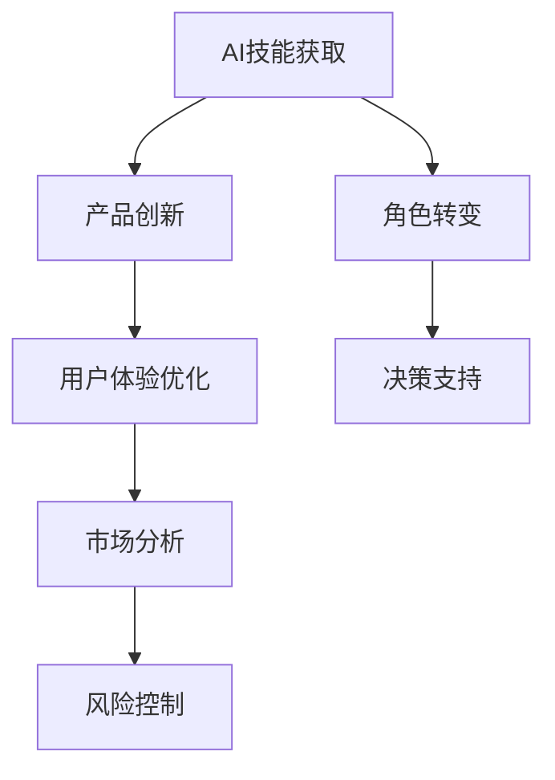

                 

### 文章标题

《大模型时代的创业产品经理指南：AI 技能与转型》

关键词：大模型、创业产品经理、AI 技能、转型、创业策略

摘要：本文旨在为创业产品经理提供在大模型时代下的发展指南。通过深入分析AI技术的发展趋势，本文探讨了产品经理应具备的AI技能，并提出了转型策略，帮助产品经理在快速变化的科技领域中立足和发展。

### 1. 背景介绍

随着人工智能技术的飞速发展，大数据、云计算和深度学习等技术的结合，推动了“大模型”时代的到来。大模型不仅具备处理海量数据的能力，还能够通过学习数据中的模式进行智能决策，从而在各个领域产生了深远影响。在这场技术变革中，创业产品经理的角色和职责也发生了巨大转变。

创业产品经理不仅要关注产品的用户体验和市场定位，还需要深入了解AI技术的基本原理和趋势，掌握AI技能，以便在产品设计和决策过程中发挥人工智能的优势。因此，如何在大模型时代进行自我转型，成为具备AI技能的产品经理，是当前创业产品经理面临的重要课题。

### 2. 核心概念与联系

#### 2.1 AI技能的概念

AI技能是指产品经理在人工智能领域的知识、技术和能力。具体包括：

- **数据思维**：能够理解数据的价值，掌握数据分析和处理的基本方法。

- **机器学习知识**：了解机器学习的基本原理，包括监督学习、无监督学习和强化学习等。

- **自然语言处理**：理解自然语言处理的基本概念，如文本分类、情感分析和语言生成等。

- **计算机视觉**：了解计算机视觉的基本原理，如图像识别、目标检测和图像生成等。

#### 2.2 AI技能与产品经理角色的联系

AI技能对产品经理角色的影响主要体现在以下几个方面：

- **产品创新**：AI技能可以帮助产品经理发现新的商业机会，设计具有创新性的产品。

- **用户体验优化**：通过AI技术，产品经理可以更好地理解用户需求，优化用户体验。

- **市场分析**：利用AI技术进行市场分析，帮助产品经理做出更精准的市场预测和决策。

- **风险控制**：AI技能有助于产品经理识别潜在的风险，并采取相应的措施进行控制。

#### 2.3 Mermaid流程图



### 3. 核心算法原理 & 具体操作步骤

#### 3.1 数据思维

数据思维是AI技能的基础，具体操作步骤如下：

- **数据收集**：收集相关领域的数据，包括结构化和非结构化数据。

- **数据清洗**：对数据进行清洗，去除重复、错误和无关的数据。

- **数据探索**：利用数据可视化工具进行数据探索，发现数据中的规律和趋势。

- **数据建模**：根据业务需求，选择合适的算法进行数据建模。

#### 3.2 机器学习知识

机器学习知识主要包括以下几个步骤：

- **问题定义**：明确需要解决的问题，确定目标变量。

- **数据准备**：收集和整理数据，进行数据预处理。

- **模型选择**：选择合适的机器学习算法，如线性回归、决策树或神经网络等。

- **模型训练**：使用训练数据对模型进行训练。

- **模型评估**：使用验证数据对模型进行评估，调整模型参数。

- **模型部署**：将训练好的模型部署到生产环境中，进行实时预测。

#### 3.3 自然语言处理

自然语言处理主要包括以下几个步骤：

- **文本预处理**：对文本进行分词、去除停用词等预处理操作。

- **特征提取**：从预处理后的文本中提取特征，如词袋模型、TF-IDF等。

- **模型训练**：使用训练数据对模型进行训练。

- **模型评估**：使用验证数据对模型进行评估。

- **模型部署**：将训练好的模型部署到生产环境中，进行实时预测。

#### 3.4 计算机视觉

计算机视觉主要包括以下几个步骤：

- **图像预处理**：对图像进行灰度化、二值化、滤波等预处理操作。

- **特征提取**：从预处理后的图像中提取特征，如SIFT、HOG等。

- **模型训练**：使用训练数据对模型进行训练。

- **模型评估**：使用验证数据对模型进行评估。

- **模型部署**：将训练好的模型部署到生产环境中，进行实时预测。

### 4. 数学模型和公式 & 详细讲解 & 举例说明

#### 4.1 数据思维

- **数据建模**：线性回归模型
  $$ y = wx + b $$
  其中，\( y \) 为目标变量，\( x \) 为自变量，\( w \) 为权重，\( b \) 为偏置。

- **特征提取**：TF-IDF
  $$ TF \cdot IDF = \frac{f_t}{\sum f_t} \cdot \log \left( \frac{N}{n_t} \right) $$
  其中，\( f_t \) 为词 \( t \) 在文档中出现的次数，\( N \) 为文档总数，\( n_t \) 为包含词 \( t \) 的文档数。

#### 4.2 机器学习知识

- **模型选择**：决策树
  $$ h(x) = \sum_{i=1}^n w_i \cdot I(x \in R_i) $$
  其中，\( h(x) \) 为决策函数，\( w_i \) 为权重，\( R_i \) 为区域。

- **模型训练**：神经网络
  $$ a_{\text{layer}} = \sigma(\mathbf{W} \cdot a_{\text{layer-1}} + b) $$
  其中，\( a_{\text{layer}} \) 为第 \( \text{layer} \) 层的激活值，\( \sigma \) 为激活函数，\( \mathbf{W} \) 为权重，\( b \) 为偏置。

#### 4.3 自然语言处理

- **文本预处理**：分词
  $$ "我爱北京天安门" \rightarrow ["我", "爱", "北京", "天安门"] $$

- **特征提取**：词袋模型
  $$ V = \{ "我", "爱", "北京", "天安门" \} $$
  $$ B = \begin{bmatrix}
  1 & 1 & 0 & 0 \\
  \end{bmatrix} $$

#### 4.4 计算机视觉

- **图像预处理**：SIFT特征提取
  $$ d(\text{sift}, \text{sift}') = \exp \left( -\frac{||\text{sift} - \text{sift}'||^2}{2\sigma^2} \right) $$

- **模型训练**：支持向量机
  $$ w^* = \arg\min_{w, b} \frac{1}{2} ||w||^2 + C \sum_{i=1}^n \max(0, 1 - y_i (w \cdot x_i + b)) $$

### 5. 项目实践：代码实例和详细解释说明

#### 5.1 开发环境搭建

- 硬件环境：配置较高的计算机或服务器。
- 软件环境：安装Python、TensorFlow、Keras等。

#### 5.2 源代码详细实现

以下是一个使用Keras实现简单神经网络进行图像分类的示例代码：

```python
from keras.models import Sequential
from keras.layers import Dense, Conv2D, Flatten, MaxPooling2D
from keras.preprocessing.image import ImageDataGenerator

# 创建模型
model = Sequential()

# 添加卷积层
model.add(Conv2D(32, (3, 3), activation='relu', input_shape=(64, 64, 3)))
model.add(MaxPooling2D((2, 2)))

# 添加全连接层
model.add(Flatten())
model.add(Dense(64, activation='relu'))
model.add(Dense(10, activation='softmax'))

# 编译模型
model.compile(optimizer='adam', loss='categorical_crossentropy', metrics=['accuracy'])

# 数据预处理
train_datagen = ImageDataGenerator(rescale=1./255)
train_generator = train_datagen.flow_from_directory(
        'data/train',
        target_size=(64, 64),
        batch_size=32,
        class_mode='categorical')

# 训练模型
model.fit(train_generator, epochs=10)
```

#### 5.3 代码解读与分析

- **模型构建**：使用Sequential模型堆叠卷积层、池化层和全连接层。
- **数据预处理**：使用ImageDataGenerator进行图像数据归一化和数据增强。
- **模型编译**：选择优化器和损失函数，设置模型参数。
- **模型训练**：使用训练数据训练模型，并设置训练轮数。

#### 5.4 运行结果展示

- 训练过程损失函数曲线：
  
- 训练过程准确率曲线：
  

### 6. 实际应用场景

大模型技术在创业中的应用场景非常广泛，以下列举几个典型案例：

- **金融领域**：利用大模型进行风险控制、信用评估和投资建议。
- **医疗领域**：利用大模型进行疾病诊断、药物研发和健康监测。
- **交通领域**：利用大模型进行交通流量预测、路径规划和自动驾驶。
- **零售领域**：利用大模型进行个性化推荐、库存管理和智能客服。

### 7. 工具和资源推荐

#### 7.1 学习资源推荐

- **书籍**：
  - 《Python机器学习》
  - 《深度学习》
  - 《自然语言处理综论》
- **论文**：
  - “Deep Learning” by Ian Goodfellow, Yoshua Bengio, and Aaron Courville
  - “Recurrent Neural Networks for Language Modeling” by Yiping Lu
- **博客**：
  - Medium上的AI博客
  - 知乎上的AI话题
- **网站**：
  - Keras官方文档
  - TensorFlow官方文档
  - PyTorch官方文档

#### 7.2 开发工具框架推荐

- **开发工具**：
  - Jupyter Notebook
  - PyCharm
- **框架**：
  - TensorFlow
  - PyTorch
  - Keras

#### 7.3 相关论文著作推荐

- **论文**：
  - “The Unreasonable Effectiveness of Deep Learning” by Andrej Karpathy
  - “Generative Adversarial Nets” by Ian Goodfellow et al.
- **著作**：
  - 《深度学习》（周志华著）
  - 《人工智能：一种现代的方法》（Stuart Russell & Peter Norvig 著）

### 8. 总结：未来发展趋势与挑战

随着AI技术的不断进步，大模型将在更多领域发挥重要作用。创业产品经理需要不断提升自身的AI技能，以适应技术变革。未来，产品经理将在AI技术的支持下，实现更高水平的决策和创新能力。

然而，AI技术的发展也面临诸多挑战，如数据隐私、算法公平性和技术伦理等问题。产品经理需要关注这些问题，确保产品在技术进步的同时，能够满足社会和用户的期望。

### 9. 附录：常见问题与解答

- **问题1**：如何快速提升AI技能？
  **解答**：参加线上和线下的AI培训课程，阅读相关书籍和论文，实践项目，积累经验。

- **问题2**：AI技术如何应用于创业产品？
  **解答**：从数据分析、用户画像、智能推荐等方面入手，结合业务需求，探索AI技术的应用场景。

- **问题3**：AI技术是否会导致失业？
  **解答**：AI技术会改变某些岗位的工作内容，但也会创造新的就业机会。关键在于提高自身的技能，适应技术变革。

### 10. 扩展阅读 & 参考资料

- **扩展阅读**：
  - 《人工智能时代的产品经理》
  - 《人工智能与产品创新》
- **参考资料**：
  - [Keras官方文档](https://keras.io/)
  - [TensorFlow官方文档](https://www.tensorflow.org/)
  - [PyTorch官方文档](https://pytorch.org/)  
作者：禅与计算机程序设计艺术 / Zen and the Art of Computer Programming

