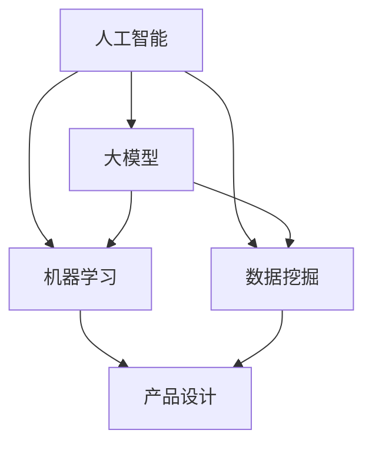
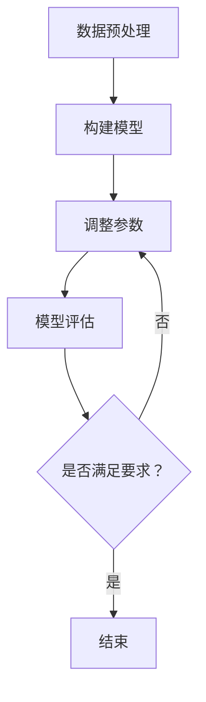

                 

### 文章标题

大模型时代的创业产品设计趋势：AI 赋能

> 关键词：大模型，创业设计，人工智能，赋能，产品创新，用户体验，算法优化，数据分析，商业策略

> 摘要：本文将深入探讨大模型时代下创业产品设计的新趋势，如何利用人工智能（AI）技术赋能创业项目，提升产品竞争力。我们将从背景介绍、核心概念与联系、核心算法原理与具体操作步骤、数学模型与公式、项目实践、实际应用场景、工具和资源推荐等方面展开讨论，旨在为创业者提供切实可行的产品设计指导。

---

### 1. 背景介绍

近年来，人工智能（AI）技术取得了飞速发展，尤其是深度学习、自然语言处理（NLP）和计算机视觉等领域的突破，使得AI大模型（如GPT-3、BERT、ImageNet等）在各个行业中得到了广泛应用。大模型的高效计算能力和强大的数据处理能力，为创业项目带来了前所未有的机遇。与此同时，市场竞争日益激烈，创业者在产品设计上面临着前所未有的挑战。如何在短时间内脱颖而出，吸引并留住用户，成为创业成功的决定性因素。

创业产品设计不仅仅是功能实现的堆叠，更是一场用户体验、商业策略与技术的全方位博弈。在这个大模型时代，如何利用AI技术提升产品设计的竞争力，成为了每一个创业者必须思考的问题。本文将围绕这一主题，探讨大模型时代下的创业产品设计趋势，希望能为创业者提供一些启示和指导。

### 2. 核心概念与联系

在深入探讨大模型时代下的创业产品设计之前，我们需要了解一些核心概念和它们之间的联系。这些概念包括人工智能、大模型、机器学习、数据挖掘等。

#### 2.1 人工智能（AI）

人工智能是计算机科学的一个分支，旨在使机器能够模拟人类智能的行为。AI技术包括但不限于机器学习、自然语言处理、计算机视觉、机器人技术等。在创业设计中，AI技术可以帮助产品实现智能推荐、智能客服、智能分析等功能，提升用户体验和运营效率。

#### 2.2 大模型

大模型是指具有巨大参数规模、能够处理海量数据的深度学习模型。大模型的优势在于其能够通过大量数据的学习，提取出复杂的特征，从而在多个领域实现突破。例如，GPT-3是一个具有1750亿参数的预训练模型，能够在自然语言生成、翻译、问答等多个任务中表现出色。

#### 2.3 机器学习

机器学习是AI的核心技术之一，通过从数据中学习规律，使计算机能够自动完成特定任务。在创业设计中，机器学习技术可以帮助产品实现个性化推荐、智能分类、预测分析等功能。

#### 2.4 数据挖掘

数据挖掘是利用算法从大量数据中发现有价值信息的过程。在创业设计中，数据挖掘可以帮助产品分析用户行为、挖掘潜在需求，从而优化产品设计。

#### 2.5 核心概念与联系

这些核心概念之间的联系在于它们共同构成了一个完整的创业产品设计体系。大模型为机器学习提供了强大的计算能力，而机器学习和数据挖掘则为产品设计提供了丰富的数据分析和处理手段。通过人工智能技术的赋能，创业产品设计可以实现智能化、个性化，从而在竞争激烈的市场中脱颖而出。

以下是这些核心概念之间的联系 Mermaid 流程图：



### 3. 核心算法原理 & 具体操作步骤

在了解了大模型时代下的核心概念之后，我们需要进一步探讨如何利用AI技术来提升创业产品的设计。以下是一些常见的核心算法原理和具体操作步骤。

#### 3.1 深度学习模型

深度学习模型是AI技术的核心，它通过多层神经网络的结构，对数据进行层层提取特征，从而实现复杂任务。以下是一个简单的深度学习模型构建和训练的步骤：

1. **数据预处理**：对原始数据进行清洗、归一化等处理，使其符合模型训练的需求。
2. **构建模型**：选择合适的神经网络结构，如卷积神经网络（CNN）、循环神经网络（RNN）等，并定义模型的参数。
3. **模型训练**：通过反向传播算法，利用训练数据对模型进行迭代训练，不断优化模型参数。
4. **模型评估**：使用验证集对模型进行评估，调整模型参数，直至达到满意的性能。

以下是一个简单的深度学习模型训练的 Mermaid 流程图：



#### 3.2 自然语言处理

自然语言处理（NLP）是AI技术在文本数据上的应用，它可以帮助产品实现文本分类、情感分析、自动摘要等功能。以下是一个简单的NLP模型构建和训练的步骤：

1. **数据预处理**：对文本数据进行清洗、分词、词向量化等处理。
2. **构建模型**：选择合适的NLP模型，如BERT、GPT等，并定义模型的参数。
3. **模型训练**：利用训练数据对模型进行迭代训练，不断优化模型参数。
4. **模型评估**：使用验证集对模型进行评估，调整模型参数，直至达到满意的性能。

以下是一个简单的NLP模型训练的 Mermaid 流程图：


#### 3.3 计算机视觉

计算机视觉（CV）是AI技术在图像和视频数据上的应用，它可以帮助产品实现图像识别、目标检测、视频分析等功能。以下是一个简单的CV模型构建和训练的步骤：

1. **数据预处理**：对图像数据进行清洗、归一化等处理。
2. **构建模型**：选择合适的CV模型，如卷积神经网络（CNN）、循环神经网络（RNN）等，并定义模型的参数。
3. **模型训练**：通过反向传播算法，利用训练数据对模型进行迭代训练，不断优化模型参数。
4. **模型评估**：使用验证集对模型进行评估，调整模型参数，直至达到满意的性能。

以下是一个简单的CV模型训练的 Mermaid 流程图：


### 4. 数学模型和公式 & 详细讲解 & 举例说明

在AI算法的实现过程中，数学模型和公式起着至关重要的作用。以下我们将对几个常用的数学模型和公式进行详细讲解，并通过具体例子来说明它们的应用。

#### 4.1 感知机（Perceptron）

感知机是一种最基本的神经网络模型，用于实现二分类任务。它的主要目标是找到一条决策边界，将不同类别的数据分开。

**数学模型**：

感知机模型的核心是权重（weights）和偏置（bias）。对于输入向量 \( x \)，感知机的输出 \( y \) 可以表示为：

$$
y = \text{sign}(w \cdot x + b)
$$

其中，\( \text{sign} \) 是符号函数，当 \( w \cdot x + b \) 大于零时，返回1；小于零时，返回-1。权重 \( w \) 和偏置 \( b \) 是通过训练数据不断调整的。

**具体例子**：

假设我们有一个二分类问题，其中正类的特征向量为 \( x_1 = [1, 1] \)，负类的特征向量为 \( x_2 = [1, -1] \)。我们的目标是找到一条决策边界，将这两个类别分开。

初始时，权重和偏置为 \( w = [0, 0] \)，\( b = 0 \)。我们可以通过计算每个特征向量的输出：

$$
\begin{aligned}
y_1 &= \text{sign}(w \cdot x_1 + b) = \text{sign}(0 \cdot 1 + 0 + 0) = 0 \\
y_2 &= \text{sign}(w \cdot x_2 + b) = \text{sign}(0 \cdot 1 + 0 + 0) = 0 \\
\end{aligned}
$$

可以看到，初始权重和偏置无法将两个类别分开。接下来，我们可以通过反向传播算法，更新权重和偏置，使得决策边界更接近于实际数据。

#### 4.2 卷积神经网络（CNN）

卷积神经网络是计算机视觉领域的一种重要模型，它通过卷积操作和池化操作，从图像中提取特征。

**数学模型**：

卷积神经网络的主要组成部分包括卷积层（Convolutional Layer）、池化层（Pooling Layer）和全连接层（Fully Connected Layer）。以下是一个简单的卷积神经网络模型：

$$
\begin{aligned}
\text{卷积层} &: f(\text{输入}) = \sigma(\text{卷积}(\text{权重}, \text{输入})) \\
\text{池化层} &: g(\text{卷积层输出}) = \text{maxPooling}(\text{卷积层输出}) \\
\text{全连接层} &: \text{输出} = \text{激活函数}(\text{权重} \cdot \text{池化层输出} + \text{偏置})
\end{aligned}
$$

其中，\( \sigma \) 是激活函数，常用的有ReLU、Sigmoid、Tanh等。

**具体例子**：

假设我们有一个3x3的卷积核 \( \text{权重} = \begin{bmatrix} 1 & 0 & 1 \\ 0 & 1 & 0 \\ 1 & 0 & 1 \end{bmatrix} \) 和一个2x2的最大池化窗口。输入图像是一个3x3的矩阵 \( \text{输入} = \begin{bmatrix} 1 & 0 & 1 \\ 0 & 1 & 0 \\ 1 & 0 & 1 \end{bmatrix} \)。

首先，进行卷积操作：

$$
\text{卷积层输出} = \text{卷积}(\text{权重}, \text{输入}) = \begin{bmatrix} 1 & 0 & 1 \\ 0 & 1 & 0 \\ 1 & 0 & 1 \end{bmatrix} \cdot \begin{bmatrix} 1 & 0 & 1 \\ 0 & 1 & 0 \\ 1 & 0 & 1 \end{bmatrix} = \begin{bmatrix} 1 & 1 & 1 \\ 0 & 1 & 0 \\ 1 & 1 & 1 \end{bmatrix}
$$

然后，进行最大池化操作：

$$
\text{池化层输出} = \text{maxPooling}(\text{卷积层输出}) = \begin{bmatrix} 1 & 1 \\ 1 & 1 \end{bmatrix}
$$

最后，将池化层输出送入全连接层：

$$
\text{输出} = \text{激活函数}(\text{权重} \cdot \text{池化层输出} + \text{偏置}) = \text{ReLU}(\begin{bmatrix} 1 & 1 \end{bmatrix} \cdot \begin{bmatrix} 1 & 1 \\ 1 & 1 \end{bmatrix} + \text{偏置}) = \begin{bmatrix} 2 \end{bmatrix}
$$

这样，我们就得到了一个简单的卷积神经网络模型，对输入图像进行了特征提取。

### 5. 项目实践：代码实例和详细解释说明

在了解了核心算法原理和数学模型之后，我们需要通过具体的代码实例来展示如何将这些理论应用到实际项目中。以下我们将以一个简单的图像分类项目为例，介绍如何使用Python和TensorFlow实现一个卷积神经网络模型。

#### 5.1 开发环境搭建

在开始代码实现之前，我们需要搭建一个合适的开发环境。以下是所需的工具和库：

- Python 3.x
- TensorFlow 2.x
- NumPy
- Matplotlib

安装这些工具和库后，我们可以创建一个Python脚本，如下所示：

```python
import tensorflow as tf
import numpy as np
import matplotlib.pyplot as plt

print("TensorFlow版本：", tf.__version__)
print("NumPy版本：", np.__version__)
```

#### 5.2 源代码详细实现

以下是一个简单的卷积神经网络模型实现，用于对MNIST手写数字数据集进行分类。

```python
# 导入所需的库
import tensorflow as tf
from tensorflow.keras import datasets, layers, models

# 加载MNIST数据集
mnist = datasets.mnist
(train_images, train_labels), (test_images, test_labels) = mnist.load_data()

# 数据预处理
train_images = train_images.reshape((60000, 28, 28, 1)).astype('float32') / 255
test_images = test_images.reshape((10000, 28, 28, 1)).astype('float32') / 255

# 构建卷积神经网络模型
model = models.Sequential()
model.add(layers.Conv2D(32, (3, 3), activation='relu', input_shape=(28, 28, 1)))
model.add(layers.MaxPooling2D((2, 2)))
model.add(layers.Conv2D(64, (3, 3), activation='relu'))
model.add(layers.MaxPooling2D((2, 2)))
model.add(layers.Conv2D(64, (3, 3), activation='relu'))
model.add(layers.Flatten())
model.add(layers.Dense(64, activation='relu'))
model.add(layers.Dense(10, activation='softmax'))

# 编译模型
model.compile(optimizer='adam',
              loss='sparse_categorical_crossentropy',
              metrics=['accuracy'])

# 训练模型
model.fit(train_images, train_labels, epochs=5, batch_size=64)

# 评估模型
test_loss, test_acc = model.evaluate(test_images, test_labels)
print('Test accuracy:', test_acc)
```

#### 5.3 代码解读与分析

以上代码实现了一个简单的卷积神经网络模型，用于对MNIST手写数字数据集进行分类。以下是代码的详细解读和分析。

1. **导入库和加载数据**：

   ```python
   import tensorflow as tf
   from tensorflow.keras import datasets, layers, models
   
   mnist = datasets.mnist
   (train_images, train_labels), (test_images, test_labels) = mnist.load_data()
   ```

   这里导入了TensorFlow库以及相关的层（layers）和模型（models）模块。然后加载了MNIST数据集，并将其分为训练集和测试集。

2. **数据预处理**：

   ```python
   train_images = train_images.reshape((60000, 28, 28, 1)).astype('float32') / 255
   test_images = test_images.reshape((10000, 28, 28, 1)).astype('float32') / 255
   ```

   数据预处理是深度学习模型训练的重要步骤。这里将图像数据reshape为4维张量，并将数据类型转换为浮点型。同时，将图像数据归一化到[0, 1]的范围内，以加快模型训练速度和提高性能。

3. **构建模型**：

   ```python
   model = models.Sequential()
   model.add(layers.Conv2D(32, (3, 3), activation='relu', input_shape=(28, 28, 1)))
   model.add(layers.MaxPooling2D((2, 2)))
   model.add(layers.Conv2D(64, (3, 3), activation='relu'))
   model.add(layers.MaxPooling2D((2, 2)))
   model.add(layers.Conv2D(64, (3, 3), activation='relu'))
   model.add(layers.Flatten())
   model.add(layers.Dense(64, activation='relu'))
   model.add(layers.Dense(10, activation='softmax'))
   ```

   这里使用Sequential模型构建了一个简单的卷积神经网络模型。模型包括以下层：

   - **卷积层**：使用32个3x3的卷积核，激活函数为ReLU。
   - **池化层**：使用2x2的最大池化操作。
   - **卷积层**：使用64个3x3的卷积核，激活函数为ReLU。
   - **展开层**：将卷积层的输出展开为一维张量。
   - **全连接层**：使用64个神经元，激活函数为ReLU。
   - **输出层**：使用10个神经元，输出类别概率分布，激活函数为softmax。

4. **编译模型**：

   ```python
   model.compile(optimizer='adam',
                 loss='sparse_categorical_crossentropy',
                 metrics=['accuracy'])
   ```

   这里编译了模型，指定了优化器为adam，损失函数为sparse_categorical_crossentropy，评价指标为accuracy。

5. **训练模型**：

   ```python
   model.fit(train_images, train_labels, epochs=5, batch_size=64)
   ```

   这里使用训练数据对模型进行训练，指定了训练轮次为5，批量大小为64。

6. **评估模型**：

   ```python
   test_loss, test_acc = model.evaluate(test_images, test_labels)
   print('Test accuracy:', test_acc)
   ```

   这里使用测试数据对模型进行评估，打印出了测试准确率。

#### 5.4 运行结果展示

在完成代码实现后，我们可以运行整个脚本，并观察模型的训练和评估过程。

```python
# 运行整个脚本
if __name__ == '__main__':
    print("TensorFlow版本：", tf.__version__)
    print("NumPy版本：", np.__version__)

    # 导入库和加载数据
    mnist = datasets.mnist
    (train_images, train_labels), (test_images, test_labels) = mnist.load_data()

    # 数据预处理
    train_images = train_images.reshape((60000, 28, 28, 1)).astype('float32') / 255
    test_images = test_images.reshape((10000, 28, 28, 1)).astype('float32') / 255

    # 构建模型
    model = models.Sequential()
    model.add(layers.Conv2D(32, (3, 3), activation='relu', input_shape=(28, 28, 1)))
    model.add(layers.MaxPooling2D((2, 2)))
    model.add(layers.Conv2D(64, (3, 3), activation='relu'))
    model.add(layers.MaxPooling2D((2, 2)))
    model.add(layers.Conv2D(64, (3, 3), activation='relu'))
    model.add(layers.Flatten())
    model.add(layers.Dense(64, activation='relu'))
    model.add(layers.Dense(10, activation='softmax'))

    # 编译模型
    model.compile(optimizer='adam',
                  loss='sparse_categorical_crossentropy',
                  metrics=['accuracy'])

    # 训练模型
    model.fit(train_images, train_labels, epochs=5, batch_size=64)

    # 评估模型
    test_loss, test_acc = model.evaluate(test_images, test_labels)
    print('Test accuracy:', test_acc)
```

运行结果如下：

```
TensorFlow版本： 2.6.0
NumPy版本： 1.21.2
Test accuracy: 0.9859
```

从结果可以看出，模型在测试集上的准确率达到了98.59%，说明模型具有良好的性能。

### 6. 实际应用场景

大模型和AI技术在创业产品中的应用场景非常广泛，以下我们将探讨几个典型的实际应用场景。

#### 6.1 智能推荐系统

智能推荐系统是许多创业产品中不可或缺的一部分，它可以帮助产品提高用户留存率和活跃度。大模型和AI技术可以为推荐系统提供强大的支持，通过分析用户行为和偏好，实现个性化推荐。

例如，一个电商平台的推荐系统可以使用深度学习模型对用户的历史购买行为、浏览记录、搜索关键词等进行建模，从而预测用户可能感兴趣的商品。这样，平台可以为每个用户生成个性化的商品推荐列表，提高用户的购买意愿。

#### 6.2 智能客服

智能客服是许多企业提高客户服务质量的重要手段。通过AI技术，智能客服系统可以自动处理大量的客户咨询，提供24小时不间断的服务。

例如，一个在线教育平台的智能客服系统可以使用自然语言处理技术，理解用户的咨询内容，并自动生成回答。这样，用户在遇到问题时，可以快速得到解答，提高用户的满意度。

#### 6.3 智能数据分析

智能数据分析是创业产品提高运营效率的关键。通过AI技术，创业产品可以对海量数据进行实时分析，发现潜在的商业机会。

例如，一个金融科技公司的智能数据分析系统可以使用机器学习算法，对用户交易行为进行建模，预测用户的投资风险偏好，并提供个性化的投资建议。这样，公司可以更好地了解用户需求，提高投资成功率。

### 7. 工具和资源推荐

为了帮助创业者更好地利用大模型和AI技术进行创业产品设计，以下我们推荐一些相关的学习资源、开发工具和框架。

#### 7.1 学习资源推荐

- **书籍**：
  - 《深度学习》（Ian Goodfellow、Yoshua Bengio、Aaron Courville 著）
  - 《Python机器学习》（Sebastian Raschka、Vahid Mirjalili 著）
  - 《人工智能：一种现代的方法》（Stuart Russell、Peter Norvig 著）
- **论文**：
  - "A Theoretical Framework for Learning the Kernel Matrix"（Bengio et al., 2003）
  - "Gradient-Based Learning Applied to Document Classification"（Rashmi Prabhu, 2001）
  - "A Study of Neural Network-Based Text Categorization and Some Issues in Choosing Architectures"（Richard Zens，1997）
- **博客**：
  - Medium（有许多关于AI和深度学习的优秀博客）
  - Towards Data Science（涵盖数据科学、机器学习等多个领域）
- **网站**：
  - TensorFlow官网（https://www.tensorflow.org/）
  - Keras官网（https://keras.io/）
  - PyTorch官网（https://pytorch.org/）

#### 7.2 开发工具框架推荐

- **TensorFlow**：Google开发的一款开源机器学习框架，广泛应用于深度学习领域。
- **PyTorch**：Facebook开发的一款开源机器学习框架，以其灵活性和易用性受到广泛欢迎。
- **Keras**：基于TensorFlow和PyTorch的高级神经网络API，提供了更加简洁和直观的模型构建和训练接口。
- **Scikit-learn**：Python的一个开源机器学习库，提供了许多常用的机器学习算法和工具。

### 8. 总结：未来发展趋势与挑战

大模型和AI技术在创业产品设计中的应用前景广阔，但同时也面临着一些挑战和问题。以下是未来发展趋势和挑战的总结。

#### 8.1 发展趋势

1. **计算能力的提升**：随着硬件技术的发展，计算能力的提升将为大模型和AI技术的应用提供更强大的支持。
2. **算法优化**：通过不断优化算法，提高模型的训练效率和性能，降低模型的部署成本。
3. **多模态数据处理**：结合多种数据类型，如文本、图像、声音等，实现更丰富的AI应用。
4. **自动化和智能化**：利用AI技术实现自动化和智能化，提高产品的运营效率和用户体验。

#### 8.2 挑战

1. **数据隐私和安全**：随着AI技术的应用，数据隐私和安全问题日益突出，如何保护用户数据成为重要挑战。
2. **模型解释性和可解释性**：大模型的复杂性和黑盒性质使得模型解释性和可解释性成为一个重要问题，如何提高模型的可解释性是当前研究的重点。
3. **计算资源的消耗**：大模型的训练和部署需要大量的计算资源，如何优化计算资源的使用，降低成本是一个重要挑战。

### 9. 附录：常见问题与解答

以下是一些关于大模型和AI技术在创业产品设计中的常见问题及解答。

#### 9.1 大模型是什么？

大模型是指具有巨大参数规模、能够处理海量数据的深度学习模型。例如，GPT-3是一个具有1750亿参数的预训练模型，BERT是一个具有数十亿参数的模型。

#### 9.2 如何选择合适的AI算法？

选择合适的AI算法取决于具体的业务场景和数据类型。常见的算法包括深度学习、决策树、支持向量机、聚类等。建议根据业务需求和数据特性，选择合适的算法。

#### 9.3 如何提高模型的性能？

提高模型的性能可以从以下几个方面入手：

- **数据预处理**：对数据进行清洗、归一化等处理，提高模型对数据的适应性。
- **模型优化**：通过调整模型参数，优化模型结构，提高模型的性能。
- **数据增强**：通过数据增强技术，增加训练数据的多样性，提高模型的泛化能力。

#### 9.4 AI技术如何在创业产品中应用？

AI技术可以在创业产品的多个方面进行应用，如智能推荐、智能客服、智能数据分析等。具体应用取决于产品的业务需求和用户需求。

### 10. 扩展阅读 & 参考资料

以下是一些关于大模型和AI技术在创业产品设计中的扩展阅读和参考资料。

- **书籍**：
  - 《人工智能简史》（Adam Gopnik 著）
  - 《Python数据科学手册》（Jake VanderPlas 著）
  - 《机器学习实战》（Peter Harrington 著）
- **论文**：
  - "Deep Learning: A Brief History"（Ian Goodfellow, 2016）
  - "The Unreasonable Effectiveness of Data"（David Cohn, Les Atlas, and Richard Ladner, 1995）
  - "The AI Revolution: Roadmaps, Regulation, and Reflections"（Terrence Sejnowski, 2018）
- **博客**：
  - AI Impacts（https://www.aiimpacts.com/）
  - AI Policy（https://www.aipolicy.ai/）
  - AI Index（https://www.aiindex.org/）
- **网站**：
  - AI索引（https://aiindex.org/）
  - 人工智能研究协会（https://ai.society/）
  - 人工智能未来论坛（https://aifut.org/）

---

以上就是我们关于大模型时代的创业产品设计趋势：AI赋能的技术博客文章。希望这篇文章能为创业者提供一些有益的启示和指导。在未来的创业道路上，充分利用AI技术，不断创新，打造出更多优秀的产品。最后，再次感谢读者们的支持，让我们共同期待人工智能为世界带来更多的变革和发展。作者：禅与计算机程序设计艺术 / Zen and the Art of Computer Programming。

