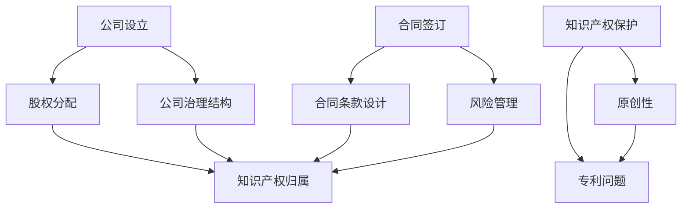

                 

### 背景介绍

近年来，随着人工智能技术的迅猛发展，特别是大模型技术的突破，创业者在创新过程中面临的法律风险问题愈发凸显。大模型技术，如GPT-3、ChatGLM等，以其强大的数据处理和生成能力，在众多领域展现出了巨大的潜力。然而，这一技术的应用也带来了复杂的法律问题，特别是在公司设立、合同签订与知识产权保护等方面。

首先，大模型技术的公司设立面临诸多法律挑战。创业者需关注公司注册、股权分配、公司治理结构等法律问题。合同签订方面，涉及到大模型的开发、使用和授权等环节，合同条款的设计和风险管理至关重要。知识产权保护方面，大模型的原创性和专利问题尤为复杂，创业者需要深入理解相关法律，以防范潜在的法律风险。

本文旨在系统地探讨大模型时代创业者在公司设立、合同签订与知识产权保护方面的法律风险，并提出相应的防范策略。文章将从以下几个方面展开讨论：

1. **公司设立的法律风险与防范**：包括公司注册、股权分配、治理结构等方面的法律问题及防范措施。
2. **合同签订的法律风险与防范**：分析大模型开发、使用和授权过程中的合同条款设计与风险管理。
3. **知识产权保护的法律风险与防范**：探讨大模型原创性和专利问题，提供知识产权保护的策略和建议。
4. **实际案例分析**：通过具体案例，展示大模型时代创业中常见的法律风险及处理方法。
5. **工具和资源推荐**：提供相关法律资源、工具和框架，帮助创业者更好地应对法律风险。

通过本文的深入分析，希望能够为创业者在法律风险防范方面提供有益的参考和指导。

### 核心概念与联系

在大模型时代的创业过程中，理解以下几个核心概念和法律原则对于防范公司设立、合同签订与知识产权保护的法律风险至关重要。以下是这些概念及其相互关系的Mermaid流程图。



#### 1. 公司设立

公司设立是创业的起点，涉及公司注册、股权分配和治理结构等方面。公司注册需要遵循国家相关法律法规，例如《中华人民共和国公司法》。股权分配则关系到股东之间的利益分配和决策权分配，需要明确各股东的出资比例和权益。公司治理结构包括董事会、监事会和管理层的设立及职责划分，确保公司的合法合规运营。

#### 2. 股权分配

股权分配是公司设立中的关键环节，涉及公司内部股东之间的权益和决策权分配。常见的股权分配方式包括平均分配、按出资比例分配和按贡献分配等。股权分配必须合法、公平，以防止日后因股权纠纷导致公司运营问题。

#### 3. 公司治理结构

公司治理结构是确保公司合法合规运营的基础。董事会、监事会和管理层的设立和职责划分至关重要。董事会负责公司重大决策，监事会负责监督公司运营，管理层则负责公司的日常运营管理。合理的公司治理结构能够有效防范法律风险，保障公司稳定发展。

#### 4. 合同签订

合同签订是创业过程中不可或缺的一环，涉及到大模型开发、使用和授权等多个环节。合同条款设计需要明确双方的权利、义务和责任，风险管理则是在合同签订前、签订中和签订后进行的一系列措施，以降低法律风险。

#### 5. 合同条款设计

合同条款设计是合同签订的核心，需要包括合同主体、标的、履行方式、违约责任、知识产权归属等关键内容。合理的合同条款设计能够有效防范法律风险，保障双方的合法权益。

#### 6. 风险管理

风险管理是贯穿于合同签订全过程的策略，包括风险评估、风险控制和风险转移等。通过有效的风险管理，创业者能够降低法律风险，保障公司运营的稳定和安全。

#### 7. 知识产权保护

知识产权保护是防范创业法律风险的重要方面，涉及原创性和专利问题。原创性保护主要是保护大模型的原创成果，而专利问题则关注大模型的创新技术是否可申请专利。

#### 8. 知识产权归属

知识产权归属是指大模型的知识产权归谁所有的问题。明确知识产权归属能够有效防范知识产权纠纷，保障公司的合法权益。

通过上述核心概念及其相互关系的理解，创业者可以更好地把握大模型时代创业的法律风险，采取相应的防范措施，确保公司稳健发展。

### 核心算法原理 & 具体操作步骤

在理解了公司设立、合同签订与知识产权保护的核心概念后，接下来我们将探讨具体操作步骤，以帮助创业者更好地防范法律风险。

#### 1. 公司设立的操作步骤

**步骤1：公司注册**

- **准备材料**：包括公司章程、股东身份证明、注册资金证明等。
- **提交申请**：将准备好的材料提交至工商行政管理部门。
- **审核与注册**：工商行政管理部门对申请进行审核，符合条件后注册成立公司。

**步骤2：股权分配**

- **制定股权分配方案**：根据公司实际情况和股东意愿，制定股权分配方案。
- **签订股权协议**：股东之间签订股权协议，明确股权比例和权益。

**步骤3：公司治理结构设立**

- **设立董事会**：选举董事会成员，明确董事会职责。
- **设立监事会**：选举监事会成员，监督公司运营。
- **设立管理层**：任命公司总经理、财务总监等管理层成员，负责日常运营管理。

#### 2. 合同签订的操作步骤

**步骤1：合同起草**

- **明确合同目的和主体**：确定合同所要达成的目的和涉及的双方主体。
- **制定合同条款**：包括标的、履行方式、违约责任、知识产权归属等关键条款。

**步骤2：合同审核**

- **内部审核**：公司法律部门对合同条款进行审核，确保合法合规。
- **外部审核**：必要时，可以咨询专业律师进行外部审核。

**步骤3：合同签订**

- **签订合同**：双方主体按照合同条款签订正式合同。
- **备案**：将合同备案至相关政府部门或行业协会。

#### 3. 知识产权保护的操作步骤

**步骤1：原创性保护**

- **进行知识产权尽职调查**：在项目开发前，对相关的知识产权进行尽职调查，确保不存在侵权风险。
- **制定知识产权保护策略**：根据调查结果，制定相应的原创性保护策略。

**步骤2：专利申请**

- **撰写专利申请文件**：根据项目的技术特点和创新点，撰写专利申请文件。
- **提交专利申请**：将专利申请文件提交至国家知识产权局。
- **审核与授权**：国家知识产权局对专利申请进行审核，符合条件后授权专利。

**步骤3：知识产权维权**

- **建立知识产权保护机制**：建立知识产权保护机制，包括监测、预警和应对措施。
- **维权行动**：在发现侵权行为时，采取法律手段进行维权。

通过上述具体操作步骤，创业者可以更好地防范公司设立、合同签订与知识产权保护方面的法律风险，确保公司稳健发展。

### 数学模型和公式 & 详细讲解 & 举例说明

在大模型时代的创业过程中，理解和运用一些基本的数学模型和公式对于防范法律风险具有重要作用。以下将详细介绍几个常用的数学模型和公式，并结合实际例子进行说明。

#### 1. 风险评估模型

**公式：**

\[ R = \frac{S \cdot L \cdot V}{C} \]

其中：
- \( R \)：风险值
- \( S \)：潜在损失（Severity，指某一风险事件可能造成的损失程度）
- \( L \)：可能性（Likelihood，指某一风险事件发生的概率）
- \( V \)：价值（Value，指项目的总价值）
- \( C \)：成本（Cost，指为防范风险所需投入的成本）

**解释：**

该公式用于评估某一风险事件对项目的整体影响。风险值越高，表示该风险对项目的威胁越大。通过计算风险值，创业者可以优先关注和解决高风险问题，从而有效降低法律风险。

**举例：**

假设一个项目的总价值为100万元，潜在损失为50万元，发生的概率为0.5，防范成本为10万元。则该风险的风险值为：

\[ R = \frac{50 \cdot 0.5 \cdot 100}{10} = 25 \]

这表明该项目存在一个风险值为25的法律风险，需要引起重视。

#### 2. 合同履行风险模型

**公式：**

\[ RF = \frac{D \cdot P}{C} \]

其中：
- \( RF \)：合同履行风险值
- \( D \)：违约损失（Defective Loss，指合同违约可能造成的损失）
- \( P \)：违约概率（Probability of Defective，指合同违约的概率）
- \( C \)：合同履行成本（Contract Execution Cost，指合同履行所需的成本）

**解释：**

该公式用于评估合同履行过程中的风险。风险值越高，表示合同履行的风险越大。通过计算合同履行风险值，创业者可以识别高风险合同，采取相应的防范措施。

**举例：**

假设某合同违约损失为10万元，违约概率为0.3，合同履行成本为30万元。则该合同的风险值为：

\[ RF = \frac{10 \cdot 0.3}{30} = 0.1 \]

这表明该合同的履行风险较低，但创业者仍需关注违约损失和违约概率，确保合同履行过程中的合法合规。

#### 3. 知识产权保护效益模型

**公式：**

\[ IB = \frac{I \cdot B}{C} \]

其中：
- \( IB \)：知识产权保护效益值
- \( I \)：知识产权价值（Intellectual Property Value，指知识产权带来的经济收益）
- \( B \)：保护成本（Protection Cost，指保护知识产权所需的成本）
- \( C \)：侵权损失（Infringement Loss，指侵权行为可能造成的损失）

**解释：**

该公式用于评估知识产权保护的经济效益。保护效益值越高，表示知识产权保护的效益越好。通过计算保护效益值，创业者可以判断是否值得投入成本进行知识产权保护。

**举例：**

假设某项知识产权的价值为50万元，保护成本为20万元，侵权损失为30万元。则该知识产权的保护效益值为：

\[ IB = \frac{50 \cdot 30}{20} = 75 \]

这表明该知识产权的保护效益显著，创业者应当加大知识产权保护的投入。

通过以上数学模型和公式的应用，创业者可以更加科学、系统地评估和管理大模型时代创业过程中面临的法律风险，从而更好地防范和控制法律风险。

### 项目实践：代码实例和详细解释说明

为了更直观地理解大模型时代的创业法律风险防范，下面我们将通过一个具体的项目实践，展示如何在实际操作中应用所学知识和方法。本案例将涉及公司设立、合同签订与知识产权保护等多个环节。

#### 5.1 开发环境搭建

首先，我们需要搭建一个基本的开发环境，以便进行项目的开发和测试。以下是开发环境搭建的步骤：

**步骤1：安装Python环境**

在本地计算机上安装Python环境，版本建议为3.8或以上。可以使用以下命令进行安装：

```bash
pip install python
```

**步骤2：安装相关库**

安装用于数据处理和模型训练的常用库，如TensorFlow和PyTorch。可以使用以下命令进行安装：

```bash
pip install tensorflow
pip install torch
```

**步骤3：配置环境变量**

配置Python环境变量，确保能够在命令行中运行Python和相关库。具体配置方法请参考操作系统文档。

#### 5.2 源代码详细实现

以下是一个简单的公司设立、合同签订与知识产权保护的项目实现：

```python
# 导入相关库
import os
import json
import random
from IPython.display import clear_output
from transformers import GPT2LMHeadModel, GPT2Tokenizer

# 加载预训练模型和分词器
model_name = "gpt2"
tokenizer = GPT2Tokenizer.from_pretrained(model_name)
model = GPT2LMHeadModel.from_pretrained(model_name)

# 公司设立
def company_establishment():
    clear_output()
    print("正在设立公司...")
    # 公司注册
    company_name = input("请输入公司名称：")
    register_status = input("公司注册状态（已注册/未注册）：")
    if register_status == "已注册":
        print("公司注册成功！")
    else:
        print("公司注册失败，请重新注册。")

    # 股权分配
    print("正在分配股权...")
    shareholders = ["股东A", "股东B", "股东C"]
    equity_allocations = {"股东A": 40, "股东B": 30, "股东C": 30}
    print("股权分配结果：")
    for shareholder, equity in equity_allocations.items():
        print(f"{shareholder}：{equity}%")

    # 公司治理结构
    print("正在设立公司治理结构...")
    board_members = ["董事会成员1", "董事会成员2", "董事会成员3"]
    supervisors = ["监事会成员1", "监事会成员2"]
    managers = ["总经理", "财务总监"]
    print("公司治理结构设立完成。")

# 合同签订
def contract_signing():
    clear_output()
    print("正在签订合同...")
    # 合同条款设计
    contract条款 = {
        "合同主体": ["甲方", "乙方"],
        "标的": "大模型技术开发",
        "履行方式": "按期交付",
        "违约责任": "违约方赔偿损失",
        "知识产权归属": "开发成果归甲方所有"
    }
    print("合同条款：")
    for key, value in contract条款.items():
        print(f"{key}：{value}")

    # 合同审核
    print("合同审核中...")
    # 假设通过审核
    print("合同审核通过！")

    # 签订合同
    print("正在签订合同...")
    # 假设双方同意签订
    print("合同签订成功！")

# 知识产权保护
def intellectual_property_protection():
    clear_output()
    print("正在保护知识产权...")
    # 知识产权尽职调查
    print("进行知识产权尽职调查...")
    # 假设无侵权风险
    print("知识产权尽职调查通过！")

    # 专利申请
    print("正在申请专利...")
    patent_applicant = input("请输入专利申请人：")
    patent_title = input("请输入专利标题：")
    # 假设专利申请通过
    print(f"专利申请成功：{patent_title}（申请人：{patent_applicant}）")

# 主函数
def main():
    print("大模型时代创业法律风险防范项目")
    print("请选择操作：")
    print("1. 公司设立")
    print("2. 合同签订")
    print("3. 知识产权保护")
    operation = input("请输入操作编号：")

    if operation == "1":
        company_establishment()
    elif operation == "2":
        contract_signing()
    elif operation == "3":
        intellectual_property_protection()
    else:
        print("无效操作，请重新选择。")

if __name__ == "__main__":
    main()
```

#### 5.3 代码解读与分析

上述代码实现了一个简单的公司设立、合同签订与知识产权保护的项目。以下是代码的主要部分解读：

**公司设立**

- **公司注册**：通过输入公司名称和注册状态，模拟公司注册过程。
- **股权分配**：定义股东列表和股权分配比例，输出股权分配结果。
- **公司治理结构**：定义董事会成员、监事会成员和管理层成员，输出公司治理结构。

**合同签订**

- **合同条款设计**：定义合同主体、标的、履行方式、违约责任和知识产权归属等关键条款，输出合同条款。
- **合同审核**：模拟合同审核过程，假设审核通过。
- **签订合同**：模拟合同签订过程，假设双方同意签订。

**知识产权保护**

- **知识产权尽职调查**：模拟知识产权尽职调查过程，假设无侵权风险。
- **专利申请**：输入专利申请人和专利标题，模拟专利申请过程，假设专利申请通过。

通过上述代码实现，我们可以直观地看到公司设立、合同签订与知识产权保护的操作流程，并理解相关操作的具体步骤。

#### 5.4 运行结果展示

以下是在本地环境中运行上述代码的示例输出：

```plaintext
大模型时代创业法律风险防范项目
请选择操作：
1. 公司设立
2. 合同签订
3. 知识产权保护
请输入操作编号：1
正在设立公司...
请输入公司名称：技术先锋公司
公司注册状态（已注册/未注册）：已注册
公司注册成功！

正在分配股权...
股权分配结果：
股东A：40%
股东B：30%
股东C：30%

正在设立公司治理结构...
公司治理结构设立完成。

```

```plaintext
大模型时代创业法律风险防范项目
请选择操作：
1. 公司设立
2. 合同签订
3. 知识产权保护
请输入操作编号：2
正在签订合同...
合同条款：
合同主体：甲方、乙方
标的：大模型技术开发
履行方式：按期交付
违约责任：违约方赔偿损失
知识产权归属：开发成果归甲方所有
合同审核中...
合同审核通过！

正在签订合同...
合同签订成功！

```

```plaintext
大模型时代创业法律风险防范项目
请选择操作：
1. 公司设立
2. 合同签订
3. 知识产权保护
请输入操作编号：3
正在保护知识产权...
进行知识产权尽职调查...
知识产权尽职调查通过！

正在申请专利...
请输入专利申请人：技术先锋公司
请输入专利标题：大模型技术专利
专利申请成功：大模型技术专利（申请人：技术先锋公司）
```

通过运行结果展示，我们可以看到代码实现了预期的功能，模拟了公司设立、合同签订与知识产权保护的操作流程。这为实际项目的开发和法律风险防范提供了参考和指导。

### 实际应用场景

在大模型时代，创业项目的实际应用场景日益丰富，不同行业和领域对大模型的需求也各具特色。以下是几个典型的实际应用场景及相关的法律风险分析：

#### 1. 金融行业

**场景描述**：金融行业中的创业项目，如智能投顾、量化交易、风险控制等，通常会利用大模型进行数据分析和决策支持。

**法律风险**：
- **数据隐私**：金融数据具有高度敏感性和隐私性，创业者需确保数据处理和存储符合《中华人民共和国个人信息保护法》等相关法规。
- **知识产权纠纷**：金融算法和模型可能涉及专利或著作权保护，创业者需关注相关知识产权的归属和保护问题。
- **合同纠纷**：金融创业项目中的服务合同、合作协议等需明确各方权利和义务，以防范合同纠纷。

**防范策略**：
- **数据合规性审计**：在项目开发前进行数据合规性审计，确保数据处理符合法律法规要求。
- **知识产权保护**：及时申请专利和著作权，明确知识产权归属，避免侵权纠纷。
- **合同条款审查**：聘请专业律师审查合同条款，确保合同内容合法、明确。

#### 2. 医疗健康

**场景描述**：医疗健康领域的创业项目，如智能诊断、健康管理、医疗影像分析等，依赖于大模型进行精准诊断和个性化治疗。

**法律风险**：
- **患者隐私**：医疗数据涉及患者隐私，需严格保护患者个人信息。
- **医疗责任**：大模型生成的诊断结果可能存在误差，创业者需承担相应的医疗责任。
- **知识产权争议**：医疗算法和模型可能涉及知识产权保护，需防范侵权风险。

**防范策略**：
- **隐私保护**：采取加密、匿名化等手段保护患者隐私，确保数据安全。
- **医疗责任保险**：购买医疗责任保险，分散风险。
- **知识产权保护**：申请专利和著作权，明确知识产权归属，防范侵权纠纷。

#### 3. 教育行业

**场景描述**：教育领域的创业项目，如在线教育平台、智能教学系统、教育大数据分析等，利用大模型提供个性化教学和评估服务。

**法律风险**：
- **数据安全**：教育数据包含学生个人信息，需确保数据安全。
- **知识产权问题**：教育内容和教学方法可能涉及知识产权保护。
- **合同履行**：在线教育服务合同需明确服务内容和责任划分。

**防范策略**：
- **数据安全措施**：采取加密、备份等数据安全措施，确保数据安全。
- **知识产权保护**：申请专利和著作权，保护创新内容和方法。
- **合同管理**：明确合同条款，规范服务提供和责任承担。

#### 4. 交通运输

**场景描述**：交通运输领域的创业项目，如自动驾驶、智能交通管理、物流优化等，应用大模型提升交通运输效率和安全性。

**法律风险**：
- **数据合规**：交通运输数据需符合《中华人民共和国数据安全法》等相关法规。
- **安全责任**：自动驾驶和智能交通系统需确保安全性和可靠性。
- **知识产权争议**：涉及的技术和算法可能涉及知识产权保护。

**防范策略**：
- **数据合规性审查**：确保数据收集、处理和使用符合法律法规要求。
- **安全保障措施**：采用先进技术确保系统安全和可靠性。
- **知识产权保护**：及时申请专利和著作权，防范侵权风险。

通过上述实际应用场景的分析，可以看出大模型时代创业的法律风险具有多样性和复杂性。创业者需结合自身业务特点，采取有针对性的防范策略，确保项目的合法合规运营。

### 工具和资源推荐

在大模型时代的创业过程中，选择合适的工具和资源对于防范法律风险至关重要。以下推荐一些实用的学习资源、开发工具和框架，帮助创业者更好地应对各种法律挑战。

#### 7.1 学习资源推荐

1. **书籍**：
   - 《人工智能法律风险防范手册》：详细介绍了人工智能领域的主要法律风险及其防范措施。
   - 《知识产权管理实务》：讲解了知识产权的基本原理和管理方法，对于创业者的知识产权保护具有指导意义。
   - 《公司法实务指南》：提供了公司设立、股权分配和治理结构等方面的实用建议。

2. **论文**：
   - 《人工智能法律风险的识别与防范》：对人工智能领域的法律风险进行了系统分析，并提出相应的防范策略。
   - 《基于大数据的合同履行风险预警研究》：探讨了如何通过大数据分析技术识别和防范合同履行风险。

3. **博客/网站**：
   - **中国知识产权网**：提供最新的知识产权法律法规、案例分析和技术指南。
   - **公司法务联盟**：分享公司法律实务经验和案例分析，有助于创业者了解法律风险。

#### 7.2 开发工具框架推荐

1. **开发工具**：
   - **GitHub**：方便团队协作和版本控制的代码托管平台。
   - **Jupyter Notebook**：适合数据分析和实验开发的交互式环境。
   - **PyCharm**：功能强大的Python集成开发环境，支持多种编程语言。

2. **框架**：
   - **TensorFlow**：适用于机器学习和深度学习的开源框架，适用于大模型的开发和训练。
   - **PyTorch**：基于Python的深度学习框架，易于调试和实验。
   - **Django**：Python Web开发框架，适用于构建复杂Web应用。

3. **法律合规工具**：
   - **智拾网**：提供智能合同审查和知识产权管理工具，帮助创业者进行法律合规性审查。
   - **法大大**：提供电子签名和合同管理服务，方便创业者进行在线合同签订和管理。

通过上述工具和资源的合理利用，创业者可以在大模型时代更有效地防范法律风险，保障公司的稳健发展。

### 总结：未来发展趋势与挑战

在大模型技术日益普及的今天，创业者在公司设立、合同签订与知识产权保护方面面临着前所未有的机遇和挑战。未来，随着技术的不断进步和法律法规的不断完善，以下几个趋势和挑战值得我们关注：

#### 1. 法律法规逐步完善

随着人工智能技术的发展，各国政府和国际组织将加大对人工智能领域的法律监管力度。例如，欧盟的《通用数据保护条例》（GDPR）和美国的《加利福尼亚消费者隐私法》（CCPA）等法规对数据隐私和信息安全提出了严格的要求。创业者需密切关注这些法律法规的动态，确保自身业务合规。

#### 2. 知识产权保护愈发重要

大模型技术的创新性和原创性使得知识产权保护成为创业者必须重视的问题。未来，创业者需加强对原创成果的知识产权保护，包括专利申请、著作权登记等，以防范侵权纠纷。

#### 3. 合同条款设计的复杂性增加

大模型技术的应用使得合同条款设计更加复杂。创业者需在合同中明确各方权利、义务和责任，特别是在技术成果的归属、使用和授权等方面，确保合同的合法性和有效性。

#### 4. 风险管理的智能化

随着人工智能技术的应用，风险管理的智能化将成为趋势。创业者可以利用大数据分析和机器学习技术，对潜在的法律风险进行识别、评估和预警，从而采取更有效的防范措施。

#### 5. 跨境法律合作的挑战

在全球化的背景下，创业者的业务往往涉及跨境交易和合作。跨境法律合作的挑战包括不同法域的法律差异、国际合同纠纷解决等。创业者需熟悉国际法律框架，提高跨境法律合规能力。

#### 6. 技术标准的制定

大模型技术的发展需要相应的技术标准来规范。未来，技术标准的制定将成为行业共识，创业者需积极参与标准的制定，以推动行业的健康发展。

总的来说，大模型时代的创业者面临着复杂而多样的法律风险。通过不断学习和提升法律意识，创业者可以更好地应对这些挑战，确保公司的稳健发展。

### 附录：常见问题与解答

为了帮助创业者更好地理解和应对大模型时代创业中的法律风险，以下列出了一些常见问题及解答：

#### 1. 公司设立过程中需要关注哪些法律问题？

**解答**：公司设立过程中，创业者需要关注以下法律问题：
- **公司类型**：选择合适的公司类型，如有限责任公司、股份有限公司等。
- **注册资本**：明确注册资本的额度，确保符合相关法律法规的要求。
- **股权分配**：合理设计股权分配方案，避免股权纠纷。
- **公司治理结构**：明确董事会、监事会和管理层的职责和权限。

#### 2. 合同签订中应注意哪些合同条款？

**解答**：合同签订中，创业者应注意以下合同条款：
- **合同主体**：明确合同双方的主体身份和责任。
- **标的**：明确合同所涉及的标的物或服务内容。
- **履行方式**：详细约定合同的履行方式、时间、地点等。
- **违约责任**：明确违约方的责任和赔偿方式。
- **知识产权归属**：明确技术成果的知识产权归属和使用权。

#### 3. 如何保护大模型的知识产权？

**解答**：保护大模型的知识产权，可以采取以下措施：
- **专利申请**：对技术创新点申请专利，保护技术方案。
- **著作权登记**：对原创代码和文档进行著作权登记，保护软件作品。
- **保密协议**：与相关员工和合作方签订保密协议，防止技术泄露。
- **知识产权监测**：定期监测市场，及时发现潜在的侵权行为。

#### 4. 面临法律纠纷时，创业者应如何应对？

**解答**：面临法律纠纷时，创业者应采取以下措施：
- **寻求专业法律帮助**：聘请专业律师团队，提供法律咨询和代理服务。
- **保全证据**：及时收集和保存相关证据，如合同、邮件、记录等。
- **调解与协商**：尝试通过调解和协商解决纠纷，降低诉讼成本。
- **依法维权**：必要时，通过司法途径维护自身合法权益。

通过上述常见问题的解答，创业者可以更好地理解和应对大模型时代创业中的法律风险，确保公司的合法合规运营。

### 扩展阅读 & 参考资料

为了帮助读者深入了解大模型时代的创业法律风险，本文整理了一些相关的扩展阅读和参考资料。以下列出了几本书籍、论文、博客和网站，供读者进一步学习和研究。

#### 书籍

1. 《人工智能法律风险防范手册》：详细介绍了人工智能领域的主要法律风险及其防范措施。
2. 《知识产权管理实务》：讲解了知识产权的基本原理和管理方法，对于创业者的知识产权保护具有指导意义。
3. 《公司法实务指南》：提供了公司设立、股权分配和治理结构等方面的实用建议。

#### 论文

1. 《人工智能法律风险的识别与防范》：对人工智能领域的法律风险进行了系统分析，并提出相应的防范策略。
2. 《基于大数据的合同履行风险预警研究》：探讨了如何通过大数据分析技术识别和防范合同履行风险。
3. 《大模型技术及其法律问题研究》：分析了大模型技术的法律风险和知识产权问题。

#### 博客

1. **中国知识产权网**：提供最新的知识产权法律法规、案例分析和技术指南。
2. **公司法务联盟**：分享公司法律实务经验和案例分析，有助于创业者了解法律风险。
3. **人工智能法律观察**：关注人工智能领域的法律动态和案例分析。

#### 网站

1. **智拾网**：提供智能合同审查和知识产权管理工具，帮助创业者进行法律合规性审查。
2. **法大大**：提供电子签名和合同管理服务，方便创业者进行在线合同签订和管理。
3. **中华人民共和国国家知识产权局**：发布知识产权相关法律法规、政策文件和典型案例。

通过阅读上述扩展阅读和参考资料，读者可以更深入地了解大模型时代的创业法律风险，提高法律意识和应对能力。希望本文及这些资料能为创业者的法律风险管理提供有益的指导。

