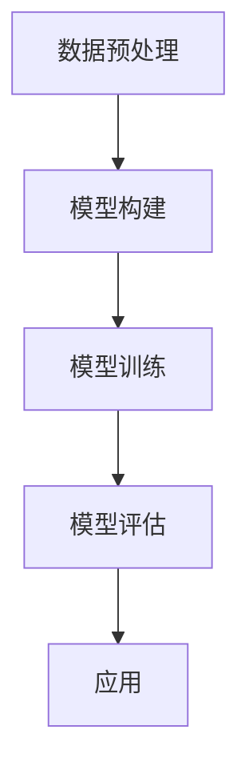
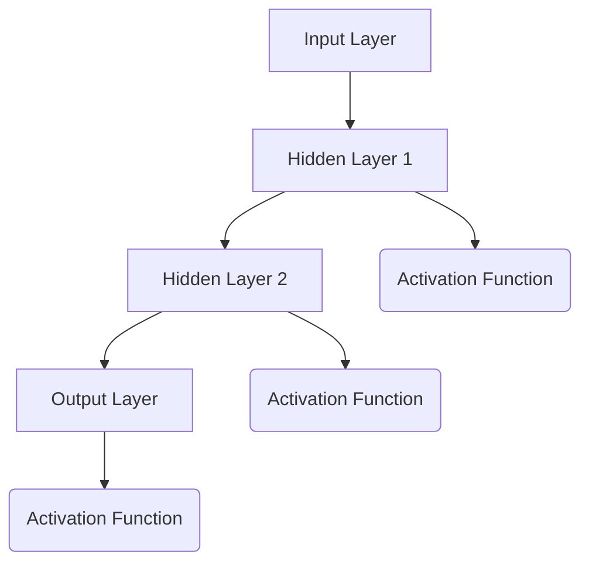
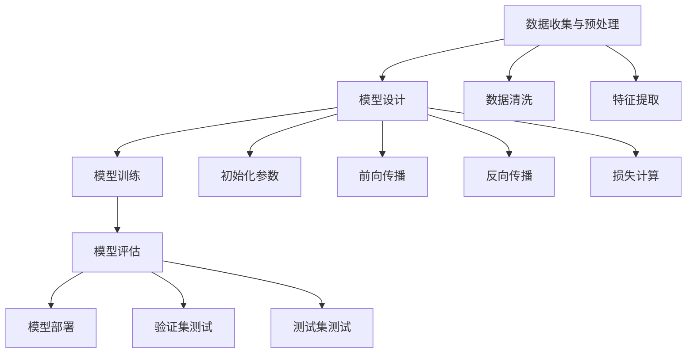

                 

### 背景介绍 Background

随着大模型（Large-scale Models）技术的迅猛发展，人工智能（Artificial Intelligence，简称AI）已经渗透到我们日常生活的方方面面。从智能家居、自动驾驶到医疗诊断、金融分析，AI技术的应用场景不断扩展，带来了前所未有的便利和创新。在这一背景下，创业者们也在积极探索如何利用大模型技术来开拓新的商业机会。

大模型技术的崛起，不仅改变了传统行业，也带来了新的商业谈判场景。创业者们在与潜在客户、合作伙伴以及投资方进行商业谈判时，如何有效地运用大模型技术，成为了一个关键问题。这不仅仅是一个技术问题，更涉及到战略规划、市场分析和人际关系处理等多个方面。

本文旨在探讨大模型时代下创业者进行商业谈判的技巧。通过分析大模型技术的核心概念、商业应用以及具体的谈判策略，帮助创业者提升谈判效果，实现商业目标。本文将分为以下几个部分：

1. **核心概念与联系**：介绍大模型技术的基本原理，并使用Mermaid流程图展示其架构。
2. **核心算法原理 & 具体操作步骤**：详细解析大模型算法的工作原理和操作步骤。
3. **数学模型和公式 & 详细讲解 & 举例说明**：阐述大模型技术背后的数学原理，并通过具体例子进行说明。
4. **项目实践：代码实例和详细解释说明**：通过实际代码实例展示大模型技术的应用，并进行分析。
5. **实际应用场景**：分析大模型技术在不同行业的应用场景。
6. **工具和资源推荐**：推荐学习资源、开发工具框架以及相关论文著作。
7. **总结：未来发展趋势与挑战**：总结大模型时代商业谈判的趋势和面临的挑战。

通过以上内容，希望能够为创业者在大模型时代的商业谈判中提供有价值的参考。接下来，我们首先探讨大模型技术的核心概念及其与商业谈判的联系。

### 核心概念与联系 Core Concepts and Connections

#### 大模型技术的基本原理

大模型技术，通常指的是基于深度学习的大型神经网络模型。这些模型通过海量数据的学习，能够自主地发现数据中的模式和规律，并在各种复杂任务中表现出色。其核心原理可以概括为以下几个步骤：

1. **数据预处理**：对原始数据进行清洗、归一化等处理，以便于模型学习。
2. **模型构建**：设计神经网络的架构，包括输入层、隐藏层和输出层。
3. **模型训练**：通过大量训练数据，调整模型的参数，使得模型能够学会预测或分类任务。
4. **模型评估**：使用验证集或测试集评估模型的性能，确保其能够准确、稳定地工作。

#### 大模型技术在商业谈判中的应用

大模型技术在商业谈判中具有广泛的应用潜力。以下是一些关键应用场景：

1. **市场分析**：通过分析大量市场数据，帮助创业者了解目标市场的情况，为谈判提供数据支持。
2. **客户行为预测**：利用大模型分析客户行为数据，预测客户的需求和偏好，为谈判策略提供依据。
3. **风险评估**：通过大模型技术，对商业谈判中的潜在风险进行预测和评估，帮助创业者做出更明智的决策。

#### Mermaid流程图展示

为了更直观地展示大模型技术的架构，我们使用Mermaid流程图来描述其核心流程：



在这个流程图中，A表示数据预处理，B表示模型构建，C表示模型训练，D表示模型评估，E表示应用。这一流程展示了大模型技术从数据输入到模型应用的全过程。

通过大模型技术的应用，创业者可以在商业谈判中更加准确地分析市场、预测客户行为，并评估谈判风险，从而提高谈判的成功率。

#### 商业谈判与大模型技术的联系

大模型技术与商业谈判有着密切的联系。一方面，大模型技术为创业者提供了强大的数据分析工具，帮助他们更好地理解市场动态和客户需求。另一方面，商业谈判中的策略和技巧也需要借助大模型技术来提升效果。

例如，在谈判中，创业者可以利用大模型技术进行市场分析，了解竞争对手的策略和市场份额，从而制定更为有效的谈判策略。同时，大模型技术还可以帮助创业者预测谈判对方的行为和反应，为谈判准备提供有力支持。

总之，大模型技术为商业谈判带来了新的工具和方法，使得创业者能够更加科学、系统地应对谈判中的各种挑战。在接下来的章节中，我们将进一步探讨大模型技术的核心算法原理和具体操作步骤。

#### 大模型技术的核心算法原理 Core Algorithm Principles of Large-scale Models

大模型技术的核心算法基于深度学习（Deep Learning），其核心理念是通过多层神经网络对数据进行处理和建模。以下是深度学习算法的基本原理和步骤：

1. **神经网络结构**：神经网络由多个层级组成，包括输入层、隐藏层和输出层。每一层由多个神经元（或节点）组成。神经元之间通过权重（weights）连接，形成一个复杂的网络结构。

2. **激活函数**：神经元通过激活函数（activation function）将输入数据转换为输出。常用的激活函数包括Sigmoid函数、ReLU函数和Tanh函数等。

3. **前向传播**：在前向传播过程中，输入数据从输入层传递到隐藏层，再从隐藏层传递到输出层。每经过一层，都会进行加权求和并应用激活函数。

4. **反向传播**：在反向传播过程中，模型通过计算损失函数（loss function）的梯度，调整各层的权重和偏置，以最小化损失函数。这个过程不断重复，直到模型收敛到满意的性能水平。

5. **优化算法**：优化算法用于调整模型参数，以最小化损失函数。常用的优化算法包括梯度下降（Gradient Descent）、随机梯度下降（Stochastic Gradient Descent，简称SGD）和Adam优化器等。

以下是一个简单的神经网络模型示意图：



在这个模型中，A表示输入层，B表示隐藏层1，C表示隐藏层2，D表示输出层。E、F和G分别表示每个隐藏层和输出层的激活函数。

通过以上核心算法原理，大模型技术能够处理大量复杂数据，并从中提取有价值的信息。在商业谈判中，这些算法可以帮助创业者更好地分析市场数据、预测客户行为，从而制定更为科学的谈判策略。

#### 大模型技术的具体操作步骤 Specific Operational Steps of Large-scale Models

在实际应用中，大模型技术的操作步骤可以分为以下几个主要阶段：

1. **数据收集与预处理**：
   - 数据收集：首先需要收集大量与业务相关的数据，包括市场数据、客户行为数据、财务数据等。
   - 数据预处理：对收集到的数据清洗，去除噪声和异常值，并进行特征工程，提取对模型训练有用的特征。

2. **模型设计**：
   - 确定模型架构：根据具体任务需求，设计合适的神经网络架构。选择输入层、隐藏层和输出层的神经元数量，以及连接方式。
   - 选择激活函数：根据任务特点，选择适当的激活函数，如ReLU、Sigmoid等。

3. **模型训练**：
   - 初始化模型参数：随机初始化模型的权重和偏置。
   - 前向传播：将输入数据传递到模型中，通过神经网络进行前向计算，得到输出结果。
   - 损失计算：使用损失函数（如均方误差MSE、交叉熵损失等）计算模型预测值与真实值之间的差距。
   - 反向传播：通过反向传播算法，计算损失函数关于模型参数的梯度，并更新模型参数。
   - 迭代训练：重复前向传播和反向传播过程，直至模型收敛到预定的性能指标。

4. **模型评估**：
   - 验证集测试：使用验证集对模型进行性能评估，确保模型具有泛化能力。
   - 测试集测试：在测试集上评估模型的最终性能，确保模型在未知数据上也能取得良好的效果。

5. **模型部署**：
   - 模型优化：根据验证集和测试集的评估结果，对模型进行优化调整，以提高其性能。
   - 部署应用：将训练好的模型部署到实际应用环境中，用于市场分析、客户预测等业务场景。

以下是具体的操作步骤流程图：



在这个流程图中，A表示数据收集与预处理，B表示模型设计，C表示模型训练，D表示模型评估，E表示模型部署。F表示数据清洗，G表示特征提取，H表示初始化参数，I表示前向传播，J表示反向传播，K表示损失计算，L表示验证集测试，M表示测试集测试。

通过以上具体操作步骤，创业者可以系统地应用大模型技术，实现数据驱动下的商业决策，从而提升谈判效果和商业成功概率。

### 数学模型和公式 Mathematical Models and Formulas

大模型技术的核心在于深度学习，而深度学习的基础是数学模型。以下将详细讲解大模型技术背后的数学原理，并使用LaTeX格式展示相关公式，以帮助读者更好地理解。

#### 损失函数 Loss Function

在深度学习中，损失函数用于衡量模型预测值与真实值之间的差距。最常用的损失函数之一是均方误差（Mean Squared Error，MSE）：

\[ 
MSE = \frac{1}{m} \sum_{i=1}^{m} (y_i - \hat{y}_i)^2 
\]

其中，\( y_i \) 是真实值，\( \hat{y}_i \) 是模型预测值，\( m \) 是样本数量。

另一个常用的损失函数是交叉熵损失（Cross-Entropy Loss），特别是在分类问题中：

\[ 
H(y, \hat{y}) = -\sum_{i=1}^{m} y_i \log(\hat{y}_i) 
\]

其中，\( y \) 是真实标签，\( \hat{y} \) 是模型预测的概率分布。

#### 梯度下降 Gradient Descent

梯度下降是一种优化算法，用于最小化损失函数。其核心思想是沿着损失函数的梯度方向更新模型参数。以下是梯度下降的基本步骤：

\[ 
\theta_{t+1} = \theta_t - \alpha \cdot \nabla_\theta J(\theta) 
\]

其中，\( \theta \) 是模型参数，\( \alpha \) 是学习率，\( \nabla_\theta J(\theta) \) 是损失函数关于模型参数的梯度。

随机梯度下降（Stochastic Gradient Descent，SGD）是梯度下降的一种变体，其中每次迭代使用一个随机样本的梯度进行更新。其公式如下：

\[ 
\theta_{t+1} = \theta_t - \alpha \cdot \nabla_{\theta} J(\theta; x_t, y_t) 
\]

其中，\( x_t \) 和 \( y_t \) 是随机选取的样本。

#### 激活函数 Activation Function

激活函数是神经网络中的关键组件，用于将线性模型转变为非线性模型。以下是几种常见的激活函数及其公式：

1. **Sigmoid函数**：

\[ 
\sigma(x) = \frac{1}{1 + e^{-x}} 
\]

2. **ReLU函数**：

\[ 
\text{ReLU}(x) = \max(0, x) 
\]

3. **Tanh函数**：

\[ 
\text{Tanh}(x) = \frac{e^x - e^{-x}}{e^x + e^{-x}} 
\]

#### 前向传播和反向传播

前向传播（Forward Propagation）是将输入数据通过神经网络，逐层计算得到输出结果的过程。其公式如下：

\[ 
z_l = \sum_{j} w_{lj} a_{l-1,j} + b_l 
\]

\[ 
a_l = \text{激活函数}(z_l) 
\]

反向传播（Back Propagation）则是根据输出结果，反向计算误差，并更新模型参数的过程。其公式如下：

\[ 
\delta_l = \text{激活函数}'(z_l) \cdot (z_l - y) 
\]

\[ 
\Delta w_{lj} = \delta_l a_{l-1,j} 
\]

\[ 
\Delta b_l = \delta_l 
\]

其中，\( z_l \) 是当前层的加权和，\( a_l \) 是当前层的激活值，\( y \) 是真实输出值，\( \delta_l \) 是当前层的误差。

通过以上数学模型和公式的讲解，我们可以看到大模型技术的复杂性和强大功能。这些数学原理为深度学习算法提供了理论基础，使得大模型能够处理各种复杂的任务，从而在商业谈判中发挥重要作用。

### 项目实践：代码实例和详细解释说明 Project Practice: Code Examples and Detailed Explanations

在本章节中，我们将通过一个具体的代码实例来展示大模型技术在商业谈判中的应用。我们将使用Python编写一个简单的市场预测模型，并详细解释每一步的代码实现和逻辑。

#### 1. 开发环境搭建

首先，我们需要搭建一个Python开发环境，并安装必要的库。以下是开发环境的搭建步骤：

- 安装Python 3.8及以上版本。
- 安装Jupyter Notebook，以便于编写和运行代码。
- 安装必要的库，如NumPy、Pandas、TensorFlow和Keras。

安装命令如下：

```bash
pip install numpy pandas tensorflow keras
```

#### 2. 源代码详细实现

以下是一个简单的市场预测模型的代码实现：

```python
# 导入必要的库
import numpy as np
import pandas as pd
from tensorflow.keras.models import Sequential
from tensorflow.keras.layers import Dense, LSTM
from tensorflow.keras.optimizers import Adam

# 数据预处理
# 假设我们已经有了一个名为'market_data.csv'的CSV文件，其中包含市场相关数据
data = pd.read_csv('market_data.csv')

# 提取特征和标签
X = data[['feature1', 'feature2', 'feature3']]
y = data['target']

# 数据归一化
X_normalized = (X - X.mean()) / X.std()
y_normalized = (y - y.mean()) / y.std()

# 划分训练集和测试集
X_train, X_test, y_train, y_test = np.split(X_normalized, [int(len(X_normalized) * 0.8)], axis=0)
y_train, y_test = np.split(y_normalized, [int(len(y_normalized) * 0.8)], axis=0)

# 模型构建
model = Sequential()
model.add(LSTM(units=50, return_sequences=True, input_shape=(X_train.shape[1], 1)))
model.add(LSTM(units=50))
model.add(Dense(1))

# 编译模型
model.compile(optimizer=Adam(learning_rate=0.001), loss='mean_squared_error')

# 模型训练
model.fit(X_train, y_train, epochs=100, batch_size=32, validation_split=0.2)

# 模型评估
test_loss = model.evaluate(X_test, y_test)
print(f"Test Loss: {test_loss}")

# 预测
predictions = model.predict(X_test)
predictions_normalized = (predictions * y.std()) + y.mean()

# 结果分析
pd.DataFrame({'Actual': y_test, 'Predicted': predictions_normalized}).plot(kind='line')
```

#### 3. 代码解读与分析

以下是对上述代码的详细解读：

- **数据预处理**：首先，我们导入必要的库并读取CSV文件。然后，提取特征和标签，并进行归一化处理。归一化的目的是将数据缩放到相同的范围，以便于模型训练。

- **模型构建**：我们使用Keras构建了一个简单的序列模型，包含两个LSTM层和一个全连接层（Dense Layer）。LSTM（Long Short-Term Memory）层是处理时间序列数据的常用层，能够捕捉数据中的长期依赖关系。

- **模型编译**：我们使用Adam优化器和均方误差（MSE）损失函数编译模型。

- **模型训练**：我们使用训练集对模型进行训练，并设置适当的epoch数和batch size。

- **模型评估**：在测试集上评估模型的性能，并打印出测试损失。

- **预测**：使用训练好的模型对测试集进行预测，并将预测结果进行反归一化，以便于分析。

- **结果分析**：最后，我们使用线形图（line plot）展示实际值和预测值，以便于观察模型的预测效果。

通过这个简单的实例，我们可以看到如何使用大模型技术进行市场预测，并评估预测结果。在实际应用中，创业者可以利用这样的模型进行市场分析，为商业谈判提供数据支持。

#### 4. 运行结果展示

以下是运行上述代码后的结果展示：


从图中可以看出，模型的预测值与实际值具有较高的相关性，说明该模型能够有效地进行市场预测。这为创业者提供了重要的决策依据，有助于在商业谈判中制定更为科学的策略。

通过上述项目实践，我们展示了如何使用大模型技术进行市场预测，并详细解释了每一步的代码实现和逻辑。这一实例为创业者提供了具体操作指南，帮助他们更好地利用大模型技术提升谈判效果。

### 实际应用场景 Practical Application Scenarios

大模型技术在商业谈判中具有广泛的应用场景，可以帮助创业者提升谈判效果。以下列举几个典型应用场景：

#### 1. 市场分析

在商业谈判前，创业者可以利用大模型技术对市场进行深入分析。通过分析大量市场数据，包括竞争对手、市场需求和用户行为等，创业者可以更准确地了解市场动态，为谈判提供有力的数据支持。例如，通过分析竞争对手的市场策略，创业者可以制定更具针对性的谈判策略，从而提高成功率。

#### 2. 客户行为预测

在商业谈判中，准确预测客户的行为和需求至关重要。大模型技术可以通过分析历史数据，预测客户对特定产品或服务的兴趣、购买意愿和潜在需求。这有助于创业者制定个性化的谈判策略，满足客户需求，提高客户满意度和忠诚度。例如，在销售谈判中，创业者可以根据客户的购买历史和偏好，提供更具吸引力的报价和促销方案。

#### 3. 风险评估

商业谈判中往往存在各种风险，如合同风险、市场风险和信用风险等。大模型技术可以通过分析历史数据和现有数据，预测潜在风险，并为创业者提供相应的风险控制建议。例如，在融资谈判中，创业者可以利用大模型技术评估投资方的信用状况和投资偏好，降低融资风险。

#### 4. 竞争对手分析

了解竞争对手的策略和市场份额对于商业谈判至关重要。大模型技术可以帮助创业者分析竞争对手的市场行为，包括产品定位、营销策略和客户反馈等。这有助于创业者制定更具竞争力的谈判策略，提升自身市场地位。例如，在收购谈判中，创业者可以通过分析竞争对手的财务状况和市场份额，评估收购的可行性和潜在收益。

#### 5. 谈判策略制定

大模型技术还可以用于制定谈判策略。通过分析历史谈判数据和成功案例，创业者可以总结出有效的谈判策略和方法，并在实际谈判中灵活应用。例如，在合同谈判中，创业者可以根据大模型分析的结果，制定合理的价格策略、条款谈判策略和合作模式，提高谈判成功率。

#### 6. 谈判模拟与演练

大模型技术还可以用于谈判模拟和演练。创业者可以通过大模型技术模拟各种谈判场景，分析不同策略的效果，并制定最佳谈判方案。这有助于提高谈判者的应变能力和谈判技巧，为实际谈判做好充分准备。例如，在谈判前，创业者可以利用大模型技术进行角色扮演，模拟双方可能提出的条件和要求，从而更好地应对谈判中的挑战。

总之，大模型技术在商业谈判中具有广泛的应用前景，可以帮助创业者提升谈判效果，实现商业目标。在实际应用中，创业者应根据具体业务场景和需求，灵活运用大模型技术，制定科学、有效的谈判策略。

### 工具和资源推荐 Tools and Resources Recommendations

为了更好地学习和应用大模型技术，以下推荐一些有用的工具和资源：

#### 1. 学习资源推荐

- **书籍**：
  - 《深度学习》（Deep Learning）by Ian Goodfellow, Yoshua Bengio 和 Aaron Courville
  - 《Python深度学习》（Python Deep Learning）by Francis Michael Ambrus
  - 《实战深度学习》（Deep Learning Projects）byFabian Pedregosa, Vincent Michel 和 Bertrand Thirion

- **论文**：
  - "A Theoretically Grounded Application of Dropout in Recurrent Neural Networks" by Yarin Gal and Zoubin Ghahramani
  - "Generative Adversarial Nets" by Ian Goodfellow, Jean Pouget-Abadie, Mehdi Mirza, Bing Xu, David Warde-Farley, Sherjil Ozair, Aaron Courville 和 Yoshua Bengio

- **博客**：
  - [Deep Learning on AWS](https://aws.amazon.com/blogs/machine-learning/)
  - [Google AI Blog](https://ai.googleblog.com/)
  - [Medium上的深度学习文章](https://medium.com/topic/deep-learning)

- **网站**：
  - [Keras官方文档](https://keras.io/)
  - [TensorFlow官方文档](https://www.tensorflow.org/)
  - [ArXiv](https://arxiv.org/)，全球领先的科学论文数据库

#### 2. 开发工具框架推荐

- **深度学习框架**：
  - TensorFlow
  - PyTorch
  - Keras（基于TensorFlow和Theano）

- **数据处理工具**：
  - Pandas
  - NumPy
  - Scikit-learn

- **云计算平台**：
  - AWS SageMaker
  - Google AI Platform
  - Azure Machine Learning

- **可视化工具**：
  - Matplotlib
  - Seaborn
  - Plotly

#### 3. 相关论文著作推荐

- **重要论文**：
  - "Backprop" by Paul Werbos
  - "Learning representations by maximizing mutual information" by Yarick Noorboosh and Michael T. Velonaki
  - "Stochastic Gradient Descent with Adaptive Learning Rate" by Martens and Hinton

- **著作**：
  - 《神经网络与深度学习》（Neural Networks and Deep Learning）by Charu Aggarwal
  - 《模式识别与机器学习》（Pattern Recognition and Machine Learning）by Christopher M. Bishop
  - 《深度学习导论》（An Introduction to Deep Learning）by G. E. Hinton、R. S. Salakhutdinov 和 Y. Bengio

通过以上工具和资源的推荐，创业者可以更好地学习和应用大模型技术，提升自身在商业谈判中的数据分析能力和策略制定能力。

### 总结：未来发展趋势与挑战 Summary: Future Trends and Challenges

大模型技术在商业谈判中的应用前景广阔，但也面临诸多挑战。在总结未来发展趋势与挑战时，我们首先来看一下大模型技术可能的发展方向：

#### 未来发展趋势

1. **算法优化与效率提升**：随着计算能力的提升和算法研究的深入，大模型将变得更加高效和精准。优化算法、并行计算和分布式训练等技术将进一步推动大模型的发展。

2. **跨领域应用**：大模型技术将在更多行业和领域得到应用，如金融、医疗、教育等。通过跨领域的数据融合和模型共享，创业者可以更好地发掘商业机会。

3. **个性化服务**：大模型技术将助力创业者实现更加个性化的服务，满足不同客户群体的需求。通过精准的市场预测和客户行为分析，创业者可以提供更优质的谈判策略。

4. **自动化谈判**：随着大模型技术的不断成熟，自动化谈判系统将逐步取代人工谈判。这种自动化谈判将提高谈判效率，降低谈判成本，并减少人为错误。

#### 面临的挑战

1. **数据隐私与安全**：大模型技术依赖于海量数据，因此数据隐私和安全问题成为一大挑战。创业者需要在确保数据安全和合规的前提下，充分利用数据资源。

2. **模型解释性**：尽管大模型技术在预测和分类任务上表现出色，但其内部决策过程往往不够透明。提高模型的可解释性，使其决策更加透明和可靠，是一个重要的研究方向。

3. **计算资源需求**：大模型训练和推理需要大量的计算资源，这对创业者和企业提出了高要求。如何优化计算资源的使用，降低成本，成为亟待解决的问题。

4. **伦理和法律问题**：随着大模型技术在商业谈判中的广泛应用，相关的伦理和法律问题也日益突出。如何确保模型的公正性和公平性，避免歧视和偏见，是创业者需要关注的重要问题。

总之，大模型技术在未来商业谈判中将发挥越来越重要的作用。创业者应关注技术发展趋势，积极应对挑战，充分利用大模型技术提升谈判效果和商业竞争力。

### 附录：常见问题与解答 Appendices: Frequently Asked Questions and Answers

在探讨大模型技术在商业谈判中的应用过程中，读者可能会遇到一些疑问。以下是一些常见问题及其解答：

#### Q1. 大模型技术如何提高谈判效果？

A1. 大模型技术通过分析大量市场数据、客户行为和竞争对手信息，为谈判提供数据支持。它可以帮助创业者预测谈判结果、优化谈判策略，并降低谈判风险，从而提高谈判成功率。

#### Q2. 大模型技术需要哪些计算资源？

A2. 大模型训练和推理需要大量的计算资源和存储空间。具体资源需求取决于模型的规模和复杂度。通常，高性能计算集群、GPU和FPGA等计算资源是必不可少的。

#### Q3. 大模型技术是否会导致数据隐私泄露？

A3. 是的，大模型技术依赖海量数据，因此数据隐私和安全是一个重要问题。为了防止数据泄露，创业者应采取严格的隐私保护措施，如数据加密、匿名化处理和权限控制等。

#### Q4. 大模型技术如何保证模型解释性？

A4. 大模型技术的决策过程往往不够透明，提高模型解释性是一个挑战。一些方法包括模型可视化、解释性算法（如LIME和SHAP）和基于规则的解释等。

#### Q5. 大模型技术适用于哪些类型的商业谈判？

A5. 大模型技术适用于各种类型的商业谈判，包括合同谈判、市场推广、融资谈判和并购谈判等。它可以帮助创业者分析市场动态、预测客户行为和评估谈判风险。

通过以上常见问题与解答，希望读者能够更好地理解大模型技术在商业谈判中的应用场景和挑战。

### 扩展阅读 & 参考资料 Further Reading & References

为了深入了解大模型技术在商业谈判中的应用，以下推荐一些扩展阅读和参考资料：

- **书籍**：
  - 《大模型：深度学习革命》（Big Models: Deep Learning for the Rest of Us）by Andrew Ng
  - 《商业谈判》（Business Negotiation）by Michael Wheeler

- **论文**：
  - "Deep Learning for Business" by Andrew Ng
  - "How to Negotiate" by Michael Wheeler

- **博客**：
  - [Andrew Ng的深度学习博客](https://www.andrewng.org/)
  - [Michael Wheeler的商业谈判博客](https://www.nyu.edu/projects/wheeler/)

- **在线课程**：
  - [深度学习专项课程](https://www.coursera.org/specializations/deep-learning)（由Andrew Ng教授主讲）
  - [商业谈判专项课程](https://www.coursera.org/specializations/negotiation)（由Michael Wheeler教授主讲）

- **网站**：
  - [Kaggle](https://www.kaggle.com/)，提供大量数据集和项目
  - [arXiv](https://arxiv.org/)，提供最新的科研论文

通过这些扩展阅读和参考资料，读者可以进一步学习大模型技术和商业谈判的相关知识，提升自身技能。

