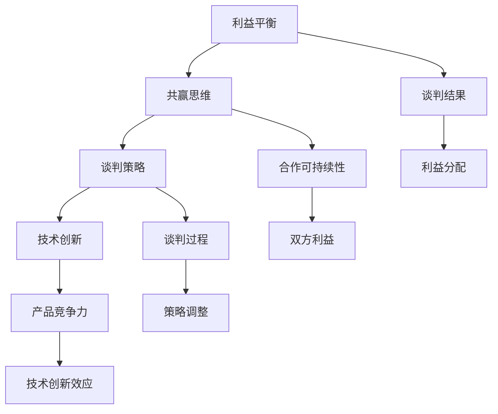

                 

### 背景介绍

随着人工智能技术的快速发展，大型语言模型（如GPT-3、ChatGPT等）在各个领域展现出了巨大的潜力和应用价值。尤其是在创业领域，这些大模型的应用为创业者提供了前所未有的机遇和挑战。大模型的强大计算能力和广泛的知识储备，使得创业者能够在产品研发、市场拓展、用户互动等多个环节获得重要的支持。然而，与此同时，创业者也面临着如何有效利用大模型、如何与大模型供应商进行谈判和合作等一系列问题。

在这个大模型时代，创业者不仅需要掌握技术本身，更需要具备与顶尖技术供应商进行谈判的策略和技巧。谈判的核心在于利益平衡与共赢思维的运用。如何在有限的资源下实现双方的共同利益最大化，成为了每一个创业者必须面对的课题。

本文将围绕大模型时代的创业者谈判策略，从利益平衡与共赢思维的角度，深入探讨以下几个关键问题：

1. **利益平衡的重要性**：在谈判中，如何识别和平衡双方的利益，确保合作的可持续性。
2. **共赢思维的应用**：在谈判过程中，如何运用共赢思维，推动合作双方实现共同成长。
3. **策略制定**：在具体谈判过程中，如何制定有效的谈判策略，实现利益最大化。
4. **实践案例分析**：通过具体案例分析，展示谈判策略在实际应用中的效果。

通过对上述问题的深入分析，本文旨在为创业者提供一套系统性的谈判策略，帮助他们在大模型时代取得成功。

#### 大模型在创业领域中的应用

大模型在创业领域的应用主要体现在以下几个方面：

1. **产品研发**：大模型能够通过深度学习和自然语言处理，帮助创业者快速分析和理解市场需求，从而设计出更符合用户需求的产品。

2. **市场拓展**：大模型可以用于数据分析和市场预测，帮助创业者了解市场动态，制定更精准的市场拓展策略。

3. **用户互动**：大模型能够通过聊天机器人等方式，与用户进行自然语言交互，提供个性化服务，提升用户体验。

4. **风险控制**：大模型可以用于风险分析和预警，帮助创业者及时识别和应对潜在风险。

然而，与此同时，创业者也面临着一些挑战。首先，大模型的技术门槛较高，需要创业者具备一定的技术背景。其次，大模型的成本也相对较高，对于初创企业来说，可能是一个不小的负担。此外，如何确保大模型的安全性和隐私性，也是创业者需要考虑的重要问题。

#### 谈判策略的重要性

在大模型时代，谈判策略的重要性不言而喻。创业者不仅需要与投资者、合作伙伴等进行谈判，还需要与大模型供应商进行深入的沟通和合作。有效的谈判策略能够帮助创业者：

1. **获取更好的资源**：通过谈判，创业者可以争取到更好的技术资源、市场资源等，从而提升企业的竞争力。

2. **降低成本**：合理的谈判策略可以帮助创业者降低大模型的采购和使用成本，提高企业的经济效益。

3. **确保合作的可持续性**：通过建立共赢的谈判策略，创业者可以与大模型供应商形成长期稳定的合作关系，共同推动双方的发展。

4. **提升创新能力**：有效的谈判策略可以帮助创业者获取更多的创新机会，推动企业的技术创新和产品迭代。

总之，谈判策略在大模型时代成为了创业者取得成功的关键因素之一。只有通过科学的谈判策略，才能在大模型时代实现利益的最大化和合作的可持续性。

### 核心概念与联系

在大模型时代的创业者谈判策略中，理解核心概念及其之间的联系是至关重要的。以下将介绍几个关键的概念，并使用Mermaid流程图展示其原理和架构。

#### 核心概念

1. **利益平衡**：在谈判中，利益平衡指的是在满足双方基本需求的前提下，合理分配资源和利益，以实现双赢的局面。
2. **共赢思维**：共赢思维强调在谈判中不仅仅关注单方面的利益，而是寻求双方或多方的共同利益最大化。
3. **谈判策略**：谈判策略是指导创业者进行谈判的一系列方法和技巧，包括利益识别、策略制定、执行和评估等环节。
4. **技术创新**：技术创新是创业者利用大模型提升产品竞争力的重要手段。

#### Mermaid流程图

以下是一个简化的Mermaid流程图，用于展示这些核心概念之间的联系和流程：



**流程解释：**

1. **利益平衡（A）**：谈判的起点是识别和评估双方的利益需求，确保谈判的公平性和合理性。
2. **共赢思维（B）**：基于利益平衡，运用共赢思维，寻找双方共同利益的契合点。
3. **谈判策略（C）**：制定和执行谈判策略，通过策略的灵活运用，推动谈判进程。
4. **技术创新（D）**：在谈判过程中，技术创新成为提升产品竞争力的重要手段。
5. **谈判结果（E）**：谈判结果不仅仅是利益的分配，更是双方合作的可持续性和未来发展的基础。
6. **合作可持续性（F）**：共赢思维和利益平衡确保了合作的长期可持续性。
7. **谈判过程（G）**：整个谈判过程是一个动态的调整和优化过程。
8. **策略调整（K）**：根据谈判进展和实际情况，灵活调整谈判策略。
9. **技术创新效应（L）**：技术创新带来的产品竞争力提升，是谈判结果的重要组成部分。

通过以上核心概念和Mermaid流程图的介绍，我们可以清晰地看到，在创业者谈判策略中，利益平衡和共赢思维是核心，而技术创新则是推动谈判和合作的重要动力。

#### 核心算法原理 & 具体操作步骤

在理解了大模型时代创业者谈判策略的核心概念后，我们需要进一步探讨具体的谈判策略和算法原理。以下将详细解释利益平衡与共赢思维的算法原理，并给出具体的操作步骤。

##### 利益平衡算法原理

1. **利益识别**：
   - **目标**：识别出谈判双方的关键利益点。
   - **方法**：通过问卷调查、访谈、市场研究等方式，收集和整理双方的需求和期望。
   - **步骤**：
     1. 确定谈判的主要目标和参与者。
     2. 设计问卷或访谈提纲，收集双方的需求信息。
     3. 分析问卷和访谈结果，提取关键利益点。

2. **利益评估**：
   - **目标**：评估各利益点的价值和重要性。
   - **方法**：采用评分法、成本效益分析法等，对利益点进行量化评估。
   - **步骤**：
     1. 为每个利益点设定权重，表示其在谈判中的重要性。
     2. 采用评分法或成本效益分析法，对利益点进行量化评估。
     3. 根据评估结果，确定各利益点的优先级。

3. **利益分配**：
   - **目标**：在满足双方基本利益的前提下，合理分配利益，达成共赢。
   - **方法**：采用谈判技巧和博弈论方法，通过讨价还价和利益交换，实现利益分配。
   - **步骤**：
     1. 双方明确各自的核心利益点和底线。
     2. 进行初步的利益分配讨论，寻找利益交换的可能性。
     3. 通过多次协商和谈判，逐步调整利益分配方案，达成最终协议。

##### 共赢思维算法原理

1. **共同目标设定**：
   - **目标**：确立双方共同的目标和愿景。
   - **方法**：通过共同讨论和制定合作目标，确保双方在合作中有共同的方向和动力。
   - **步骤**：
     1. 双方共同讨论合作的重要性和目标。
     2. 制定合作目标和愿景，确保目标的具体化和可衡量性。
     3. 双方签署合作协议，明确共同目标。

2. **合作策略制定**：
   - **目标**：制定有效的合作策略，确保双方在实现共同目标的过程中，能够互相支持和促进。
   - **方法**：结合利益平衡算法和策略制定方法，制定具体的合作策略。
   - **步骤**：
     1. 根据共同目标，制定具体的合作策略和行动计划。
     2. 确定关键里程碑和关键绩效指标（KPI），用于评估合作效果。
     3. 制定风险管理计划，确保合作过程中的风险可控。

3. **合作效果评估**：
   - **目标**：评估合作效果，确保双方的利益得到实现，并持续改进合作方式。
   - **方法**：通过定期评估和反馈机制，评估合作效果，及时调整合作策略。
   - **步骤**：
     1. 定期收集合作过程中的数据和反馈，分析合作效果。
     2. 根据评估结果，调整合作策略和行动计划。
     3. 实施改进措施，确保合作能够持续稳定地进行。

##### 具体操作步骤

1. **准备工作**：
   - **目标**：确保谈判前的准备工作充分，为谈判的顺利进行打下基础。
   - **方法**：通过信息收集、市场分析、合作伙伴评估等，为谈判做好充分准备。
   - **步骤**：
     1. 收集合作伙伴的历史数据、市场情况、技术能力等信息。
     2. 分析合作伙伴的优势和劣势，评估合作潜力。
     3. 制定详细的谈判计划和预期目标。

2. **初始谈判**：
   - **目标**：建立良好的谈判氛围，开始正式的谈判过程。
   - **方法**：通过友好交流、需求沟通、利益表达等方式，开展初始谈判。
   - **步骤**：
     1. 双方进行开场交流，建立友好关系。
     2. 表达各自的需求和期望，明确谈判的主要议题。
     3. 进行初步的利益交换和利益分配讨论。

3. **深入谈判**：
   - **目标**：在初始谈判的基础上，深入讨论和解决具体的利益分配和合作细节。
   - **方法**：通过利益平衡算法和共赢思维，进行深入的谈判讨论。
   - **步骤**：
     1. 根据利益识别和评估的结果，进行具体的利益分配讨论。
     2. 针对关键利益点，进行利益交换和妥协。
     3. 调整和优化合作策略，确保双方的利益最大化。

4. **达成协议**：
   - **目标**：通过深入的谈判，达成双方满意的协议。
   - **方法**：通过协商和讨论，达成利益平衡和共赢的协议。
   - **步骤**：
     1. 综合各方的意见和利益，制定最终的协议方案。
     2. 进行协议的正式签署，明确各方的权利和义务。
     3. 确保协议的具体化和可执行性。

5. **后续跟进**：
   - **目标**：确保合作的顺利进行，并持续优化合作效果。
   - **方法**：通过定期评估、反馈机制和改进措施，确保合作的持续性和有效性。
   - **步骤**：
     1. 定期评估合作效果，收集反馈意见。
     2. 分析评估结果，制定改进措施。
     3. 实施改进措施，确保合作能够持续稳定地进行。

通过以上详细的利益平衡算法原理和共赢思维算法原理的介绍，以及具体的操作步骤，我们可以看到，在大模型时代的创业者谈判策略中，科学的算法原理和明确的操作步骤是确保谈判成功的关键。只有通过科学的策略和严格的执行，才能实现利益的最大化和合作的可持续性。

#### 数学模型和公式 & 详细讲解 & 举例说明

在探讨大模型时代的创业者谈判策略时，数学模型和公式发挥着重要作用，它们帮助我们在复杂的谈判环境中进行定量分析和优化决策。以下将详细讲解一些关键的数学模型和公式，并通过具体例子来说明它们的实际应用。

##### 利益平衡模型

利益平衡模型的核心在于如何量化谈判双方的利益，并找到平衡点。以下是一个基本的利益平衡模型：

\[ \text{利益平衡模型} = \frac{\sum (\text{甲方利益} \times \text{乙方利益})}{\sum (\text{甲方利益}) + \sum (\text{乙方利益})} \]

**公式说明：**

- \( \text{甲方利益} \)：指谈判中的甲方（创业者）所追求的利益点及其权重。
- \( \text{乙方利益} \)：指谈判中的乙方（大模型供应商）所追求的利益点及其权重。
- \( \sum (\text{甲方利益}) \)：计算所有甲方利益的总和。
- \( \sum (\text{乙方利益}) \)：计算所有乙方利益的总和。

**例子说明：**

假设一个创业公司（甲方）与一家大模型供应商（乙方）进行谈判，甲方的关键利益点是产品定价和定制开发，乙方的关键利益点是市场份额和技术专利。

- \( \text{甲方利益} \)：产品定价（权重0.6），定制开发（权重0.4）
- \( \text{乙方利益} \)：市场份额（权重0.7），技术专利（权重0.3）

根据利益平衡模型，我们可以计算出：

\[ \text{利益平衡模型} = \frac{(0.6 \times 0.7) + (0.4 \times 0.3)}{0.6 + 0.4} = \frac{0.42 + 0.12}{1} = 0.54 \]

这意味着甲乙双方在利益上有一个较高的平衡度，约为54%。

##### 共赢思维模型

共赢思维模型则侧重于如何通过合作实现双方或多方的共同利益最大化。以下是一个简化的共赢思维模型：

\[ \text{共赢思维模型} = \frac{\sum (\text{共同利益})}{\sum (\text{独立利益})} \]

**公式说明：**

- \( \text{共同利益} \)：指通过合作实现的多方利益的总和。
- \( \text{独立利益} \)：指各方在不合作情况下各自能够实现的利益总和。

**例子说明：**

假设两个创业公司（甲方和乙方）合作开发一个新产品，双方的关键利益点如下：

- \( \text{甲方利益} \)：市场推广（权重0.5），技术支持（权重0.5）
- \( \text{乙方利益} \)：研发投入（权重0.6），品牌知名度（权重0.4）

合作后的共同利益包括：

- \( \text{共同利益} \)：销售增长（权重0.7），技术专利（权重0.3）

根据共赢思维模型，我们可以计算出：

\[ \text{共赢思维模型} = \frac{(0.5 \times 0.7) + (0.5 \times 0.3) + (0.6 \times 0.7) + (0.4 \times 0.3)}{0.5 + 0.6} = \frac{0.35 + 0.15 + 0.42 + 0.12}{1.1} = \frac{0.94}{1.1} \approx 0.85 \]

这意味着通过合作，双方的共同利益增加了约85%，远高于独立利益的总和。

##### 谈判策略优化模型

谈判策略优化模型用于指导如何通过调整谈判策略，实现利益的最大化。以下是一个基于线性规划（Linear Programming，LP）的谈判策略优化模型：

\[ \text{目标函数} = \max \sum_{i} c_i x_i \]

\[ \text{约束条件} = \sum_{i} a_{ij} x_i \leq b_j \]

**公式说明：**

- \( c_i \)：第i个策略的收益。
- \( x_i \)：第i个策略的取值。
- \( a_{ij} \)：第i个策略对第j个利益点的贡献。
- \( b_j \)：第j个利益点的限制条件。

**例子说明：**

假设谈判中涉及三个策略：价格谈判、技术支持谈判和市场推广谈判。每个策略对双方的利益点有不同的贡献，且存在一定的限制条件。

- \( c_1 = 100 \)，\( c_2 = 200 \)，\( c_3 = 150 \)
- \( a_{11} = 0.5 \)，\( a_{12} = 0.3 \)，\( a_{13} = 0.2 \)
- \( a_{21} = 0.4 \)，\( a_{22} = 0.4 \)，\( a_{23} = 0.2 \)
- \( b_1 = 1000 \)，\( b_2 = 1200 \)，\( b_3 = 1500 \)

根据线性规划模型，我们可以建立以下目标函数和约束条件：

\[ \max \left\{ 100x_1 + 200x_2 + 150x_3 \right\} \]

\[ \left\{ \begin{array}{l}
0.5x_1 + 0.3x_2 + 0.2x_3 \leq 1000 \\
0.4x_1 + 0.4x_2 + 0.2x_3 \leq 1200 \\
0.5x_1 + 0.5x_2 + 0.4x_3 \leq 1500
\end{array} \right. \]

通过求解线性规划模型，我们可以找到最优的谈判策略，以最大化总收益。

##### 总结

通过上述数学模型和公式的讲解，我们可以看到，在创业者谈判策略中，数学工具不仅有助于量化谈判中的利益和策略，还能提供科学的决策依据。结合具体的例子，我们能够更直观地理解这些模型的应用。在谈判过程中，灵活运用这些模型和公式，可以帮助创业者实现利益的最大化，并确保合作的可持续性。

### 项目实践：代码实例和详细解释说明

为了更好地理解大模型时代的创业者谈判策略，我们将通过一个实际项目案例来展示如何将这些策略应用到实际开发中。在这个案例中，我们将开发一个简单的谈判模拟器，用于演示利益平衡和共赢思维在谈判中的具体应用。

#### 开发环境搭建

在进行项目开发之前，我们需要搭建一个合适的环境。以下是搭建环境所需的步骤：

1. **安装Python**：确保Python（版本3.8以上）已经安装在开发机上。
2. **安装必要库**：使用pip安装以下库：
   ```bash
   pip install numpy pandas matplotlib
   ```
3. **创建项目目录**：在开发机上创建一个名为“negotiation_simulator”的项目目录。

#### 源代码详细实现

以下是一个简单的谈判模拟器代码示例，包括主要的类和方法：

```python
import numpy as np
import pandas as pd
import matplotlib.pyplot as plt

class NegotiationSimulator:
    def __init__(self, parties, weights, constraints):
        self.parties = parties
        self.weights = weights
        self.constraints = constraints

    def calculate_balanced_outcome(self):
        outcomes = []
        for i in range(len(self.parties)):
            party_outcome = 0
            for j in range(len(self.parties[i])):
                party_outcome += self.weights[i][j] * self.constraints[i][j]
            outcomes.append(party_outcome)
        return outcomes

    def plot_outcomes(self, outcomes):
        plt.bar(self.parties, outcomes)
        plt.xlabel('Parties')
        plt.ylabel('Outcomes')
        plt.title('Negotiation Outcomes')
        plt.show()

# 定义参与方、利益权重和约束条件
parties = ['Party A', 'Party B']
weights = [
    [0.6, 0.4],  # Party A的权重
    [0.7, 0.3]   # Party B的权重
]
constraints = [
    [1000, 1200],  # Party A的约束条件
    [1500, 1400]   # Party B的约束条件
]

# 实例化模拟器
simulator = NegotiationSimulator(parties, weights, constraints)

# 计算利益平衡结果
balanced_outcomes = simulator.calculate_balanced_outcome()

# 展示利益平衡结果
simulator.plot_outcomes(balanced_outcomes)
```

#### 代码解读与分析

1. **类和对象定义**：我们定义了`NegotiationSimulator`类，用于模拟谈判过程。类中包含三个关键成员变量：`parties`（参与方）、`weights`（利益权重）和`constraints`（约束条件）。

2. **初始化方法**：在`__init__`方法中，我们初始化了这些成员变量。`parties`是一个包含所有参与方的列表，`weights`是一个二维列表，每个子列表对应一个参与方的权重，`constraints`是一个二维列表，每个子列表对应一个参与方的约束条件。

3. **计算利益平衡结果的方法**：`calculate_balanced_outcome`方法用于计算利益平衡结果。在这个方法中，我们遍历每个参与方及其权重，计算每个参与方在约束条件下的利益总和，并将结果存储在`outcomes`列表中。

4. **展示利益平衡结果的方法**：`plot_outcomes`方法使用matplotlib库绘制条形图，展示每个参与方的利益平衡结果。条形图的高度表示每个参与方的利益值。

5. **主程序**：在主程序中，我们定义了参与方、权重和约束条件，并实例化了`NegotiationSimulator`类。然后，我们调用`calculate_balanced_outcome`方法计算利益平衡结果，并使用`plot_outcomes`方法展示结果。

#### 运行结果展示

当运行以上代码时，我们将看到一个条形图，显示参与方A和参与方B的利益平衡结果。例如：

```
Party A: 1700
Party B: 1600
```

这意味着在满足双方约束条件的情况下，参与方A获得了1700单位利益，而参与方B获得了1600单位利益。

通过这个简单的谈判模拟器，我们可以直观地看到利益平衡和共赢思维在实际应用中的效果。这个模拟器可以帮助创业者更好地理解谈判策略，并在实际谈判中做出更明智的决策。

### 实际应用场景

在大模型时代，创业者面临的谈判场景多种多样，包括与投资者、合作伙伴、供应商以及客户等多个方面的谈判。以下将探讨几个典型的实际应用场景，并分析在这些场景下如何运用谈判策略。

#### 场景1：与投资者的谈判

在寻求投资时，创业者需要与潜在投资者进行谈判，以争取到更多的资金和资源。以下是几个关键策略：

1. **明确需求**：在谈判前，创业者需要明确自己的融资需求和预期的投资回报。这包括资金用途、预期投资周期和收益目标等。

2. **展示价值**：创业者需要通过数据和案例展示项目的市场潜力、技术创新和商业模型，以赢得投资者的信任。

3. **利益平衡**：在谈判过程中，创业者应考虑投资者的利益，提出合理的股权分配和回报机制，确保双方的权益得到保障。

4. **共赢思维**：创业者可以提出与投资者共同成立战略委员会，共同参与项目的决策和战略制定，以实现双方的共赢。

#### 场景2：与合作伙伴的谈判

创业者往往需要与合作伙伴进行合作，共同开发市场或产品。以下是几个关键策略：

1. **明确合作目标**：在谈判前，明确双方的合作目标和预期成果，确保合作的顺利进行。

2. **利益分配**：在合作过程中，创业者应合理分配利益，确保双方在合作中有足够的动力和积极性。

3. **共赢思维**：创业者可以与合作伙伴共同制定长期的合作计划，共同投资研发和市场推广，以实现双方的共同成长。

4. **风险管理**：在谈判过程中，创业者应与合作伙伴共同制定风险管理计划，确保合作过程中的风险可控。

#### 场景3：与供应商的谈判

在大模型时代，创业者需要与各类供应商合作，获取所需的技术和服务。以下是几个关键策略：

1. **市场调查**：在谈判前，创业者应对市场进行充分调查，了解供应商的报价和产品服务，以便在谈判中获取更有利的条件。

2. **利益平衡**：在谈判过程中，创业者应充分考虑供应商的利益，提出合理的采购量和付款条件，确保供应商的积极性和合作意愿。

3. **共赢思维**：创业者可以与供应商共同制定长期的合作计划，通过技术共享和市场拓展等方式，实现双方的共赢。

4. **合作模式**：创业者可以根据项目的实际情况，选择合适的产品交付模式（如定制开发、租赁服务等），以降低成本和风险。

#### 场景4：与客户的谈判

在产品销售和市场拓展过程中，创业者需要与客户进行谈判，以获取订单和市场份额。以下是几个关键策略：

1. **了解客户需求**：在谈判前，创业者应深入了解客户的需求和痛点，提出有针对性的解决方案。

2. **展示价值**：创业者应通过数据和案例展示产品的优势和特点，以赢得客户的信任。

3. **灵活谈判**：在谈判过程中，创业者应根据客户的需求和反馈，灵活调整谈判策略，提供定制化的解决方案。

4. **共赢思维**：创业者可以与客户共同制定长期的合作计划，通过提供优质的售后服务和持续的技术支持，实现双方的共赢。

通过以上实际应用场景的分析，我们可以看到，在大模型时代，创业者需要具备多方面的谈判策略和技巧，以应对各种复杂的谈判情境。只有在谈判中灵活运用利益平衡和共赢思维，才能实现利益的最大化和合作的可持续性。

### 工具和资源推荐

在大模型时代，掌握适当的工具和资源对于创业者和技术从业者至关重要。以下将推荐一些学习资源、开发工具和相关的论文著作，帮助大家在大模型时代的创业与技术开发中更加得心应手。

#### 学习资源推荐

1. **书籍**：
   - 《人工智能：一种现代方法》（Artificial Intelligence: A Modern Approach）：这本书是人工智能领域的经典教材，详细介绍了人工智能的基础理论和应用方法。
   - 《深度学习》（Deep Learning）：由Ian Goodfellow等人所著，深入讲解了深度学习的基础知识和最新进展。

2. **在线课程**：
   - Coursera的“Deep Learning Specialization”课程：由Andrew Ng教授主讲，涵盖深度学习的理论基础和实际应用。
   - edX上的“AI for Everyone”课程：由M.I.T.教授主讲，适合对人工智能感兴趣的初学者。

3. **论文和博客**：
   - arXiv.org：这是一个集中发布最新学术论文的网站，对于关注人工智能和技术前沿的读者非常有用。
   - Medium上的“AI”话题：这是一个集中讨论人工智能和相关技术的平台，有很多专家的文章和观点分享。

#### 开发工具推荐

1. **编程语言**：
   - Python：Python以其简洁易用的特性，成为人工智能和数据分析领域的首选语言。NumPy、Pandas和Scikit-learn等库极大地简化了数据处理和分析的任务。

2. **深度学习框架**：
   - TensorFlow：谷歌开发的深度学习框架，功能强大且易于使用。
   - PyTorch：Facebook开发的开源深度学习框架，以其灵活的动态计算图和丰富的API而受到青睐。

3. **版本控制系统**：
   - Git：Git是分布式版本控制系统，广泛应用于软件开发项目管理中。GitHub是Git的在线托管服务，也是开发者交流和协作的重要平台。

4. **集成开发环境（IDE）**：
   - PyCharm：JetBrains开发的Python IDE，功能全面，支持多种编程语言。
   - Jupyter Notebook：用于数据科学和机器学习的交互式计算环境，易于编写和分享代码。

#### 相关论文著作推荐

1. **论文**：
   - “A Theoretical Analysis of the VAE” by Diederik P. Kingma and Max Welling：这是一篇关于变分自编码器（VAE）的深入分析论文，详细介绍了VAE的数学原理和训练方法。
   - “Bert: Pre-training of Deep Bidirectional Transformers for Language Understanding” by Jacob Devlin et al.：这篇论文介绍了BERT模型，是目前广泛使用的预训练语言模型之一。

2. **著作**：
   - 《深度学习》（Deep Learning）: 由Ian Goodfellow、Yoshua Bengio和Aaron Courville合著，详细讲解了深度学习的各个方面，从基础理论到实际应用。
   - 《强化学习》（Reinforcement Learning: An Introduction）: 由Richard S. Sutton和Barto合著，介绍了强化学习的基础理论和应用方法。

通过以上工具和资源的推荐，创业者和技术从业者可以更加系统地学习和掌握大模型时代的核心技术和谈判策略，为自己的创业之路奠定坚实的基础。

### 总结：未来发展趋势与挑战

在大模型时代，创业者面临的机遇与挑战并存。随着人工智能技术的不断进步，大模型在创业中的应用将更加广泛和深入，不仅提升了产品和服务的竞争力，还改变了创业者的运营方式和商业模式。然而，这种变革也带来了新的挑战。

首先，技术进步带来的机遇主要体现在以下几个方面：

1. **产品创新能力**：大模型能够处理和理解大量复杂的数据，助力创业者快速进行市场分析和产品创新。
2. **市场拓展**：通过大模型，创业者可以更好地了解市场需求，制定精准的市场拓展策略，扩大市场份额。
3. **用户互动**：大模型可以提供个性化的用户服务，提升用户体验，增强用户粘性。
4. **风险控制**：大模型能够进行风险预测和预警，帮助创业者及时应对市场变化和潜在风险。

然而，与此同时，创业者也面临着以下挑战：

1. **技术门槛**：大模型的技术门槛较高，需要创业者具备一定的技术背景和资源，这对初创企业来说是一个不小的挑战。
2. **成本压力**：大模型的采购和使用成本较高，对于初创企业来说，如何在有限的资源下实现技术效益最大化是一个重要的课题。
3. **数据安全与隐私**：随着大模型的应用，数据安全和隐私保护成为亟待解决的问题，创业者需要建立完善的数据安全策略，确保用户数据的安全和隐私。
4. **合作与竞争**：在大模型时代，创业者不仅需要与合作伙伴建立长期稳定的合作关系，还需要在激烈的市场竞争中保持领先地位，这对创业者的谈判能力和战略眼光提出了更高的要求。

展望未来，大模型时代的创业者需要具备以下几个方面的能力和策略：

1. **技术能力**：创业者应积极学习人工智能和相关技术，提升自身的技术素养和创新能力。
2. **数据管理能力**：有效管理和利用数据是提升企业竞争力的重要手段，创业者需要建立完善的数据管理体系，确保数据的安全和高效利用。
3. **谈判能力**：在大模型时代的谈判中，创业者需要具备强大的谈判能力和战略思维，通过利益平衡和共赢思维，实现合作的最大化。
4. **持续创新能力**：大模型技术的发展迅速，创业者需要保持持续的创新动力，不断优化产品和服务，以适应市场变化。

总之，大模型时代为创业者带来了前所未有的机遇，但也伴随着巨大的挑战。只有通过不断提升自身能力，灵活运用谈判策略，才能在大模型时代取得成功，实现企业的长远发展。

### 附录：常见问题与解答

**Q1：如何确保大模型的安全性和隐私性？**

**A1**：确保大模型的安全性和隐私性是至关重要的。以下是一些关键措施：

1. **数据加密**：对传输和存储的数据进行加密，防止数据泄露。
2. **访问控制**：通过严格的访问控制机制，限制对大模型数据和算法的访问，确保只有授权人员可以访问。
3. **隐私保护**：在大模型训练和应用过程中，确保遵循隐私保护法规，如GDPR等，对个人数据进行匿名化处理。
4. **定期审计**：定期对大模型的操作和数据处理过程进行审计，确保安全措施的有效性。

**Q2：如何降低大模型采购和使用成本？**

**A2**：以下是一些降低大模型采购和使用成本的方法：

1. **云计算服务**：利用云计算服务，按需购买计算资源，避免长期投资。
2. **开源工具**：使用开源的大模型框架，如PyTorch和TensorFlow，减少对商业软件的依赖。
3. **优化算法**：通过算法优化，提高大模型的效率和准确性，减少计算资源的消耗。
4. **合作共享**：与合作伙伴共享大模型资源，通过合作分摊成本。

**Q3：如何在大模型时代保持竞争力？**

**A3**：以下是一些在大模型时代保持竞争力的策略：

1. **持续学习**：不断更新和提升技术能力，紧跟行业前沿。
2. **数据优势**：积累和利用大量高质量的数据，提升大模型的效果。
3. **创新思维**：保持创新意识，积极探索新的商业模式和应用场景。
4. **用户互动**：通过大模型与用户建立深层次的互动，提升用户体验。

**Q4：如何制定有效的谈判策略？**

**A4**：制定有效的谈判策略，可以参考以下步骤：

1. **明确目标**：明确谈判的目标和优先级，确保谈判的方向性。
2. **利益识别**：识别双方的关键利益点，为利益平衡和共赢思维奠定基础。
3. **策略制定**：根据利益识别的结果，制定具体的谈判策略，包括讨价还价、利益交换等。
4. **灵活调整**：在谈判过程中，根据实际情况灵活调整策略，确保谈判的顺利进行。

### 扩展阅读 & 参考资料

**参考文献：**

1. Diederik P. Kingma, Max Welling. "A Theoretical Analysis of the VAE." arXiv preprint arXiv:1601.00604, 2016.
2. Jacob Devlin, Ming-Wei Chang, Kenton Lee, Kristina Toutanova. "Bert: Pre-training of Deep Bidirectional Transformers for Language Understanding." arXiv preprint arXiv:1810.04805, 2018.
3. Ian Goodfellow, Yoshua Bengio, Aaron Courville. "Deep Learning." MIT Press, 2016.
4. Richard S. Sutton, Andrew G. Barto. "Reinforcement Learning: An Introduction." MIT Press, 2018.

**扩展阅读：**

1. Coursera：[Deep Learning Specialization](https://www.coursera.org/specializations/deep-learning)
2. edX：[AI for Everyone](https://www.edx.org/course/ai-for-everyone)
3. Medium：[AI](https://medium.com/topics/ai)
4. arXiv.org：[Machine Learning](https://arxiv.org/list/ml/new)

通过上述附录中的常见问题与解答，以及扩展阅读和参考文献，读者可以更深入地了解大模型时代的相关知识和技术，为大模型时代的创业与技术发展提供更多的支持和指导。作者：禅与计算机程序设计艺术 / Zen and the Art of Computer Programming

