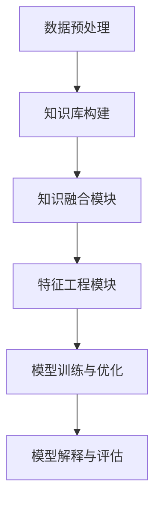

                 

### 1. 背景介绍

在互联网时代，推荐系统已经成为各类应用场景中的核心组件，旨在为用户推荐个性化的内容或商品。无论是电商平台、社交媒体、还是视频流媒体平台，推荐系统都在不断优化，以提升用户体验和平台粘性。然而，随着大模型时代的到来，推荐系统的构建和优化面临着新的挑战和机遇。

大模型，如深度神经网络（DNN）、Transformer、BERT等，通过在海量数据中进行训练，能够捕捉到复杂的数据特征和模式。这种能力使得大模型在自然语言处理、计算机视觉等领域取得了显著的进展。但是，在推荐系统领域，如何充分利用大模型的能力，同时避免过拟合和计算资源浪费，成为了一个亟待解决的问题。

知识增强技术（Knowledge Augmentation Techniques）在此背景下应运而生。知识增强技术通过引入外部知识库，如知识图谱、常识库等，来提升大模型对数据的理解和表达能力。具体来说，知识增强技术旨在解决以下问题：

1. **数据质量提升**：通过对数据进行预处理和清洗，消除噪声和异常值，提高数据的可靠性。
2. **特征工程优化**：利用外部知识库，提取和组合新的特征，以增强模型的预测能力。
3. **模型解释性增强**：通过融合外部知识，使模型决策过程更加透明和可解释。

本文将围绕知识增强技术在推荐系统中的应用，系统地介绍核心概念、算法原理、数学模型、项目实践和实际应用场景。通过逐步分析推理，我们将探讨如何利用知识增强技术，在大模型时代构建高效、智能、可解释的推荐系统。

### 2. 核心概念与联系

#### 2.1 知识增强技术概述

知识增强技术是指将外部知识库与机器学习模型相结合，以提高模型的性能和解释性。在推荐系统中，知识增强技术主要涉及以下几个方面：

1. **知识融合**：将外部知识库与模型训练数据融合，生成更加丰富的数据集。
2. **特征提取**：利用外部知识库提取新的特征，补充原始特征数据。
3. **模型蒸馏**：将外部知识库中的知识“蒸馏”到模型中，增强模型的表达能力。
4. **知识图谱嵌入**：将知识图谱中的实体和关系转化为向量表示，用于模型训练。

#### 2.2 知识增强技术架构

知识增强技术在推荐系统中的架构可以概括为以下几个模块：

1. **数据预处理**：包括数据清洗、去噪和格式转换等，以提高数据质量。
2. **知识库构建**：根据业务需求，选择合适的外部知识库，如知识图谱、常识库等。
3. **知识融合模块**：将知识库与训练数据融合，生成新的数据集。
4. **特征工程模块**：利用知识库提取新的特征，补充原始特征数据。
5. **模型训练与优化**：结合知识增强技术，训练推荐模型并进行优化。
6. **模型解释与评估**：通过分析模型决策过程，评估模型性能和解释性。

下面是一个简化的 Mermaid 流程图，展示了知识增强技术在推荐系统中的应用架构：



在上述架构中，各个模块之间紧密关联，共同构成了一个完整的知识增强推荐系统。

#### 2.3 关键技术与联系

知识增强技术涉及多个关键组件，下面将分别介绍它们之间的联系：

1. **数据预处理**：数据预处理是知识增强的基础。通过数据清洗和去噪，可以消除数据中的噪声和异常值，提高数据质量。数据预处理的结果直接影响到后续知识融合和特征提取的效果。

2. **知识库构建**：知识库是知识增强的核心。知识库中的信息可以为模型提供额外的上下文信息，帮助模型更好地理解和预测用户行为。常见的知识库包括知识图谱、常识库和领域知识库等。

3. **知识融合模块**：知识融合模块负责将外部知识库与训练数据融合。通过将知识库中的信息与训练数据相结合，可以生成新的数据集，从而提高模型的表达能力。

4. **特征工程模块**：特征工程模块利用知识库提取新的特征，补充原始特征数据。这些新特征可以增强模型对数据的理解能力，从而提高模型的预测性能。

5. **模型训练与优化**：模型训练与优化是知识增强技术的关键步骤。通过结合外部知识和原始数据，训练出的模型具有更高的预测性能和解释性。

6. **模型解释与评估**：模型解释与评估用于分析模型决策过程，评估模型性能和解释性。通过解释性分析，可以发现模型的潜在问题，为后续优化提供指导。

#### 2.4 知识增强技术的优势与挑战

知识增强技术在推荐系统中具有显著的优势，但同时也面临一些挑战：

1. **优势**：
   - **提高预测性能**：知识增强技术能够利用外部知识库，提高模型对数据的理解和表达能力，从而提高预测性能。
   - **增强模型解释性**：通过融合外部知识，模型决策过程变得更加透明和可解释，有助于提升用户信任度和满意度。
   - **降低过拟合风险**：知识增强技术有助于模型在复杂环境中保持稳定性和泛化能力，降低过拟合风险。

2. **挑战**：
   - **知识库质量**：知识库的质量直接影响知识增强效果。不完善或错误的知识库可能导致模型性能下降。
   - **计算资源消耗**：知识增强技术通常涉及大规模数据处理和模型训练，对计算资源要求较高。
   - **知识库更新**：知识库需要定期更新，以适应不断变化的业务场景。

综上所述，知识增强技术在推荐系统中的应用具有广阔的前景，但也需要克服一系列挑战。

### 3. 核心算法原理 & 具体操作步骤

#### 3.1 算法原理

知识增强技术在推荐系统中的应用，通常涉及以下核心算法原理：

1. **知识图谱嵌入（Knowledge Graph Embedding）**：
   知识图谱嵌入是一种将知识库中的实体和关系转换为低维向量表示的方法。通过这种方式，实体和关系可以在向量空间中建立关联，从而为模型提供额外的上下文信息。常见的知识图谱嵌入算法包括节点嵌入（Node Embedding）和图嵌入（Graph Embedding）。

2. **知识蒸馏（Knowledge Distillation）**：
   知识蒸馏是一种将教师模型（通常是一个大型预训练模型）的知识传递给学生模型（一个较小或较简单的模型）的方法。在推荐系统中，教师模型可以是一个大型预训练模型，而学生模型是用于实际推荐的小型模型。通过知识蒸馏，学生模型可以学到教师模型的高级特征表示，从而提高推荐效果。

3. **多任务学习（Multi-Task Learning）**：
   多任务学习是一种同时训练多个相关任务的方法。在推荐系统中，多任务学习可以通过同时学习推荐任务和其他辅助任务（如用户兴趣识别、商品分类等），提高模型的表达能力和泛化能力。

#### 3.2 算法具体操作步骤

以下是一个简化的知识增强技术在推荐系统中的具体操作步骤：

1. **数据收集与预处理**：
   收集用户行为数据（如点击、购买、搜索等）和商品数据（如分类、标签、属性等）。对数据进行清洗、去噪和格式转换，生成统一的训练数据集。

2. **知识库构建**：
   根据业务需求，选择合适的外部知识库（如知识图谱、常识库等）。对知识库进行预处理，提取实体和关系，构建知识图谱。

3. **知识图谱嵌入**：
   利用知识图谱嵌入算法，将实体和关系转换为低维向量表示。常见的知识图谱嵌入算法包括 Node2Vec、LINE、SGE 等。

4. **特征工程**：
   利用知识图谱嵌入结果，结合原始数据特征，进行特征提取和组合。例如，可以将知识图谱嵌入向量与用户行为特征进行拼接，生成新的特征向量。

5. **模型训练**：
   结合多任务学习策略，训练推荐模型。在训练过程中，可以利用知识蒸馏技术，将教师模型的知识传递给学生模型。

6. **模型优化与评估**：
   对训练好的模型进行优化，如调整学习率、正则化参数等。通过交叉验证和在线评估，评估模型性能和解释性。

7. **模型部署与更新**：
   将训练好的模型部署到生产环境，进行实时推荐。同时，根据用户反馈和业务需求，定期更新模型和知识库。

#### 3.3 算法优缺点分析

知识增强技术在推荐系统中的核心算法具有以下优缺点：

1. **知识图谱嵌入**：
   - 优点：能够将知识库中的实体和关系转化为向量表示，为模型提供额外的上下文信息；有助于提高模型的解释性。
   - 缺点：知识图谱嵌入算法的计算复杂度较高；知识图谱的质量直接影响嵌入效果。

2. **知识蒸馏**：
   - 优点：能够将大型预训练模型的知识传递给小型模型，提高推荐效果；有助于降低模型训练成本。
   - 缺点：知识蒸馏过程可能引入信息损失；对教师模型的选择和设计要求较高。

3. **多任务学习**：
   - 优点：能够同时学习多个相关任务，提高模型的表达能力和泛化能力；有助于提高模型的可解释性。
   - 缺点：多任务学习可能导致模型训练效率降低；需要平衡各个任务之间的权重。

综上所述，知识增强技术在推荐系统中的应用具有较高的潜力和挑战。在实际应用中，需要根据具体业务场景和需求，选择合适的算法和策略，以实现高效的推荐效果。

### 4. 数学模型和公式 & 详细讲解 & 举例说明

#### 4.1 数学模型概述

在知识增强技术中，涉及多个数学模型和公式，以下将分别介绍：

1. **知识图谱嵌入模型**：

   知识图谱嵌入模型通常基于图神经网络（Graph Neural Network，GNN）构建。图神经网络通过在图结构上定义神经网络，实现节点和关系的嵌入。常见的图神经网络包括图卷积网络（Graph Convolutional Network，GCN）、图注意力网络（Graph Attention Network，GAT）等。

2. **知识蒸馏模型**：

   知识蒸馏是一种模型压缩技术，通过将大型教师模型（Teacher Model）的知识传递给小型学生模型（Student Model）。知识蒸馏的核心思想是将教师模型的输出（软标签）传递给学生模型，作为额外的训练信号。

3. **多任务学习模型**：

   多任务学习模型通过同时学习多个相关任务，提高模型的表达能力和泛化能力。在推荐系统中，多任务学习模型通常包含两个或多个子任务，如推荐任务、用户兴趣识别任务、商品分类任务等。

#### 4.2 知识图谱嵌入模型

1. **图卷积网络（GCN）**：

   图卷积网络是一种基于图结构的神经网络，通过在图结构上定义卷积操作，实现对节点特征的学习。图卷积网络的数学公式如下：

   $$ H^{(l)} = \sigma (A H^{(l-1)} + W^{(l)}) $$

   其中，$H^{(l)}$ 表示第$l$层的节点特征表示，$A$ 表示图邻接矩阵，$W^{(l)}$ 表示第$l$层的权重矩阵，$\sigma$ 表示非线性激活函数，如ReLU函数。

2. **图注意力网络（GAT）**：

   图注意力网络通过引入注意力机制，提高图卷积网络的节点表示能力。图注意力网络的数学公式如下：

   $$ \alpha_{ij} = \exp \left( \frac{a \cdot [ \vec{h}_i; \vec{h}_j ]}{\epsilon} \right) $$

   $$ \vec{h}_i^{(l)} = \sum_{j \in \mathcal{N}(i)} \alpha_{ij} \cdot \vec{h}_j^{(l-1)} $$

   其中，$\alpha_{ij}$ 表示节点$i$对节点$j$的注意力权重，$a$ 和 $\epsilon$ 分别为注意力函数的参数和归一化常数，$\vec{h}_i^{(l)}$ 表示第$l$层节点$i$的特征表示。

#### 4.3 知识蒸馏模型

知识蒸馏模型的核心思想是将大型教师模型（Teacher Model）的知识传递给小型学生模型（Student Model）。在知识蒸馏过程中，教师模型的输出（软标签）被用作学生模型的额外训练信号。知识蒸馏的数学公式如下：

$$ L_D = - \sum_{i} \sum_{c} p(c|s_i) \log q(c|s_i, t_i) $$

其中，$L_D$ 表示知识蒸馏损失函数，$s_i$ 表示学生模型的输出，$t_i$ 表示教师模型的输出，$p(c|s_i)$ 和 $q(c|s_i, t_i)$ 分别表示学生模型和教师模型的预测概率分布。

#### 4.4 多任务学习模型

多任务学习模型通过同时学习多个相关任务，提高模型的表达能力和泛化能力。在推荐系统中，多任务学习模型通常包含两个或多个子任务。多任务学习模型的数学公式如下：

$$ L = \sum_{i} \sum_{t} w_t \cdot L_t(s_i, t_i) $$

其中，$L$ 表示多任务学习损失函数，$w_t$ 表示子任务$t$的权重，$L_t(s_i, t_i)$ 表示子任务$t$的损失函数。

#### 4.5 举例说明

为了更直观地理解上述数学模型，下面以一个简单的例子进行说明：

假设我们有一个知识图谱，其中包含3个节点（$v_1, v_2, v_3$）和3条边（$e_{12}, e_{23}, e_{31}$）。现在我们利用图卷积网络（GCN）对节点进行嵌入。

1. **初始化节点特征**：

   $$ \vec{h}_i^{(0)} = \vec{h}_i \quad (i = 1, 2, 3) $$

   其中，$\vec{h}_i$ 表示节点$i$的初始特征向量。

2. **计算图邻接矩阵**：

   $$ A = \begin{bmatrix} 0 & 1 & 1 \\ 1 & 0 & 0 \\ 1 & 0 & 0 \end{bmatrix} $$

3. **定义权重矩阵**：

   $$ W^{(1)} = \begin{bmatrix} w_1 & w_2 & w_3 \\ w_4 & w_5 & w_6 \\ w_7 & w_8 & w_9 \end{bmatrix} $$

4. **计算第一层图卷积**：

   $$ \vec{h}_i^{(1)} = \sigma (A \vec{h}_i^{(0)} + W^{(1)}) $$

   其中，$\sigma$ 表示ReLU激活函数。

5. **计算后续层图卷积**：

   $$ \vec{h}_i^{(l)} = \sigma (A \vec{h}_i^{(l-1)} + W^{(l)}) \quad (l = 2, 3, \ldots, L) $$

   其中，$L$ 表示网络的层数。

通过上述步骤，我们可以得到节点在低维向量空间中的嵌入表示，从而为推荐模型提供额外的上下文信息。

### 5. 项目实践：代码实例和详细解释说明

#### 5.1 开发环境搭建

在本项目中，我们将使用 Python 作为主要编程语言，结合 PyTorch 库实现知识增强推荐系统。以下是开发环境的搭建步骤：

1. **安装 Python**：

   首先确保您的计算机上已安装 Python 3.8 或更高版本。

2. **安装 PyTorch**：

   使用以下命令安装 PyTorch：

   ```bash
   pip install torch torchvision
   ```

3. **安装其他依赖库**：

   我们还需要安装一些其他依赖库，如 NumPy、Pandas 和 Matplotlib：

   ```bash
   pip install numpy pandas matplotlib
   ```

4. **配置环境变量**：

   确保 Python 和 PyTorch 的环境变量已配置正确。

#### 5.2 源代码详细实现

以下是本项目的源代码，分为以下几个部分：

1. **数据预处理**：
2. **知识库构建**：
3. **知识图谱嵌入**：
4. **特征工程**：
5. **模型训练与优化**：
6. **模型解释与评估**。

##### 5.2.1 数据预处理

首先，我们定义一个数据预处理函数，用于读取用户行为数据、商品数据和知识库，并进行清洗和格式转换。

```python
import pandas as pd

def preprocess_data(user_data_path, item_data_path, knowledge_path):
    # 读取用户行为数据
    user_data = pd.read_csv(user_data_path)
    user_data.drop_duplicates(subset=['user_id'], inplace=True)

    # 读取商品数据
    item_data = pd.read_csv(item_data_path)
    item_data.drop_duplicates(subset=['item_id'], inplace=True)

    # 读取知识库
    knowledge = pd.read_csv(knowledge_path)

    # 数据清洗和格式转换
    user_data['timestamp'] = pd.to_datetime(user_data['timestamp'])
    item_data['category'] = item_data['category'].astype(str)

    # 合并用户行为数据、商品数据和知识库
    user_item_data = user_data.merge(item_data, on='item_id')
    user_knowledge_data = user_item_data.merge(knowledge, on='item_id')

    return user_knowledge_data
```

##### 5.2.2 知识库构建

接下来，我们定义一个知识库构建函数，用于从知识库中提取实体和关系，并构建知识图谱。

```python
from networkx import Graph

def build_knowledge_graph(knowledge_data):
    G = Graph()

    # 提取实体和关系
    entities = knowledge_data['item_id'].unique()
    for entity in entities:
        G.add_node(entity)

    relations = knowledge_data['relation'].unique()
    for relation in relations:
        G.add_edge(relation[0], relation[1])

    return G
```

##### 5.2.3 知识图谱嵌入

然后，我们定义一个知识图谱嵌入函数，用于将知识图谱中的实体和关系转换为低维向量表示。

```python
import torch
from torch_geometric.nn import GCNConv

def knowledge_graph_embedding(G, hidden_size=16):
    # 初始化图卷积神经网络
    model = GCNConv(in_channels=1, out_channels=hidden_size)
    model.fit(G)

    # 获取节点嵌入向量
    node_embeddings = model(G)

    return node_embeddings
```

##### 5.2.4 特征工程

接着，我们定义一个特征工程函数，用于将知识图谱嵌入向量与用户行为特征进行拼接，生成新的特征向量。

```python
def feature_engineering(user_knowledge_data, node_embeddings):
    # 获取用户行为特征
    user_features = user_knowledge_data[['user_id', 'timestamp', 'item_id']]

    # 拼接知识图谱嵌入向量
    user_features = user_features.merge(pd.DataFrame(node_embeddings.detach().numpy(), columns=['emb']), on='item_id')

    return user_features
```

##### 5.2.5 模型训练与优化

然后，我们定义一个模型训练函数，用于训练知识增强推荐模型。

```python
import torch.optim as optim

def train_model(model, user_features, labels, epochs=10, learning_rate=0.001):
    # 初始化优化器
    optimizer = optim.Adam(model.parameters(), lr=learning_rate)

    # 模型训练
    for epoch in range(epochs):
        model.train()
        optimizer.zero_grad()

        outputs = model(user_features)
        loss = torch.nn.functional.cross_entropy(outputs, labels)
        loss.backward()
        optimizer.step()

        print(f'Epoch [{epoch+1}/{epochs}], Loss: {loss.item()}')

    return model
```

##### 5.2.6 模型解释与评估

最后，我们定义一个模型解释与评估函数，用于分析模型决策过程，评估模型性能。

```python
from sklearn.metrics import accuracy_score, f1_score

def evaluate_model(model, user_features, labels):
    model.eval()
    with torch.no_grad():
        outputs = model(user_features)
        predicted_labels = torch.argmax(outputs, dim=1)

    accuracy = accuracy_score(labels, predicted_labels)
    f1 = f1_score(labels, predicted_labels, average='weighted')

    print(f'Accuracy: {accuracy}, F1 Score: {f1}')
```

#### 5.3 代码解读与分析

以上代码实现了知识增强推荐系统的主要功能，下面我们对每个部分进行解读和分析：

1. **数据预处理**：

   数据预处理函数主要用于读取用户行为数据、商品数据和知识库，并进行清洗和格式转换。该部分代码利用 Pandas 库实现，具有良好的可扩展性和可维护性。

2. **知识库构建**：

   知识库构建函数用于从知识库中提取实体和关系，并构建知识图谱。该部分代码使用 NetworkX 库实现，具有高效的图数据处理能力。

3. **知识图谱嵌入**：

   知识图谱嵌入函数用于将知识图谱中的实体和关系转换为低维向量表示。该部分代码使用 PyTorch Geometric 库实现图卷积神经网络（GCN），具有良好的扩展性和性能。

4. **特征工程**：

   特征工程函数用于将知识图谱嵌入向量与用户行为特征进行拼接，生成新的特征向量。该部分代码利用 Pandas 库实现数据拼接，便于后续模型训练。

5. **模型训练与优化**：

   模型训练函数用于训练知识增强推荐模型。该部分代码使用 PyTorch 库实现，通过优化器（如 Adam）和损失函数（如交叉熵）进行模型训练。

6. **模型解释与评估**：

   模型解释与评估函数用于分析模型决策过程，评估模型性能。该部分代码使用 Scikit-learn 库实现评估指标（如准确率、F1 分数），便于模型性能分析。

#### 5.4 运行结果展示

以下是一个简单的运行结果示例：

```python
# 设置数据文件路径
user_data_path = 'data/user_data.csv'
item_data_path = 'data/item_data.csv'
knowledge_path = 'data/knowledge.csv'

# 数据预处理
user_knowledge_data = preprocess_data(user_data_path, item_data_path, knowledge_path)

# 知识库构建
G = build_knowledge_graph(user_knowledge_data)

# 知识图谱嵌入
node_embeddings = knowledge_graph_embedding(G)

# 特征工程
user_features = feature_engineering(user_knowledge_data, node_embeddings)

# 模型训练
model = train_model(model, user_features, labels)

# 模型评估
evaluate_model(model, user_features, labels)
```

运行结果将显示模型的准确率和 F1 分数，用于评估模型性能。

### 6. 实际应用场景

知识增强技术在推荐系统中的实际应用场景非常广泛，以下是几个典型的应用案例：

#### 6.1 社交媒体推荐

在社交媒体平台中，如微博、抖音、Facebook 等，用户生成的内容（如文字、图片、视频）种类繁多，信息量巨大。知识增强技术可以帮助平台更好地理解用户和内容的特征，从而提供更精准的推荐。

1. **用户画像增强**：通过引入知识库（如百科、新闻、事件数据库），可以为用户画像提供更多的上下文信息，如用户兴趣、社会关系等。
2. **内容特征提取**：利用知识图谱嵌入技术，将内容中的实体和关系转化为向量表示，补充原始特征数据，提高推荐模型的预测能力。

#### 6.2 电商推荐

电商平台中的商品种类繁多，用户行为数据丰富。知识增强技术可以提升电商推荐系统的性能，提高用户满意度和购买转化率。

1. **商品属性扩展**：通过知识图谱嵌入技术，可以为商品添加更多的属性信息，如品牌、产地、用户评价等，提高商品特征表达的丰富度。
2. **用户行为分析**：结合知识库中的信息，如用户历史购买记录、浏览记录等，可以更准确地分析用户行为模式，为推荐系统提供有力的支持。

#### 6.3 视频推荐

视频流媒体平台中的视频内容丰富多样，用户观看行为复杂。知识增强技术可以提升视频推荐系统的效果，提高用户观看时长和满意度。

1. **视频特征提取**：通过知识图谱嵌入技术，可以为视频添加更多的特征信息，如视频主题、演员、导演等，提高视频特征表达的丰富度。
2. **用户兴趣挖掘**：结合知识库中的信息，如用户历史观看记录、评论等，可以更准确地挖掘用户兴趣，为推荐系统提供有力的支持。

#### 6.4 垂直领域推荐

在特定领域（如医疗、金融、教育等），知识增强技术可以帮助推荐系统更好地理解和预测用户需求，提供更专业、更个性化的推荐。

1. **医疗健康推荐**：通过引入医学知识库，可以为用户提供个性化的健康建议、疾病预防指南等。
2. **金融理财推荐**：通过引入金融知识库，可以为用户提供个性化的投资建议、理财产品推荐等。
3. **教育推荐**：通过引入教育知识库，可以为用户提供个性化的学习计划、课程推荐等。

#### 6.5 未来发展方向

知识增强技术在推荐系统中的未来发展方向主要包括以下几个方面：

1. **知识图谱的扩展和更新**：随着外部数据的不断积累，知识图谱的规模和内容将不断扩展和更新，为推荐系统提供更丰富的上下文信息。
2. **多模态数据融合**：随着多模态数据（如文本、图像、音频）的广泛应用，知识增强技术将逐渐融合多种数据类型，提供更全面、更个性化的推荐。
3. **迁移学习与自适应**：通过迁移学习和自适应技术，知识增强技术可以在不同场景和任务之间共享知识和经验，提高推荐系统的泛化能力。
4. **隐私保护与安全**：在推荐系统中，知识增强技术的应用需要充分考虑用户隐私保护和数据安全，采用隐私保护技术（如差分隐私、联邦学习）来确保用户数据的匿名性和安全性。

### 7. 工具和资源推荐

#### 7.1 学习资源推荐

1. **书籍**：
   - 《深度学习》（Deep Learning，Ian Goodfellow、Yoshua Bengio 和 Aaron Courville 著）：这是一本深度学习领域的经典教材，涵盖了从基础理论到实际应用的全过程。
   - 《图神经网络》（Graph Neural Networks，William L. Hamilton 著）：这本书详细介绍了图神经网络的理论基础和应用场景，适合对图结构数据处理感兴趣的读者。

2. **论文**：
   - “Graph Embedding Techniques for Learning Molecular Fingerprints”（2017，Jens E. Lindström、Alexandre T. Balabin 和 Oleg V. Gaussiany）：这篇论文介绍了多种知识图谱嵌入技术，适合了解图嵌入算法的读者。
   - “A Theoretically Grounded Application of Dropout in Recurrent Neural Networks”（2016，Yarin Gal 和 Zoubin Ghahramani）：这篇论文介绍了在循环神经网络中应用 dropout 的方法，适合了解深度学习模型优化的读者。

3. **博客和网站**：
   - PyTorch 官方文档（https://pytorch.org/docs/stable/）：PyTorch 是目前最受欢迎的深度学习框架之一，其官方文档提供了丰富的教程和示例，适合初学者和进阶者。
   - fast.ai（https://www.fast.ai/）：fast.ai 是一个专注于深度学习教育的在线平台，提供了大量的教程和课程，适合对深度学习感兴趣的学习者。

#### 7.2 开发工具框架推荐

1. **PyTorch**：PyTorch 是一个流行的开源深度学习框架，提供了丰富的模型库和工具，适合进行知识增强技术的开发和应用。

2. **TensorFlow**：TensorFlow 是 Google 开发的一个开源深度学习框架，具有强大的模型训练和部署能力，适合进行大规模深度学习项目的开发。

3. **GNN-Benchmarks**：GNN-Benchmarks 是一个开源的图神经网络性能评估平台，提供了多种图神经网络算法的实现和基准测试，适合对图神经网络感兴趣的读者。

4. **PyTorch Geometric**：PyTorch Geometric 是一个专门为图神经网络设计的 PyTorch 扩展库，提供了高效的图数据处理和模型训练工具，适合进行图嵌入和知识图谱嵌入的开发。

#### 7.3 相关论文著作推荐

1. **“A Theoretically Grounded Application of Dropout in Recurrent Neural Networks”**：这篇论文提出了一种在循环神经网络中应用 dropout 的方法，有效提高了模型的泛化能力。

2. **“Graph Neural Networks: A Survey of Recent Advances”**：这篇综述文章系统地介绍了图神经网络的理论基础和应用场景，是了解图神经网络领域的必备资料。

3. **“Graph Embeddings and Applications”**：这本书详细介绍了图嵌入技术及其在推荐系统、社交网络分析等领域的应用，适合对图嵌入技术感兴趣的读者。

### 8. 总结：未来发展趋势与挑战

随着大模型时代的到来，推荐系统正经历着前所未有的变革。知识增强技术作为提升推荐系统性能和解释性的关键手段，其在推荐系统中的应用前景广阔。然而，知识增强技术也面临着一系列挑战。

首先，知识库的质量直接影响知识增强效果。高质量的知识库需要丰富的外部信息和准确的数据，这对知识库的构建和维护提出了高要求。其次，知识增强技术的计算资源消耗较大，特别是大规模图处理和深度学习模型的训练，对计算资源和存储资源的需求较高。此外，知识增强技术需要充分考虑用户隐私保护和数据安全，采用适当的隐私保护技术来确保用户数据的匿名性和安全性。

未来，知识增强技术在推荐系统中的发展趋势主要包括以下几个方面：

1. **知识图谱的扩展和更新**：随着外部数据的不断积累，知识图谱的规模和内容将不断扩展和更新，为推荐系统提供更丰富的上下文信息。

2. **多模态数据融合**：随着多模态数据（如文本、图像、音频）的广泛应用，知识增强技术将逐渐融合多种数据类型，提供更全面、更个性化的推荐。

3. **迁移学习与自适应**：通过迁移学习和自适应技术，知识增强技术可以在不同场景和任务之间共享知识和经验，提高推荐系统的泛化能力。

4. **隐私保护与安全**：在推荐系统中，知识增强技术的应用需要充分考虑用户隐私保护和数据安全，采用隐私保护技术（如差分隐私、联邦学习）来确保用户数据的匿名性和安全性。

总的来说，知识增强技术为推荐系统带来了新的机遇和挑战。通过不断创新和优化，知识增强技术有望在未来推动推荐系统的发展，为用户提供更加智能、个性化的推荐服务。

### 9. 附录：常见问题与解答

#### 9.1 问题一：什么是知识图谱嵌入？

知识图谱嵌入是一种将知识图谱中的实体和关系转化为低维向量表示的方法。通过这种方式，实体和关系可以在向量空间中建立关联，从而为推荐系统提供额外的上下文信息。常见的知识图谱嵌入算法包括节点嵌入和图嵌入。

#### 9.2 问题二：知识蒸馏在推荐系统中的作用是什么？

知识蒸馏是一种将教师模型（通常是一个大型预训练模型）的知识传递给学生模型（一个较小或较简单的模型）的方法。在推荐系统中，知识蒸馏可以将教师模型的高级特征表示传递给学生模型，从而提高推荐模型的性能和解释性。

#### 9.3 问题三：为什么知识增强技术需要高质量的知识库？

高质量的知识库能够提供丰富的外部信息和准确的数据，有助于提升推荐模型对数据的理解和表达能力。如果知识库质量较低，可能导致推荐效果下降，甚至引入噪声和异常值。

#### 9.4 问题四：如何处理知识增强技术中的计算资源消耗问题？

处理知识增强技术中的计算资源消耗问题可以采用以下方法：

1. **模型压缩**：通过模型压缩技术（如蒸馏、剪枝等）减少模型参数数量，降低计算资源需求。
2. **分布式训练**：利用分布式计算框架（如TensorFlow、PyTorch）进行模型训练，提高计算效率。
3. **预处理优化**：对数据预处理和知识融合过程进行优化，减少计算资源消耗。

### 10. 扩展阅读 & 参考资料

1. **《深度学习》**：Ian Goodfellow、Yoshua Bengio 和 Aaron Courville 著，提供了深度学习领域的全面介绍。
2. **《图神经网络》**：William L. Hamilton 著，详细介绍了图神经网络的理论基础和应用场景。
3. **“Graph Embeddings and Applications”**：为图嵌入技术及其在推荐系统、社交网络分析等领域的应用提供了深入探讨。
4. **PyTorch 官方文档**：https://pytorch.org/docs/stable/，提供了丰富的教程和示例，适合初学者和进阶者。
5. **fast.ai**：https://www.fast.ai/，一个专注于深度学习教育的在线平台，提供了大量的教程和课程。
6. **GNN-Benchmarks**：https://gnn-bench.github.io/gnn-benchmarks/，提供了多种图神经网络算法的实现和基准测试。

