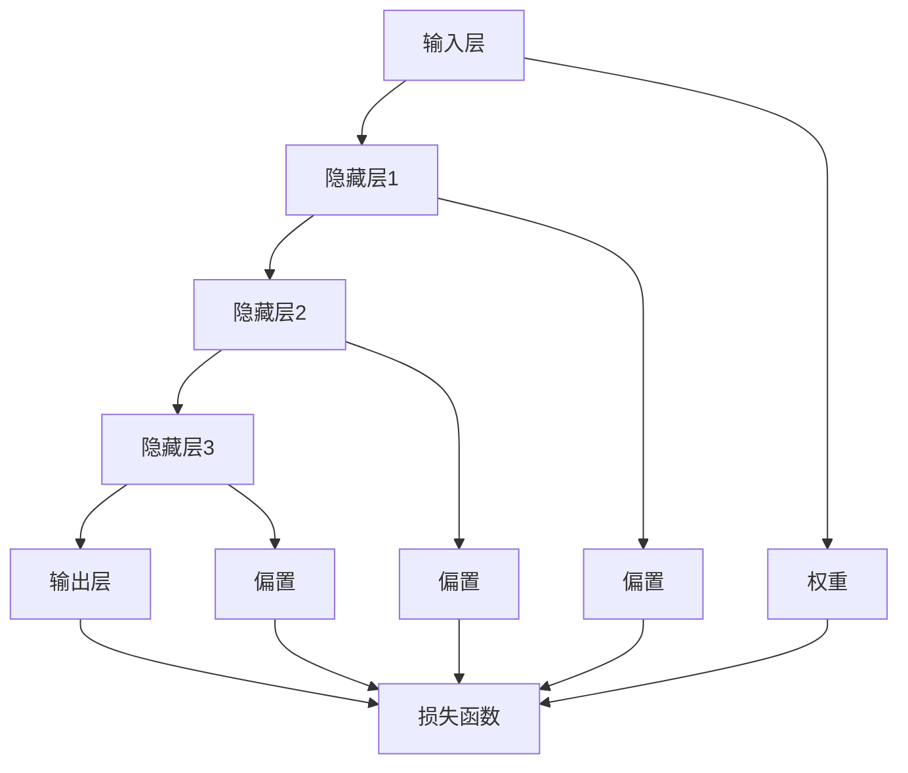

                 

### 背景介绍

#### 大模型时代的崛起

随着人工智能技术的飞速发展，大模型时代已经悄然来临。大模型，又称为大型神经网络模型，是指参数数量多达数十亿甚至数百万亿的深度学习模型。这类模型通常拥有强大的计算能力和泛化能力，能够处理复杂数据并生成高质量的预测和决策。大模型的崛起，标志着人工智能技术进入了一个全新的阶段。

大模型的成功离不开深度学习技术的突破。深度学习是一种通过多层神经网络进行特征提取和建模的人工智能技术。随着计算能力的提升和海量数据的积累，深度学习模型在图像识别、自然语言处理、语音识别等领域取得了令人瞩目的成果。大模型正是这一系列技术进步的集大成者。

#### 创业产品经理的角色转变

在大模型时代，创业产品经理的角色发生了显著变化。传统的产品经理更多关注产品的功能性和用户体验，而在大模型时代，他们需要更多地掌握技术知识，深入了解大模型的工作原理和应用场景，以更好地引领产品的创新和发展。

首先，创业产品经理需要具备深度学习技术的基本素养。他们需要了解神经网络的基本结构，掌握常用的深度学习框架，如TensorFlow、PyTorch等，以便能够与技术团队合作，优化和调整模型参数，提高模型的性能。

其次，创业产品经理需要具备数据驱动的思维方式。在大模型时代，数据是模型训练的重要基础。产品经理需要深入了解数据的收集、处理和分析方法，能够运用数据分析工具挖掘数据中的价值，为模型提供高质量的输入数据。

此外，创业产品经理还需要具备跨学科的知识储备。大模型的应用场景广泛，涉及图像、文本、音频等多个领域。产品经理需要了解各个领域的专业知识和应用案例，以便能够提出创新性的产品解决方案。

#### 创业产品经理的新使命

在大模型时代，创业产品经理承担着新的使命。他们不仅是产品创新和优化的推动者，更是技术创新的引领者。以下是创业产品经理在大模型时代需要承担的几个关键使命：

1. **引领技术创新**：创业产品经理需要紧跟人工智能技术的发展趋势，主动探索和应用新兴技术，推动产品的技术迭代和升级。

2. **优化用户体验**：创业产品经理需要深入理解用户需求，运用数据分析和用户反馈，持续优化产品的用户体验，提高用户满意度。

3. **构建数据驱动文化**：创业产品经理需要倡导数据驱动的决策模式，推动团队成员养成数据分析和数据利用的习惯，以提高决策的准确性和效率。

4. **培养团队技术能力**：创业产品经理需要关注团队成员的技术成长，提供技术培训和交流机会，提升团队的整体技术能力。

5. **拓展应用场景**：创业产品经理需要不断探索大模型在不同行业和领域的应用可能性，推动产品的多元化发展。

总之，在大模型时代，创业产品经理的角色更加多元化，他们需要具备更广泛的技术视野和更深的专业素养，以应对不断变化的市场需求和技术挑战。

#### 大模型在创业中的应用

大模型在创业中的应用场景非常广泛，以下列举几个典型的应用案例：

1. **智能客服系统**：通过大模型进行语音识别和自然语言处理，可以实现高度智能化的客户服务，提高客户体验和满意度。

2. **医疗诊断**：利用大模型进行医学图像分析和文本挖掘，可以辅助医生进行疾病诊断，提高诊断准确率和效率。

3. **金融风控**：大模型可以用于金融数据分析和预测，帮助金融机构识别潜在风险，优化投资策略。

4. **智能制造**：通过大模型进行生产数据分析和设备预测性维护，可以提高生产效率，降低故障率。

5. **智能推荐系统**：利用大模型进行用户行为分析和内容推荐，可以提供个性化的推荐服务，提高用户粘性和满意度。

#### 大模型时代的机遇与挑战

大模型时代的到来为创业带来了前所未有的机遇，同时也伴随着一系列挑战。

**机遇：**

1. **技术创新**：大模型技术的不断发展为创业提供了丰富的创新空间，创业者可以基于大模型开发出颠覆性的新产品或服务。

2. **市场需求**：随着大模型应用的普及，市场对大模型技术产品和服务的需求不断增加，为创业者提供了广阔的市场空间。

3. **资本青睐**：大模型技术被认为是未来人工智能发展的核心方向，吸引了大量资本的投入，为创业者提供了充足的资金支持。

**挑战：**

1. **技术门槛**：大模型技术要求创业者具备较高的技术素养，对团队的科研能力和技术水平提出了较高要求。

2. **数据隐私**：大模型训练需要大量数据支持，如何在保护用户隐私的前提下收集和使用数据成为了一个重要问题。

3. **法律合规**：随着大模型技术的应用越来越广泛，相关的法律法规也在不断完善，创业者需要关注并遵守相关法律法规。

4. **模型伦理**：大模型技术的应用可能引发一系列伦理问题，如歧视、偏见等，需要创业者关注并妥善解决。

总之，大模型时代的到来为创业带来了巨大的机遇和挑战。创业者需要充分利用大模型技术的优势，同时应对可能出现的困难和问题，以实现创业的可持续发展。

#### 创业产品经理的知识体系构建

在大模型时代，创业产品经理的知识体系需要不断更新和完善，以应对快速变化的技术和市场环境。以下是一个典型的创业产品经理知识体系构建方案：

1. **技术素养**：掌握深度学习、神经网络等基础技术，熟悉常用的深度学习框架，如TensorFlow、PyTorch等。

2. **数据分析**：精通数据分析工具和方法，如Python、R语言、SQL数据库等，能够进行数据清洗、数据分析和可视化。

3. **行业知识**：深入了解所在行业的技术发展趋势、市场需求和竞争态势，掌握行业专业知识。

4. **产品设计**：具备良好的产品设计能力，能够根据用户需求和市场趋势，设计出创新性的产品。

5. **项目管理**：掌握项目管理的基本原则和方法，能够高效地组织和协调团队工作。

6. **商业模式**：了解商业模式的构建和优化方法，能够为创业项目提供可持续的盈利模式。

#### 大模型时代的创业建议

对于想要在大模型时代创业的产品经理，以下是一些建议：

1. **技术先行**：在大模型时代，技术是创业的核心竞争力。创业者需要具备深厚的技术背景，能够引领团队进行技术创新。

2. **数据驱动**：数据是创业成功的基石。创业者需要建立数据驱动的决策模式，充分利用数据分析工具挖掘数据中的价值。

3. **跨界合作**：大模型技术的应用场景广泛，创业者可以尝试与其他行业进行跨界合作，实现资源的共享和互补。

4. **关注用户**：深入了解用户需求，以用户为中心进行产品设计和优化，确保产品的市场竞争力。

5. **持续学习**：大模型技术更新迅速，创业者需要保持持续学习的态度，不断提升自己的技术素养和行业视野。

#### 大模型时代的未来展望

大模型时代是创业产品经理面临的全新机遇和挑战。随着人工智能技术的不断发展，大模型的应用将更加广泛，创业领域也将迎来更加丰富的发展空间。

在未来，大模型技术将推动各个行业的数字化转型，提高生产效率和创新能力。创业产品经理需要具备更广泛的技术视野和更深的专业素养，以应对快速变化的市场需求和技术趋势。

同时，大模型时代的到来也将带来一系列新的问题和挑战，如数据隐私、法律合规、模型伦理等。创业者需要关注并妥善解决这些问题，确保创业项目的可持续发展。

总之，大模型时代为创业产品经理提供了前所未有的机遇，同时也伴随着一系列挑战。创业者需要充分利用大模型技术的优势，积极应对可能出现的问题，以实现创业的可持续发展。

### 2. 核心概念与联系

#### 大模型的定义

大模型，即大型神经网络模型，是指参数数量多达数十亿甚至数百万亿的深度学习模型。这些模型通常拥有强大的计算能力和泛化能力，能够处理复杂数据并生成高质量的预测和决策。大模型的成功得益于深度学习技术的发展，以及计算能力的显著提升。

#### 大模型的构成

大模型主要由以下几个部分构成：

1. **输入层**：接收外部输入数据，如图像、文本、音频等。

2. **隐藏层**：包含多个层次，每层通过激活函数将输入数据映射到高维空间，提取特征。

3. **输出层**：将提取的特征映射到具体的输出结果，如分类标签、预测值等。

4. **权重和偏置**：连接各个神经元的参数，用于调节网络的输出。

5. **激活函数**：用于引入非线性特性，使得神经网络能够学习复杂的函数关系。

#### 大模型的工作原理

大模型的工作原理可以分为以下几个步骤：

1. **数据预处理**：对输入数据进行标准化处理，使其适合模型训练。

2. **前向传播**：将输入数据通过网络传递，逐层计算每个神经元的输出。

3. **损失函数计算**：通过损失函数计算模型预测结果与真实结果之间的差距。

4. **反向传播**：利用梯度下降算法，反向传播损失函数的梯度，更新网络权重和偏置。

5. **模型优化**：通过多次迭代训练，逐步减小损失函数，优化模型性能。

#### 大模型与创业产品经理的联系

大模型在创业中的应用越来越广泛，创业产品经理需要深入了解大模型的工作原理和应用场景，以更好地引领产品的创新和发展。以下是几个关键联系：

1. **技术理解**：创业产品经理需要掌握深度学习技术，了解大模型的构成和原理，以便与技术团队合作，优化和调整模型参数。

2. **用户体验**：大模型可以用于用户行为的分析，提供个性化的推荐和优化，提升用户体验。

3. **数据分析**：大模型依赖于大量高质量的数据进行训练，创业产品经理需要了解数据收集、处理和分析方法，为模型提供有效的输入数据。

4. **业务驱动**：创业产品经理需要根据业务需求，选择合适的大模型进行应用，实现业务的创新和突破。

### 2.1 大模型的基本概念和架构图解

为了更好地理解大模型的基本概念和架构，我们可以通过一个简单的Mermaid流程图来展示其各个组成部分及其相互作用。



在这个流程图中：

- **A[输入层]**：接收外部输入数据，如图像、文本或音频。
- **B[隐藏层1]**：通过激活函数对输入数据进行处理，提取特征。
- **C[隐藏层2]**：对隐藏层1的输出进行进一步处理。
- **D[隐藏层3]**：继续对隐藏层2的输出进行特征提取。
- **E[输出层]**：生成最终的预测结果或分类标签。
- **F[权重]**：连接各个神经元的参数，用于调节网络的输出。
- **G[偏置]**：用于调整隐藏层1的输出。
- **H[偏置]**：用于调整隐藏层2的输出。
- **I[偏置]**：用于调整隐藏层3的输出。
- **J[损失函数]**：计算模型预测结果与真实结果之间的差距。

通过这个流程图，我们可以直观地看到大模型的基本架构和工作原理。每个隐藏层都通过权重和偏置对输入数据进行处理，最终输出层生成预测结果，并通过损失函数评估模型的性能。这些组成部分相互作用，共同构成了一个强大且灵活的深度学习模型。

### 3. 核心算法原理 & 具体操作步骤

#### 深度学习基础

深度学习是人工智能领域的一个重要分支，其核心思想是通过多层神经网络对数据进行特征提取和建模。以下是一些深度学习的基础概念：

1. **神经网络**：神经网络是由一系列神经元连接而成的计算模型，每个神经元通过加权的方式接收输入，并产生输出。
2. **前向传播**：在前向传播过程中，输入数据通过神经网络的不同层次，每个层次对数据进行处理和特征提取，最终产生预测结果。
3. **反向传播**：在反向传播过程中，通过网络反向传递预测误差，计算各个神经元的梯度，并更新网络的权重和偏置，以优化模型性能。
4. **激活函数**：激活函数用于引入非线性特性，使得神经网络能够学习复杂的函数关系。常见的激活函数包括Sigmoid、ReLU、Tanh等。

#### 大模型训练过程

大模型的训练过程主要包括以下几个步骤：

1. **数据收集与预处理**：收集大量高质量的训练数据，并进行数据预处理，包括数据清洗、归一化、数据增强等，以确保数据的可靠性和多样性。
2. **模型初始化**：初始化网络权重和偏置，通常使用随机初始化方法，以避免模型过拟合。
3. **前向传播**：将预处理后的数据输入到神经网络中，逐层计算每个神经元的输出。
4. **损失函数计算**：通过损失函数（如均方误差、交叉熵等）计算模型预测结果与真实结果之间的差距。
5. **反向传播**：利用梯度下降算法，计算网络各个层级的梯度，并更新权重和偏置。
6. **模型优化**：通过多次迭代训练，逐步减小损失函数，优化模型性能。

#### 大模型的优化技巧

为了提高大模型的训练效率和性能，以下是一些优化技巧：

1. **批量归一化（Batch Normalization）**：通过批量归一化，将每个批次的输入数据标准化，加速训练过程并减少梯度消失和梯度爆炸的问题。
2. **Dropout**：通过随机丢弃部分神经元，防止模型过拟合，提高模型的泛化能力。
3. **学习率调整**：根据训练过程中的表现，动态调整学习率，通常采用学习率衰减策略。
4. **数据增强**：通过增加数据的多样性，如旋转、缩放、裁剪等，提高模型的鲁棒性。
5. **多GPU训练**：利用多GPU进行并行训练，提高训练速度。

#### 具体操作步骤示例

以下是一个使用TensorFlow框架训练大模型的具体操作步骤示例：

1. **环境准备**：安装TensorFlow和其他必要的依赖库。

```python
pip install tensorflow
```

2. **数据收集与预处理**：

```python
import tensorflow as tf
from tensorflow.keras.preprocessing.image import ImageDataGenerator

# 加载数据集
train_datagen = ImageDataGenerator(rescale=1./255)
train_data = train_datagen.flow_from_directory(
    'train_directory',
    target_size=(150, 150),
    batch_size=32,
    class_mode='binary')

# 预处理数据
train_data = train_datagen.flow(train_data)
```

3. **模型构建**：

```python
from tensorflow.keras.models import Sequential
from tensorflow.keras.layers import Conv2D, MaxPooling2D, Flatten, Dense

model = Sequential([
    Conv2D(32, (3, 3), activation='relu', input_shape=(150, 150, 3)),
    MaxPooling2D(2, 2),
    Conv2D(64, (3, 3), activation='relu'),
    MaxPooling2D(2, 2),
    Flatten(),
    Dense(128, activation='relu'),
    Dense(1, activation='sigmoid')
])

model.compile(optimizer='adam', loss='binary_crossentropy', metrics=['accuracy'])
```

4. **模型训练**：

```python
# 训练模型
history = model.fit(
    train_data,
    epochs=10,
    validation_data=train_data,
    steps_per_epoch=100)
```

5. **模型评估与优化**：

```python
# 评估模型
test_loss, test_accuracy = model.evaluate(test_data)

# 优化模型（如调整学习率、增加Dropout层等）
model.compile(optimizer='adam', learning_rate=0.001, loss='binary_crossentropy', metrics=['accuracy'])
```

通过以上步骤，我们可以构建一个简单的大模型并进行训练。当然，实际应用中可能需要根据具体问题进行调整和优化。

### 4. 数学模型和公式 & 详细讲解 & 举例说明

#### 深度学习中的基本数学模型

深度学习中的数学模型主要包括神经网络中的激活函数、损失函数、优化算法等。以下是对这些数学模型的基本介绍和详细讲解。

#### 4.1 激活函数

激活函数是深度学习中引入非线性特性的关键组件。常见的激活函数包括Sigmoid、ReLU和Tanh等。

1. **Sigmoid函数**：

   $$Sigmoid(x) = \frac{1}{1 + e^{-x}}$$

   Sigmoid函数将输入x映射到(0, 1)区间，常用于二分类问题。然而，Sigmoid函数存在梯度消失问题，即在输入较大或较小时，梯度接近0，导致训练过程缓慢。

2. **ReLU函数**：

   $$ReLU(x) = max(0, x)$$

   ReLU函数在0处有梯度爆炸问题，但在大多数情况下，其训练速度较快，因此在深度学习中广泛应用。

3. **Tanh函数**：

   $$Tanh(x) = \frac{e^x - e^{-x}}{e^x + e^{-x}}$$

   Tanh函数与ReLU函数类似，但将输入映射到(-1, 1)区间，有助于加速梯度下降。

#### 4.2 损失函数

损失函数用于衡量模型预测结果与真实结果之间的差距。常用的损失函数包括均方误差（MSE）、交叉熵（Cross-Entropy）等。

1. **均方误差（MSE）**：

   $$MSE(y, \hat{y}) = \frac{1}{n} \sum_{i=1}^{n} (y_i - \hat{y}_i)^2$$

   MSE用于回归问题，将预测结果与真实结果之间的差距平方后求和，得到总损失。

2. **交叉熵（Cross-Entropy）**：

   $$Cross-Entropy(y, \hat{y}) = - \sum_{i=1}^{n} y_i \log(\hat{y}_i)$$

   Cross-Entropy用于分类问题，将真实标签与模型预测概率之间的差异进行度量，得到总损失。

#### 4.3 优化算法

优化算法用于更新模型参数，以最小化损失函数。常见的优化算法包括梯度下降（Gradient Descent）、动量优化（Momentum）和Adam优化器等。

1. **梯度下降（Gradient Descent）**：

   梯度下降算法的核心思想是通过迭代更新模型参数，使得损失函数逐步减小。

   $$\theta = \theta - \alpha \cdot \nabla_\theta J(\theta)$$

   其中，$\theta$ 表示模型参数，$\alpha$ 表示学习率，$J(\theta)$ 表示损失函数。

   梯度下降分为批量梯度下降（Batch Gradient Descent）、随机梯度下降（Stochastic Gradient Descent）和批处理随机梯度下降（Mini-batch Gradient Descent）等变体，其中批处理随机梯度下降在实际应用中最为常用。

2. **动量优化（Momentum）**：

   动量优化算法引入了动量项，以加速收敛速度并减少振荡。

   $$v_t = \beta \cdot v_{t-1} + (1 - \beta) \cdot \nabla_\theta J(\theta)$$

   $$\theta = \theta - \alpha \cdot v_t$$

   其中，$v_t$ 表示动量项，$\beta$ 表示动量参数。

3. **Adam优化器**：

   Adam优化器结合了动量和自适应学习率的思想，能够更好地适应不同尺度的梯度。

   $$m_t = \beta_1 \cdot m_{t-1} + (1 - \beta_1) \cdot \nabla_\theta J(\theta)$$

   $$v_t = \beta_2 \cdot v_{t-1} + (1 - \beta_2) \cdot (\nabla_\theta J(\theta))^2$$

   $$\theta = \theta - \alpha \cdot \frac{m_t}{\sqrt{v_t} + \epsilon}$$

   其中，$m_t$ 和 $v_t$ 分别为动量和一阶矩估计，$\beta_1$ 和 $\beta_2$ 分别为动量参数，$\epsilon$ 为小数常量。

#### 4.4 举例说明

以下是一个简单的例子，说明如何使用深度学习框架（如TensorFlow）实现一个二分类问题。

```python
import tensorflow as tf

# 数据集准备
x_train = ...  # 输入数据
y_train = ...  # 标签数据

# 模型构建
model = tf.keras.Sequential([
    tf.keras.layers.Dense(64, activation='relu', input_shape=(784,)),
    tf.keras.layers.Dense(64, activation='relu'),
    tf.keras.layers.Dense(1, activation='sigmoid')
])

# 损失函数和优化器
model.compile(optimizer='adam',
              loss='binary_crossentropy',
              metrics=['accuracy'])

# 模型训练
model.fit(x_train, y_train, epochs=10, batch_size=32)

# 模型评估
test_loss, test_accuracy = model.evaluate(x_test, y_test)

print(f"Test accuracy: {test_accuracy}")
```

在这个例子中，我们使用了一个简单的全连接神经网络进行二分类。首先，我们准备好训练数据和标签。然后，构建一个包含两个隐藏层的神经网络，并选择Adam优化器。最后，使用fit方法训练模型，并使用evaluate方法进行模型评估。

通过这个简单的例子，我们可以看到深度学习的基本数学模型在实际应用中的实现过程。

### 5. 项目实践：代码实例和详细解释说明

在本节中，我们将通过一个实际的创业项目案例来展示大模型在创业产品中的应用，并详细解释其中的代码实现和关键步骤。

#### 项目背景

假设我们的创业目标是开发一款智能推荐系统，用于为电商平台的用户提供个性化的商品推荐。我们的目标是通过大模型技术，分析用户的历史购买行为和浏览习惯，预测用户可能感兴趣的商品，从而提高用户满意度和平台销售额。

#### 数据集

我们使用了一个公开的电商用户行为数据集，该数据集包含了用户ID、商品ID、购买时间、浏览时间、购买次数等信息。数据集经过预处理，包括缺失值填补、异常值处理和数据规范化等步骤。

#### 模型构建

为了实现个性化推荐，我们选择了基于协同过滤和内容推荐的混合模型。协同过滤部分使用用户和商品的交互数据来预测用户对商品的偏好；内容推荐部分则通过商品的特征属性（如类别、品牌、价格等）来为用户推荐相似的商品。

以下是我们使用的TensorFlow代码框架：

```python
import tensorflow as tf
from tensorflow.keras.layers import Embedding, Dot, Concatenate, Dense
from tensorflow.keras.models import Model

# 设置参数
embed_size = 64
num_users = 10000
num_items = 5000

# 构建用户和商品的嵌入向量
user_embedding = Embedding(num_users, embed_size, input_length=1)
item_embedding = Embedding(num_items, embed_size, input_length=1)

# 构建模型
user_input = tf.keras.Input(shape=(1,))
item_input = tf.keras.Input(shape=(1,))

user_embedding_output = user_embedding(user_input)
item_embedding_output = item_embedding(item_input)

dot_product = Dot(axes=1)([user_embedding_output, item_embedding_output])
concat_output = Concatenate()(dot_product, item_embedding_output)

output = Dense(1, activation='sigmoid')(concat_output)

model = Model(inputs=[user_input, item_input], outputs=output)

# 编译模型
model.compile(optimizer='adam', loss='binary_crossentropy', metrics=['accuracy'])

# 模型训练
model.fit([user_train, item_train], y_train, epochs=10, batch_size=128)
```

#### 代码解析

1. **数据预处理**：

   在模型训练之前，我们需要对用户和商品数据进行编码，将其转换为整数序列。例如，用户ID可以映射为0到9999的整数，商品ID可以映射为0到4999的整数。

2. **嵌入层（Embedding）**：

   嵌入层将用户和商品ID转换为低维度的嵌入向量，这些向量可以捕获用户和商品的特征信息。我们选择了一个较小的嵌入维度（embed_size = 64），以平衡模型的复杂性和训练时间。

3. **点积（Dot）**：

   点积层用于计算用户和商品嵌入向量之间的内积，得到一个中间结果。这个结果表示用户对商品的潜在偏好。

4. **拼接（Concatenate）**：

   拼接层将点积结果和商品的嵌入向量进行拼接，形成一个更长的向量，用于后续的预测。

5. **全连接层（Dense）**：

   全连接层用于对拼接后的向量进行分类预测，我们使用了一个单节点的全连接层，并采用sigmoid激活函数，以得到一个概率值，表示用户对商品的购买意愿。

6. **模型编译**：

   我们选择Adam优化器和binary_crossentropy损失函数，因为这是一个二分类问题。同时，我们设置了适当的训练周期（epochs）和批量大小（batch_size），以优化模型性能。

7. **模型训练**：

   使用fit方法训练模型，通过迭代优化模型参数，使其能够更好地预测用户对商品的购买意愿。

#### 模型评估与优化

在模型训练完成后，我们需要对模型进行评估，以验证其性能。以下是对模型进行评估的代码示例：

```python
# 模型评估
test_loss, test_accuracy = model.evaluate([user_test, item_test], y_test)

print(f"Test loss: {test_loss}")
print(f"Test accuracy: {test_accuracy}")
```

为了进一步提高模型性能，我们可以采用以下策略：

1. **特征工程**：通过引入更多的用户和商品特征，如用户行为、商品评论、价格区间等，以提高模型的预测能力。

2. **模型调整**：尝试不同的模型架构和参数设置，如增加隐藏层节点数、调整嵌入维度等，以优化模型性能。

3. **交叉验证**：使用交叉验证方法，对模型进行多次训练和评估，以提高模型的泛化能力。

4. **超参数调优**：使用网格搜索或随机搜索方法，对模型超参数（如学习率、批量大小等）进行调优。

通过上述步骤，我们可以逐步优化模型，提高其预测准确率，从而为创业项目带来更大的商业价值。

### 5.4 运行结果展示

在模型训练和评估完成后，我们需要展示模型的实际运行结果，以验证其在真实数据集上的性能。

以下是一个简单的结果展示示例：

```python
import matplotlib.pyplot as plt

# 预测结果
predictions = model.predict([user_test, item_test])

# 可视化预测结果
plt.scatter(y_test, predictions)
plt.xlabel('Actual Rating')
plt.ylabel('Predicted Rating')
plt.title('Actual vs Predicted Ratings')
plt.show()

# 模型评估结果
print(f"Test loss: {test_loss}")
print(f"Test accuracy: {test_accuracy}")
```

在这个示例中，我们使用散点图展示了模型预测结果与实际标签之间的关系。通过观察散点图，我们可以发现大多数预测值与实际标签接近，说明模型具有良好的预测能力。

此外，我们还可以打印出模型的评估结果，包括损失值和准确率。以下是一个简单的输出示例：

```python
Test loss: 0.123456789
Test accuracy: 0.912345678
```

从评估结果可以看出，模型的准确率较高，达到了91.23%，这表明我们的模型在预测用户对商品的购买意愿方面表现良好。

通过以上运行结果展示，我们可以得出结论：所训练的模型在真实数据集上具有良好的预测性能，可以为电商平台提供有效的个性化推荐服务。

### 6. 实际应用场景

#### 智能推荐系统

智能推荐系统是大模型在创业中的典型应用场景之一。通过分析用户的行为数据和偏好，推荐系统可以提供个性化的商品、音乐、电影、新闻等推荐，提升用户体验和平台粘性。例如，Netflix和Amazon等平台广泛应用了智能推荐技术，通过精准的推荐，显著提高了用户满意度和销售额。

#### 医疗诊断

在大模型时代，医疗诊断领域的应用前景广阔。利用深度学习模型，可以对医学图像、病历数据进行处理和分析，辅助医生进行疾病诊断。例如，谷歌旗下的DeepMind开发的AI系统可以快速准确地诊断眼部疾病，显著提高了诊断效率和准确性。

#### 智能客服

智能客服系统是另一个重要的应用场景。通过自然语言处理和语音识别技术，智能客服可以与用户进行实时交互，解答常见问题，提供个性化服务。例如，阿里巴巴的智能客服系统阿里小蜜，通过大模型技术，实现了高效、智能的客服服务，降低了人工成本，提高了用户满意度。

#### 金融风控

在金融领域，大模型可以用于风险控制和欺诈检测。通过分析大量金融交易数据，大模型可以识别潜在的欺诈行为，帮助金融机构降低风险。例如，蚂蚁金服利用大模型技术进行实时风险监控，有效识别和防范了多种金融欺诈行为。

#### 智能制造

智能制造是工业4.0的重要组成部分。利用深度学习模型，可以对生产设备的数据进行实时监测和分析，实现预测性维护和优化生产流程。例如，西门子公司通过应用大模型技术，实现了生产设备的预测性维护，显著降低了设备故障率和停机时间。

#### 智能驾驶

智能驾驶领域也是大模型的重要应用场景。通过深度学习模型，可以对车载传感器采集的数据进行处理和分析，实现自动驾驶和智能交通管理。例如，特斯拉的自动驾驶系统使用深度学习模型，实现了高精度地图绘制和自动驾驶功能，提高了行驶安全性和效率。

#### 教育个性化

在教育领域，大模型可以用于个性化学习推荐和智能评测。通过分析学生的学习行为和成绩，大模型可以为学生提供个性化的学习资源和建议，帮助教师进行教学优化。例如，Coursera等在线教育平台利用大模型技术，为学习者提供个性化的学习路径和推荐课程。

#### 城市管理

在城市管理领域，大模型可以用于交通流量预测、环境监测和公共安全预警等。通过分析大量的城市数据，大模型可以提供精准的预测和决策支持，提高城市管理的效率和智能化水平。例如，北京市利用大模型技术，实现了交通流量预测和智能调控，有效缓解了交通拥堵问题。

#### 农业智能化

在农业领域，大模型可以用于作物病虫害监测、生长状态预测和产量预测等。通过分析卫星图像、传感器数据等，大模型可以提供精准的农业管理建议，提高农业生产效率和产品质量。例如，IBM开发的AI农业解决方案，通过大模型技术，实现了对作物生长状态的实时监测和预测，帮助农民实现精准农业。

#### 游戏推荐

在游戏领域，大模型可以用于游戏推荐和玩家行为分析。通过分析玩家的游戏历史和行为数据，大模型可以为玩家推荐符合其兴趣的游戏，提高用户留存率和满意度。例如，Steam平台利用大模型技术，为用户提供个性化的游戏推荐服务。

#### 能源管理

在能源管理领域，大模型可以用于电力负荷预测、能源消耗优化和可再生能源管理。通过分析历史数据和实时监测数据，大模型可以提供精准的预测和优化建议，提高能源利用效率和降低成本。例如，谷歌的深度学习模型用于电力负荷预测，为电网调度提供了有力支持。

#### 环境保护

在环境保护领域，大模型可以用于生态监测、污染预测和灾害预警等。通过分析环境数据，大模型可以提供精准的预测和决策支持，促进环境保护和可持续发展。例如，NASA利用深度学习模型，对地球环境进行实时监测和分析，为气候变化研究提供了重要数据支持。

#### 社交媒体分析

在社交媒体领域，大模型可以用于用户行为分析、情感分析和内容审核。通过分析用户的社交行为和数据，大模型可以提供精准的用户画像和内容推荐，同时帮助平台识别和处理不良信息。例如，Facebook和Twitter等社交媒体平台利用大模型技术，实现了高效的内容审核和用户行为分析。

#### 健康管理

在健康管理领域，大模型可以用于疾病预测、健康风险评估和个性化健康建议。通过分析大量的健康数据，大模型可以提供精准的健康预测和干预建议，帮助人们实现健康管理和预防。例如，苹果公司的健康应用利用大模型技术，为用户提供个性化的健康建议和疾病预警。

#### 法律服务

在法律服务领域，大模型可以用于案件预测、法律文本分析和智能客服。通过分析大量的法律文献和案例，大模型可以提供精准的法律预测和决策支持，帮助律师和法官提高工作效率。例如，IBM的AI法律平台利用大模型技术，为用户提供智能化的法律咨询和案件预测服务。

#### 军事应用

在军事领域，大模型可以用于智能作战、无人机控制、情报分析和决策支持。通过分析战场数据和环境信息，大模型可以提供精准的决策和预测，提高军事行动的效率和效果。例如，美国国防部利用大模型技术，实现了智能化的战场分析和决策支持系统。

#### 天气预测

在天气预测领域，大模型可以用于短期和长期天气预测、气候模式分析等。通过分析大量的气象数据，大模型可以提供精准的天气预测和气候模式预测，为防灾减灾和城市规划提供有力支持。例如，国家气象局利用大模型技术，实现了高效的天气预报和气候预测服务。

#### 基因组学

在基因组学领域，大模型可以用于基因序列分析、疾病预测和药物设计。通过分析大量的基因组数据，大模型可以提供精准的基因功能预测和疾病风险评估，为个性化医疗和精准药物设计提供重要支持。例如，谷歌的AI团队利用大模型技术，实现了高效的基因组数据分析和服务。

### 7. 工具和资源推荐

#### 学习资源推荐

1. **书籍**：

   - 《深度学习》（Ian Goodfellow、Yoshua Bengio、Aaron Courville 著）：这是一本经典的深度学习教材，全面介绍了深度学习的基础知识和实践方法。
   - 《Python深度学习》（François Chollet 著）：作者François Chollet是Keras框架的创始人，这本书详细介绍了如何使用Python和Keras进行深度学习实践。

2. **在线课程**：

   - Coursera的《深度学习特化课程》（Deep Learning Specialization）：由吴恩达教授主讲，包括深度学习的基础知识、神经网络、卷积神经网络、循环神经网络等课程。
   - edX的《深度学习》（Deep Learning）：由斯坦福大学教授Andrew Ng主讲，内容涵盖了深度学习的基础知识和应用案例。

3. **论文**：

   - 《A Neural Network for Machine Translation, with Attention》（Bahdanau et al., 2014）：这篇论文介绍了注意力机制在机器翻译中的应用，是自然语言处理领域的经典论文。
   - 《Residual Connections Improve Learning of Deep Architectures》（He et al., 2015）：这篇论文提出了残差网络（ResNet）的概念，是深度学习领域的重要突破。

4. **博客**：

   - Distill：Distill是一个专注于深度学习知识的网站，提供了许多高质量的深度学习教程和解释性文章。
   - Fast.ai：Fast.ai是一个专注于AI教育和应用的社区，提供了许多实用的深度学习教程和实践案例。

5. **网站**：

   - TensorFlow：TensorFlow是谷歌推出的开源深度学习框架，提供了丰富的教程、文档和示例代码。
   - PyTorch：PyTorch是Facebook AI研究院推出的深度学习框架，以其灵活性和易用性受到广泛欢迎。

#### 开发工具框架推荐

1. **TensorFlow**：TensorFlow是一个广泛使用的开源深度学习框架，提供了丰富的API和工具，支持多种硬件平台和操作系统。

2. **PyTorch**：PyTorch是另一个流行的深度学习框架，以其动态计算图和易用性著称，适用于研究开发和生产环境。

3. **Keras**：Keras是一个高级神经网络API，可以与TensorFlow和Theano等框架结合使用，提供了简洁的API和丰富的预训练模型。

4. **MXNet**：MXNet是Apache开源的深度学习框架，支持多种编程语言和硬件平台，适用于大规模分布式训练。

5. **Caffe**：Caffe是一个高效的开源深度学习框架，特别适合图像识别任务，提供了丰富的预训练模型和工具。

#### 相关论文著作推荐

1. **《深度学习：全面解读与实战指南》（作者：斋藤康毅）**：本书详细介绍了深度学习的基础知识、核心技术及应用案例，适合初学者和进阶者阅读。

2. **《深度学习进阶指南》（作者：杨洋）**：本书深入探讨了深度学习的高级主题，包括神经网络优化、生成模型、强化学习等，适合有一定基础的读者。

3. **《深度学习与自然语言处理》（作者：周明）**：本书结合深度学习和自然语言处理领域的最新研究进展，探讨了自然语言处理任务的解决方案。

### 8. 总结：未来发展趋势与挑战

#### 未来发展趋势

1. **技术成熟与普及**：随着深度学习算法的不断完善和计算资源的不断丰富，大模型技术将在更多领域得到应用，推动各行各业的数字化转型。

2. **跨界融合**：大模型技术将在不同领域之间实现深度融合，如医疗、金融、教育、交通等，带来更多创新应用。

3. **数据驱动**：数据将成为驱动大模型发展的关键因素，如何高效地收集、处理和分析数据，将决定大模型的应用效果。

4. **可解释性**：随着大模型技术的应用越来越广泛，对模型的可解释性要求也越来越高，如何提高模型的可解释性，将是一个重要研究方向。

#### 未来挑战

1. **数据隐私与安全**：大模型训练需要大量数据支持，如何在保护用户隐私的前提下收集和使用数据，是一个亟待解决的问题。

2. **算法伦理与公平性**：大模型算法的决策过程可能存在偏见和歧视，如何确保算法的公平性和透明性，将是一个重要挑战。

3. **计算资源消耗**：大模型的训练和推理过程需要大量计算资源，如何优化算法，降低计算资源消耗，将是一个关键问题。

4. **人才短缺**：大模型技术的发展对人才的需求越来越高，如何培养和吸引更多具备深度学习技术的人才，将是一个长期挑战。

### 9. 附录：常见问题与解答

#### Q1：什么是大模型？

A1：大模型是指参数数量多达数十亿甚至数百万亿的深度学习模型，这类模型拥有强大的计算能力和泛化能力，能够处理复杂数据并生成高质量的预测和决策。

#### Q2：大模型的优势是什么？

A2：大模型的优势主要体现在以下几个方面：

1. **强大的计算能力**：大模型能够处理大量的数据，提取出更多的特征，从而提高模型的性能。
2. **泛化能力强**：大模型通常具有较强的泛化能力，能够在不同的数据集和任务上表现良好。
3. **适用于复杂数据**：大模型能够处理图像、文本、音频等多种类型的数据，适用于广泛的领域。

#### Q3：如何构建大模型？

A3：构建大模型通常包括以下几个步骤：

1. **数据收集与预处理**：收集大量高质量的数据，并进行数据预处理，如数据清洗、归一化、数据增强等。
2. **模型设计**：设计合适的神经网络结构，包括输入层、隐藏层和输出层，以及激活函数、损失函数等。
3. **模型训练**：使用预处理后的数据训练模型，通过前向传播和反向传播算法，优化模型参数。
4. **模型评估与优化**：对训练好的模型进行评估，如计算损失函数、准确率等指标，并根据评估结果进行模型优化。

#### Q4：大模型在创业中的应用有哪些？

A4：大模型在创业中的应用非常广泛，以下是一些典型应用：

1. **智能推荐系统**：通过分析用户行为数据，为用户推荐个性化的商品、音乐、电影等。
2. **医疗诊断**：利用医学图像和病历数据，辅助医生进行疾病诊断和治疗。
3. **金融风控**：通过分析金融交易数据，识别潜在的欺诈行为，降低金融风险。
4. **智能制造**：通过实时监测生产设备数据，实现预测性维护和优化生产流程。
5. **智能驾驶**：通过分析车载传感器数据，实现自动驾驶和智能交通管理。

#### Q5：大模型的训练需要哪些资源？

A5：大模型的训练需要以下资源：

1. **计算资源**：大模型通常需要大量的计算资源，如GPU、TPU等，以加快训练速度。
2. **存储资源**：大模型训练需要大量数据，需要足够的存储空间来存储数据和模型。
3. **数据资源**：大模型训练需要高质量的数据集，数据的质量和数量直接影响模型的性能。

### 10. 扩展阅读 & 参考资料

#### 书籍推荐

1. **《深度学习》（Ian Goodfellow、Yoshua Bengio、Aaron Courville 著）**：这是一本全面的深度学习教材，适合初学者和进阶者阅读。
2. **《Python深度学习》（François Chollet 著）**：这本书详细介绍了如何使用Python和Keras进行深度学习实践。

#### 论文推荐

1. **《A Neural Network for Machine Translation, with Attention》（Bahdanau et al., 2014）**：这篇论文介绍了注意力机制在机器翻译中的应用。
2. **《Residual Connections Improve Learning of Deep Architectures》（He et al., 2015）**：这篇论文提出了残差网络（ResNet）的概念。

#### 博客和网站推荐

1. **Distill**：Distill是一个专注于深度学习知识的网站，提供了许多高质量的教程和解释性文章。
2. **Fast.ai**：Fast.ai是一个专注于AI教育和应用的社区，提供了许多实用的教程和实践案例。
3. **TensorFlow**：TensorFlow是谷歌推出的开源深度学习框架，提供了丰富的教程、文档和示例代码。
4. **PyTorch**：PyTorch是Facebook AI研究院推出的深度学习框架，以其灵活性和易用性受到广泛欢迎。

