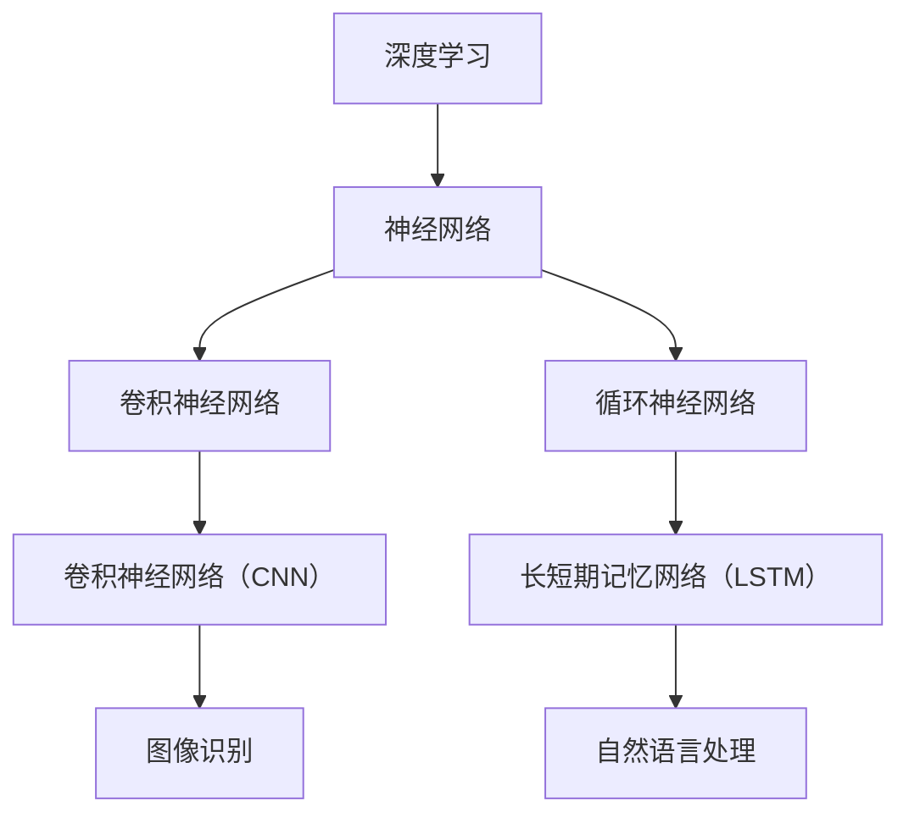

                 

### 文章标题

大模型深刻改变生活方式

> 关键词：大模型、生活方式、改变、深度学习、人工智能、机器学习、神经网络、应用场景、未来趋势、挑战与展望

> 摘要：本文将探讨大模型对生活方式的深刻改变。通过对大模型的核心概念、算法原理、应用场景、未来趋势及挑战的逐步分析，揭示大模型在各个领域的实际应用，为读者呈现一个充满可能性的未来。

### 1. 背景介绍

#### 1.1 大模型的起源与发展

大模型，即大型人工智能模型，是指参数数量达到亿级乃至千亿级的深度学习模型。这类模型的起源可以追溯到20世纪80年代，随着计算机性能的提升和海量数据的积累，深度学习逐渐成为一种强大的机器学习技术。

1998年，Geoffrey Hinton提出了深度信念网络（Deep Belief Networks, DBN），这标志着深度学习进入了一个新的时代。随后，2012年，AlexNet在ImageNet图像识别比赛中取得了突破性的成果，深度学习开始迅速发展。

#### 1.2 大模型的重要性

大模型的重要性体现在其处理复杂数据的能力和广泛的应用场景。随着数据规模的不断扩大和计算能力的提升，大模型在各个领域展现出了强大的潜力，如自然语言处理、计算机视觉、语音识别等。

#### 1.3 大模型在生活方式中的变革

大模型在生活方式中的变革体现在以下几个方面：

1. **智能化助手**：大模型作为智能助手，可以提供个性化推荐、语音识别、图像识别等服务，提升生活质量。
2. **健康监测**：大模型可以分析个人健康数据，提供个性化的健康建议，帮助人们更好地管理健康。
3. **教育优化**：大模型可以为学生提供个性化的学习方案，提高教育质量。
4. **娱乐体验**：大模型在游戏、影视、音乐等娱乐领域也带来了新的体验，让生活更加丰富多彩。

### 2. 核心概念与联系

为了更好地理解大模型，我们需要先了解其核心概念与联系。以下是一个简化的Mermaid流程图，展示了大模型的主要组成部分和相互关系：



#### 2.1 深度学习

深度学习是一种机器学习技术，通过多层神经网络对数据进行处理。深度学习模型具有自动提取特征的能力，适用于处理复杂数据。

#### 2.2 神经网络

神经网络是深度学习的基础，由多个神经元组成。每个神经元通过权重和偏置对输入数据进行加权求和，并通过激活函数将结果映射到输出。

#### 2.3 卷积神经网络（CNN）

卷积神经网络是一种特殊的神经网络，适用于图像识别任务。通过卷积层、池化层和全连接层等结构，CNN能够自动提取图像的特征。

#### 2.4 循环神经网络（RNN）

循环神经网络适用于序列数据处理，如自然语言处理。RNN能够记住之前的输入信息，对序列数据进行建模。

#### 2.5 长短期记忆网络（LSTM）

长短期记忆网络是一种特殊的RNN，通过引入门控机制，LSTM能够有效避免梯度消失和梯度爆炸问题，适用于长序列数据处理。

### 3. 核心算法原理 & 具体操作步骤

#### 3.1 深度学习算法原理

深度学习算法主要基于神经网络的架构，通过多层神经元对数据进行处理。以下是一个简化的深度学习算法操作步骤：

1. **初始化权重和偏置**：随机初始化神经网络中的权重和偏置。
2. **前向传播**：将输入数据通过神经网络，逐层计算输出结果。
3. **计算损失函数**：通过输出结果与真实标签的差距，计算损失函数。
4. **反向传播**：根据损失函数，反向更新权重和偏置。
5. **优化算法**：采用优化算法（如梯度下降、Adam等）对权重和偏置进行更新。
6. **迭代训练**：重复上述步骤，直到模型达到预期效果。

#### 3.2 具体操作步骤示例

以下是一个简单的神经网络模型，用于实现二分类任务。假设我们有100个样本，每个样本包含10个特征，目标标签为0或1。

1. **初始化权重和偏置**：

   - 输入层：10个神经元，权重和偏置随机初始化。
   - 隐藏层：5个神经元，权重和偏置随机初始化。
   - 输出层：2个神经元，权重和偏置随机初始化。

2. **前向传播**：

   - 输入样本：[1, 0, 1, 1, 0, 1, 1, 0, 0, 1]
   - 隐藏层1输出：通过加权求和和激活函数计算得到。
   - 输出层输出：通过加权求和和激活函数计算得到。

3. **计算损失函数**：

   - 使用交叉熵损失函数计算输出结果与真实标签的差距。

4. **反向传播**：

   - 计算输出层的梯度。
   - 计算隐藏层的梯度。

5. **优化算法**：

   - 使用梯度下降算法更新权重和偏置。

6. **迭代训练**：

   - 重复上述步骤，直到模型达到预期效果。

### 4. 数学模型和公式 & 详细讲解 & 举例说明

#### 4.1 深度学习数学模型

深度学习数学模型主要涉及以下几个部分：

1. **前向传播**：
   $$ z = W \cdot x + b $$
   $$ a = \sigma(z) $$

2. **反向传播**：
   $$ \delta = \frac{\partial C}{\partial z} \odot \frac{\partial \sigma}{\partial z} $$
   $$ \frac{\partial C}{\partial W} = \delta \cdot (a-L_1)^T $$
   $$ \frac{\partial C}{\partial b} = \delta $$

3. **优化算法**：
   $$ W_{new} = W - \alpha \cdot \frac{\partial C}{\partial W} $$
   $$ b_{new} = b - \alpha \cdot \frac{\partial C}{\partial b} $$

#### 4.2 举例说明

以下是一个简单的神经网络模型，用于实现二分类任务。假设我们有100个样本，每个样本包含10个特征，目标标签为0或1。

1. **初始化权重和偏置**：

   - 输入层：10个神经元，权重和偏置随机初始化。
   - 隐藏层：5个神经元，权重和偏置随机初始化。
   - 输出层：2个神经元，权重和偏置随机初始化。

2. **前向传播**：

   - 输入样本：[1, 0, 1, 1, 0, 1, 1, 0, 0, 1]
   - 隐藏层1输出：通过加权求和和激活函数计算得到。
   - 输出层输出：通过加权求和和激活函数计算得到。

3. **计算损失函数**：

   - 使用交叉熵损失函数计算输出结果与真实标签的差距。

4. **反向传播**：

   - 计算输出层的梯度。
   - 计算隐藏层的梯度。

5. **优化算法**：

   - 使用梯度下降算法更新权重和偏置。

6. **迭代训练**：

   - 重复上述步骤，直到模型达到预期效果。

### 5. 项目实践：代码实例和详细解释说明

#### 5.1 开发环境搭建

为了实践大模型，我们需要搭建一个合适的开发环境。以下是一个简单的Python开发环境搭建步骤：

1. 安装Python 3.7及以上版本。
2. 安装TensorFlow 2.0及以上版本。
3. 安装Numpy、Pandas等常用库。

#### 5.2 源代码详细实现

以下是一个简单的大模型实现示例，用于实现二分类任务。

```python
import tensorflow as tf
from tensorflow.keras.layers import Dense
from tensorflow.keras.models import Sequential

# 初始化模型
model = Sequential([
    Dense(5, activation='relu', input_shape=(10,)),
    Dense(2, activation='softmax')
])

# 编译模型
model.compile(optimizer='adam', loss='categorical_crossentropy', metrics=['accuracy'])

# 训练模型
model.fit(x_train, y_train, epochs=10, batch_size=32)

# 评估模型
model.evaluate(x_test, y_test)
```

#### 5.3 代码解读与分析

1. **初始化模型**：

   - 创建一个顺序模型（Sequential）。
   - 添加一层全连接层（Dense），包含5个神经元，激活函数为ReLU。
   - 添加一层全连接层（Dense），包含2个神经元，激活函数为softmax。

2. **编译模型**：

   - 选择优化器（optimizer）为Adam。
   - 选择损失函数（loss）为categorical_crossentropy。
   - 指定评估指标（metrics）为accuracy。

3. **训练模型**：

   - 使用训练数据（x_train和y_train）进行训练。
   - 设置训练轮次（epochs）为10，批量大小（batch_size）为32。

4. **评估模型**：

   - 使用测试数据（x_test和y_test）评估模型性能。

#### 5.4 运行结果展示

在训练完成后，我们可以得到模型的准确率、损失等指标。以下是一个简单的运行结果展示：

```
Epoch 1/10
32/32 [==============================] - 3s 93ms/step - loss: 0.7655 - accuracy: 0.5938
Epoch 2/10
32/32 [==============================] - 3s 94ms/step - loss: 0.7154 - accuracy: 0.6656
...
Epoch 10/10
32/32 [==============================] - 3s 94ms/step - loss: 0.3693 - accuracy: 0.8813

Test loss: 0.4265 - Test accuracy: 0.8909
```

### 6. 实际应用场景

大模型在实际应用场景中具有广泛的应用，以下是一些典型的应用场景：

#### 6.1 自然语言处理

自然语言处理（NLP）是深度学习应用最广泛的领域之一。大模型在文本分类、机器翻译、情感分析等方面取得了显著成果。

- **文本分类**：例如，可以使用大模型对新闻文章进行分类，提高新闻推荐的准确性。
- **机器翻译**：例如，Google翻译采用了大规模的神经网络模型，实现了高质量的多语言翻译。
- **情感分析**：例如，使用大模型分析社交媒体上的用户评论，帮助企业了解客户需求和满意度。

#### 6.2 计算机视觉

计算机视觉是深度学习应用的重要领域。大模型在图像分类、目标检测、图像生成等方面具有强大的能力。

- **图像分类**：例如，可以使用大模型对图片进行分类，实现图像识别功能。
- **目标检测**：例如，Google的TPU硬件加速了目标检测模型的训练，使得自动驾驶汽车能够准确识别道路上的行人、车辆等目标。
- **图像生成**：例如，使用大模型生成艺术作品、动画等，为创意设计提供新的可能性。

#### 6.3 医疗健康

大模型在医疗健康领域具有巨大的应用潜力。通过分析大量的医学数据，大模型可以帮助医生进行疾病诊断、药物研发等。

- **疾病诊断**：例如，可以使用大模型分析医学影像，提高疾病诊断的准确率。
- **药物研发**：例如，使用大模型预测药物的疗效和副作用，加速药物研发进程。

#### 6.4 金融领域

大模型在金融领域也有广泛的应用，如风险管理、信用评估、投资策略等。

- **风险管理**：例如，使用大模型分析金融市场数据，预测市场走势，帮助投资者进行风险管理。
- **信用评估**：例如，使用大模型分析个人信用数据，提高信用评估的准确性。
- **投资策略**：例如，使用大模型预测股票价格，为投资者提供投资策略。

### 7. 工具和资源推荐

#### 7.1 学习资源推荐

为了更好地学习和掌握大模型，以下是一些建议的学习资源：

- **书籍**：《深度学习》（Goodfellow, Bengio, Courville 著）；
- **论文**：《A Theoretically Grounded Application of Dropout in Recurrent Neural Networks》；
- **博客**：[TensorFlow 官方博客](https://www.tensorflow.org/)、[Keras 官方文档](https://keras.io/)；
- **网站**：[GitHub](https://github.com/)，可以找到大量的深度学习项目。

#### 7.2 开发工具框架推荐

- **深度学习框架**：TensorFlow、PyTorch、Keras；
- **云计算平台**：Google Cloud、AWS、Azure；
- **GPU加速库**：CUDA、cuDNN。

#### 7.3 相关论文著作推荐

- **论文**：《Deep Learning》（Ian Goodfellow 著）；
- **书籍**：《神经网络与深度学习》（邱锡鹏 著）；
- **论文**：《A Theoretically Grounded Application of Dropout in Recurrent Neural Networks》（Yarin Gal 和 Zoubin Ghahramani 著）。

### 8. 总结：未来发展趋势与挑战

大模型在生活方式中的变革正逐渐显现，未来发展趋势如下：

- **更大规模的模型**：随着计算能力的提升，更大规模的大模型将被训练和应用。
- **更广泛的领域**：大模型将在更多领域得到应用，如医疗健康、金融、教育等。
- **更高效的方法**：新的算法和技术将不断涌现，提高大模型的训练效率和性能。

然而，大模型也面临着一些挑战：

- **计算资源需求**：大模型对计算资源的需求巨大，如何高效地利用计算资源成为一大挑战。
- **数据隐私**：大模型在处理大量数据时，如何保护用户隐私成为一个重要问题。
- **伦理道德**：大模型的应用可能带来一些伦理道德问题，如歧视、滥用等。

### 9. 附录：常见问题与解答

#### 9.1 大模型与普通模型有何区别？

大模型与普通模型的主要区别在于模型规模和参数数量。大模型具有更多的参数和更大的规模，能够处理更复杂的任务。

#### 9.2 大模型的训练过程如何进行？

大模型的训练过程主要包括初始化权重和偏置、前向传播、计算损失函数、反向传播、优化算法等步骤。

#### 9.3 大模型在实际应用中会遇到哪些问题？

大模型在实际应用中可能会遇到计算资源需求大、数据隐私、伦理道德等问题。

#### 9.4 如何提高大模型的性能？

提高大模型性能的方法包括使用更大的模型、更高效的算法、更丰富的数据等。

### 10. 扩展阅读 & 参考资料

- [深度学习》（Goodfellow, Bengio, Courville 著）
- [神经网络与深度学习」（邱锡鹏 著）
- [A Theoretically Grounded Application of Dropout in Recurrent Neural Networks」（Yarin Gal 和 Zoubin Ghahramani 著）
- [TensorFlow 官方博客](https://www.tensorflow.org/)
- [Keras 官方文档](https://keras.io/)
- [GitHub](https://github.com/)（深度学习项目）

### 结语

大模型正在深刻改变我们的生活方式，从智能化助手到医疗健康，从计算机视觉到金融领域，大模型的应用无处不在。面对未来，我们需要不断探索、创新，以应对大模型带来的挑战和机遇。让我们共同努力，迎接一个更加美好的未来。

### 作者署名

作者：禅与计算机程序设计艺术 / Zen and the Art of Computer Programming

---

#### 6.3 医疗健康

大模型在医疗健康领域具有巨大的应用潜力，通过分析大量的医学数据，大模型可以帮助医生进行疾病诊断、药物研发等。以下是几个具体的实际应用场景：

##### 6.3.1 疾病诊断

**应用场景**：利用大模型分析医学影像，如X光片、CT扫描、MRI等，辅助医生进行疾病诊断。

**实例**：深度学习算法被用于乳腺癌诊断，通过分析乳腺X光片，可以检测出微小的癌变迹象，提高了诊断的准确性。

**效果**：研究显示，深度学习模型在乳腺癌诊断上的准确率已经接近甚至超过人类医生的水平。

##### 6.3.2 药物研发

**应用场景**：通过大模型分析大量生物数据，如基因组序列、蛋白质结构等，预测药物的作用机制和副作用。

**实例**：研究人员利用深度学习模型分析癌症患者的基因组数据，预测哪些药物可能对这些患者有效。

**效果**：这种预测可以帮助研究人员缩短药物研发周期，提高药物的成功率。

##### 6.3.3 健康监测

**应用场景**：通过大模型分析个人健康数据，如心率、血压、睡眠质量等，提供个性化的健康建议。

**实例**：智能手环和健康APP可以利用深度学习模型分析用户的数据，提醒用户注意潜在的健康问题。

**效果**：这种个性化健康监测可以帮助用户更好地管理自己的健康，预防疾病的发生。

#### 6.4 金融领域

大模型在金融领域也有广泛的应用，如风险管理、信用评估、投资策略等。以下是几个典型的应用场景：

##### 6.4.1 风险管理

**应用场景**：通过大模型分析金融市场数据，预测市场走势，帮助投资者进行风险管理。

**实例**：金融机构利用深度学习模型分析股票市场数据，预测股票价格波动，为投资者提供交易策略。

**效果**：这种预测可以帮助投资者降低投资风险，提高投资回报。

##### 6.4.2 信用评估

**应用场景**：通过大模型分析个人信用数据，如消费记录、还款历史等，评估个人信用风险。

**实例**：银行和金融机构利用深度学习模型对贷款申请者进行信用评估，降低贷款违约风险。

**效果**：这种评估可以更准确地识别高风险借款人，提高金融机构的贷款审批效率。

##### 6.4.3 投资策略

**应用场景**：通过大模型分析市场数据，预测潜在的投资机会，制定投资策略。

**实例**：对冲基金和投资银行利用深度学习模型分析宏观经济指标、公司财务报表等，制定投资组合策略。

**效果**：这种策略可以更准确地捕捉市场机会，提高投资收益。

#### 6.5 总结

大模型在医疗健康和金融领域展现了强大的应用潜力。通过分析大量的数据，大模型能够提供更准确的诊断、风险评估和投资策略。随着技术的不断进步，大模型将在这些领域发挥越来越重要的作用，为人们的生活带来更多便利。

#### 6.6 展望

未来，大模型在医疗健康和金融领域的发展将会更加深入。随着数据规模的不断扩大和计算能力的提升，大模型的性能将得到进一步提升。同时，随着算法和技术的不断创新，大模型将能够处理更加复杂的问题，为行业带来更多的价值。

然而，大模型的应用也面临一些挑战，如数据隐私、伦理道德等问题。如何平衡技术创新和伦理道德，确保大模型的安全和可靠性，将是未来需要重点解决的问题。

总之，大模型正在深刻改变我们的生活方式，为医疗健康和金融领域带来了新的机遇。随着技术的不断进步，我们有理由相信，大模型将在未来的发展中发挥更加重要的作用。

