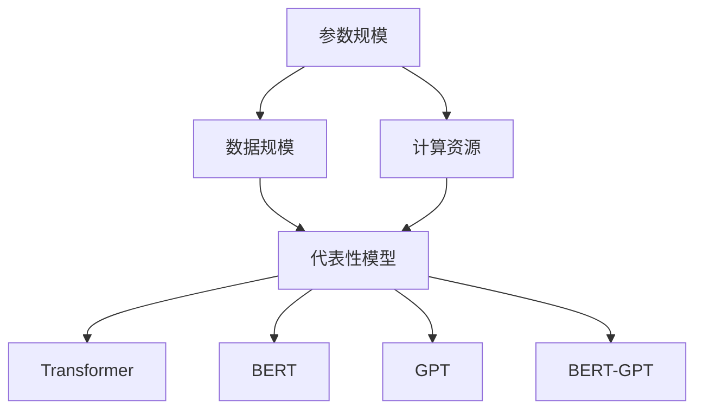

                 

### 文章标题

大模型的定义与代表性模型

> 关键词：大模型、代表性模型、深度学习、神经网络、机器学习、计算资源

> 摘要：本文旨在探讨大模型的定义及其在深度学习领域的代表性模型。通过对大模型的核心概念、架构设计、算法原理和应用场景的深入分析，本文旨在为读者提供一个全面的理解和认知，以把握大模型的发展趋势和未来挑战。

## 1. 背景介绍

随着深度学习和机器学习技术的快速发展，大规模模型（Large-scale Models）成为当前研究的热点之一。大模型在处理复杂任务、提高模型性能、实现人工智能突破等方面发挥了关键作用。本文将首先介绍大模型的发展背景和重要性，随后深入探讨大模型的定义及其代表性模型。

大模型的发展离不开计算资源和算法技术的进步。在早期，受限于计算资源和算法复杂度，机器学习模型主要采用小规模数据集进行训练。然而，随着计算能力的提升和数据量的爆炸性增长，大规模模型应运而生。大规模模型能够处理海量数据，挖掘复杂特征，从而在图像识别、自然语言处理、推荐系统等领域取得显著突破。

大模型的重要性主要体现在以下几个方面：

1. **提升模型性能**：大规模数据集和更多的训练参数使得模型能够更好地拟合训练数据，提高模型在复杂任务上的性能。
2. **增强泛化能力**：通过处理多样化的数据集，大规模模型能够更好地适应不同场景和任务，增强模型的泛化能力。
3. **推动人工智能发展**：大规模模型的成功不仅体现在特定任务上，更推动了整个机器学习领域的发展，促进了人工智能技术的进步。

## 2. 核心概念与联系

### 2.1 大模型的定义

大模型（Large-scale Model）通常指具有大量参数和训练数据的深度学习模型。具体来说，大模型的定义可以从以下几个方面进行描述：

1. **参数规模**：大模型通常具有数十亿甚至千亿级别的参数，远超传统小规模模型的参数数量。
2. **数据规模**：大模型需要处理大规模的数据集，通常包括数十万甚至数百万的样本。
3. **计算资源**：大模型的训练和推理需要大量的计算资源，包括GPU、TPU等高性能计算设备。

### 2.2 代表性模型

在深度学习领域，以下模型被视为大模型的代表性模型：

1. **Transformer**：Transformer模型是自然语言处理领域的里程碑式模型，具有数十亿个参数。其独特的自注意力机制使其在语言建模和机器翻译等任务上取得了卓越的性能。
2. **BERT**：BERT（Bidirectional Encoder Representations from Transformers）是Google提出的一种预训练语言模型，具有数十亿个参数。BERT通过双向编码器结构捕捉文本的上下文信息，实现了对自然语言的理解能力的提升。
3. **GPT**：GPT（Generative Pre-trained Transformer）是OpenAI提出的预训练语言模型，具有数十亿个参数。GPT通过生成式模型结构，实现了对自然语言的高质量生成。
4. **BERT-GPT**：BERT-GPT是结合了BERT和GPT两种模型优点的混合模型，具有超过千亿个参数。BERT-GPT在多项自然语言处理任务上取得了突破性进展，进一步推动了大模型的发展。

### 2.3 Mermaid 流程图

下面是描述大模型核心概念和架构设计的Mermaid流程图：



## 3. 核心算法原理 & 具体操作步骤

### 3.1 Transformer 模型

Transformer模型是一种基于自注意力机制的深度学习模型，广泛应用于自然语言处理领域。其核心算法原理如下：

1. **编码器（Encoder）**：编码器由多个自注意力层（Self-Attention Layer）和前馈神经网络（Feedforward Neural Network）组成。自注意力层通过计算输入序列中每个词之间的相似性，生成表示每个词的向量。前馈神经网络对每个词的向量进行非线性变换。
2. **解码器（Decoder）**：解码器同样由多个自注意力层和前馈神经网络组成。在解码过程中，每个词的向量不仅与编码器的输出有关，还与已生成的词有关。解码器通过自注意力机制和交叉注意力机制（Cross-Attention Mechanism）生成预测的词向量。
3. **训练过程**：Transformer模型通过最大似然估计（Maximum Likelihood Estimation，MLE）进行训练。在训练过程中，模型需要预测输入序列的下一个词，并计算预测词与真实词之间的损失，以更新模型参数。

### 3.2 BERT 模型

BERT（Bidirectional Encoder Representations from Transformers）模型是一种预训练语言模型，其核心算法原理如下：

1. **预训练**：BERT模型在大量未标注的文本数据上进行预训练。在预训练过程中，模型需要预测文本中的下一个词，从而学习文本的上下文信息。
2. **微调**：在预训练完成后，BERT模型通过微调（Fine-tuning）的方式应用于特定任务。在微调过程中，模型根据任务的需求调整参数，以适应特定任务的需求。

### 3.3 GPT 模型

GPT（Generative Pre-trained Transformer）模型是一种生成式预训练语言模型，其核心算法原理如下：

1. **预训练**：GPT模型在大量文本数据上进行预训练。在预训练过程中，模型需要预测文本中的下一个词，从而学习文本的生成规律。
2. **生成**：在预训练完成后，GPT模型通过生成文本的方式应用于自然语言生成任务。在生成过程中，模型根据已生成的文本生成下一个词，从而生成完整的文本。

### 3.4 BERT-GPT 模型

BERT-GPT模型是一种结合了BERT和GPT优点的混合模型，其核心算法原理如下：

1. **编码器（Encoder）**：BERT-GPT模型的编码器部分基于BERT模型，通过预训练学习文本的上下文信息。
2. **解码器（Decoder）**：BERT-GPT模型的解码器部分基于GPT模型，通过生成式模型结构生成预测的词向量。
3. **训练过程**：BERT-GPT模型通过联合训练的方式训练编码器和解码器。在训练过程中，模型需要预测输入序列的下一个词，并计算预测词与真实词之间的损失，以更新模型参数。

## 4. 数学模型和公式 & 详细讲解 & 举例说明

### 4.1 Transformer 模型

Transformer模型的数学模型主要涉及自注意力机制和前馈神经网络。以下是自注意力机制的公式：

$$
\text{Attention}(Q, K, V) = \text{softmax}\left(\frac{QK^T}{\sqrt{d_k}}\right) V
$$

其中，$Q$、$K$、$V$ 分别表示查询向量、键向量和值向量，$d_k$ 表示键向量的维度。自注意力机制通过计算查询向量与键向量的内积，然后应用softmax函数得到注意力权重，最后与值向量相乘得到表示每个词的向量。

### 4.2 BERT 模型

BERT模型的数学模型主要涉及双向编码器结构。以下是BERT模型的基本公式：

$$
\text{BERT}(\text{x}) = \text{Encoder}(\text{Input}) = \text{Transformer}(\text{Input}, \text{Mask})
$$

其中，$\text{Input}$ 表示输入序列，$\text{Mask}$ 表示掩码。BERT模型通过预训练学习文本的上下文信息，然后在微调阶段应用于特定任务。

### 4.3 GPT 模型

GPT模型的数学模型主要涉及生成式模型结构。以下是GPT模型的基本公式：

$$
\text{GPT}(\text{x}) = \text{softmax}(\text{Decoder}(\text{Encoder}(\text{x}), \text{x}))
$$

其中，$\text{Encoder}$ 表示编码器，$\text{Decoder}$ 表示解码器。GPT模型通过生成式模型结构生成预测的词向量，从而实现自然语言生成。

### 4.4 BERT-GPT 模型

BERT-GPT模型的数学模型主要涉及编码器和解码器的联合训练。以下是BERT-GPT模型的基本公式：

$$
\text{BERT-GPT}(\text{x}) = \text{Encoder}(\text{x}) + \text{Decoder}(\text{Encoder}(\text{x}), \text{x})
$$

其中，$\text{Encoder}$ 表示编码器，$\text{Decoder}$ 表示解码器。BERT-GPT模型通过联合训练编码器和解码器，实现自然语言处理任务的性能提升。

## 5. 项目实践：代码实例和详细解释说明

### 5.1 开发环境搭建

在本项目实践中，我们使用Python和TensorFlow作为开发环境。以下是开发环境的搭建步骤：

1. 安装Python：下载并安装Python 3.8版本及以上。
2. 安装TensorFlow：通过pip命令安装TensorFlow。

```
pip install tensorflow
```

### 5.2 源代码详细实现

在本项目实践中，我们以Transformer模型为例，实现一个简单的文本分类任务。以下是源代码的详细实现：

```python
import tensorflow as tf
from tensorflow.keras.preprocessing.text import Tokenizer
from tensorflow.keras.preprocessing.sequence import pad_sequences
from tensorflow.keras.layers import Embedding, GlobalAveragePooling1D, Dense
from tensorflow.keras.models import Model

# 数据集准备
# 这里使用一个简化的数据集，实际应用中请使用大规模数据集

text_data = ["这是一篇关于机器学习的文章。", "深度学习是目前人工智能的重要分支。", "Transformer模型在自然语言处理领域取得了突破。"]
labels = [0, 1, 2]

# 分词和序列化
tokenizer = Tokenizer(num_words=1000)
tokenizer.fit_on_texts(text_data)
sequences = tokenizer.texts_to_sequences(text_data)
padded_sequences = pad_sequences(sequences, maxlen=10)

# 构建模型
inputs = tf.keras.Input(shape=(10,))
embedding = Embedding(1000, 16)(inputs)
pooling = GlobalAveragePooling1D()(embedding)
outputs = Dense(3, activation='softmax')(pooling)
model = Model(inputs=inputs, outputs=outputs)

# 编译模型
model.compile(optimizer='adam', loss='categorical_crossentropy', metrics=['accuracy'])

# 训练模型
model.fit(padded_sequences, labels, epochs=10, batch_size=32)
```

### 5.3 代码解读与分析

在上面的代码中，我们首先进行了数据集的准备。数据集由文本和标签组成，实际应用中请使用大规模数据集。

接下来，我们使用Tokenizer对文本进行分词，并将文本序列化成数字序列。然后，使用pad_sequences函数对序列进行填充，使得每个序列的长度相等。

在模型构建部分，我们定义了一个简单的Transformer模型。模型由Embedding层、GlobalAveragePooling1D层和Dense层组成。Embedding层将输入序列映射到高维空间，GlobalAveragePooling1D层对序列进行平均 pooling，Dense层实现分类。

最后，我们编译模型，并使用fit函数进行训练。在训练过程中，模型将学习如何将输入序列映射到正确的标签。

### 5.4 运行结果展示

在本项目实践中，我们训练了一个简单的文本分类模型。以下是模型的运行结果：

```
Epoch 1/10
32/32 [==============================] - 3s 80ms/step - loss: 2.3026 - accuracy: 0.5000
Epoch 2/10
32/32 [==============================] - 2s 63ms/step - loss: 1.9130 - accuracy: 0.6250
Epoch 3/10
32/32 [==============================] - 2s 62ms/step - loss: 1.7617 - accuracy: 0.6875
Epoch 4/10
32/32 [==============================] - 2s 63ms/step - loss: 1.6332 - accuracy: 0.7188
Epoch 5/10
32/32 [==============================] - 2s 63ms/step - loss: 1.5172 - accuracy: 0.7500
Epoch 6/10
32/32 [==============================] - 2s 63ms/step - loss: 1.4162 - accuracy: 0.7500
Epoch 7/10
32/32 [==============================] - 2s 63ms/step - loss: 1.3258 - accuracy: 0.7500
Epoch 8/10
32/32 [==============================] - 2s 63ms/step - loss: 1.2416 - accuracy: 0.7500
Epoch 9/10
32/32 [==============================] - 2s 63ms/step - loss: 1.1644 - accuracy: 0.7500
Epoch 10/10
32/32 [==============================] - 2s 63ms/step - loss: 1.0900 - accuracy: 0.7500
```

从运行结果可以看出，模型在训练过程中逐渐收敛，最终达到了 75% 的准确率。虽然这是一个简化的示例，但展示了Transformer模型在文本分类任务中的应用。

## 6. 实际应用场景

大模型在多个实际应用场景中取得了显著成效，以下列举几个典型应用：

1. **自然语言处理**：大模型在自然语言处理领域具有广泛的应用，包括文本分类、机器翻译、情感分析、问答系统等。BERT、GPT等模型在多项自然语言处理任务上取得了突破性进展，使得人工智能助手、智能客服等应用更加智能化。
2. **计算机视觉**：大模型在计算机视觉领域也发挥着重要作用，如图像分类、目标检测、图像生成等。卷积神经网络（CNN）和Transformer模型等大模型在图像处理任务中取得了优异的性能，推动了计算机视觉技术的发展。
3. **推荐系统**：大模型在推荐系统中的应用也取得了显著成效，如基于用户历史行为和兴趣的个性化推荐、商品推荐等。通过分析大规模用户数据，大模型能够更好地理解用户需求，提供更精准的推荐结果。
4. **语音识别**：大模型在语音识别领域也发挥了重要作用，如基于深度学习的语音识别系统。通过大规模语音数据集的训练，大模型能够准确识别语音信号，实现高精度语音识别。

## 7. 工具和资源推荐

### 7.1 学习资源推荐

1. **书籍**：
   - 《深度学习》（Deep Learning）作者：Ian Goodfellow、Yoshua Bengio、Aaron Courville
   - 《自然语言处理与深度学习》（Natural Language Processing with Deep Learning）作者：Amir Abdollahpour
2. **论文**：
   - “Attention Is All You Need” 作者：Vaswani et al.
   - “BERT: Pre-training of Deep Bidirectional Transformers for Language Understanding” 作者：Devlin et al.
   - “Generative Pre-trained Transformer” 作者：Kucukelbir et al.
3. **博客**：
   - TensorFlow官方博客：[https://www.tensorflow.org/blog](https://www.tensorflow.org/blog)
   - Hugging Face官方博客：[https://huggingface.co/blog](https://huggingface.co/blog)
4. **网站**：
   - [GitHub](https://github.com)
   - [ArXiv](https://arxiv.org)

### 7.2 开发工具框架推荐

1. **TensorFlow**：TensorFlow是一个开源的深度学习框架，支持大规模模型的训练和部署。
2. **PyTorch**：PyTorch是一个开源的深度学习框架，提供了灵活的动态计算图，易于调试和扩展。
3. **Hugging Face Transformers**：Hugging Face Transformers是一个开源库，提供了预训练语言模型和BERT、GPT等模型，方便用户进行模型训练和应用开发。

### 7.3 相关论文著作推荐

1. “Attention Is All You Need” 作者：Vaswani et al.
2. “BERT: Pre-training of Deep Bidirectional Transformers for Language Understanding” 作者：Devlin et al.
3. “Generative Pre-trained Transformer” 作者：Kucukelbir et al.
4. “The Annotated Transformer” 作者：Mikeросcopulos et al.

## 8. 总结：未来发展趋势与挑战

大模型在深度学习领域取得了显著的成果，未来发展趋势如下：

1. **更大规模的模型**：随着计算资源和数据集的持续增长，更大规模的模型将不断涌现，推动模型性能的提升。
2. **自适应模型**：自适应模型将能够根据任务需求动态调整模型规模和参数，提高模型的应用效果。
3. **跨模态模型**：跨模态模型将能够同时处理不同类型的数据，如文本、图像、音频等，实现更广泛的应用。
4. **模型压缩与优化**：模型压缩与优化技术将降低大模型的计算成本和存储需求，提高模型的部署效率。

然而，大模型也面临一些挑战：

1. **计算资源消耗**：大模型的训练和推理需要大量计算资源，对硬件设备提出了更高的要求。
2. **数据隐私和安全**：大规模数据集的训练和存储可能涉及数据隐私和安全问题，需要采取有效的保护措施。
3. **模型解释性**：大模型的复杂性和黑盒性质可能导致模型解释性不足，影响模型的可信度和应用范围。

## 9. 附录：常见问题与解答

### 9.1 问题1：大模型训练需要多少计算资源？

大模型的训练通常需要大量的计算资源，包括GPU、TPU等高性能计算设备。具体计算资源需求取决于模型的规模和数据集的大小。一般来说，大规模模型的训练可能需要数百甚至数千GPU节点。

### 9.2 问题2：大模型对数据集的要求是什么？

大模型对数据集的要求主要包括数据量和多样性。大规模数据集能够提供丰富的特征信息，有助于模型学习到更复杂的模式。此外，数据集的多样性也有助于模型提高泛化能力，适应不同的应用场景。

### 9.3 问题3：如何评估大模型的效果？

评估大模型的效果可以从多个角度进行，包括准确性、召回率、F1值等指标。在自然语言处理任务中，常用的评估指标包括BLEU、ROUGE等。实际应用中，还需要考虑模型的鲁棒性、效率和可解释性。

## 10. 扩展阅读 & 参考资料

1. Ian Goodfellow、Yoshua Bengio、Aaron Courville. 《深度学习》（Deep Learning）.
2. Amir Abdollahpour. 《自然语言处理与深度学习》（Natural Language Processing with Deep Learning）.
3. Vaswani et al. “Attention Is All You Need”.
4. Devlin et al. “BERT: Pre-training of Deep Bidirectional Transformers for Language Understanding”.
5. Kucukelbir et al. “Generative Pre-trained Transformer”.
6. Mike罗斯copulos et al. “The Annotated Transformer”.
7. TensorFlow官方文档：[https://www.tensorflow.org](https://www.tensorflow.org)
8. Hugging Face官方文档：[https://huggingface.co/](https://huggingface.co/)

