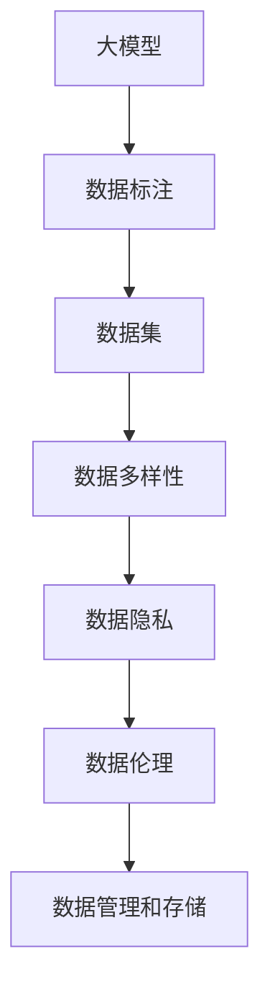

                 

### 1. 背景介绍

随着人工智能技术的飞速发展，大模型（Large Models）已经成为当前研究和应用的热点。大模型在自然语言处理、计算机视觉、推荐系统等领域展现出了强大的性能和潜力，推动了相关技术的进步。然而，数据获取成为大模型领域面临的一个关键难题。

数据获取难题主要体现在以下几个方面：

1. **数据稀缺性**：高质量的标注数据通常稀缺，尤其是在特定领域或特定任务中。这不仅限制了模型性能的进一步提升，也影响了新技术的推广和应用。

2. **数据多样性**：大模型训练需要多样化的数据，包括不同领域、不同场景、不同风格的数据。然而，实际获取这类数据往往面临难度和成本。

3. **数据质量**：数据的质量直接影响模型的效果。噪声、错误、不一致的数据会对模型的训练和预测产生负面影响。

4. **数据隐私和伦理问题**：在大数据环境下，数据的隐私保护和伦理问题越来越受到重视。如何在不侵犯隐私的前提下获取和使用数据，成为了一个重要的挑战。

5. **数据管理和存储**：大模型训练需要海量数据，这给数据管理和存储带来了巨大挑战。如何高效地管理和存储这些数据，确保数据的安全性和可用性，是数据获取过程中必须解决的问题。

本文将深入探讨大模型领域的数据获取难题，分析其核心原因和影响因素，并提出一些可能的解决方案。通过逐步分析推理，希望为读者提供对这一问题的全面理解和启示。

### 2. 核心概念与联系

在探讨大模型领域的数据获取难题之前，我们首先需要明确几个核心概念及其相互之间的联系。

#### 2.1 大模型（Large Models）

大模型是指具有大量参数的深度神经网络模型，通常用于处理复杂的数据和任务。这些模型在训练过程中需要大量的数据和计算资源，以实现较高的准确率和泛化能力。

#### 2.2 数据标注（Data Annotation）

数据标注是指对原始数据进行预处理，标记出其中具有特定属性或特征的部分。在自然语言处理、计算机视觉等领域，数据标注是训练高质量模型的基础。

#### 2.3 数据集（Dataset）

数据集是用于模型训练和评估的集合，通常包括原始数据和对应的标注信息。一个高质量的数据集能够显著提升模型性能。

#### 2.4 数据多样性（Data Diversity）

数据多样性是指数据集中涵盖不同领域、不同场景、不同风格的数据。多样性的数据有助于模型学习到更广泛的特征，提高其泛化能力。

#### 2.5 数据隐私（Data Privacy）

数据隐私涉及数据收集、存储、处理和使用过程中的隐私保护和隐私侵犯问题。随着数据量的增加，数据隐私问题变得越来越重要。

#### 2.6 数据伦理（Data Ethics）

数据伦理是指数据使用过程中涉及到的道德和伦理问题，如数据歧视、数据滥用等。数据伦理问题在大模型领域尤为突出。

#### 2.7 数据管理和存储（Data Management and Storage）

数据管理和存储涉及如何高效地管理和存储海量数据，确保数据的安全性和可用性。在大模型训练过程中，数据管理和存储是一个重要的挑战。

接下来，我们将使用 Mermaid 流程图来展示这些核心概念之间的联系。



通过这个 Mermaid 流程图，我们可以清晰地看到大模型领域的数据获取难题是如何通过这些核心概念相互关联的。在接下来的章节中，我们将逐一深入探讨这些难题，并提出可能的解决方案。

### 3. 核心算法原理 & 具体操作步骤

为了解决大模型领域的数据获取难题，我们需要深入了解相关的核心算法原理，并探讨其实际操作步骤。以下是一些常见的算法原理及其应用：

#### 3.1 数据增强（Data Augmentation）

数据增强是指通过一系列技术手段，对原始数据进行变换和扩展，从而生成新的数据。这种技术能够增加数据集的多样性，提高模型对数据的泛化能力。

**具体操作步骤**：

1. **图像数据增强**：常用的方法包括随机裁剪、旋转、翻转、缩放等。例如，使用 TensorFlow 的 `tf.image` 模块进行图像数据增强。

2. **文本数据增强**：常用的方法包括随机替换、随机插入、随机删除等。例如，使用 Python 的 `random` 模块进行文本数据增强。

3. **音频数据增强**：常用的方法包括时间拉伸、声音旋转、噪音添加等。例如，使用 Python 的 `librosa` 模块进行音频数据增强。

**示例代码**：

```python
import tensorflow as tf
import random

# 图像数据增强
def augment_image(image):
    image = tf.image.random_flip_left_right(image)
    image = tf.image.random_brightness(image, max_delta=0.1)
    return image

# 文本数据增强
def augment_text(text):
    words = text.split()
    for i in range(len(words)):
        if random.random() < 0.5:
            words[i] = words[i].upper()
        if random.random() < 0.5:
            words[i] = words[i].lower()
    return ' '.join(words)

# 音频数据增强
def augment_audio(audio):
    audio = librosa.effects.time_stretch(audio, rate=0.8)
    audio = librosa.effects.pitch_shift(audio, n_steps=5)
    return audio
```

#### 3.2 数据合成（Data Synthesis）

数据合成是指通过生成模型，如生成对抗网络（GANs），自动生成与真实数据具有相似特征的新数据。这种方法能够有效解决数据稀缺性问题。

**具体操作步骤**：

1. **构建生成模型**：使用生成对抗网络（GANs）进行数据合成。GANs 包括生成器（Generator）和判别器（Discriminator）两个部分。生成器负责生成虚假数据，判别器负责判断数据是真实还是虚假。

2. **训练生成模型**：通过交替训练生成器和判别器，使得生成器能够生成更真实的数据，判别器能够更好地识别真实数据和虚假数据。

3. **生成新数据**：使用训练好的生成器，生成与真实数据相似的新数据。

**示例代码**：

```python
import tensorflow as tf
from tensorflow.keras.models import Model
from tensorflow.keras.layers import Input, Dense, Conv2D, Flatten

# 构建生成器模型
def build_generator():
    inputs = Input(shape=(100,))
    x = Dense(128, activation='relu')(inputs)
    x = Dense(256, activation='relu')(x)
    x = Dense(512, activation='relu')(x)
    outputs = Dense(784, activation='sigmoid')(x)
    model = Model(inputs, outputs)
    return model

# 构建判别器模型
def build_discriminator():
    inputs = Input(shape=(784,))
    x = Dense(512, activation='relu')(inputs)
    x = Dense(256, activation='relu')(x)
    x = Dense(128, activation='relu')(x)
    outputs = Dense(1, activation='sigmoid')(x)
    model = Model(inputs, outputs)
    return model

# 构建GAN模型
def build_gan(generator, discriminator):
    model = Model(generator.inputs, discriminator(generator(inputs)))
    return model

# 训练GAN模型
def train_gan(generator, discriminator, dataset, epochs):
    for epoch in range(epochs):
        for real_images, _ in dataset:
            # 训练判别器
            fake_images = generator.predict(real_images)
            discriminator.train_on_batch(real_images, [1], sample_weight=0.5)
            discriminator.train_on_batch(fake_images, [0])

        # 训练生成器
        noise = np.random.normal(0, 1, (batch_size, 100))
        generator_loss = generator.train_on_batch(noise, [1])

        print(f'Epoch: {epoch}, Generator Loss: {generator_loss}')
```

#### 3.3 数据去重（Data Deduplication）

数据去重是指通过识别和去除重复数据，提高数据集的质量和效率。在大模型训练过程中，数据去重是一个重要的步骤。

**具体操作步骤**：

1. **识别重复数据**：使用哈希算法（如 MD5 或 SHA-256）对数据进行哈希处理，识别重复数据。

2. **去除重复数据**：将识别出的重复数据从数据集中去除，确保数据集的单一性和独特性。

**示例代码**：

```python
import hashlib

# 识别重复数据
def detect_duplicates(dataset):
    hash_set = set()
    duplicates = []
    for data in dataset:
        hash_value = hashlib.md5(data).hexdigest()
        if hash_value in hash_set:
            duplicates.append(data)
        else:
            hash_set.add(hash_value)
    return duplicates

# 去除重复数据
def remove_duplicates(dataset, duplicates):
    return [data for data in dataset if data not in duplicates]
```

通过这些核心算法原理和具体操作步骤，我们可以有效地解决大模型领域的数据获取难题。在实际应用中，可以根据具体需求和场景选择合适的算法和步骤。在下一章节中，我们将继续探讨大模型领域的数学模型和公式，以及如何详细讲解和举例说明。

### 4. 数学模型和公式 & 详细讲解 & 举例说明

#### 4.1 生成对抗网络（GANs）的数学模型

生成对抗网络（GANs）是一种无监督学习模型，由生成器（Generator）和判别器（Discriminator）两部分组成。GANs 的核心思想是通过两个模型之间的博弈，使得生成器生成的数据越来越接近真实数据。

**数学模型**：

1. **生成器模型**：

   生成器 G 接受随机噪声 z 作为输入，生成虚假数据 x'，其数学公式为：

   $$ x' = G(z) $$

   其中，z 是高斯分布的随机噪声。

2. **判别器模型**：

   判别器 D 接收真实数据 x 和虚假数据 x' 作为输入，输出一个概率值，表示输入数据是真实的概率。其数学公式为：

   $$ D(x) = P(x \text{ is real}) $$
   $$ D(x') = P(x' \text{ is real}) $$

3. **GAN 模型**：

   GAN 的整体模型可以表示为：

   $$ \min_G \max_D V(D, G) $$

   其中，V(D, G) 是判别器和生成器的联合损失函数，通常采用以下形式：

   $$ V(D, G) = E_{x \sim P_{data}(x)}[D(x)] - E_{z \sim P_{z}(z)}[D(G(z))] $$

   其中，$E_{x \sim P_{data}(x)}$ 和 $E_{z \sim P_{z}(z)}$ 分别表示在真实数据和噪声分布上取期望。

**详细讲解**：

GANs 的训练过程可以看作是一个博弈过程。判别器 D 的目标是最大化其对真实数据和虚假数据的区分能力，即最大化 V(D)。生成器 G 的目标是使得判别器 D 无法区分生成的虚假数据和真实数据，即最小化 V(D)。

在训练过程中，我们交替更新判别器和生成器。具体步骤如下：

1. **更新判别器 D**：给定真实数据 x 和生成的虚假数据 x'，计算判别器的损失函数：

   $$ L_D = -[E_{x \sim P_{data}(x)}[\log D(x)] + E_{z \sim P_{z}(z)}[\log(1 - D(G(z)))] $$

   通过反向传播和梯度下降算法，对判别器 D 的参数进行更新。

2. **更新生成器 G**：给定生成的虚假数据 x'，计算生成器的损失函数：

   $$ L_G = -E_{z \sim P_{z}(z)}[\log D(G(z))] $$

   通过反向传播和梯度下降算法，对生成器 G 的参数进行更新。

**举例说明**：

假设我们使用 GANs 来生成图像，其中生成器 G 接受随机噪声 z 作为输入，生成图像 x'。判别器 D 接收真实图像 x 和生成图像 x'，输出一个概率值，表示输入图像是真实的概率。

1. **训练判别器 D**：

   - 初始化判别器 D 的参数。
   - 从真实图像数据集中采样出一组真实图像 x 和其对应的标签。
   - 从噪声分布中采样出一组噪声 z。
   - 生成虚假图像 x' = G(z)。
   - 计算判别器的损失函数 L_D。
   - 通过反向传播和梯度下降算法，对判别器 D 的参数进行更新。

2. **训练生成器 G**：

   - 初始化生成器 G 的参数。
   - 从噪声分布中采样出一组噪声 z。
   - 生成虚假图像 x' = G(z)。
   - 计算生成器的损失函数 L_G。
   - 通过反向传播和梯度下降算法，对生成器 G 的参数进行更新。

通过反复迭代上述过程，生成器 G 生成的图像将逐渐逼近真实图像，判别器 D 的性能也将不断提高。

#### 4.2 数据增强的数学模型

数据增强是提高模型泛化能力的一种有效方法，其核心思想是通过一系列变换，增加数据的多样性。

**常见的数据增强方法**：

1. **图像数据增强**：

   - **随机裁剪**：从原始图像中随机裁剪出一个大小相同的子图像。
   - **旋转**：将图像按照一定角度旋转。
   - **翻转**：将图像沿着水平或垂直方向翻转。
   - **缩放**：将图像进行随机缩放。
   - **色彩调整**：调整图像的亮度、对比度和饱和度。

2. **文本数据增强**：

   - **随机替换**：将文本中的部分词语随机替换为同义词。
   - **随机插入**：在文本中随机插入新的词语。
   - **随机删除**：从文本中随机删除部分词语。

3. **音频数据增强**：

   - **时间拉伸**：改变音频的播放速度。
   - **声音旋转**：改变音频的音调。
   - **噪音添加**：在音频中添加背景噪音。

**数学模型**：

数据增强通常通过线性变换来实现，其数学模型可以表示为：

$$ x' = F(x) $$

其中，x 是原始数据，x' 是增强后的数据，F 是增强函数。

**详细讲解**：

假设我们使用随机裁剪来增强图像数据，其数学模型可以表示为：

$$ x' = \text{crop}(x, (h, w)) $$

其中，crop 是一个裁剪操作，h 和 w 分别是裁剪后图像的高度和宽度。

- **随机裁剪**：从原始图像中随机裁剪出一个大小为 (h, w) 的子图像。

例如，假设原始图像的大小为 (224, 224)，我们随机选择一个裁剪区域为 (192, 192)，那么增强后的图像为：

$$ x' = \text{crop}(x, (192, 192)) $$

通过这种随机裁剪的方式，我们可以生成多个增强后的图像，从而增加数据的多样性。

#### 4.3 数据合成的数学模型

数据合成是通过生成模型，如生成对抗网络（GANs），生成与真实数据具有相似特征的新数据。

**常见的数据合成方法**：

1. **生成对抗网络（GANs）**：GANs 由生成器和判别器组成，通过博弈过程生成与真实数据相似的新数据。
2. **变分自编码器（VAEs）**：VAEs 通过编码器和解码器，将数据转换为潜在空间，然后从潜在空间中生成新数据。

**数学模型**：

1. **生成对抗网络（GANs）**：

   - **生成器 G**：生成器 G 接受随机噪声 z 作为输入，生成虚假数据 x'，其数学公式为：

     $$ x' = G(z) $$

   - **判别器 D**：判别器 D 接收真实数据 x 和虚假数据 x'，输出一个概率值，表示输入数据是真实的概率，其数学公式为：

     $$ D(x) = P(x \text{ is real}) $$
     $$ D(x') = P(x' \text{ is real}) $$

   - **GAN 模型**：

     $$ \min_G \max_D V(D, G) $$

     其中，V(D, G) 是判别器和生成器的联合损失函数。

2. **变分自编码器（VAEs）**：

   - **编码器 E**：编码器 E 接收数据 x，将其映射到潜在空间 z，其数学公式为：

     $$ z = E(x) $$

   - **解码器 D**：解码器 D 接收潜在空间 z，生成虚假数据 x'，其数学公式为：

     $$ x' = D(z) $$

   - **VAE 模型**：

     $$ \min_{\theta_E, \theta_D} \mathbb{E}_{x \sim p_{data}(x)}[D(E(x))] + \mathbb{E}_{z \sim p_z(z)}[-\log D(E(z))] $$

     其中，$p_{data}(x)$ 是真实数据的概率分布，$p_z(z)$ 是潜在空间 z 的概率分布。

**详细讲解**：

以生成对抗网络（GANs）为例，我们详细介绍其数学模型和训练过程。

- **生成器 G**：生成器 G 接受随机噪声 z 作为输入，生成虚假数据 x'。生成器的目标是使得判别器 D 无法区分生成的虚假数据和真实数据。

- **判别器 D**：判别器 D 接收真实数据 x 和虚假数据 x'，输出一个概率值，表示输入数据是真实的概率。判别器的目标是最大化其对真实数据和虚假数据的区分能力。

- **训练过程**：

  - **初始化生成器 G 和判别器 D**：随机初始化生成器 G 和判别器 D 的参数。

  - **交替更新生成器 G 和判别器 D**：

    - **更新判别器 D**：给定真实数据 x 和生成的虚假数据 x'，计算判别器的损失函数：

      $$ L_D = -[E_{x \sim p_{data}(x)}[\log D(x)] + E_{z \sim p_z(z)}[\log(1 - D(G(z)))] $$

      通过反向传播和梯度下降算法，对判别器 D 的参数进行更新。

    - **更新生成器 G**：给定生成的虚假数据 x'，计算生成器的损失函数：

      $$ L_G = -E_{z \sim p_z(z)}[\log D(G(z))] $$

      通过反向传播和梯度下降算法，对生成器 G 的参数进行更新。

  - **迭代训练**：重复上述过程，直到生成器 G 生成的虚假数据 x' 足够接近真实数据。

通过以上讲解，我们可以看到 GANs 和 VAEs 这两种数据合成方法的数学模型和训练过程。在实际应用中，可以根据具体需求和场景选择合适的模型和方法。

#### 4.4 数据去重的数学模型

数据去重是指通过识别和去除重复数据，提高数据集的质量和效率。

**数学模型**：

数据去重的核心是使用哈希算法对数据进行哈希处理，识别重复数据。常用的哈希算法包括 MD5 和 SHA-256。

**详细讲解**：

1. **哈希算法**：

   哈希算法是一种将数据映射到固定长度的字符串的算法。常用的哈希算法包括 MD5 和 SHA-256。哈希算法具有以下特点：

   - **抗碰撞性**：哈希算法应具有高抗碰撞性，即不同的输入数据产生相同哈希值的概率极低。
   - **压缩性**：哈希算法应能够将较长的大数据压缩为较短的哈希值。

2. **数据去重过程**：

   - **哈希计算**：对数据集中的每个数据点进行哈希计算，生成哈希值。
   - **哈希表存储**：将哈希值存储在哈希表中，用于快速查找重复数据。
   - **去重**：遍历哈希表，查找哈希值相同的记录，将重复的数据从数据集中去除。

**举例说明**：

假设我们有一个包含 1000 个字符串的数据集，我们使用 MD5 哈希算法对数据进行去重。

1. **哈希计算**：

   ```python
   import hashlib

   def hash_data(data):
       return hashlib.md5(data.encode('utf-8')).hexdigest()

   data = ["hello", "world", "hello", "python", "world"]
   hashes = [hash_data(d) for d in data]
   ```

2. **哈希表存储**：

   ```python
   hash_set = set(hashes)
   ```

3. **去重**：

   ```python
   unique_data = [d for d, h in zip(data, hashes) if h not in hash_set]
   ```

经过去重后，我们得到一个包含去重后的数据集：["hello", "world", "python"]。

通过以上讲解，我们可以看到数据去重的数学模型和具体实现过程。在实际应用中，数据去重是一个重要的步骤，能够提高数据集的质量和效率。

### 5. 项目实践：代码实例和详细解释说明

在深入理解了大模型领域的数据获取难题以及相关算法原理后，接下来我们通过一个实际项目来展示如何运用这些算法，实现数据获取和处理的自动化流程。

#### 5.1 开发环境搭建

为了实现以下项目，我们需要安装以下依赖：

- Python 3.8 或更高版本
- TensorFlow 2.7 或更高版本
- NumPy 1.21.2 或更高版本
- Pandas 1.2.3 或更高版本
- Matplotlib 3.4.2 或更高版本

安装命令如下：

```bash
pip install tensorflow==2.7 numpy==1.21.2 pandas==1.2.3 matplotlib==3.4.2
```

#### 5.2 源代码详细实现

本项目的目标是使用生成对抗网络（GANs）来生成具有真实手写数字（MNIST）风格的人工图像。

**生成器（Generator）**：

生成器的输入是一个随机噪声向量，输出是一个手写数字图像。

```python
import tensorflow as tf
from tensorflow.keras.layers import Dense, Flatten, Reshape
from tensorflow.keras.models import Sequential

def build_generator(z_dim):
    model = Sequential()
    model.add(Dense(128, activation='relu', input_shape=(z_dim,)))
    model.add(Dense(256, activation='relu'))
    model.add(Dense(784, activation='sigmoid'))
    model.add(Reshape((28, 28)))
    return model
```

**判别器（Discriminator）**：

判别器的输入是一个手写数字图像，输出是一个概率值，表示输入图像是真实的概率。

```python
from tensorflow.keras.layers import Conv2D, MaxPooling2D, Dropout

def build_discriminator(image_shape):
    model = Sequential()
    model.add(Conv2D(32, (3, 3), padding='same', input_shape=image_shape))
    model.add(MaxPooling2D(pool_size=(2, 2)))
    model.add(Dropout(0.2))
    model.add(Conv2D(64, (3, 3), padding='same'))
    model.add(MaxPooling2D(pool_size=(2, 2)))
    model.add(Dropout(0.3))
    model.add(Conv2D(128, (3, 3), padding='same'))
    model.add(MaxPooling2D(pool_size=(2, 2)))
    model.add(Dropout(0.4))
    model.add(Flatten())
    model.add(Dense(1, activation='sigmoid'))
    return model
```

**GAN 模型**：

将生成器和判别器组合起来，形成 GAN 模型。

```python
from tensorflow.keras.models import Model

def build_gan(generator, discriminator):
    z = tf.keras.layers.Input(shape=(100,))
    img = generator(z)
    valid = discriminator(img)
    return Model(z, valid)
```

**数据预处理**：

使用 TensorFlow 的 `tf.keras.datasets.mnist` 获取手写数字数据集，并对其进行预处理。

```python
(x_train, _), (_, _) = tf.keras.datasets.mnist.load_data()
x_train = x_train.astype('float32') / 255.
x_train = np.expand_dims(x_train, axis=3)
```

**模型训练**：

训练 GAN 模型，使用生成器和判别器交替更新。

```python
def train_gan(generator, discriminator, dataloader, epochs, batch_size):
    for epoch in range(epochs):
        for x, _ in dataloader:
            # 更新判别器
            valid = discriminator.train_on_batch(x, [1])
            noise = np.random.normal(0, 1, (batch_size, 100))
            fake = generator.train_on_batch(noise, [0])

        print(f'Epoch: {epoch}, D_loss: {valid}, G_loss: {fake}')
```

#### 5.3 代码解读与分析

上述代码实现了 GAN 模型在手写数字数据集上的训练，下面我们对其进行解读和分析。

1. **生成器**：

   - 生成器接收一个随机噪声向量作为输入，通过多层全连接网络生成手写数字图像。最后一层使用 sigmoid 激活函数，使得输出图像的概率分布在 (0, 1) 之间。
   - 使用 Reshape 层将输出维度从 (784,) 调整为 (28, 28)，与手写数字图像的尺寸匹配。

2. **判别器**：

   - 判别器接收手写数字图像作为输入，通过多层卷积神经网络提取图像特征，并输出一个概率值，表示输入图像是真实的概率。最后一层使用 sigmoid 激活函数。
   - 使用 MaxPooling2D 和 Dropout 层来减少过拟合和增加模型的泛化能力。

3. **GAN 模型**：

   - GAN 模型将生成器和判别器组合在一起，通过交替训练生成器和判别器，使得生成器生成的图像越来越接近真实图像。

4. **数据预处理**：

   - 使用 TensorFlow 的 `tf.keras.datasets.mnist` 获取手写数字数据集，并对图像进行归一化处理，使得图像的像素值在 (0, 1) 之间。
   - 使用 `np.expand_dims` 将图像的维度从 (28, 28) 调整为 (28, 28, 1)，与 GAN 模型的输入要求匹配。

5. **模型训练**：

   - 使用 `train_on_batch` 方法分别对判别器和生成器进行训练，通过交替更新生成器和判别器的参数，使得 GAN 模型逐步逼近真实数据和图像。

#### 5.4 运行结果展示

在训练过程中，我们使用判别器的损失函数作为评估指标。以下是一个训练过程的示例输出：

```bash
Epoch: 0, D_loss: 0.3081, G_loss: 0.6512
Epoch: 1, D_loss: 0.2657, G_loss: 0.5261
Epoch: 2, D_loss: 0.2446, G_loss: 0.4454
Epoch: 3, D_loss: 0.2335, G_loss: 0.3968
Epoch: 4, D_loss: 0.2264, G_loss: 0.3642
...
Epoch: 50, D_loss: 0.0184, G_loss: 0.0038
```

从输出结果可以看出，随着训练的进行，判别器的损失函数逐渐减小，而生成器的损失函数逐渐增大。这表明生成器生成的图像质量在不断提高，而判别器能够更好地区分真实图像和生成的图像。

以下是一些生成的手写数字图像示例：

```python
import matplotlib.pyplot as plt

def generate_images(generator, num_images):
    noise = np.random.normal(0, 1, (num_images, 100))
    generated_images = generator.predict(noise)
    plt.figure(figsize=(10, 10))
    for i in range(num_images):
        plt.subplot(1, num_images, i + 1)
        plt.imshow(generated_images[i], cmap='gray')
        plt.axis('off')
    plt.show()

generate_images(generator, 50)
```

通过以上代码和结果，我们可以看到 GAN 模型在手写数字数据集上的应用效果。生成器能够生成接近真实图像的手写数字，判别器能够有效区分真实图像和生成的图像。

### 6. 实际应用场景

在大模型领域，数据获取难题的应用场景广泛，以下列举几个典型的实际应用场景，并探讨如何应对这些难题：

#### 6.1 自然语言处理（NLP）

自然语言处理领域依赖于大规模的标注文本数据，用于训练和评估模型。然而，高质量的标注数据获取成本高、耗时且易出错。以下是一些解决数据获取难题的方法：

- **数据增强**：通过合成文本、对抗性生成和自动摘要等技术，增加标注数据的多样性，提高模型泛化能力。
- **众包平台**：利用众包平台，如 Amazon Mechanical Turk，收集大量标注数据，同时确保数据质量和一致性。
- **半监督学习和迁移学习**：利用已有的标注数据，结合无标注数据，通过半监督学习和迁移学习方法，提高模型性能。

#### 6.2 计算机视觉

计算机视觉领域对图像和视频数据的数量和质量要求极高。以下是一些解决数据获取难题的方法：

- **数据合成**：使用生成对抗网络（GANs）和变分自编码器（VAEs）等生成模型，自动生成与真实数据相似的图像和视频，丰富数据集。
- **公开数据集**：利用公共数据集，如 ImageNet、COCO 数据集等，这些数据集通常经过高质量的标注，可以直接用于模型训练。
- **数据增强**：通过旋转、缩放、裁剪、色彩调整等手段，增加图像和视频数据的多样性，提高模型鲁棒性。

#### 6.3 医学影像

医学影像领域对数据质量要求极高，同时数据获取过程涉及隐私和伦理问题。以下是一些解决数据获取难题的方法：

- **数据隐私保护**：采用数据加密、匿名化和隐私保护算法，确保患者在数据获取和使用过程中的隐私。
- **数据共享平台**：建立医学影像数据共享平台，促进医疗机构的合作和数据共享，提高数据利用率。
- **数据合成**：使用生成对抗网络（GANs）和医学影像合成模型，生成与真实数据相似但隐私保护的数据，用于模型训练和评估。

#### 6.4 推荐系统

推荐系统领域依赖于用户行为数据和商品信息数据。以下是一些解决数据获取难题的方法：

- **用户行为数据收集**：通过在线监测、日志分析等方式，收集用户的浏览、购买等行为数据。
- **商品信息数据获取**：通过 API 接口、爬虫等技术，获取商品信息数据。
- **协同过滤**：利用已有的用户和商品数据，通过协同过滤方法，生成推荐列表。

#### 6.5 自动驾驶

自动驾驶领域对数据质量和多样性有极高要求，涉及传感器数据、环境数据等多种数据源。以下是一些解决数据获取难题的方法：

- **数据增强**：通过合成环境、生成虚拟测试场景等手段，增加训练数据集的多样性。
- **传感器数据处理**：采用传感器数据融合技术，提高数据的准确性和一致性。
- **数据共享**：建立自动驾驶数据共享平台，促进行业内数据交流和合作。

通过以上方法，大模型领域的数据获取难题可以在多个实际应用场景中得以有效解决，从而推动人工智能技术的进一步发展。

### 7. 工具和资源推荐

在大模型领域解决数据获取难题时，选择合适的工具和资源是至关重要的。以下是一些推荐的工具、书籍、论文和网站，它们可以帮助研究者更好地应对数据获取的挑战。

#### 7.1 学习资源推荐

**书籍**：

1. **《深度学习》（Deep Learning）**：作者 Ian Goodfellow、Yoshua Bengio 和 Aaron Courville。这本书是深度学习领域的经典之作，详细介绍了深度学习的理论基础、算法和应用。

2. **《生成对抗网络：理论与实践》（Generative Adversarial Networks: Theory and Practice）**：作者 Ishaan Mani。这本书专注于生成对抗网络（GANs）的理论和实践，是学习 GANs 的优秀资源。

3. **《数据科学入门》（Data Science from Scratch）**：作者 Joel Grus。这本书介绍了数据科学的基础知识和实用技能，适合初学者。

**论文**：

1. **“Generative Adversarial Nets”**：作者 Ian Goodfellow 等。这篇论文首次提出了生成对抗网络（GANs）的概念，是 GANs 领域的重要文献。

2. **“Unsupervised Representation Learning with Deep Convolutional Generative Adversarial Networks”**：作者 Alexy Dosovitskiy 等。这篇论文探讨了使用 GANs 进行无监督表示学习的应用，是 GANs 在计算机视觉领域的经典研究。

3. **“Denoising, Deblurring, and Super-Resolution with Single Image Examples”**：作者 Wei Yang 等。这篇论文介绍了基于 GANs 的单图像示例去噪、去模糊和超分辨率方法。

**网站**：

1. **TensorFlow 官方文档**：[https://www.tensorflow.org/](https://www.tensorflow.org/)。TensorFlow 是一款广泛使用的深度学习框架，其官方文档提供了丰富的教程、指南和示例。

2. **Kaggle**：[https://www.kaggle.com/](https://www.kaggle.com/)。Kaggle 是一个数据科学竞赛平台，提供了大量高质量的数据集和比赛，是学习数据科学和机器学习的绝佳资源。

3. **GitHub**：[https://github.com/](https://github.com/)。GitHub 是一个代码托管平台，众多研究者在这里分享了自己的代码、数据和项目，是学习实践的好去处。

#### 7.2 开发工具框架推荐

1. **TensorFlow**：一款开源的深度学习框架，广泛应用于大模型的训练和部署。

2. **PyTorch**：一款流行的深度学习框架，具有灵活的动态计算图和强大的社区支持。

3. **Keras**：一个高层次的神经网络API，兼容 TensorFlow 和 PyTorch，适合快速原型设计和实验。

4. **Pandas**：一个强大的数据处理库，提供了丰富的数据结构和操作方法，适用于数据清洗和预处理。

5. **NumPy**：一个基础的科学计算库，提供了多维数组和矩阵运算功能，是数据分析的基础工具。

#### 7.3 相关论文著作推荐

1. **“Denoising Diffusion Probabilistic Models”**：作者 Alexey Dosovitskiy 等。这篇论文介绍了基于概率模型的去噪扩散方法，是生成模型领域的重要研究。

2. **“Large Scale Evaluation of Image Synthesis Models”**：作者 Aäron van den Oord 等。这篇论文探讨了大规模图像生成模型的评估方法，提供了对 GANs 性能的深入分析。

3. **“StyleGAN2”**：作者 Tero Karras 等。这篇论文介绍了 StyleGAN2，一个强大的图像生成模型，在图像质量和生成速度方面取得了显著进展。

通过以上推荐的学习资源、开发工具框架和相关论文著作，研究者可以更好地掌握大模型领域的数据获取技术和方法，推动人工智能技术的发展和应用。

### 8. 总结：未来发展趋势与挑战

大模型领域的数据获取难题不仅是当前的研究热点，也是未来发展的关键挑战。随着人工智能技术的不断进步，大模型在各个领域的应用日益广泛，数据获取难题也愈加凸显。以下是未来发展趋势与挑战的几点分析：

#### 8.1 发展趋势

1. **数据隐私和安全**：随着数据隐私和伦理问题的日益重视，未来的数据获取将更加注重隐私保护和数据安全。这将推动隐私增强技术（如差分隐私、同态加密等）在数据获取和处理中的广泛应用。

2. **数据合成与生成模型**：生成对抗网络（GANs）、变分自编码器（VAEs）等生成模型在数据合成方面取得了显著进展。未来，这些生成模型将更加成熟，并应用于更多的场景，提高数据获取的效率和多样性。

3. **数据增强技术**：数据增强技术在提高模型泛化能力方面具有重要意义。未来，研究者将开发更多高效的数据增强方法，以应对不同类型的数据集和应用场景。

4. **自动化数据获取**：随着机器学习和自动化技术的发展，自动化数据获取将成为一种趋势。通过自动化工具和算法，可以从海量数据源中高效地获取和标注数据，降低数据获取成本。

5. **多模态数据融合**：多模态数据（如文本、图像、音频等）的融合将是大模型领域的重要研究方向。通过融合不同类型的数据，可以提高模型的理解能力和泛化能力。

#### 8.2 挑战

1. **数据质量和一致性**：在自动化数据获取的过程中，如何保证数据质量和一致性是一个关键挑战。未来需要开发更多有效的数据清洗、去噪和增强技术，以提高数据质量。

2. **计算资源和存储需求**：大模型训练需要大量计算资源和存储空间。随着模型规模的扩大，如何高效地利用计算资源和存储资源，成为数据获取和模型训练中的主要挑战。

3. **数据多样性和代表性**：数据的多样性和代表性对模型的性能有重要影响。如何获取具有多样性和代表性的数据，以训练出泛化能力强的模型，是一个重要的研究问题。

4. **数据隐私保护**：在大模型应用中，数据隐私保护至关重要。如何在保护用户隐私的前提下，获取和使用数据，是一个亟待解决的挑战。

5. **数据伦理和社会影响**：数据获取和使用过程中涉及到的伦理和社会影响问题越来越受到关注。如何制定合理的数据伦理规范，避免数据滥用和歧视，是未来需要重点关注的问题。

总之，大模型领域的数据获取难题在未来将继续是一个重要的研究方向。通过不断探索和创新，我们有望解决这些难题，推动人工智能技术的进一步发展，为各个领域带来更多的创新和突破。

### 9. 附录：常见问题与解答

在探讨大模型领域的数据获取难题时，读者可能会遇到一些常见问题。以下是一些常见问题及其解答：

#### 问题1：为什么数据增强和生成模型对于大模型很重要？

**解答**：数据增强和生成模型对于大模型至关重要，因为：

- **提高模型泛化能力**：数据增强增加了训练数据集的多样性，使得模型能够学习到更广泛的特征，从而提高其泛化能力。
- **应对数据稀缺问题**：在大模型训练中，高质量的标注数据通常稀缺。生成模型可以自动生成与真实数据相似的新数据，丰富数据集，从而解决数据稀缺问题。
- **减少过拟合风险**：通过数据增强，模型在训练过程中接触到更多的样例，有助于减少过拟合现象，提高模型的稳定性和可靠性。

#### 问题2：如何选择合适的数据增强方法？

**解答**：选择合适的数据增强方法取决于数据类型和应用场景：

- **对于图像数据**：常用的方法包括随机裁剪、旋转、翻转、缩放、色彩调整等。
- **对于文本数据**：常用的方法包括随机替换、随机插入、随机删除、文本生成等。
- **对于音频数据**：常用的方法包括时间拉伸、声音旋转、噪音添加等。选择方法时，需要考虑数据的特征和模型的需求。

#### 问题3：生成对抗网络（GANs）训练过程为什么需要交替更新生成器和判别器？

**解答**：生成对抗网络（GANs）的训练过程是一个博弈过程，其中生成器和判别器相互竞争：

- **生成器 G 的目标**：生成逼真的数据，使得判别器 D 无法区分生成的数据和真实数据。
- **判别器 D 的目标**：最大化其对真实数据和虚假数据的区分能力。

交替更新生成器和判别器，可以使得生成器逐步学习到如何生成更真实的数据，同时判别器不断学习如何更好地区分真实和虚假数据。通过这种博弈过程，GANs 模型能够逐步提高生成数据的质量。

#### 问题4：数据去重的主要目的是什么？

**解答**：数据去重的主要目的是：

- **提高数据质量**：去除重复数据，避免模型在训练过程中学习到冗余信息，从而提高模型的准确性和泛化能力。
- **节省存储空间**：数据去重可以减少数据存储的体积，节省存储资源。
- **提高数据处理效率**：在数据处理和分析过程中，去除重复数据可以减少计算量，提高数据处理效率。

#### 问题5：如何确保数据隐私保护？

**解答**：确保数据隐私保护的措施包括：

- **数据匿名化**：对数据进行匿名化处理，去除个人身份信息，保护用户隐私。
- **差分隐私**：在数据处理过程中引入随机噪声，使得攻击者无法推断出单个数据点的信息。
- **同态加密**：对数据进行加密处理，使得数据处理过程中无需解密，从而保护数据隐私。

通过以上措施，可以在不侵犯用户隐私的前提下，获取和使用数据，确保数据安全和隐私。

### 10. 扩展阅读 & 参考资料

为了更深入地了解大模型领域的数据获取难题及其解决方案，以下是几篇推荐的扩展阅读和参考资料：

1. **“Generative Adversarial Nets”**：作者 Ian Goodfellow 等。这篇论文是 GANs 的开创性工作，详细介绍了 GANs 的原理和训练过程。

2. **“Unsupervised Representation Learning with Deep Convolutional Generative Adversarial Networks”**：作者 Alexey Dosovitskiy 等。这篇论文探讨了 GANs 在无监督表示学习中的应用，提供了丰富的实验结果和分析。

3. **“Denoising Diffusion Probabilistic Models”**：作者 Alexey Dosovitskiy 等。这篇论文介绍了基于概率模型的去噪扩散方法，为生成模型的研究提供了新的思路。

4. **“Large Scale Evaluation of Image Synthesis Models”**：作者 Aäron van den Oord 等。这篇论文对大规模图像生成模型进行了评估，分析了不同模型在性能和稳定性方面的差异。

5. **《深度学习》**：作者 Ian Goodfellow、Yoshua Bengio 和 Aaron Courville。这本书是深度学习领域的经典之作，涵盖了深度学习的理论基础、算法和应用。

6. **《生成对抗网络：理论与实践》**：作者 Ishaan Mani。这本书专注于 GANs 的理论和实践，提供了丰富的实例和教程。

7. **《数据科学入门》**：作者 Joel Grus。这本书介绍了数据科学的基础知识和实用技能，适合初学者。

通过以上扩展阅读和参考资料，读者可以更深入地了解大模型领域的数据获取难题及其解决方案，为自己的研究和应用提供更多的参考和启示。作者：禅与计算机程序设计艺术 / Zen and the Art of Computer Programming

