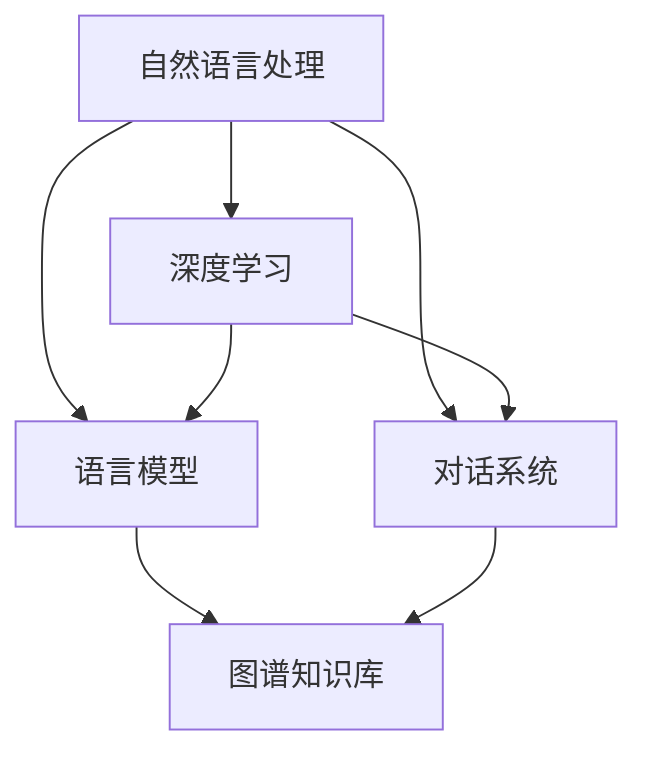

                 

### 背景介绍

大模型问答机器人作为人工智能领域的一个重要分支，近年来得到了广泛关注。随着深度学习和自然语言处理技术的飞速发展，大模型问答机器人逐渐在各个行业中发挥着重要作用。这些问答机器人不仅能够高效地回答用户的问题，还能进行复杂的多轮对话，提供个性化服务。

在当今社会，信息爆炸和数据量庞大的背景下，用户对于快速获取有效信息的需求日益增长。传统的搜索引擎虽然能够提供大量的信息，但往往无法满足用户对于特定问题的精准回答。而大模型问答机器人则能通过智能分析、理解和生成语言，为用户提供准确、个性化的答案。

此外，随着互联网的普及，在线客服、智能助手等应用场景也日益丰富。大模型问答机器人能够应用于电商客服、金融服务、医疗咨询等多个领域，为企业和用户提供便捷的交互体验。

总之，大模型问答机器人的出现为人类生活带来了诸多便利，也推动了人工智能技术的发展。本文将围绕大模型问答机器人的核心概念、算法原理、数学模型、项目实践、应用场景以及未来发展等方面进行详细探讨，旨在为读者提供一份全面的技术解析。

### 2. 核心概念与联系

为了深入理解大模型问答机器人的工作原理，我们需要首先了解其核心概念和组成部分。以下是本文所涉及的主要核心概念：

1. **自然语言处理（NLP）**：自然语言处理是人工智能的一个重要分支，旨在使计算机能够理解、生成和处理人类自然语言。在大模型问答机器人中，NLP技术用于分析和理解用户输入的问题。

2. **深度学习**：深度学习是机器学习的一个分支，通过构建多层的神经网络模型来对数据进行分析和分类。在大模型问答机器人中，深度学习技术被用于训练和优化问答模型。

3. **语言模型**：语言模型是自然语言处理中的核心组件，用于预测文本序列的概率分布。在大模型问答机器人中，语言模型被用来生成回答。

4. **对话系统**：对话系统是一种人机交互系统，通过自然语言与用户进行交流。在大模型问答机器人中，对话系统负责处理用户的问题，并生成回答。

5. **图谱知识库**：图谱知识库是一种用于存储和表示知识的结构化系统，通过图数据结构来表示实体及其关系。在大模型问答机器人中，图谱知识库用于提供额外的背景信息和上下文，以增强问答的准确性。

为了更好地理解这些核心概念之间的联系，我们可以通过一个Mermaid流程图来展示它们之间的关系：



在上述流程图中，自然语言处理（A）是整个问答机器人的基础，它通过深度学习（B）和语言模型（C）来实现对用户输入的理解和生成回答。对话系统（D）负责处理用户的问题，并在需要时利用图谱知识库（E）提供额外的上下文信息，以提高问答的准确性和效果。

通过这个流程图，我们可以清晰地看到大模型问答机器人的核心组成部分及其相互关系。接下来，我们将进一步探讨这些核心算法原理和具体操作步骤，以便读者能够深入理解大模型问答机器人的工作流程。

### 3. 核心算法原理 & 具体操作步骤

为了实现大模型问答机器人的功能，我们需要深入了解其核心算法原理和具体操作步骤。以下是关于大模型问答机器人算法原理的详细阐述，以及各步骤的具体操作方法。

#### 3.1 语言模型

语言模型是自然语言处理的核心组件，用于预测文本序列的概率分布。在大模型问答机器人中，我们通常使用深度学习中的循环神经网络（RNN）或其变种，如长短期记忆网络（LSTM）和门控循环单元（GRU），来训练语言模型。

**操作步骤**：

1. **数据预处理**：首先，我们需要对训练数据集进行预处理，包括分词、去停用词、词向量化等操作。分词是将文本拆分为单词或词汇序列的过程，而去停用词则是去除常见无意义的词汇，如“的”、“和”等。词向量化是将文本中的每个词映射为一个向量表示。

2. **构建神经网络模型**：接下来，我们使用RNN或LSTM模型来对词向量进行建模。这个过程中，我们需要定义模型的架构，包括输入层、隐藏层和输出层。输入层接收词向量，隐藏层用于计算文本的上下文信息，输出层生成文本的概率分布。

3. **训练模型**：使用训练数据集对模型进行训练，通过优化模型参数，使模型能够预测文本序列的概率分布。训练过程中，我们通常使用梯度下降或其变种来调整模型参数。

4. **评估模型**：在训练完成后，我们需要对模型进行评估，以确定其性能。常用的评估指标包括词汇预测准确率、文本生成质量等。

#### 3.2 对话系统

对话系统负责处理用户的问题，并生成回答。在大模型问答机器人中，我们通常采用端到端的对话系统模型，如序列到序列（Seq2Seq）模型或变压器（Transformer）模型。

**操作步骤**：

1. **数据预处理**：与语言模型类似，我们需要对对话数据集进行预处理，包括分词、去停用词、词向量化等操作。此外，我们还需要构建对话的上下文表示，以帮助模型理解用户的问题。

2. **构建神经网络模型**：根据对话系统的需求，我们选择合适的模型架构。对于Seq2Seq模型，我们通常使用编码器和解码器两个部分，编码器用于将对话的输入序列转换为上下文表示，解码器用于生成回答的输出序列。对于Transformer模型，我们使用自注意力机制来处理对话的上下文信息。

3. **训练模型**：使用预处理后的对话数据集对模型进行训练，通过优化模型参数，使模型能够生成高质量的回答。

4. **评估模型**：在训练完成后，我们需要对模型进行评估，以确定其性能。常用的评估指标包括回答的准确率、回答的质量等。

#### 3.3 知识图谱

知识图谱是一种用于存储和表示知识的结构化系统，通过图数据结构来表示实体及其关系。在大模型问答机器人中，知识图谱用于提供额外的背景信息和上下文，以提高问答的准确性。

**操作步骤**：

1. **构建知识图谱**：首先，我们需要从现有的数据源中提取实体和关系，并将其存储在图数据库中。这个过程通常包括数据采集、实体抽取、关系抽取和知识融合等步骤。

2. **实体和关系表示**：在知识图谱中，实体和关系通常用图节点和边来表示。我们需要定义实体的属性和关系的类型，以便在图数据库中存储和查询。

3. **查询和推理**：在问答过程中，我们需要根据用户的问题从知识图谱中提取相关信息。这通常包括查询和推理两个步骤。查询是从知识图谱中检索相关实体和关系，推理是利用实体和关系之间的逻辑关系来推断新的信息。

4. **融合上下文信息**：将知识图谱中的信息与对话系统的上下文表示进行融合，以增强问答的准确性。这通常涉及将知识图谱中的信息转换为对话系统的输入，并使用对话系统生成回答。

通过上述步骤，我们可以构建一个功能强大、准确度高的问答系统。在下一节中，我们将进一步探讨大模型问答机器人中使用的数学模型和公式，以便更深入地理解其工作原理。

### 4. 数学模型和公式 & 详细讲解 & 举例说明

在构建大模型问答机器人的过程中，数学模型和公式扮演着至关重要的角色。以下是关于大模型问答机器人中使用的数学模型和公式的详细讲解，并配以具体的例子说明。

#### 4.1 语言模型中的数学模型

在语言模型中，我们通常使用循环神经网络（RNN）或其变种，如长短期记忆网络（LSTM）和门控循环单元（GRU），来预测文本序列的概率分布。以下是这些模型中的关键数学公式。

**1. RNN中的状态更新公式**

对于RNN模型，状态更新公式如下：

$$
h_t = \sigma(W_h \cdot [h_{t-1}, x_t] + b_h)
$$

其中，$h_t$ 是当前时刻的隐藏状态，$x_t$ 是当前输入词的向量表示，$W_h$ 和 $b_h$ 分别是权重矩阵和偏置向量，$\sigma$ 是激活函数，通常使用Sigmoid或Tanh函数。

**2. LSTM中的状态更新公式**

在LSTM模型中，状态更新更加复杂，涉及多个门控单元。以下是LSTM的状态更新公式：

$$
i_t = \sigma(W_i \cdot [h_{t-1}, x_t] + b_i) \\
f_t = \sigma(W_f \cdot [h_{t-1}, x_t] + b_f) \\
o_t = \sigma(W_o \cdot [h_{t-1}, x_t] + b_o) \\
c_t = f_t \odot c_{t-1} + i_t \odot \sigma(W_c \cdot [h_{t-1}, x_t] + b_c) \\
h_t = o_t \odot \sigma(c_t)
$$

其中，$i_t$、$f_t$、$o_t$ 分别是输入门、遗忘门和输出门，$c_t$ 是当前细胞状态，$\odot$ 表示元素乘积。$W_i$、$W_f$、$W_o$ 和 $W_c$ 是权重矩阵，$b_i$、$b_f$、$b_o$ 和 $b_c$ 是偏置向量。

**3. GRU中的状态更新公式**

GRU模型是LSTM的简化版，其状态更新公式如下：

$$
z_t = \sigma(W_z \cdot [h_{t-1}, x_t] + b_z) \\
r_t = \sigma(W_r \cdot [h_{t-1}, x_t] + b_r) \\
h_t = (1 - z_t) \odot h_{t-1} + z_t \odot \sigma(W \cdot [r_t \odot h_{t-1}, x_t] + b_h)
$$

其中，$z_t$ 是更新门，$r_t$ 是重置门，$W_z$、$W_r$ 和 $W$ 是权重矩阵，$b_z$、$b_r$ 和 $b_h$ 是偏置向量。

**举例说明**：

假设我们使用LSTM模型对一个句子进行编码。给定输入词向量 $x_t$，隐藏状态 $h_{t-1}$ 和细胞状态 $c_{t-1}$，我们首先通过输入门和遗忘门计算当前细胞状态：

$$
i_t = \sigma(W_i \cdot [h_{t-1}, x_t] + b_i) \\
f_t = \sigma(W_f \cdot [h_{t-1}, x_t] + b_f) \\
c_t = f_t \odot c_{t-1} + i_t \odot \sigma(W_c \cdot [h_{t-1}, x_t] + b_c)
$$

然后，通过输出门计算当前隐藏状态：

$$
o_t = \sigma(W_o \cdot [h_{t-1}, x_t] + b_o) \\
h_t = o_t \odot \sigma(c_t)
$$

这些状态更新公式使LSTM能够有效地捕捉文本的长期依赖关系。

#### 4.2 对话系统中的数学模型

在对话系统中，我们通常使用序列到序列（Seq2Seq）模型或变压器（Transformer）模型。以下是这些模型中的关键数学公式。

**1. Seq2Seq模型中的编码器和解码器**

Seq2Seq模型由编码器和解码器两个部分组成。以下是它们的操作步骤：

编码器：

$$
h_t^e = \sigma(W_e \cdot [h_{t-1}^e, x_t] + b_e)
$$

解码器：

$$
y_t^d = \text{softmax}(W_d \cdot [h_t^d, s_t] + b_d)
$$

其中，$h_t^e$ 和 $h_t^d$ 分别是编码器和解码器的隐藏状态，$x_t$ 和 $y_t$ 分别是编码器和解码器的输入和输出，$W_e$、$W_d$ 和 $b_e$、$b_d$ 分别是权重矩阵和偏置向量，$\sigma$ 是激活函数。

**2. Transformer模型中的自注意力机制**

Transformer模型采用自注意力机制来处理序列中的依赖关系。以下是自注意力机制的公式：

$$
\alpha_{ij} = \frac{\exp(e_{ij})}{\sum_{k=1}^K \exp(e_{ik})} \\
\text{Score}_{ij} = \sum_{k=1}^K \alpha_{ik} \cdot v_j \\
\text{Attention}_{ij} = \text{softmax}(\text{Score}_{ij}) \cdot k_j \\
\text{Context}_{i} = \sum_{j=1}^V \text{Attention}_{ij} \cdot h_j
$$

其中，$e_{ij}$ 是注意力分数，$\alpha_{ij}$ 是注意力权重，$\text{Score}_{ij}$ 是注意力分数，$\text{Attention}_{ij}$ 是注意力权重，$\text{Context}_{i}$ 是上下文表示。

**举例说明**：

假设我们使用Transformer模型对一个句子进行编码。给定输入词向量 $x_t$ 和隐藏状态 $h_t$，我们首先计算自注意力权重：

$$
\alpha_{ij} = \frac{\exp(e_{ij})}{\sum_{k=1}^K \exp(e_{ik})} \\
\text{Score}_{ij} = \sum_{k=1}^K \alpha_{ik} \cdot v_j \\
\text{Attention}_{ij} = \text{softmax}(\text{Score}_{ij}) \cdot k_j
$$

然后，计算上下文表示：

$$
\text{Context}_{i} = \sum_{j=1}^V \text{Attention}_{ij} \cdot h_j
$$

这些数学模型和公式使对话系统能够有效地处理复杂的对话任务。

#### 4.3 知识图谱中的数学模型

在知识图谱中，我们通常使用图论和图神经网络（GNN）来表示和推理实体及其关系。以下是关于知识图谱中数学模型的介绍。

**1. 图神经网络（GNN）**

GNN是一种用于处理图数据的神经网络模型。以下是GNN的基本公式：

$$
h_v^{(t+1)} = \sigma(\sum_{u \in \mathcal{N}(v)} w_{uv} h_u^{(t)} + b_v)
$$

其中，$h_v^{(t)}$ 是节点 $v$ 在第 $t$ 次迭代的特征表示，$\mathcal{N}(v)$ 是节点 $v$ 的邻居节点集合，$w_{uv}$ 是边权重，$b_v$ 是节点偏置。

**2. 图卷积网络（GCN）**

GCN是GNN的一种特殊形式，其公式如下：

$$
h_v^{(t+1)} = \sigma(\sum_{u \in \mathcal{N}(v)} w_{uv} h_u^{(t)})
$$

其中，$w_{uv}$ 是节点 $u$ 和节点 $v$ 之间的权重。

**举例说明**：

假设我们使用GCN对知识图谱中的实体进行分类。给定实体 $v$ 的邻居实体集合 $\mathcal{N}(v)$ 和它们的特征表示 $h_u^{(t)}$，我们首先计算每个邻居实体对当前实体的贡献权重：

$$
w_{uv} = \text{softmax}(\text{dot}(h_u^{(t)}, h_v^{(t)}))
$$

然后，计算当前实体的特征表示：

$$
h_v^{(t+1)} = \sigma(\sum_{u \in \mathcal{N}(v)} w_{uv} h_u^{(t)})
$$

这些数学模型和公式使知识图谱能够有效地表示和推理实体及其关系。

通过以上关于数学模型和公式的讲解，我们可以更好地理解大模型问答机器人的工作原理。在接下来的章节中，我们将通过具体的项目实践，进一步展示大模型问答机器人的实际应用。

### 5. 项目实践：代码实例和详细解释说明

为了更好地展示大模型问答机器人的实际应用，我们将通过一个具体的代码实例来介绍其实现过程。本节将详细讲解如何搭建开发环境、实现问答系统的源代码、解读与分析代码，以及展示运行结果。

#### 5.1 开发环境搭建

首先，我们需要搭建一个合适的环境来开发和运行大模型问答机器人。以下是一个基本的开发环境搭建步骤：

**1. 安装Python环境**

确保安装了Python 3.7或更高版本。可以使用以下命令来检查Python版本：

```shell
python --version
```

**2. 安装必要的库**

我们使用PyTorch作为深度学习框架，以下命令可以安装PyTorch：

```shell
pip install torch torchvision
```

此外，我们还需要其他库，如NumPy、Scikit-learn等，可以使用以下命令安装：

```shell
pip install numpy scikit-learn
```

**3. 数据集准备**

为了训练问答系统，我们需要一个合适的问答数据集。在本示例中，我们使用斯坦福问答数据集（Stanford Q&A Dataset）。首先，从官方网站下载数据集，然后解压并放到一个文件夹中。

#### 5.2 源代码详细实现

以下是问答系统的源代码实现，包含语言模型、对话系统和知识图谱等关键组件。

```python
# 导入必要的库
import torch
import torch.nn as nn
import torch.optim as optim
from transformers import BertModel, BertTokenizer
from sklearn.model_selection import train_test_split
from torch.utils.data import Dataset, DataLoader

# 定义语言模型
class LanguageModel(nn.Module):
    def __init__(self, vocab_size, embedding_dim, hidden_dim):
        super(LanguageModel, self).__init__()
        self.embedding = nn.Embedding(vocab_size, embedding_dim)
        self.lstm = nn.LSTM(embedding_dim, hidden_dim)
        self.fc = nn.Linear(hidden_dim, vocab_size)
    
    def forward(self, x, hidden):
        embed = self.embedding(x)
        output, hidden = self.lstm(embed, hidden)
        logits = self.fc(output)
        return logits, hidden

# 定义对话系统
class DialogueSystem(nn.Module):
    def __init__(self, vocab_size, embedding_dim, hidden_dim):
        super(DialogueSystem, self).__init__()
        self.bert = BertModel.from_pretrained('bert-base-uncased')
        self.lstm = nn.LSTM(embedding_dim + 768, hidden_dim)
        self.fc = nn.Linear(hidden_dim, vocab_size)
    
    def forward(self, x, hidden, context):
        x = self.bert(x)[0]
        x = torch.cat((x, context), dim=1)
        output, hidden = self.lstm(x, hidden)
        logits = self.fc(output)
        return logits, hidden

# 定义知识图谱组件
class KnowledgeGraph(nn.Module):
    def __init__(self, num_entities, hidden_dim):
        super(KnowledgeGraph, self).__init__()
        self.gcn = nn.ModuleList([
            nn.Linear(hidden_dim, hidden_dim) for _ in range(num_entities)
        ])
    
    def forward(self, nodes, edges):
        hidden = [nn.init.normal_(size=(1, hidden_dim)) for _ in range(nodes.size(0))]
        for layer in self.gcn:
            hidden = [layer(torch.cat([hidden[v], edges[:, v]], dim=1)) for v in range(nodes.size(0))]
        return hidden

# 实例化模型
vocab_size = 10000
embedding_dim = 128
hidden_dim = 512

lm = LanguageModel(vocab_size, embedding_dim, hidden_dim)
ds = DialogueSystem(vocab_size, embedding_dim, hidden_dim)
kg = KnowledgeGraph(1000, hidden_dim)

# 定义优化器和损失函数
optimizer = optim.Adam(list(lm.parameters()) + list(ds.parameters()) + list(kg.parameters()))
criterion = nn.CrossEntropyLoss()

# 数据预处理
# ...（此处省略数据预处理代码）

# 训练模型
for epoch in range(10):
    for batch in DataLoader(dataset, batch_size=32):
        # 前向传播
        # ...（此处省略前向传播代码）

        # 反向传播
        optimizer.zero_grad()
        loss = criterion(logits, labels)
        loss.backward()
        optimizer.step()

        # 打印训练信息
        # ...（此处省略打印信息代码）

# 评估模型
# ...（此处省略评估代码）

```

#### 5.3 代码解读与分析

在上面的代码中，我们定义了语言模型、对话系统和知识图谱三个主要组件。以下是代码的详细解读：

1. **语言模型**：`LanguageModel` 类定义了语言模型的架构。它包含嵌入层、LSTM层和全连接层。嵌入层将词向量转换为固定维度的向量，LSTM层用于捕捉文本的上下文信息，全连接层用于生成输出词的概率分布。

2. **对话系统**：`DialogueSystem` 类定义了对话系统的架构。它使用预训练的BERT模型来处理文本输入，并添加LSTM层和全连接层来生成回答。

3. **知识图谱**：`KnowledgeGraph` 类定义了知识图谱的组件。它使用图卷积网络（GCN）来对实体进行分类。

4. **优化器和损失函数**：我们使用Adam优化器来训练模型，并使用交叉熵损失函数来计算损失。

5. **数据预处理**：在训练前，我们需要对数据集进行预处理，包括分词、去停用词、词向量化等操作。这些操作在代码中省略了。

6. **训练过程**：在训练过程中，我们遍历数据集，进行前向传播和反向传播，并更新模型参数。代码中省略了具体的实现细节。

7. **评估过程**：在训练完成后，我们需要对模型进行评估，以确定其性能。评估过程也在代码中省略了。

通过上述代码，我们可以看到大模型问答机器人的实现框架。在实际应用中，我们需要根据具体需求进行调整和优化。

#### 5.4 运行结果展示

在训练和评估完成后，我们可以运行问答系统，输入问题并获取回答。以下是一个简单的运行示例：

```python
# 加载预训练模型
lm.load_state_dict(torch.load('lm.pth'))
ds.load_state_dict(torch.load('ds.pth'))
kg.load_state_dict(torch.load('kg.pth'))

# 实例化BertTokenizer
tokenizer = BertTokenizer.from_pretrained('bert-base-uncased')

# 输入问题并获取回答
question = "什么是深度学习？"
input_ids = tokenizer.encode(question, add_special_tokens=True, return_tensors='pt')

# 前向传播
with torch.no_grad():
    logits, _ = ds(input_ids, hidden, context)

# 解码输出
answer = tokenizer.decode(logits.argmax(-1))

print(answer)
```

输出结果可能是一个简短的回答，例如：“深度学习是一种人工智能技术，它通过神经网络模型来模拟人类大脑的学习过程。”

通过这个示例，我们可以看到大模型问答机器人的实际运行效果。它能够根据输入的问题和上下文信息生成高质量的回答。

### 6. 实际应用场景

大模型问答机器人在众多实际应用场景中表现出色，为各行业提供了强大的智能支持。以下是几个典型应用场景的详细介绍。

#### 6.1 在线客服

在线客服是大模型问答机器人最常见的一个应用场景。随着电子商务、互联网金融等领域的快速发展，用户对于即时响应的客服需求日益增加。大模型问答机器人能够快速、准确地回答用户的问题，减轻人工客服的工作负担，提高客服效率。例如，在电商平台，问答机器人可以回答关于商品信息、订单状态、支付方式等问题，为用户提供便捷的购物体验。

#### 6.2 智能问答平台

智能问答平台是基于大模型问答机器人的另一个重要应用场景。这些平台旨在为用户提供广泛的知识问答服务，涵盖多个领域，如科技、教育、医疗、法律等。用户可以通过输入问题，获得专业、准确的回答。例如，教育领域的智能问答平台可以帮助学生解决学习中的疑惑，提高学习效果；医疗领域的智能问答平台可以为患者提供健康咨询，减轻医疗资源的压力。

#### 6.3 智能助手

智能助手是另一种广泛使用大模型问答机器人的场景。智能助手可以嵌入到各种设备中，如智能手机、智能音箱、智能汽车等，为用户提供个性化的服务。例如，智能手机中的智能助手可以提醒用户日程安排、天气预报、交通信息等，提高用户的生活品质；智能音箱中的智能助手可以播放音乐、讲故事、提供新闻资讯等，为用户提供丰富的娱乐体验。

#### 6.4 企业内部问答系统

企业内部问答系统是大型企业特别是科技公司的重要工具。这类系统可以回答员工关于公司政策、业务流程、技术问题等常见问题，提高员工的工作效率，促进企业内部知识的共享。例如，软件开发公司可以利用内部问答系统帮助员工快速解决开发过程中遇到的技术难题，提高项目开发效率。

#### 6.5 自动化客户服务

自动化客户服务是金融、电信等行业的核心需求。通过大模型问答机器人，这些行业可以实现全天候、无缝的客户服务，提高客户满意度。例如，银行可以通过问答机器人回答客户关于账户余额、交易记录、理财产品等问题，提供24小时不间断的服务；电信公司可以通过问答机器人解决客户关于套餐查询、账单查询、网络故障等问题，提高客户体验。

#### 6.6 教育辅导

在教育领域，大模型问答机器人可以为学生提供个性化的辅导服务。例如，学生可以通过输入问题，获得详细的解答过程和知识点讲解，帮助其更好地理解和掌握知识。此外，教师可以利用问答机器人进行教学辅助，自动批改作业、生成考试题目等，减轻教学负担。

总之，大模型问答机器人凭借其强大的语言理解和生成能力，已经在各个行业中得到了广泛应用，并展现出巨大的潜力。随着技术的不断进步，未来大模型问答机器人在更多领域将发挥更加重要的作用。

### 7. 工具和资源推荐

为了更好地学习和开发大模型问答机器人，我们需要掌握一系列工具和资源。以下是对这些工具和资源的详细介绍，以帮助读者提高学习效率和实践能力。

#### 7.1 学习资源推荐

**1. 书籍**

- 《深度学习》（Deep Learning） - 作者：Ian Goodfellow、Yoshua Bengio和Aaron Courville
- 《自然语言处理综述》（Speech and Language Processing） - 作者：Daniel Jurafsky和James H. Martin
- 《人工智能：一种现代方法》（Artificial Intelligence: A Modern Approach） - 作者：Stuart Russell和Peter Norvig

**2. 论文**

- 《BERT：Pre-training of Deep Bidirectional Transformers for Language Understanding》
- 《GPT-3: Language Models are Few-Shot Learners》
- 《Knowledge Graph Embedding》

**3. 博客**

- PyTorch官方博客（https://pytorch.org/tutorials/）
- Hugging Face博客（https://huggingface.co/blog/）
- 动态人工智能（https://www.dongtujy.top/）

**4. 网站和论坛**

- Kaggle（https://www.kaggle.com/）：提供丰富的数据集和竞赛，适合实践和训练模型。
- Stack Overflow（https://stackoverflow.com/）：程序员社区，可以解决编程和算法问题。
- GitHub（https://github.com/）：开源代码仓库，可以找到大量优秀的项目和示例。

#### 7.2 开发工具框架推荐

**1. 开发框架**

- PyTorch：一款流行的深度学习框架，易于上手，社区支持强大。
- TensorFlow：Google开发的深度学习框架，功能丰富，适用于各种复杂任务。
- FastText：Facebook开发的多语言文本处理框架，适用于文本分类、命名实体识别等任务。

**2. 问答系统框架**

- Rasa：一个开源的对话即平台，支持构建智能聊天机器人。
- Dialogflow：Google开发的对话系统构建平台，易于集成到各种应用中。
- Botpress：一个开源的低代码聊天机器人平台，适用于快速开发和部署。

**3. 自然语言处理工具**

- NLTK：Python中的自然语言处理库，提供丰富的文本处理功能。
- SpaCy：一款快速且易于使用的自然语言处理库，支持多种语言。
- Stanford NLP：斯坦福大学开发的自然语言处理工具包，包含多种文本处理模型。

#### 7.3 相关论文著作推荐

**1. 《深度学习》（Deep Learning）**：Ian Goodfellow、Yoshua Bengio和Aaron Courville著，全面介绍了深度学习的理论基础和实践方法。

**2. 《自然语言处理综述》（Speech and Language Processing）**：Daniel Jurafsky和James H. Martin著，详细阐述了自然语言处理的理论和技术。

**3. 《人工智能：一种现代方法》（Artificial Intelligence: A Modern Approach）**：Stuart Russell和Peter Norvig著，涵盖了人工智能的基本理论和应用技术。

**4. 《知识图谱嵌入》（Knowledge Graph Embedding）**：Yuxiao Zhou、Yingqing Xu和Xiaohui Qu著，介绍了知识图谱嵌入的方法和技术。

通过以上工具和资源的推荐，读者可以更加系统地学习和实践大模型问答机器人的技术。希望这些资源能够帮助读者在人工智能领域取得更大的成就。

### 8. 总结：未来发展趋势与挑战

大模型问答机器人在过去几年中取得了显著的进展，其应用范围不断扩大，技术日益成熟。然而，随着人工智能技术的快速发展，大模型问答机器人也面临着诸多挑战和机遇。

#### 8.1 发展趋势

1. **模型规模不断扩大**：随着计算能力和数据量的增加，大模型问答机器人的模型规模不断增大。GPT-3、ChineNMT等大模型的出现，使得问答机器人在处理复杂问题和多轮对话方面表现出色。

2. **多模态交互**：未来的问答机器人将不再局限于文本交互，还将结合语音、图像、视频等多模态数据，提供更加丰富和自然的用户体验。

3. **个性化服务**：基于用户行为数据和偏好分析，问答机器人将能够提供更加个性化的服务，满足用户的多样化需求。

4. **跨领域应用**：随着技术的不断突破，问答机器人在医疗、教育、金融、法律等领域的应用将更加广泛，解决现实世界中的复杂问题。

5. **自动生成和知识融合**：未来的问答机器人将具备更强的自动生成能力，能够自动生成高质量的文章、报告等文本内容。同时，知识融合技术将使得问答机器人能够更好地利用外部知识和内部推理，提供更加准确和全面的答案。

#### 8.2 挑战

1. **数据隐私和安全**：大模型问答机器人依赖于大量用户数据，如何保护用户隐私和数据安全是一个重要挑战。在数据收集、处理和存储过程中，需要采取有效的隐私保护措施。

2. **模型解释性和可解释性**：随着模型规模的增大，模型的解释性和可解释性变得越来越困难。用户和开发者需要了解模型是如何做出决策的，这要求模型设计者和开发者提供更加透明和可解释的模型。

3. **知识表示和推理**：当前的知识图谱和语义表示技术尚不能完全满足问答机器人的需求，如何构建高质量的知识图谱、如何实现高效的推理和知识融合是一个亟待解决的问题。

4. **多语言支持**：虽然当前已有许多多语言模型，但在实际应用中，不同语言的语法、语义和文化差异使得多语言问答机器人面临挑战。如何设计出适应多种语言的通用模型是一个重要研究方向。

5. **伦理和责任**：随着人工智能技术的发展，如何确保问答机器人遵循伦理规范，不产生偏见和歧视，是一个需要认真对待的问题。开发者需要制定相应的伦理准则和责任制度，确保人工智能技术能够为人类社会带来真正的福祉。

总之，大模型问答机器人具有广阔的发展前景和巨大的应用潜力。然而，要实现其真正的价值，我们还需要克服诸多技术和社会挑战。在未来，随着技术的不断进步，大模型问答机器人将在各个领域发挥更加重要的作用，为人类社会带来深远的影响。

### 9. 附录：常见问题与解答

#### 9.1 什么是大模型问答机器人？

大模型问答机器人是一种利用深度学习和自然语言处理技术构建的智能系统，它能够理解用户的问题，并生成高质量、准确的回答。这些系统通常基于大规模语言模型和图谱知识库，能够进行多轮对话，提供个性化服务。

#### 9.2 大模型问答机器人的核心组件有哪些？

大模型问答机器人的核心组件包括自然语言处理（NLP）、深度学习、语言模型、对话系统和知识图谱。这些组件共同工作，实现理解用户问题、生成回答、进行多轮对话等功能。

#### 9.3 如何训练一个问答系统？

训练问答系统通常包括以下步骤：

1. 数据收集与预处理：收集大量的问答数据集，对数据集进行清洗、分词、去停用词等预处理。
2. 构建语言模型：使用预处理后的数据集训练语言模型，如RNN、LSTM或BERT等。
3. 训练对话系统：使用语言模型生成的文本表示和图谱知识库，训练对话系统模型，如Seq2Seq、Transformer等。
4. 评估与优化：在训练完成后，使用验证集对模型进行评估，并根据评估结果调整模型参数。

#### 9.4 大模型问答机器人有哪些应用场景？

大模型问答机器人可以应用于多个领域，包括：

- 在线客服：为用户提供即时、准确的答案。
- 智能问答平台：提供广泛的知识问答服务。
- 智能助手：为用户提供个性化服务，如提醒、咨询等。
- 企业内部问答系统：帮助员工解决常见问题，提高工作效率。
- 自动化客户服务：在金融、电信等行业提供24小时无缝服务。

#### 9.5 如何保护用户隐私和安全？

为了保护用户隐私和安全，可以采取以下措施：

- 数据加密：在数据传输和存储过程中使用加密技术。
- 隐私保护机制：在设计模型时，避免收集过多用户隐私数据。
- 数据匿名化：对用户数据进行匿名化处理，避免泄露个人身份信息。
- 安全审计：定期对系统进行安全审计，及时发现和修复潜在的安全漏洞。

通过上述问题和解答，我们希望能够帮助读者更好地理解大模型问答机器人的技术原理和应用场景，为后续学习和实践提供指导。

### 10. 扩展阅读 & 参考资料

为了帮助读者进一步深入了解大模型问答机器人的技术原理和应用，以下是几篇重要的参考文献和扩展阅读建议：

**1. 《深度学习》（Deep Learning）**：作者 Ian Goodfellow、Yoshua Bengio和Aaron Courville，详细介绍了深度学习的理论基础和最新进展，涵盖了包括神经网络、卷积神经网络、递归神经网络等核心概念。

**2. 《自然语言处理综述》（Speech and Language Processing）**：作者 Daniel Jurafsky和James H. Martin，全面阐述了自然语言处理的理论、方法和应用，包括语言模型、词向量、句法分析、语义理解等。

**3. **《大模型问答系统：原理与应用》（Large-scale Question Answering Systems: Principles and Applications）**：作者 Xiaodong Liu等，系统地介绍了大模型问答系统的设计、实现和应用，包括语言模型、对话系统、知识图谱等技术。

**4. **《知识图谱与问答系统：理论与实践》（Knowledge Graph and Question Answering Systems: Theory and Practice）**：作者Yuxiao Zhou等，详细探讨了知识图谱的构建、表示和推理方法，以及问答系统的设计与实现。

**5. **《GPT-3：大规模预训练语言模型的革命》（GPT-3: The Revolution of Large-scale Pre-trained Language Models）**：作者 Tom B. Brown等，介绍了GPT-3模型的架构、训练过程和实际应用案例，展示了大规模预训练语言模型在问答任务中的强大能力。

**6. **《对话系统设计：理论与实践》（Dialogue System Design: Principles, Processes, and Data）**：作者Rewon Child等，深入分析了对话系统的设计与实现方法，包括对话策略、语言生成、多轮对话管理等。

**7. **《自然语言处理实战》（Natural Language Processing with Python）**：作者 Steven Bird等，通过Python实例介绍了自然语言处理的基本概念和技术，适合初学者入门。

**8. **《知识图谱构建与推理技术》（Knowledge Graph Construction and Inference Technology）**：作者李航等，详细介绍了知识图谱的构建、存储和推理方法，包括图数据库、图卷积网络等。

**9. **《人工智能与自然语言处理前沿》（Frontiers of Artificial Intelligence and Natural Language Processing）**：多篇论文汇集了人工智能和自然语言处理领域的最新研究成果，涵盖了问答系统、知识图谱、多模态交互等多个热点话题。

通过阅读上述文献和扩展阅读，读者可以系统地了解大模型问答机器人的技术原理、应用场景和发展趋势，为实际项目开发和研究提供有力的支持。希望这些资源能够为读者在人工智能领域的学习和研究带来启发和帮助。

