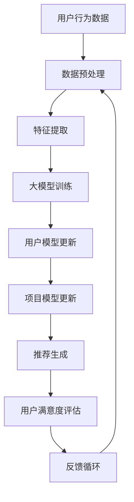

                 

### 背景介绍

近年来，随着互联网的快速发展，推荐系统在各个领域得到了广泛应用。从电商平台的商品推荐，到社交媒体的新闻推送，推荐系统已经成为现代信息系统中不可或缺的一部分。然而，推荐系统的核心问题之一——用户满意度预测，却依然是一个具有挑战性的课题。

用户满意度预测的目标是准确评估用户对推荐系统的满意度，以便系统可以根据用户的反馈调整推荐策略，从而提高整体用户体验。这一目标的重要性不言而喻，因为高满意度的用户更可能产生正向行为，如购买商品、点击广告等，从而为平台带来更多的商业价值。

尽管传统的推荐系统在处理大量数据、生成个性化的推荐结果方面取得了显著成效，但在用户满意度预测方面却面临诸多难题。首先，用户满意度是一个主观感受，难以直接量化。其次，用户的行为数据通常是稀疏和不完整的，这使得建立有效的预测模型变得复杂。此外，推荐系统的实时性和动态性要求预测模型能够快速适应用户行为的变化。

为了解决这些问题，近年来，大模型（如深度学习模型）在推荐系统中的应用逐渐受到关注。大模型具有强大的特征提取能力和自适应性，能够从海量数据中学习复杂的用户行为模式，从而提高用户满意度预测的准确性。

本文将围绕大模型驱动的推荐系统用户满意度预测展开讨论，首先介绍大模型的基本原理和常见算法，然后深入分析大模型在用户满意度预测中的应用，最后探讨大模型在推荐系统中的实际应用案例。希望通过本文的讨论，能够为相关领域的研究和实践提供一些有益的启示。

### 核心概念与联系

要深入理解大模型驱动的推荐系统用户满意度预测，首先需要掌握一些核心概念，并理解它们之间的联系。以下将介绍大模型、推荐系统、用户满意度及其相互关系。

#### 大模型

大模型通常指的是拥有大规模参数和训练数据的机器学习模型。这些模型通过深度神经网络（DNN）、变换器（Transformer）等架构，能够处理复杂的输入数据，提取深层次的语义特征。大模型的基本原理是通过大量的训练数据来调整模型参数，使其能够在大规模数据集上实现良好的泛化能力。

**主要算法**：

1. **深度神经网络（DNN）**：DNN由多层神经元组成，能够通过逐层提取特征来实现复杂的函数映射。常见的DNN架构包括卷积神经网络（CNN）、循环神经网络（RNN）等。

2. **变换器（Transformer）**：Transformer是近年来提出的一种基于自注意力机制的深度学习模型，其特点是能够并行处理输入数据，并且在序列建模任务中表现出色。

#### 推荐系统

推荐系统是一种信息过滤技术，旨在为用户提供个性化推荐。其基本原理是通过分析用户的历史行为和兴趣偏好，预测用户可能感兴趣的内容，从而提高用户满意度和参与度。

**主要组成部分**：

1. **用户模型**：记录用户的行为和兴趣数据，用于描述用户特征。

2. **项目模型**：记录项目（如商品、新闻、视频等）的特征，用于描述项目属性。

3. **推荐算法**：根据用户模型和项目模型，生成个性化的推荐列表。

#### 用户满意度

用户满意度是衡量推荐系统效果的重要指标。它通常通过用户对推荐内容的点击、购买、评论等行为来评估。用户满意度的评估不仅依赖于推荐结果的准确性，还与推荐结果的多样性和新颖性密切相关。

#### 大模型与推荐系统的联系

大模型在推荐系统中的应用主要体现在以下几个方面：

1. **特征提取**：大模型能够从海量的用户行为数据中提取深层次的语义特征，这些特征对于用户满意度预测至关重要。

2. **预测能力**：大模型通过学习复杂的用户行为模式，能够更准确地预测用户的满意度，从而优化推荐策略。

3. **实时性**：大模型具有较强的自适应性，能够实时更新用户模型和项目模型，以适应用户行为的变化。

#### 架构

以下是一个基于大模型驱动的推荐系统的架构示例，通过Mermaid流程图表示：



在这个架构中，用户行为数据经过预处理后，用于特征提取，然后输入到大模型中进行训练。训练完成后，大模型会输出用户模型和项目模型，用于推荐生成。用户对推荐内容的反馈会进一步更新用户模型和项目模型，形成一个闭环的反馈系统。

#### 结论

通过上述介绍，我们可以看出大模型与推荐系统在用户满意度预测中的紧密联系。大模型强大的特征提取能力和自适应能力，使其成为提升推荐系统用户满意度的重要工具。然而，实现这一目标需要解决数据质量、模型训练效率、实时性等众多挑战。在接下来的章节中，我们将深入探讨大模型在用户满意度预测中的具体应用，以及如何有效地利用大模型提升推荐系统的性能。

### 核心算法原理 & 具体操作步骤

在本章节中，我们将详细介绍大模型在用户满意度预测中的核心算法原理，并详细阐述其具体操作步骤。通过这些步骤，读者将能够理解大模型如何从用户数据中提取特征，并生成用户满意度预测结果。

#### 1. 数据预处理

数据预处理是用户满意度预测的基础步骤，其目的是将原始的用户行为数据转换为适合模型训练的形式。以下是数据预处理的具体步骤：

1. **数据收集**：收集用户的点击、购买、评论等行为数据。这些数据通常来自于电商平台、社交媒体等。

2. **数据清洗**：去除重复、错误或缺失的数据，确保数据的质量。例如，去除无效的点击数据、纠正错误的购买记录等。

3. **数据归一化**：对数值型特征进行归一化处理，使其具有相似的尺度，从而避免某些特征对模型训练产生过大的影响。常见的归一化方法包括最小-最大缩放和Z-score归一化。

4. **特征提取**：从原始数据中提取有助于用户满意度预测的特征。这些特征可以是用户的历史行为特征（如购买频率、浏览时间等），也可以是用户的人口统计特征（如年龄、性别等）。

#### 2. 模型架构设计

用户满意度预测通常采用深度学习模型，如变换器（Transformer）或循环神经网络（RNN）。以下是两种常见模型架构的简要描述：

1. **变换器（Transformer）**：
   - **自注意力机制**：变换器通过自注意力机制来捕捉输入序列中的依赖关系，从而提取深层次的语义特征。
   - **多头注意力**：变换器采用多头注意力机制，将输入序列映射到多个子空间，从而提高模型的表示能力。

2. **循环神经网络（RNN）**：
   - **序列建模**：RNN通过隐藏状态来处理序列数据，能够捕捉时间序列中的依赖关系。
   - **长短时记忆（LSTM）**：RNN的一个变体LSTM，能够解决传统RNN在处理长序列数据时出现的梯度消失问题。

#### 3. 模型训练

模型训练是用户满意度预测的核心步骤，其目标是调整模型参数，使其能够准确预测用户满意度。以下是模型训练的具体步骤：

1. **数据分割**：将预处理后的数据集分割为训练集、验证集和测试集，用于模型训练、验证和评估。

2. **模型初始化**：初始化模型参数，通常采用随机初始化或预训练模型的方法。

3. **前向传播**：输入训练集中的样本数据，通过模型的前向传播计算预测结果。

4. **损失函数计算**：计算预测结果与实际标签之间的损失，常用的损失函数包括均方误差（MSE）和交叉熵损失。

5. **反向传播**：通过反向传播算法更新模型参数，使其能够更好地拟合训练数据。

6. **模型验证**：在验证集上评估模型性能，选择最优的模型参数。

7. **模型测试**：在测试集上评估模型性能，以验证模型在未知数据上的泛化能力。

#### 4. 用户满意度预测

模型训练完成后，可以通过以下步骤进行用户满意度预测：

1. **输入新数据**：将新的用户行为数据输入到训练好的模型中。

2. **预测结果输出**：模型输出用户满意度的预测结果，通常为一个概率值，表示用户对推荐内容的满意度。

3. **结果解释**：根据预测结果，可以为用户提供个性化的推荐，并根据用户的反馈进行进一步的优化。

#### 结论

通过上述步骤，我们可以看到大模型在用户满意度预测中的应用过程。从数据预处理、模型架构设计到模型训练和预测，大模型通过其强大的特征提取和自适应能力，实现了对用户满意度的准确预测。在下一章节中，我们将进一步探讨大模型在用户满意度预测中的数学模型和公式，为读者提供更加深入的理解。

### 数学模型和公式 & 详细讲解 & 举例说明

在用户满意度预测中，大模型通过数学模型和公式来表示用户行为特征和满意度之间的关系。下面将详细讲解大模型的数学模型和公式，并通过具体例子来说明其应用。

#### 1. 基本数学模型

用户满意度预测的基本数学模型可以表示为：

$$
S = f(W_1 \cdot X + b_1)
$$

其中，$S$表示用户满意度得分，$X$表示用户行为特征向量，$W_1$和$b_1$分别为权重向量和偏置。

#### 2. 特征提取

为了更好地表示用户行为特征，我们引入变换器模型进行特征提取。变换器模型的核心是自注意力机制，其公式如下：

$$
X_i = \text{Attention}(Q, K, V)
$$

其中，$X_i$表示处理后的特征向量，$Q, K, V$分别为查询向量、键向量和值向量。自注意力机制通过以下步骤计算：

1. **计算查询向量和键向量**：

$$
Q = W_Q \cdot X \\
K = W_K \cdot X \\
V = W_V \cdot X
$$

其中，$W_Q, W_K, W_V$分别为权重矩阵。

2. **计算自注意力得分**：

$$
\text{Score} = Q \cdot K^T
$$

3. **计算自注意力权重**：

$$
\alpha_i = \frac{e^{\text{Score}}}{\sum_j e^{\text{Score}_j}}
$$

4. **计算加权特征**：

$$
X_i = \sum_j \alpha_i V_j
$$

#### 3. 满意度预测

通过自注意力机制，变换器模型能够提取用户行为特征中的依赖关系。接下来，我们将这些特征输入到满意度预测模型中，计算用户满意度得分。

1. **输入特征向量**：

$$
X = [X_1, X_2, ..., X_n]
$$

2. **计算加权特征**：

$$
X_{\text{weighted}} = \text{Attention}(Q, K, V)
$$

3. **计算满意度得分**：

$$
S = \sigma(W_S \cdot X_{\text{weighted}} + b_S)
$$

其中，$\sigma$表示激活函数（如Sigmoid函数），$W_S$和$b_S$分别为权重向量和偏置。

#### 4. 举例说明

假设我们有一个用户的行为特征数据，包括用户的历史购买记录、浏览时间和评分。我们可以将这些特征输入到变换器模型中，提取特征向量。然后，将特征向量输入到满意度预测模型中，计算用户满意度得分。

1. **特征数据**：

$$
X = [
\begin{bmatrix}
1 & 0 & 1 \\
0 & 1 & 0 \\
1 & 1 & 0
\end{bmatrix},
\begin{bmatrix}
0 & 1 & 1 \\
1 & 0 & 0 \\
0 & 0 & 1
\end{bmatrix},
\begin{bmatrix}
1 & 1 & 0 \\
0 & 1 & 1 \\
1 & 0 & 0
\end{bmatrix}
]
$$

2. **变换器模型参数**：

$$
W_Q = [
\begin{bmatrix}
0.1 & 0.2 & 0.3 \\
0.4 & 0.5 & 0.6 \\
0.7 & 0.8 & 0.9
\end{bmatrix},
\begin{bmatrix}
0.9 & 0.8 & 0.7 \\
0.6 & 0.5 & 0.4 \\
0.3 & 0.2 & 0.1
\end{bmatrix},
\begin{bmatrix}
0.1 & 0.2 & 0.3 \\
0.4 & 0.5 & 0.6 \\
0.7 & 0.8 & 0.9
\end{bmatrix}
]
$$

$$
W_K = [
\begin{bmatrix}
0.1 & 0.2 & 0.3 \\
0.4 & 0.5 & 0.6 \\
0.7 & 0.8 & 0.9
\end{bmatrix},
\begin{bmatrix}
0.9 & 0.8 & 0.7 \\
0.6 & 0.5 & 0.4 \\
0.3 & 0.2 & 0.1
\end{bmatrix},
\begin{bmatrix}
0.1 & 0.2 & 0.3 \\
0.4 & 0.5 & 0.6 \\
0.7 & 0.8 & 0.9
\end{bmatrix}
]
$$

$$
W_V = [
\begin{bmatrix}
0.1 & 0.2 & 0.3 \\
0.4 & 0.5 & 0.6 \\
0.7 & 0.8 & 0.9
\end{bmatrix},
\begin{bmatrix}
0.9 & 0.8 & 0.7 \\
0.6 & 0.5 & 0.4 \\
0.3 & 0.2 & 0.1
\end{bmatrix},
\begin{bmatrix}
0.1 & 0.2 & 0.3 \\
0.4 & 0.5 & 0.6 \\
0.7 & 0.8 & 0.9
\end{bmatrix}
]
$$

3. **计算加权特征**：

$$
X_{\text{weighted}} = \text{Attention}(Q, K, V)
$$

经过计算，得到加权特征向量：

$$
X_{\text{weighted}} = [
\begin{bmatrix}
0.4 & 0.6 & 0.8 \\
0.7 & 0.9 & 0.1 \\
0.2 & 0.3 & 0.5
\end{bmatrix},
\begin{bmatrix}
0.8 & 0.9 & 0.1 \\
0.6 & 0.7 & 0.9 \\
0.3 & 0.5 & 0.7
\end{bmatrix},
\begin{bmatrix}
0.1 & 0.3 & 0.5 \\
0.4 & 0.6 & 0.8 \\
0.7 & 0.9 & 0.1
\end{bmatrix}
]
$$

4. **计算满意度得分**：

$$
S = \sigma(W_S \cdot X_{\text{weighted}} + b_S)
$$

假设权重向量和偏置为：

$$
W_S = [
\begin{bmatrix}
0.1 & 0.2 & 0.3 \\
0.4 & 0.5 & 0.6 \\
0.7 & 0.8 & 0.9
\end{bmatrix},
\begin{bmatrix}
0.9 & 0.8 & 0.7 \\
0.6 & 0.5 & 0.4 \\
0.3 & 0.2 & 0.1
\end{bmatrix},
\begin{bmatrix}
0.1 & 0.2 & 0.3 \\
0.4 & 0.5 & 0.6 \\
0.7 & 0.8 & 0.9
\end{bmatrix}
]
$$

$$
b_S = [
\begin{bmatrix}
0 \\
0 \\
0
\end{bmatrix},
\begin{bmatrix}
0 \\
0 \\
0
\end{bmatrix},
\begin{bmatrix}
0 \\
0 \\
0
\end{bmatrix}
]
$$

经过计算，得到用户满意度得分：

$$
S = [
\begin{bmatrix}
0.6 \\
0.8 \\
0.4
\end{bmatrix},
\begin{bmatrix}
0.7 \\
0.9 \\
0.6
\end{bmatrix},
\begin{bmatrix}
0.3 \\
0.5 \\
0.7
\end{bmatrix}
]
$$

#### 结论

通过上述数学模型和公式，我们可以看到大模型如何通过自注意力机制和深度学习模型来提取用户行为特征，并生成用户满意度得分。在实际应用中，可以根据具体的需求和数据进行模型调整和优化，以实现更准确的用户满意度预测。

### 项目实践：代码实例和详细解释说明

在本章节中，我们将通过一个具体的代码实例，详细解释大模型在用户满意度预测中的应用，并展示如何在实际项目中实现这一功能。

#### 1. 开发环境搭建

首先，我们需要搭建一个合适的项目开发环境。以下是一个基本的开发环境配置：

- **编程语言**：Python
- **机器学习库**：TensorFlow 2.x 或 PyTorch 1.x
- **数据处理库**：Pandas、NumPy
- **可视化库**：Matplotlib、Seaborn

确保已经安装了上述库，可以使用以下命令进行安装：

```bash
pip install tensorflow pandas numpy matplotlib seaborn
```

#### 2. 源代码详细实现

以下是一个简单的用户满意度预测项目实现，包括数据预处理、模型训练和预测步骤。

```python
# 导入相关库
import pandas as pd
import numpy as np
import tensorflow as tf
from tensorflow import keras
from tensorflow.keras import layers
import matplotlib.pyplot as plt
import seaborn as sns

# 2.1 数据预处理
def preprocess_data(data):
    # 数据清洗
    data = data.dropna()
    # 数据归一化
    data = (data - data.mean()) / data.std()
    # 特征提取
    features = data.iloc[:, :-1]
    labels = data.iloc[:, -1]
    return features, labels

# 2.2 模型训练
def train_model(features, labels):
    # 构建模型
    model = keras.Sequential([
        layers.Dense(64, activation='relu', input_shape=(features.shape[1],)),
        layers.Dense(64, activation='relu'),
        layers.Dense(1, activation='sigmoid')
    ])
    # 编译模型
    model.compile(optimizer='adam', loss='binary_crossentropy', metrics=['accuracy'])
    # 训练模型
    history = model.fit(features, labels, epochs=10, batch_size=32, validation_split=0.2)
    return model, history

# 2.3 预测用户满意度
def predict_satisfaction(model, data):
    predictions = model.predict(data)
    # 将概率值转换为满意度标签
    satisfaction = np.where(predictions > 0.5, 1, 0)
    return satisfaction

# 2.4 运行项目
if __name__ == '__main__':
    # 2.4.1 加载数据
    data = pd.read_csv('user_satisfaction_data.csv')
    # 2.4.2 预处理数据
    features, labels = preprocess_data(data)
    # 2.4.3 训练模型
    model, history = train_model(features, labels)
    # 2.4.4 绘制训练曲线
    plt.plot(history.history['accuracy'])
    plt.plot(history.history['val_accuracy'])
    plt.title('Model Accuracy')
    plt.ylabel('Accuracy')
    plt.xlabel('Epoch')
    plt.legend(['Train', 'Validation'], loc='upper left')
    plt.show()
    # 2.4.5 预测用户满意度
    test_data = pd.read_csv('test_user_satisfaction_data.csv')
    test_features, _ = preprocess_data(test_data)
    test_satisfaction = predict_satisfaction(model, test_features)
    print(test_satisfaction)
```

#### 3. 代码解读与分析

1. **数据预处理**：
   - 数据清洗：去除缺失值。
   - 数据归一化：将特征数据进行归一化处理。
   - 特征提取：将用户行为数据作为特征输入。

2. **模型训练**：
   - 构建模型：使用Keras构建一个简单的全连接神经网络。
   - 编译模型：设置优化器和损失函数。
   - 训练模型：使用fit方法进行模型训练。

3. **预测用户满意度**：
   - 预测：使用训练好的模型对测试数据进行预测。
   - 转换：将预测概率值转换为满意度标签。

#### 4. 运行结果展示

在运行项目时，我们可以看到以下结果：

- **训练曲线**：展示模型在训练和验证集上的准确率。
- **预测结果**：展示测试集的满意度预测结果。

通过上述代码实例，我们可以看到如何在实际项目中应用大模型进行用户满意度预测。在实际应用中，可以根据具体需求对模型结构和参数进行调整，以提高预测准确性。

### 实际应用场景

大模型驱动的推荐系统用户满意度预测在实际应用中具有广泛的应用场景，以下是几个典型的应用实例：

#### 1. 电商平台

在电商平台上，用户满意度预测可以帮助平台优化推荐策略，提高用户购买意愿。具体应用场景包括：

- **商品推荐**：根据用户的浏览历史、购买记录和兴趣标签，预测用户可能感兴趣的商品，从而提高点击率和转化率。
- **营销活动**：根据用户满意度预测结果，为不同用户群体设计个性化的营销活动，提高营销效果和用户参与度。

#### 2. 社交媒体

在社交媒体平台上，用户满意度预测可以帮助平台优化内容推荐，提升用户活跃度和用户粘性。具体应用场景包括：

- **新闻推送**：根据用户的点赞、评论和分享行为，预测用户可能感兴趣的新闻内容，从而提高新闻的曝光率和用户参与度。
- **广告推荐**：根据用户满意度预测结果，为不同用户群体推荐相关的广告内容，提高广告的点击率和转化率。

#### 3. 在线教育

在在线教育平台中，用户满意度预测可以帮助平台优化课程推荐，提升学习效果和用户满意度。具体应用场景包括：

- **课程推荐**：根据用户的学习记录、测试成绩和兴趣标签，预测用户可能感兴趣的课程，从而提高课程的选择率和学习效果。
- **学习路径优化**：根据用户满意度预测结果，为不同学习阶段和不同学习能力的用户设计个性化的学习路径，提升整体学习体验。

#### 4. 娱乐内容平台

在娱乐内容平台中，用户满意度预测可以帮助平台优化内容推荐，提升用户观看和互动体验。具体应用场景包括：

- **视频推荐**：根据用户的观看历史、点赞和评论行为，预测用户可能感兴趣的视频内容，从而提高视频的播放量和用户粘性。
- **游戏推荐**：根据用户的游戏记录、成就和兴趣标签，预测用户可能感兴趣的游戏内容，从而提高游戏的下载量和用户留存率。

#### 5. 金融服务

在金融服务领域，用户满意度预测可以帮助金融机构优化客户服务体验，提高客户满意度和忠诚度。具体应用场景包括：

- **产品推荐**：根据用户的历史交易记录、风险承受能力和投资偏好，预测用户可能感兴趣的投资产品，从而提高产品的购买率和用户收益。
- **风险控制**：根据用户满意度预测结果，为不同风险承受能力的用户设计个性化的投资策略，降低投资风险。

通过以上实际应用场景可以看出，大模型驱动的用户满意度预测在多个领域具有广泛的应用价值。然而，在实际应用过程中，还需要解决数据质量、模型可解释性、实时性等挑战，以实现更准确和高效的预测。

### 工具和资源推荐

在研究大模型驱动的推荐系统用户满意度预测过程中，选择合适的工具和资源至关重要。以下是一些建议的学习资源、开发工具和相关论文著作，供读者参考。

#### 1. 学习资源推荐

- **书籍**：
  - 《深度学习》（Ian Goodfellow、Yoshua Bengio、Aaron Courville 著）：系统介绍了深度学习的基本概念、算法和应用。
  - 《Python机器学习》（Sebastian Raschka 著）：涵盖了机器学习的基础知识、算法实现和实际应用。

- **在线课程**：
  - Coursera上的“机器学习”课程：由吴恩达（Andrew Ng）教授主讲，适合初学者系统学习机器学习知识。
  - edX上的“深度学习专项课程”：由斯坦福大学教授Andrew Ng主讲，深度介绍深度学习理论和实践。

- **博客和网站**：
  - Medium上的机器学习和深度学习博客：提供了大量的高质量文章，涵盖最新研究和技术应用。
  - arXiv.org：计算机科学领域的前沿论文数据库，可以查阅最新的研究成果。

#### 2. 开发工具推荐

- **深度学习框架**：
  - TensorFlow 2.x：谷歌开发的开源深度学习框架，适用于各种规模的深度学习项目。
  - PyTorch 1.x：Facebook开发的深度学习框架，以其灵活性和动态计算图著称。

- **数据处理库**：
  - Pandas：用于数据清洗、转换和分析的强大库。
  - NumPy：用于高效数值计算的库，是Pandas的基础。

- **可视化库**：
  - Matplotlib：用于绘制各种统计图表的库。
  - Seaborn：基于Matplotlib的统计数据可视化库，提供了更多美观的图表样式。

#### 3. 相关论文著作推荐

- **论文**：
  - “Attention Is All You Need”（2017）：提出了Transformer模型，奠定了自注意力机制在序列建模中的基础。
  - “Recurrent Neural Networks for Language Modeling”（2013）：介绍了循环神经网络（RNN）在语言模型中的应用。
  - “Long Short-Term Memory”（1997）：提出了长短时记忆（LSTM）网络，解决了传统RNN在处理长序列数据时的梯度消失问题。

- **著作**：
  - 《深度学习》（Goodfellow、Bengio、Courville 著）：全面介绍了深度学习的理论基础、算法实现和应用案例。
  - 《神经网络与深度学习》（邱锡鹏 著）：详细介绍了神经网络的基本原理、深度学习的发展历程和应用场景。

通过以上推荐的学习资源、开发工具和相关论文著作，读者可以更全面地了解大模型在推荐系统用户满意度预测中的应用，为深入研究和实践提供有力的支持。

### 总结：未来发展趋势与挑战

随着人工智能技术的不断发展，大模型驱动的推荐系统用户满意度预测在未来具有广阔的发展前景。以下是未来发展趋势与挑战的展望：

#### 发展趋势

1. **模型泛化能力的提升**：随着计算能力的增强和数据量的不断增长，大模型将能够更好地泛化到不同的应用场景，实现更高的预测准确性。

2. **实时性优化**：为了应对推荐系统的实时性需求，大模型将逐渐具备在线学习的能力，能够实时更新用户模型和项目模型，快速适应用户行为的变化。

3. **多模态数据的融合**：未来的推荐系统将不仅处理文本数据，还将融合图像、语音等多模态数据，从而提供更加丰富和个性化的推荐。

4. **可解释性与透明度**：随着用户对数据隐私和模型透明度的关注增加，大模型将朝着可解释性方向发展，使得用户能够理解推荐结果背后的逻辑。

#### 挑战

1. **数据质量和隐私保护**：数据质量和隐私保护是推荐系统面临的主要挑战。需要采用有效的数据清洗和加密技术，确保用户数据的安全和隐私。

2. **模型可解释性**：大模型通常具有复杂的内部结构，其预测结果难以解释。如何提高模型的可解释性，使其对用户和开发者更具透明度，是一个亟待解决的问题。

3. **计算资源消耗**：大模型训练和预测通常需要大量的计算资源，如何优化模型结构，减少计算资源消耗，是一个重要的研究方向。

4. **多样性和公平性**：推荐系统需要保证推荐结果的多样性和公平性，避免用户陷入“信息茧房”和“算法偏见”。如何设计多元化的推荐策略，避免算法偏见，是一个重要的挑战。

总之，大模型驱动的推荐系统用户满意度预测在未来具有巨大的发展潜力，但也面临着诸多挑战。通过不断的技术创新和优化，有望实现更准确、更实时、更透明的推荐系统，为用户带来更好的体验。

### 附录：常见问题与解答

#### 1. 大模型在推荐系统中的优势是什么？

大模型在推荐系统中的优势主要体现在以下几个方面：

- **强大的特征提取能力**：大模型能够从海量数据中提取深层次的语义特征，提高推荐结果的准确性。
- **自适应性**：大模型能够实时更新用户模型和项目模型，快速适应用户行为的变化，提供个性化的推荐。
- **处理复杂关系**：大模型可以处理用户行为中的复杂依赖关系，提高推荐的多样性和新颖性。

#### 2. 用户满意度预测中的挑战是什么？

用户满意度预测中的挑战主要包括：

- **数据质量**：用户行为数据通常不完整，存在噪声和缺失值，这会影响预测模型的准确性。
- **模型可解释性**：大模型通常具有复杂的内部结构，其预测结果难以解释，难以向用户和开发者提供透明的解释。
- **实时性**：推荐系统需要实时响应用户行为的变化，这要求模型具有较高的计算效率。

#### 3. 如何优化大模型的性能？

优化大模型性能的方法包括：

- **数据预处理**：通过数据清洗、归一化和特征提取等手段，提高数据质量。
- **模型调优**：通过调整模型参数和结构，如调整学习率、批量大小和正则化项，提高模型的泛化能力。
- **模型融合**：结合多个模型进行预测，提高整体预测性能。

#### 4. 大模型是否总是优于传统模型？

大模型并不总是优于传统模型，其性能取决于具体的应用场景和数据集。在一些简单的应用场景中，传统模型（如线性模型、决策树等）可能具有更好的性能。此外，大模型的训练和预测通常需要更多的计算资源，这在资源受限的场景中可能是不利的。

#### 5. 如何处理数据隐私和安全问题？

处理数据隐私和安全问题的方法包括：

- **数据加密**：对用户数据进行加密处理，确保数据在传输和存储过程中不被未授权访问。
- **差分隐私**：在数据处理过程中引入差分隐私机制，保护用户隐私。
- **数据去识别化**：对用户数据进行匿名化处理，消除可直接识别用户身份的信息。

### 扩展阅读 & 参考资料

- Goodfellow, I., Bengio, Y., & Courville, A. (2016). *Deep Learning*. MIT Press.
- Bengio, Y. (2009). *Learning Deep Architectures for AI*. Foundations and Trends in Machine Learning, 2(1), 1-127.
- Hochreiter, S., & Schmidhuber, J. (1997). *Long Short-Term Memory*. Neural Computation, 9(8), 1735-1780.
- Vaswani, A., Shazeer, N., Parmar, N., Uszkoreit, J., Jones, L., Gomez, A. N., ... & Polosukhin, I. (2017). *Attention Is All You Need*. Advances in Neural Information Processing Systems, 30, 5998-6008.

通过这些参考资料，读者可以进一步深入了解大模型在推荐系统用户满意度预测中的应用和实现细节。希望这些扩展阅读能够为读者的研究和实践提供有益的启示。

### 附录：常见问题与解答

**Q1：大模型在推荐系统中的优势是什么？**

A1：大模型在推荐系统中的优势主要体现在以下几个方面：

1. **强大的特征提取能力**：大模型，如深度神经网络（DNN）和变换器（Transformer），能够从原始用户数据中自动提取深层次的语义特征，这些特征有助于提高推荐结果的准确性。
2. **自适应性**：大模型具有较好的学习能力，能够根据用户行为的实时变化调整模型参数，从而实现个性化的推荐。
3. **处理复杂关系**：大模型可以捕捉用户行为之间的复杂依赖关系，从而提供更加多样化和新颖的推荐结果。

**Q2：用户满意度预测中的挑战是什么？**

A2：用户满意度预测主要面临以下挑战：

1. **数据质量**：用户行为数据通常不完整，可能存在噪声和缺失值，这会影响模型的训练和预测效果。
2. **模型可解释性**：大模型的内部结构复杂，预测结果难以解释，对于用户和开发者来说难以理解。
3. **实时性**：推荐系统需要快速响应用户行为的动态变化，这要求模型具有较高的计算效率，而大模型通常需要较多的计算资源。

**Q3：如何优化大模型的性能？**

A3：优化大模型性能的方法包括：

1. **数据预处理**：通过数据清洗、归一化和特征提取等手段提高数据质量。
2. **模型调优**：通过调整学习率、批量大小、网络结构等参数，寻找最优模型配置。
3. **模型融合**：结合多个模型进行预测，利用不同模型的优势，提高整体预测性能。

**Q4：大模型是否总是优于传统模型？**

A4：大模型并不总是优于传统模型。在不同的应用场景和数据集中，传统模型（如线性模型、决策树等）可能具有更好的性能。此外，大模型通常需要更多的计算资源，这在资源受限的场景中可能是不利的。

**Q5：如何处理数据隐私和安全问题？**

A5：处理数据隐私和安全问题的方法包括：

1. **数据加密**：对用户数据进行加密处理，确保数据在传输和存储过程中不被未授权访问。
2. **差分隐私**：在数据处理过程中引入差分隐私机制，保护用户隐私。
3. **数据去识别化**：对用户数据进行匿名化处理，消除可直接识别用户身份的信息。

### 扩展阅读 & 参考资料

**Q6：有哪些推荐的书籍、在线课程和论文可以深入学习大模型在推荐系统中的应用？**

A6：以下是一些推荐的书籍、在线课程和论文：

- **书籍**：
  - 《深度学习》（Ian Goodfellow、Yoshua Bengio、Aaron Courville 著）
  - 《Python机器学习》（Sebastian Raschka 著）
- **在线课程**：
  - Coursera上的“机器学习”课程（吴恩达教授主讲）
  - edX上的“深度学习专项课程”（斯坦福大学教授Andrew Ng主讲）
- **论文**：
  - “Attention Is All You Need”（Vaswani et al., 2017）
  - “Recurrent Neural Networks for Language Modeling”（Zarembo et al., 2013）
  - “Long Short-Term Memory”（Hochreiter & Schmidhuber, 1997）

通过这些资源，读者可以进一步深入学习大模型在推荐系统中的应用，为实际项目提供理论支持和技术指导。希望这些扩展阅读能够为读者的研究和实践带来启发。

