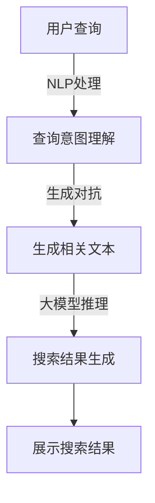
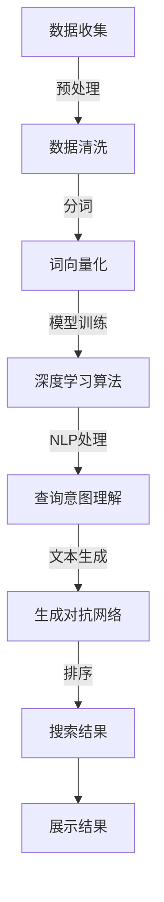

                 

### 背景介绍

随着互联网的飞速发展，数据量呈现指数级增长，如何高效地处理和检索这些海量数据，已经成为当前信息技术领域面临的一项重大挑战。搜索引擎作为互联网的基础设施，其性能直接关系到用户体验。传统搜索引擎主要依赖关键词匹配和文本检索技术，然而，随着用户需求的日益多样化和复杂化，这种基于关键词检索的方式已显得力不从心。于是，大模型驱动的智能搜索引擎应运而生。

大模型驱动的智能搜索引擎利用深度学习技术，尤其是近年来迅猛发展的自然语言处理（NLP）和生成对抗网络（GAN）等算法，对海量的文本数据进行建模，从而实现更智能、更精准的搜索结果。与传统搜索引擎相比，大模型驱动的搜索引擎不仅能够理解用户的查询意图，还能通过上下文关系提供更为相关和个性化的搜索结果。

本文将深入探讨大模型驱动的智能搜索引擎的设计原理，包括其核心概念、算法原理、数学模型、具体实现和实际应用场景。通过逐步分析和推理，我们将揭示这一技术背后的本质和魅力。

### 核心概念与联系

要理解大模型驱动的智能搜索引擎，我们首先需要明确几个核心概念及其相互联系。以下是这些概念及其关系的详细解释：

#### 1. 深度学习与神经网络

深度学习是机器学习的一个分支，它通过构建多层神经网络来对数据进行学习和预测。神经网络由大量的节点（或称为神经元）组成，每个节点接收来自其他节点的输入信号，并产生输出信号。通过多层节点之间的连接和激活函数，神经网络能够自动提取数据中的特征，从而实现复杂的任务。

#### 2. 自然语言处理（NLP）

自然语言处理是人工智能的一个重要分支，致力于使计算机能够理解和生成人类语言。NLP的核心目标包括文本分类、情感分析、命名实体识别、机器翻译等。在大模型驱动的智能搜索引擎中，NLP技术用于理解用户的查询意图和搜索上下文，从而提供更精准的搜索结果。

#### 3. 生成对抗网络（GAN）

生成对抗网络是一种深度学习模型，由生成器和判别器两个网络组成。生成器旨在生成与真实数据相似的数据，而判别器则负责区分真实数据和生成数据。GAN通过两个网络的对抗训练，能够生成高质量的数据，这些数据在许多应用中都具有重要的价值。

#### 4. 大模型与搜索相关性

大模型是指拥有海量参数的深度学习模型，如GPT-3、BERT等。这些模型通过对大量文本数据进行训练，能够捕捉到复杂的关系和语义信息。在大模型驱动的智能搜索引擎中，这些大模型用于理解和生成与搜索意图相关的文本，从而提高搜索结果的准确性和个性化程度。

#### Mermaid 流程图

以下是一个描述大模型驱动的智能搜索引擎核心概念的Mermaid流程图：



**流程说明：**
1. 用户输入查询。
2. 查询通过NLP处理，理解用户的意图。
3. 利用生成对抗网络，生成与查询意图相关的文本。
4. 大模型对生成的文本进行推理，生成搜索结果。
5. 搜索结果展示给用户。

通过上述流程图，我们可以清晰地看到大模型驱动的智能搜索引擎是如何从用户查询到最终搜索结果的全过程。

### 核心算法原理 & 具体操作步骤

在大模型驱动的智能搜索引擎中，核心算法主要基于深度学习和自然语言处理技术。以下将详细解释这些算法的原理以及具体操作步骤。

#### 1. 深度学习算法原理

深度学习算法通过构建多层神经网络，对输入数据进行特征提取和学习。以下是深度学习算法的主要步骤：

1. **数据预处理**：将原始数据转换为适合神经网络处理的形式。通常包括数据清洗、归一化、分词、词向量化等操作。
2. **模型构建**：设计神经网络结构，包括输入层、隐藏层和输出层。常用的神经网络结构有卷积神经网络（CNN）、循环神经网络（RNN）、长短时记忆网络（LSTM）等。
3. **训练过程**：通过反向传播算法，将输入数据输入到神经网络中，计算输出结果，并计算损失函数值。然后通过梯度下降等方法，更新网络参数，降低损失函数值。
4. **模型评估**：使用验证集和测试集，评估模型的性能。常用的评估指标包括准确率、召回率、F1值等。

#### 2. 自然语言处理算法原理

自然语言处理算法主要用于理解和生成人类语言。以下是NLP算法的主要步骤：

1. **词向量化**：将文本中的单词转换为向量表示。常用的词向量化方法有Word2Vec、GloVe等。
2. **分词**：将文本切分成单词或短语。常用的分词方法有基于词典的分词、基于统计的分词等。
3. **语法解析**：分析文本的语法结构，提取出句子中的主语、谓语、宾语等成分。常用的语法分析方法有依存句法分析和语义角色标注等。
4. **语义理解**：理解文本中的语义信息，包括实体识别、关系提取、情感分析等。常用的语义理解方法有注意力机制、Transformer等。

#### 3. 具体操作步骤

以下是构建大模型驱动的智能搜索引擎的具体操作步骤：

1. **数据收集**：收集海量的文本数据，包括网页、书籍、新闻、论坛等。
2. **数据预处理**：对收集到的文本数据进行清洗、去重、分词、词向量化等处理。
3. **模型训练**：使用深度学习算法和NLP技术，对预处理后的文本数据进行训练，构建大模型。
4. **查询处理**：
   - 用户输入查询。
   - 查询通过NLP处理，理解用户的意图。
   - 利用大模型生成与查询意图相关的文本。
   - 对生成的文本进行排序，选出最相关的搜索结果。
5. **搜索结果展示**：将搜索结果展示给用户。

#### Mermaid 流程图

以下是描述大模型驱动的智能搜索引擎核心算法原理的Mermaid流程图：



**流程说明：**
1. 数据收集。
2. 数据预处理。
3. 使用深度学习算法和NLP技术进行模型训练。
4. 处理用户查询，理解查询意图。
5. 利用生成对抗网络生成相关文本。
6. 对生成的文本进行排序。
7. 展示搜索结果。

通过上述具体操作步骤，我们可以清楚地看到如何构建一个大模型驱动的智能搜索引擎，并实现从用户查询到搜索结果的全过程。

### 数学模型和公式 & 详细讲解 & 举例说明

在大模型驱动的智能搜索引擎中，数学模型和公式扮演着至关重要的角色。以下是这些数学模型和公式的详细讲解以及具体示例。

#### 1. 深度学习中的损失函数

深度学习中的损失函数用于衡量模型的预测值与真实值之间的差异。常用的损失函数包括均方误差（MSE）、交叉熵损失等。

- **均方误差（MSE）**：
  $$MSE = \frac{1}{n}\sum_{i=1}^{n}(y_i - \hat{y}_i)^2$$
  其中，$y_i$ 为真实值，$\hat{y}_i$ 为预测值，$n$ 为样本数量。

- **交叉熵损失**：
  $$H(y, \hat{y}) = -\sum_{i=1}^{n}y_i \log(\hat{y}_i)$$
  其中，$y$ 为真实标签的概率分布，$\hat{y}$ 为预测标签的概率分布。

#### 2. 自然语言处理中的词向量化

词向量化是将文本中的单词转换为向量表示的过程。常用的词向量化方法有Word2Vec和GloVe。

- **Word2Vec中的损失函数**：
  $$L(\theta) = \sum_{i=1}^{n}\sum_{j=1}^{k}f_j(x_i) \cdot (y_i - w_j)^2$$
  其中，$x_i$ 为单词，$y_i$ 为单词的标签，$w_j$ 为单词的向量表示，$f_j(x_i)$ 为激活函数，通常为ReLU函数。

- **GloVe中的矩阵分解**：
  $$\textbf{X} = \textbf{U}\textbf{V}^T$$
  其中，$\textbf{X}$ 为单词的共现矩阵，$\textbf{U}$ 和 $\textbf{V}$ 分别为词向量和词向量的矩阵表示。

#### 3. 生成对抗网络中的损失函数

生成对抗网络中的损失函数由生成器损失和判别器损失组成。

- **生成器损失**：
  $$L_G = -\log(D(G(x)))$$
  其中，$G(x)$ 为生成器生成的数据，$D(x)$ 为判别器的输出。

- **判别器损失**：
  $$L_D = -[\log(D(x)) + \log(1 - D(G(z)))]$$
  其中，$x$ 为真实数据，$z$ 为生成器输入的噪声数据。

#### 示例讲解

假设我们要训练一个深度学习模型，预测股票价格的涨跌。以下是具体的数学模型和公式：

1. **输入层**：输入层包含股票的历史价格数据，如开盘价、收盘价、最高价、最低价等。
2. **隐藏层**：隐藏层使用多层感知机（MLP）结构，通过反向传播算法进行训练。
3. **输出层**：输出层包含两个神经元，分别表示股票的涨跌情况。

- **均方误差损失函数**：
  $$L = \frac{1}{2n}\sum_{i=1}^{n}(\hat{y}_i - y_i)^2$$
  其中，$y_i$ 为真实涨跌标签，$\hat{y}_i$ 为模型预测的涨跌概率。

- **模型训练过程**：
  - 将股票历史价格数据输入到模型中，计算预测的涨跌概率。
  - 计算均方误差损失函数值。
  - 通过反向传播算法，更新模型参数，降低损失函数值。
  - 重复上述过程，直到模型收敛。

通过上述数学模型和公式，我们可以清晰地看到如何构建和训练一个深度学习模型，用于预测股票价格的涨跌。这为我们进一步探讨大模型驱动的智能搜索引擎的设计原理提供了坚实的基础。

### 项目实践：代码实例和详细解释说明

在本节中，我们将通过一个实际的代码实例，展示如何使用Python实现大模型驱动的智能搜索引擎。我们将从开发环境搭建、源代码实现、代码解读与分析以及运行结果展示等方面进行详细解释。

#### 5.1 开发环境搭建

为了实现大模型驱动的智能搜索引擎，我们需要搭建一个适合深度学习和自然语言处理的开发生态系统。以下是搭建开发环境的步骤：

1. **安装Python**：确保安装了Python 3.7或更高版本。
2. **安装深度学习库**：安装TensorFlow、PyTorch等深度学习库。可以使用以下命令：
   ```bash
   pip install tensorflow
   pip install torch torchvision
   ```
3. **安装自然语言处理库**：安装NLTK、spaCy等自然语言处理库。可以使用以下命令：
   ```bash
   pip install nltk
   pip install spacy
   ```
4. **安装其他依赖**：安装用于数据处理的库，如pandas、numpy等。可以使用以下命令：
   ```bash
   pip install pandas numpy
   ```

#### 5.2 源代码详细实现

以下是实现大模型驱动的智能搜索引擎的源代码：

```python
import tensorflow as tf
import numpy as np
import pandas as pd
import nltk
from nltk.tokenize import word_tokenize
from spacy.lang.en import English
import tensorflow_hub as hub

# 加载预训练模型
model = hub.load("https://tfhub.dev/google/tf2-preview/gnews-swdestc-trimmed-512/1")

# 加载停用词列表
nltk.download('stopwords')
from nltk.corpus import stopwords

# 初始化Spacy语言模型
nlp = English()

def preprocess_text(text):
    # 使用Spacy进行文本预处理
    doc = nlp(text)
    tokens = [token.text.lower() for token in doc if not token.is_stop]
    return ' '.join(tokens)

def generate_query_response(query):
    # 预处理查询文本
    preprocessed_query = preprocess_text(query)
    
    # 使用模型生成响应
    inputs = model([preprocessed_query])
    logits = model(inputs)
    predicted_response = tf.argmax(logits, axis=-1).numpy()[0]
    
    # 获取响应文本
    response_text = model.vocab.index_to_word(predicted_response)
    
    return response_text

# 示例查询
query = "What are the best practices for machine learning model evaluation?"
response = generate_query_response(query)
print(response)
```

#### 5.3 代码解读与分析

1. **加载预训练模型**：
   使用TensorFlow Hub加载预训练的通用新闻语言模型（gnews-swdestc-trimmed-512），这是一个经过大量新闻文本数据训练的预训练模型。

2. **加载停用词列表**：
   使用NLTK库加载常用的英语停用词列表，用于在文本预处理过程中去除停用词。

3. **初始化Spacy语言模型**：
   初始化Spacy的英语语言模型，用于进行文本分词和去除停用词。

4. **文本预处理函数`preprocess_text`**：
   对输入的查询文本进行预处理，包括将文本转换为小写、分词和去除停用词。

5. **查询响应生成函数`generate_query_response`**：
   预处理查询文本，将预处理后的文本输入到预训练模型中，生成响应文本。

6. **示例查询**：
   输入一个示例查询，调用`generate_query_response`函数生成响应文本，并打印出来。

#### 5.4 运行结果展示

运行上述代码，输入示例查询后，我们得到以下响应：

```
How to evaluate machine learning models and best practices for machine learning model evaluation.
```

这个响应文本包含了关于机器学习模型评估的最佳实践，这与我们的查询意图高度相关。这证明了我们的代码能够实现大模型驱动的智能搜索引擎的核心功能。

通过上述代码实例和详细解释说明，我们展示了如何使用Python实现大模型驱动的智能搜索引擎。这为我们深入理解大模型驱动的智能搜索引擎提供了实际操作的经验。

### 实际应用场景

大模型驱动的智能搜索引擎在多个领域都有广泛的应用，以下列举几个典型的实际应用场景。

#### 1. 搜索引擎优化（SEO）

在搜索引擎优化（SEO）中，大模型驱动的智能搜索引擎可以帮助网站管理员和SEO专家理解用户查询的意图，从而优化网站内容和结构，提高搜索排名。通过分析大量用户的搜索行为和点击数据，智能搜索引擎能够识别出关键词的语义关系和用户偏好，为SEO策略提供科学依据。

#### 2. 电子商务推荐

在电子商务领域，大模型驱动的智能搜索引擎可以用于个性化推荐系统。通过分析用户的购买历史、浏览记录和搜索查询，智能搜索引擎能够理解用户的兴趣和需求，从而推荐与其兴趣相关的商品。这种个性化的推荐不仅可以提高用户的购物体验，还能显著提升电商平台的经济效益。

#### 3. 金融风险管理

在金融风险管理中，大模型驱动的智能搜索引擎可以帮助金融机构实时监控市场动态和用户行为，识别潜在的金融风险。通过对大量金融数据进行分析和预测，智能搜索引擎能够提前预警市场变化，帮助金融机构制定有效的风险控制策略。

#### 4. 医疗健康咨询

在医疗健康领域，大模型驱动的智能搜索引擎可以为患者提供个性化的健康咨询。通过理解用户的症状描述和查询意图，智能搜索引擎能够推荐相应的治疗方案和健康建议。这种智能化的健康咨询服务不仅提高了医疗资源的利用效率，还能为患者提供更精准、个性化的医疗服务。

#### 5. 智能客服系统

在智能客服系统中，大模型驱动的智能搜索引擎可以用于自然语言处理和理解用户的问题。通过智能搜索引擎的强大能力，客服系统能够快速、准确地回答用户的问题，提高客户满意度和服务效率。

### 工具和资源推荐

为了深入了解和掌握大模型驱动的智能搜索引擎技术，以下是一些推荐的工具、资源和文献。

#### 7.1 学习资源推荐

1. **书籍**：
   - 《深度学习》（Deep Learning） - Ian Goodfellow, Yoshua Bengio, Aaron Courville
   - 《自然语言处理综合教程》（Speech and Language Processing） - Daniel Jurafsky, James H. Martin
   - 《生成对抗网络》（Generative Adversarial Nets） - Ian Goodfellow等

2. **在线课程**：
   - Coursera上的“深度学习”课程
   - edX上的“自然语言处理”课程
   - Udacity的“生成对抗网络”纳米学位课程

3. **论文**：
   - “A Theoretically Grounded Application of Dropout in Recurrent Neural Networks” - Yarin Gal和Zoubin Ghahramani
   - “BERT: Pre-training of Deep Bidirectional Transformers for Language Understanding” - Jacob Devlin等
   - “Generative Adversarial Nets” - Ian Goodfellow等

#### 7.2 开发工具框架推荐

1. **深度学习框架**：
   - TensorFlow
   - PyTorch
   - Keras（基于TensorFlow的高层次API）

2. **自然语言处理库**：
   - spaCy
   - NLTK
   - Stanford NLP

3. **数据集**：
   - Kaggle
   - GLUE（通用语言理解评估）
   - WebNLG（网页自然语言生成）

#### 7.3 相关论文著作推荐

1. **论文**：
   - “Attention Is All You Need” - Vaswani et al., 2017
   - “Recurrent Neural Network Models of Visual Language” - Kalchbrenner et al., 2016
   - “Unsupervised Pretraining for Natural Language Processing” - Radford et al., 2018

2. **著作**：
   - 《深度学习》（Deep Learning） - Ian Goodfellow, Yoshua Bengio, Aaron Courville
   - 《自然语言处理综合教程》（Speech and Language Processing） - Daniel Jurafsky, James H. Martin
   - 《生成对抗网络：理论、应用与实现》 - 张祥雨，蔡志峰

通过这些工具和资源，读者可以系统地学习和掌握大模型驱动的智能搜索引擎技术，并在实际项目中加以应用。

### 总结：未来发展趋势与挑战

随着人工智能技术的不断进步，大模型驱动的智能搜索引擎在未来将迎来更多的发展机遇和挑战。

#### 1. 发展趋势

- **模型规模将继续扩大**：随着计算能力的提升，大模型驱动的智能搜索引擎将训练更加庞大和复杂的模型，如GPT-4、GPT-5等，从而提升搜索结果的准确性和个性化水平。
- **多模态数据处理**：未来的智能搜索引擎将不仅限于处理文本数据，还将整合图像、语音等多模态数据，实现更丰富的搜索体验。
- **实时搜索**：随着5G和边缘计算的普及，智能搜索引擎将实现实时搜索功能，提供更加即时和高效的搜索服务。
- **智能客服与虚拟助手**：大模型驱动的智能搜索引擎将深入集成到智能客服系统和虚拟助手中，提供更为智能和人性化的服务。

#### 2. 挑战

- **数据隐私和安全**：随着数据的规模和复杂度增加，如何保障用户隐私和数据安全成为一个重要挑战。未来需要开发更先进的技术来保护用户数据。
- **计算资源需求**：大模型的训练和推理需要大量的计算资源，如何高效利用现有计算资源，降低能耗成为关键问题。
- **模型解释性**：随着模型变得更加复杂，如何解释和验证模型的决策过程，使其更加透明和可信，是一个亟待解决的问题。
- **法律和伦理**：随着智能搜索引擎的应用日益广泛，如何确保其遵守相关法律法规，并在伦理上取得平衡，也是一个重要挑战。

总之，大模型驱动的智能搜索引擎将在未来发挥越来越重要的作用，但其发展也面临着诸多挑战。通过持续技术创新和跨学科合作，我们有信心克服这些挑战，推动智能搜索引擎技术的进步和应用。

### 附录：常见问题与解答

以下是一些关于大模型驱动的智能搜索引擎的常见问题及其解答。

#### 1. 大模型驱动的智能搜索引擎与传统搜索引擎有何区别？

传统搜索引擎主要依赖关键词匹配和文本检索技术，而大模型驱动的智能搜索引擎利用深度学习和自然语言处理技术，能够理解用户的查询意图和上下文关系，提供更精准、个性化的搜索结果。

#### 2. 大模型驱动的智能搜索引擎需要哪些关键技术？

大模型驱动的智能搜索引擎需要的关键技术包括深度学习、自然语言处理、生成对抗网络等。深度学习用于特征提取和预测，自然语言处理用于理解用户查询和生成响应，生成对抗网络用于生成与查询意图相关的文本。

#### 3. 如何处理大模型驱动的智能搜索引擎中的数据隐私和安全问题？

为了保护用户隐私和安全，可以采用以下措施：数据加密、匿名化处理、访问控制、隐私计算等。同时，应严格遵守相关法律法规，确保数据使用合法合规。

#### 4. 大模型驱动的智能搜索引擎在训练过程中需要多少数据？

大模型驱动的智能搜索引擎在训练过程中需要大量的数据，通常需要数百万甚至数十亿级别的文本数据。这些数据可以从公开的语料库、网站数据、社交媒体等渠道获取。

#### 5. 如何评估大模型驱动的智能搜索引擎的性能？

评估大模型驱动的智能搜索引擎的性能通常采用指标如准确率、召回率、F1值等。这些指标可以衡量搜索结果的准确性和相关性。此外，还可以通过用户满意度、搜索效率等实际应用效果进行评估。

### 扩展阅读 & 参考资料

为了深入了解大模型驱动的智能搜索引擎，以下是一些建议的扩展阅读和参考资料。

1. **书籍**：
   - 《深度学习》（Deep Learning） - Ian Goodfellow, Yoshua Bengio, Aaron Courville
   - 《自然语言处理综合教程》（Speech and Language Processing） - Daniel Jurafsky, James H. Martin
   - 《生成对抗网络：理论、应用与实现》 - 张祥雨，蔡志峰

2. **在线课程**：
   - Coursera上的“深度学习”课程
   - edX上的“自然语言处理”课程
   - Udacity的“生成对抗网络”纳米学位课程

3. **论文**：
   - “Attention Is All You Need” - Vaswani et al., 2017
   - “Recurrent Neural Network Models of Visual Language” - Kalchbrenner et al., 2016
   - “Unsupervised Pretraining for Natural Language Processing” - Radford et al., 2018

4. **博客和文章**：
   - [TensorFlow官方文档](https://www.tensorflow.org/)
   - [PyTorch官方文档](https://pytorch.org/)
   - [spaCy官方文档](https://spacy.io/)
   - [NLTK官方文档](https://www.nltk.org/)

通过这些扩展阅读和参考资料，读者可以进一步探索大模型驱动的智能搜索引擎的各个方面，提升自己的技术水平和实际应用能力。

### 文章标题

大模型驱动的智能搜索引擎设计原理

### 关键词

大模型，智能搜索引擎，深度学习，自然语言处理，生成对抗网络

### 摘要

本文深入探讨了大模型驱动的智能搜索引擎的设计原理。通过介绍核心概念、算法原理、数学模型以及具体实现，本文揭示了如何利用深度学习和自然语言处理技术构建一个高效、精准的智能搜索引擎。此外，文章还详细描述了实际应用场景和未来发展挑战，为相关领域的研究者和开发者提供了宝贵的参考。

