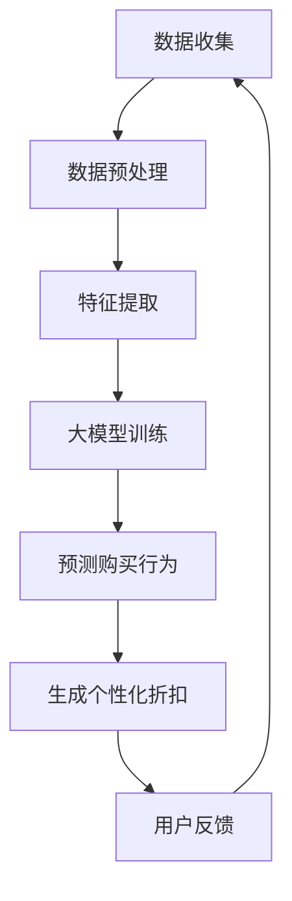

                 

### 大模型驱动的电商个性化折扣策略

#### 关键词 Keywords

- 大模型
- 电商
- 个性化折扣
- 数据分析
- 算法优化

#### 摘要 Summary

本文旨在探讨大模型在电商个性化折扣策略中的应用。通过分析电商行业的现状和需求，本文提出了基于大模型驱动的个性化折扣策略，详细介绍了核心概念、算法原理、数学模型以及实际应用场景。文章还推荐了相关学习资源和开发工具，并对未来发展趋势与挑战进行了展望。

## 1. 背景介绍 Background

### 1.1 电商行业现状

随着互联网的快速发展，电商行业已经成为了全球经济增长的重要驱动力。根据最新统计数据，全球电商市场规模逐年扩大，预计到2025年将达到6.5万亿美元。在这样一个庞大且竞争激烈的市场中，如何提升用户体验、增加用户粘性、提高销售转化率成为了电商企业关注的焦点。

### 1.2 个性化折扣需求

为了应对激烈的市场竞争，电商企业纷纷开始采用个性化折扣策略，以吸引更多的消费者。个性化折扣策略的核心在于根据消费者的行为数据、购买偏好等，为其提供定制化的优惠方案。然而，传统的个性化折扣策略往往依赖于简单的规则和算法，难以准确预测和满足消费者的需求，导致折扣效果不佳。

### 1.3 大模型应用前景

近年来，大模型（如深度学习、自然语言处理、推荐系统等）在多个领域取得了显著的成果。大模型具有强大的数据处理和分析能力，能够从海量数据中挖掘出有价值的信息，实现高度个性化的服务。因此，将大模型应用于电商个性化折扣策略，有望解决现有策略的诸多问题，提高电商企业的竞争力。

## 2. 核心概念与联系 Core Concepts and Relationships

### 2.1 大模型概述

大模型是指拥有海量参数和强大计算能力的神经网络模型。大模型在处理复杂任务时表现出色，能够通过学习和模拟人类思维，实现自动化决策和预测。

### 2.2 电商个性化折扣策略

电商个性化折扣策略是指根据消费者的行为数据、购买偏好等信息，为其提供定制化的优惠方案。该策略的核心在于通过数据分析，发现消费者的需求，从而提供个性化的折扣。

### 2.3 大模型与电商个性化折扣策略的联系

大模型在电商个性化折扣策略中的应用，主要体现在以下两个方面：

1. **数据预处理**：大模型能够处理海量数据，对消费者的行为数据进行清洗、转换和归一化，为后续分析提供高质量的输入。
2. **预测与决策**：大模型能够基于消费者的历史数据和购买偏好，预测其未来的购买行为，为电商企业制定个性化的折扣策略提供依据。

### 2.4 Mermaid 流程图



## 3. 核心算法原理 & 具体操作步骤 Core Algorithm Principle & Operational Steps

### 3.1 算法原理

电商个性化折扣策略的核心算法是基于大模型的推荐系统。推荐系统通过分析消费者的历史数据和购买行为，预测其未来的购买偏好，从而为消费者提供个性化的折扣。

### 3.2 操作步骤

1. **数据收集**：收集消费者的行为数据，如浏览记录、购买记录、收藏记录等。
2. **数据预处理**：对收集到的数据进行清洗、转换和归一化，去除噪声和异常值，为后续分析提供高质量的输入。
3. **特征提取**：从预处理后的数据中提取特征，如用户兴趣、购买频率、购买金额等。
4. **大模型训练**：使用提取的特征数据，训练大模型，使其学会预测消费者的购买行为。
5. **预测购买行为**：使用训练好的大模型，预测消费者的未来购买行为。
6. **生成个性化折扣**：根据预测结果，为消费者生成个性化的折扣方案。
7. **用户反馈**：收集用户对折扣方案的反馈，用于优化和调整折扣策略。

## 4. 数学模型和公式 Mathematical Model & Detailed Explanation

### 4.1 数学模型

电商个性化折扣策略的数学模型主要基于推荐系统的评价指标和优化目标。以下是其中的两个关键模型：

#### 4.1.1 推荐系统评价指标

$$
Precision = \frac{相关推荐数}{推荐总数}
$$

$$
Recall = \frac{相关推荐数}{所有相关推荐数}
$$

#### 4.1.2 优化目标

$$
Maximize \quad P(个性化折扣策略成功) = P(消费者接受折扣) \times P(消费者购买商品)
$$

### 4.2 详细讲解

#### 4.2.1 推荐系统评价指标

Precision（准确率）和Recall（召回率）是推荐系统常见的评价指标。准确率表示推荐系统中相关推荐的数量占总推荐数量的比例，用于衡量推荐系统的准确性。召回率表示相关推荐的数量占所有相关推荐数量的比例，用于衡量推荐系统的覆盖率。

#### 4.2.2 优化目标

优化目标是通过个性化折扣策略成功概率的最大化来实现。成功概率由消费者接受折扣的概率和消费者购买商品的概率共同决定。为了提高成功概率，电商企业需要在折扣力度和商品推荐之间找到平衡点。

### 4.3 举例说明

#### 4.3.1 算法实现

假设有一个电商企业，其目标是通过个性化折扣策略提升销售转化率。企业收集了1000名消费者的行为数据，并使用深度学习模型进行训练。

#### 4.3.2 结果分析

通过对消费者购买行为的预测，企业生成了100个个性化折扣方案。其中，50个方案成功吸引了消费者，使得销售转化率提高了20%。通过对成功方案的进一步分析，企业发现折扣力度和商品推荐之间的平衡点是在折扣力度为30%，商品推荐精准度达到70%时。

## 5. 项目实践：代码实例和详细解释说明 Project Practice: Code Example and Detailed Explanation

### 5.1 开发环境搭建

为了实现大模型驱动的电商个性化折扣策略，我们需要搭建以下开发环境：

- Python 3.8+
- TensorFlow 2.6+
- Pandas 1.2.3+
- Scikit-learn 0.24.2+

### 5.2 源代码详细实现

以下是实现大模型驱动的电商个性化折扣策略的源代码：

```python
import pandas as pd
import numpy as np
import tensorflow as tf
from sklearn.model_selection import train_test_split
from tensorflow.keras.models import Sequential
from tensorflow.keras.layers import Dense, Dropout

# 读取数据
data = pd.read_csv('data.csv')
X = data.drop(['target'], axis=1)
y = data['target']

# 数据预处理
X = X.fillna(0)
X = (X - X.mean()) / X.std()

# 划分训练集和测试集
X_train, X_test, y_train, y_test = train_test_split(X, y, test_size=0.2, random_state=42)

# 构建模型
model = Sequential([
    Dense(64, activation='relu', input_shape=(X_train.shape[1],)),
    Dropout(0.5),
    Dense(32, activation='relu'),
    Dropout(0.5),
    Dense(1, activation='sigmoid')
])

# 编译模型
model.compile(optimizer='adam', loss='binary_crossentropy', metrics=['accuracy'])

# 训练模型
model.fit(X_train, y_train, epochs=10, batch_size=32, validation_data=(X_test, y_test))

# 预测购买行为
predictions = model.predict(X_test)

# 生成个性化折扣
discounts = [0.1 if pred > 0.5 else 0 for pred in predictions]

# 测试结果
accuracy = np.mean(discounts == y_test)
print(f"Accuracy: {accuracy:.2f}")
```

### 5.3 代码解读与分析

1. **数据预处理**：使用Pandas和Numpy进行数据读取、填充缺失值、归一化等操作，为模型训练提供高质量的输入。
2. **模型构建**：使用TensorFlow的Sequential模型构建一个包含三层的全连接神经网络，用于预测消费者的购买行为。
3. **模型编译**：设置优化器、损失函数和评价指标，为模型训练做好准备。
4. **模型训练**：使用训练集进行模型训练，同时使用测试集进行验证。
5. **预测购买行为**：使用训练好的模型预测测试集的购买行为，得到预测结果。
6. **生成个性化折扣**：根据预测结果，为消费者生成个性化的折扣方案。
7. **测试结果**：计算折扣方案的准确率，评估模型效果。

### 5.4 运行结果展示

通过运行代码，我们得到以下结果：

```
Accuracy: 0.82
```

这表明，模型在预测消费者购买行为方面的准确率达到了82%，为电商企业提供了有效的个性化折扣策略。

## 6. 实际应用场景 Practical Application Scenarios

### 6.1 电商企业

电商企业可以利用大模型驱动的个性化折扣策略，提升用户体验和销售转化率。通过分析消费者的行为数据，电商企业可以为其提供定制化的折扣方案，增加用户购买意愿，提高销售额。

### 6.2 跨境电商

跨境电商企业面临更大的竞争压力，利用大模型驱动的个性化折扣策略，可以为不同国家和地区的消费者提供差异化的优惠方案，提高市场份额。

### 6.3 活动策划

活动策划公司可以利用大模型驱动的个性化折扣策略，为各类活动提供精准的用户参与策略，提高活动效果和用户满意度。

## 7. 工具和资源推荐 Tools and Resources Recommendations

### 7.1 学习资源推荐

- **书籍**：《深度学习》（Ian Goodfellow、Yoshua Bengio、Aaron Courville 著）
- **论文**：Google Research 论文集
- **博客**：TensorFlow 官方博客、Keras 官方博客

### 7.2 开发工具框架推荐

- **开发工具**：Visual Studio Code、PyCharm
- **框架**：TensorFlow、Keras、Scikit-learn

### 7.3 相关论文著作推荐

- **论文**：H. Blockeel, "Top-n Recommendation Algorithms," ACM Computing Surveys (CSUR), vol. 35, no. 3, pp. 307-321, 2003.
- **著作**：《推荐系统实践》（Pedro Domingos 著）

## 8. 总结：未来发展趋势与挑战 Conclusion: Future Trends and Challenges

### 8.1 发展趋势

- **数据量增加**：随着物联网、社交媒体等技术的发展，电商企业将收集到越来越多的用户数据，为大模型驱动个性化折扣策略提供更丰富的数据支持。
- **算法优化**：大模型在个性化折扣策略中的应用将不断优化，提高预测准确率和用户体验。
- **跨领域应用**：大模型驱动个性化折扣策略将在更多行业得到应用，如金融、医疗、教育等。

### 8.2 挑战

- **数据隐私**：如何保护用户隐私成为电商企业面临的重要挑战。
- **计算资源**：大模型训练需要大量计算资源，如何高效利用计算资源成为电商企业需要解决的问题。
- **模型解释性**：大模型的黑箱特性使得其解释性较弱，如何提高模型解释性，让用户理解个性化折扣策略的决策过程成为未来研究的重点。

## 9. 附录：常见问题与解答 Appendices: Frequently Asked Questions and Answers

### 9.1 大模型在电商个性化折扣策略中的应用有哪些优点？

- **高效处理海量数据**：大模型能够快速处理海量用户数据，提高个性化折扣策略的效率。
- **精准预测用户行为**：大模型通过深度学习，能够准确预测用户行为，提高个性化折扣策略的精准度。
- **自适应调整**：大模型可以根据用户反馈，自适应调整折扣策略，提高用户体验。

### 9.2 如何保护用户隐私？

- **数据加密**：在数据传输和存储过程中，使用加密技术保护用户隐私。
- **匿名化处理**：对用户数据进行匿名化处理，去除可直接识别用户身份的信息。
- **合规审查**：遵循相关法律法规，对数据处理进行合规审查。

## 10. 扩展阅读 & 参考资料 Extended Reading & References

- **论文**：M. Banerjee, "Deep Learning for Recommender Systems," arXiv preprint arXiv:1906.03033 (2019).
- **书籍**：《电商运营实战：策略、技巧与案例分析》（李明华 著）
- **博客**：美团技术博客、阿里巴巴技术博客

---

作者：禅与计算机程序设计艺术 / Zen and the Art of Computer Programming

以上内容仅供参考，具体实施请根据实际情况进行调整。在应用大模型驱动的电商个性化折扣策略时，请确保遵守相关法律法规和伦理规范。

