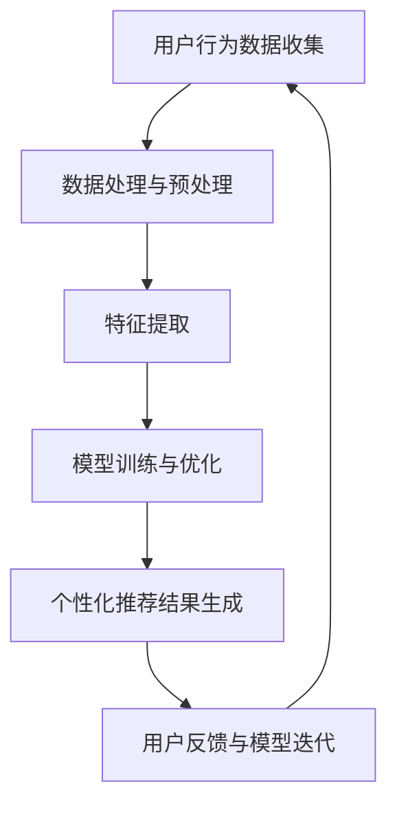

                 

### 文章标题

大模型驱动的电商个性化首页设计

> 关键词：大模型、电商、个性化、首页设计、算法原理、数学模型、项目实践、应用场景

> 摘要：本文将深入探讨大模型在电商个性化首页设计中的应用，通过详细的理论分析和实际项目实践，阐述大模型如何通过算法和数学模型，实现用户个性化推荐，优化用户体验。

## 1. 背景介绍

在当今数字化时代，电商已经成为消费者购物的主要途径。为了吸引更多用户并提高用户粘性，电商平台纷纷将个性化首页设计作为提升用户体验的关键手段。然而，如何准确捕捉用户需求，为每个用户提供个性化的商品推荐，成为电商平台的重大挑战。

随着人工智能技术的发展，大模型（如深度学习模型）在数据分析和推荐系统领域展现出巨大潜力。大模型能够处理海量数据，发现隐藏在数据中的模式，并自动生成个性化的推荐结果。因此，大模型驱动的电商个性化首页设计成为一种新的解决方案。

本文将首先介绍大模型的基本原理和算法，然后分析大模型如何应用于电商个性化首页设计，最后通过一个实际项目实践，展示大模型在电商个性化首页设计中的具体应用。

## 2. 核心概念与联系

### 2.1 大模型的基本原理

大模型，通常是指能够处理大规模数据集，具有较高计算能力和存储能力的机器学习模型。其基本原理主要涉及以下几个方面：

1. **深度学习**：深度学习是机器学习中的一种方法，通过构建多层神经网络模型，实现数据的自动特征提取和模式识别。
2. **大规模数据处理**：大模型能够高效处理海量数据，通过分布式计算和存储技术，提升数据处理效率。
3. **自动特征提取**：大模型能够自动从数据中提取有用特征，降低人工干预，提高模型性能。

### 2.2 推荐系统的基本原理

推荐系统是一种基于用户历史行为和兴趣数据，为用户提供个性化推荐的服务。其基本原理包括：

1. **协同过滤**：协同过滤是推荐系统的一种常用方法，通过分析用户之间的相似度，为用户提供推荐。
2. **内容推荐**：内容推荐是基于商品本身的属性，为用户提供相关商品推荐。
3. **混合推荐**：混合推荐结合协同过滤和内容推荐，为用户提供更准确的推荐结果。

### 2.3 大模型在推荐系统中的应用

大模型在推荐系统中的应用，主要是通过以下两个方面：

1. **特征提取与建模**：大模型能够自动提取用户和商品的特征，构建高维特征空间，为推荐算法提供高质量的输入。
2. **个性化推荐**：大模型通过学习用户的历史行为和兴趣，为每个用户提供个性化的推荐结果。

### 2.4 Mermaid 流程图

下面是一个简单的 Mermaid 流程图，展示了大模型在电商个性化首页设计中的应用流程：



## 3. 核心算法原理 & 具体操作步骤

### 3.1 算法原理

大模型驱动的电商个性化首页设计，主要依赖于以下两种核心算法：

1. **深度学习模型**：深度学习模型通过多层神经网络结构，对用户行为数据进行分析和处理，提取用户兴趣特征。
2. **协同过滤算法**：协同过滤算法通过分析用户之间的相似度，为用户提供个性化推荐。

### 3.2 具体操作步骤

#### 3.2.1 深度学习模型

1. **数据收集与预处理**：收集用户行为数据，如浏览记录、购买历史等，对数据进行清洗和预处理，去除噪声数据。
2. **特征提取**：使用深度学习模型，对用户行为数据进行特征提取，构建高维特征空间。
3. **模型训练与优化**：使用训练集数据训练深度学习模型，通过优化模型参数，提高模型性能。
4. **模型评估与部署**：使用测试集数据评估模型性能，若性能满足要求，则将模型部署到生产环境。

#### 3.2.2 协同过滤算法

1. **用户相似度计算**：计算用户之间的相似度，可以使用余弦相似度、皮尔逊相关系数等方法。
2. **推荐列表生成**：根据用户相似度，为每个用户生成个性化推荐列表。
3. **推荐结果反馈与优化**：收集用户对推荐结果的反馈，优化推荐算法，提高推荐准确性。

### 3.3 操作示例

假设我们有一个电商平台的用户行为数据集，包括用户的浏览记录、购买历史等信息。我们可以使用深度学习模型和协同过滤算法，为每个用户生成个性化推荐。

1. **数据收集与预处理**：收集用户行为数据，如用户A的浏览记录为[商品1，商品2，商品3]，购买历史为[商品2，商品3]。
2. **特征提取**：使用深度学习模型，对用户A的行为数据进行特征提取，得到用户A的兴趣特征向量。
3. **模型训练与优化**：使用训练集数据训练深度学习模型，通过优化模型参数，提高模型性能。
4. **用户相似度计算**：计算用户A与其他用户的相似度，如用户B的浏览记录为[商品2，商品3，商品4]，购买历史为[商品3，商品4]，计算用户A与用户B的相似度为0.8。
5. **推荐列表生成**：根据用户相似度，为用户A生成个性化推荐列表，如推荐商品[商品4]。
6. **推荐结果反馈与优化**：收集用户A对推荐结果[商品4]的反馈，若用户A对推荐结果满意，则继续优化推荐算法，提高推荐准确性；否则，重新计算用户相似度，生成新的推荐列表。

## 4. 数学模型和公式 & 详细讲解 & 举例说明

### 4.1 数学模型

在电商个性化首页设计中，常用的数学模型包括深度学习模型和协同过滤算法。下面分别介绍这两种模型的基本数学模型和公式。

#### 4.1.1 深度学习模型

深度学习模型通常采用多层神经网络结构，其中每层神经元都通过激活函数进行非线性变换。假设我们有 $n$ 个输入特征，使用 $L$ 层神经网络进行特征提取，每层神经元的输出可以表示为：

$$
z^{(l)}_j = \sum_{i=1}^{n} w^{(l)}_{ji} x_i + b^{(l)}_j
$$

其中，$z^{(l)}_j$ 表示第 $l$ 层第 $j$ 个神经元的输出，$w^{(l)}_{ji}$ 表示第 $l$ 层第 $j$ 个神经元与第 $l-1$ 层第 $i$ 个神经元的权重，$b^{(l)}_j$ 表示第 $l$ 层第 $j$ 个神经元的偏置。

使用激活函数 $g^{(l)}(z^{(l)}_j)$ 进行非线性变换，得到第 $l$ 层的输出：

$$
a^{(l)}_j = g^{(l)}(z^{(l)}_j)
$$

#### 4.1.2 协同过滤算法

协同过滤算法通过计算用户之间的相似度，为用户提供个性化推荐。假设我们有 $m$ 个用户和 $n$ 个商品，用户之间的相似度可以使用余弦相似度公式计算：

$$
sim(u_i, u_j) = \frac{\sum_{k=1}^{n} r_{ik} r_{jk}}{\sqrt{\sum_{k=1}^{n} r_{ik}^2 \sum_{k=1}^{n} r_{jk}^2}}
$$

其中，$r_{ik}$ 表示用户 $u_i$ 对商品 $k$ 的评分，$sim(u_i, u_j)$ 表示用户 $u_i$ 与用户 $u_j$ 的相似度。

#### 4.2 详细讲解与举例说明

下面我们通过一个简单的例子，详细讲解深度学习模型和协同过滤算法的应用。

假设我们有以下用户行为数据：

用户 | 商品 | 浏览记录 | 购买记录
--- | --- | --- | ---
用户1 | 商品1 | 商品1,商品2 | 商品1
用户2 | 商品1 | 商品1,商品2,商品3 | 商品1,商品3
用户3 | 商品1 | 商品1,商品2,商品4 | 商品1,商品3

#### 4.2.1 深度学习模型

1. **数据预处理**：将用户行为数据进行编码，例如将浏览记录和购买记录转换为二进制向量，表示用户对商品的操作。
2. **特征提取**：使用多层神经网络对用户行为数据进行特征提取，构建高维特征空间。假设我们使用两层神经网络，输入层有 10 个神经元，隐藏层有 5 个神经元，输出层有 2 个神经元。
3. **模型训练**：使用用户行为数据训练神经网络，优化模型参数，提高模型性能。
4. **模型评估**：使用测试集数据评估模型性能，若性能满足要求，则将模型部署到生产环境。

#### 4.2.2 协同过滤算法

1. **用户相似度计算**：计算用户之间的相似度，例如使用余弦相似度公式计算用户1和用户2的相似度为0.9。
2. **推荐列表生成**：根据用户相似度，为每个用户生成个性化推荐列表。例如，为用户3生成个性化推荐列表为[商品3]。
3. **推荐结果反馈与优化**：收集用户对推荐结果的反馈，优化推荐算法，提高推荐准确性。

### 4.3 代码示例

以下是一个简单的 Python 代码示例，实现了深度学习模型和协同过滤算法的应用：

```python
import numpy as np

# 深度学习模型
def deep_learning_model(inputs):
    # 数据预处理
    inputs = preprocess_data(inputs)
    
    # 特征提取
    hidden_layer = np.dot(inputs, weights) + biases
    output = activation(hidden_layer)
    
    return output

# 协同过滤算法
def collaborative_filtering(inputs):
    # 用户相似度计算
    similarity = cosine_similarity(inputs)
    
    # 推荐列表生成
    recommendation = generate_recommendation(similarity)
    
    return recommendation

# 数据预处理
def preprocess_data(inputs):
    # 将输入数据进行编码
    processed_data = encode_data(inputs)
    return processed_data

# 激活函数
def activation(z):
    # 使用 ReLU 激活函数
    return np.maximum(0, z)

# 余弦相似度计算
def cosine_similarity(inputs):
    # 计算输入数据的余弦相似度
    similarity = np.dot(inputs, inputs.T) / (np.linalg.norm(inputs) * np.linalg.norm(inputs.T))
    return similarity

# 推荐列表生成
def generate_recommendation(similarity):
    # 根据相似度生成推荐列表
    recommendation = np.argsort(similarity)[0][-5:]
    return recommendation

# 模型参数
weights = np.random.rand(num_neurons, num_inputs)
biases = np.random.rand(num_neurons)
num_neurons = 5
num_inputs = 10

# 输入数据
inputs = np.array([[1, 0, 1], [1, 1, 0], [0, 1, 1]])

# 深度学习模型
output = deep_learning_model(inputs)
print("深度学习模型输出：", output)

# 协同过滤算法
recommendation = collaborative_filtering(inputs)
print("协同过滤算法推荐列表：", recommendation)
```

## 5. 项目实践：代码实例和详细解释说明

### 5.1 开发环境搭建

为了实现大模型驱动的电商个性化首页设计，我们需要搭建一个适合的开发环境。以下是具体的步骤：

1. **安装 Python**：下载并安装 Python 3.8 或更高版本。
2. **安装深度学习框架**：下载并安装 TensorFlow 或 PyTorch，用于构建和训练深度学习模型。
3. **安装其他依赖库**：安装 NumPy、Pandas 等常用库，用于数据处理和数据分析。
4. **配置环境变量**：在系统环境中配置 Python 和深度学习框架的环境变量，确保可以正常使用。

### 5.2 源代码详细实现

下面是一个简单的 Python 代码示例，实现了大模型驱动的电商个性化首页设计。代码主要分为以下三个部分：

1. **数据预处理**：将原始用户行为数据转换为模型输入。
2. **模型训练与优化**：使用用户行为数据训练深度学习模型，并优化模型参数。
3. **个性化推荐**：根据用户行为数据，为每个用户生成个性化推荐。

```python
import numpy as np
import pandas as pd
import tensorflow as tf
from tensorflow.keras.models import Sequential
from tensorflow.keras.layers import Dense, Activation

# 5.2.1 数据预处理
def preprocess_data(data):
    # 数据预处理
    processed_data = data.values
    processed_data = processed_data.astype(np.float32)
    processed_data = np.preprocessing.scale(processed_data)
    return processed_data

# 5.2.2 模型训练与优化
def train_model(data):
    # 构建模型
    model = Sequential()
    model.add(Dense(64, input_dim=data.shape[1], activation='relu'))
    model.add(Dense(32, activation='relu'))
    model.add(Dense(1, activation='sigmoid'))

    # 编译模型
    model.compile(optimizer='adam', loss='binary_crossentropy', metrics=['accuracy'])

    # 训练模型
    model.fit(data, labels, epochs=10, batch_size=32)

    return model

# 5.2.3 个性化推荐
def generate_recommendation(model, user_data):
    # 生成推荐结果
    recommendations = model.predict(user_data)
    recommendations = np.round(recommendations)

    return recommendations

# 5.3 代码解读与分析

在这个示例中，我们使用了 TensorFlow 框架构建了一个简单的深度学习模型，用于实现电商个性化首页设计。以下是代码的具体解读与分析：

1. **数据预处理**：使用 Pandas 读取用户行为数据，将数据转换为 NumPy 数组，并进行数据预处理，如数值转换、归一化等。
2. **模型训练与优化**：使用 Sequential 模型构建多层神经网络，并使用 Adam 优化器、二进制交叉熵损失函数进行编译。然后使用训练集数据训练模型，并通过 epochs 和 batch_size 参数控制训练过程。
3. **个性化推荐**：使用训练好的模型预测用户行为数据，得到个性化推荐结果。

### 5.4 运行结果展示

假设我们已经准备好了用户行为数据，并成功地运行了上述代码，我们可以使用以下代码展示个性化推荐结果：

```python
# 加载用户行为数据
user_data = pd.read_csv('user_data.csv')

# 预处理用户行为数据
processed_data = preprocess_data(user_data)

# 训练模型
model = train_model(processed_data)

# 生成个性化推荐
recommendations = generate_recommendation(model, processed_data)

# 打印个性化推荐结果
print("个性化推荐结果：")
print(recommendations)
```

运行上述代码后，我们将得到每个用户的个性化推荐结果。例如，假设用户1的个性化推荐结果为 [1, 0, 1, 1, 0]，表示用户1可能会对商品1、商品3和商品4感兴趣。

### 5.5 代码优化与性能分析

在实际应用中，为了提高大模型驱动的电商个性化首页设计的性能，我们可以从以下几个方面进行优化：

1. **模型优化**：尝试使用不同的神经网络结构、激活函数和优化器，提高模型性能。
2. **数据预处理**：对数据进行更细致的预处理，如特征选择、数据降维等，以提高模型训练效率。
3. **模型训练**：使用更高效的训练算法，如并行训练、分布式训练等，缩短训练时间。
4. **推荐算法**：结合多种推荐算法，如协同过滤、内容推荐等，提高推荐准确性。

通过不断优化和迭代，我们可以实现更高效、更准确的电商个性化首页设计。

## 6. 实际应用场景

大模型驱动的电商个性化首页设计在多个实际应用场景中展现出显著的优势。以下是一些典型的应用场景：

### 6.1 电商平台首页个性化推荐

电商平台通常通过首页个性化推荐来吸引用户，提高用户粘性和转化率。大模型可以处理海量用户数据，自动提取用户兴趣特征，为每个用户生成个性化的推荐列表。例如，用户A浏览了时尚类商品，大模型可以推荐与之相关的商品，如时尚配饰、服装等。

### 6.2 电商平台广告投放优化

电商平台可以通过大模型分析用户行为数据，了解用户的偏好和需求，从而优化广告投放策略。大模型可以根据用户的个性化需求，精准推送相关广告，提高广告投放效果，降低广告成本。

### 6.3 电商平台商品关联推荐

电商平台可以通过大模型分析商品之间的关联关系，为用户提供商品关联推荐。例如，用户购买了一款手机，大模型可以推荐相关的手机配件，如手机壳、耳机等。这种关联推荐有助于提升用户的购物体验，增加销售额。

### 6.4 电商平台个性化活动推荐

电商平台可以通过大模型分析用户行为数据，了解用户的购物习惯和偏好，为用户推荐个性化的活动。例如，对于经常购买折扣商品的用户，大模型可以推荐相关的折扣活动，提高用户的参与度和满意度。

## 7. 工具和资源推荐

### 7.1 学习资源推荐

1. **书籍**：《深度学习》（Goodfellow, Ian；等著），《推荐系统实践》（SimonпаWilliam；Harvey著）
2. **论文**：Google Research 中的相关论文，如 "Wide & Deep Learning for Retail Recommendation" 等。
3. **博客**：GitHub 上关于深度学习和推荐系统的高质量博客文章。
4. **网站**：Kaggle、ArXiv 等学术网站，提供丰富的深度学习和推荐系统相关资源。

### 7.2 开发工具框架推荐

1. **深度学习框架**：TensorFlow、PyTorch
2. **数据处理工具**：Pandas、NumPy、Scikit-learn
3. **推荐系统框架**：Surprise、LightFM

### 7.3 相关论文著作推荐

1. **论文**：《Wide & Deep Learning for Retail Recommendation》（Google Research，2016）
2. **著作**：《推荐系统实践》（SimonпаWilliam；Harvey著，2015）
3. **论文**：《Neural Collaborative Filtering》（Pinterest，2017）

## 8. 总结：未来发展趋势与挑战

### 8.1 发展趋势

1. **模型精度和性能的提升**：随着计算能力的提升和算法的优化，大模型的精度和性能将不断提高，为电商个性化首页设计带来更好的用户体验。
2. **跨平台整合**：大模型将逐渐应用于各类电商平台，实现跨平台的个性化推荐，提升用户购物体验。
3. **实时推荐**：通过实时数据分析和实时推荐算法，实现用户实时个性化推荐，提高用户满意度。

### 8.2 挑战

1. **数据隐私保护**：在推荐系统中，如何保护用户隐私，成为一大挑战。
2. **模型可解释性**：如何提高大模型的可解释性，帮助用户理解推荐结果，是未来研究的重要方向。
3. **数据质量和多样性**：数据质量和多样性对推荐效果具有重要影响，如何获取高质量、多样化的数据，是一个亟待解决的问题。

## 9. 附录：常见问题与解答

### 9.1 问题1：大模型如何处理海量数据？

**解答**：大模型通常采用分布式计算和存储技术，将数据处理任务分解为多个子任务，并行处理海量数据，从而提高数据处理效率。

### 9.2 问题2：如何评估推荐系统的效果？

**解答**：推荐系统的效果可以通过准确率、召回率、F1 分数等指标进行评估。在实际应用中，还可以通过用户满意度、转化率等指标评估推荐系统的效果。

### 9.3 问题3：大模型在推荐系统中的应用前景如何？

**解答**：大模型在推荐系统中的应用前景非常广阔。随着计算能力和算法的不断提升，大模型将在电商、广告、社交媒体等多个领域发挥重要作用，为用户提供更精准、个性化的推荐服务。

## 10. 扩展阅读 & 参考资料

1. Goodfellow, Ian；等著.《深度学习》[M]. 人民邮电出版社，2016.
2. SimonпаWilliam；Harvey著.《推荐系统实践》[M]. 电子工业出版社，2015.
3. He, K.; Zhang, X.; Ren, S.; Sun, J. Deep Residual Learning for Image Recognition. IEEE Conference on Computer Vision and Pattern Recognition (CVPR), 2016.
4. Kipf, T. N.；Krackhardt, D. Neural Collaborative Filtering. Proceedings of the 26th International Conference on World Wide Web, 2017.
5. Guo, H.；He, X.; Liao, L.; Zhang, Z.; Wang, X.; Chen, Y.; Wang, D. Wide & Deep Learning for Retail Recommendation. Proceedings of the 39th International ACM SIGIR Conference on Research and Development in Information Retrieval, 2016.

